# 破解盒子演练—正斜杠

> 原文：<https://infosecwriteups.com/hack-the-box-walkthrough-forwardslash-9036c5422e67?source=collection_archive---------0----------------------->

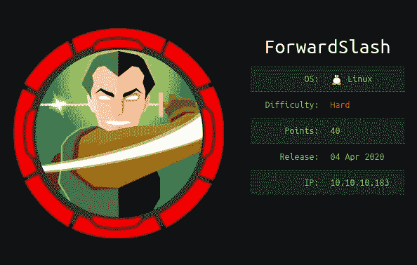

https://www.hackthebox.eu/home/machines/profile/239

> 正斜线是由[InfoSecJack](https://www.hackthebox.eu/home/users/profile/52045)&[chiva to](https://www.hackthebox.eu/home/users/profile/44614)创造的硬难度机器。我的过程包括本地文件包含(LFI)、自定义二进制漏洞和加密。
> 
> 这是一个未加工的预演，所以我在一个又一个拉比面前跌倒的过程在这里有很好的记录。它也反映了我在使用机器时的思考过程，我希望这能帮助其他像我一样的有抱负的渗透测试人员更好地思考。

## 总结:

这台机器从一个非交互式的被黑网页开始。我们需要列举我们的方法来找到一个备份网页，我们后来发现它实际上容易受到 LFI 攻击，当成功利用时，会泄漏服务器中包含的一个`php`文件中的硬编码凭据。在获得初始 shell 后，我们需要开发一个定制的备份程序，以便能够横向遍历到其他用户。这个用户拥有特定的 sudo 权限，我们可以利用这些权限成为 root 用户，但是要等到我们能够从使用自定义加密算法的密码中提取密钥之后。

在本演练中，我将在最后留下上标作为讨论点。

在我开始之前，我会将机器的 IP 地址添加到我的`/etc/hosts`文件中，以便于访问。

```
$ sudo vi /etc/hosts
~ 10.10.10.183    forwardslash.htb
```

## 初步侦察

```
$ nmap -p- --min-rate 1000 -T4 forwardslash.htb
$ nmap -sC -sV -T4 -p 22,80 forwardslash.htb -oN nmap.txt
```

我使用第一个 nmap 命令来确保我能够覆盖我正在测试的机器的所有端口。一旦第一个命令返回它的初始结果，我就在第二个 nmap 命令中插入可用端口，以便更详细地查看。

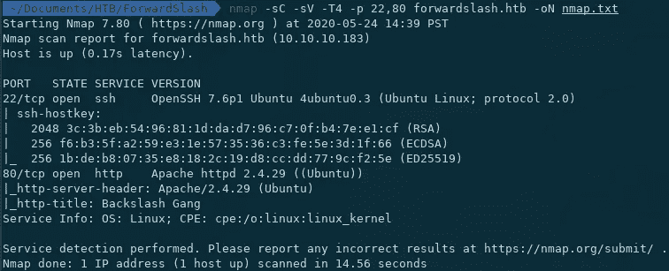

详细的 nmap 结果

这很简单，因为通常的端口 22 和 80 在这台机器上是开放的。


看来他们被黑了哈哈

这是我查看主页时看到的。这是一个完全没有互动性的网站。我第一次检查这个的时候，我实际上退出并解决了另一台机器，因为我当时被深深地吓倒了。lol。

当我回到解决这个问题的时候，因为我没有别的办法，我开始在网站上搜索我能处理的面包屑。

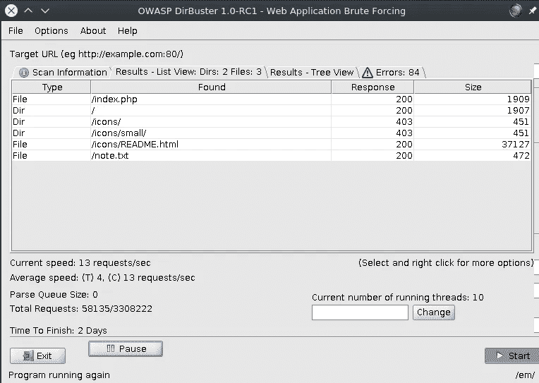

当它看起来很有趣时，我就给它加了屏幕保护，并且在检查资源时，它给出了以下线索:

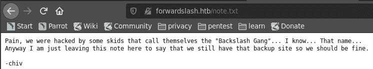

也就是说“兄弟，Issa 恶作剧，你需要列举更多”

## VHOST 和备份网站

在检查了更多的东西后，我什么也没发现。然后我想起来，我还没有尝试过域枚举。回到上面的线索，我试图通过添加条目`backup.forwardslash.htb`来编辑我的`/etc/hosts`文件

```
$ sudo vi /etc/hosts
~ 10.10.10.183    forwardslash.htb  backup.forwardslash.htb
```

一进入域名，这个页面就出现在我面前:

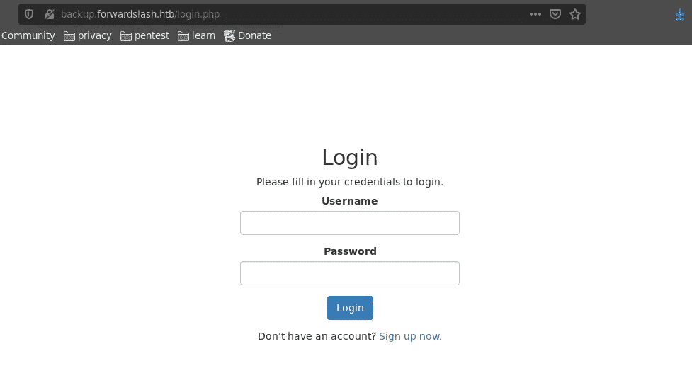

好的

我尝试了一些常见的 SQLI 有效载荷，但我没有得到任何地方。然后我试了试常用的用户名和密码，一些有趣的事情出现了。

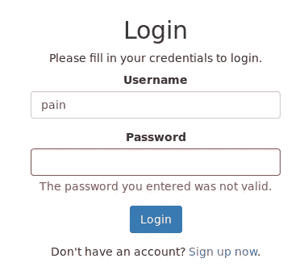

尝试用户名 pain 时，错误消息与其他用户名不同，如下所示:

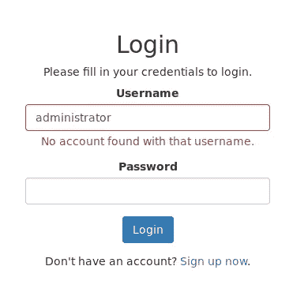

所以看到这个，我立刻想到也许我可以模糊疼痛的密码，所以我尝试了以下方法:

```
$ wfuzz -z file,/usr/share/wordlists/rockyou.txt -d "username=pain&password=FUZZ" --hc 302 http://backup.forwardslash.htb/login.php
```

我什么都没有。我也尝试过使用自定义单词表，但是意识到这已经占用了我太多的时间，我停下来，让我的大脑休息一下，然后尝试另一种方法。

然后我注册了一个帐户，这样我就可以探索 web 应用程序的内部工作方式。

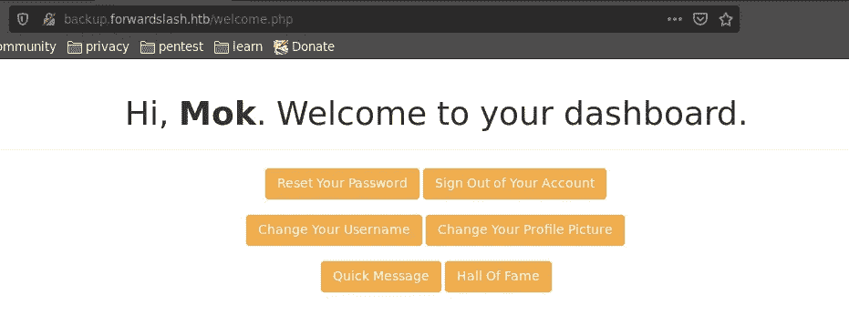

这个仪表板有很多功能

**广告:**我个人喜欢这条短信，内容如下。

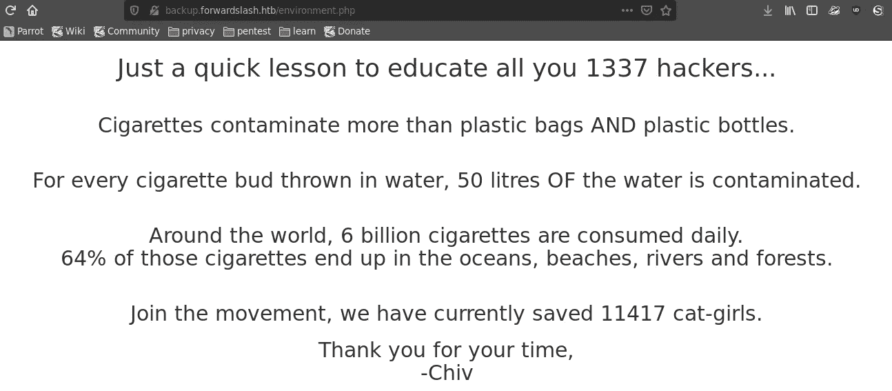

吸烟有害健康哈哈哈 jk。如果你觉得有必要，请负责任地去做

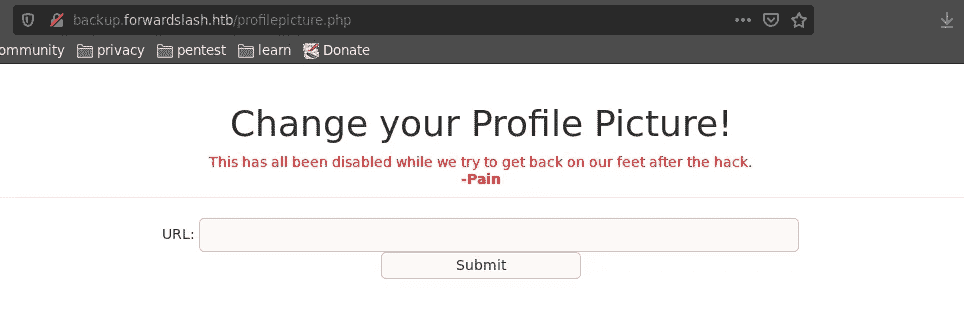

这个功能非常有趣，因为它允许客户端在文本字段中提交任何内容，但是它目前是禁用的，您不能在文本框中键入任何内容。或者是？

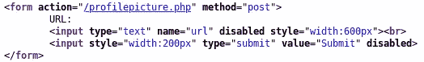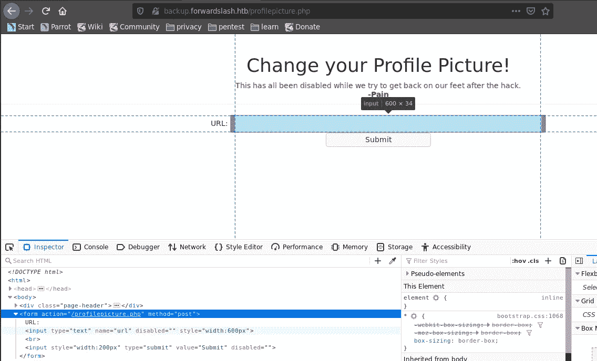

检查网页的元素，我们可以看到上面的细节，很明显，我们可以通过简单地删除`disabled`控件来覆盖它，让我们更好地与页面交互。

我不确定这种特殊的控制是否是为了阻止未来的黑客攻击，但是禁用 html 代码中的东西并不是最好的方法。

## LFI 枚举和用户 Chiv

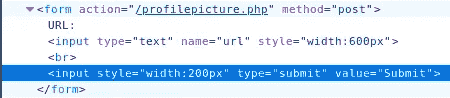

玩了一会儿后，我脑海中的第一个想法是，它可能容易受到 LFI /射频干扰的影响。

检查网站如何接受输入的一种方法是通过 burpsuite 拦截流量。就我个人而言，我对使用 burpsuite 不是很精通，因为我在需要时才知道它的不同用途，所以我不能发布一个可靠的 burpsuite 教程，但是，对于我们当前的目的，我使用下面的链接作为我的主要资源

[](https://www.hackingarticles.in/beginner-guide-file-inclusion-attack-lfirfi/) [## 本地文件包含综合指南(LFI)

### 在这个深层的在线世界中，动态 web 应用程序很容易被攻击者攻破，原因是…

www.hackingarticles.in](https://www.hackingarticles.in/beginner-guide-file-inclusion-attack-lfirfi/) 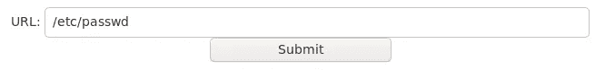

试验有效载荷

截取这个输入会产生下面的输出

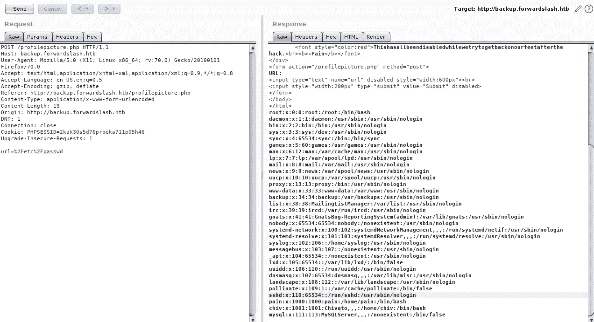

我们拿到了密码文件的内容！然而，到目前为止，这个结果仅仅证明了 web 应用程序对于 LFI 是可接受的。我们需要的是可以用来以外壳的形式在机器中建立立足点的向量，例如有效的凭证等。

Payloadsallthethings 有一个很好的存储库，既可以存储有趣的文件路径，也可以存储 RFI/LFI 负载

[](https://github.com/swisskyrepo/PayloadsAllTheThings/tree/master/Directory%20Traversal) [## swisskyrepo/payloads all things

### 目录或路径遍历在于利用用户提供的不充分的安全验证/净化…

github.com](https://github.com/swisskyrepo/PayloadsAllTheThings/tree/master/Directory%20Traversal) [](https://github.com/swisskyrepo/PayloadsAllTheThings/tree/master/File%20Inclusion#lfi--rfi-using-wrappers) [## swisskyrepo/payloads all things

### 文件包含漏洞允许攻击者包含文件，通常利用“动态文件包含”…

github.com](https://github.com/swisskyrepo/PayloadsAllTheThings/tree/master/File%20Inclusion#lfi--rfi-using-wrappers) 

上面粘贴的两个链接重定向到同一个 git repo 中的不同页面

在耗尽大量时间检查所有已知页面后，我找不到任何值得注意的内容。

完全没有帮助我进入下一步，所以我决定再次对域运行 dirbuster:backup . forward slash . htb。我得到了结果，并注意到除了已知的文件夹之外，还有另一个返回代码为 403(禁止)的文件夹，名为 dev/尝试打嗝时:

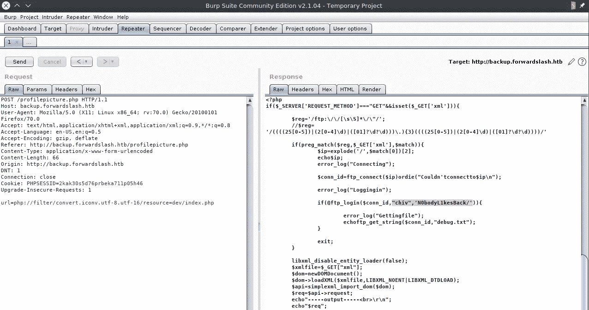

有信用！！

我们获得的第一个用户的凭据如下:

*   **用户名:** chiv
*   **密码:**n0 body 1 kesback/

## 外壳枚举、定制二进制和用户痛苦

```
$ ssh chiv@backup.forwardslash.htb
```


我们找到了一个能用的弹壳！它也很棒。

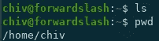

但是很奇怪，因为在 chiv 的主目录中没有文件。检查主目录中的另一个用户，我们会看到下面的结果。

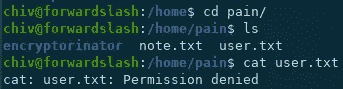

我们需要先横向移动到 pain，然后才能读取用户标志。

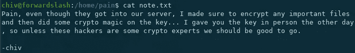

还有一个文件夹`encryptorinator`包含以下内容。

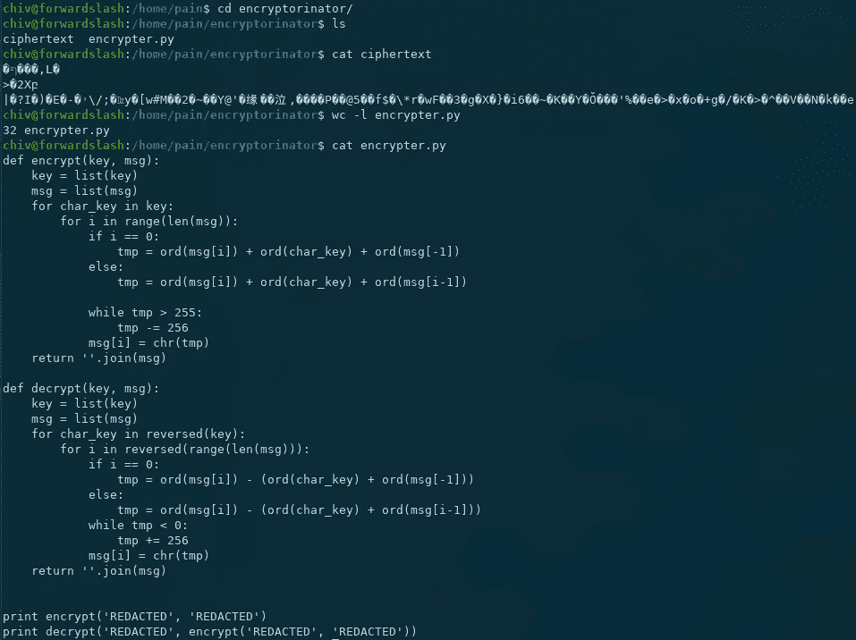

关于上述发现的一些注意事项:

*   我们以用户`pain`的形式确定了 1 个横向移动目标
*   用户`chiv`留下了关于自定义密码算法和一些重要密码的线索

上述发现为我们提供了一个明确的目标，即横向遍历到用户`pain`，然后解密留在他的文件夹中的密码，然而，到目前为止，还没有明确的方法来做到这一点，所以我们继续进行枚举。

出于本能，我检查了 pain 拥有的文件，看看是否有我可以使用的向量。下面附上我在解决这台机器时觉得有趣的发现的截屏。

```
$ find / -user 'pain' 2>/dev/null | grep -v proc
```

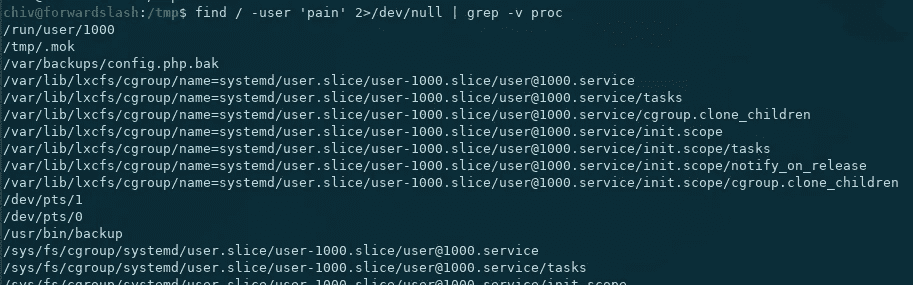

痛苦拥有一个有趣的二进制

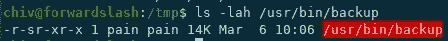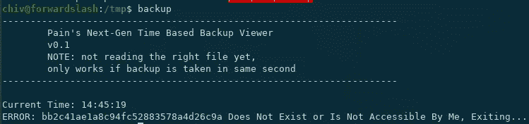

奇怪的错误信息

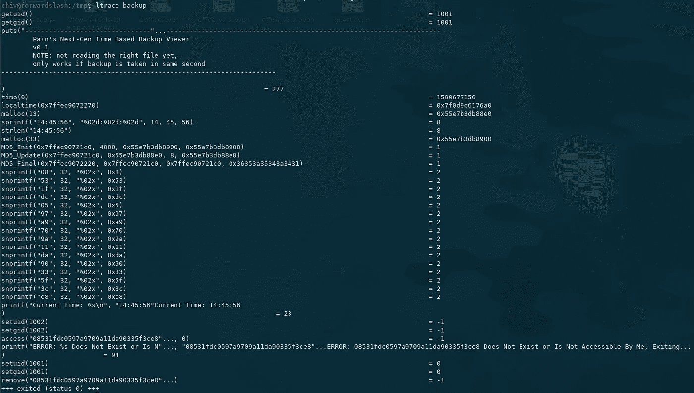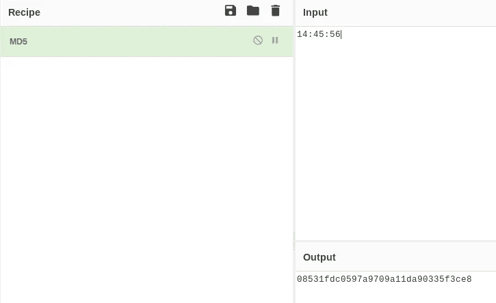

用赛博咖啡来取样时间和格式，然后这个出来了

在检查用户 pain 拥有的二进制文件时，我们了解到以下内容:

*   它被称为 *Pain 的下一代基于时间的备份浏览器*
*   运行它会返回一个混乱的字符串，我们后来发现这是当前时间的 MD5 散列

因此,`/usr/bin/backup`二进制文件实际上获得了当前的系统时间，获得了它的 md5 散列，然后尝试用那个文件名打开一个文件。正如您从`access function`中看到的，在`ltrace`截图中，文件名没有使用绝对路径，因此我们可以通过创建一个文件来利用它，该文件使用设定时间的 md5 散列作为其文件名，然后在该特定时间运行它。

我们想打开什么呢？

从二进制文件的标题来看，它被称为*下一代基于时间的备份查看器*，所以一个线索是作者创建它来查看备份。

让我们找到所有文件扩展名为`.bak`的文件。

```
$ find / -name '*.bak' 2>/dev/null
```

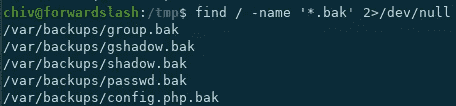

所有以`.bak`作为文件扩展名的文件都保存在`/var/backups`中，所以也许我们可以检查哪个是有用的/有趣的。

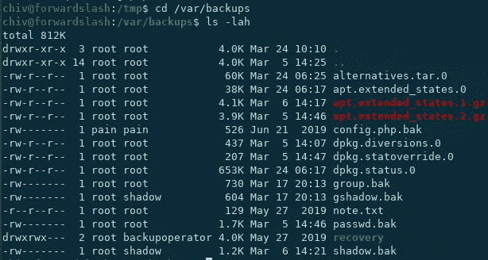

/var/backups

一个文件归 pain 所有，因此本能地，我们首先选择那个文件。但是我们如何将它重命名为当时的 md5 哈希呢？

由于我们不能执行任何操作来编辑甚至读取这个文件，我们可以创建另一个文件，它通过使用符号链接与这个文件相连。

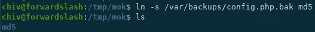

创建了一个名为“md5”的符号链接

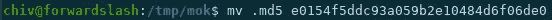

将符号链接重命名为特定时间的 md5 哈希

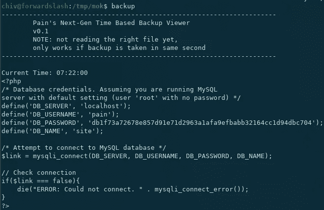

在特定时间运行二进制文件

我不记得为什么我分三步做了上面的事情，但我的直觉是，由于在那之前我做了复杂的计数，我在那段时间里只有最少的脑力。呵呵。下面给出了一个更好的解决方案:

```
$ ln -s /var/backups/config.php.bak $(date | awk -F ' ' '{print $4}' | md5sum | awk -F ' ' '{print $1}') && backup
```

运行这个会立即打印出`/var/backups/config.php.bak`的内容，你知道我也可以做 bash 脚本。哈哈哈哈。jk。

我们获得的第一个用户的凭据如下:

*   **用户名:**痛苦
*   **密码:**db 1 f 73 a 72678 e 857d 91 e 71d 2963 a fa9 ef babb 32164 cc1 d 94 DBC 704

## 加密机

由于备份文件的输出包含 DB 凭证，我本能地尝试使用下面的命令转储数据库。

```
$ mysqldump --opt -u pain --password site > site.sql
```

我得到了一个错误。然后，我尝试使用这些最近转储的凭据切换到用户痛处，并且成功了。


在横向移动到用户 pain 时，我立即检查了 pain 被授权以 root 用户身份运行的命令，而系统不要求任何密码。我通常这样做是为了检查我是否可以劫持这些二进制文件，或者为它们找到一个漏洞，这样我就可以获得 root 访问权限。

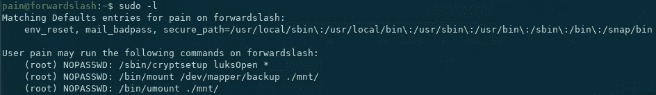

然而，在检查了上面的内容之后，我并不清楚如何使用这些命令来获得 root 权限，所以我暂时忽略了它，并返回到 pain 的主目录来更仔细地查看我们之前看到的`encryptorinator`文件夹。


为了更好地理解这种情况，我认为我们需要对 pain 主目录中的密文进行解密。

因为我对逆转给定的加密算法没有信心，所以我写了一个简单的纯暴力脚本。

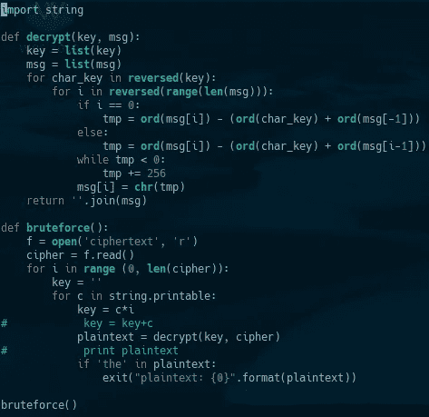

有趣的是，我正在调试我的脚本，突然，在运行它时，它工作了。我没想到用一个`key`的重复字符就能破解密码，但它做到了。⁴

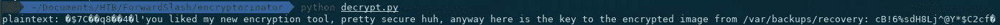

```
plaintext: �$7C��q8��4�l'you liked my new encryption tool, pretty secure huh, anyway here is the key to the encrypted image from /var/backups/recovery: cB!6%sdH8Lj^@Y*$C2cf�
```

## Cryptsetup 和 luksOpen、私钥检索和 SSH 到 Root

显然，我们一直在寻找的是一个加密的 LUKS 卷的密码，我们将打开该卷并随后使用`luksOpen.`进行映射。映射后，我们可以将它挂载到一个特定的文件夹，然后最终查看其内容。为了进一步了解 LUKS 和 crypsetup，我使用了以下指南。

 [## 用 LUKS 加密 Linux 分区的基本指南

### 人们需要加密分区的原因有很多。无论是植根于隐私、安全…

linuxconfig.org](https://linuxconfig.org/basic-guide-to-encrypting-linux-partitions-with-luks) [](https://www.cyberciti.biz/security/howto-linux-hard-disk-encryption-with-luks-cryptsetup-command/) [## 用 LUKS [cryptsetup 命令] - nixCraft 加密 Linux 硬盘

### 亲爱的尼克拉夫特，我几乎到哪里都带着我的 Linux 笔记本电脑。如何保护我存储在…上的私人数据

www.cyberciti.biz](https://www.cyberciti.biz/security/howto-linux-hard-disk-encryption-with-luks-cryptsetup-command/) 

我前面描述的工作流的屏幕截图:

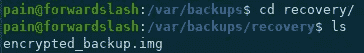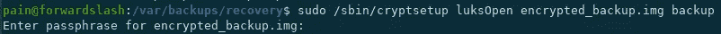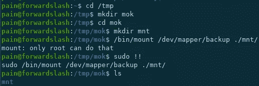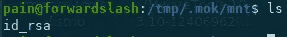

毕竟，我们本质上追求的不是利用正在运行的应用程序，或者劫持用户能够通过 sudo 运行的二进制文件/命令，而是检索根私钥的备份。然后可以使用这个私钥通过 ssh 登录，如下所示。

```
$ scp pain@forwardslash.htb:/tmp/.mok/mnt/id_rsa .
```

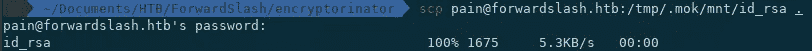

我首先把私钥偷偷放进了我的机器

```
$ chmod 600 id_rsa
$ ssh -i id_rsa root@forwardslash.htb
```


有根！

我们终于扎根了！

## 其他讨论要点和要点

1.  我为这台机器做 VHOST 枚举的方法充其量是本能的，这种方法的问题是它不会总是工作，这可能最终导致挫折。更好的方法是使用单词表来模糊 vhosts。一个示例工作命令如下。

```
$ gobuster vhost -u [http://forwardslash.htb](http://forwardslash.htb) -w /usr/share/dnsrecon/subdomains-top1mil-20000.txt
```

2.我们之所以能够向前发展，很大程度上是因为一个本应被禁用的特定网络功能被禁用得很糟糕。如果您还没有准备好使用它，要么备份它以备后用，然后将其删除，要么遵循安全编码实践并正确过滤输入。

3.让 LFI 如此有效的原因是文件系统有如此多的众所周知的位置，尽管攻击者没有外壳可以使用，但这些位置可以提供关于机器的许多细节。因此，建议在尝试检查您甚至不确定是否存在的文件之前，使用已知的文件和文件路径。此外，如果使用特定的应用程序，如果您不完全确定您在做什么，只是为了检查非常特殊的文件的位置，将它安装在沙箱/一次性系统中是一种不错的技术。实际上，我最近在解决机器虎斑猫时使用了这种技术。

4.我对我的暴力解密器脚本是如何工作的非常感兴趣，所以我联系了其他能够解决这个问题的人，并得到了不同的反馈。人们可以使用`rockyou.txt`单词表破解密码，然而，奇怪的是它对单词表中的多个单词都有效。不要睡在你的暴力脚本上。lol。

这台机器通常很简单，坦白地说，对我来说最可怕的部分是立足点和暴力脚本。

我的演练到此结束。感谢您的阅读！