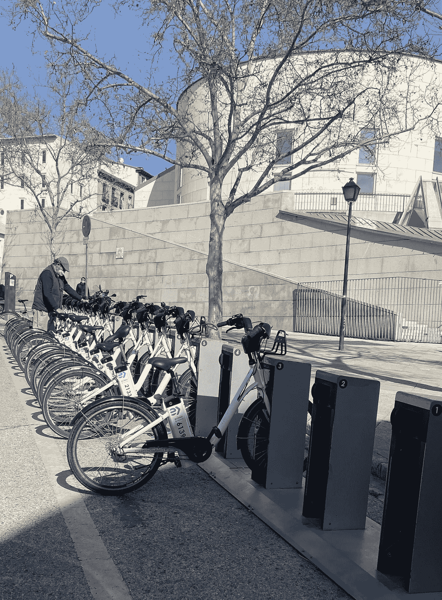
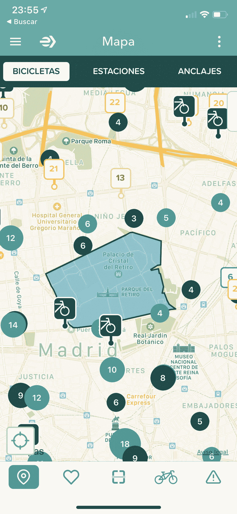
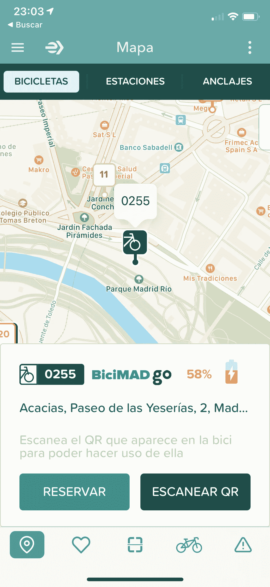
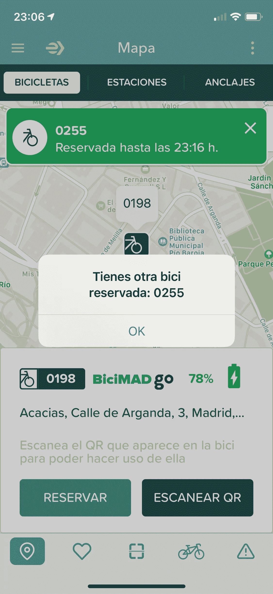
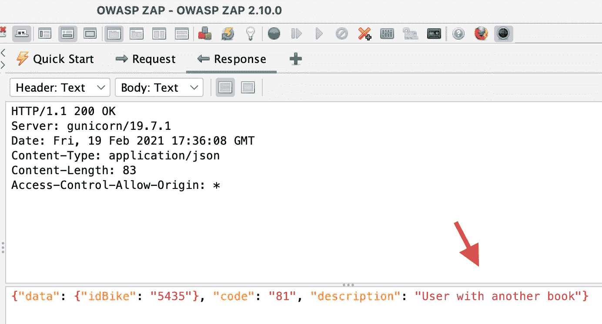
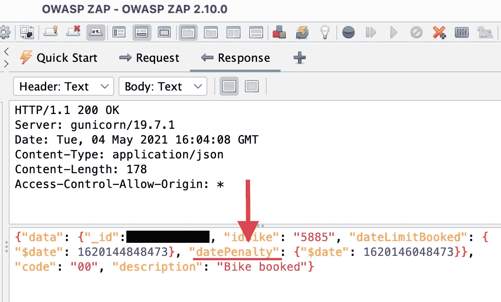
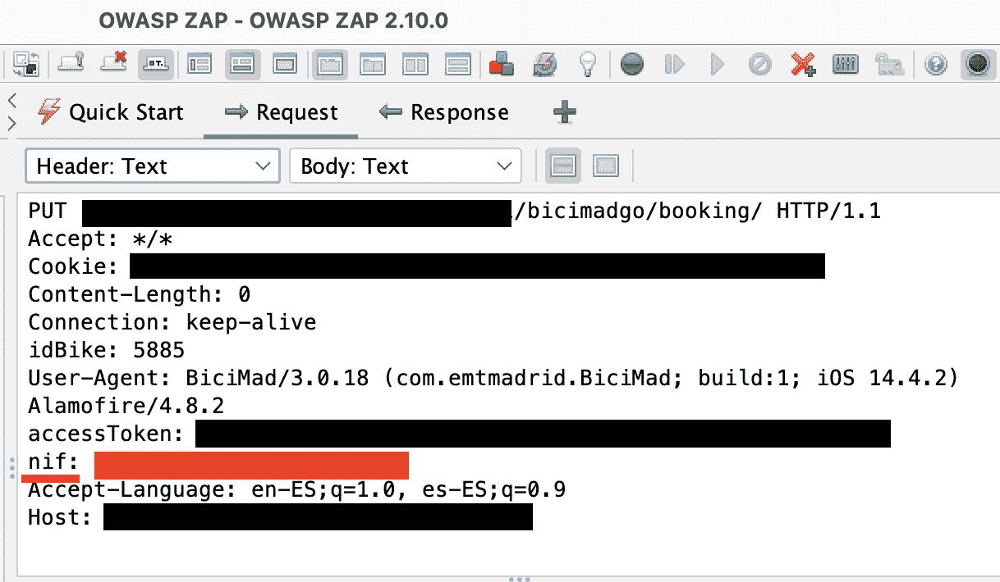
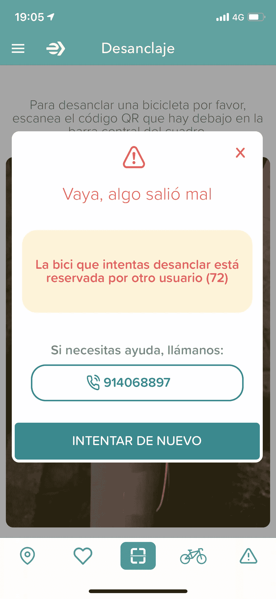
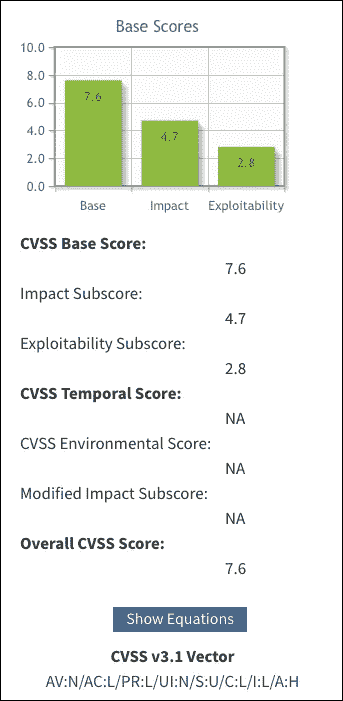

# 黑客攻击我,黑客攻击我来了 – BiciMAD Go 案件

> 原文：<https://infosecwriteups.com/hackeando-voy-hackeando-vengo-el-caso-bicimad-go-e256adf6fe8?source=collection_archive---------4----------------------->

## 马德里公共自行车租赁服务中的漏洞

2014 年,马德里市议会通过推出自己的公共自行车租赁服务(T0) BiciMAD(T1)来大力推动移动出行。

使用 BiciMAD,您可以从 264 个可用站点中的任何一个站点上骑自行车。

在这个故事中,我将解释我如何在*BiciMAD Go*服务中发现一个**漏洞,该漏洞允许攻击者预订所有可用的自行车**。

> **免责声明**:本故事中表达的观点是作者的观点,并不反映 BiciMAD 的观点。此事件已得到适当通知,并已采取适当措施解决。

# 关于 BiciMAD Go

在 2020 年秋天 - 一个难以忘怀的年份 - *BiciMAD* 增加了一种名为 *BiciMAD Go* 的新模式,其中包括 454 辆免费自行车。

与现有自行车的区别在于,后者不需要在旅程结束时停靠在车站上。您可以将它们放在允许区域内的任何地方。

找到这些自行车的最简单方法是使用*BiciMAD*的官方应用程序。

在应用程序地图中,您可以找到车站,免费使用的自行车和禁区

您可以预订自行车 10 分钟,以防止其他用户在您之前抓住它。

预订自行车会给你足够的时间到达你的位置,没有人会把它从你。

我是一个非常好奇的人,对网络安全充满热情,所以当我看到像这样的功能时,我会想到在哪些关键点可能存在实现错误 。所以当我看到预订自行车的选项时,我想:

> 可以同时预订多辆自行车吗?

**允许用户一次预订多辆自行车可能会损害自行车的可用性**,因此可以期待某种控制。

尝试预订另一辆自行车时,App 中会出现描述性错误

**为了有效,此控件应该在服务器上运行**,但这不是我第一次在客户端看到这种类型的控件,在那里很容易跳过它。

为了了解在 *BiciMAD* 应用程序的网络级别发生了什么,我设置了一个代理 [*OWASP ZAP*](https://www.zaproxy.org/) 来查看应用程序和服务器之间的请求交换。

使用代理,我们可以看到应用程序和 BiciMAD 服务器之间的请求交换

在检查捕获的网络流量后,我发现**控件已在服务器端**上正确实现。

在预订请求中,我们可以看到服务器的响应,包括错误

此外,我意识到**如果您在预订 10 分钟后尝试预订另一辆自行车,您将被罚款 30 分钟**。

在预订请求的响应中,我们可以看到临时的惩罚窗口

此控制可防止用户通过每 10 分钟预订一辆自行车来损害自行车的可用性。

> 鉴于有几个控制措施可以保护自行车的可用性,这似乎是故事的结局......不是吗?

# 一个安全漏洞

**某些控制措施的存在并不意味着这些控制措施得到了很好的实施(T5)。看一看自行车预订请求,我意识到**我的 NIF 正在发送到**报头。**

预订请求中的“nif”字段引起了我的注意

将用户的 NIF 发送到头**允许攻击者轻松更改值**,所以我开始怀疑......

> 此 NIF 是否会在服务器上进行验证?

使用 Postman,我复制了预订请求**,将我的 NIF 替换为 00000013B**——一个无效的 NIF——并且**请求似乎被接受了**。

此分类下一篇: What The Hell - Obama & [Giphy](https://giphy.com/gifs/wtf-obama-wth-pPhyAv5t9V8djyRFJH)

通过预订终端点的查询,我能够验证自行车是否已正确预订。更糟糕的是,**在**服务器上没有对该字段的任何验证。

这意味着**可以使用任意值**预订任何自行车,例如 *'1',* *'hello'* ,甚至可以将字段留空。所以我问自己...

> 是否可以利用此漏洞对 BiciMAD Go 执行拒绝服务攻击?

# 剥削

**拒绝服务(DoS)** 是一种攻击类型,其中恶意攻击者**试图破坏设备或资源**的正常操作,使其不可用或响应时间非常慢。

我对这些“道德黑客”的意图是帮助提高我使用的应用程序的安全性,以便将来对每个人都更安全。

拒绝 *BiciMAD Go* 服务将对 *BiciMAD* 造成经济后果,并将跨越道德黑客的界限,除了法律影响之外。

> 凭借所收集的证据和一些技术知识,很明显,这次袭击是可以进行的。

虽然我不想损害自行车的可用性,但我想对一小群自行车进行**概念验证。**

开始工作,创建一个脚本,使用随机生成的 NIF 在我家附近预订一组选定的自行车。

然后,我运行了脚本,走到街上,试图使用预订的自行车。当我尝试解锁它们时,该应用程序显示了一个错误,确认自行车已经预订。

应用程序中显示的错误确认拒绝服务攻击是可能的

10 分钟后,我让我的妻子再次运行脚本,以便我可以确认自行车在 10 分钟内仍然不可用。

**暂时惩罚控制被证明是完全无用的** ,因为惩罚似乎被分配给用户的 NIF,这可以随机生成。

一旦确认攻击是可行的,现在是时候通知**事件**,以便可以纠正它,并提供复制它的所有技术细节。

# 最终反思

此漏洞允许攻击者使用任意 NIF 预订任何自行车,从而影响自行车的可用性。

我还发现可以使用其他用户的 NIF 预订自行车,**也会影响*BiciMAD Go***服务的完整性。

在经济方面,服务价格 *BiciMAD Go* - 每分钟 0.19 欧元 - 使这项服务成为 **BiciMAD** 的重要资产。

在我看来,易于利用以及 *BiciMAD Go*对服务的影响将此安全漏洞转化为**高严重性**漏洞。

我自己提出的向量[CVSS](https://nvd.nist.gov/vuln-metrics/cvss)v3.1 返回的基本分数为 7.6

虽然利用此漏洞可以执行的最具破坏性的攻击是拒绝服务,但它也可以用于**在某些地区悄悄地减少自行车的可用性**,这对竞争对手公司来说非常有利。

> 如果你喜欢这个故事,并有兴趣在[Medium](https://medium.com/@h_martos)、[Twitter](https://twitter.com/h_martos)或[LinkedIn](https://www.linkedin.com/in/hector-martos-gomez/)关注更多。
> 
> 谢谢你的时间!