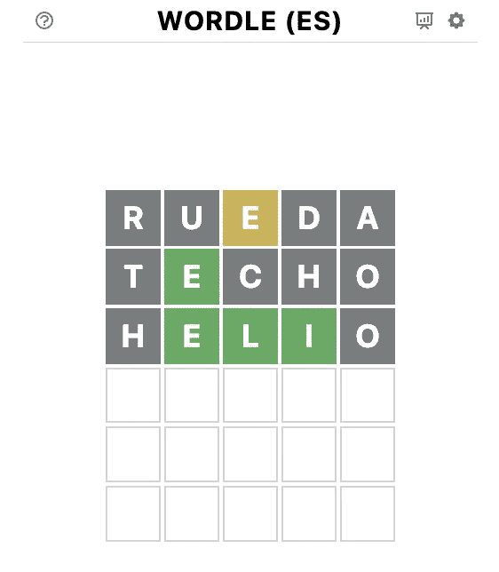
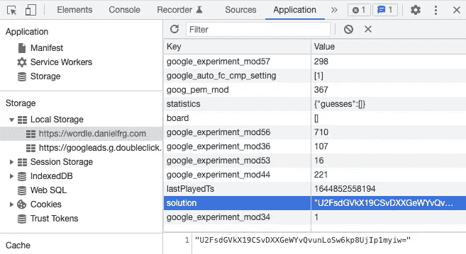
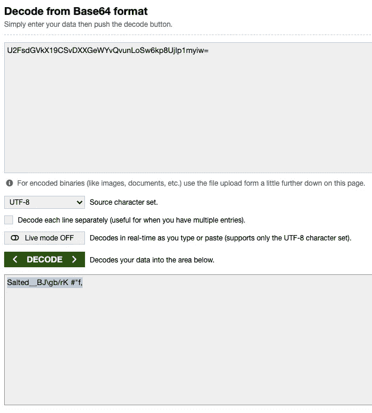
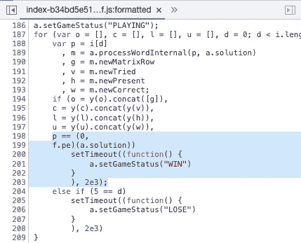
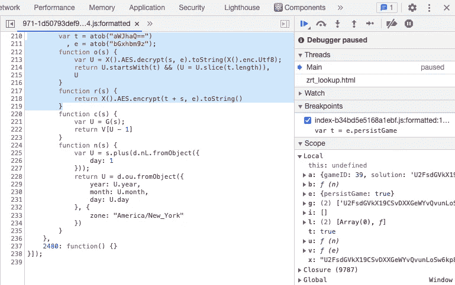
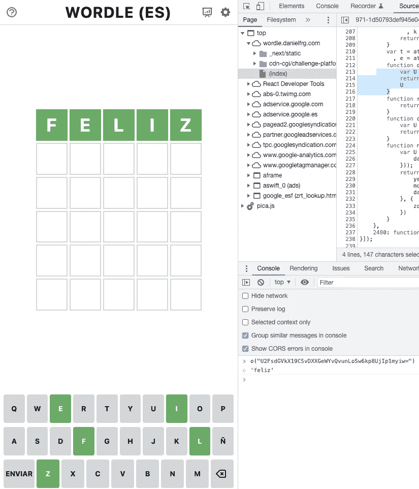
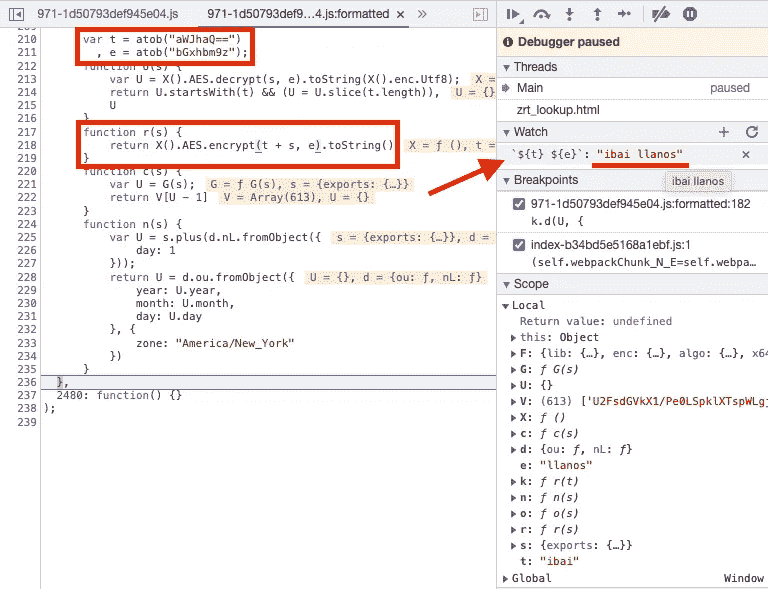
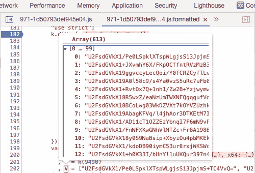

# 破解 Wordle 的一天解决方案

> 原文：<https://infosecwriteups.com/hackeando-wordle-7d4ca6a9fa90?source=collection_archive---------0----------------------->

## 如何通过逆向工程揭示当天的话语

可以肯定的是,我已经沉迷于[**Wordle**](https://wordle.danielfrg.com/),这是由[Josh Wardle](https://twitter.com/powerlanguish?lang=es)发明的新时尚游戏,为此[纽约时报支付了 7 位数字](https://www.xataka.com/videojuegos/the-new-york-times-compra-wordle-cantidad-que-supera-ligeramente-siete-cifras)。

游戏截图

这个简单但令人上瘾的游戏(T8)包括在最多六次尝试中猜出一个五个字母的单词。在每一次尝试中,你可以找出你选择的字母在单词中,以及它们是否在正确的位置。

如何玩 Wordle(西班牙语)

原游戏是英文的,但哥伦比亚人[丹尼尔·罗德里格斯](https://twitter.com/danielfrg)创作了西班牙语的[**改编游戏,与原游戏一样成功。**](https://www.xataka.com/videojuegos/habla-daniel-rodriguez-creador-wordle-espanol-asi-adapto-dos-tardes-juego-online-moda)

玩了几天后,我好奇地想知道游戏是如何运作的,以及是否有可能通过逆向工程揭示当天的词汇。(T17)

# 寻找当天的话语

我做的第一件事就是打开我的浏览器检查器,看看网络活动和本地存储。因此,我在*Local Storage* **中发现了一个名为*“解决方案”*的变量,这似乎是一个很有希望的起点。**

本地存储中的变量“solution”可能包含当天的单词

对于任何受过训练的眼睛来说,变量末尾的*“=”*符号会让人怀疑该变量是用[Base64](https://es.wikipedia.org/wiki/Base64)编码的,所以我使用了在线解码器试图找出解决方案。**Base64 加密算法不是加密算法,所以它应该能够读取当天的单词。(T31)**

解决方案的解码值是 **Salted__BJ\gb/rK#'f,**

该解决方案似乎是用一些加密算法加密的,然后将其编码到 Base64 中。**作者做了一些努力,以掩盖好奇心眼中的解决方案。(T1 )**

下一步是试图找出**解(T3)的加密/解密位置,因为**发现这些函数可以揭示当天的单词(T5)。通过搜索源代码,我找到了下一个小型代码块,其中用户输入的单词与函数的结果进行了比较。****

如果用户选择的单词等于运行“f.pe(a.solution)”的结果,则用户赢得游戏。

从线程中我看到这个函数*“f.pe”*引用了一个函数*“或”*,在另一个源文件中声明。打开这个文件,我发现函数*“r”*和*“o”*似乎负责使用 AES 对称加密算法加密/解密当天的单词。(T15)

函数“r”和“o”负责加密/解密解决方案。

**要揭示当天的单词**,我们只需要在这个文件中放置一个断点,并执行函数*“或”,*作为参数传递先前找到的解决方案。

我发现 2022 年 2 月 14 日的单词是“快乐”

击中第一个不会移动那么多,如果你知道解决方案

有趣的是,作者一定是原名[*Ibai Llanos*](https://twitter.com/IbaiLlanos) 的粉丝,因为他的名字和姓氏是用于加密解决方案的两个变量。

“llanos”是密钥,而“ibai”是加密/解密解决方案时添加/删除的前缀。

我还注意到**源代码包含一个变量,其中包含 2023 年 9 月 11 日**之前的所有解,因此使用解密函数**我们可以猜测到该日期**之前的任何解。

在一个变量中,我们有当天的所有单词加密到 2023 年 9 月 11 日

# 结论

我用这个简单的逆向工程练习的意图并不是要打扰这个有趣的游戏,而是要证明**在客户端上进行的任何加密操作都不会使它更安全,而只是更难揭示。(T35)**

如果没有服务器来处理加密密钥,那么密钥就会在客户端的某个地方,并且只有**有人可以通过逆向工程找到它只是时间问题。(T39)**

在我看来,通过这种方法进行加密对于这种用例来说已经足够好了,因为没有要保护的关键资产。这种方法还具有**节省维护*后端*的成本的优点,并促进了游戏的分发和可用性。(T3 )**

这只是一个教育目的的实验,不会阻止我花费我每天十分钟来解决一天的 Wordle。**事先知道解决方案并不好玩,****请不要用透露的信息来打扰任何人的游戏。(T7 )**

> 如果您喜欢这个故事,并希望在[Medium](https://medium.com/@h_martos)、[Twitter](https://twitter.com/h_martos)或[LinkedIn](https://www.linkedin.com/in/hector-martos-gomez/)关注更多。
> 
> 谢谢你的时间!

# Infosec Writeups 正在组织其首次虚拟会议和网络活动。If you’re into Infosec, this is the coolest place to be, with 16 incredible speakers and 10+ hours of power-packed discussions. 如果您进入 Infosec,这是最酷的地方。 [Check more details and register here. 查看更多详情并在此处注册。(T15)](https://iwcon.live/)

 [## IWCon2022 - Infosec WriteUps 虚拟会议

### Network With World's Best Infosec Professionals。Find How Cybersecurity Pros Achieved 网络安全如何取得成功。Add New Skills to Your...

iwcon.live](https://iwcon.live/)