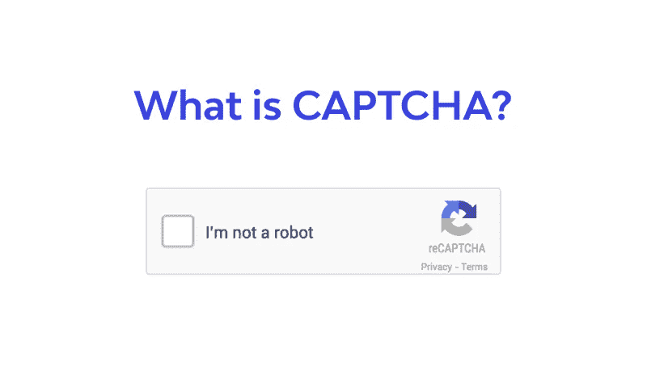
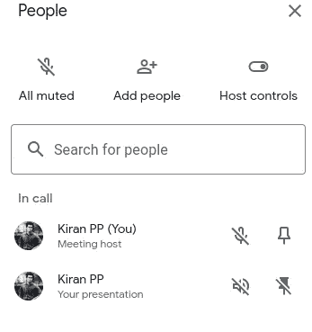
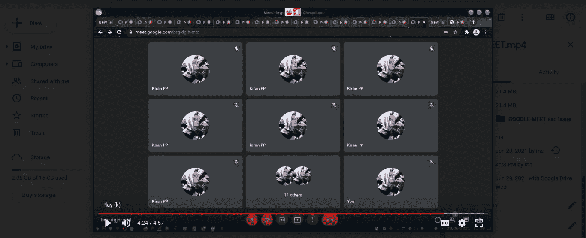
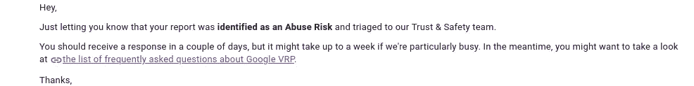
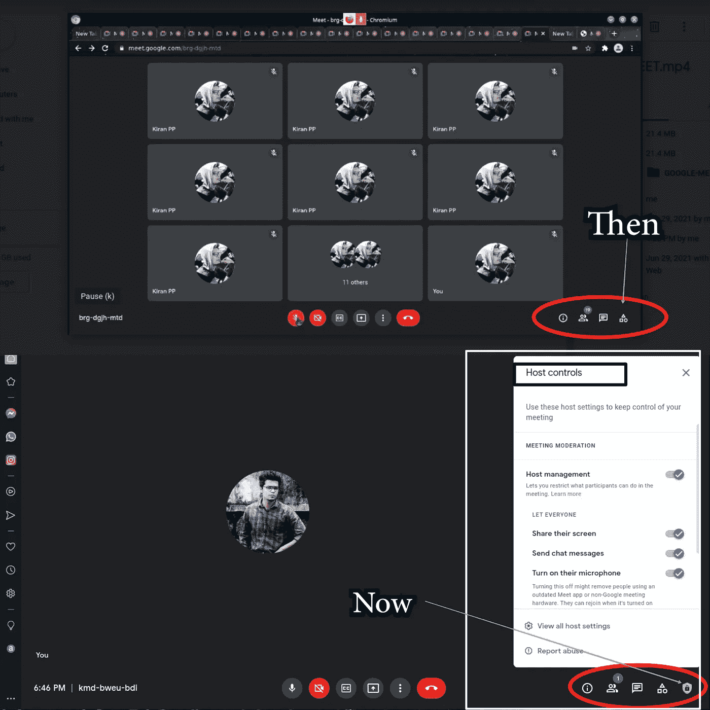

# 黑了 Google-Meet…？？！

> 原文：<https://infosecwriteups.com/hacked-google-meet-40f364bb8368?source=collection_archive---------0----------------------->

*   2021 年 6 月 15 日


让我们反弹几个月:)

你好，信息安全社区✋
今天我在这里向大家揭示我生活中的一件事，它发生在 2021 年 6 月。如果你是一个完全的初学者，或者是信息安全领域的外行，不管怎样，都没关系。这篇文章是写给每一个有强烈阅读欲望的人的。我不得不考虑我的伙伴们谁在这个领域之外。因此，为了更好地理解，有必要介绍一些要点。

**重要:**

> 1.这并不意味着关闭谷歌的服务器或在全球范围内损害谷歌会议。但相信我，这值得你花时间。我说的是 google-meet 存在的一个很酷的授权 bug。
> 
> 2.不要跳过，如果你像我一样是一个 1337(有点自大)你可以跳过螺母和螺栓仅仅知道。
> 
> 3.您可以通过 DM me (Twitter)最终确定意见，但请确保您不会错过我传达的每个场景。

## 首先，让我们谈谈基础知识



什么是验证码？

**验证码→区分计算机和人类的全自动公共图灵测试**

验证码可以帮助网站确认客户是否不是机器人。该测试有助于区分真正的人和计算机程序(机器人)。该测试有两个部分——随机产生的字母或数字排列，显示为畸形的图片，一个内容框，有时还会提供图像让你选择正确的一个。要通过测试并展示您的人性，请将您在图片中看到的人物分类到内容框中。或者点击查询的对比图片。

**因此，验证码可以防止任何垃圾邮件或机器人进入您的网站。**

> 问:Google-Meet 使用验证码吗？我是怎么瞥见的？

在过去的一年里，在疫情期间，所有的课程都是在线的&我很懒的去参加每一节课(我不是一个喜欢学习的孩子)。我的朋友**Mahshooq Zubair(**[***@ MQ _ xz _***](https://twitter.com/mq_xz_)**)**)是一个社区成员，他公开了一个故事，展示了在 google-meet &上进入每个班级的简单程序，标记出勤。是啊，完全自动化！！

(**目前没有验证码**)。

> Selenium 是一个自动化 web 浏览器的开源工具，它提供了一个单一的接口，允许你用编程语言编写测试脚本，比如 Ruby、Java、NodeJS、PHP、Perl、Python 和 C#，等等。Selenium Python 绑定提供了一个简单的 API 来使用 Selenium WebDriver 编写功能/验收测试。通过 Selenium Python API，您可以直观地访问 Selenium WebDriver 的所有功能。 **←(抄袭)。**
> 
> 你可以在网上查阅，有很多关于这方面的资源。

**举例:**

看这个

## 所以问题是，这有什么关系？

我会详细说明。如果你在 google meet 上展示一个屏幕，可能会议上的计数会增加。

> 因此，如果会议中有 N 个用户，当您开始演示时，它将变成 n+1。就像我下面展示的一样。



两个都是我

1.  主机/用户
2.  主持人/用户演示

> 注意:
> **演示时，即使你是主持人或用户，也会发生。无论如何都要进行 n 到 n+1 的计数。**

## 剥削背后的想法


因此，我们确认，当屏幕显示时，Google-Meet 中的个人数量将增加— N 到 N+1(同一个客户端两次)。

谷歌表示:任何拥有谷歌账户的人都可以创建一个多达 100 人的在线会议，每次会议 60 分钟。
企业、学校和其他组织可以利用高级功能，包括与多达 250 名内部或外部参与者的会议，以及面向域内多达 100，000 名观众的直播。

## 如果我告诉你，通过自动化使用单个帐户来填充整个会议是可以想象的，会怎么样？？！当然，你可以通过使用你的单个帐户来填充整个会议，然后呈现你的屏幕，并且可以使它变成 N*2！！

上传到我硬盘里的 PoC(我给谷歌看了)**↓↓**

> 注意:我没有占满整个会议！(但我可以)
> 只是向谷歌提交报告的一个概念验证。



```
**Exploitation / Reproduction Steps***1\. Use your Gmail for creating an account**2\. Login to the meet (online class, job meeting, or whatever)**3\. Fill the meet by your account (use automation) : CAPTCHA 404**It can be done manually. Open the Tabs & join the same meeting. You will see the count increasing**4\. Start screen presentation & turn On your mic**5\. Boom*
```

当你通过自动化使用单一账户来满足会议时，它会像蜂巢上的蜜蜂一样。


由您的帐户填写的会议

如果你有 N 个账户，开始演示&做 N*2 个！！那一刻，相遇本身就陷入了循环。你在展示你的屏幕，你内心的另一个影子在你的屏幕上，圆圈的反射将会出现，它将落入无限循环！


~

只需要打开你的麦克风。嘣！！！整个会议结束了。


任务完成

```
*Note: 
Even if the admin "kicked/blocked" that account from the meet, that one gets influenced & still, the remaining exist without any issue.**Case:
An attacker logged 50 accounts by automating & the admin kicked/blocked him, then "only one" gets restricted. The remaining 49 accounts of that aggressor exist within the meet & can perform any action without further issues. So there aren't any options to wipe out the abuse by the admin.* 
```

我在谷歌上详细描述了我的发现。他们审查了我的报告。



分类的

但是内线团队让我百思不得其解。我们可以假设为**回复 X(重要)**


他妈的…

> 他们指向认证，忽视我的报告。但是授权呢？

## 身份验证与授权


不要跳过

**认证** *是识别用户
身份的方法。与众不同的系统可能需要不同种类的凭证来发现用户的特征。*

**在这里，会议管理员(主持人)决定谁可以加入会议。我尊重他们对认证的心理/技术观点。**

> 现在我们来谈谈授权(轮到我了)

**授权** *是给予某人做某事或拥有某事的许可的过程。它是一种安全机制，用于确定与系统资源相关的访问级别或用户/客户端权限。*

**我的观点是，主机无法控制客户端进行的自动化攻击。漏洞脚本可以通过像病毒一样复制的单个帐户来激增会议。攻击者可以通过运行简单的利用脚本来关闭整个会议。没有办法触发攻击者的 mic &屏幕演示上的任何控制。当麦克风打开时，无限循环逐渐导致爆炸。**

我请他们审阅我的报告。他们的回答让我恶心。我们可以假设为**回复 Y** (重要)


他妈的…

> 你可以比较他们的回复 X & Y。首先，他们指出了认证和拒绝，尽管他们理解授权问题，但他们说他们注意到了这种情况。


凉爽的..！！

## 当前状态:

他们成功地修补了我详述的问题。



有道理，对吧？

## **结论**

毫无疑问，我可以宣布这是一个有效的 bug &滥用风险。尽管如此，我还是尊重谷歌的决定。因为我无能为力。我不知道你在想什么。如果你还在质疑这是否是一个问题，那就想想谷歌进行的修复吧。

虽然，这不是终点。这是职业生涯的良好开端。我最好的还在后面！我相信你很欣赏这篇文章。别忘了在 Twitter 上帮我接通@[7h 3 H4 ckv 157](https://twitter.com/7h3h4ckv157)

