# 黑客 101 CTF:安卓挑战报道

> 原文：<https://infosecwriteups.com/hacker101-ctf-android-challenge-writeups-f830a382c3ce?source=collection_archive---------0----------------------->

在这篇文章中，我将展示如何解决 Android 类别的*黑客 101**(捕捉旗帜)挑战。 [Hacker101](https://www.hacker101.com/) 是一个免费的黑客教育网站，由 [HackerOne](https://www.hackerone.com/) 运营。*

**

# *放弃*

*我写这篇文章的动机是想了解更多关于 Android 移动应用程序安全性的知识。这篇文章显然会包含剧透，我鼓励读者在阅读这篇文章之前尝试这个 CTF。试着尽可能多地解决这些挑战，如果你遇到困难或者想看看解决挑战的不同方法，稍后再来阅读这篇文章。不要再拖延了，让我们开始吧😃！*

# *H1 恒温器(简易，双旗)*

*我通过下载应用程序 APK 文件，并使用 **Android 调试桥** ( **ADB** )将其安装在我的仿真器设备上，开始了这个挑战*

```
*adb install thermostat.apk*
```

*打开应用程序显示，它只有一个带有恒温器和温度计的活动，允许用户提高或降低温度设置。*

*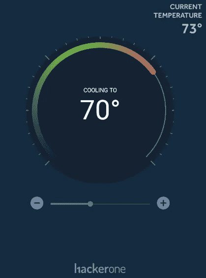*

*接下来，我使用**移动安全框架** ( **MobSF** )工具为 APK 文件生成了一个静态分析报告。我通过检查 *AndroidManifest.xml* 文件开始审查报告。*

*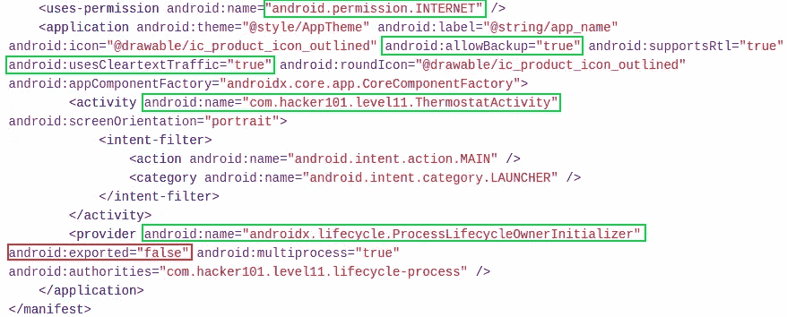*

*查看清单文件，我可以看到应用程序只请求了**Android . permission . internet**权限，该权限允许应用程序创建网络套接字。开发人员已经将属性**Android:usesCleartextTraffic**和 **android:allowBackup** 设置为 **true** ，这意味着应用程序打算使用明文流量，并且可以让用户备份其内容。*

*该应用程序似乎也只有两个组件。一个名为*com . hacker 101 . level 11 . thermoseactivity*的**活动**已经用意图过滤器声明。名为*ProcessLifecycleOwnerInitializer*的**内容提供者**也已声明，但未导出。我决定检查一下*com . hacker 101 . level 11 . thermoseactivity .*的 java 源代码*

*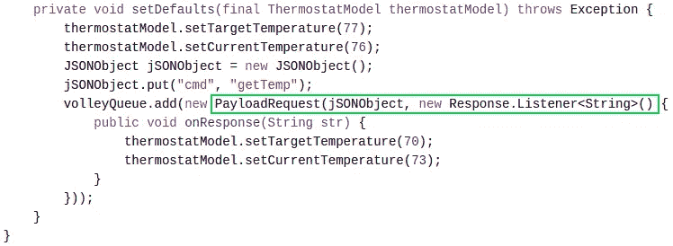*

*在查看活动的源代码时，我注意到正在发出一个网络请求。这个网络请求中使用了一个名为 *PayloadRequest* 的类，用绿色突出显示。检查 *PayloadRequest* 类的源代码，我发现了挑战的两个标志。*

**

*看起来一个标志使用 **MD5** 散列，然后 **base64** 编码，然后作为一个值添加到名为 *X-MAC* 的头中。另一个标志只是作为明文值添加到报头 *X 标志*中。在与应用程序交互时，我可以使用工具 **BurpSuite** 来拦截这个网络请求。*

*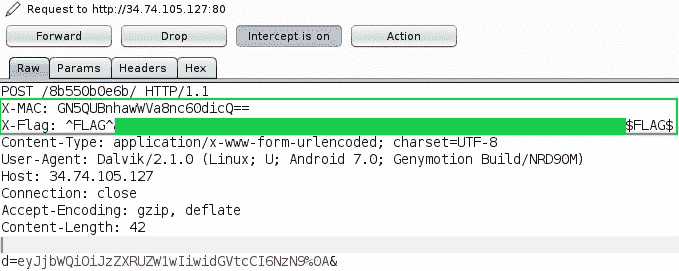*

*如上图所示，截取的网络请求显示了 *X-MAC* 和 *X-Flag* 报头及其等值。第一次挑战很简单😃！*

# *有意锻炼(中度，1 面旗)*

*按照前面挑战中看到的类似方法，我使用 ADB 安装了应用程序，并使用 MobSF 生成了 APK 文件的静态分析报告。打开应用程序会显示一个带有欢迎消息和一个名为**【Flag】***的链接的活动。**

**

*点击链接导致**“无效请求”**错误。我猜不会那么容易😏。*

**

*正如在前面的挑战中看到的，我从查看应用程序的清单文件开始。清单文件中只声明了一个**活动**。该活动的突出之处在于，它已经通过三个**意图过滤器**进行了声明。下图中被绿色包围的两个意图过滤器展示了你如何为你的应用程序内容创建一个**深度链接**(**参见参考文献**)。*

> *注意:深度链接是一个帮助用户在网络和应用之间导航的概念。它们基本上是将用户直接导航到**应用程序中特定内容的 URL。***

*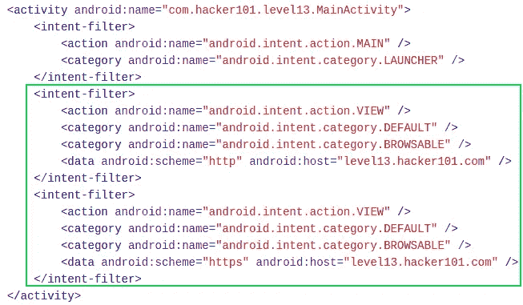*

*为了测试第一个深度链接(即 http)，我可以使用 **ADB** 和活动管理器(am)工具来测试为深度链接指定的意图过滤器 URI 是否解析到正确的应用活动。下面的命令成功地启动了应用程序的主活动。*

```
*adb shell am start -W -a "android.intent.action.VIEW" -d "http://level13.hacker101.com" com.hacker101.level13*
```

*我决定看看 *MainActivity 的源代码。浏览 java 代码，我可以看到应用程序创建了一个 **WebView** 。还声明了两个字符串变量，变量 ***str*** 包含一个硬编码的 URL。**

> *注意:您的应用程序的 URL 会有所不同。*

*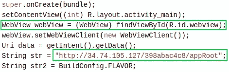*

*将这个 URL 输入到浏览器中，会调出之前在应用程序主活动中看到的相同页面。*

*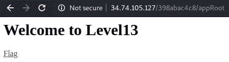*

*单击标志链接仍会返回无效请求。*

*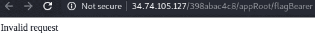*

*再次查看源代码，我看到应用程序检索了用于启动主活动的 i **ntent** 中存储的数据。检查前面的清单文件，我知道这个数据是 http://level13.hacker101.com 的***URL。然后，应用程序继续使用 java **subString(28)** 方法来忽略从 intent 检索的数据字符串中的前 28 个字符(即***【http://level13.hacker101.com】***URL)，并将剩余的字符串值附加到 **str2** 变量中，并在 **str** 变量中添加硬编码的 URL 链接字符串。然后，应用程序检查字符串是否包含“**？** *"* 如果不存在，则将其添加到字符串的末尾。****

****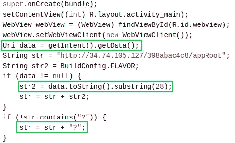****

****根据我目前的静态分析，我还不知道 **str2** 的值是多少。到目前为止， **str** 的最终值是由**硬编码的 URL 链接**、 **str2 *、值***(此时它只是一个空字符串)和**“？”**在字符串的末尾。****

```
****http://34.74.105.127/398abac4c8/appRoot**'empty str2 value'**?****
```

****最后一个代码块包括使用 SHA-256 哈希算法创建一个消息摘要。散列被更新两次。第一个是用名为**s 00 p 3s 3c 3r tk3 y***的键，第二个是用**str2 值** *。*WebView 随后将加载一个新构建的 URL，其中包括 **str** 值(即 **URL** )、字符串“**&hash”**和 **SHA-256 hash** 值。*****

****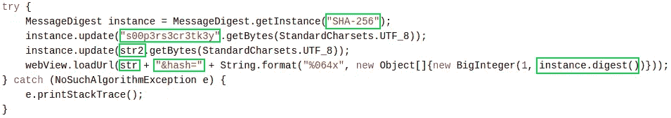****

****到目前为止，最终构建的 URL 如下所示:****

```
**http://34.94.3.143/398abac4c8/appRoot'**empty** **str2 value**'?&hash="**hash value**"**
```

****使用一个名为 **BurpSuite** 的工具，我可以在应用程序启动时拦截它发出的请求，并观察由 *MainActivity* 源代码构建的 URL。****

****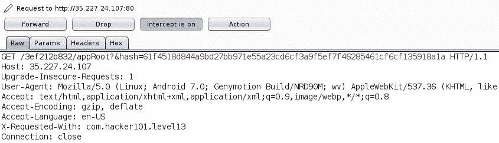****

****查看应用程序发出的主机值和 GET 请求，我可以看到完整的 URL。****

```
**http://35.227.24.107/3ef212b832/appRoot?&hash=61f4518d...etc**
```

> ****注意:由于我下载了新版本的应用程序，URL 中的数值(即 3ef212b832)已发生变化。****

****在 URL 中输入这个值仍然会把我带到默认的 WebView，并带有一个获取标志的链接。我知道这个链接以某种方式用于获取标志，通过查看链接的页面源代码，我可以看到它使用 **/flagBearer** 作为 URL 地址的一部分。该值位于**逼近**之后，可能是缺失的 **str2** 值。****

****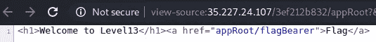****

****如果我将 **/flagBearer** 添加到缺少的 **str2** 值所在的位置，我会得到下面的 URL 路径。****

```
**http://35.227.24.107/3ef212b832/appRoot/flagBearer?&hash=61f4518d...etc**
```

****在我的浏览器中输入这个 URL 路径会出现一个新的错误信息，上面写着“**无效哈希** *”。*****

****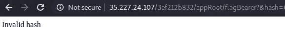****

****这意味着 **/flagBearer** 是未知的 **str2** 值，可以通过在其位置键入其他值来确认，这将导致一个未找到的错误。****

****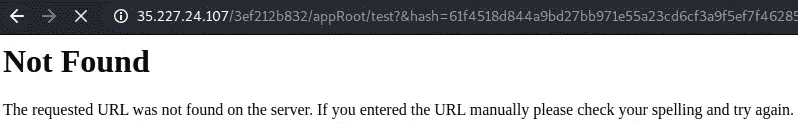****

****尽管有了正确的 URL 路径，我仍然看到一个散列错误。如前所述，在静态分析 *MainActivity* 源代码时，使用 **str2** 值(即 */flagBearer* )和键**s 00 p 3s 3c r tk3 y***来组成完整的 SHA-256 散列。然而，由于意图过滤器中指定的数据 URL 路径(即*http://level13.hacker101.com*)不包含字符串 **/flagBearer** ，并且被 java **subString(28)** 方法完全忽略，因此 **str2** 值为空。这意味着哈希不正确，因为在 **str2** 中没有值(即 */flagBearer* )。*****

****这就是**深层链接**发挥作用的地方。看了一篇名为《*安卓深度链接的 Zaheck！* " ( **参见参考文献**)，我了解到，如果正在进行的**URL 验证**不充分，那么我可以加载自己的**任意 URL** 。我知道没有对用于触发意图过滤器和启动应用程序主活动的 URL 执行 URL 验证。这意味着我可以提供自己的 URL，并附上 **/flagBearer** 路径，这将启动主活动并导致 **str2** 值等于 **/flagBearer** *。*我可以通过使用 **ADB** 来实现这一点，就像之前在测试 URI 意图过滤器时看到的那样。****

```
**adb shell am start -W -a "android.intent.action.VIEW" -d "http://level13.hacker101.com/flagBearer" com.hacker101.level13**
```

****这导致该标志被呈现😄。****

********

****另一种不使用深层链接来解决这一挑战的方法是，通过组合密钥**s 00 p 3s 3c r tk3 y***和 **/flagBearer** 字符串，简单地**自己创建散列****。我使用了一个名为 **CyberChef** 的在线工具来创建 SHA-256 散列。*******

*******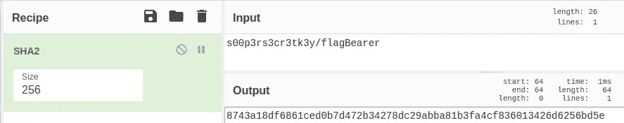*******

*******然后，我将这个新散列添加到我的 URL 路径中，给我一个标志。*******

*******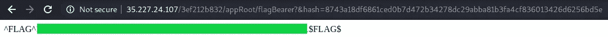*******

# *******Oauthbreaker(中等，2 个标志)*******

*******使用 ADB 和 MobSF，我再次安装了应用程序并生成了一个静态分析报告。打开应用程序，我看到一个活动，上面有一个按钮，写着 authenticate。*******

**************

*******点击此按钮，我的仿真器上的 WebView 浏览器打开，在 URL 栏中有一个地址和一个授权我的移动应用程序的链接。*******

*******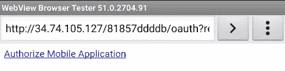*******

*******URL 栏中的完整地址可以在下面看到。*******

```
*****[http://34.74.105.127/81857ddddb/oauth?redirect_url=oauth%3A%2F%2Ffinal%2Flogin&response_type=token&scope=all](http://34.74.105.127/81857ddddb/oauth?redirect_url=oauth%3A%2F%2Ffinal%2Flogin&response_type=token&scope=all)*****
```

*******点击*授权移动应用*链接，我会进入一个新的活动，消息显示我已经通过 OAuth 成功认证了“**”!**”。*******

************

******在探索应用程序的功能时，我决定在我的模拟器上打开 WebView 浏览器中显示的 URL。在查看这个页面的源代码时，我发现了**的第一个标志**。******

******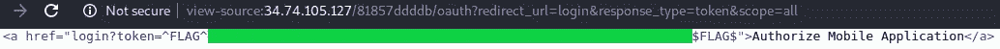******

******检查 Android 清单文件显示，**两个名为“*com . hacker 101 . oauth . browser*”和“*com . hacker 101 . oauth . main activity*”的活动**是用**意图过滤器**声明的。正如前面的挑战所看到的，这些意图过滤器用于创建深层链接。******

******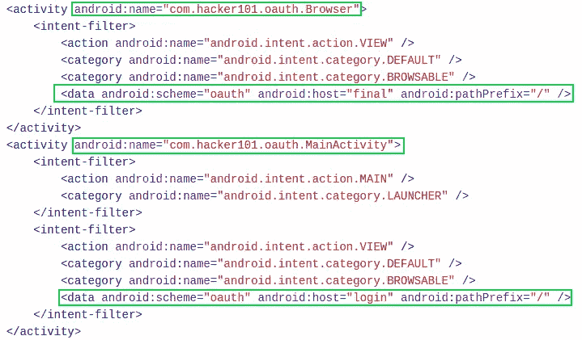******

******查看完清单文件后，我开始查看 *MainActivity 的源代码。*创建主活动时，名为 **authRedirectUri** 的变量等于值“***oauth://final/***”。这是用于将用户带到*浏览器*活动的深层链接 URL。检索并检查包含在用于启动主活动的意图中的数据，以查看它是否有任何数据或者查询参数 ***redirect_uri*** 是否为空。如果 intent 参数 ***redirect_uri*** 不为空，则将该参数的值赋给 **authRedirectUri** 。******

************

******再往下，我可以看到，当我单击按钮" **Authenticate** *"，*时，一个 URL 被构建，其中包括 URL 编码的 **authRedirectUri** 值。然后创建一个新的意向，并将 URL 作为数据添加到该意向中。这个意图然后被用来触发**浏览器活动**。******

******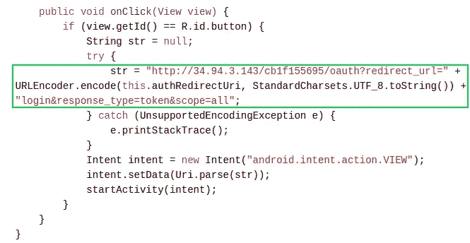******

******从这段源代码中，我可以看到无论 ***redirect_uri*** 参数值是什么，用户都会被**重定向**到。为了测试这一点，我可以给***redirect _ uri***intent 参数赋值，并观察它是否成功地重定向了我。******

```
****adb shell am start -W -a "android.intent.action.VIEW" -d "oauth://final/redirect_uri=https://ctftime.org/" com.hacker101.oauth****
```

******这很管用，我成功地被重定向到了*ctftime.org*网站。第一个标志也显示在 URL 中。******

******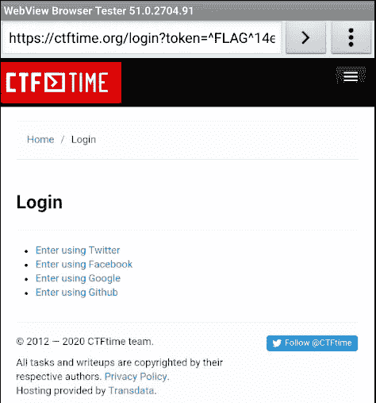******

******我仍然不确定如何利用这个漏洞，所以我决定开始查看**浏览器活动**。我看到创建了一个名为 *SSLTolerentWebViewClient* 的私有类。在这个类中，声明了*shouldoverrideulroading()*方法，该方法允许主机应用程序有机会在 URL 将要被加载到当前 WebView 中时进行控制(**参见参考文献**)。这解释了为什么 WebView 浏览器在我的模拟器上打开。方法 *SslErrorHandler()* 也被声明，用于简单地忽略 SSL 错误。******

******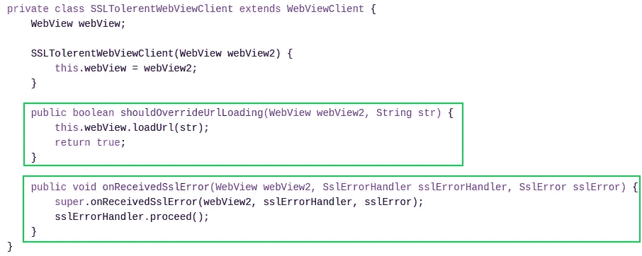******

******在源代码中继续往下，我可以看到一个名为 **str** 的变量被声明为一个 URL 地址。这个 URL 地址就是我之前看到的成功消息，它告诉我我通过了身份验证。检查用于启动活动的来自 intent 的数据和名为 **uri** 的 intent 参数，看它是否为空。然后，使 **str** 值等于包含在 **uri** intent 参数中的数据。******

************

******在这下面，我可以看到创建了一个新的 WebView。创建 WebView 时，需要注意两条重要的信息。首先是 WebView 已经使用 *setJavascriptEnabled()* 启用了 **JavaScript 执行**。第二个是声明了方法*addJavascriptInterface()*。这将提供的 Java 对象注入到 WebView 中，并且**允许从 JavaScript** 访问 Java 对象的方法。这个方法有两个参数:******

1.  ******要绑定到 JavaScript 的类实例(即 *WebAppInterface* )******
2.  ******用于在 JavaScript 中公开实例的名称(即 *iface* )。******

******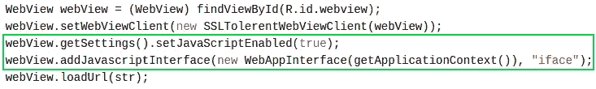******

******这允许我控制 **WebAppInterface** 类中的任何方法。看这个类，可以看到一个有趣的方法叫做 **getFlagPath()** 。这个方法包含了一个大的 int 值数组，如下所示。******

************

******下面的代码似乎执行了各种操作，这些操作会导致创建一个 html 文件的路径。******

******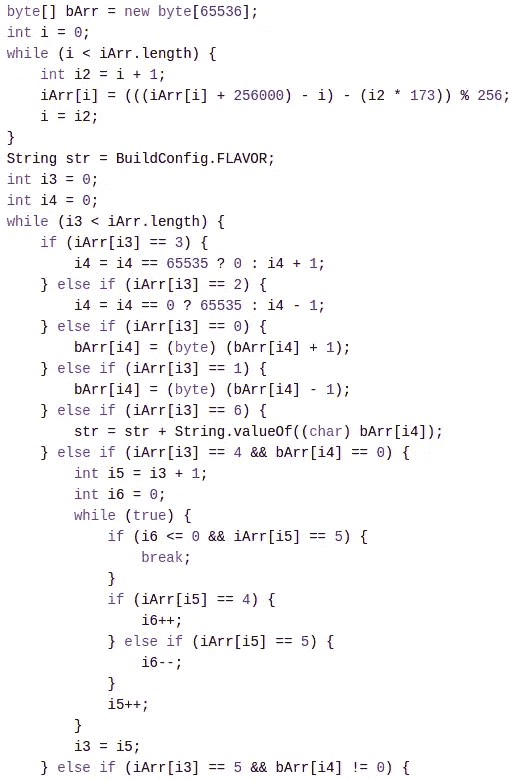************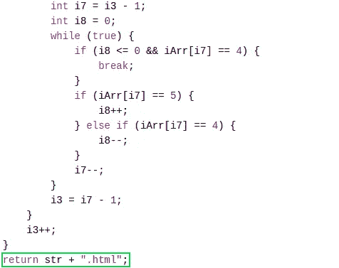******

******为了调用这个方法，我可以使用 **Github Pages** 创建一个简单的网页。然后，我可以将下面的 JavaScript 添加到网页中，它将使用暴露类实例的" **iface** "名称调用 **getFlagPath()** 方法。******

******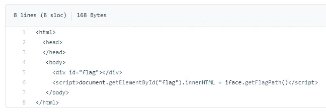******

******接下来，我可以重定向到我的 Github Pages 网站，如前所述，方法是在调用**浏览器活动**时，为 **uri** 参数分配站点 URL 地址作为其值。******

```
****adb shell am start -W -a "android.intent.action.VIEW" -d "oauth://final/uri=https://**github.website.url"** com.hacker101.oauth****
```

******这将产生一个 HTML 页面的路径。******

******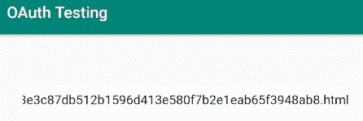******

******我可以简单地将 HTML 文件的路径添加到如下所示的地址的末尾。******

```
****http://34.94.3.143/cb1f155695/**path-to-flag.html******
```

******这给了我第二面旗帜😃。******

******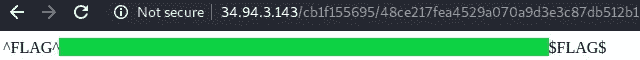******

# ******移动网站开发(中等，双标志)******

******再次使用 ADB 和 MobSF，我安装了应用程序并生成了一个静态分析报告。打开应用程序，我看到一个允许我刷新页面和编辑页面内容的活动。******

******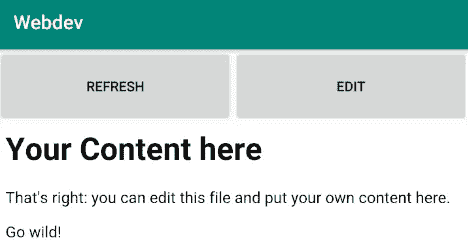******

******单击“编辑”按钮会显示一个新页面，其中显示了我可以编辑的文件。******

************

******点击文件可以让我编辑它。******

******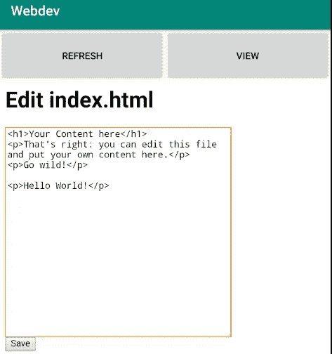******

******如果我单击保存并返回视图，我可以看到我的编辑已被应用。******

******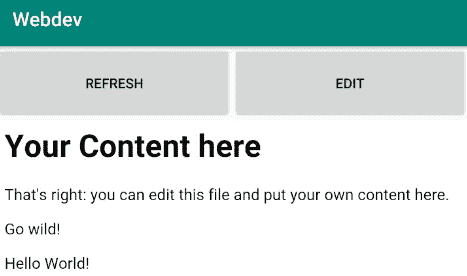******

******在查看了应用程序的功能之后，我继续检查应用程序的 Android 清单文件。只有**一个名为*主活动*的活动**被声明。******

******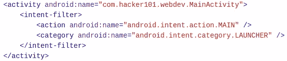******

******我决定看看 *MainActivity 的源代码。*阅读源代码时，我首先注意到一个名为 **HmacKey** 的变量，它有一个字符串值，似乎是一个私钥。******

******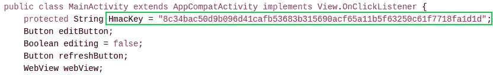******

******再往下，我看到一个名为 *Hmac()* 的方法，这个方法还没有实现，正如异常消息所暗示的。******

******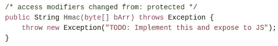******

******在此之下，我找到了源代码的其余部分，如前所述，它们促进了应用程序的功能。我可以看到用于查看和编辑内容的不同 URL。我还看到显示内容的 WebView 启用了 JavaScript。******

******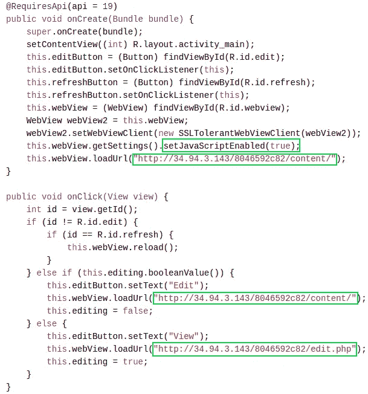******

******起初，我真的不确定如何使用 HMAC 键，所以我最终尝试了一些不同的方法。例如，我最初的直觉是看看我是否可以执行 XSS 攻击，因为我可以编辑页面的内容，并且在 WebView 中启用了 JavaScript 执行。我认为如果我能执行一些 JavaScript，一个标志可能会自己出现。我给 index.html 页面添加了一些 JavaScript，如下图所示。******

******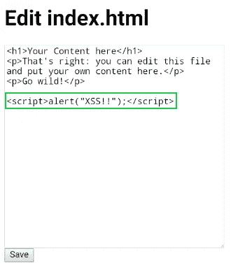******

******保存文件并在浏览器中查看内容页面后，我可以看到 XSS 攻击起作用了，但没有显示任何标志。******

******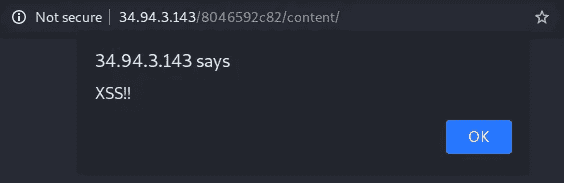******

******在四处寻找之后，我终于在 edit.php 的页面上找到了线索。开发者留下的评论提到了一个名为*upload.php*的页面。******

******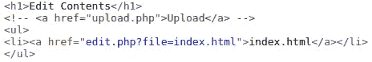******

******顾名思义，当我访问这个页面时，我可以上传一个文件。******

******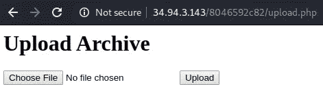******

******查看页面源代码，我可以看到上传表单接受 zip 文件。******

******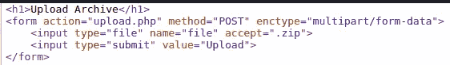******

******然而，当我试图上传一个 zip 文件时，出现了以下错误。******

******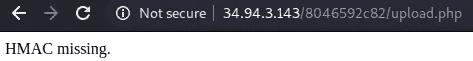******

******上传 zip 文件时，我似乎需要提供 HMAC 签名。******

> ******注意: **HMAC 算法**可用于验证在应用程序之间传递或存储在潜在易受攻击位置的信息的**完整性**。基本思想是**生成实际**数据**与共享**秘密密钥**的加密散列**。**产生的散列**然后可用于检查传输或存储的消息以确定信任级别，而无需传输密钥。******

****现在我知道了 HMAC 私钥的用途，我可以继续创建 HMAC 签名了。为了实现这一点，我使用了一个简单的在线 python 脚本(**参见参考文献**)来计算 HMAC 签名。****

****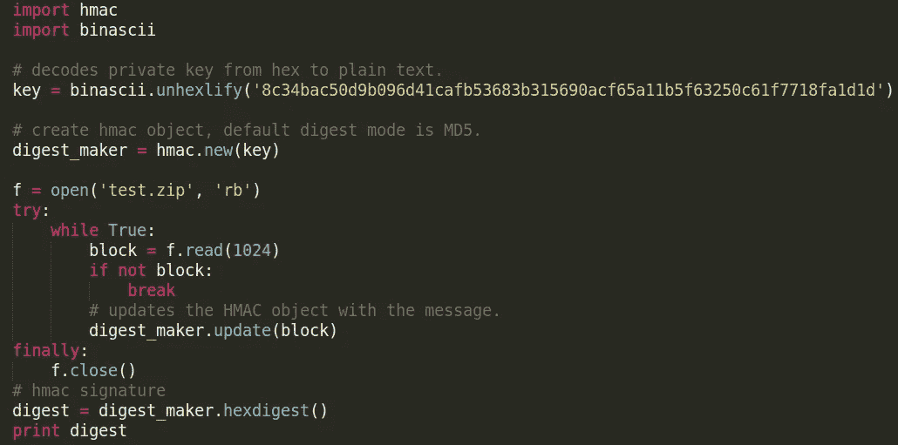****

****执行这个脚本会生成我的 **HMAC 签名**，如下所示。****

********

****使用 Burpsuite，我可以再次上传我的 zip 文件，这次将我的 HMAC 签名添加到 POST 请求中，作为请求正文的另一部分。****

****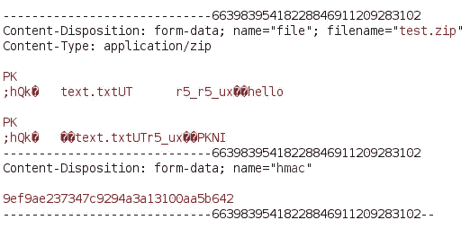****

****这是成功的，并导致第一个标志**被显示。******

****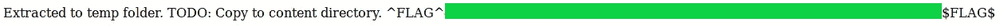****

****成功上传 zip 文件后，会显示一条信息，说明 zip 文件已经解压到一个名为/ *temp* 的文件夹中，但需要**复制**到 */content* 文件夹中。****

****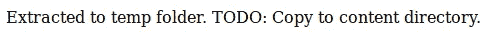****

****在网上搜索了一些 zip 文件上传目录遍历漏洞后，我发现了一个叫做 **Zip Slip 漏洞**的漏洞。****

> ****注意:Zip Slip 漏洞允许攻击者创建 Zip 存档，使用**路径遍历**来覆盖受影响系统上的重要文件，或者破坏它们，或者用恶意替代文件替换它们。****

****为了测试这个漏洞是否存在，我使用了 Github 上的 **Snyk** 提供的 zip slip 文件(**参见参考文献**)。我用我的 python 脚本再次创建了一个 HMAC 签名，但这次是用 *zip-slip.zip* 文件。然后，我使用 BurpSuite 拦截 POST 请求，并像前面看到的那样添加 HMAC 签名。成功上传 zip 文件后，我收到了**第二个标志**！****

****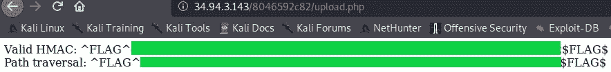****

# ****结束语****

****我真的很喜欢解决这些挑战，并发现它们对于教授如何利用 Android 应用程序中的漏洞非常有用。我希望 HackerOne 将来会继续发布更多基于 Android 的 CTF 挑战赛，感谢您阅读到最后😄！****

# ****参考****

*   ****[https://developer . Android . com/training/app-links/深层链接](https://developer.android.com/training/app-links/deep-linking)****
*   ****[https://medium . com/bugbountywriteup/the-za heck-of-Android-deep-links-a5f 57 DC 4 AE 4c](https://medium.com/bugbountywriteup/the-zaheck-of-android-deep-links-a5f57dc4ae4c)****
*   ****[https://developer . Android . com/reference/Android/WebKit/webview client # shouldoverrideulroading(Android . WebKit . webview，% 20 Android . WebKit . webresourcerequest)](https://developer.android.com/reference/android/webkit/WebViewClient#shouldOverrideUrlLoading(android.webkit.WebView,%20android.webkit.WebResourceRequest))****
*   ****[https://developer . Android . com/reference/Android/WebKit/SslErrorHandler # proceed()](https://developer.android.com/reference/android/webkit/SslErrorHandler#proceed())****
*   ****[https://developer . Android . com/reference/Android/WebKit/web settings # set JavaScript enabled(boolean)](https://developer.android.com/reference/android/webkit/WebSettings#setJavaScriptEnabled(boolean))****
*   ****[https://www . code project . com/Articles/392603/Android-addJavaScriptInterface](https://www.codeproject.com/Articles/392603/Android-addJavaScriptInterface)****
*   ****[https://pymotw.com/2/hmac/](https://pymotw.com/2/hmac/)****
*   ****[https://stack overflow . com/questions/8659808/how-do-http-file-upload-work](https://stackoverflow.com/questions/8659808/how-does-http-file-upload-work)****
*   ****[https://github . com/snyk/zip-slip-vulnerability/blob/master/archives/zip-slip . zip](https://github.com/snyk/zip-slip-vulnerability/blob/master/archives/zip-slip.zip)****