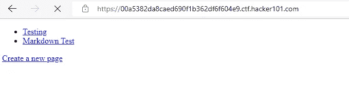
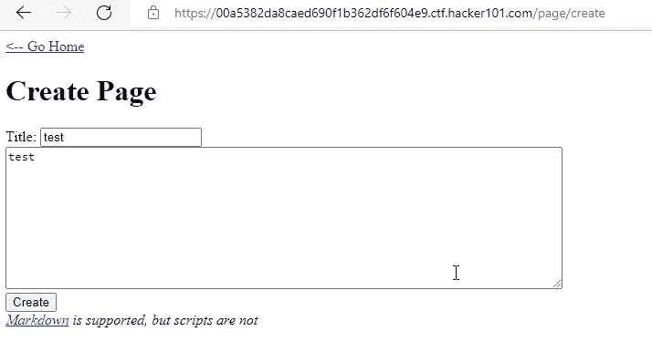
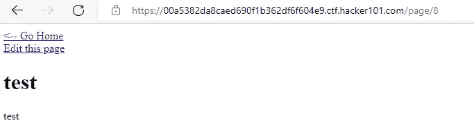
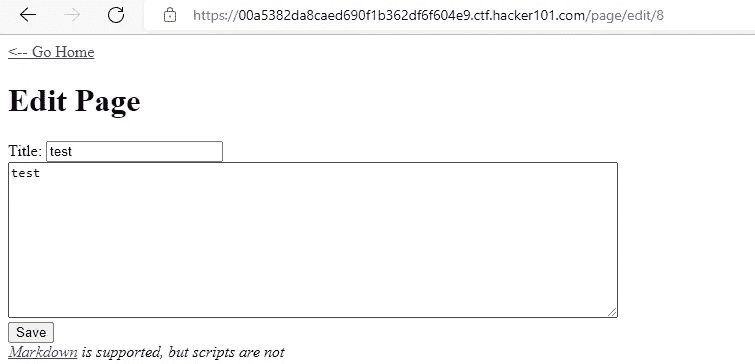
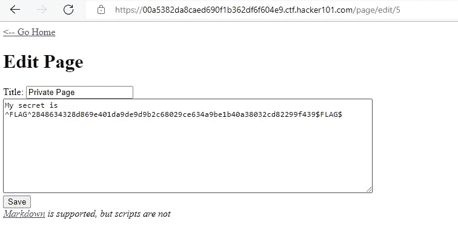

# 黑客 101 CTF —微 CMS v1 标志 0 演练

> 原文：<https://infosecwriteups.com/hacker101-ctf-micro-cms-v1-flag-0-dd5b40652282?source=collection_archive---------0----------------------->

让我们先试着创建一个新页面。

现在让我们更改我们创建的页面的内容。

让我们编辑第 8 页的内容。

我们可以改变其他页面的内容吗？让我们检查一下是否可以依次更改不同页面的内容。当我们编辑第 5 页的内容时，我们得到了这个标志。

我们访问由不同用户创建的对象的访问控制漏洞称为 IDOR。利用此漏洞，它可以提供对不同内容的访问。我们可以用不同人的 ID 在系统中进行交易。想象一下，当我们更改 ID 时，您可以使用 admin 用户操作 web 服务器。

来自 Infosec 的报道:Infosec 上每天都会出现很多难以跟上的内容。 [***加入我们的每周简讯***](https://weekly.infosecwriteups.com/) *以 5 篇文章、4 个线程、3 个视频、2 个 Github Repos 和工具以及 1 个工作提醒的形式免费获取所有最新的 Infosec 趋势！*