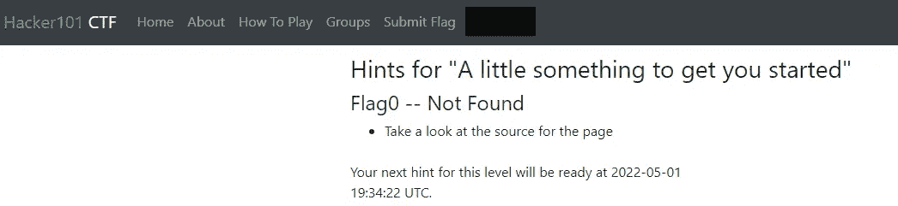
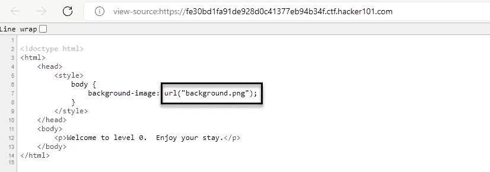

# 黑客 101 CTF — Travial CTF 旗帜 0

> 原文：<https://infosecwriteups.com/hacker101-ctf-travial-ctf-flag-0-9912113630bc?source=collection_archive---------3----------------------->



在应用程序的源代码中，密码是用户名，信息可以在编写代码时保留。

例如:

```
<!-- password: cyber2022 -->
<!-- username: cyber -->
<!-- admin_page: [http://127.0.0.1/admin](http://127.0.0.1/admin) -->
```

首先，我们来看看页面的源代码。



如果我们查看 background.png 源代码，我们会发现国旗。


来自 Infosec 的报道:Infosec 上每天都会出现很多难以跟上的内容。 [***加入我们的每周简讯***](https://weekly.infosecwriteups.com/) *以 5 篇文章、4 个线程、3 个视频、2 个 Github Repos 和工具以及 1 个工作提醒的形式免费获取所有最新的 Infosec 趋势！*