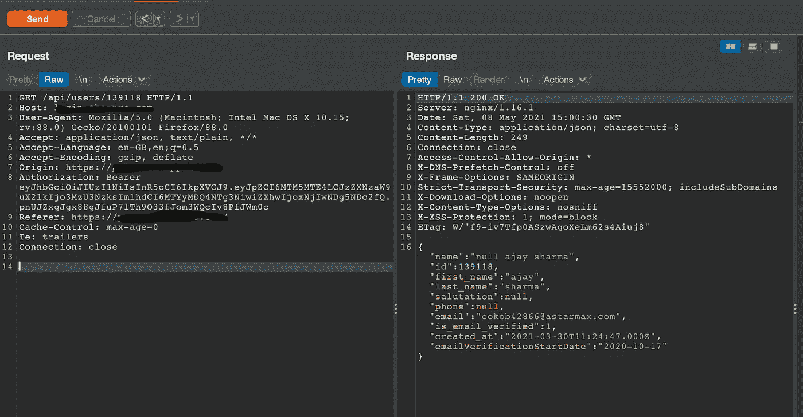
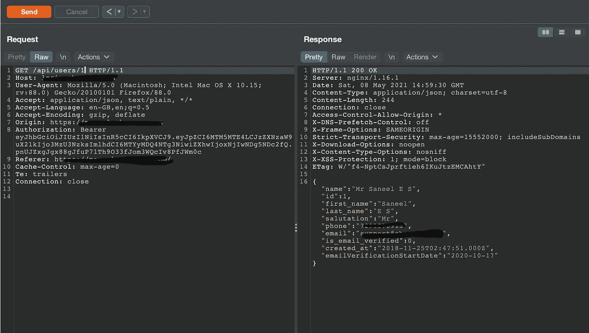

# 黑了一个网站，并能够访问 10 万客户的个人资料

> 原文：<https://infosecwriteups.com/hacking-a-company-and-able-to-access-1-lakh-customers-personal-details-e195570e86?source=collection_archive---------2----------------------->

大家好

希望你过得好&健康。

这是我的第一篇关于 Bug Bounty 的博客，在写这篇文章的时候我真的很兴奋。

今天我将分享一个 IDOR bug，它允许我找到 10 万用户的个人电话号码、地址和电子邮件。

这是一个私人程序，所以我不能分享网站的名称，但让我们把它作为[target.com](http://target.com)

所以漏洞存在于 **GET** 请求端点，用来了解用户的详细信息。

一天，当我试图在目标上捕捉一些虫子时，我先做了一些侦察。

完成了基本侦察[子探测器](https://github.com/projectdiscovery/subfinder)|[httpx](https://github.com/projectdiscovery/httpx)|[aquatone](https://github.com/michenriksen/aquatone)。然后尝试使用[细胞核](https://github.com/projectdiscovery/nuclei)找到一些低挂果实&自动化 bug，但是没有运气:/

然后开始在主域上狩猎。注册成为用户&试图通过忘记密码找到一些 ATO(帐户接管)，但运气不好:/

试图找到一些 XSS 和 CSRF，但再次没有运气:/

然后开始寻找打嗝的终点&这是多巴胺水平变得不稳定的地方，通过终点 **/api/users/159734**

这次我感觉这里有什么不对劲。

端点的请求和响应如下所示

然后我把端点 **/api/users/139118** 的数字 **139118** 去掉，改成了 **/api/users/1** & BOOM！你得到了你想要的

然后我试着把号码换成其他数字&我可以得到他们顾客的所有个人信息。

> **这里有个提示**:每次寻找打嗝的终点时，试着和它们一起玩。

感谢阅读，希望你喜欢我的博客😀。

更多即将推出！

祝你未来的信息安全事业好运。

如果你有任何关于这篇文章的问题，请通过 twitter 联系我。我会打开我的 DM

[推特](https://twitter.com/security_donut)