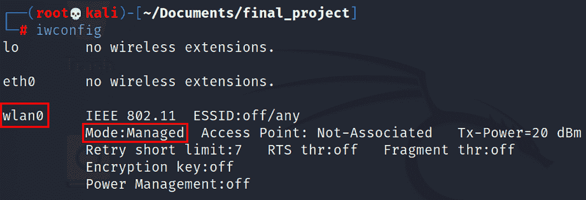
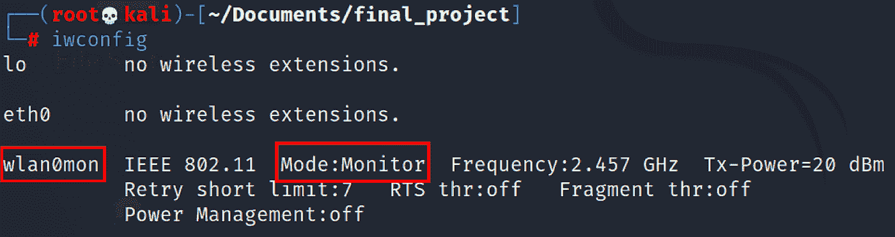
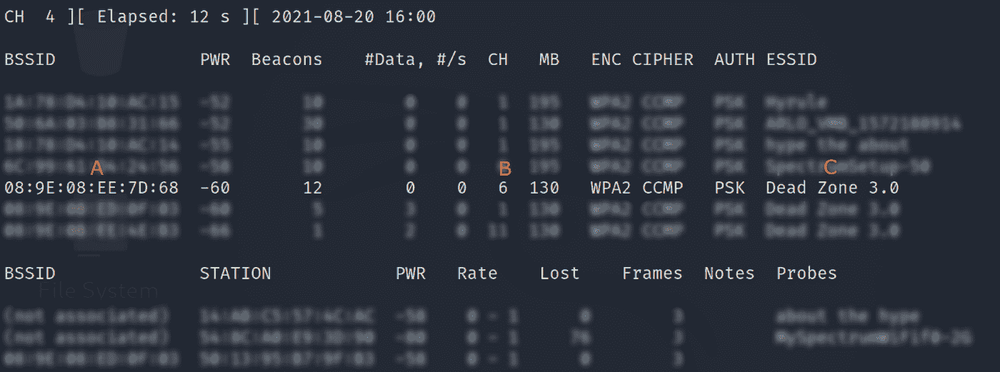
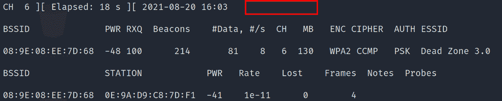
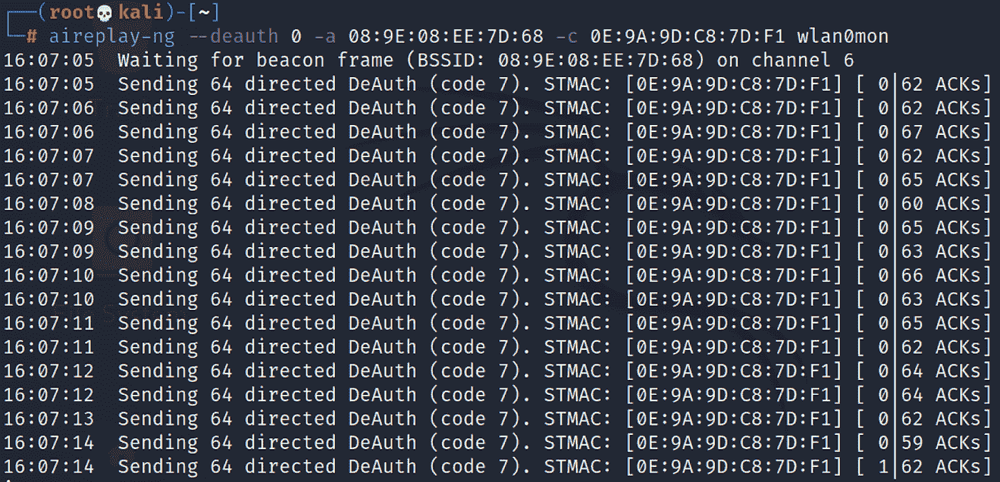
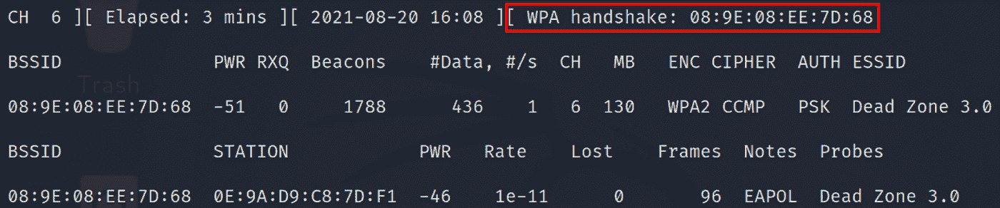
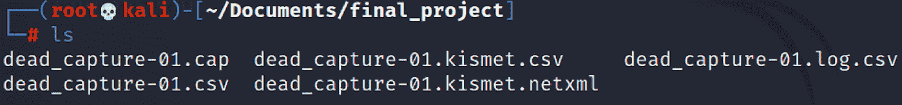
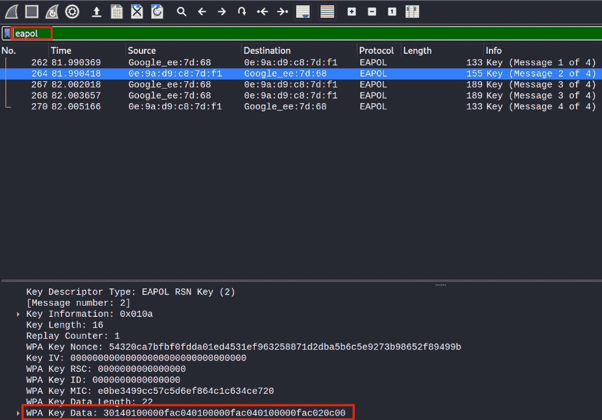
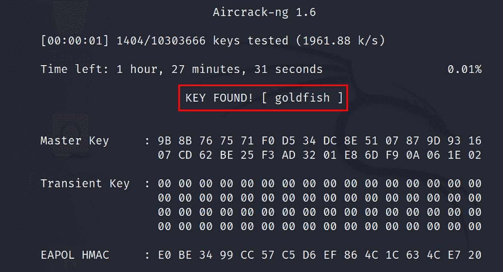

# 入侵家庭网络

> 原文：<https://infosecwriteups.com/hacking-a-home-network-54e06a9d9730?source=collection_archive---------1----------------------->

如果有人有合适的工具并且知道如何使用它们，那么进入家庭网络是一件简单的事情。在下面的例子中，我们将闯入一个家庭 WiFi 网络，利用网络上的一台计算机，最后，我将向您展示如何最好地保护自己免受这些类型的攻击。但首先，有趣的是。入侵网络。

你需要什么:

*   Aircrack-ng 软件套件
*   能够监控模式和数据包注入的网络适配器。
*   Wireshark
*   **一个你有权限攻击的 WiFi 网络**。

您将需要一个可以进入监控模式的网络适配器，这将允许我们监听设备之间的数据包交换，而不管它们的目的地。您需要使用数据包注入来中断目标网络。我们开始吧。

将网络适配器插入计算机后，您可以通过运行 **iwconfig** 命令找到设备的名称:

知道设备名称后，使用 **airmon-ng** 命令启动监控模式。在这种情况下，无线接口称为 wlan0，我们将把它添加到命令的末尾:

**airmon-ng 启动 wlan0**

如果您再次运行 **iwconfig** ，您可以确认设备现在处于监控模式，并注意到接口名称的变化。

当我们的设备处于监控模式时，我们现在可以运行命令来发现要监控的网络。

**airodump-ng wlan0mon**

我们在上面的截图中看到的如下:

BSSID 这是网络的广播 ID。换句话说，这是物理接入点的 MAC 地址。

b)接入点正在使用的信道。

ESSID 这是网络的名称。

有了这些信息，我们就能找到我们有权攻击的网络。在我们的例子中，我们正在攻击死亡地带 3.0。记下 BSSID、通道和 ESSID 以备将来使用。

我们将监控死区 3.0，看看有哪些设备连接到它。我们将使用以下命令来实现这一点:

**airodump-ng-d 08:9E:08:EE:7D:68-c 6 WLAN 0 mon**

使用这个命令，我们使用选项 **-d** 来显示我们需要的特定 BSSID，使用选项 **-c** 来查看它所在的通道。

当 airodump 显示死区 3.0 的网络流量时，我们注意到在屏幕底部有连接到 BSSID 的站点。这些站只是连接到特定 AP 的设备。

我们在这里看不到的是 4 次握手。4 次握手是 AP 和连接设备之间使用的协议。通过这种握手，交换了 WPA/WPA2 预共享密钥，这就是我们所追求的。

为了获得这种 4 次握手，我们将使用 airodump-ng 来捕获 AP 和网络上其他设备之间的数据包交换。为此，我们将使用以下命令:

**airodump-ng-C6-w dead _ cap-d 08:9E:08:EE:7D:68 WLAN 0 mon**

在这里，我们告诉 airodump 在这个特定通道上捕获这个特定 BSSID 上的任何数据，并将它们写入名为 dead_cap 的文件。再一次，在最后指定我们的接口。

捕获完成后，我们下一步是将所有设备从目标网络中移除。由于大多数设备被设置为自动重新连接到他们已知的网络，他们将被迫进入我们梦寐以求的 4 次握手。

为此，我们将使用以下命令:

**air play-ng-deauth 0-a 08:9E:08:EE:7D:68-c 0E:9A:9O:C8:70:F1 WLAN 0 mon**

这里我们使用的是 airplay-ng 命令(aircrack 套件的一部分)— deauth 0 是用于在接入点发送身份验证数据包的命令。我们有 **-a** 是我们的 BSSID， **-c** 是显示在前一个窗口的 Station 下的设备之一。请注意，虽然我们使用 **-c** 将特定设备作为目标，但这是可选的，如果需要，您可以将该命令发送到目标网络上的每个设备。

上面的屏幕截图向我们展示了正在发送的身份验证数据包。在下面的屏幕中，我们可以看到我们的目标设备重新连接到我们的网络。

这就是奇迹发生的地方。我们的目标设备已经回到网络，正如我们所看到的，我们已经捕获了 4 次握手。

捕获的数据以多种格式输出，但是出于我们的目的，我们将把重点放在。cap 文件，可以使用 Wireshark 打开。

在 Wireshark 中打开捕获后，我们可以使用显示过滤器 EAPoL(代表 LAN 上的可扩展认证协议)，当我们这样做时，我们可以看到 4 次握手。此外，我们可以通过查看 WPA 密钥数据下的数据包详细信息来确认 PSK/WPA 已被共享。

通过捕获我们的预共享密钥，我们可以运行离线暴力攻击来暴露密码。

强力攻击将使用臭名昭著的 rockyou.txt 单词表进行，但任何单词表都可以。要运行我们的暴力攻击，我们将使用以下命令:

**air crack-ng dead _ cap . cap-w/usr/share/word lists/rock you . txt**

这个命令获取我们的 dead_cap 文件，并使用 **-w** 调用我们目录中的单词表。

你可以看到，我们破解了名为死区 3.0 的 BSSID 的 WiFi 网络密码，现在我们在网络内部，我们可以找到各种各样的麻烦。在下一部分，我们将做一些窥探。

未完待续…