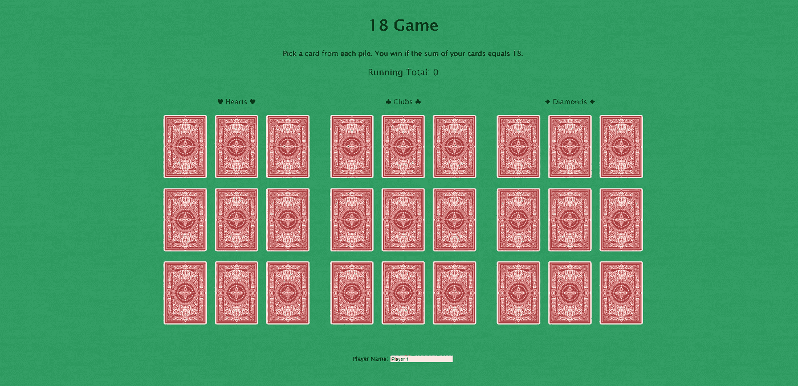
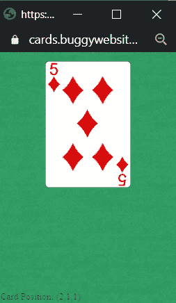
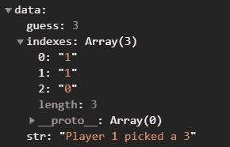
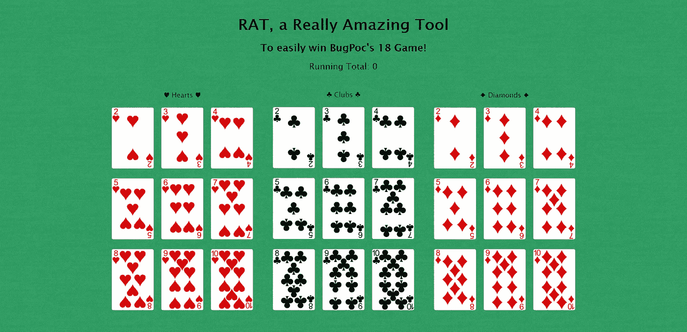
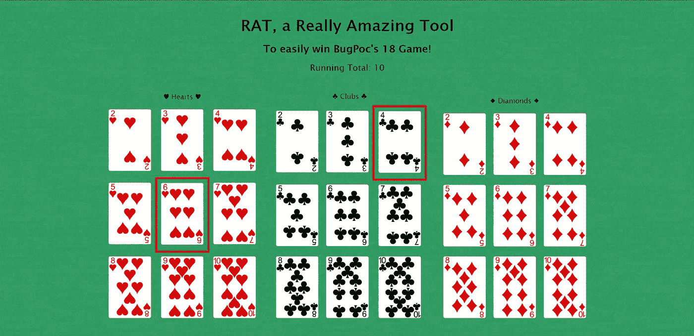
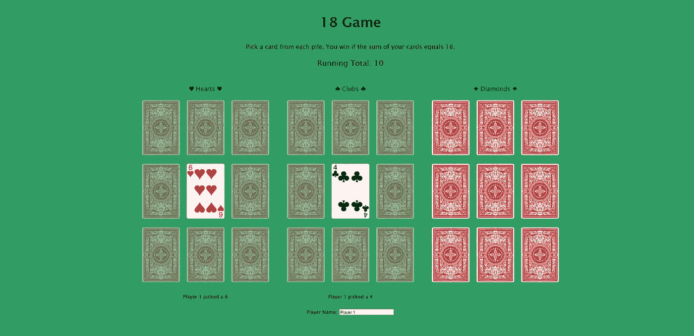
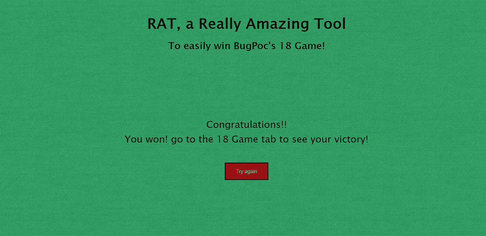
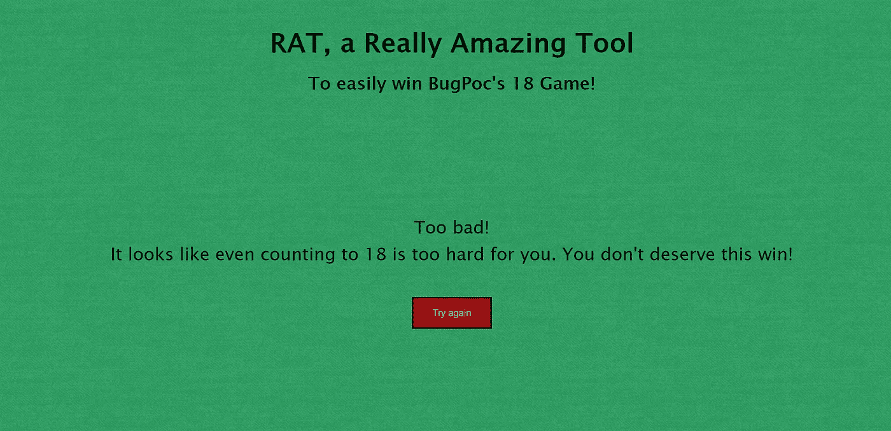

# 黑客 BugPoc 的 18 游戏(XSS 挑战赛)主办的 XXS 鼠

> 原文：<https://infosecwriteups.com/hacking-bugpocs-18-game-xss-challenge-hosted-by-the-xxs-rat-f3f1adc04c8?source=collection_archive---------1----------------------->

为什么我的标题是“黑客”，而这只是一个 XSS 挑战赛？因为没有解决挑战，所以黑了游戏。

当你打开[挑战页面](https://cards.buggywebsite.com/)，首先看到的是这个:

挑战页面

这是一个名为“18 游戏”的游戏，它的目标是拥有三张总和为 18 的牌。这是通过从每堆牌中选择一张来完成的，在你的三张牌被选中后，你将知道你是否赢了。

那么是否有某种策略可以赢得这场游戏呢？不。您选择的卡片是在一个[弹出窗口](https://cards.buggywebsite.com/popup.html#indexes=1|1|0&name=Player%201)中随机选择的，当您点击一张卡片时，弹出窗口就会打开。

弹出随机选择一张牌

弹出窗口用随机选择的卡片向它的开启者发送 post 消息。当检查这个 post 消息时，我们看到 de 数据包含值`guess`、`indexes`和`str`。

*   `guess`包含实际卡号
*   `indexes`包含卡片的位置
*   `str`包含要在游戏主页显示的字符串。

> 在这一点上，我感到非常愚蠢，因为如果我实际查看整个消息，而不仅仅是数据，我会看到 nonce 也被发送，这是解决挑战所需要的。如果你想知道挑战本身的解决方案，看看霍尔姆[的](https://twitter.com/holme_sec)[这篇精彩的文章](https://holme-sec.medium.com/xss-challenge-the-xss-rat-bugpoc-fd551eb7c0eb)！

发布消息中的数据

所以这个`guess`看起来真的很有意思，卡的号码正在被发送到揭幕战。这是否意味着我们可以向开放者发送我们自己的 post 消息？是的，我们可以！在这种情况下，主页没有验证 post 消息来自的域，所以我们可以从我们自己的站点打开这个页面，用我们自己选择的卡向它发送消息。此外，`str`变量容易受到 html 注入的攻击，但事实证明这并不是挑战所需要的。

三条消息后，我终于赢得了比赛！

获奖画面

我决定创建一个工具，让你每次都赢得游戏，而不需要花时间查看帖子请求，因为还有什么比弹出警报更美好的呢？当然是弹出一个胜利的画面！

我做的第一件事是复制粘贴了许多 BugPoc 的代码，并用卡片的正面替换卡片的背面。然后我添加了一个主屏幕来解释这个工具是如何工作的，并在点击开始按钮时打开游戏。

我的工具的开始屏幕

我的工具

因此，当你点击开始按钮，一个新的标签将与 18 游戏打开。然后你必须回到我的页面，你会看到每堆所有可能的卡。在这里，您可以选择每堆 1 张牌。(理论上每堆多张卡是可能的，但我不允许，因为 BugPoc 也阻止了这一点。)

选择的卡片

当您选择一张卡片时，您会看到一个红色的边框，表示您选择了哪张卡片。如果你现在看看 18 游戏的标签，你会看到你选择的卡也在这里可见。

18 游戏中的纸牌

如果您在“我的工具”中选择了最后一张牌，并且总和为 18，您将会得到以下消息。

我的工具中的成功信息

如果你现在去游戏的标签，你会看到胜利的画面！

如果您的卡的总和没有达到 18，您将看到以下消息。

在我的工具中丢失消息

如果你想亲自测试这个工具，你可以在 https://grumpinout.be/RAT 的[找到它](https://grumpinout.be/RAT)

感谢[xssrat](https://twitter.com/theXSSrat)和 [BugPoc](https://twitter.com/bugpoc_official) 带来的有趣挑战和漂亮的 CSP 旁路！