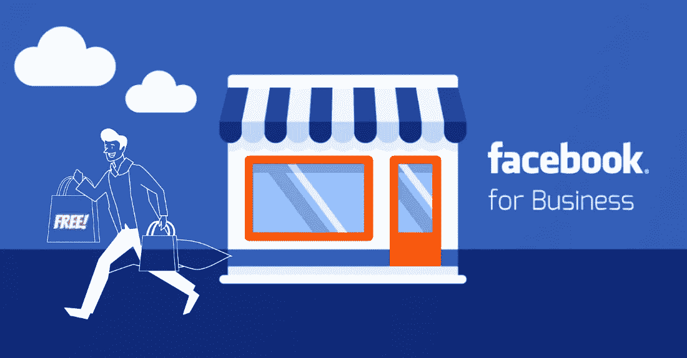
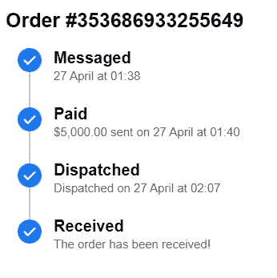
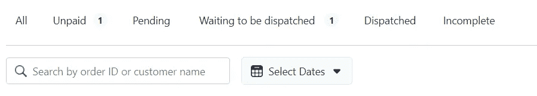
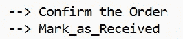
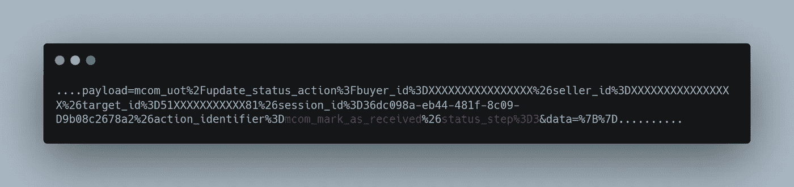

# 黑客脸书发票:我怎么能从脸书商业页面免费购买任何东西

> 原文：<https://infosecwriteups.com/hacking-facebook-invoice-how-i-couldve-bought-anything-for-free-from-facebook-business-pages-42bcfaa73ec4?source=collection_archive---------1----------------------->

…

> 尼泊尔萨米普·阿尔亚尔
> 
> **这篇文章是关于我如何找到一种方法，基本上篡改脸书订单发票的请求，允许我支付任何物品而无需支付实际金额，即我如何使用脸书的订单发票成功注册我的支付，并且基本上免费获得任何物品。**

脸书允许脸书页面使用订单发票创建和管理订单和支出。发票包含四个不同的部分，按销售页面的时间顺序标记，以便最终发货/发送订单。

订单发票基本格式@脸书-商务信使

现在，在元业务套件 的 [**订单和管理选项卡中，每个部分都有其不同的同步页面部分。**](https://business.facebook.com/latest/orders/orders_list?)

订单和支出管理标签@ Meta Business Suite

通过平台销售产品的 Meta(脸书，Instagram)的商业/商务页面创建这样的**发票来跟踪订单**。

在这张发票上。买家可以首先确认订单&然后，在买家为订单付款后，只有卖家页面能够将订单标记为已支付或已发送。之后，如果买家愿意，他可以通过将订单标记为已收到来完成交易。

所以，**买方只能**:

我对 Android 测试 Android Messenger(也称为 **Messenger for Commerce** )的页面消息部分很感兴趣。因此，出于对这张**付款发票**的好奇，我比较了在发票的每一部分做标记时提出的一堆要求。我注意到的是，在确认来自买家的订单时出现了不同类型的 Post 请求，但是当**标记为已收到**时，Post 请求类似于当**标记为已支付**或已发送时发送的请求。

当**标记为已收到**和**标记为已支付**几乎相同时，这让我很兴奋，因为**帖子请求**，因为它们包含相同的端点。

标记为已接收时发布请求

唯一不同的是，在 status_step=3 的第一个消息中， **action_identifier** 包含端点 **mcom_mark_as_received** ，但是当从卖方页面方标记为已支付时， **action_identifier** 包含 status_step=1 的端点**mcom _ mark _ as _ payed**

现在，这两个独立的请求(对于两个独立的方，即卖方页面和买方，具有不同的特权设置)是相同的，并且没有明显或适当的参与者许可——最初检查到行动，我很好奇；如果作为买家，我从其他发票中捕获一个虚假的**标记为已收到的**请求，并用目标订单发票 id 和**动作标识符**替换**目标 id** 到**mcom _ 标记为已支付**。我会代表页面注册目标订单发票的付款吗？

> 但是没有！

它向我显示了一个错误，因为实际上完成**mcom _ mark _ as _ payed**端点请求需要进行权限检查。

感觉像是对重要的端点进行了所有适当的权限检查，比如我试图闯入的**mark _ as _ payed**。但是经过一些模糊处理后，我发现了另一个端点； **mcom_cancel** 将订单发票推至取消状态。这个端点没有任何权限障碍，买方和卖方页面都可以访问它。此外，我发现订单发票的**取消状态可以通过触发上面的任何 post 请求自动恢复到**活动状态。在这里，取消状态似乎与参与者特权检查无关。现在，在这一点上。我想到了一个主意。

## 如果通过触发 mcom_cancel 端点，然后触发带有 mcom _ mark _ as _ payed as action _ identifier 的请求，将订单发票强制推至已取消状态，以便自动将订单发票作为买方置于活动状态，会怎么样？

**转为活跃状态的同时是否也会标记后续支付的订单？**

确实发生了！

这意味着，使用这种方法，我可以简单地用任何其他受害者业务页面的目标订单发票 id 替换使用我自己的页面捕获的虚拟 **mark_as_received** Post 请求中的 **target_id** ，我希望为其注册全额付款，而无需支付实际金额。

这里最好的部分是每一个动作都是代表页面发生的，这意味着这些动作的细节被记录下来并代表页面显示出来(例如:它会显示页面取消了请求或将请求标记为已支付)。此外，所有这些活动都与 Meta Business Suite 的订单和支付管理部分同步**，其中**订单将到达等待发货/发货部分**，并带有卖方页面已经收到付款金额以及所有其他真实订单的标记。在大多数情况下，卖家页面可能会在看到订单付款并等待发货时发货。**

所以，利用这个漏洞；任何恶意购买者都可以简单地下订单，操纵请求端点，代表页面本身注册一个假的付款，并免费购买任何商品。

****时间轴****

****报道***:2022 年 5 月*

**:2022 年 5 月**

*****固定***:2022 年 7 月**

*****悬赏***:2022 年 7 月 19 日{ **250$** **？** }**

## **感谢您阅读这篇文章。如果你有任何疑问/建议，我可以在[脸书](https://www.facebook.com/samiparyalfb/) / [Instagram](https://www.instagram.com/samiparyal_/) 上找到你。**