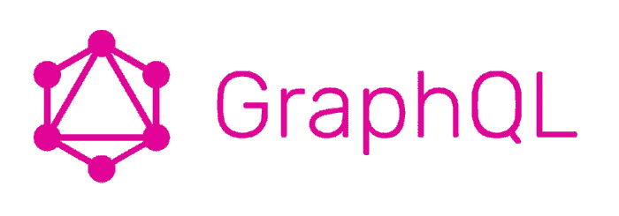
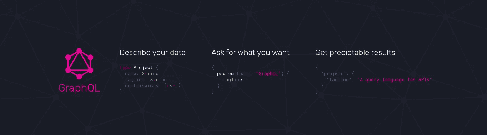
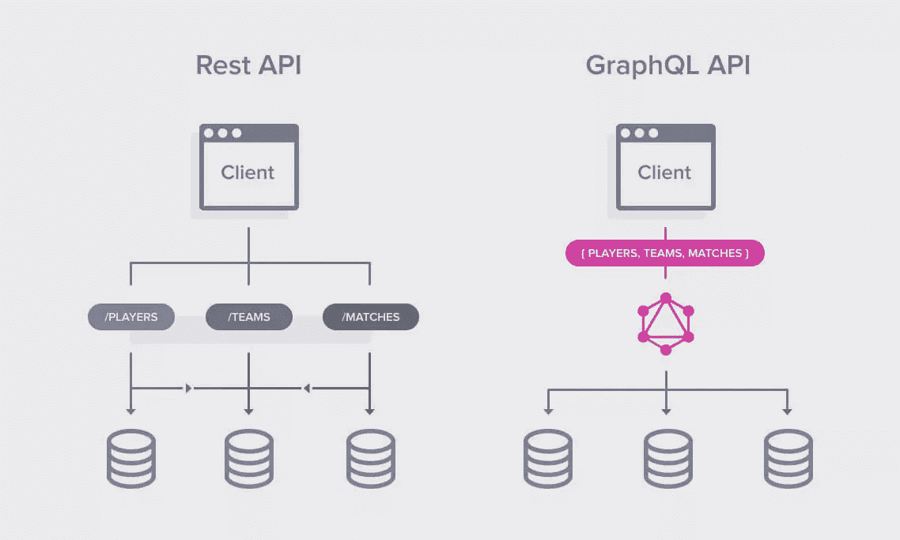
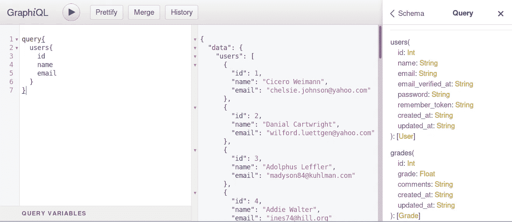
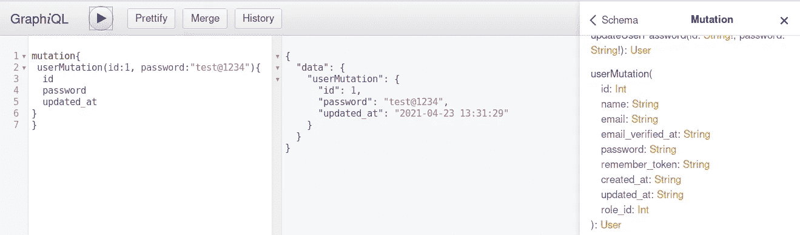
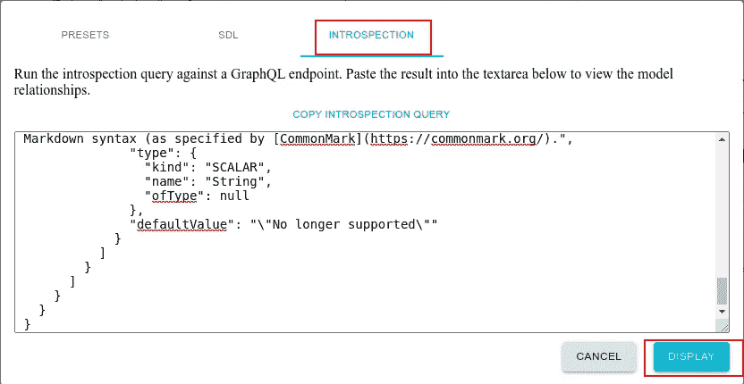
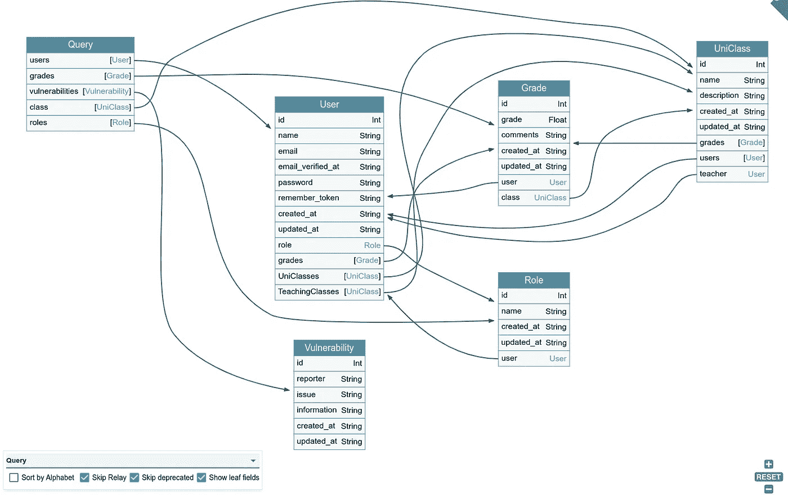

# 为了乐趣和利益而入侵 GraphQL——第 1 部分——理解 graph QL 基础知识

> 原文：<https://infosecwriteups.com/hacking-graphql-for-fun-and-profit-part-1-understanding-graphql-basics-72bb3dd22efa?source=collection_archive---------0----------------------->



大家好！！

在 GraphQL 黑客系列的第一部分中，我将介绍一些 GraphQL 的基础知识，以便更好地理解技术，在下一部分中，我们将实际攻击一个演示应用程序。有很多好的资源可以利用，特别是官方文档。这篇博客只是对该技术以及如何利用现有资源获得最佳结果的概述。所以让我们开始吧…

# **graph QL 是什么？**



GraphQL

根据官方文件，

> GraphQL 是 API 的查询语言，也是使用您为数据定义的类型系统执行查询的服务器端运行时。GraphQL 不依赖于任何特定的数据库或存储引擎，而是由您现有的代码和数据提供支持。

用简单的术语来说，GraphQL 是一种数据查询和操作语言，执行与 REST 相同的功能。与 RESTful HTTP 方法类似，使用 GraphQL，我们可以在 API 中以更高的精度进行 CRUD 操作。

# **为什么选择 GraphQL？**



Rest API 与 GraphQL

GraphQL 解决了 REST API 实现的以下两个主要问题。

1.  不必要的数据提取导致利用高带宽(*超过提取*)
2.  不同功能的不同端点的不必要实现导致复杂性，并且需要从前端进行多次调用来获得所需的数据。(*下取*)

上面提到的两个问题都是由 GraphQL 解决的，因为你可以查询相同的 URL 端点来执行不同的操作，你也可以只查询你想要的数据，这最终节省了计算时间和内存。

# GraphQL 是如何工作的？

如前所述，只有一个端点需要请求，但同时你必须确定你需要什么信息，因为 GraphQL 只会返回被请求的信息。

GraphQL 包含以下操作类型:

## **查询**

它用于使用专门定义的查询操作来获取数据。类似于 API 中的 GET 请求。您可以轻松地请求任何字段，包括与该字段相关联的数据。

查询是您实际上向服务器询问您想要什么，服务器将使用您所要求的相同数据进行响应。查询可以有参数，基于这些参数可以查询特定的数据。



正如我们在上面的快照中看到的，右边是我们可以询问的数据量，左边是我们已经询问了我们想要的数据。

## **突变**

如果查询用于获取数据，则*突变用于在系统*中执行插入、更新、删除数据。它类似于删除、上传、发布请求。在 GraphQL 中这样做的好处是，我们可以在同一个请求中请求更新的内容，所以不需要以不同的方式查询它。(还记得 REST API 的问题吗？)



正如您在上面的快照中看到的，有一个名为 *userMutation* 的突变，我们已经提供了密码，该密码最终更改了包含 id“1”的用户的密码。

## **解析器功能**

*解析器是一个负责为模式中的单个字段填充数据的函数。*它可以以您定义的任何方式填充数据，例如从后端数据库或第三方 API 获取数据。

其他一些我们不会在博客中讨论的组件，比如**订阅**、**片段**和**指令**。

# **去哪里找？**

让我们来看看实际情况，在这里我们可以找到 GraphQL，以及我们如何识别应用程序正在使用 GraphQL 实现。有多种方法可以识别应用程序正在使用 GraphQL。其中一些是:

1.  **特定端点:**有时 GraphQL 端点会启用 IDE 接口，如下所示:

 [## 带有标题的 GraphiQL Online 由 Hasura 构建

### GraphiQL 的在线版本。轻松管理标题。测试您的 GraphQL 服务器

graphiql-online.com](https://graphiql-online.com/)  [## 在线图表

### 编辑描述

lucasconstantino.github.io](https://lucasconstantino.github.io/graphiql-online/) 

2 **。端点模糊化:**可以使用下面的公共端点列表来模糊化端点。

 [## 丹尼尔·米斯勒/塞克里斯特

### SecLists 是安全测试人员的伴侣。它是安全期间使用的多种类型列表的集合…

github.com](https://github.com/danielmiessler/SecLists/blob/fe2aa9e7b04b98d94432320d09b5987f39a17de8/Discovery/Web-Content/graphql.txt) 

# **自省**

自省是查询当前 API 模式中哪些资源可用的能力。给定 API，通过自省，我们可以看到它支持的查询、类型、字段和指令。

[](https://graphql.org/learn/introspection/) [## 反省

### 询问 GraphQL 模式关于它支持哪些查询的信息通常是有用的。GraphQL 允许我们这样做…

graphql.org](https://graphql.org/learn/introspection/) 

拥有一个公开可用的自省查询并不是一个错误。这是一个特点。如果是生产环境，禁用它将被视为最佳做法。但有时它会透露一些敏感的细节，这可以被认为是一个错误。自省查询给出了完整的文档和后端可用 API 调用的列表，以及系统结构的良好概述。

**例子:**

1.  单行查询转储不带片段的数据库模式。

```
__schema{queryType{name},mutationType{name},types{kind,name,description,fields(includeDeprecated:true){name,description,args{name,description,type{kind,name,ofType{kind,name,ofType{kind,name,ofType{kind,name,ofType{kind,name,ofType{kind,name,ofType{kind,name,ofType{kind,name}}}}}}}},defaultValue},type{kind,name,ofType{kind,name,ofType{kind,name,ofType{kind,name,ofType{kind,name,ofType{kind,name,ofType{kind,name,ofType{kind,name}}}}}}}},isDeprecated,deprecationReason},inputFields{name,description,type{kind,name,ofType{kind,name,ofType{kind,name,ofType{kind,name,ofType{kind,name,ofType{kind,name,ofType{kind,name,ofType{kind,name}}}}}}}},defaultValue},interfaces{kind,name,ofType{kind,name,ofType{kind,name,ofType{kind,name,ofType{kind,name,ofType{kind,name,ofType{kind,name,ofType{kind,name}}}}}}}},enumValues(includeDeprecated:true){name,description,isDeprecated,deprecationReason,},possibleTypes{kind,name,ofType{kind,name,ofType{kind,name,ofType{kind,name,ofType{kind,name,ofType{kind,name,ofType{kind,name,ofType{kind,name}}}}}}}}},directives{name,description,locations,args{name,description,type{kind,name,ofType{kind,name,ofType{kind,name,ofType{kind,name,ofType{kind,name,ofType{kind,name,ofType{kind,name,ofType{kind,name}}}}}}}},defaultValue}}}
```

2.转储数据库模式的 URL 编码查询。

```
fragment+FullType+on+__Type+{++kind++name++description++fields(includeDeprecated%3a+true)+{++++name++++description++++args+{++++++...InputValue++++}++++type+{++++++...TypeRef++++}++++isDeprecated++++deprecationReason++}++inputFields+{++++...InputValue++}++interfaces+{++++...TypeRef++}++enumValues(includeDeprecated%3a+true)+{++++name++++description++++isDeprecated++++deprecationReason++}++possibleTypes+{++++...TypeRef++}}fragment+InputValue+on+__InputValue+{++name++description++type+{++++...TypeRef++}++defaultValue}fragment+TypeRef+on+__Type+{++kind++name++ofType+{++++kind++++name++++ofType+{++++++kind++++++name++++++ofType+{++++++++kind++++++++name++++++++ofType+{++++++++++kind++++++++++name++++++++++ofType+{++++++++++++kind++++++++++++name++++++++++++ofType+{++++++++++++++kind++++++++++++++name++++++++++++++ofType+{++++++++++++++++kind++++++++++++++++name++++++++++++++}++++++++++++}++++++++++}++++++++}++++++}++++}++}}query+IntrospectionQuery+{++__schema+{++++queryType+{++++++name++++}++++mutationType+{++++++name++++}++++types+{++++++...FullType++++}++++directives+{++++++name++++++description++++++locations++++++args+{++++++++...InputValue++++++}++++}++}}
```

当你这样做的时候，反响可能会很大。理解该模式的最佳方式是将其可视化。下面是实现这一点的步骤。

1.  *复制整个响应正文*
2.  *转到* [*GraphQL 航海家*](https://apis.guru/graphql-voyager/)


3.*点击“更改模式”按钮，进入“自检”选项卡。*


4.*粘贴自检查询。*



5.点击显示屏，你会看到整个后端的可视化。



现在使用这种方法，我们可以识别敏感的 API 调用并滥用它们(显然是以道德的方式)。

在我们的[下一篇博客](https://busk3r.medium.com/hacking-graphql-for-fun-and-profit-part-2-methodology-and-examples-5992093bcc24)中，我们将通过一个演示应用程序来理解这一切。希望你能学到新东西，喜欢我的博客。保持安全，保持好奇。

感谢阅读！祝你有美好的一天。

~Nishith K

[](https://twitter.com/busk3r) [## JavaScript 不可用。

### 编辑描述

twitter.com](https://twitter.com/busk3r)  [## Nishith K 安全分析师- Net Square Solutions Pvt. Ltd

### 查看世界上最大的职业社区 LinkedIn 上 Nishith K 的个人资料。Nishith 有 3 个工作列在他们的…

in.linkedin.com](https://in.linkedin.com/in/nishithkhadadiya) 

# **参考文献:**

1.  [https://graphql.org/learn/](https://graphql.org/learn/)
2.  [https://medium . com/swlh/using-restful-API-vs-graph QL-1e6c 350d 56 c 9](https://medium.com/swlh/using-restful-apis-versus-graphql-1e6c350d56c9)
3.  [https://payatu.com/blog/manmeet/graphql-exploitation-part-1](https://payatu.com/blog/manmeet/graphql-exploitation-part-1)
4.  [https://github . com/swisskyrepo/payloads all the things/tree/master/graph QL % 20 injection](https://github.com/swisskyrepo/PayloadsAllTheThings/tree/master/GraphQL%20Injection)
5.  [https://the-Bilal-rizwan . medium . com/graph QL-common-vulnerabilities-how-to-exploit-them-464 f 9 fdce 696](https://the-bilal-rizwan.medium.com/graphql-common-vulnerabilities-how-to-exploit-them-464f9fdce696)
6.  [https://blog . yeswehack . com/yeswerhackers/how-exploit-graph QL-endpoint-bug-bounty/](https://blog.yeswehack.com/yeswerhackers/how-exploit-graphql-endpoint-bug-bounty/)