# 为了乐趣和利益而入侵 GraphQL 第 2 部分——方法和例子

> 原文：<https://infosecwriteups.com/hacking-graphql-for-fun-and-profit-part-2-methodology-and-examples-5992093bcc24?source=collection_archive---------1----------------------->

GraphQL

大家好，

我带着黑客 GraphQL 系列的另一部分回来了。我们已经在[的上一篇文章](https://busk3r.medium.com/hacking-graphql-for-fun-and-profit-part-1-understanding-graphql-basics-72bb3dd22efa)中讲述了基础知识。我强烈推荐你阅读[邮报](https://busk3r.medium.com/hacking-graphql-for-fun-and-profit-part-1-understanding-graphql-basics-72bb3dd22efa)，如果你还没有的话。在这篇博客中，我们将通过一个由 awesome [InsiderPHD](https://twitter.com/insiderphd) 创建的名为[通用大学](https://github.com/InsiderPhD/Generic-University)的演示应用程序来了解一些基本的错误，并设计一个测试 GraphQL 的方法。

# GraphQL 实现中的漏洞

让我们开门见山，直奔主题，所有可以在 REST APIs 中找到的 bug 都可以在 GraphQL 中找到。包括但不限于以下内容-

[**OWASP API 安全前 10 名**](https://owasp.org/www-project-api-security/)

1.  API1:2019 —对象级授权中断
2.  API2:2019 —身份验证被破坏
3.  API3:2019 —过度的数据暴露
4.  API4:2019 —缺乏资源和速率限制
5.  API5:2019 —中断的功能级别授权
6.  API6:2019 —批量分配
7.  API7:2019 —安全错误配置
8.  API8:2019 —注射
9.  API9:2019 —资产管理不当
10.  API10:2019 —记录和监控不足

GraphQL 的实现是一个复杂的过程，因此在 GraphQL 中很少有常见的 bug。有些是-

*   认证问题
*   授权问题
*   信息披露
*   拒绝服务

## GraphQL —特定的错误

[批处理攻击](https://lab.wallarm.com/graphql-batching-attack/):要理解这种攻击，需要批处理的基础知识。根据文件记载，

> “批处理是指在短时间内收集来自后端的多个数据请求，然后通过使用脸书的 DataLoader *等工具，在单个请求中将其发送到底层数据库或微服务。*

你就会知道哪里会出错。我们可以在一个*单个请求*中向*单个端点*发送*多个请求*，而不用担心被阻塞。

# 工具

有多种工具可用，但我们将在这篇文章中探讨其中的一些。

## [GraphQL 航海家号](https://apis.guru/graphql-voyager/)

GraphQL Voyager 基于自省查询结果给出了特定 GraphQL 实现的模式的可视化表示。我们在之前的[博文](https://busk3r.medium.com/hacking-graphql-for-fun-and-profit-part-1-understanding-graphql-basics-72bb3dd22efa)中已经看到了。

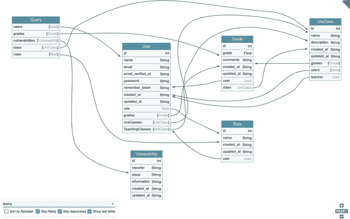

graphql 航海家号

## [InQL](https://github.com/doyensec/inql)

InQL 可以作为独立的脚本使用，也可以作为[打嗝套件](https://portswigger.net/burp)的扩展。对于打嗝爱好者和超级用户来说，这是测试 GraphQL 问题的最佳工具之一。InQL 只会将 graphql 端点作为输入，并自动发送自省查询，显示数据。其中一个好处是，我们可以将请求发送到中继器进行进一步的检查和调整。最重要的是，它可以生成文档，并且还有一个内置的 GraphQL IDE！！

InQL 在行动-

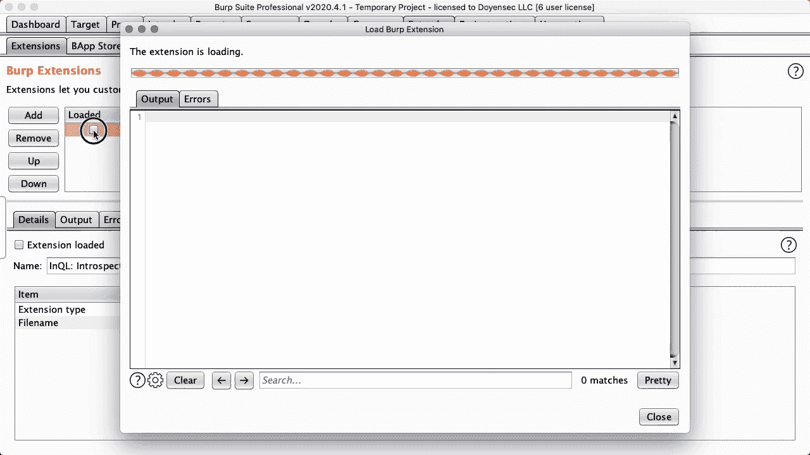

InQL 演示

## [图表 QL-路径-枚举](https://gitlab.com/dee-see/graphql-path-enum)

这个工具列出了在 GraphQL 模式中达到给定类型的不同方法。它将自检查询结果作为输入。你可以在这个工具的创造者的博客文章[中找到更多关于它的信息。](https://blog.deesee.xyz/graphql/security/2020/04/13/graphql-permission-testing.html)

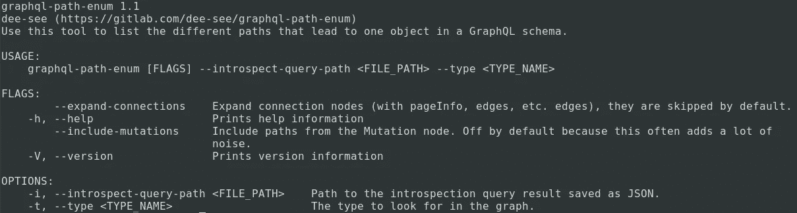

graphql-path-enum

## [图表地图](https://github.com/swisskyrepo/GraphQLmap)

GraphQLmap 是一个脚本引擎，用于与 graphql 端点进行交互以进行测试。它有多种特性，如转储模式、自动完成查询、字段模糊化和 graphql 字段中的一些常见注入模糊化。

图表地图

# 方法学

让我们继续接近使用 GraphQL 的目标。

1.  **识别**

我们可以通过多种方式来识别应用程序是否使用 GraphQL..其中一些包括-

*   观察请求和响应结构。*查询、突变*或其他表示正在使用的 GraphQL 的词
*   存在 GraphiQL 端点。如果你找不到一个常用的地方，使用常见的端点名称是一个选择。

 [## 丹尼尔·米斯勒/塞克里斯特

### SecLists 是安全测试人员的伴侣。它是安全期间使用的多种类型列表的集合…

github.com](https://github.com/danielmiessler/SecLists/blob/fe2aa9e7b04b98d94432320d09b5987f39a17de8/Discovery/Web-Content/graphql.txt) 

*   泄露 GraphQL 相关详细信息的错误。

2.**使用自检查询**

通过使用自省查询，我们可以识别当前 API 模式中的可用资源。一些例子可以在之前的文章中找到。InQL 也在后台发送自省查询。如果您想要手动运行查询，请参考-

 [## swisskyrepo/payloads all things

### GraphQL 是 API 的查询语言，也是用现有数据完成这些查询的运行时。GraphQL 服务…

github.com](https://github.com/swisskyrepo/PayloadsAllTheThings/tree/master/GraphQL%20Injection#enumerate-database-schema-via-introspection) 

3.**可视化自检结果**

收到响应后，我们需要可视化数据。启动 [*GraphQL 航海家*](https://apis.guru/graphql-voyager/) 并粘贴结果。它将让您了解 GraphQL 结构是如何定义的。

 [## GraphQL 航海家号

### 将任何 GraphQL API 表示为交互式图形

apis.guru](https://apis.guru/graphql-voyager/) 

4.**列出突变**

如果你观察过 GraphQL Voyager 的输出，你会意识到**它没有显示突变**。我们可以使用 graphiql endpoint 或甚至 InQL 数据来检查所有可供我们使用的突变。

**重要提示:**

如果自省被禁用，这种方法将不起作用。如果您在测试时遇到这种情况，唯一的方法就是仔细检查每一个可用的功能，并观察 Burp 中的请求和响应。如果您对应用程序有所了解，还可以使用一些智能模糊技术来识别端点。

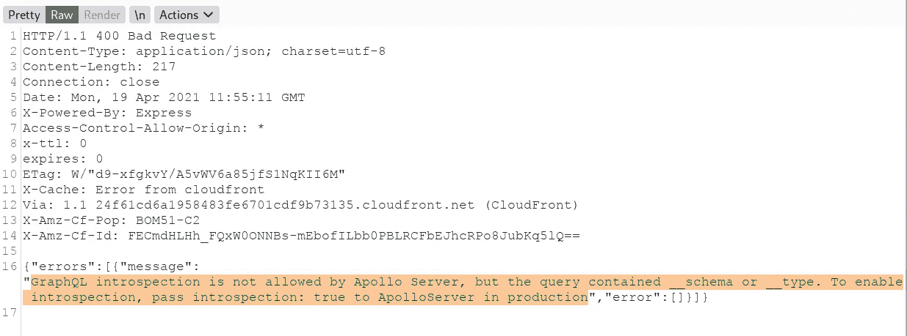

生产中禁用自检查询

# 演示应用示例-普通大学

既然我们已经完成了方法的构建，我们将使用[通用大学](https://github.com/InsiderPhD/Generic-University)进行演示。

注意:我已经创建了一个应用程序的 docker，所以你可以很容易地在你的系统上设置它。只需点击下面的链接，就可以在您的环境中部署它了。

 [## 码头枢纽

### 编辑描述

hub.docker.com](https://hub.docker.com/r/busk3r/genericuniversity) 

存储库中提到了一系列挑战。出于演示目的，我们将尝试解决其中的一些问题。您可以在这里找到完整列表-

 [## 内部博士/普通-大学

### 通用大学的 IT 部门很高兴发布他们的新工具，这样学生就可以在网上看到他们所有的成绩…

github.com](https://github.com/InsiderPhD/Generic-University#your-goals) 

## 目标:强制 API 寻找新的端点

首先，让我们确定可供我们使用的端点。

运行带有有效负载列表的“dirb”工具会给我们提供一些有趣的访问端点。

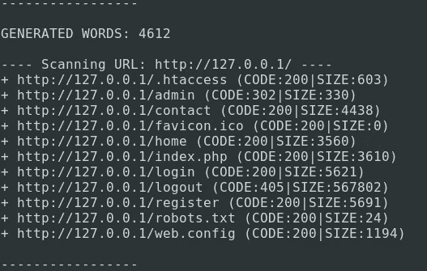

dirb

让我们模糊一下 GraphQL 的具体端点。

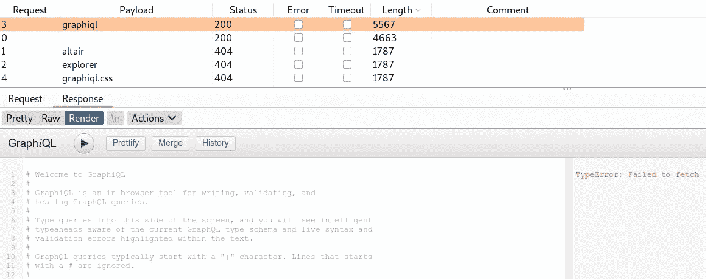

入侵者模糊

似乎我们已经找到了可以玩的 GraphiQL 实例。

单击按钮和链接，我们能够识别以下目录结构。

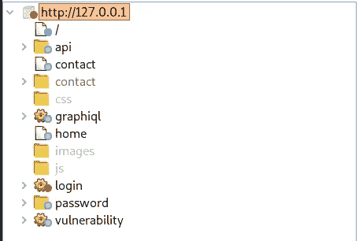

目录 _ 结构

让我们运行自省查询，并尝试使用 GraphQL voyager 映射所有内容。

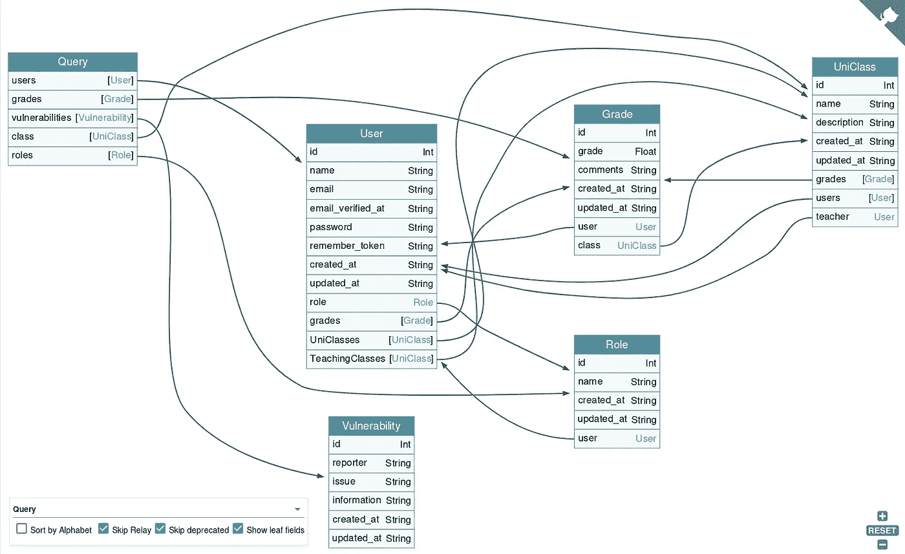

一旦我们得到了可视化的表示，让我们看看是否可以获取一些未经验证的数据。

如果您检查 */admin* 端点的一些敏感数据枚举，它会将我们重定向到 */home* ，这是应用程序的默认页面。让我们记住这个端点，看看将来是否可以使用它。

## 目标:找出班上每个人的分数

让我们从查询一些细节开始。

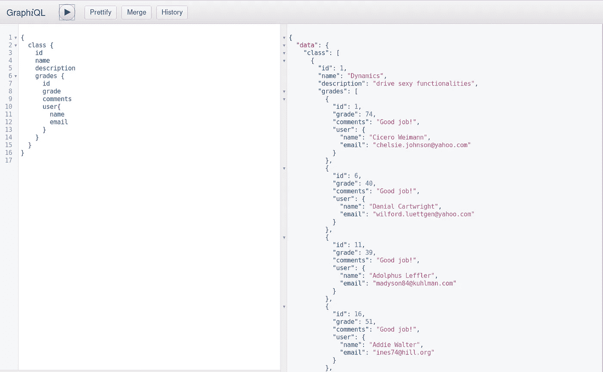

等级

正如我们所看到的，我们有班级的详细信息，我们可以使用上面提到的查询来查询与班级相关的分数和用户详细信息。我们发现了所有未认证用户的详细资料。

*敏感信息泄露*的经典例子。

## 目标:编辑某人的分数

现在我们有了足够的数据，让我们试着改变分数。我们需要用*变异*型来做这样的事情。让我们检查所有可用的突变。

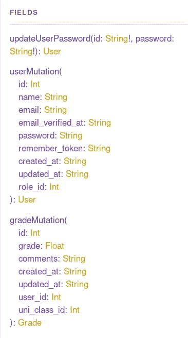

突变

在这里我们可以看到，我们可以使用*等级突变*来更新等级。但在此之前，我们需要查询年级，以便我们可以确定我们想要更改哪个年级。

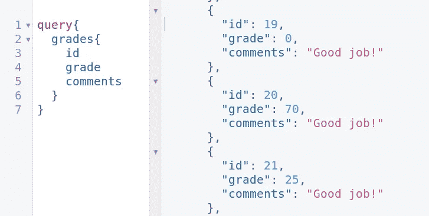

等级标识

看起来 id 19 级最低分是 0。让我们改变这种情况，让用户满意。

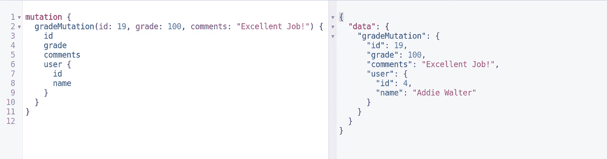

改变等级

我们已经更改了用户“Addie”的等级。您还可以通过传递 id、等级和其他详细信息来查看，我们还要求更改数据。我们不必单独查询。

*IDOR* 的经典例子。

## 目标:更改另一个帐户的密码

如果你观察了所有可能的突变，你就已经知道我们的下一个目标是什么了。更改另一个帐户的密码。修改最高权限用户的密码怎么样？

但为此，我们需要检查哪些角色可供我们使用，并确定哪些用户拥有更高的特权。所以让我们查询一下*用户*，看看他们有什么角色。

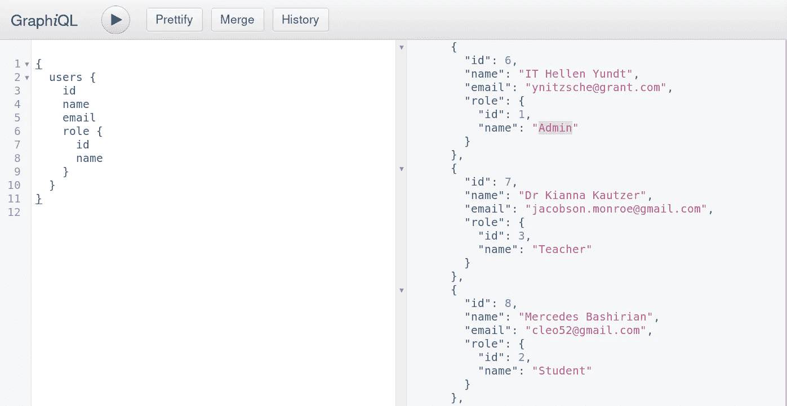

看来我们找到了受害者。我们将更改用户 id 6 的密码。

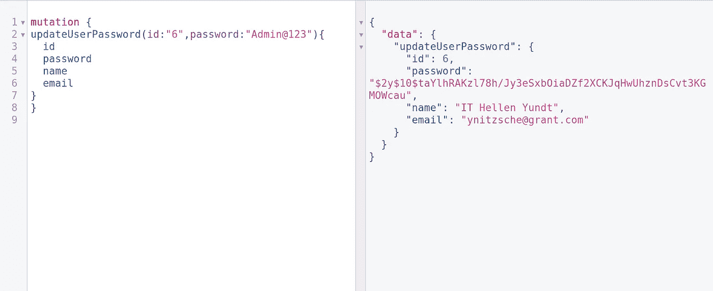

更新 _ 密码

我们刚刚更改了一个管理员帐户的密码。请注意，当我们查询密码时，它在密码字段中向我们发送了无意义的数据。这意味着他们正在使用某种机制来加密可以保存在数据库中的密码。这确实是在数据库中保存密码的最佳实践。让我们用我们的新密码登录来验证一下。

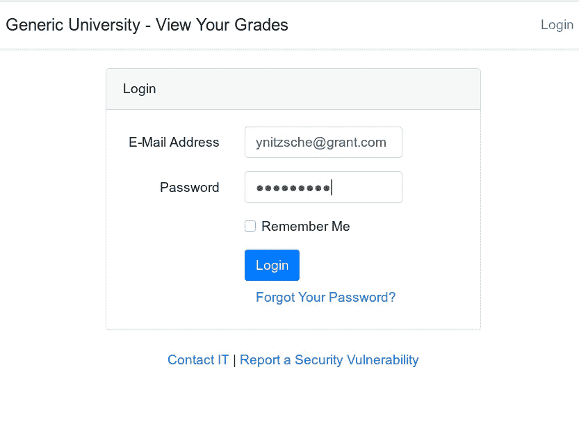

我们进去了。

*管理员账户接管*的经典例子。

## 目标:访问管理 API

让我们看看我们可以在管理员帐户中探索什么。还记得我们的 dirb 结果吗？我们确定了一个名为 */admin* 的端点。让我们试着接近它。

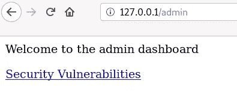

管理端点

瞧啊。我们可以访问管理仪表板。让我们看看我们有哪些安全漏洞。

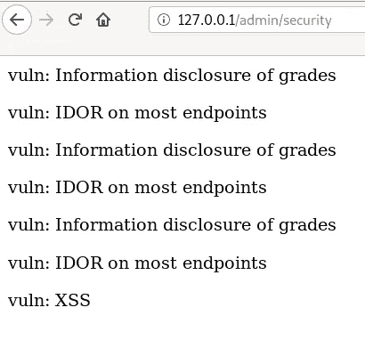

现在我们知道入口中存在漏洞。

# 缓解和最佳实践

我们已经开发了 GraphQL，但更重要的是，我们需要考虑减轻这些问题。下面是我们在使用 GraphQL 开发应用程序时可以考虑的一些缓解点。

## 输入验证

*   使用特定的 GraphQL [数据类型](https://graphql.org/learn/schema/#type-language)，如[标量](https://graphql.org/learn/schema/#scalar-types)或[枚举](https://graphql.org/learn/schema/#enumeration-types)。为更复杂的验证编写定制的 GraphQL [验证器](https://graphql.org/learn/validation/)。
*   为突变输入定义[模式。](https://graphql.org/learn/schema/#input-types)
*   优雅地[拒绝无效输入](https://cheatsheetseries.owasp.org/cheatsheets/Error_Handling_Cheat_Sheet.html)，确保不要透露关于 API 及其验证如何工作的过多信息。
*   总是使用提供安全 API 的库/模块/包，比如参数化语句。
*   使用一个记录良好并积极维护的转义/编码库。

## DoS 预防

*   对传入的查询增加深度限制
*   添加对传入查询的数量限制
*   添加[分页](https://graphql.org/learn/pagination/)来限制单个响应中可以返回的数据量
*   在应用层、基础设施层或两者都添加合理的超时
*   考虑执行查询成本分析，并强制执行每个查询的最大允许成本
*   对每个 IP 或用户(或两者)的传入请求实施速率限制，以防止基本的 DoS 攻击
*   在服务器端实现[批处理和缓存技术](https://graphql.org/learn/best-practices/#server-side-batching-caching)(脸书的[数据加载器](https://github.com/facebook/dataloader)可用于此)

## 访问控制

*   实施适当的访问控制机制，以阻止未经授权的参与者查询或修改其他实体的数据。
*   在边和节点上实施授权检查(参见示例[错误报告](https://hackerone.com/reports/489146)，其中节点没有授权检查，但是边有)。
*   在任何生产或可公开访问的环境中禁用系统范围的自省查询。(这会让我们这样的攻击者日子不好过)
*   在生产或可公开访问的环境中禁用 [GraphiQL](https://github.com/graphql/graphiql) 和其他类似的模式探索工具。

# 脆弱的环境

*   [https://github.com/InsiderPhD/Generic-University](https://github.com/InsiderPhD/Generic-University)
*   [https://github . com/dolevf/Damn-Vulnerable-graph QL-Application](https://github.com/dolevf/Damn-Vulnerable-GraphQL-Application)
*   【https://github.com/righettod/poc-graphql 

# 良好的资源

## 博客

*   [https://labs.detectify.com/2018/03/14/graphql-abuse/](https://labs.detectify.com/2018/03/14/graphql-abuse/)
*   [https://raz0r . name/articles/robbing-graph QL-endpoints-for-fun-and-profit/](https://raz0r.name/articles/looting-graphql-endpoints-for-fun-and-profit/)
*   [https://blog . doyensec . com/2018/05/17/graph QL-security-overview . html](https://blog.doyensec.com/2018/05/17/graphql-security-overview.html)
*   [https://cheatsheetseries . owasp . org/Cheat sheets/graph QL _ Cheat _ sheet . html](https://cheatsheetseries.owasp.org/cheatsheets/GraphQL_Cheat_Sheet.html)
*   [https://blog . yeswehack . com/yeswerhackers/how-exploit-graph QL-endpoint-bug-bounty/](https://blog.yeswehack.com/yeswerhackers/how-exploit-graphql-endpoint-bug-bounty/)
*   [https://the-Bilal-rizwan . medium . com/graph QL-common-vulnerabilities-how-to-exploit-them-464 f 9 fdce 696](https://the-bilal-rizwan.medium.com/graphql-common-vulnerabilities-how-to-exploit-them-464f9fdce696)
*   [https://lab.wallarm.com/graphql-batching-attack/](https://lab.wallarm.com/graphql-batching-attack/)

## 录像

*   [https://youtu.be/jyjGneKJynk](https://youtu.be/jyjGneKJynk)
*   [https://youtu.be/viWzbPuGqpo](https://youtu.be/viWzbPuGqpo)
*   [https://youtu.be/NPDp7GHmMa0](https://youtu.be/NPDp7GHmMa0)
*   [https://youtu.be/DbFV24SuSSU](https://youtu.be/DbFV24SuSSU)

希望你学到了新的东西，喜欢我的博客。保持安全，保持好奇。

感谢阅读！

~Nishith K

与我联系

 [## JavaScript 不可用。

### 编辑描述

twitter.com](https://twitter.com/busk3r)  [## Nishith K 安全分析师- Net Square Solutions Pvt. Ltd

### 查看世界上最大的职业社区 LinkedIn 上 Nishith K 的个人资料。Nishith 有 3 个工作列在他们的…

in.linkedin.com](https://in.linkedin.com/in/nishithkhadadiya)