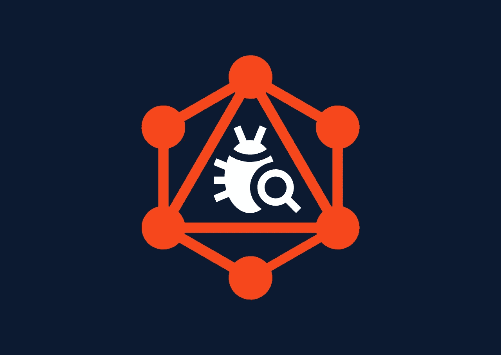
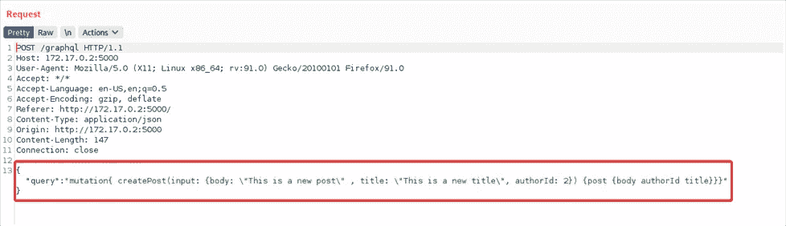
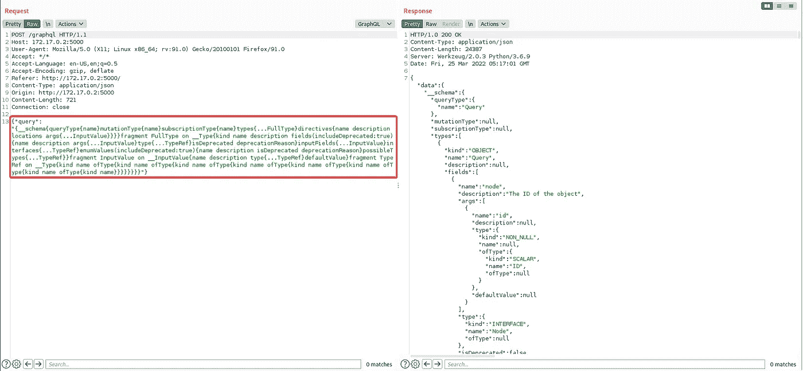
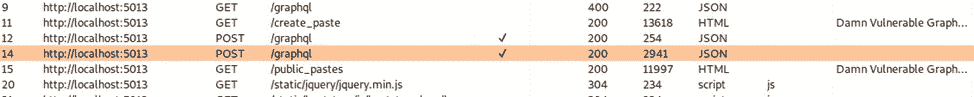
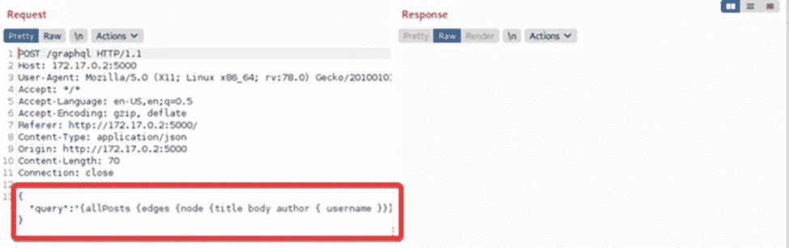
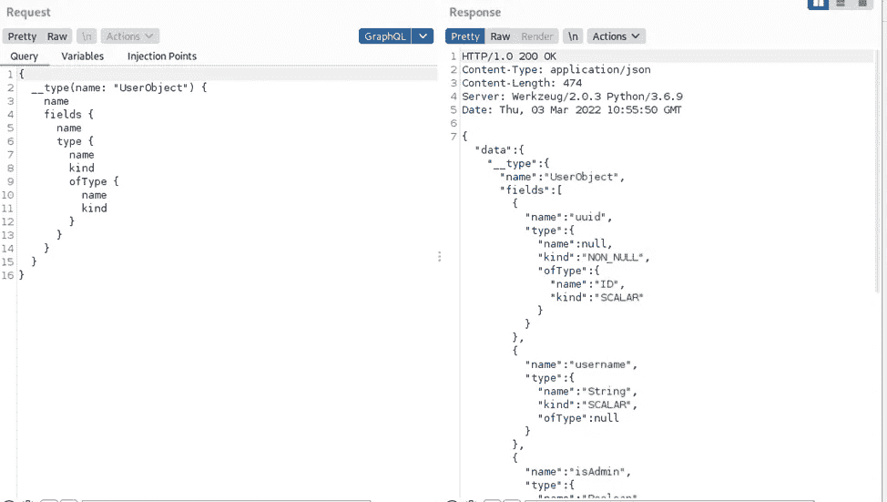
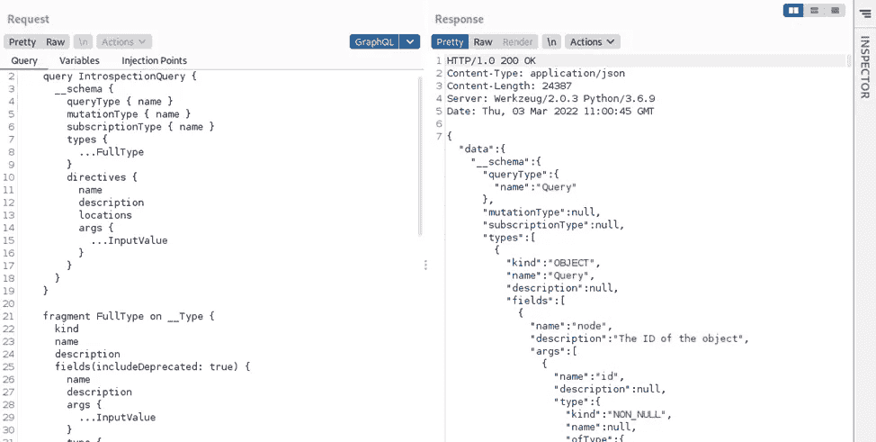
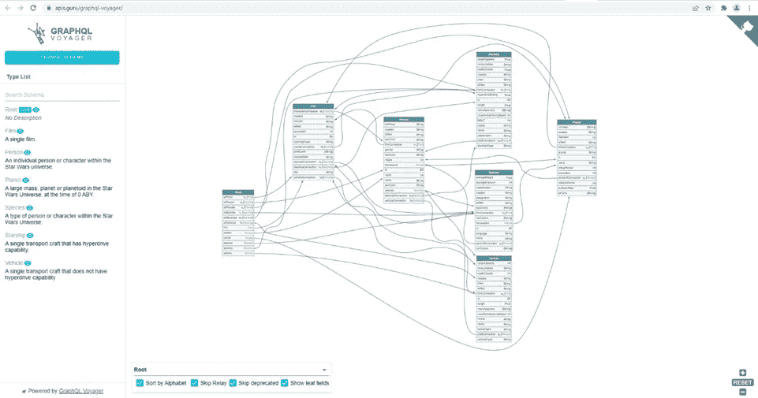

# 黑客图 QL —第 1 部分

> 原文：<https://infosecwriteups.com/hacking-graphql-part-1-61d7a31b30c3?source=collection_archive---------1----------------------->

在黑客攻击 GraphQL 系列的第 1 部分中，我们将讨论 GraphQL 的基础知识以及攻击者如何利用这项服务。



黑客图 QL —第 1 部分

# **什么是 GraphQL？**

简单来说，GraphQL 是一种针对 API 端点的查询语言。它与 API 端点交互，并从后端获取数据。它是 REST 和 SOAP 等 API 标准的替代品。它可以做标准 REST API 端点可以做的大部分事情，有时甚至以一种有效和可控的方式做得更多。

GraphQL 解决了开发人员在使用 REST API 时面临的许多问题，比如获取比所需更多的数据，或者每个调用都需要一个新的端点。

**摘自官方文档:**

> GraphQL 是 API 的查询语言，也是使用您为数据定义的类型系统执行查询的服务器端运行时。GraphQL 不依赖于任何特定的数据库或存储引擎，而是由您现有的代码和数据提供支持。

**样本 GraphQL 查询:**



**GraphQL 查询**

# **请求类型:**

GraphQL 中有两种主要的请求类型——查询和变异。

**查询:**查询用于读取数据。

```
{
  "data":{
    "todos":[
      {
        "title": "Learn GraphQL"
       },
      {
        "title": "Learn about queries"
      }
    ]
  }
}
```

查询和响应具有相似的格式，表明您将在 GraphQL 中得到您所要求的。例如，在上面的代码块中，我们查询了标题。这意味着我们将在随后的响应中获得标题。

**突变:**突变用于插入、更新或删除数据。

```
mutation{
  insert_todos(objects:[{title:"Learn GraphQL"}]){
    Returning{
      Id
      Created_at
    }
  }
}
```

例如，上面的截图描述了一个添加新的待办事项的变化。如果成功，它将返回新插入的待办事项的 id 和创建日期。

**一些常见的 GraphQL 端点:**

很难在一个 GraphQL 实例中列出所有的端点，但许多实现都使用了类似“Appollo”的框架。以下部分列出了 GraphQL 实现中使用的常见端点:

*   /v1/*
*   /v2/*
*   /beta/*
*   /图表
*   /graphql
*   /graph QL/控制台
*   /graphql.php
*   /graphiql
*   /graphic QL . PHP

**GraphQL 模式:**

GraphQL 模式是任何 GraphQL 服务器实现的核心。它描述了连接到 GraphQL 实例的客户端可用的功能。这就像一个蓝图，客户可以通过查询来了解它。

**自省:**

为了获得模式，我们可以向 GraphQL 服务器端点发送一个 HTTP 请求，请求 GraphQL 模式。这种类型的 HTTP 请求称为 GraphQL 自省查询。

自省是查询模式中哪些资源可用的主要能力。通过自省，我们可以看到它支持的查询、类型、字段和指令。不幸的是，自省查询在默认情况下是打开的，因此在渗透测试中值得一试。



**自省查询**

**如何发送自检查询？**

自省查询为我们提供了有关 GraphQL 支持的查询、类型、字段和指令的详细信息，默认情况下，我们可以在每个 GraphQL 实例上使用自省查询。让我们看一个正在运行的自省查询。

**步骤 1:** 使用 Burp 套件拦截 HTTP 请求:



**第二步:**发送 HTTP 请求到打嗝中继器:



**步骤 3:** 用一个通用的自省查询替换 POST 主体，以获取整个后端模式。为此，我们使用了 Burp Suite 的“GraphQL Raider”扩展。



**步骤 4:** 捕获模式以收集敏感的 API 调用。



**样品自检查询:**

```
{"query":"\n query IntrospectionQuery {\r\n __schema {\r\n queryType { name }\r\n mutationType { name }\r\n subscriptionType { name }\r\n types {\r\n ...FullType\r\n }\r\n directives {\r\n name\r\n description\r\n locations\r\n args {\r\n ...InputValue\r\n }\r\n }\r\n }\r\n }\r\n\r\n fragment FullType on __Type {\r\n kind\r\n name\r\n description\r\n fields(includeDeprecated: true) {\r\n name\r\n description\r\n args {\r\n ...InputValue\r\n }\r\n type {\r\n ...TypeRef\r\n }\r\n isDeprecated\r\n deprecationReason\r\n }\r\n inputFields {\r\n ...InputValue\r\n }\r\n interfaces {\r\n ...TypeRef\r\n }\r\n enumValues(includeDeprecated: true) {\r\n name\r\n description\r\n isDeprecated\r\n deprecationReason\r\n }\r\n possibleTypes {\r\n ...TypeRef\r\n }\r\n }\r\n\r\n fragment InputValue on __InputValue {\r\n name\r\n description\r\n type { ...TypeRef }\r\n defaultValue\r\n }\r\n\r\n fragment TypeRef on __Type {\r\n kind\r\n name\r\n ofType {\r\n kind\r\n name\r\n ofType {\r\n kind\r\n name\r\n ofType {\r\n kind\r\n name\r\n ofType {\r\n kind\r\n name\r\n ofType {\r\n kind\r\n name\r\n ofType {\r\n kind\r\n name\r\n ofType {\r\n kind\r\n name\r\n }\r\n }\r\n }\r\n }\r\n }\r\n }\r\n }\r\n }\r\n ","variables":null}
```

反响可能相当大，难以理解。理解这种反应的最好方法是想象它。这可以通过使用“旅行者”工具来完成。



旅行者工具

为了获得与上面相同的结果，在目标上执行自省查询，并将响应粘贴到‘Voyager’工具中。使用这种方法，攻击者可以轻松识别敏感的 API 调用并利用它们。

我们将在 [**黑客图 QL —第二部分**](https://redfoxsec.com/blog/hacking-graphql-part-2/) 中探索更多的攻击媒介。

保持安全，保持健康，负责任地黑客。

**连线我们:** [**网站**](https://redfoxsec.com/) **，**[**LinkedIn**](https://www.linkedin.com/company/redfoxsec/)**，**[**Twitter**](https://twitter.com/redfoxsec)**，** [**脸书**](https://www.facebook.com/redfoxsec/) **。**

【参考文献:
[https://graphql.org/learn](https://graphql.org/learn)
[https://portswigger.net/burp](https://portswigger.net/burp)
[https://apis.guru/graphql-voyager](https://apis.guru/graphql-voyager/)
[https://github.com/portswigger/graphql-raider](https://github.com/portswigger/graphql-raider)

[**Redfox Security**](https://redfoxsec.com/) 是一个由专家安全顾问组成的多元化网络，拥有全球化思维和协作文化。通过结合数据驱动、基于研究和手动测试方法，我们自豪地提供强大的安全解决方案。

“如果你想在网络安全领域出类拔萃，就报名参加我们全面的 [**课程**](https://training.redfoxsec.com/) ，加入我们的成长和发展之旅。”