# 从内向外入侵 HTTP CORS:从理论到实践的方法

> 原文：<https://infosecwriteups.com/hacking-http-cors-from-inside-out-512cb125c528?source=collection_archive---------0----------------------->

# 序

嗨，你好。希望你们都很好。今天，我们将剖析一些 web 应用程序安全控制。

所以，如果你曾经想知道 HTTP **CORS ( *跨源资源共享* )** 的内部工作原理，或者以前从未听说过它，但觉得它像一个至关重要的 web 应用程序概念需要掌握。不管是哪种情况，喝杯咖啡，就像在自己家一样。

在下一节中，我们将深入探讨浏览器和服务器如何处理 CORS 规则。通过使用理论和实践的方法，我希望为您带来一些启示，让您了解应该如何安全地配置 web 资源以使其可信。

概括地说，我们将涵盖以下主题:

*   HTTP CORS 基础考虑*简单与预检* HTTP 请求、同源策略、CORS 标准报头、错误配置等。；
*   深入到一个基于 Docker 的容器化环境中，您可以分析应用程序源代码，并将其与预期行为进行比较；
*   CORS 规则如何应用于不同的 JavaScript API 实现(XHR 和 Fetch)；
*   通过练习示例场景理解 HTTP 请求-响应循环；
*   如何使用手动代理拦截工具绕过 CORS 保护的资源；
*   介绍 API automation CORS 相关项目和其他有用的信息来源。

# 重要的事情先来

# 同源政策(SOP)

在讨论 CORS 事件之前，有必要理解网络资源访问保护的基本概念。我说的是 ***同源政策*** ，也就是俗称的 SOP 的缩写。

早在 1995 年由 Netscape 建立的 SOP 概念现在已经在所有主流的 web 浏览器中发布。

为了避免外部方对资源的未授权使用，浏览器依靠基于来源的限制策略。形式上，所述外部方通过它们的来源(域)来识别，并通过 URL 来访问。

由给定的**来源 A** 持有的文档只能被来自相同**来源 A** 的其他文档访问。如果 SOP 有效到位，则此规则有效(取决于浏览器实现)。该策略旨在减少潜在攻击媒介的机会。

但是让我们来描述一下起源是什么样子的。一个原点可以理解为元组:

*   **<模式(或协议)>** — **<主机名>** — **<端口>**

因此，只有当两个 URL 共享相同的元组时，它们才表示相同的来源。URL`***http://hacking.cors.com/mr_robots.txt***的来源变化和类别的示例:

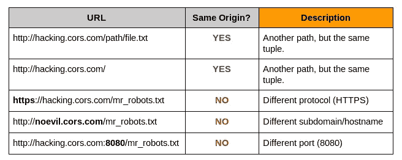

领域类型分化

此外，请记住，SOP 允许使用 GET 和 POST 方法的跨来源 HTTP 请求。但是它禁止起源间的上传和删除。除此之外，只允许在跨源请求的上下文中发送自定义 HTTP 头，拒绝外国人[【2】](https://www.w3.org/Security/wiki/Same_Origin_Policy#Details)。

# SOP 差异

有一些不同类型的*同源政策*。在实践中，如果技术到位，它们是在特定规则下应用的。

制定的主要 SOP 政策是针对 **DOM(文档对象模型)访问**。它是一种处理 JavaScript 和其他脚本语言跨域访问 DOM 属性和方法的能力的机制。

**DOM 访问**主要基于`*document . domain*`**DOM**的属性状态。但是对于不考虑` *document.domain* `属性的 **JavaScript 的 XMLHttpRequest API，**来说，这是无效的。目前，不要太担心这些细节。我们应该很快回到这个话题。

因此，如果我们把 SOP 作为一个沙箱概念，那么为其他 web 技术提供相同来源的实现就变得合理了。 ***cookies、Java、old-R.I.P Flash*** 的情况，以及它们各自的 SOP 策略特性。

# HTTP CORS 基础

SOP 技术无疑是朝着更安全的 web 应用程序迈出的一大步。但是默认情况下，它会应用拒绝规则。

万维网的真正本质是网页可以通过网络与其他资源进行交流。Web 应用程序意味着访问外部资源。

那么我们如何在保持受限资源安全访问的同时，放宽同源规则呢？你猜对了: **CORS** 。

简单来说， ***跨源资源共享*** 允许特定域/源的页面消耗另一个域/源的资源。同意谁可以访问资源是资源所有者(服务器)的责任。

浏览器-服务器信任关系通过一系列 *CORS HTTP 报头*[*【3】*](https://developer.mozilla.org/en-US/docs/Web/HTTP/Headers#CORS)形成。在一般情况下，它们被资源的 web 服务器(如 Nginx、Apache、IIS 等)添加到 HTTP 请求和响应中。)，通过应用程序或浏览器。然后，CORS 报头指示请求浏览器是否信任来源，并继续进行响应处理。

让我们在这里喘口气。请注意，浏览器完全信任从服务器返回的响应。请记住这一点。

# 简单的请求

与飞行前请求相比，有一些简单的请求。 ***简单要求*** 是尊重以下条件的人:

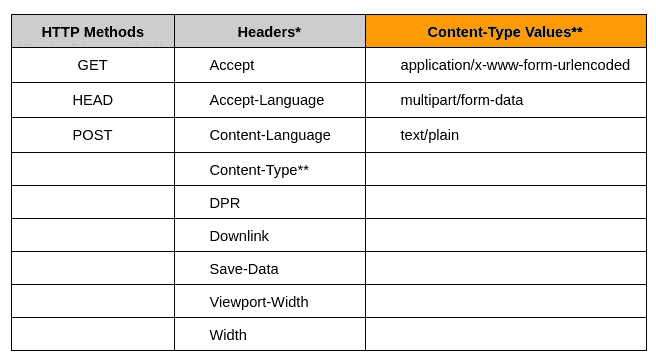

简单请求组合

在进行异步 HTTP 请求时，我们经常使用已经呈现的**XMLHttpRequest**[【5】](https://developer.mozilla.org/en-US/docs/Web/API/XMLHttpRequest)或者新的**Fetch**[【6】](https://fetch.spec.whatwg.org/)JavaScript API。

# 飞行前 HTTP 请求

有时浏览器会发出一个 ***预检 HTTP 请求*** 。它打算向服务器查询它授权和支持哪些 CORS 属性。然而，这并没有改变服务器和浏览器之间的信任关系。

预检 HTTP 请求(采用 ***HTTP 选项请求*** 的形式)产生同样可信的 HTTP 响应。唯一的区别在于头，它指示浏览器如何继续获取预期的跨源资源。

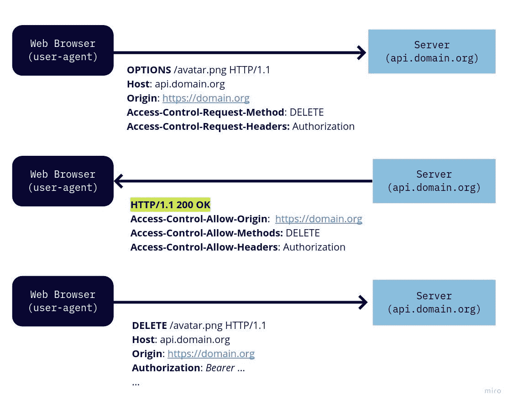

*从****api.domain.org***中删除***avatar.org****资源的预请求航班流程*

当我们转到本文的实践部分时，这将变得更加令人愉快。

# CORS 基本标题

通过 CORS 实现原产地控制涉及以下标题系列:

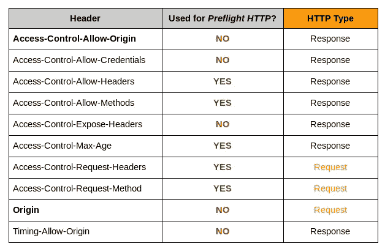

CORS 标头系列及其各自的 HTTP 类型

在用于预检的 HTTP***栏标有**是**的标题起到重要的预检功能。***

它从指明允许哪些特定的头( ***访问控制允许头*** )和 HTTP 方法( ***访问控制允许方法*** )，浏览器应该缓存预检请求的最大秒数( ***访问控制最大年龄*** )，请求源( ***来源*** )，到允许量( ***访问***

在整个上下文中，**访问控制允许起源(ACAO)** 是关于跨起源授权的最相关的报头。通过这个头，服务器能够告诉浏览器它应该信任哪些域。

然而，这种强大的力量伴随着重大的责任。

# 允许太多一点也不酷

我们很清楚，CORS 是推广 SOP 政策的有效途径。然而，我们应该考虑完全非限制性规则的影响。让我们以下面的陈述为例:

*   **访问控制允许来源:***

上面的头意味着每个源都可以访问所需的资源。这相当于在 SOP 出现之前旧浏览器的早期配置。但是要注意故事的另一面，正如应用程序安全文献所谨慎描述的那样。

> *“显然，在某些情况下，访问控制允许来源* ***的通配符值不是不安全的*** *。例如，如果许可策略仅用于提供* ***不包含*** *敏感信息的内容。”*
> 
> *浏览器黑客手册第二版。—第四章绕过同源政策*

但是，您应该小心使用通配符。事实上，推荐的方法是明确授权来源的访问权限。如果服务器不提供任何 CORS 报头，浏览器将采取 ***同源策略(SOP)*** 的姿态。

# 基于 Docker 的提议场景

首先，让我们克隆`**hacking-CORS**`[【7】](https://github.com/lvrosa/hacking-cors)库，这样我们就可以开始这个聚会了！

*   $ git clone git @ github . com:LV Rosa/hacking-CORS . git

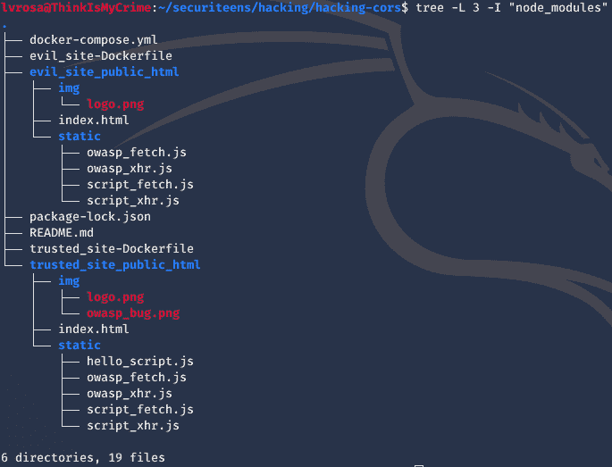

*hacking-CORS docker 项目的树形目录表示*

上面的结构分解了组成服务器映像的 docker 容器和文件。

` **node_modules** 目录(从上面的`**树**命令输出中省略)也被推送到` **hacking-cors** 库。它的尺寸很小。但是，如果您有任何关于 JavaScript 依赖的问题，请运行项目根目录下的“NPM”[【8】](https://www.npmjs.com/get-npm)工具。

*   $ CD hacking-CORS；npm 安装

在你的系统上安装`**docker**`[【9】](https://docs.docker.com/get-docker/)和`**docker-compose**`[【10】](https://docs.docker.com/compose/install/)也是至关重要的。docker-compose 文件使用版本 3 格式。我的两个依赖项的当前版本是:

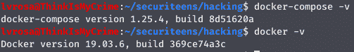

*Docker 和 Docker 组成版本*

# 项目结构

我们有两个不同的 docker 项目。它们由根目录下各自的配置文件**表示。**

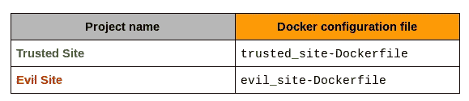

每个 web 服务器各自的 Docker 文件

有趣的文件在`**静态`**和` **img`** 目录下。它们拥有最终会被其他网页请求的资源。JavaScript 文件在` **static`** 目录下。您可以在您最喜欢的代码编辑器中打开它们并进行试验。

来自 ***可信站点*** 的` **img`** 目录存储了` **owasp_bug.png`** 资源。在我们的实验中，这个图像资源将由 ***邪恶站点、*** 请求，然后尝试加载它。这同样适用于`**static/hello _ script . js `**文件，但是要执行/评估脚本内容，而不是加载图像。

# Docker 图像和网络设置概述

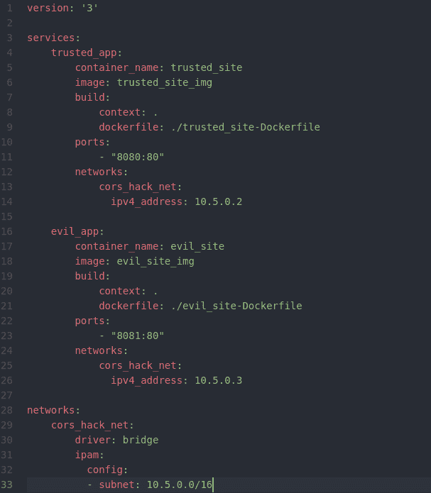

*docker-compose.yml 内容*

看看上面的` **docker-compose.yml`** 文件。我们可以识别关于环境的重要事物，例如:

*   我们将创建两个容器(即` **evil_site`** 和` **trusted_site`** )
*   容器被附加到“ **cors_hack_net** ”桥接网络接口
*   “ **cors_hack_net** ”接口通过 **CIDR 10.5.0.0/16** 确定子网

作为到容器网络地址的有用链接，我建议将主机名文件 (` **/etc/hosts** `)的*静态查找表设置为以下设置:*

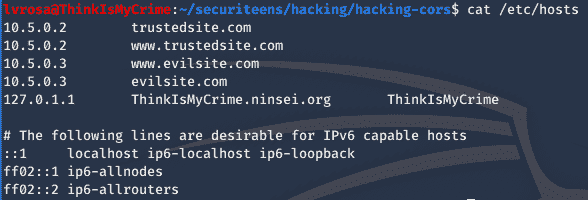

*/etc/hosts 文件映射*

# Apache 服务器 CORS 规则一瞥

★识别**可信站点**容器的名称:

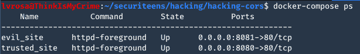

docker-撰写 ps 输出

★登录容器:

*   $ docker exec-it**trusted _ site**/bin/bash

★甩掉阿帕奇`。 **htaccess`** 配置文件到屏幕:

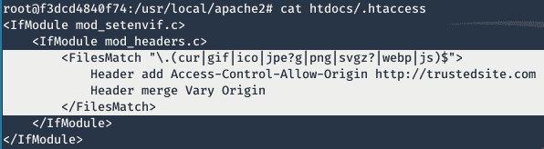

*。htaccess Apache CORS 扩展规则*

如上图中突出显示的，当文件匹配规则适用时， *Apache Web 服务器*将提供 **ACAO(访问控制允许来源)**头。换句话说，如果网络浏览器请求图像(**)。gif，。png，。ico** 等。)甚至一个 JavaScript **。js** 文件，资源的内容只有在来源与`[http://trustedsite.com](http://trustedsite.com)匹配的情况下才被授权由页面加载/使用。

注意`**。htaccess** 文件来源于` **htdocs** 目录，因此影响其子结构下的所有文件。

# 运行集装箱化环境

要激活这些环境，请执行以下步骤:

★从根项目目录构建容器

*   $ docker-compose build —无缓存；(注意无缓存参数前的双减号)

★通过“docker-compose”整理容器

*   $ docker-撰写

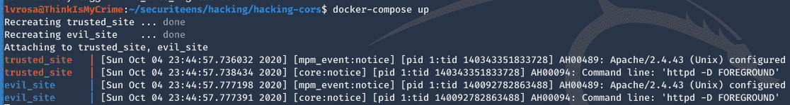

docker-合成输出

如果您在 docker 环境中遇到任何问题，我建议您通过杀死和删除当前活动的 docker 映像来清理它。只要确保没有其他容器应该在被杀死之前保存它们的状态。

*   $ docker kill $(docker ps -a -q)
*   $ docker rm $(docker ps -a -q)

嗯，我希望到目前为止一切都好。让我们看一下创建的两个 web 服务器。打开浏览器，驱车前往`【http://trustedsite.com】的`[和`](http://trustedsite.com)[的 http://evilsite.com](http://evilsite.com)`。

## 可信站点

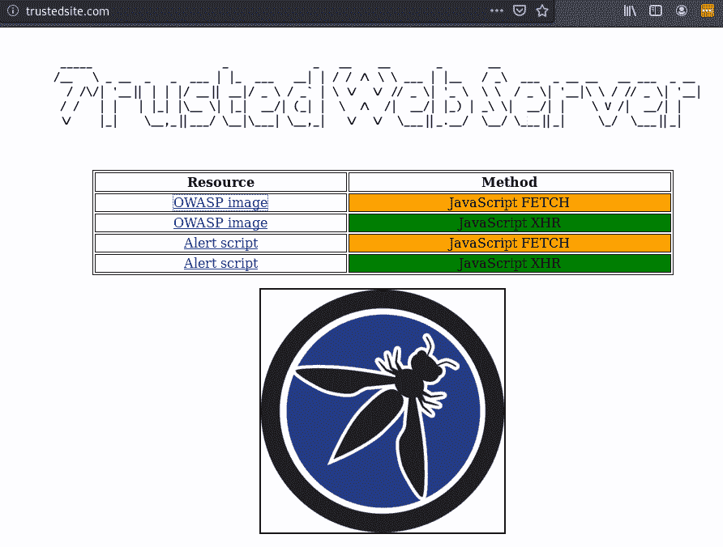

受信任的站点 Web 服务器菜单

## 邪恶网站

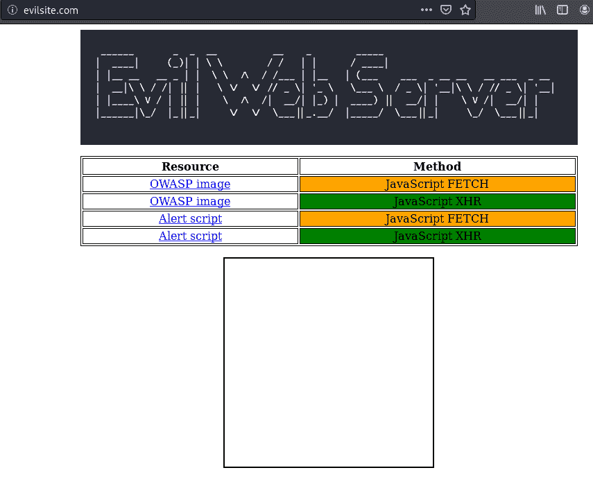

邪恶网站 Web 服务器菜单

# 使用 XHR 和获取请求玩 CORS 规则

# XHR 请求的 CORS 规则

**XMLHttpRequest 标准**[【11】](https://xhr.spec.whatwg.org/)定义了一个 API，它提供脚本化的客户端功能，用于在**客户端**和**服务器**之间传输数据。

关于其安全方面，我们应该注意一些警告事实，如**浏览器安全手册，第 2 部分**[【12】](https://code.google.com/archive/p/browsersec/wikis/Part2.wiki)所述。

> *“XMLHttpRequest 提供的、在其他浏览器机制中看不到的一组安全相关特性如下:*

*   *指定任意 HTTP 请求方法的能力(通过****open()****方法)、*
*   *在请求上设置自定义 HTTP 头的能力(通过****setRequestHeader()****)，*
*   *回读完整响应头的能力(通过****getResponseHeader()****和****getAllResponseHeaders()****)，*

> *能够以 JavaScript 字符串的形式读回完整的响应正文(通过****responseText****属性)。*
> 
> *由于通过 XMLHttpRequest 发送的所有请求都包含一组由浏览器维护的目标站点的 cookies，并且该机制提供了比脚本可用的任何其他功能更强大的与服务器端组件交互的能力，* ***建立适当的安全控制极其重要。”***

在处理 XHR 请求时，必须遵守以下防止篡改来源的浏览器保护措施。

*   当试图通过 **setRequestHeader()对` **origin** `标头进行**更改/毒化**时，原始标头将被保留。**
*   当试图**改变/毒化**附加头(作为参数传递给 **xhr.send()** )时，**原始头被保留。**

# 提取请求的 CORS 规则

> "*许多 API 提供了获取资源的能力，例如* ***HTML 的 img*** *和* ***脚本*** ***元素*** *，* ***CSS 的光标*** *和* ***列表样式-图像* ***抓取标准*** *为这些特性提供了一个统一的架构，因此它们在抓取的各个方面都是一致的，比如重定向和****CORS****协议。*——[https://fetch.spec.whatwg.org/](https://fetch.spec.whatwg.org/)**

尽管*获取标准*取代了“origin”元素语义(最初在**Web Origin 概念**[【13】](https://tools.ietf.org/html/rfc6454)—*RFC 6454*中定义)，XHR 篡改保护的相同效果也适用于此。

*   当试图通过 **fetch()** 参数**改变/毒化**原始**头时，**原始头被保留。****

# 在实践中理解请求周期

既然你已经知道了 **SOP、CORS、XHR** 和 **Fetch** 请求的基本原理，我们就可以开始玩提议的场景了。

**可信站点**和**邪恶站点**页面都有类似的菜单。首先，尝试**可信站点**的四个请求选项。

注意，请求的资源， ***OWASP bug 镜像*** 或者显示 ***你的所有 base 都属于我们的脚本；D*** ”，被页面成功加载和消费。这是属于同一个域的一个页面调用本地资源的典型例子。

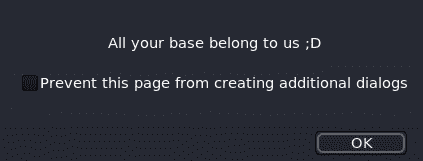

*hello _ script . js 的内容在一个相同的域页面请求后执行*

现在，让我们将范围更改为**邪恶站点**。

1.  打开`[http://evilsite.com](http://evilsite.com)网站
2.  调出 **Web 开发者工具**窗口(在 Firefox 或 Chrome 中按 **F12**
3.  点击与 **OWASP 图像+ JavaScript XHR** 相关联的锚链接
4.  点击与**警报脚本+ JavaScript 提取**关联的锚链接

从 **Web Developer Tools** 中获得控制台选项卡上的焦点。我们应该看到类似下面的屏幕。

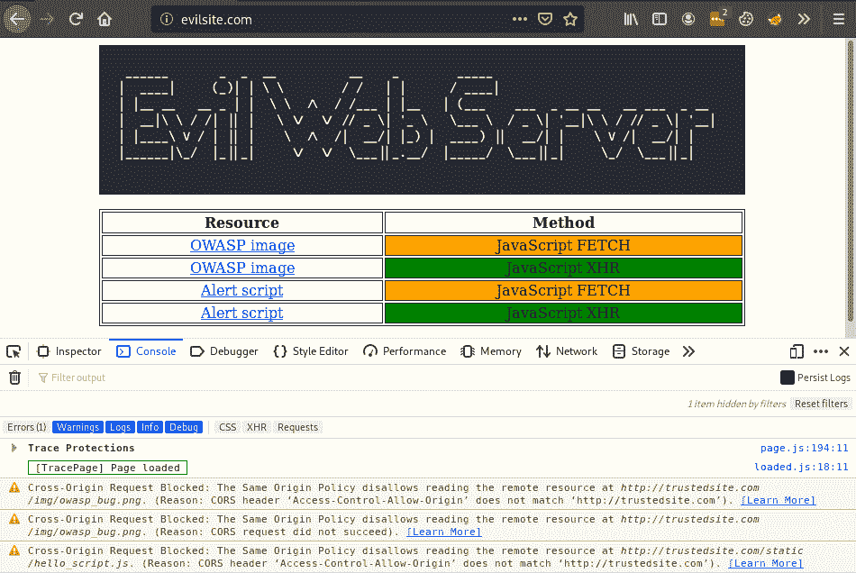

第三和第四步从上面的屏幕生成消息。为了便于阅读，将它们抄录如下。

> **跨来源请求受阻**:同一来源策略不允许在[**http://trustedsite.com/img/owasp_bug.png**读取远程资源。](http://trustedsite.com/img/owasp_bug.png.)(原因:CORS 表头【访问控制-允许-来源】与[http://trustedsite.com](http://trustedsite.com)不匹配)。
> 
> **跨源请求受阻**:同源策略不允许读取[**http://trustedsite.com/static/hello_script.js**的远程资源。](http://trustedsite.com/static/hello_script.js.)(原因:CORS 表头【访问控制-允许-来源】与[http://trustedsite.com](http://trustedsite.com)’不匹配)。

从这里，可以理解为什么浏览器禁止了请求的资源。还记得**阿帕奇服务器吗。htaccess** 配置，它将**ACAO(Access-Control-Allow-Origin)**CORS 报头添加到特定的 HTTP 响应(图像文件和**)。js** 脚本)。

现在，我们将更详细地研究这些请求。从 **Web 开发者工具**中点击**网络**标签。然后，选择` **hello_script.js** `资源的**选项**请求。在屏幕的右侧，您应该会看到下面的 HTTP 请求和响应。

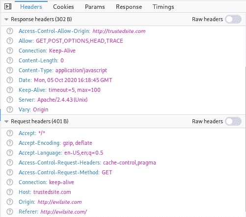

*选项 hello_script.js 资源的 HTTP 请求和响应*

注意上方的`**原点**'标题。上面写着“http://evilsite.com”。但是如果我们深入到邪恶站点的“ **script_fetch.js** ”实现中，关于“ **Origin** ”头的一些东西就很突出了。

*`****evil _ site _ public _ html/static/script _ fetch . js****` content*

尽管我们试图将` **Origin** `头(第 7 行)与**可信站点**的域`[http://trustedite.com](http://trustedite.com)的授权地址重叠，但浏览器实现的 Fetch API 阻止了这一点。

这就是为什么我们在 **Web Developer Tools 的“网络**选项卡— HTTP OPTIONS 请求”中将“[http://evilsite.com](http://evilsite.com)”视为“**来源**”。

# 通过代理拦截绕过 CORS(手动)

迄今为止，这是一条漫长的道路。所以如果你是在这里做的，是时候在汤里放点盐了。

CORS**(以及*CSP——内容安全政策*)背后的主要原则是浏览器和 web 服务器之间基于信任的关系。web 服务器指示 web 浏览器它可以进一步信任哪些域。实际上，HTTP 安全头设置了这个指令。**

**现在，让我们从恶意的角度来思考。为了绕过 **CORS** 规则，攻击者必须**拦截**服务器的 HTTP 响应**，其中包含**CORS ACAO(Access-Control-Allow-Origin**)**报头。其次是**，**他/她更改其值以反映攻击者的页面来源或允许任意域(使用字符*)。******

**当它被称为 ***【拦截】*** 时，它可以是一个自动过滤 HTTP 请求-响应循环的代理服务器(有关这方面的更多信息，请参见下一节)。或者通过像 **Burp Suite** 这样的代理工具进行手动操作，就像我们之后要做的那样。**

# **设置史努比代理工具**

**如果您已经熟悉了 ZAP、Burp Suite 之类的代理工具，请随意进入下一部分。这里我们将使用 PortSwagger 的 **Burp Suite 社区**[【14】](https://portswigger.net/burp/releases/professional-community-2020-9-2)。**

**根据您的平台/架构安装并运行 Burp 套件。**

**★在**选项**页签，编辑**代理监听器**设置的**界面**栏如下(" **127.0.0.1:10001** "):**

**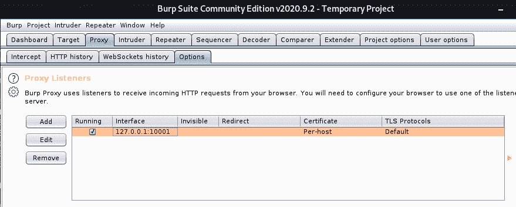**

**★在同一个选项卡上，设置**拦截客户端请求**设置如下:**

**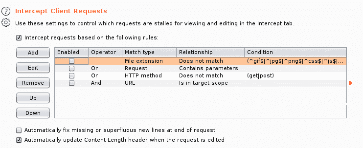**

**★仍然在**选项**选项卡，设置**拦截服务器响应**设置如下:**

**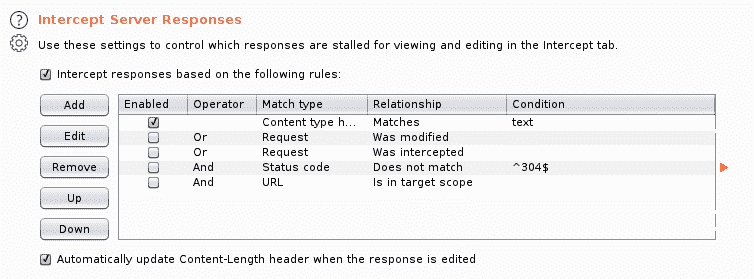**

**★确保**截取**选项卡中的**截取在**按钮上**激活****

**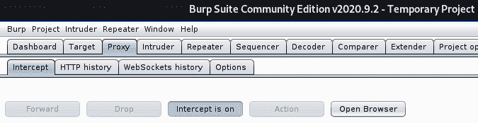**

**最后，在您的浏览器上，您将配置它通过我们的代理传递请求。请注意，代理正在监听**端口 10001。这里我们有两个配置选项。我通常使用 **FoxyProxy** 扩展[【15】](https://getfoxyproxy.org/)来设置我的代理。但是您可以通过浏览器的网络设置[【16】](https://support.mozilla.org/en-US/kb/connection-settings-firefox)手动完成。****

**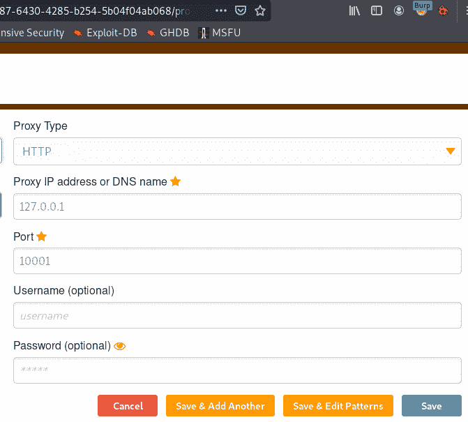**

***我的火狐的 FoxyProxy 打嗝代理设置***

**好了，就这些。我们准备好出发了。**

# **通过篡改 HTTP 响应绕过 CORS**

**★打开**邪恶网站**(`**`)****

****如前所述，**邪恶站点**请求的来自**可信站点**的资源没有被授权给相应的页面使用。这是因为 **CORS ACAO(访问控制允许起源)**报头只允许`[http://trustedsite.com](http://trustedsite.com)域。****

****★ **在浏览器上激活**你的打嗝代理****

****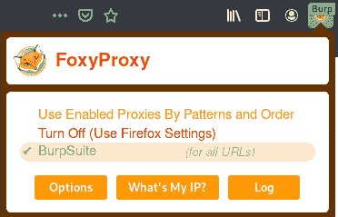****

****★点击/请求 **OWASP 镜像**资源**通过 XHR 请求******

****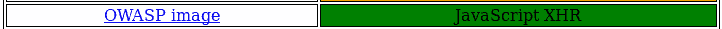****

1.  ****停下来，查看与 **HTTP 请求**相对应的**打嗝套件对话框******

****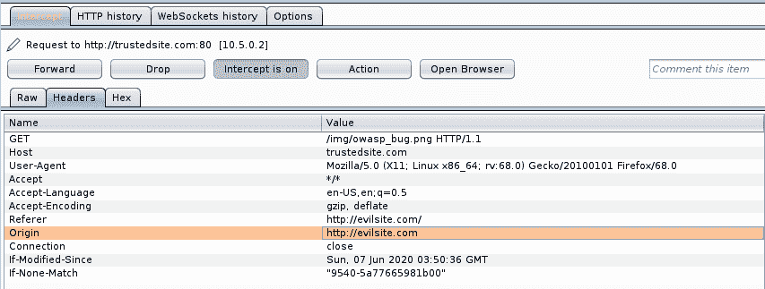****

****★点击“**前进**”继续请求，无需进一步编辑****

****★在包含 **CORS 报头**的 **HTTP 响应**处停止****

****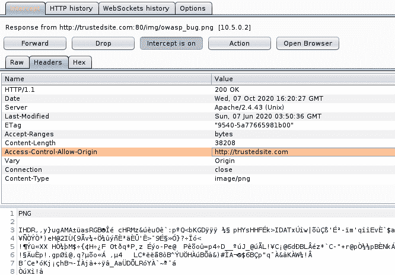****

****★将 **CORS ACAO** 表头值编辑为` ***** '****

****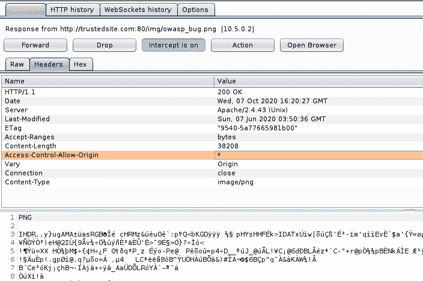****

****★ **点击**转发**向浏览器提交**响应****

**★显示受保护的资源(OWASP 错误图像)内容(注意没有 CORS 错误信息):**

**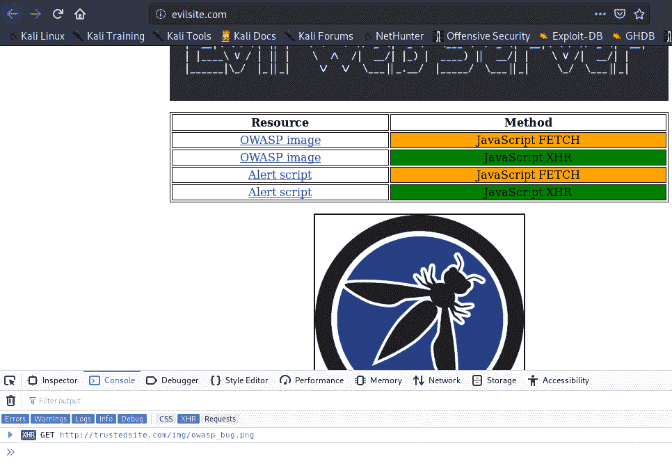**

# **黑客作业**

**在前面的场景中，我们通过 Burp 代理拦截并篡改了一个 JavaScript XHR 请求。这种开箱即用方法的一个重要方面是彻底分析 HTTP 请求-响应周期。哪些标题是必需的，当它们丢失或配置错误时，您在浏览器控制台上得到什么样的错误消息。**

**现在是时候让你自己运用学到的知识了。下一节还将给出一些关于**警报脚本+ JavaScript FETCH** 组合的 CORS 绕过的提示。**

**既然没有限制，你可以尝试绕过**邪恶网站**菜单中的剩余选项。**

## **绕过警报脚本+ JavaScript 获取的技巧**

**除了更改**Access-Control-Allow-Origin**头，您还必须在 HTTP OPTIONS 请求中添加**Access-Control-Allow-Headers**(使用 Burp 请求编辑对话框中的 add 按钮)。**

**这是必要的，因为客户端(**)。启动 XHR 请求的 js** 脚本)默认情况下在后续 GET 请求中添加头“ **cache-control** 和“ **pragma** ”。因此，您将希望在 **HTTP OPTIONS 响应**中反映这一点。**

**请记住，这里我们有一个 **HTTP 预检**场景(如果有疑问，请查看*预检 HTTP 请求部分*)，其中 HTTP 选项请求在实际资源检索请求之前。**

**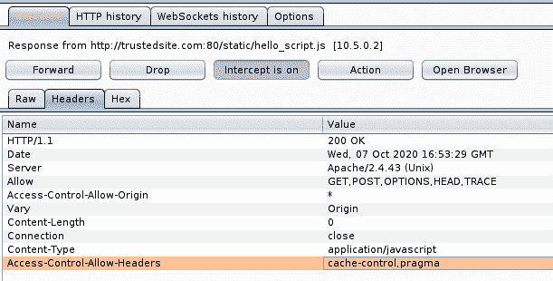**

*****HTTP 选项响应*** *编辑以反映绕过*的 CORS 报头**

**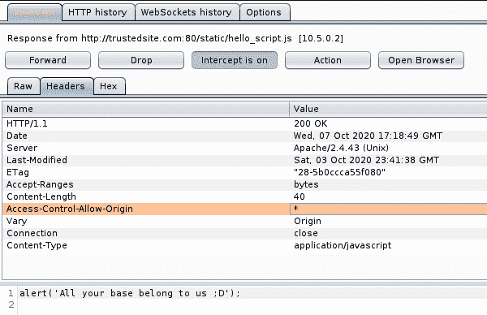**

*****HTTP GET response****from****` hello _ script . js****`资源检索(注意 ACAO CORS 头文件)***

**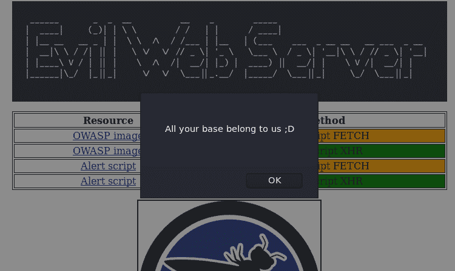**

*****成功*** *CORS 黑客攻击得到我们上面那个漂亮的对话框***

# **自动旁路和其他 CORS 有趣的项目**

**在上一节中，我们看到了如何手动绕过 CORS 规则保护。然而，从实用的角度来看，这不是很有效。**

**自动化绕过过程的一个可行的方法是部署一个代理服务器，如 **CORS 任何地方**[【17】](https://cors-anywhere.herokuapp.com/)API。代理服务器将充当中介，过滤请求和响应头，以反映代理配置时指定的允许和拒绝规则。**

**请参考该项目的 Github 页面[【18】](https://github.com/Rob--W/cors-anywhere)了解更多细节和设置面向 web 的代理时的注意事项(朋友，小心开放的代理)。你可以在这里测试一下现场 API[【19】](https://robwu.nl/cors-anywhere.html)。**

**另一个围绕 **CORS** (以及 ***CSP —内容安全策略*** )的奇葩举措，头头的理解是` **CORS 演示**`[【20】](https://cors-client.digi.ninja/)来自`**digi . ninja**`[【21】](https://digi.ninja/blog/cors_demos.php)。非常好的概念证明。**

# **结束语**

**如果你已经走了这么远，恭喜你。HTTP 头本身是一个非常庞大的主题，因为该协议试图发展以接近 web 应用程序的实际情况。这种现实变得越来越普遍，尤其是随着 API 通过 REST 等技术的普及。**

**CORS 的标题是错综复杂的，充满了细微差别。当实现处理域间通信的解决方案时，要注意可能出现的常见陷阱。来自 **`moesif.com** 博客的文章[【22】](https://www.moesif.com/blog/technical/cors/Authoritative-Guide-to-CORS-Cross-Origin-Resource-Sharing-for-REST-APIs)很好地解释了这一点(以及更多)。**

**关于 CORS 及其弱点的最后一个信息是，浏览器和应用程序之间的信任应该由安全配置明确保证。正确选择部署哪种 AJAX 方法和 CORS 头文件将对 API 的整体安全性产生积极影响。**

**记住我们提出的四种资源消耗场景。它们很简单。事实上，资源共享还有其他选择和组合。但是，也许(我希望我们已经达到了这一步)这里展示的理论和实践可以作为设计更复杂、更安全的默认 web 应用程序的基础。**

# **使用的浏览器**

*   **Mozilla Firefox 68.5.0esr (64 位)**
*   **谷歌浏览器版本 70.0.3538.77(官方版本)(64 位)**
*   **谷歌 Chrome (2018 旧版)70**

***特别感谢审稿人 Luiz Rennó和*[*Vitoria Rio*](https://medium.com/u/b5ec764976c0?source=post_page-----512cb125c528--------------------------------)*。***