# 黑客 Instagram 骗子

> 原文：<https://infosecwriteups.com/hacking-instagram-scammers-c3392043480c?source=collection_archive---------0----------------------->

# 摘要

这些天我看到许多钓鱼网站和邮件。所以我决定研究骗子是如何诈骗人们的，并盗取了数百个 Instagram 账户。此外，这些网站被关闭，因为可能他们了解异常活动。

# 查找钓鱼网站

当我在 Twitter 和 Instagram 上冲浪时，我看到了关于侵犯版权消息的推文和故事，很高兴看到人们正在意识到网络钓鱼(不是所有人)。所以我开始浏览这些网站，了解他们是如何窃取凭据的。

# 理解逻辑

我建立了一个网站，你会在第一条微博上看到。在他的一条钓鱼消息中，骗子通过名为**inhelptechinalyse**的账户向 Instagram 用户发送了一条消息，称其侵犯了版权，并要求用户访问 https://veriyfycontacsupports.com/[并填写一份表格来验证他们的账户。](https://veriyfycontacsupports.com/)

在网页上输入 Instagram 用户名后，用户的个人资料图片被下载并显示在后台，以增加请求密码的页面的可信度。

**首个钓鱼网站**:

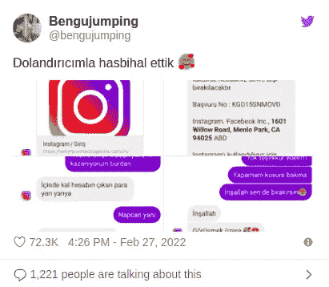

受害者和攻击者成为朋友🥰

> [https://twitter.com/bengujumping/status/1497926066496753671](https://twitter.com/bengujumping/status/1497926066496753671)

**第二个钓鱼网站:**

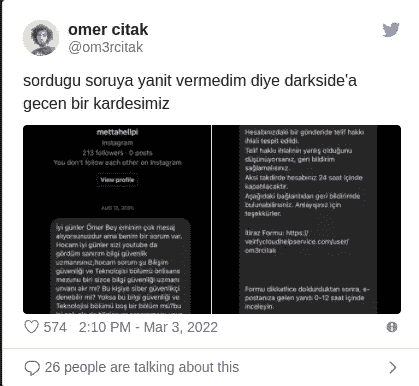

有人询问网络安全[mer itak](https://twitter.com/om3rcitak)，一年后，同一个帐户给他发送了钓鱼邮件🙃

> [https://twitter.com/om3rcitak/status/1499341391427776520](https://twitter.com/om3rcitak/status/1499341391427776520)

在你输入用户名和密码后，网站需要你的电子邮件和密码，然后他们可以在你的账户上做任何事情。我认为所有这些过程都是自动化的。

我使用 [ffuf](https://github.com/ffuf/ffuf) 进行目录暴力，使用 [SecLists](https://github.com/danielmiessler/SecLists/blob/master/Discovery/Web-Content/directory-list-2.3-medium.txt) 进行单词列表。但是我没有找到任何重要的目录。之后，我回到第一页，输入一个用户名，比如“< h1 > a < /h1 >”，我看到 HTML 标签起作用了。所以我发送了一个有效的用户名和盲 XSS 有效载荷的密码字段。在 2-3 个小时内，我在 XSSHunter 上收到了通知。78.180.5.144 和 178.246.104.93 的 IP 地址正在监视管理面板。正如你所看到的，这个 URL 是一个随机的字符串，这就是为什么 [ffuf](https://github.com/ffuf/ffuf) 找不到这个 URL。因此，我单击该链接，但没有身份验证机制，我可以看到所有试图登录钓鱼页面的帐户。

如果启用了 2FA(您必须启用它)，该脚本将在 2FA 时被禁用。因为受害者在钓鱼页面输入了邮箱和密码信息。

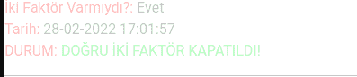

2FA 开了吗？如果是真的，关闭它

这些骗子在 3 天内盗取 3 个账户。我唯一能做的就是删除网站上的这些信息，让人们意识到。

# 调查攻击者

你可以在[whatismyipaddress.com](http://whatismyipaddress.com)上查看 IP 地址

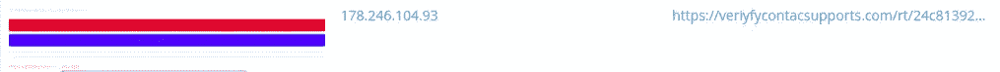

XSSHunter 报告第一个钓鱼网站

> [https://whatismyipaddress.com/ip/178.246.104.93](https://whatismyipaddress.com/ip/178.246.104.93)

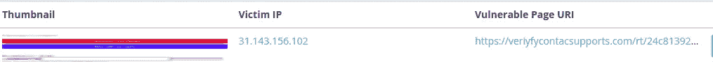

XSSHunter 报告第一个钓鱼网站

> [https://whatismyipaddress.com/ip/31.143.156.102](https://whatismyipaddress.com/ip/31.143.156.102)

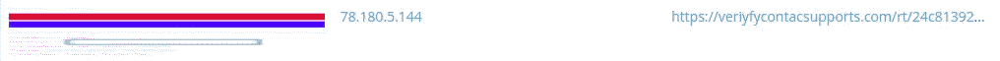

XSSHunter 报告第一个钓鱼网站

> [https://whatismyipaddress.com/ip/78.180.5.144](https://whatismyipaddress.com/ip/78.180.5.144)

土耳其的 IP 地址。

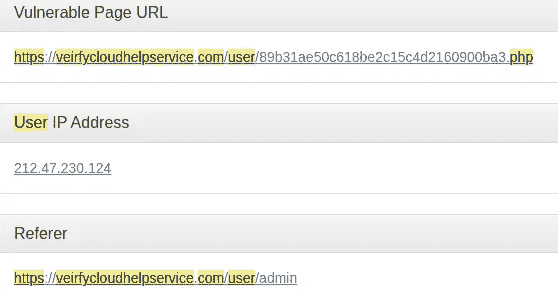

XSSHunter 报告第二个钓鱼网站

> [https://whatismyipaddress.com/ip/212.47.230.124](https://whatismyipaddress.com/ip/212.47.230.124)

这个 IP 地址在南非

# 网络钓鱼网站管理仪表板

管理仪表板包含以下信息。

*   用户名
*   密码
*   2FA 设置键
*   6 位数登录代码
*   更改的电子邮件地址
*   备份代码

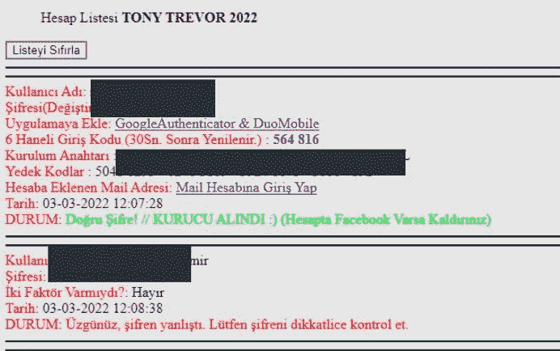

当我点击“GoogleAuthenticator & DuoMobile”时，我被重定向到[https://pilot.albay-arnold.com/Code.php?totp=](https://pilot.albay-arnold.com/Code.php?totp=)设置密钥>。该网站每 30 秒生成一次动态口令，并显示在管理仪表板上。网站还在运行。

之后，我想知道他们使用了什么临时邮件地址，因为他们添加了“Mail hesabna giri Yap(登录邮件账户)”按钮，它会重定向到[https://mbox.reispeke6r.com/](https://mbox.reispeke6r.com/)。

您可以在该网站上创建临时电子邮件地址。通常你需要密码才能看到收到的邮件，但是我不需要密码，因为我可以在管理面板上看到所有的邮件。

**示例网址:**

【https://mbox.reispeke6r.com/mail/?email=<随机字符串> @mbox.reispeke6r.com &密码= <哈希>

在 email 参数上，你需要输入你的邮件地址，在 password 参数上，有一个 hash。当你点击那个网址时，你可以看到，受害者的电子邮件地址是否被攻击者的电子邮件地址所取代？2FA 禁用了吗？如果两者都是真的，就可以登录受害者账号。

# 统计数字

每小时有多少账号被黑？

*   x 平面—小时
*   Y-Plane —客户数量
*   每个点代表一个小时

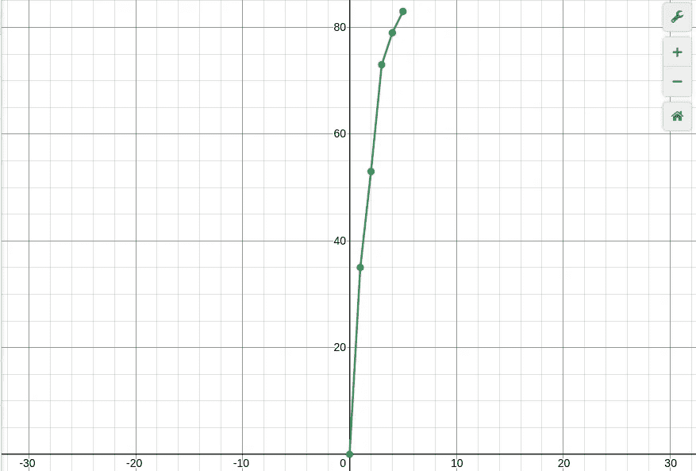

平均年龄:29.53 岁

**性别百分比:** **%60 M — %40 F** (没有个人资料图片或假图片且已关闭账号者除外)

# 我如何获得这些信息？

Osintgram 提供了一个交互式 shell，可以通过昵称对任何用户的 Instagram 帐户进行分析。您可以获得:

*   地址获取目标照片的所有注册地址
*   标题获取用户照片的标题
*   评论获取目标帖子的总评论
*   追随者获得目标追随者
*   以下获取用户，然后是目标
*   fwersemail 获取目标关注者的电子邮件
*   fwingsemail 获取用户的电子邮件，后跟目标
*   fwersnumber 获取目标关注者的电话号码
*   fwingsnumber 获取目标用户的电话号码
*   标签获取目标使用的标签
*   获取目标信息
*   喜欢获得目标帖子的总喜欢数
*   mediatype 获取用户的帖子类型(照片或视频)
*   光电探测器获取目标照片的描述
*   照片在输出文件夹中下载用户的照片
*   propic 下载用户的个人资料图片
*   故事下载用户的故事
*   标记获取由目标标记的用户列表
*   获取评论目标照片的用户列表
*   wtagged 获取标记目标的用户列表` s

> [https://github.com/Datalux/Osintgram](https://github.com/Datalux/Osintgram)

我使用“info”命令来获取关注者的数量和高清简介图片的 URL。收到这些信息后，我编写一个简单的 bash 脚本来计算受影响的帐户数量，并下载配置文件图片。

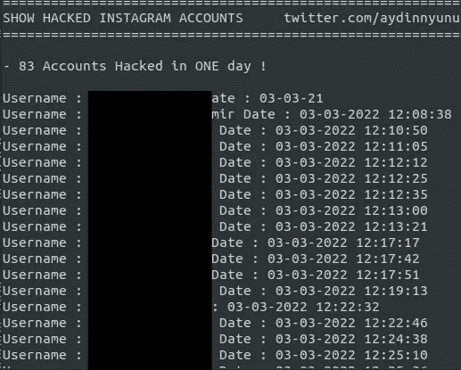

他们被黑的用户名和日期

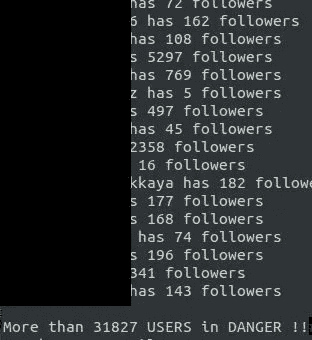

受影响的用户数量。

这些统计数据仅对**一天**有效。前几天我没跟上，因为他们的网站关闭了。

在我得到个人资料照片后，我使用“年龄性别估计”工具来预测年龄和性别信息。

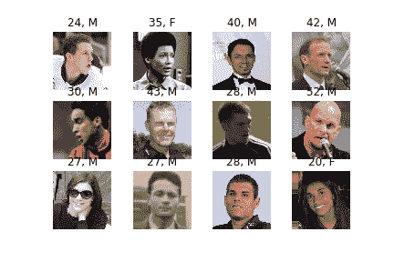

> [https://github.com/yu4u/age-gender-estimation](https://github.com/yu4u/age-gender-estimation)

因此，不要点击陌生来源的链接，也不要输入您的信息。对所有可能的帐户使用双因素身份验证。最后，为了提高知名度，我建议他们把这篇文章分享给使用社交网络/媒体的朋友。

# 联系我！

**推特**:【https://twitter.com/aydinnyunuss】T4

**Github:**[https://github.com/aydinnyunus](https://github.com/aydinnyunus)