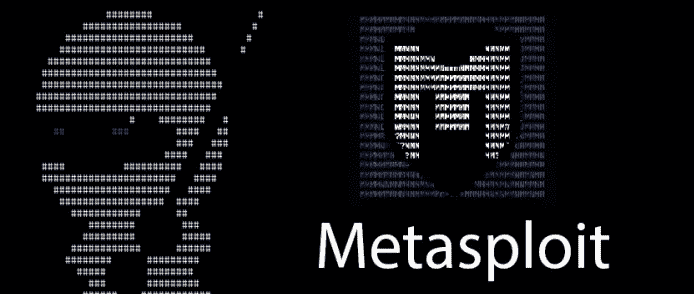
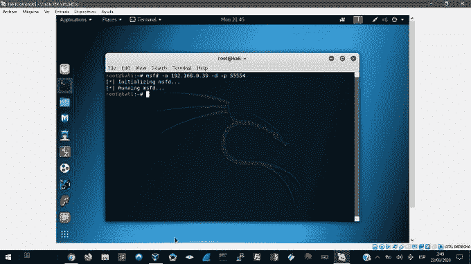
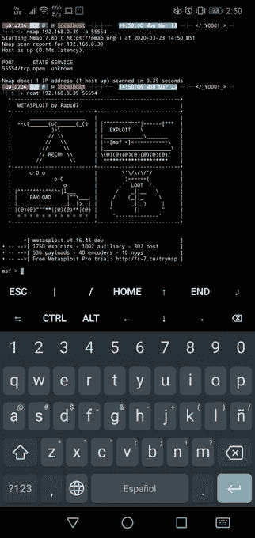
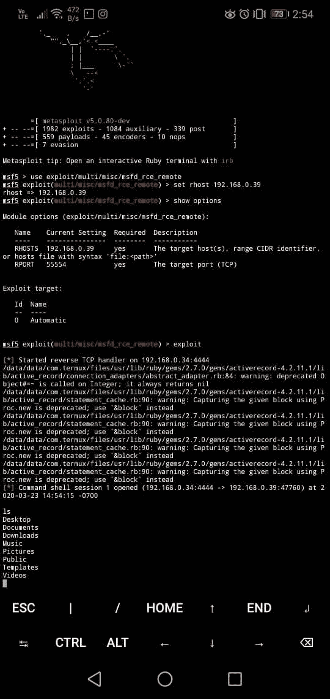

# 用 metasploit 破解 metasploit

> 原文：<https://infosecwriteups.com/hacking-metasploit-with-metasploit-6fc556af8701?source=collection_archive---------1----------------------->

> msfd —提供远程客户端可以连接到的 msfconsole 实例
> 
> root@kali:~# msfd -h
> 
> 用法:msfd
> 
> 选项:
> 
> -A <opt>指定允许连接的主机列表
> -D < opt >指定不允许连接的主机列表
> -a < opt >绑定到此 IP 地址而不是环回
> -f 在前台运行守护进程
> -h 帮助横幅
> -p < opt >绑定到此端口而不是 55554
> -q 不要在启动时打印横幅
> -s 使用 SSL</opt>
> 
> [https://tools . kali . org/exploitation-tools/metasploit-framework](https://tools.kali.org/exploitation-tools/metasploit-framework)

Msfd 允许我们连接到一个 metasploit 会话，不管我们在什么机器上，只要让服务在主机器上运行。

但是我们要怎么用 metasploit 黑掉 metasploit 呢？

为此，您需要做两件事:
1-识别运行 msfd 服务的网络
2-使用 metasploit 的系统“攻击”正在运行的 metasploit 系统

在卡利，我经营 msfd 服务

在我的 android 上，我运行 metasploit 并在 nmap 中进行扫描，以验证 msfd 服务正在我的 kali 上运行

利用漏洞:

msfd_rce_remote

我们将在易受攻击的机器(kali linux)上配置 rhost，瞧，当执行利用时，它会在易受攻击的机器内给我们一个会话。所以我们在用 metasploit 黑 metasploit！

Metasploit 是一个非常强大的框架！但是如果配置不正确，它会让我们变得脆弱。

你已经知道这个方法了吗？