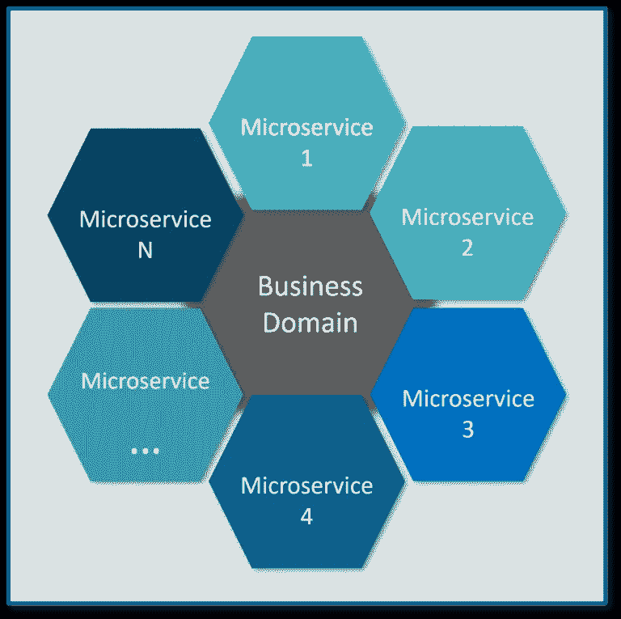
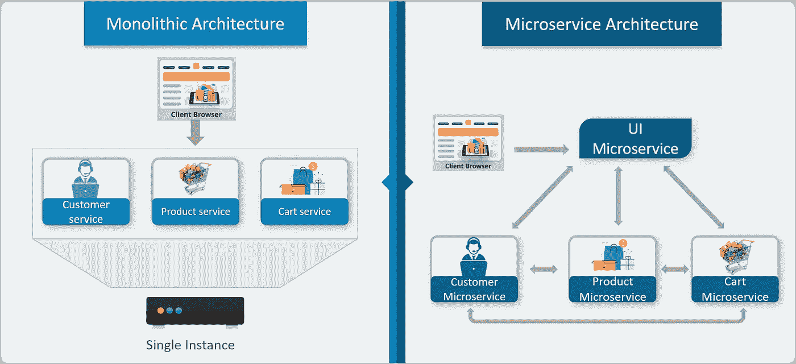
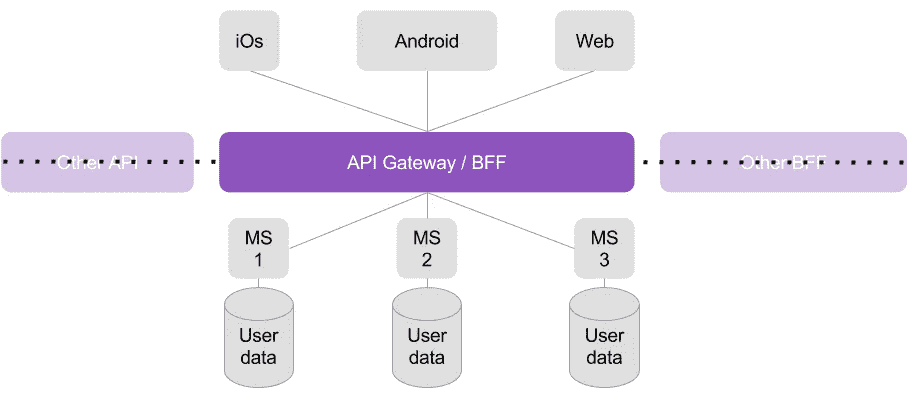
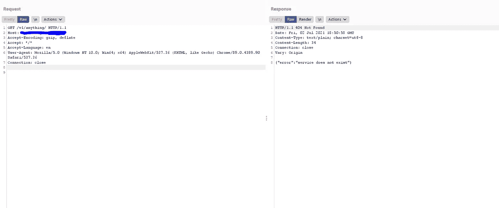
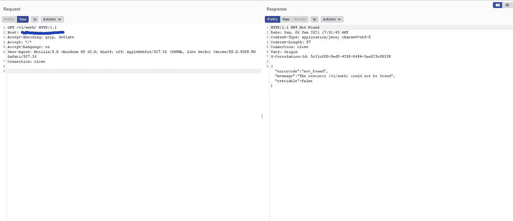
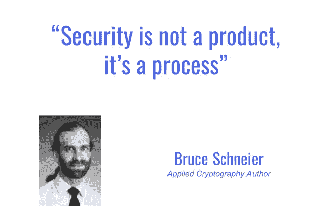

# 黑客微服务的乐趣和赏金

> 原文：<https://infosecwriteups.com/hacking-microservices-for-fun-and-bounty-5cc302769e94?source=collection_archive---------0----------------------->

## 了解微服务的工作原理和破解方法。

微服务最近备受关注，它们即将成为主流，根据 Nginx 、*最近的[调查，36%的受访企业](https://www.nginx.com/resources/library/app-dev-survey/)*、*目前正在使用微服务，另有 26%的企业*处于研究阶段。但是什么是微服务架构呢？

从渗透测试人员或 Bug 赏金猎人的角度来看，在实际测试破解技术之前，首先了解技术的核心工作是非常重要的。所以今天我们来深入研究一下微服务。

# 什么是微服务？

**微服务**是一种架构风格，它将应用程序构建为小型自治服务的集合，围绕**业务领域进行建模。它帮助不同的服务在它们的 pod 中独立运行，并在彼此之间高效地传输数据，而不太依赖彼此。**

来源:https://www.edureka.co

## **微服务与 Monolith 和 Rest APIs 有何不同？**

传统架构(Monoliths 和 RESTful APIs)和微服务之间的根本区别在于它们在应用程序中共享资源和服务的方式。所有服务都根据其领域和功能进行分离，并进一步分配给各个微服务。微服务架构中的每个服务都是**自包含的**，并且实现了**单一业务能力**，如用户认证、搜索等等。

这些微服务有它们自己的**负载平衡器**和**执行环境**来执行它们的功能&，同时在它们自己的数据库中捕获数据。所有内部点都从 API 网关连接。因此，任何连接到 API 网关的人都会自动连接到整个系统

# 侵入服务系统。

微服务通过增加交互的复杂性来利用代码的复杂性，而更多的复杂性会导致更多的错误。根据许多研究， ***微服务被认为比传统的单片应用*** 更易受到攻击。由于其分布式结构，每个服务 API 和网络层都将易受攻击的入口点暴露给潜在的攻击媒介。

通常，通过实现 API 网关来保护服务调用，API 网关充当接收调用的**单一入口点，然后将流量路由到不同的服务。这种通过身份验证获得单一入口点的方法有其优点和缺点。有时候攻击者只需要绕过 BFF/API 网关就可以控制整个架构。这对任何公司来说都是最糟糕的噩梦**

理论上，API 网关限制了攻击面；然而，这也是潜在攻击媒介的**单点故障。大多数情况下，认证部分由网关控制，如果被绕过，就会变得更加危险。最近的研究还表明，大多数传统的攻击手段都是通过 API 调用来攻击应用程序。**

# 进入内部…

有许多方法可以绕过 API 网关进入系统内部并进行进一步的攻击。我们来讨论一下。

## 你在和谁说话？？

每当进行服务调用时，它很可能会通过 API 网关，并且网关会在所请求的路径上执行许多操作，例如路由和路径规范化。

如果您知道您在与哪些服务对话，那么继续攻击就变得很容易了。确保您的调用被内部架构监听可以帮助您进行路径遍历、目录暴力等攻击。

API 网关正在过滤请求

请求已被侦听，并且正在由内部微服务响应。

在上面的图片中，您可以看到 2 个请求以几乎相同的路径发送到同一个主机，但响应完全不同。

这里，网关对所请求的路径执行检查，并确保微服务在转发请求之前确实存在(在本例中为“auth”微服务)。如果路径存在，那么我把请求转移到前面。

在实际的攻击场景中，攻击者可以执行路径遍历攻击，使 API 网关将请求路由到微服务的根，从而允许他们在没有任何身份验证的情况下在系统内做任何事情。

不同的响应有助于攻击者了解哪些服务受到攻击。这使得目录暴力变得非常容易，因为只要知道一些服务，他们就可以发现一些隐藏的端点。

## 识别应用程序路由。

路由是为网络中或多个网络之间的流量选择路径的过程。这是应用程序安全性最重要的方面，如果没有正确实施，可能会导致信息泄露。

我们必须执行一些检查，看看应用程序是如何将请求路由到内部架构的。

1.  **执行目录遍历**

*   尝试查看 **"/v1/auth"** 是否返回除 **"/v1/auth/user/之外的其他内容../**
*   是否在不检查路径的情况下传输请求？ **"/v1/auth/../../database"** 被传递到内部架构，即使*数据库*服务不存在。

2.**用随机输入破坏应用**

*   我们可以尝试使用不同的控制字符来模糊应用程序**，例如**

> ***%23 (#)，%3f(？)、%26 ( &)、%2e(。)、%2f (/)、% 40(@)***

*   以双重/三重 URL 编码提供输入

3.注意微小的变化。

*   API 网关的**根("/")** 是否给出了一些信息？
*   某些目录的行为会突然改变吗？
*   为什么 **"/v1/auth"** 返回的头与 **"/v1/auth/register"** 不同？
*   **" API . com apny . com:443 "**->*200 OK*和**" API . com pany:80 "**->*500 内部服务器错误*
*   向后遍历允许我们覆盖 API 路径吗？

# 结论

微服务既复杂又易受攻击，你只需要跳出框框思考。

“安全不是产品，而是 process✨”

非常感谢你的阅读。喜欢就分享😇😇

可以在推特上找我:[**mayank _ pandey 01**](https://twitter.com/mayank_pandey01)