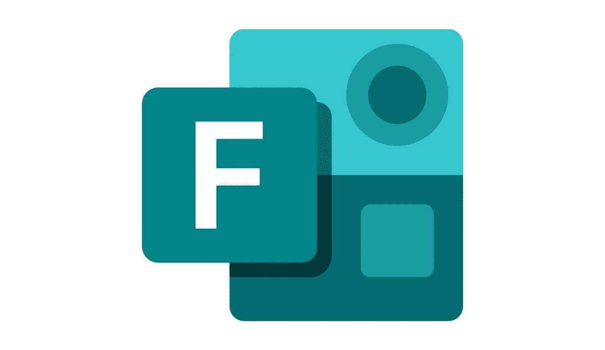

# 破解微软表单

> 原文：<https://infosecwriteups.com/hacking-microsoft-forms-d05e22fb70d7?source=collection_archive---------0----------------------->



Microsoft 表单

从疫情学生在线学习的增长来看，研究人员一直在寻找针对微软表单的黑客攻击，这可能会给他们在考试、突击测验等中带来不公平的优势。

YouTube 上有许多人声称通过检查源代码、尝试其他技巧等找到了这样的*宝藏*，但这都只是吸引观众的点击诱饵。

我今天要分享的将会改变这一切…

正如你们所有人可能已经从这个故事的主题中读到的，是的，我已经找到了一种破解**微软表单的方法，但这并不完全是你所期望的**

# **摘要**

*   **每当提交表单时，都会向***/formapi/API/$ { API _ Key }/users/$ { User _ Key }/forms($ { FormID })/responses***端点发出 API POST 请求**
*   **通过拦截 POST 请求，用户/攻击者可以输入新条目/空字符串，从而完全绕过必填字段/添加新选项。**
*   **由于缺少服务器端检查，这同样反映在表单所有者可用的表单响应中。**

# **拦截的有效载荷**

```
**{“startDate”:”2021–12–02T18:38:36.784Z”,”submitDate”:”2021–12–02T18:38:40.820Z”,”answers”:”[{\”questionId\”:\[REDACTED]},\”answer1\”:\${New Option} OR null \”}]”}**
```

# **摘要—为外行翻译**

*   **当用户提交表单时，网页/表单(客户端)向服务器发送一条消息，表明该用户已经提交了“X”作为对具有**唯一 id**“Y】的特定问题的响应，并且服务器将该响应保存在其数据库中，该数据库可供表单所有者查看。**
*   **通过充当中间人并拦截消息，攻击者可以更改网页发送的消息，说明特定用户发送了“Z”作为对基于 MCQ 的特定问题的响应，其中 Z 是*不在可用选项*中/是**无效的**输入。**
*   **由于没有服务器端检查来确认该选项是否是有效选项之一，所以用户可以操纵**评级**、**净推介值**，还可以在基于 **MCQ /复选框/下拉列表**的问题中添加新选项。**
*   **同样的内容保存在数据库中，并作为响应集的一部分发送给表单所有者。**
*   **这种攻击的一个限制其影响的问题是，攻击者只能操纵他/她的响应，而不能操纵其他用户的响应。**

# **攻击场景**

*   **当企业使用这种形式进行内部员工竞争时，任何滥用都可能给企业带来声誉问题，进而损害微软的品牌形象。**
*   **通过这些形式为公众开展特定活动的大型企业，如果存在通过所列选项之外的选项进行滥用的空间，可能会面临巨大的收入损失和声誉损害。**
*   **微软表单主要在学校中用于进行考试。任何潜在的攻击或误用都会给学生的生活带来巨大的破坏，并给学生及其家庭造成不可挽回的损失。**

**这个错误既影响测验，也影响正常形式。**

# **重现 Bug 的步骤**

*   **在 MS 窗体上创建新窗体。**
*   **打开表单。**
*   **按照下面附带的 POC 中所示的步骤进行操作。**

## **概念验证**

*****免责声明*** *:通过阅读本文，您同意仅出于教育目的使用这些信息，并且不会在您的测试/随堂测验中作弊，作为本文的作者，我对您的任何不当行为不承担任何责任。***

# **🔈 🔈Infosec Writeups 正在组织其首次虚拟会议和网络活动。如果你对信息安全感兴趣，这是最酷的地方，有 16 个令人难以置信的演讲者和 10 多个小时充满力量的讨论会议。[查看更多详情并在此注册。](https://iwcon.live/)**

**[](https://iwcon.live/) [## IWCon2022 - Infosec 书面报告虚拟会议

### 与世界上最优秀的信息安全专家建立联系。了解网络安全专家如何取得成功。将新技能添加到您的…

iwcon.live](https://iwcon.live/)**