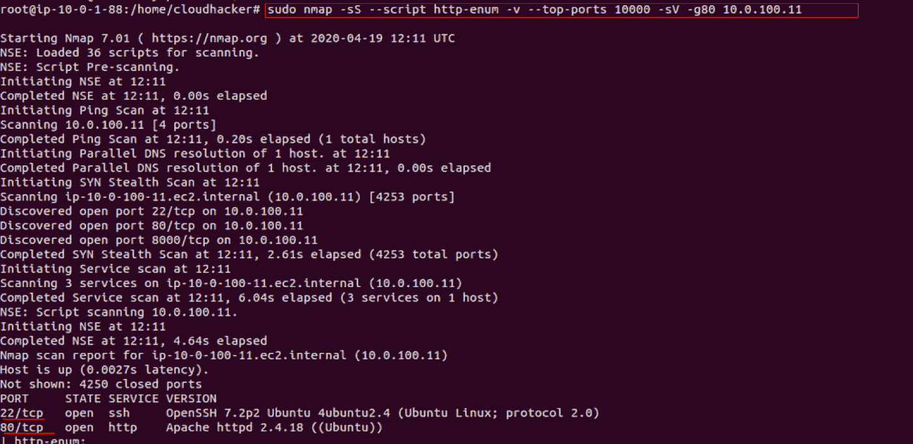
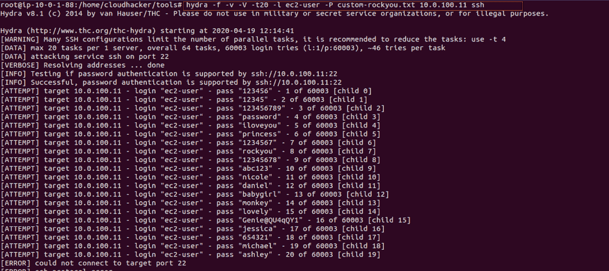
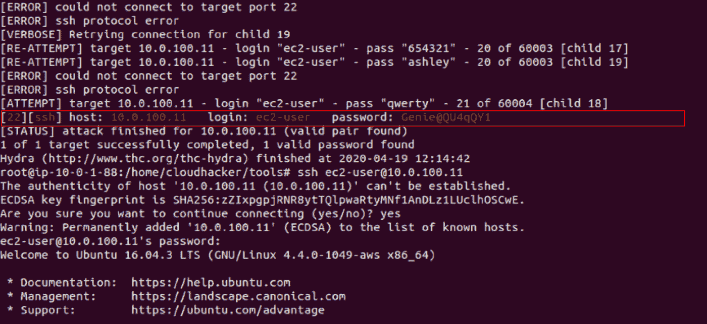
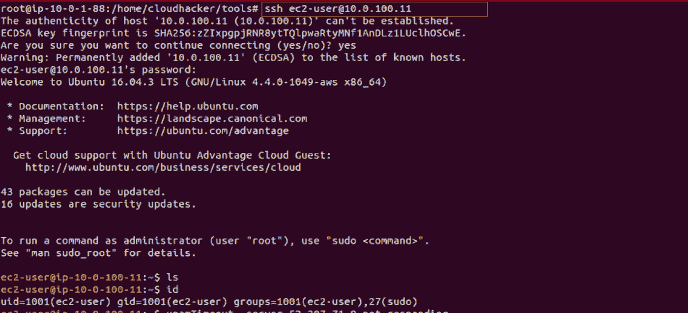
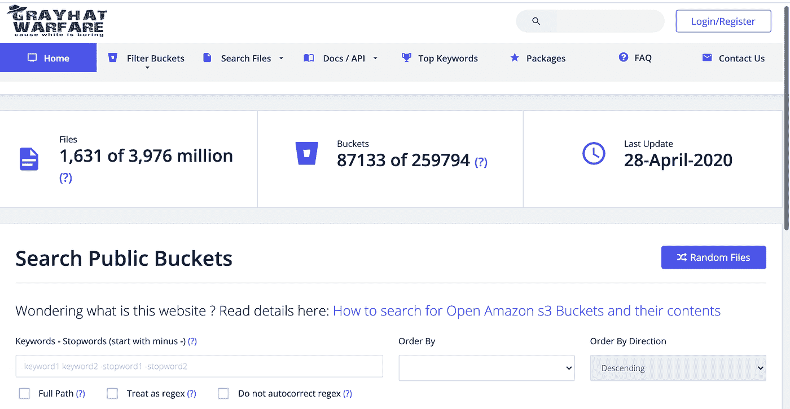

# 破解错误配置的云应用

> 原文：<https://infosecwriteups.com/hacking-misconfigured-cloud-apps-a46bed1069bd?source=collection_archive---------3----------------------->

去年，也就是 2020 年，超过 89%的财富 500 强公司采用了云基础设施。云非常强大，由于当前的疫情，组织迁移到云更有意义，因为它可以远程供应，不需要组织端的人力，部署在云上的应用程序可以通过互联网供应。

部署 web 应用程序是一项共同的责任，配置错误对组织来说可能是灾难性的。

写这篇博客的目的是展示小的错误配置在本质上是多么的具有破坏性。下面是两个测试案例，任何人都可以添加到他们的控制表中。

# 测试用例 EC2 实例中暴露的端口。

通俗地说，EC2 就像一个虚拟机或者一个远程运行在服务器上的 OS。如果一个不应该暴露的端口暴露在外，那么黑客可以强行进入实例，在他们访问实例后，他们可以利用实例的计算能力窃取任何东西或做任何他们想做的事情。

为了测试这一点，我使用了一个像 DVWA 一样设计脆弱的实验室。

## 侦察

掌握了 IP 或网络的基本知识后，您可以使用 Nmap 扫描实例的端口。在下面的测试中，我的攻击机器在 VPC 网络中。

*   *sudo nmap-sS-script http-enum-v-top-ports 10000-g80 10 . 0 . 100 . 11*

在我的情况下，我已经知道了 IP，大多数时候应用程序也可以泄漏 IP 的，否则你可以随时做侦察。从上面的截图可以看到，发现端口 22 是打开的。

## 第二步:攻击

根据您的发现，您的攻击方法可能有所不同，但从恶意黑客试图访问 22 端口开放的 EC2 的角度来看，最合适的方法是暴力攻击。

为了执行蛮力，我用了九头蛇。您可以使用下面的命令来做同样的事情，我使用了实验室自带的自定义词典，您可以使用不同的单词表，我同意所有安全爱好者的观点，暴力破解在这里不是最好的方法，但这只是一个测试案例，您可能会很幸运。

*   *hydra-f-V-V-l ec2-user-P { dictionary file } { target IP } ssh*

嗯，你们中的一些人可能想知道为什么 ec2-user 被写成一个用户，答案很简单，默认情况下大多数 ec2 实例都有这个用户名，这就是为什么你可以强行进入一个实例。

获得一组正确的凭证后，您可以 ssh 到实例中。

# 测试用例 2:错误配置的 S3 桶

S3 是由 AWS 提供的对象存储，S3 意味着简单的存储服务，它有桶的概念，用通俗的语言来说就是文件夹，其中也有关于文件夹的元数据，例如，谁拥有它，最后一次访问是公共的还是私有的。部署在云上的 Web 应用程序可以使用这个服务，或者可以使用来自另一个供应商的类似服务来存储、管理和访问数据。

如果这个 s3 存储桶存储敏感数据，并且被错误配置，作为一个例子，考虑一个可以通过互联网公开访问的 s3 存储桶，这对于犯这种错误的组织来说会花费一大笔钱。

攻击者可以获得大量敏感数据或对公司数据的深入了解，他可以利用这些数据来策划其他攻击等等。

Grayhatwarfare.com 是一个网站和一个重要的工具，pentester 可以在执行侦察时使用，因为它索引不受保护的公共 S3 桶。

我不是说你只能在 s3 上得到你的手，我在这里建议的是桶或存储可以被公开，可以被搜索引擎索引，无论是 S3 桶还是 Azure blob 存储。

你也可以利用专业搜索或谷歌词典来查看或搜索相同的内容。

这完全取决于服务到服务的错误配置可能在任何地方，所有攻击者需要利用云是大海捞针，这就是本文的全部内容，不久将添加更多的测试案例。