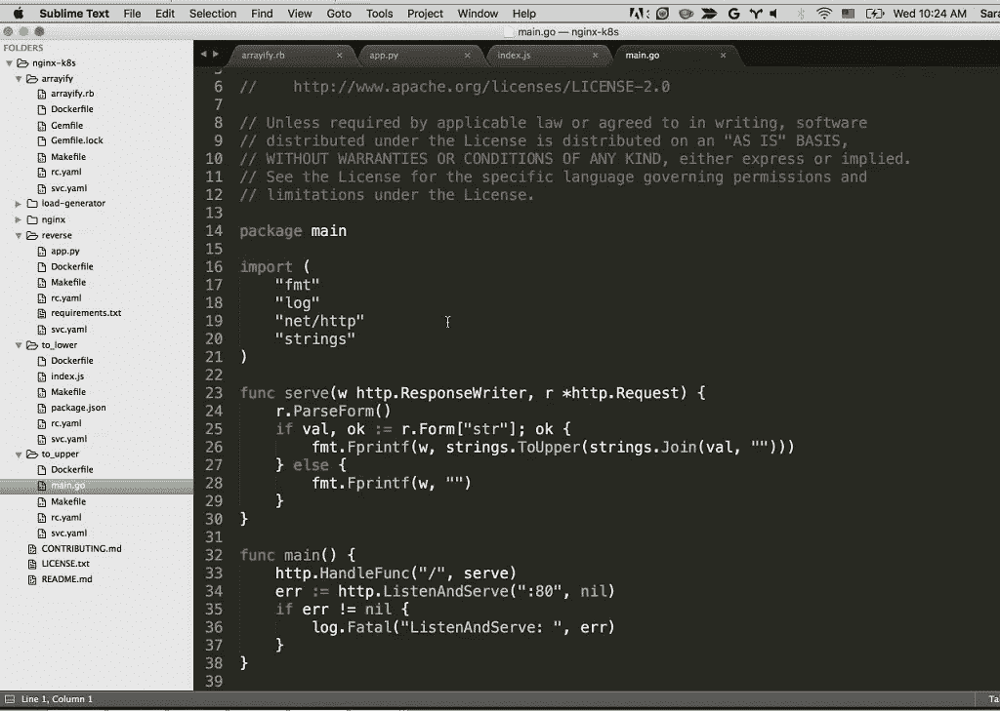

# 破解 Nginx:最佳方法

> 原文：<https://infosecwriteups.com/hacking-nginx-best-ways-7c576cc17ccc?source=collection_archive---------0----------------------->

Nginx 在野外使用已经有一段时间了。我们在编码/黑客时都在某个地方见过 NGINX 的名字。由于 NGINX 中的许多错误配置，它一直是黑客/bug 赏金猎人的目标，作为一名安全研究员/bug 赏金猎人，黑客攻击 web 服务器总是让我们着迷。今天，我们将看看如何在 NGINX 易受攻击的情况下真正破解它，并尝试从中获利。

好吧，如果你是这个话题的新手，不知道 NGINX 作为一个服务器是如何工作的，这里有一个来自互联网的描述:- " ***Nginx 是为了提供低内存使用和高并发性而构建的。Nginx 没有为每个 web 请求创建新的进程，而是使用一种异步的、事件驱动的方法，在单线程中处理请求。使用 Nginx，一个主进程可以控制多个工作进程。主进程维护工作进程，而工作进程执行实际的处理。因为 Nginx 是异步的，每个请求都可以被工人并发执行，而不会阻塞其他请求*。**“在 NGINX 的帮助下，你显然可以做很多事情

*   带缓存的反向代理
*   IPv6
*   负载平衡
*   FastCGI 支持缓存
*   WebSockets
*   静态文件、索引文件和自动索引的处理

所以一旦我们清楚了它是如何工作的，我们的话题就开始了..关键是错误配置发生在哪个阶段？嗯，如果我们没有正确地配置它，有许多事情可能会以其他方式进行。如果你回顾历史， **NGINX SPDY 堆缓冲区溢出**在 2014 年被利用。为了利用这一点，攻击者可以通过特制的请求来执行任意代码，从而导致堆内存缓冲区溢出。这将严重影响网络服务器。同样在 2020 年，NGINX 中发现了 PHP 远程代码执行漏洞，该漏洞非常严重，被认为是该产品有史以来最重要的发现之一。你可以在网上读到更多关于他们的信息。我把它留给你。

由于 NGINX 是目前最常用的网络服务器，所以也存在很多安全问题。我们今天正在谈论这些:-

*   **缺少根位置**
*   **别名 LFI 配置错误**
*   **原始后端响应读数**
*   **不安全变量的使用**

1.  **缺少根位置:-**

检查下面的代码片段:-

> server {
> root/etc/nginx；
> 
> location/hack . txt {
> try _ files $ uri $ uri/= 404；
> proxy _ pass[http://127 . 0 . 0 . 1:1212/](http://127.0.0.1:8080/)；
> }
> }

在 NGINX 中，root 指令指定根文件夹。在这个例子中，根文件被定义为/etc/nginx，这意味着我们可以继续查找 nginx 和其中的文件。所以在这里，如果你发送一个简单的请求，比如 GET /nginx.conf，就会暴露一些敏感信息，比如 nginx 的配置和其他东西。因为“/”可以处理任何请求，所以我们可以通过它发送一个敏感的端点。在某些情况下，可以访问其他配置文件和日志。

2.**别名 LFI 误配置:-**

总是建议在 NGINX 配置下检查“位置”语句。如果您发现类似以下的内容

> 位置/imgs {
> 别名/路径/图像/
> }

你可以在这里表演 LFI。怎么会？扩展到 **/imgs../secret.txt** 和它会转换为 **/path/images/../secret.txt.** 你可以在这里了解更多:-[**LFI/路径遍历**](https://www.acunetix.com/vulnerabilities/web/path-traversal-via-misconfigured-nginx-alias/) **。**

3.**原始后端响应读数:-**

有了 Nginx 的`proxy_pass`，就有可能拦截后端创建的错误和 HTTP 头。如果您想隐藏内部错误消息和消息头，让它们由 Nginx 处理，这非常有用。Nginx 会自动提供一个定制的错误页面，如果后端有一个回答的话。

想象有这样一个应用程序

> def application(environ，start _ response):
> start _ response(' 500 Error '，[('Content-Type '，' text/html '，(' Secret-Header '，' Secret '))
> return[b]Secret info，应该是不可见的！"]

它在 NGINX 中有以下指令:-

> http {
> error _ page 500/html/error . html；
> proxy _ intercept _ errors on；
> proxy _ hide _ Header Secret-Header；
> }

因此，如果我们发送一个简单的 GET 请求，我们的响应将如下所示

> HTTP/1.1 500 内部服务器错误
> 服务器:nginx/1.10.3
> 内容类型:text/html
> 内容长度:15
> 连接:关闭

但是如果我们试图发送一个无效的请求并检查接下来会发生什么呢？像这样:—

> GET /？XTTP/1.1
> 主机:127.0.0.1
> 连接:关闭

如果它易受攻击，我们应该得到一个秘密信息的响应:-

> XTTP/1.1 500 错误
> 内容类型:文本/html
> 机密-标头:机密
> 
> 在这里我们应该得到我们的秘密信息

4.**不安全变量的使用:-**

易受攻击的 NGINX 配置如下所示

> location/{
> return 302[https://ABCD . com $ uri](https://example.com$uri)；
> }

HTTP 请求的新行字符是\r(回车)和\n(换行符)。对新行字符进行 URL 编码会产生以下字符表示形式`%0d%0a`。当这些字符包含在像`http://localhost/%0d%0aHacker:%20test`这样的错误配置的服务器请求中时，服务器将用一个名为 HACKER 的新头来响应，因为$uri 变量包含 URL 解码的新行字符

> HTTP/1.1 302 临时移动
> 服务器:nginx/1.19.3
> 内容类型:text/html
> 内容长度:200
> 连接:保活
> 地点:[https://abcd.com/](https://example.com/)
> 黑客:测试

*   **proxy_pass 和内部指令:-**

**proxy_pass** 指令可用于**将内部请求重定向到其他服务器**内部或外部。 **internal** 指令用于向 Nginx 表明该位置只能在内部访问。

这些是 NGINX 中出现的一些常见攻击场景。很明显，该产品中报告了很多缓冲区溢出，并且总是建议检查您在特定服务器上可以做的一切。由于 NGINX 也用作负载均衡器，DOS 也是可能的。然而，他们越是更新产品，旧的 vulns 就越是消失。由于它被大量使用，新的漏洞可能会出现。

我希望你能从这篇博客中有所收获。老年人知道很多东西，在这个博客中提到的，在这个博客中已经可以得到，所以对那些人来说不是很多。但是如果你是新手，你肯定会从中获得一些好的知识。我希望它能帮助你学到一些东西。

继续学习，❤快乐黑客

**资源:-**

*   [**Detectify 博客促使我添加自己的话**](https://blog.detectify.com/2020/11/10/common-nginx-misconfigurations/)
*   查看此实验室以增强您的知识:- [**检测实验室**](https://github.com/detectify/vulnerable-nginx)