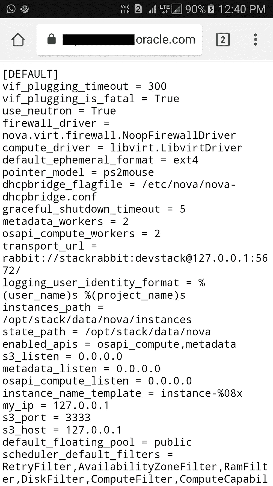
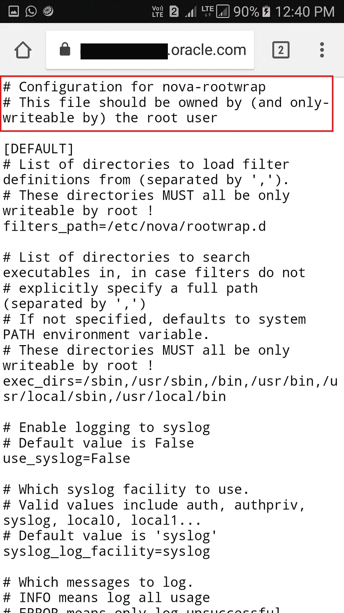
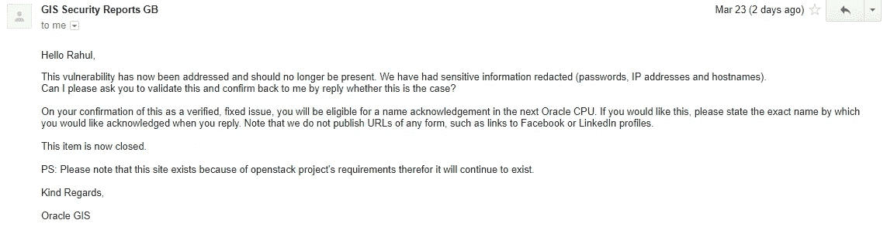

# 5 分钟内黑掉甲骨文

> 原文：<https://infosecwriteups.com/hacking-oracle-in-5-minutes-b52107a6124c?source=collection_archive---------0----------------------->

嘿，各位，我又回来了，这次是甲骨文

这是一篇很短的报道，不会有太多的信息

几周前，我正坐在家里看电视，看着我的链接，这时邮递员送来了我的 Udacity 礼物，我看到了一个人的帖子，他在甲骨文中发现了一个 XSS，所以我想让我们找到一些..

所以我没有带笔记本电脑(因为我懒得上楼)，但我的手机里有 termux，所以我运行了 oracle.com 的子列表，并登陆到一个包含一些随机内容的目录列表的子域，通过它我发现了一些敏感信息，如主机名，ip 地址，密码等。

还是不知道这是什么

时间表

**2 月 24 日报道此事**

**2009 年 3 月初步答复**

**3 月 14 日修复发布**

**3 月 23 日修复，并于 4 月 17 日获得 Oracle CPU 的 HOF 批准**

我就想

