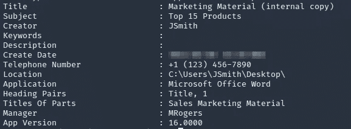
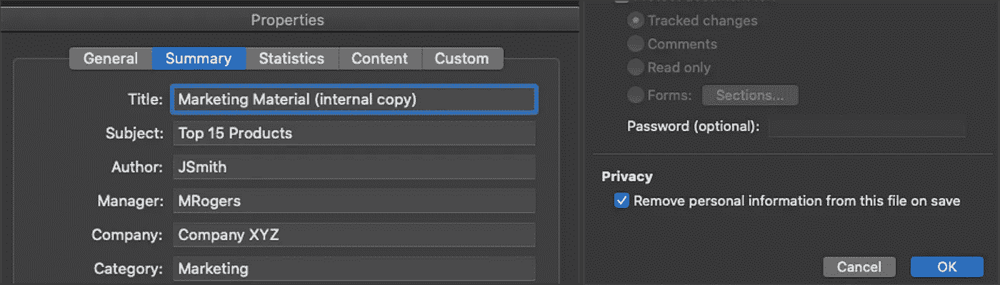

# 用元数据一次一个文档地攻击组织

> 原文：<https://infosecwriteups.com/hacking-organizations-one-document-at-a-time-with-metadata-1af2eb10f254?source=collection_archive---------1----------------------->

元数据被简单地定义为关于数据的数据。在计算机系统中，这用于正确解释文件和存储描述性属性。虽然并不总是可见的，但元数据提供的信息比内容创建者意识到的要多得多。一旦公开了包含元数据的文档，它可能会在不知不觉中帮助攻击者渗透到您的组织中。

Josue Valencia 在 [Unsplash](https://unsplash.com/s/photos/hacker?utm_source=unsplash&utm_medium=referral&utm_content=creditCopyText) 上拍摄的照片

作为一名渗透测试人员，我经常有一周的时间来瞄准客户的公共环境，目标是破坏他们的内部网络。这种形式的测试允许客户评估其防御解决方案的有效性，评估安全团队对模拟威胁活动的响应，并识别漏洞以进行补救。然而，只有一周的时间和零预先存在的知识，这可能是一项艰巨的任务。

# 元数据来了！

渗透测试或任何攻击性安全活动的第一步是侦察。了解你的目标是如何运作的。这包括从他们使用的软件到他们的用户帐户命名约定的一切。所有这些都可能在随后的攻击中被利用。

元数据是这些信息的主要来源，在公司的发布过程中很容易被忽略。一旦发布到他们的网站或其他公共论坛上，就可以下载文件并使用诸如菲尔·哈维的 [ExifTool](https://exiftool.org/) 等工具提取关键信息。这是一个用 Perl 编写的独立于平台的应用程序，可以用来读取、写入和编辑各种文件类型中的元信息。

描述可从元数据中提取的信息类型的图像。

这一过程可以使用诸如 [PyMeta](https://github.com/m8sec/pymeta) 之类的工具进一步简化，PyMeta 使用搜索引擎抓取来自动查找某个组织发布的公共文档。一旦找到，它将下载文件，并为提取的元数据创建一个格式整齐的报告。

部分 PyMeta 报告来自一个流行的全域 bug bounty 程序。

诸如用户帐户命名约定之类的信息可以被应用来生成用于暴力或社会工程风格攻击的用户列表。此数据还可用于根据找到的操作系统、软件或应用程序版本来推断环境或定制有效负载。

# 对此我们能做些什么？

在 Microsoft office 中，可以通过修改文档属性和启用隐私设置中的[个人信息删除](https://support.microsoft.com/en-us/office/remove-hidden-data-and-personal-information-by-inspecting-documents-presentations-or-workbooks-356b7b5d-77af-44fe-a07f-9aa4d085966f)来删除元数据。

根据组织采用的技术，可能存在第三方工具或插件来在上传过程中剥离元数据。否则，也可以通过文件资源管理器在操作系统级别进行删除。

# 包装它

使用元数据来定位组织已经存在多年了。然而，对于防御者来说，它仍然是一个未实现的信息点，至今仍被攻击者大量利用。

感谢阅读！在 [m8sec.dev](https://m8sec.dev/) 了解更多关于我的信息，并关注更多攻击性安全内容。

*免责声明:所有内容仅用于教育目的。作者不对信息的使用负责。不要对你不拥有或没有明确许可的系统进行测试。*