# 入侵社交媒体账户！

> 原文：<https://infosecwriteups.com/hacking-social-media-account-1abb06c80e1a?source=collection_archive---------1----------------------->

总有一天，我们都希望黑掉某人的社交媒体账户(比如 Instagram 或脸书……)，不管是我们的朋友、亲戚还是兄弟姐妹，我们谷歌了一下，发现了一些带有调查和虚假声明的网站来黑掉它们。但实际过程超级简单，这里使用的黑客技术是[社会工程](https://www.geeksforgeeks.org/social-engineering-the-art-of-virtual-exploitation/)。


> ***免责声明:本文仅用于教育和娱乐目的，不得恶意引用！！！***

# 先决条件:

1.  Kali Linux 已安装

**第一步:**启动卡利机- >启动终端- >赋予 root 权限。

```
sudo su
```

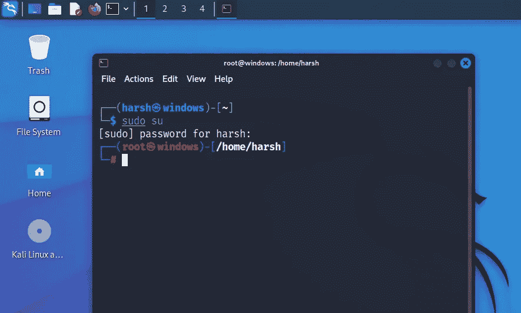

**步骤 2:** 转到下载(首选)文件夹- >安装 Zphisher。

```
cd Downloads
git clone [https://github.com/htr-tech/zphisher.git](https://github.com/htr-tech/zphisher.git)
```

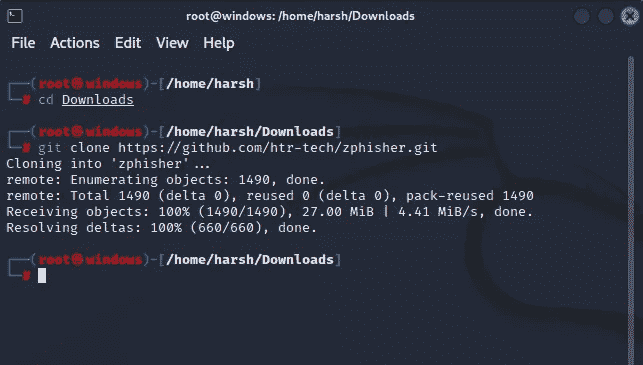

**第三步:**安装 Maskphish。

```
git clone [https://github.com/jaykali/maskphish.git](https://github.com/jaykali/maskphish.git)
```

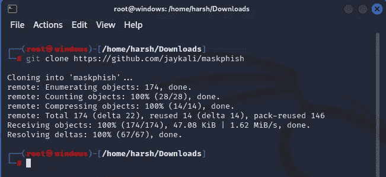

**第 4 步:**现在是最重要的部分，在受害者输入凭据并且我们收到凭据后，他会看到哪一页？

默认情况下，在 Zphisher 中，用户将被重定向到所选平台的官方登录页面。但是，由于这是一个社会工程攻击，我们不希望受害者怀疑和改变他的密码，我们呢？

因此，我们需要更改我们希望攻击的平台的默认重定向 URL。

现在，前往文件资源管理器中的这个位置

```
/home/<usr>/Downloads/zphisher/.sites/<platform>
```

(用户名在<usr>中，平台在<platform>中)</platform></usr>

如果您要手动进入该位置，请确保您选中了“查看隐藏文件”。

打开 login.php，将初始 URL 更改为要重定向到的 URL。

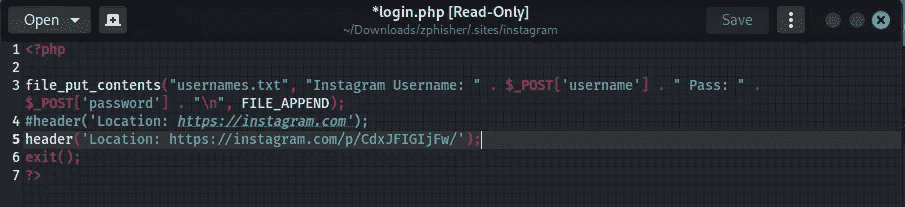

要么评论现有的网址，要么改变它。

现在保存文件并退出。

**第五步:**进入 Zphisher 目录- >运行 Zphisher，获取钓鱼链接(这里以 Instagram 为例)。

```
cd zphisher
bash zphisher.sh
```

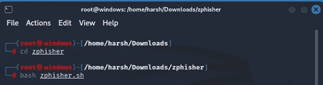

(第一次运行可能需要一些时间来安装依赖项。)

为 Instagram 输入“2”

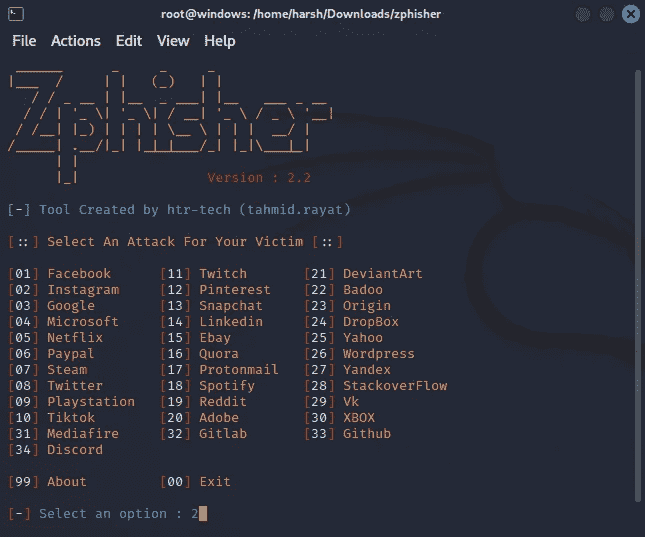

然后输入“1”进入一个虚假的登录页面。

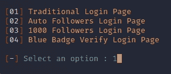

然后按“3”选择 Cloudflare 端口转发服务(首选)。

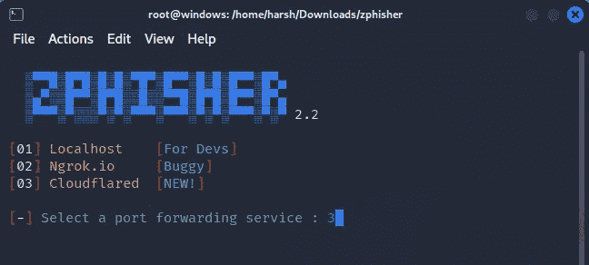

它将在几秒钟后运行并显示链接。

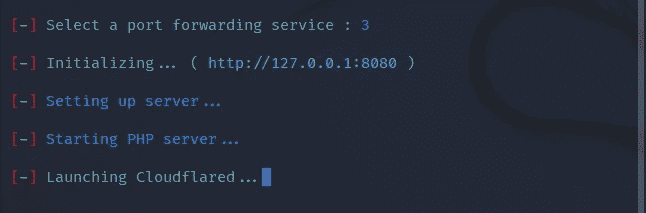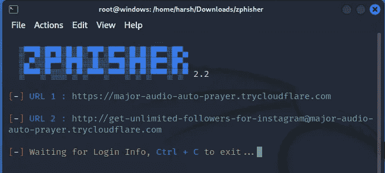

**第六步:**打开一个新标签- >用 Maskphish 屏蔽钓鱼网址，这样受害者就不会发现链接可疑。

```
Ctrl+Shift+T (New Tab)
cd Downloads
cd maskphish
bash maskphish.sh
```

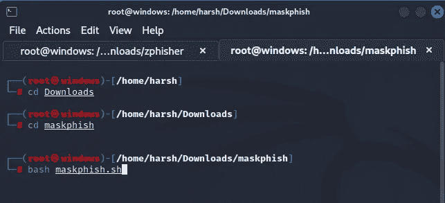

现在粘贴从 Zphisher 获得的钓鱼 URL。

```
Ctrl+Shift+C (To copy in Linux)
Ctrl+Shift+V (To paste)
```

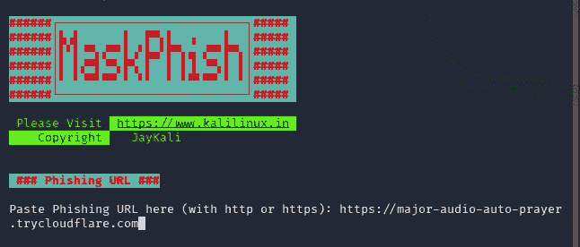

现在指定要在屏蔽 URL 中使用的域(这里使用的是 [https://instagram.com)。](https://instagram.com).)

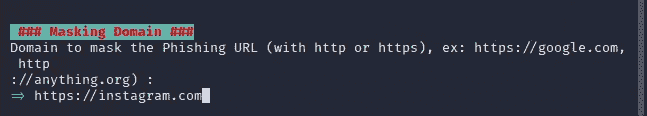

现在给出在屏蔽 URL 中使用的单词，使它更有说服力(这里，不要笑)。

```
***Note:* Make sure there is no space in between the words, they should be separated with hyphen (-).**
```

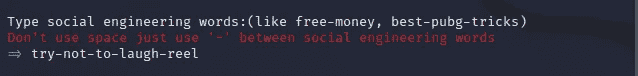

Maskphish URL 在一两秒钟内生成。

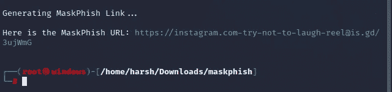

现在，这是将重定向到我们的钓鱼页面的 URL(看起来很有说服力，对吧:)。

**第 7 步:**现在将 maskphish URL 发送给你的目标，每当他登录我们的虚假网页时，他将被重定向到我们在 login.php**指定的新重定向 URL，我们将在我们的终端中接收凭证，它们将被保存到详细信息下方显示的文件中。**


瞧啊。！你制造了一次成功的**社会工程攻击！**

## 来自 Infosec 的报道:Infosec 每天都有很多内容，很难跟上。[加入我们的每周简讯](https://weekly.infosecwriteups.com/)以 5 篇文章、4 个线程、3 个视频、2 个 GitHub Repos 和工具以及 1 个工作提醒的形式免费获取所有最新的 Infosec 趋势！