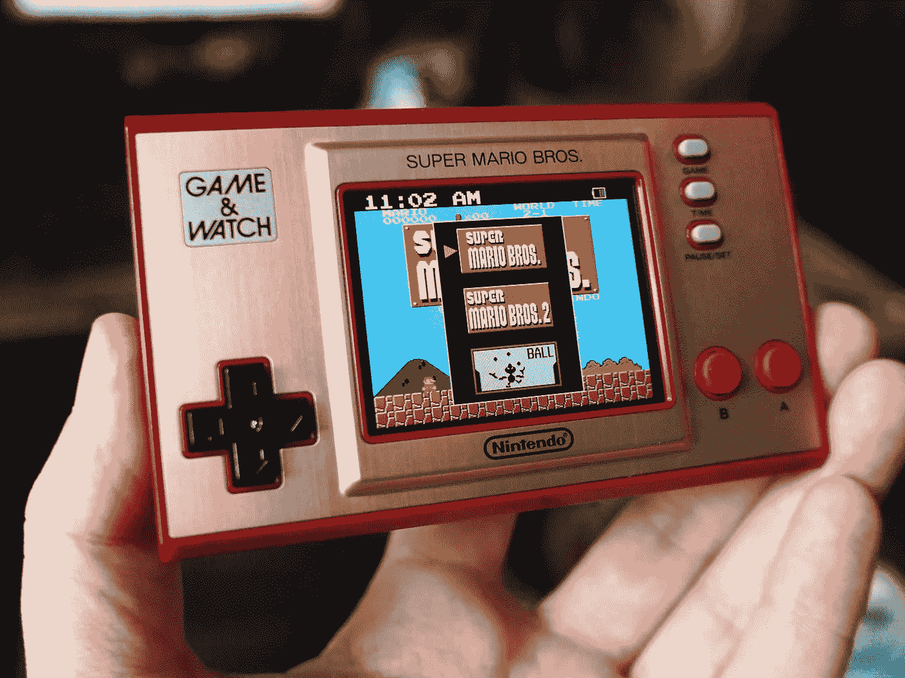
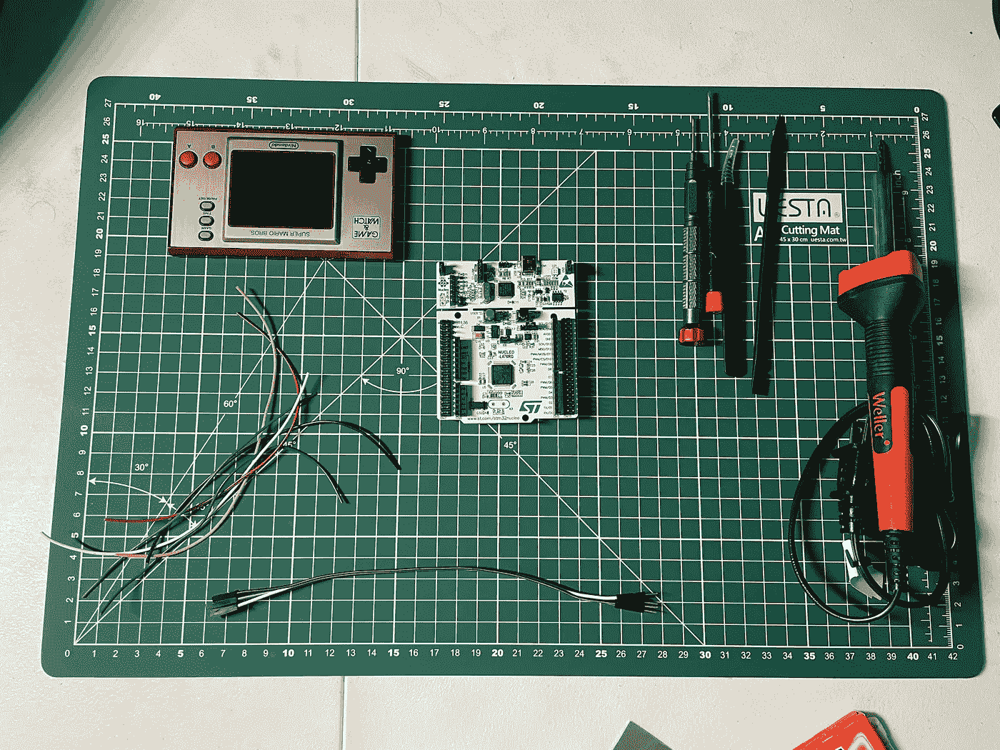
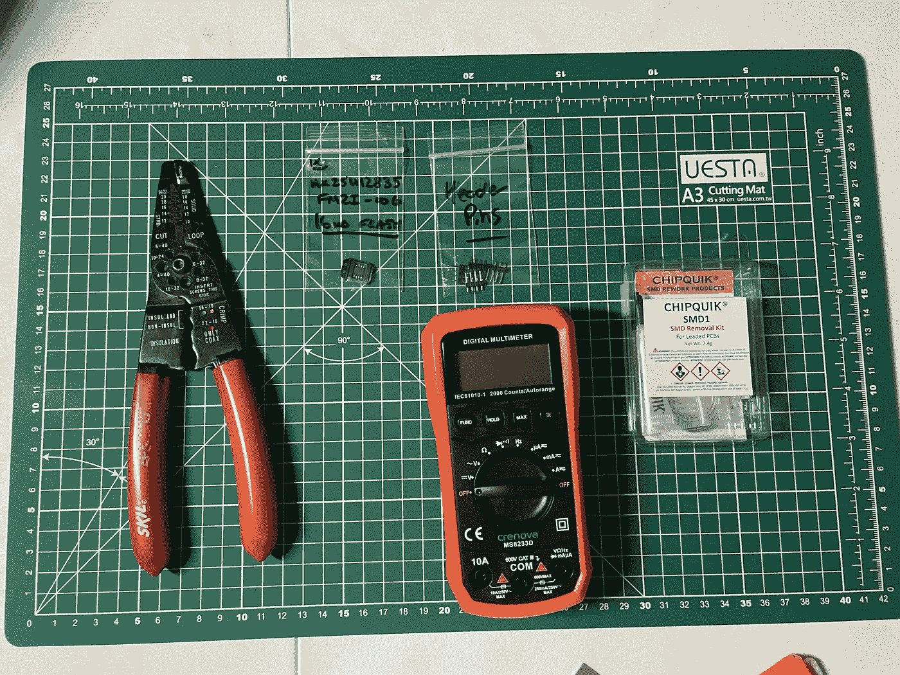
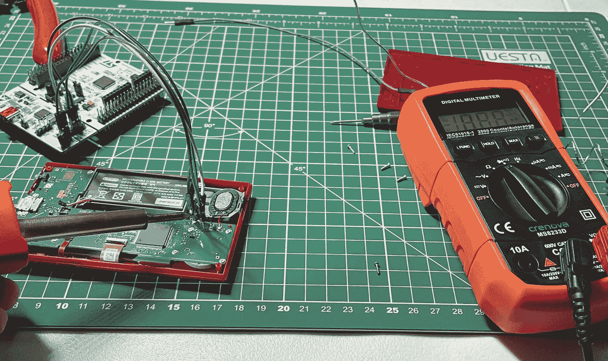
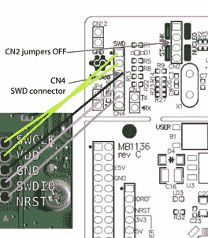
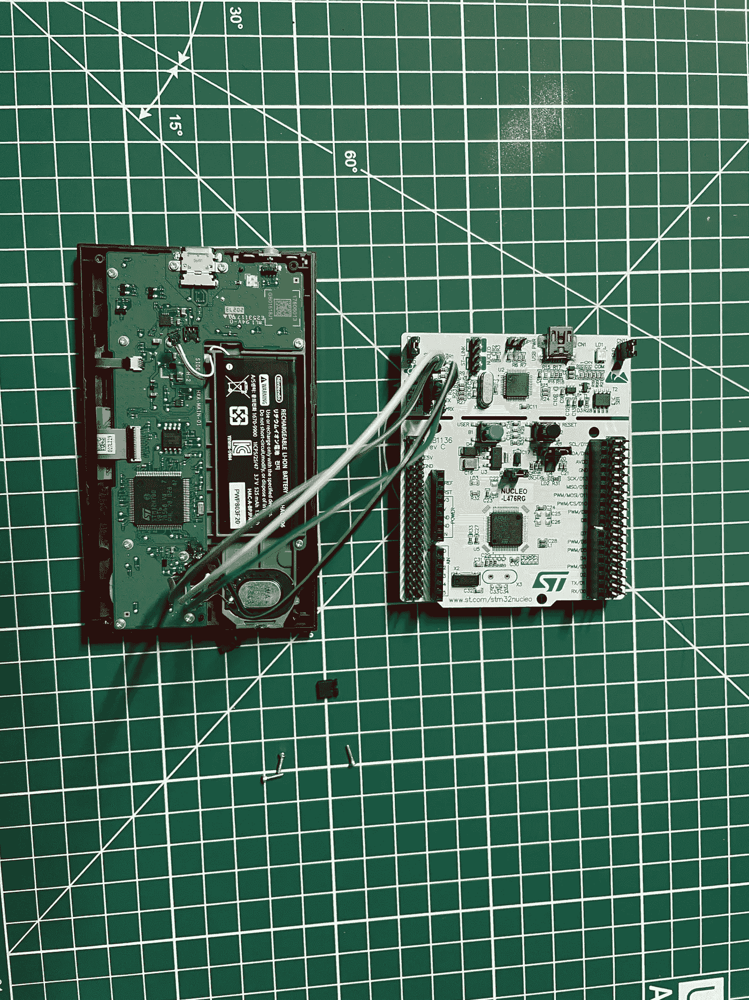

# 黑客游戏一个手表第 1 部分

> 原文：<https://infosecwriteups.com/hacking-the-game-an-watch-part-1-c355b09ecea0?source=collection_archive---------2----------------------->

## 硬件黑客入门

图片来源:[https://techcrunch.com](https://techcrunch.com)—创意来源:stack mashing([https://www.youtube.com/channel/UC3S8vxwRfqLBdIhgRlDRVzw](https://www.youtube.com/channel/UC3S8vxwRfqLBdIhgRlDRVzw))

## 这个项目的目标是什么？

任天堂游戏《安手表》碰巧附带了一套马里奥游戏，但如果我告诉你，可以侵入 G&W 来加载不同的 rom，比如 GB、GBC、NES 等，会怎么样？？你的选择！我们将对 SPI 和内部闪存进行基本备份，然后解锁芯片以支持在设备上写入，然后恢复备份，这样我们就可以加载这些不同的 rom。

## 所需材料:

(注意:这些材料中的大多数可以用其他品牌代替，尽管我建议坚持使用 NUCLEO-L476RG 而不是仿制品来避免问题)

*   意法半导体开发板，Arduino/mbed Nucleo—Nucleo-l 476 rg
*   用于任天堂 Switch 的三翼螺丝刀，用于任天堂 Switch Joycon 控制器维修的 TEKPREM Y00 三翼螺丝刀，1.5mm Y 三点螺丝刀
*   25 瓦韦勒标准责任烙铁套件
*   电线或杜邦线(M-F ),以便更好地连接

## 可选材料:

*   剥皮钳
*   16 MB Flash SPI 芯片
*   接头引脚
*   Crenova MS8233D 自动量程数字万用表家用测量工具，带背光 LCD 显示屏(推荐)
*   ChipQuik SMD1 有引脚低温移除套件

如果你没有杜邦电线，需要切断普通电线的末端来准备焊接，剥线钳可能会派上用场。

16 MB 的闪存芯片不是必需的，但如果你想上传更多超过芯片 1 MB 限制的游戏，那么你将需要它。

万用表总是用来检查连续性，特别是如果你是第一次焊接，可能会产生一个焊接桥，导致短路。

要设置这个项目，你首先要用提供的螺丝刀拧开 G&W 的底盖。我们将首先取下电池的连接器，然后取下游戏手表上的 CN2 跳线。您会在 STLINK 下找到标有“CN2”的部分。

现在，焊接时间到了！焊接时请参考下图。杜邦线的使用使得连接更加牢固，焊接更加容易。请记住，杜邦线的公端在 G&W 上，母端在 Nucleo 板上。请记住，我使用的是 25 瓦的电熨斗，所以它需要多一点时间来加热，但通常会有一点烟从熨斗中冒出来，特别是在它的第一次使用中，这往往是生产残余物，是一个很好的指示器，可以指示它何时开始加热。如果这是你第一次焊接，事先在 PCB 和电线上练习总是好的，但记住避免不必要的燃烧和烟雾的塑料。

图片来源:[https://www.youtube.com/channel/UC3S8vxwRfqLBdIhgRlDRVzw](https://www.youtube.com/channel/UC3S8vxwRfqLBdIhgRlDRVzw)

这是成品的俯视图。请记住，如果有任何过量的焊料可能导致短路，并且您没有任何好的脱焊产品，最后的办法可能是再次加热您的烙铁，并加热焊料，直到它再次熔化，并可以从电线的公端移除。

现在，我们已经完成了主要的硬件，更多的实践部分，我们将进入固件，与芯片一起上传不同的 rom，等等。完成这个项目！

硬件黑客最流行的流派之一是游戏机，尤其是 Xbox 和 Playstation，但黑客攻击 PC 游戏呢？如果这激起了你的兴趣，一定要看看下面这个系列:[游戏黑客视频教程](https://guidedhacking.com/forums/gh-videos-game-hacking-tutorials.426/)