# 入侵内部(Tryhackme)

> 原文：<https://infosecwriteups.com/hacking-the-internal-tryhackme-42939bd3f5d6?source=collection_archive---------2----------------------->

嘿，伙计们，这个帖子是关于我最近在 Tryhackme 中提到的机器的，它确实是一个很好的侵入机器，因为它涵盖了真实世界的 pentest 示例，而且你也会了解到真实的 pentest 环境是什么样子的。务必记下这台机器里的一切。

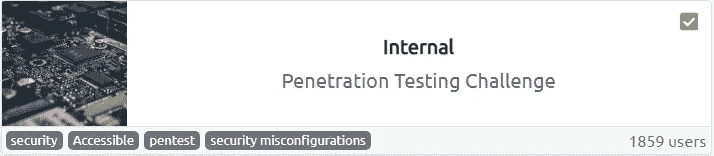

内部的

难度:难

内容:

1.  扫描和信息收集(Nmap、Nikto、Dirb、Wordpress)
2.  识别缺陷。
3.  强制登录页面(wpscan)。
4.  获得反向外壳。
5.  枚举计算机。
6.  获取 user.txt
7.  隧道技术
8.  权限提升

因为这就像一个真实的测试环境，我们必须遵循一定的规则。这里有一份简报可能会有所帮助。

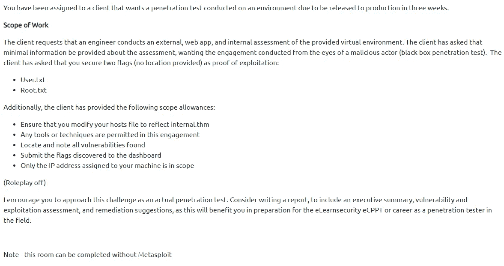

交战规则

我们将对此机器进行详细扫描，即针对开放端口和服务的密集 Nmap 扫描。

还有一件事，确保编辑/etc/hosts 文件，IP 应该反映到 ***internal.thm***

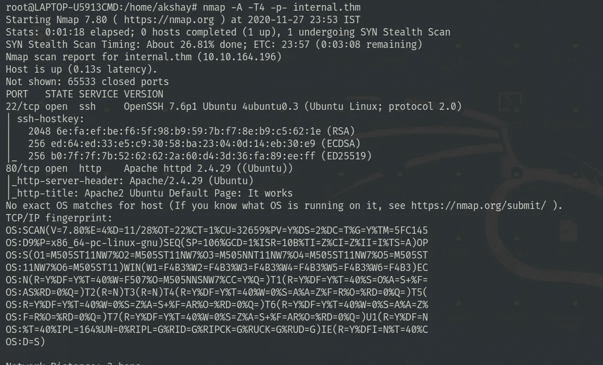

Nmap 扫描结果

如您所见，我们在端口 80 上运行 web 服务器，为了进一步列举，我们将使用 dirb 和 nikto。

目录扫描结果:

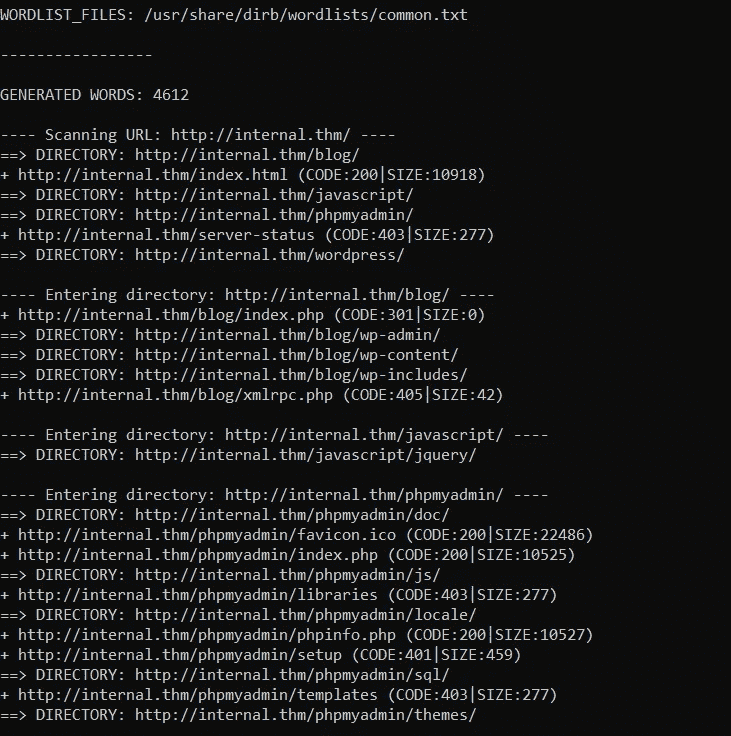

目录扫描结果

Nikto 扫描结果:

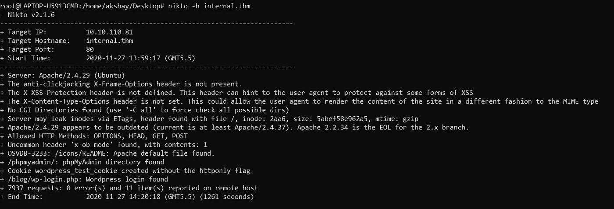

Nikto 扫描结果

从 dirb 和 nikto 的扫描中没得到什么。有一个 wordpress 网站正在运行，我们可以执行 wpscan 来列举用户和易受攻击的插件。

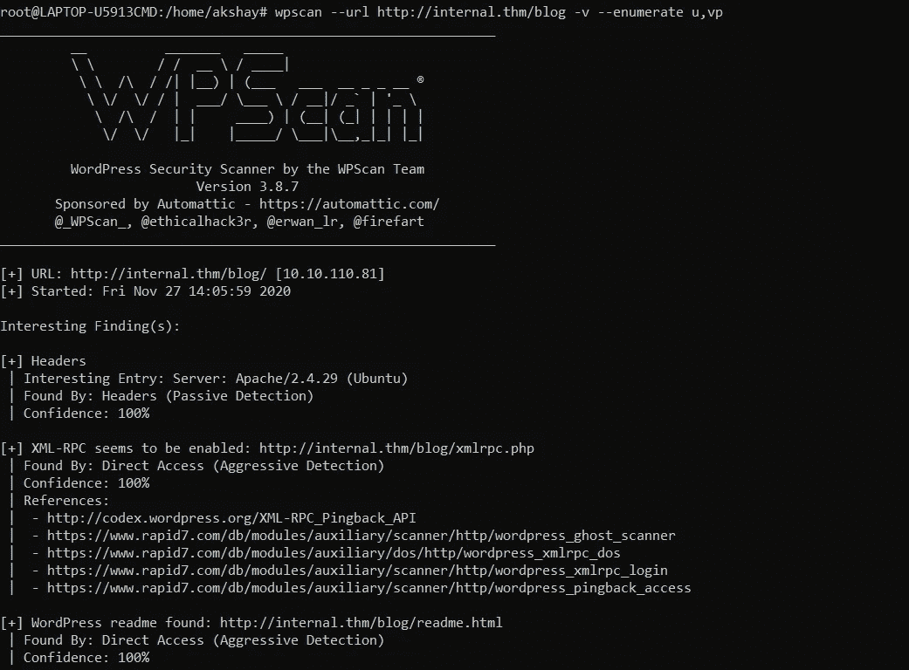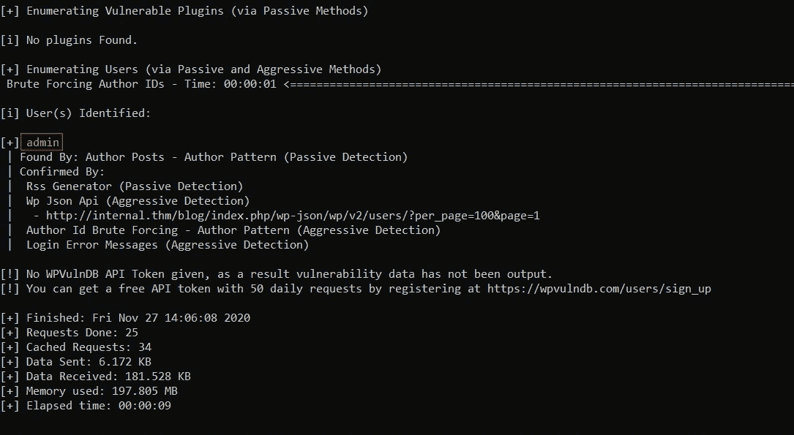

我们发现了一个用户管理员，我们可以使用 rockyou.txt 作为默认单词列表对登录页面进行暴力攻击。

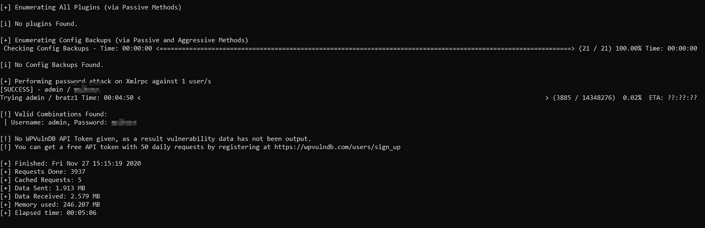

成功执行暴力破解

我们唯一剩下的就是登录到网页，通过主题编辑器得到反向外壳。让我们首先使用凭据登录。

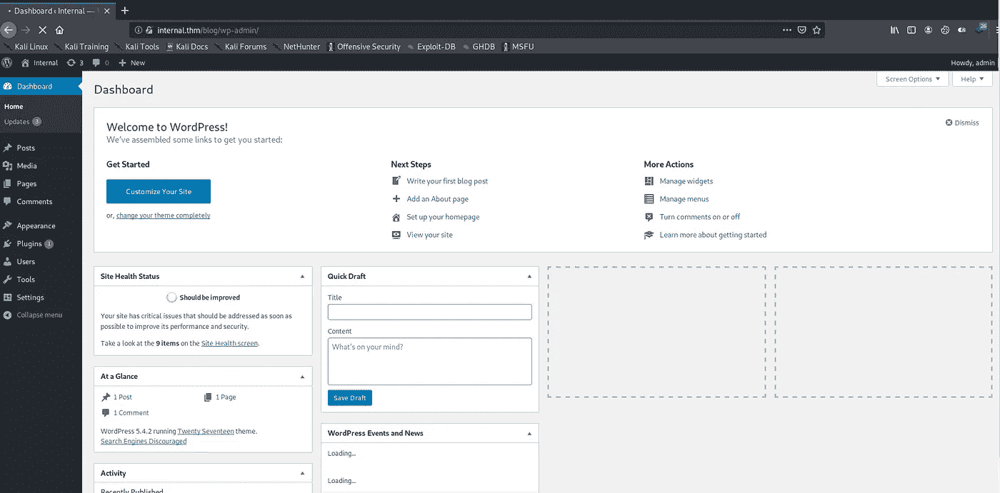

现在我们在，让我们编辑主题文件来获得反向外壳。跟我来🚀

进入外观->主题编辑器-> 404.php

由 [pentest monkey](https://github.com/pentestmonkey/php-reverse-shell) 用恶意 php 代码替换 404.php 的内容。

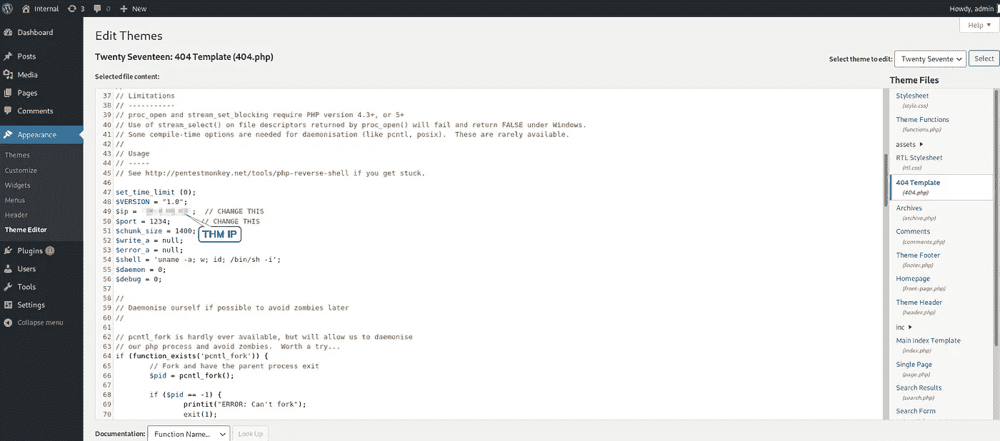

编辑 404.php

更新文件并访问以下 URL:

> http://internal . thm/blog/WP-content/themes/twenty seven/404 . PHP

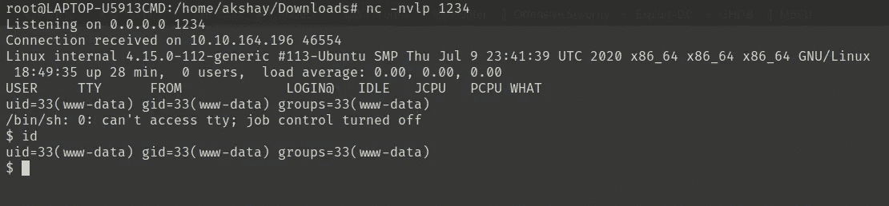

获取反向外壳

为了生成一个稳定的 shell，我们总是可以使用 python。

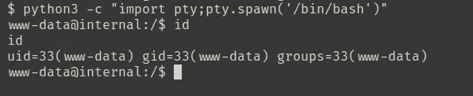

使用 python 获得稳定的外壳

所以要获得 user.txt，我们必须将我们的特权升级到 ***aubreanna*** 。尝试运行 linpeas 脚本或手动枚举会很好。我在/opt 目录中找到了这个文件，这是我们需要的文件，因为它包含了用户 ***aubreanna*** 的凭证。

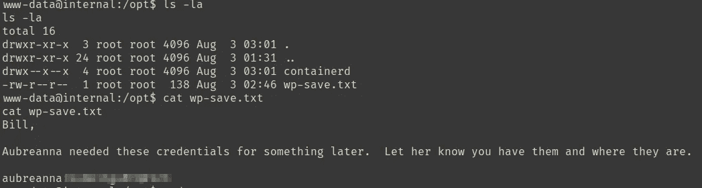

aubreanna 的证书

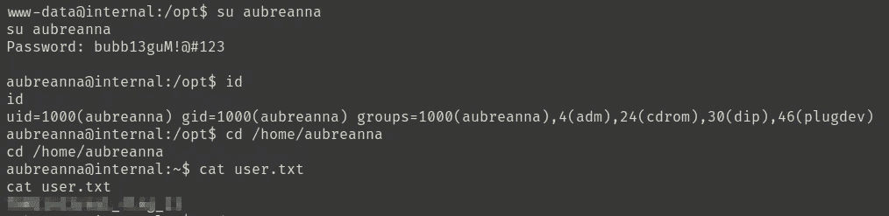

获取 user.txt

和 user.txt 一起，我也得到了这个文件。让我给你看看它的内容。

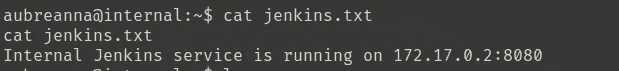

端口 8080 上运行着一个内部 web 服务。在这里，我们可以使用 socat 在任何端口号监听它，这样我们就可以访问它。

socat 实用程序是两个独立数据通道之间双向数据传输的中继。

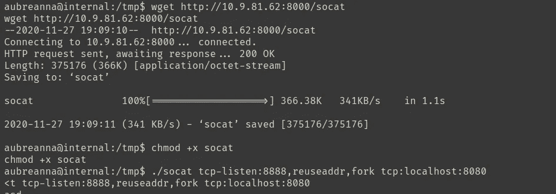

从[这里](https://github.com/andrew-d/static-binaries/blob/master/binaries/linux/x86_64/socat)获取 socat 的二进制版本。

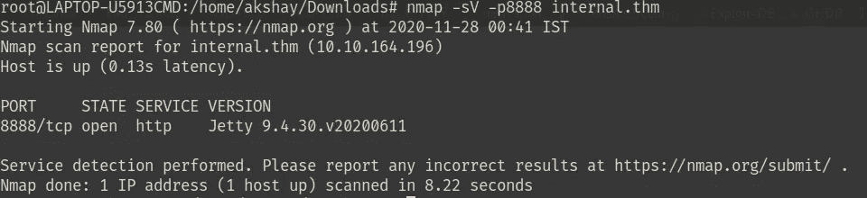

看到它的工作。所以现在我们可以浏览网络服务器，看看我们是否能得到什么有趣的东西。

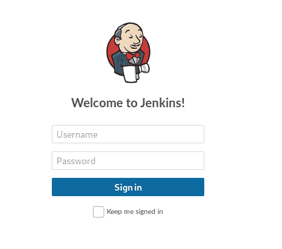

登录页面

啊，又来了😧。我尝试了默认用户名/密码，但不起作用。暴力是我们唯一的选择。我将在这里使用九头蛇。

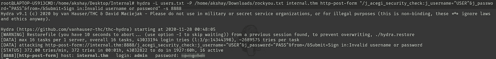

蛮力成功

所以登录之后，我们得想办法去拿东西。所以我谷歌了一下我们能对詹金斯做些什么。所以我找到了这个脚本控制台，它允许人们编写和执行 Groovy 脚本。

 [## 滥用 Jenkins Groovy 脚本控制台获取 Shell

### Jenkins 是领先的开源自动化服务器，用于部署和自动化任何项目。

blog.pentesteracademy.com](https://blog.pentesteracademy.com/abusing-jenkins-groovy-script-console-to-get-shell-98b951fa64a6) 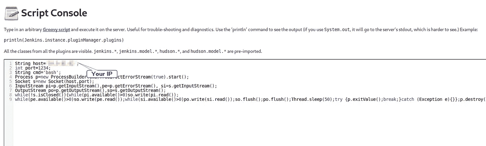

运行脚本，并在相应的端口上等待传入的连接。

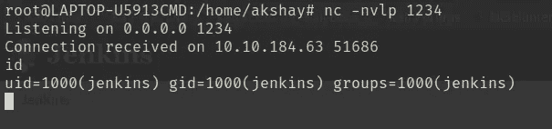

反向外壳

枚举了一会儿，扫描了一下系统，得到了这个 note.txt，这个文件包含了 root 用户的密码。轻松右转😙

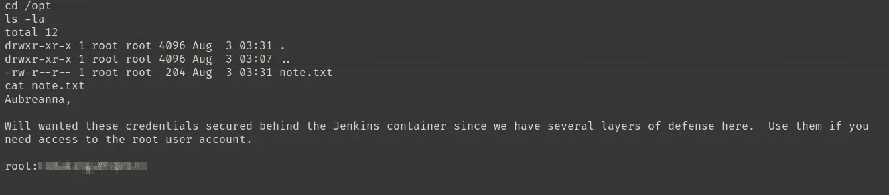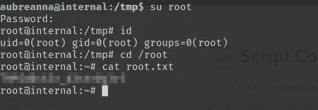

我希望你们能理解，随时给我发不和谐的短信

谢谢你😃快乐黑客💻