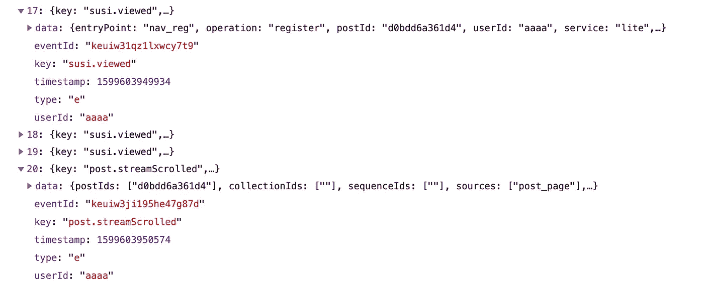
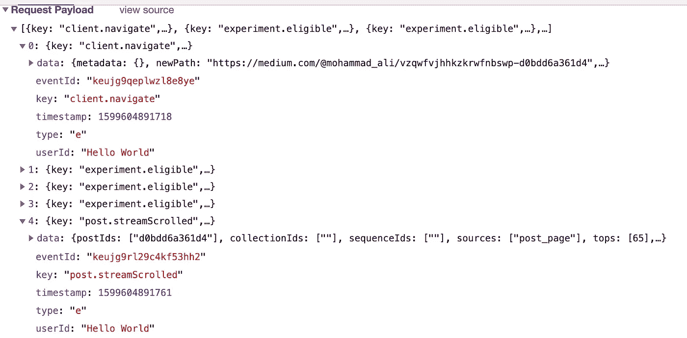
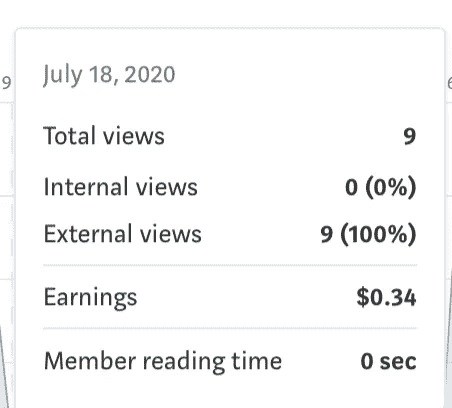

# 破解媒体合作伙伴计划

> 原文：<https://infosecwriteups.com/hacking-the-medium-partner-program-84c0e9fa340?source=collection_archive---------0----------------------->

这是一段旅程，详细描述了我的名字是如何被添加到 [humans.txt](https://medium.com/humans.txt) 中，以获得我的第一个 bug 奖励，一个[严重性 2](https://help.medium.com/hc/en-us/articles/213481308-Bug-Bounty-Disclosure-Program#e237) 的奖励！我写这篇文章是因为我个人一直对人们如何发现安全漏洞很感兴趣。此外，漏洞本身非常容易被利用，详情可在本文末尾找到。(请慢慢滚动，以便我可以获得一些合作伙伴计划收入)

# 背景故事

我原本打算写一篇文章，描述我进行的测试，试图弄清楚每月 5 美元的费用中有多少是通过媒体合作伙伴计划给作家的。我曾计划测试我认为可能影响作家报酬的不同互动。例如阅读文章不同的时间量，并查看与文章的交互(通过诸如突出显示文本、鼓掌等手段)是否会影响作者的报酬。由于我的预算有限，我只想支付一个“控制”帐户来做我所有的测试。我最初打算测试 20 多个不同的场景，但每天只能测试一个，因为中等合作伙伴计划收入是每天计算的，所以我在寻找自动化该过程的方法。因此，我通过 chrome 开发者工具来分析数据是如何传输回 medium.com[的，看看是否有可能自动化我的一些测试。](http://medium.com/)

我开始一个接一个地阻止对某些 url 路径的请求，我认为这些请求可能会传输用于计算我的合作伙伴计划收入的指标。经过多次反复试验后，我发现是向[medium.com/_/batch](http://medium.com/_/batch)发出的请求传输了所有用于计算我的合作伙伴计划收入的数据。

通过/_/batch 端点传输回 medium HQ 的部分数据的屏幕截图

我没有办法弄清楚传输回[medium.com/_/batch](http://medium.com/_/batch)端点的大量数据代表什么，我当时计划对向该端点发出的请求执行重放攻击，只修改时间戳数据，使其与重放攻击发起的时间相关(可能是我最初捕获向该端点发出的所有请求后的几天)。

因为我不想将我所有的 cookies 复制粘贴到我正在编写的 python 脚本中来执行我的重放攻击。在加载网页后，我尝试清除浏览器中的所有 cookie，即使没有任何 cookie 存在并被传输到[medium.com/_/batch](http://medium.com/_/batch)我仍然能够获得合作伙伴计划收益。然后，我试图分析请求 JSON 数据，看看我是否可以简单地一次生成任意持续时间的会话所需的所有 post 请求数据(实际上是一大堆页面滚动事件)，并一次性将其传输到您的 JSON 端点 medium.com/_/batch T2 T3。(这将允许我自动测试不同长度的会话)。不幸的是，这没有奏效。

我最初认为，这是因为服务器可能会验证传输时间，以阻止某人在他们不是会员的一段时间内(比如未来几个月或过去几个月)为作者创造潜在的合作伙伴计划收入。但是经过更多的实验(在正确的时间和不同的负载下发送请求),我认为最有可能的解释是，JSON 负载中的 eventID 是某种包含用户 ID 和页面查看日期的散列，因为 eventID 中确实存在一种模式，因为 ID 的前 4 个字母对于来自相同用户 ID 和日期的请求来说似乎是相同的。由于代码混淆，我无法弄清楚这些用户标识是如何生成的。

# 发现漏洞

就在这个时候，我意识到除了作为请求有效载荷中每个 json 对象的一部分的 userID 之外，没有任何用户独有的东西被传输给[medium.com/_/batch](http://medium.com/_/batch)(如上图所示)。修改用户 ID 本身并不能让我获得合作伙伴计划收入。(请记住，无论您从端点请求什么，它都会以“成功”作为响应:真。)所以我在黑暗中试错，试图找出端点是如何认证这些请求的。我相信这是因为我不知道如何计算有效的 EventIds(这只是我认为需要做的一件事，我不知道这些 id 是否代表任何超出随机的字母和数字字符串的东西)。我最初尝试在网站的主 HTML 文件中使用查找和替换功能，用我拥有的另一个付费帐户的用户 ID 替换我当前的用户 id，然后尝试调用窗口初始化时调用的 JS 函数。不幸的是，这并没有让我去任何地方，因为 medium.com 的代码混淆对我来说太激进了，以至于我无法理解发生了什么。我的下一个计划是使用类似 MITMProxy 的 Python 库对我自己发起中间人攻击，这将允许我在数据到达我的 web 浏览器之前的传输过程中找到并替换我的 userID，替换为我想模仿的人之一。

# 幸运

我决定尝试为一篇文章的主 HTML 页面的请求更改请求 UID cookie 值。令我惊讶的是，medium.com[在确认会话 cookie 和 uid cookie 代表有效的登录会话之前，将 UID cookie 值作为 JSON 数据嵌入到网页中。尽管网页正确地将我的 uid/会话 cookie 识别为无效；它仍然会将来自请求 cookie 的 UID 数据嵌入到网页中。在响应中，它发回“set-cookie”标头，其中包含以“lo_”开头的新会话 UID 的信息。因此，无论主 web 页面请求使用什么 UID cookie 值，所有批处理请求(您的 api 端点)都将使用该值作为“UserId”。这里有一个例子，我把用户标识改成了“Hello World”](http://medium.com/)

这是/_/batch 端点的请求有效负载，我随机展开了 2 个数组项

我还发现找到用户 ID 非常容易，你只需导航到他们的个人资料，在网页的 HTML 代码中搜索“{\"ID\ ":”就可以找到他们的用户 id，你会看到[网飞科技博客](https://medium.com/@NetflixTechBlog)的用户 id 是:“c3aeaf49d8a4”(顺便说一下，这些用户 id 是公开的)

所以现在如果你把你的 UID cookie 改成一个付费用户，然后加载你在 medium 上写的一篇文章，Medium 就会用别人的 userID 把数据传输到它的 [/_/batch](https://medium.com/_/batch) 端点。在这一点上，如果你阅读这篇文章，它将为作者创造收入。Medium 不会验证 userID 值，只是假设它们是正确的。

[如果你想看的话，这里有篇文章](https://medium.com/@mohammad_ali/vzqwfvjhhkzkrwfnbswp-d0bdd6a361d4)

我可以在一天之内通过模仿 10 个人赚到 34 美分。很明显，我不想过度测试这个概念，因为我不想让媒体认为我有恶意。在写这些之前，我首先通过他们的 bug bounty 程序报告了这个 bug。

# 结论

*   总之，我发现会员阅读时间似乎与合作伙伴计划收入没有关系。(参考上图)
*   我们了解到，medium.com 会将你发送给他们的任何用户标识 cookie 值嵌入到他们的网页中(这是他们尚未解决的问题)。
*   我们了解到，媒体合作伙伴计划端点并不验证用户是否拥有有效的登录会话，而是盲目地接受用户 id 并假设它们是正确的。
*   此外，我们不知道我是否是第一个发现此漏洞的人，Medium partner 程序的作者可能被骗走了未知金额的钱，因为他们可能已经与利用此漏洞的人分享了他们的收入。

# 雇用我

请随时通过电子邮件联系我:Mohammad-Ali@Bandzar.com