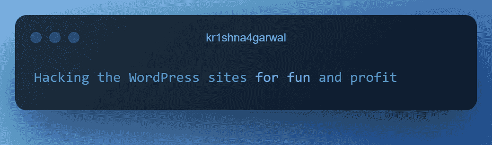
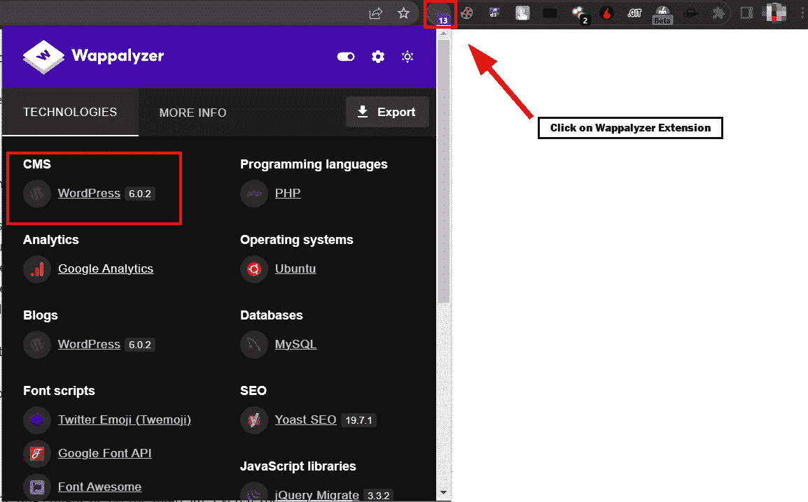
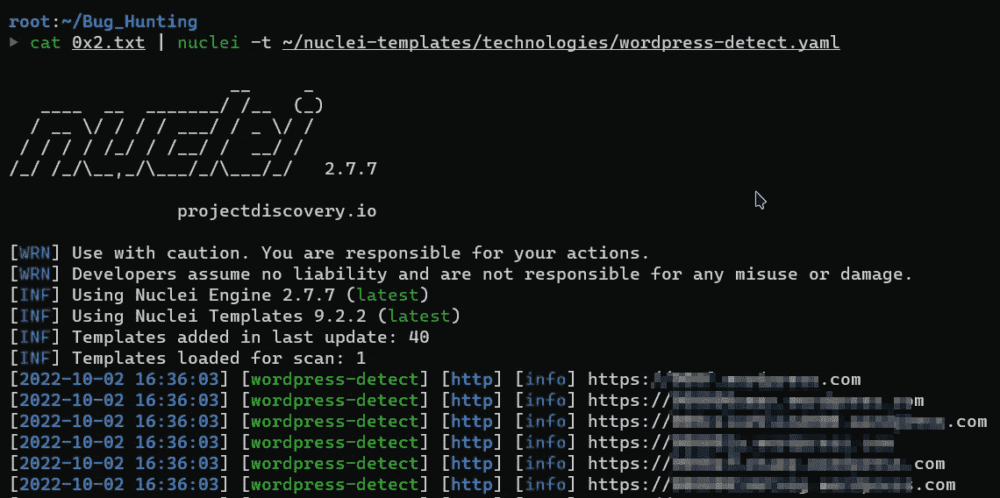
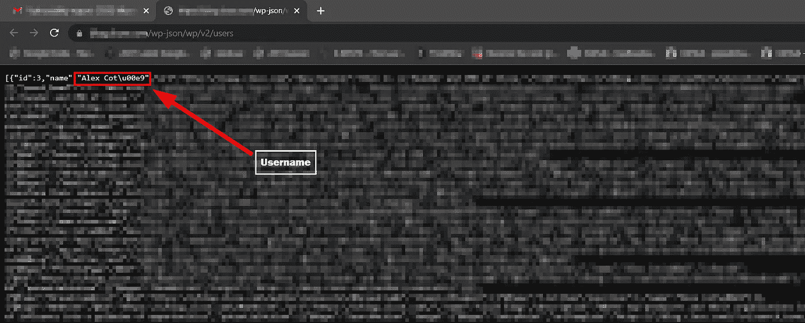
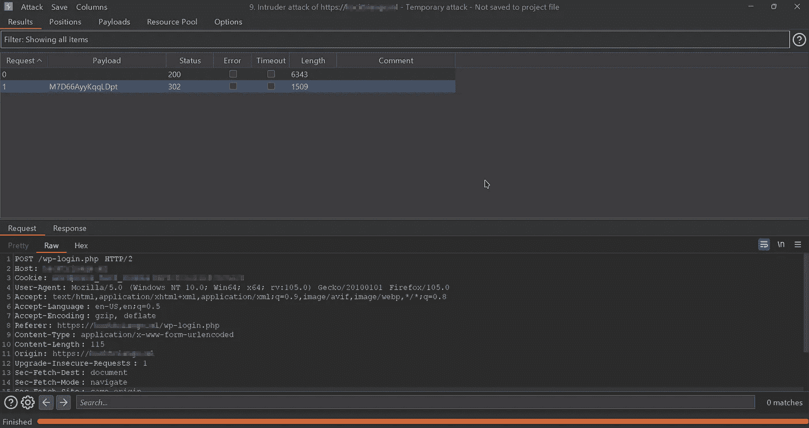
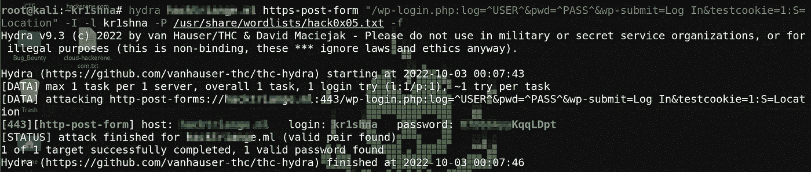
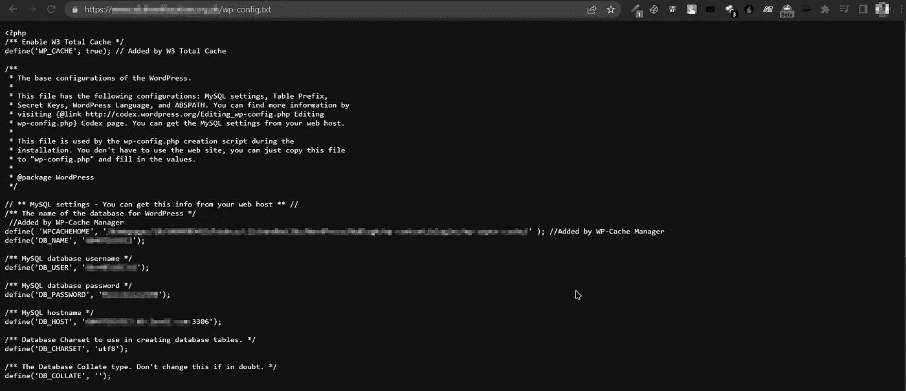
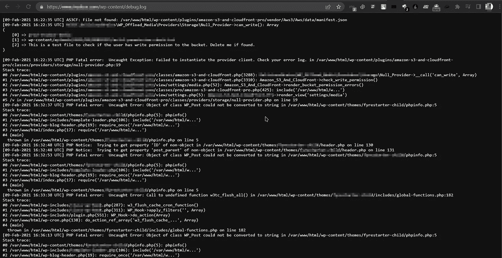

# 为了乐趣和利益而入侵 WordPress 网站|第一部分[水]

> 原文：<https://infosecwriteups.com/hacking-the-wordpress-sites-for-fun-and-profit-part-1-water-7ba474ced0f8?source=collection_archive---------0----------------------->

大家好，我是来自印度🇮🇳.的克里希纳·阿加瓦尔一个普通的漏洞猎人和所谓的安全研究员:)

## 今天是我的生日，所以我计划以不同的方式庆祝，这就是为什么我在这篇文章中写下了我在 bug bounty 之旅中发现的一些常见的漏洞和错误配置:)我希望你能从这个系列中学到一些新东西。

我把这篇文章分成两部分。第一个是水，第二个是火。这是“为了乐趣和利益而入侵 WordPress”系列的第一部分。

我会试着提到我在这个系列中知道的所有常见的 wordpress 错误配置和漏洞。



为了乐趣和利益而入侵 WordPress 网站

让我们为了乐趣和利益黑掉 WordPress:)

所以，你们都已经知道了 WordPress，如果你不知道它是什么，那么这里是 WordPress 的简短介绍

## **0x 01——什么是 WordPress？**

> WordPress 是一个内容管理系统(CMS ),允许你托管和建立网站。WordPress 包含插件架构和模板系统，因此你可以定制任何网站来适应你的业务、博客、作品集或在线商店。

## **0x02 —枚举目标**的子域

在我以前的文章中，我已经提到了一些枚举子域的方法。这里 *可以查一下[。](/story-of-my-first-valid-critical-bug-22029115f8d7)*

## **0x03 —检测 WordPress**

首先，我们需要知道我们的目标是否在使用 WordPress，有很多方法可以检测 WordPress。我提到了做这件事的两个最好的方法。

**0x02.1 —通过 Wappalyzer 扩展**

*为* [*铬*为](https://chrome.google.com/webstore/detail/wappalyzer-technology-pro/gppongmhjkpfnbhagpmjfkannfbllamg)

*为* [*火狐*](https://addons.mozilla.org/en-US/firefox/addon/wappalyzer/)



Wappalyzer 的简单用法

**0x02.2 —经** [**核**](https://github.com/projectdiscovery/nuclei)

nucleus 是一个基于 yaml 模板的免费开源漏洞扫描器，默认为 nucleus-templates。在 nucleus-templates 的 technologies 文件夹下有一个名为 wordpress-detect.yaml 的模板。你可以在你的目标列表上运行这个模板来检测 WordPress 站点。



cat alive . txt | nucleus-t ~/nucleus-templates/technologies/WordPress-detect . YAML

## 0x04 —让我们开始破解

在检测到 WordPress 攻击面后，我们将把它分为手动和自动两种方式…

这一部分将完全关于手动方法，但是你也可以自动化这一点。

## 0x05 —错误 0x 1[通过 REST API 枚举用户名]

WordPress 包含一个 REST API，可以用来列出 WordPress 安装中注册用户的信息。REST API 公开了所有创作了公共帖子类型的用户的数据。根据 Bugcrowd 的 VRT[Enumeration-> Usernames-> Non-brute force]，这可以被认为是 P4，但是我们可以通过将 Bug 0x2 与它链接来将它增加到 P2 的 P1。

我们可以列举来自以下端点的用户名[](https://domain.tld/wp-json/wp/v2/users)

**如果 wp-json/wp/v2/users 被禁止(403)，那么您应该尝试以下绕过方法:**

**/WP-JSON/WP/v2/用户/n**

**/wp-json/？rest_route=/wp/v2/users/**

**/wp-json/？rest_route=/wp/v2/users/n**

**/?作者=n**

**n 表示像 1，2，3，4 这样的数字…**

****

**你好，亲爱的亚历克斯😼**

## **0x06 —错误 0x 2[管理面板通用密码]**

**注意:请检查您的目标的政策，不要尝试这种攻击，如果蛮力超出范围。**

**为了以管理员身份访问 WordPress 站点的管理面板，我们需要一个用户名和密码。我们可以从上面的 **bug 0x1 中得到用户名。****

**现在，对于密码，我们将使用 BurpSuite 和 hydra 强行输入:)**

**0x06.1 — BurpSuite**

1.  **在 BurpSuite 配置的浏览器中打开目标 WordPress 站点**
2.  **将/wp-login.php 添加到目标网站的 url 中**
3.  **输入任意随机凭据(管理员:管理员)**
4.  **捕获请求并将其发送给入侵者**
5.  **输入从 wp-json/wp/v2/users 获得的目标用户名(log=kr1shna)**
6.  **清除所有头寸并增加 pwd= admin 的值**
7.  **打开有效载荷标签，输入你的单词表**
8.  **开始攻击**

****

**进攻后！**

**(在上面的截图中，我的目标在 wp-login.php 上设置了速率限制保护，所以这就是为什么我只输入了一个密码，因为我已经从 Github recon 获得了密码)**

**如果您的密码匹配，您将在 burp 套件中获得 302 状态代码。**

**0x06.2 —九头蛇**

```
Command: **hydra domain.tld https-form-post “/wp-login.php:log=^USER^&pwd=^PASS^&wp-submit=Log In&testcookie=1:S=Location” -l kr1shna -P /usr/share/wordlists/hack0x05.txt -f**
```

****

**九头蛇万岁！🤩**

## ****0x07 —错误 0x3【配置文件泄漏】****

**wp-config.php 文件包含 WordPress 连接数据库所需的信息，如数据库名称、数据库主机、用户名和密码。**

**有时开发人员会忘记对生产服务器隐藏这个敏感文件。因此，如果您能够访问 wp-config.php 文件，并且该文件包含数据库名称、主机、用户名和密码，则属于高严重性发现。**

**https://domain . TLD**/WP-config . PHP****

**不幸的是，大多数时候这是禁止的，但你可以尝试不同扩展名的同一文件。**

**例如:**

**/wp-config，txt**

**/wp-config.zip**

**/wp-config.md**

**/wp-config.php_orig**

**/WP-配置. bak**

****

**wp-config.txt**

## **0x08 —错误 0x 4[调试日志泄漏]**

**有时，开发人员会在生产服务器中打开调试。因此，WordPress 站点的所有日志都存储在/wp-content 目录下的 debug.log 文件中。这可能会导致完整的内部路径泄露，有时还会包含敏感信息。**

**你应该经常检查 **wp-content/debug.log****

**像 https://domain.tld/wp-content/debug.log 的**

****

**wp-content/debug.log**

## **0x09 —错误 0x 5[备份文件泄漏]**

**存在这样的风险:开发人员备份了 domain.tld，但错误地将其存储在生产服务器上；这可能是一个严重的问题。**

**这个备份文件可以在任何地方找到。**

**这次可以叫 FFUF 帮忙了。这是 Joohoi 创造的一个神奇的工具，用来模糊网络应用程序。**

**如果我们的目标是 domain.tld，那么备份文件名将是 domain。* (rar、tar.bz2、sql.tar、tar.bzip2、sql.bz2、7z、tar、tar.bz2、sql.7z、bak 等)**

**首先，我们需要将所有扩展名保存在一个文件中。可以用我的文件:)**

**然后开始用 FFUF 起毛**

```
Command: **ffuf -u https://domain.tld/domain.FUZZ -w hack.txt -o ext-fuzz.txt -c**
```

****

**没有 bug:(Sed Lyf**

**我想这已经足够了，如果你从这部分学到了一些知识，我会在 2023 年继续这个系列。别的，一切都好；)**

> **如果我在这篇文章中遗漏了什么，请给我发邮件或者发表评论。我用你的名字加上:)**

**要点:“不要以为只有你一个人收到了几份副本和 N/A。每个人都会遇到这种情况。不要放弃；这只是过程的一个阶段。”**

> ****为任何语法错误道歉🙏。****

**特别感谢@Parag_Bagul 的校对。**

**DM 总是乐于接受问题、帮助、合作和建议:)**

**做我的朋友:**

*   **insta gram—[https://www.instagram.com/krishnaAgarwal_in](https://www.instagram.com/krishnaagarwal_in)**
*   **LinkedIn—[https://www.linkedin.com/in/kr1shna4garwal](https://www.linkedin.com/in/kr1shna4garwal/)**
*   **GitHub:[https://github.com/kr1shna4garwal/](https://github.com/kr1shna4garwal/)**
*   **推特—[https://twitter.com/kr1shna4garwal](https://twitter.com/kr1shna4garwal)**

**感谢您浪费宝贵的时间阅读我的评论；)**

**如果你发现这很有价值，并且已经浪费了 10 分钟来阅读它，并且学到了一些东西，那么给一些掌声吧👏发表评论，点击“关注”按钮，以便将来撰写评论，并与您的 infosec 朋友和社区分享。**

**我们将在本系列的第 2 部分中见面**

**继续黑，继续学！**

***落款！***

## **来自 Infosec 的报道:Infosec 每天都有很多内容，很难跟上。[加入我们的每周简讯](https://weekly.infosecwriteups.com/)以 5 篇文章、4 条线索、3 个视频、2 个 GitHub Repos 和工具以及 1 个工作提醒的形式免费获取所有最新的 Infosec 趋势！**