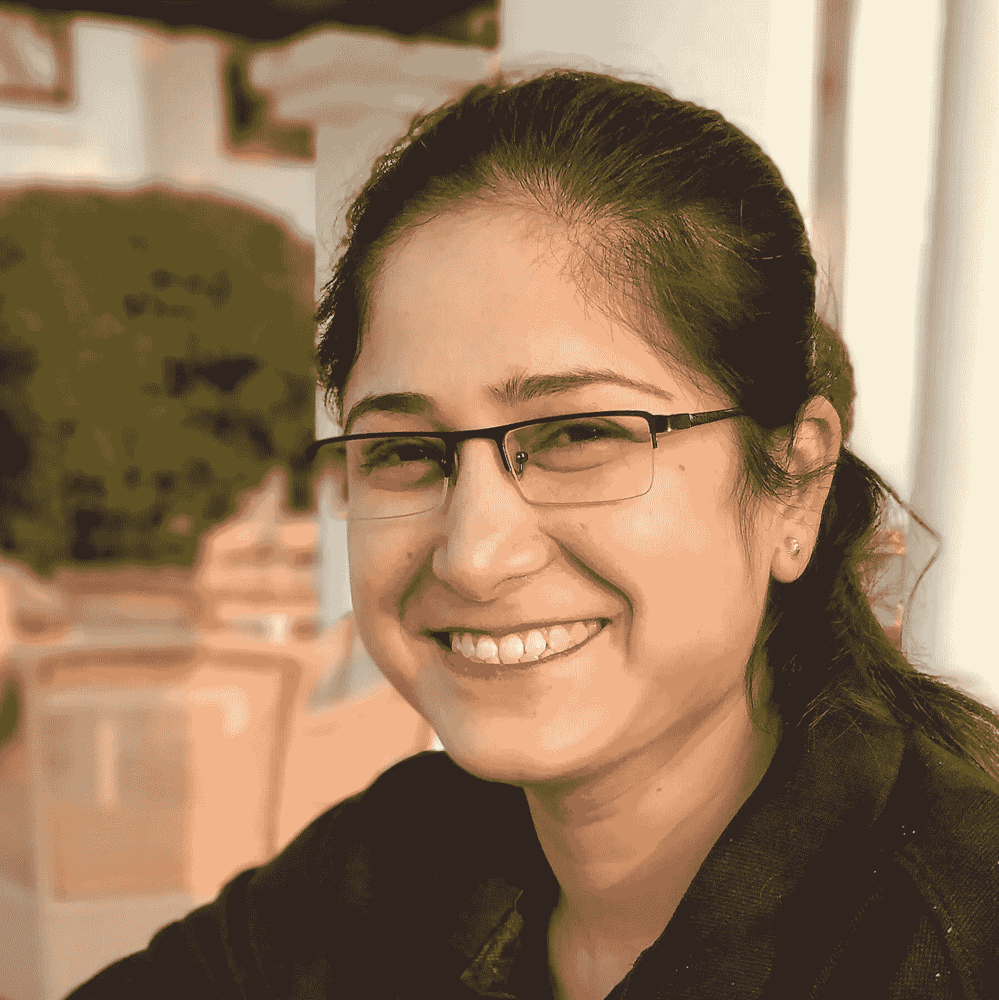

# 与 Vandana 的黑客访谈——以博客的形式记录你的学习

> 原文：<https://infosecwriteups.com/hackinterview-with-vandana-document-your-learning-in-the-form-of-blogs-3b265ec03be1?source=collection_archive---------1----------------------->

## 值此国际妇女节之际，[InfoSec writes](https://medium.com/bugbountywriteup)为您带来了一系列对安全和技术领域女性的独家采访。

[凡达娜·维尔马](https://www.infosecgirls.in/)

*在该系列的第三次采访中，我们邀请到了职业黑客* [*万达纳·维尔马*](https://twitter.com/InfosecVandana) *目前在 IBM 担任安全解决方案架构师。她一直积极鼓励更多女性在信息安全领域发展事业，并且是一个为热衷于网络安全的女性设立的社区*[*Infosec girls*](https://www.infosecgirls.in/)*的主持人。*

1.  你好，凡达纳。很高兴你和我们在一起。请为我们的读者介绍一下你自己。
    我在许多大学和安全会议上发表演讲和举办研讨会，包括 Global AppSec Europe、AppSec USA、BSides Delhi、NullCon、AppSec California 和 c0c0n(喀拉拉邦警察会议)。我是一个名为 OWASP Seasides 的会议的创始人之一。
2.  **祝贺你被提名为印度网络安全领域的顶尖女性。你能告诉我们一些关于你的旅程和你是如何进入 Infosec 的吗？非常感谢，我真的很高兴我被社区认可为印度网络安全女性之一。我在网络安全领域迈出的第一步并不是出于自愿，我在学生时代也没有明确的选择，我想追求网络安全，但我一直想进入科技领域。因为我刚好在我的第一份工作中，也就是我意识到我对信息安全的热情并非常认真地对待它以建立我的职业生涯的时候。**
3.  作为一名安全研究员，你认为你职业生涯的转折点是什么？
    加入 null、owasp、infosecgirls 这样的网络安全社区后，我的职业生涯出现了转折点。这些社区向我介绍了更广泛的安全领域和领域专家。
4.  **在目前的网络安全场景下，你认为需要改变什么？** 网络安全应该从学校本身引入，这在当前的科技时代非常重要。
5.  **黑客的武器库中有哪些不可或缺的工具？** Nmap、whireshark、bursuite/owaspzap 和 kali linux
6.  **如果时光能够倒流，你会做些什么不同的事情吗？** 我希望在职业生涯早期开始，专注于学习计算机科学的基础知识，如操作系统概念、C 编程、汇编语言、网络概念等，然后继续学习信息安全相关的知识。随着我不断地学习，我建议以博客的形式记录你的学习，因为这可以帮助别人学得更快，也可以帮助你保持你的学习。我还建议，在你学习的过程中，以在聚会、会议上演讲、写博客和白皮书的形式回馈社区应该成为你职业生涯的一大部分。
7.  你第一次开始公开演讲是什么时候？从第一次到今天，体验有怎样的变化？我第一次公开演讲是在 owasp/null 班加罗尔会议上。我非常紧张，但社区里的每个人都非常支持我，这给了我信心和信任，让我可以说得越来越多。现在，我已经在多个全球会议上发言，并期待着更多的发言。
8.  **除了黑客之外，你还有哪些爱好？他们是如何塑造你这个人的？** 虽然由于专业工作的性质和社团的努力，我得到的业余时间很少。但每当我有空闲时间，我都喜欢和家人一起度过，像阅读技术文章和书籍一样，围绕网络安全进行一些阅读。
9.  关于你的职业选择，你有没有因为你的性别而觉得自己处于劣势？不，我从未有过这样的感觉。信息安全社区一直非常支持我，我也不觉得我有任何减少。如果有女人这么觉得，我们应该联系。
10.  **你对全球网络安全领域的性别多样性有什么看法？** 人们正在支持性别多元化的大时代。每个组织和会议都支持这项倡议。我还经营着一个名为 **Infosecgirls** 的社区，致力于促进网络的多样性。
11.  **我知道你一定听腻了，但是对新手黑客有什么建议，尤其是女性**？对技术的每个方面都有好奇心的人可能是最合适的人选。你需要建立在好奇心的基础上，需要花很多时间去理解这些技术的工作原理。信息安全专家应该同样精通软件方面。
12.  你还想让我们的读者知道什么，或者你想谈论什么话题？
    信息安全领域有时既迷人又累人。这个领域的关键是，人们应该不断地关注如何通过学习和应用必要的技能来提高安全性。休息，一切(职业晋升等。)落在原地。另外，我想补充一点，一个人应该经常考虑通过教学、写博客等方式来回馈社会。印度有一些很棒的免费开放社区，比如空社区、OWASP 分会等，你可以参与其中。

*关注* [*Infosec 报道*](https://medium.com/bugbountywriteup) *获取更多此类精彩报道。*

 [## 信息安全报道

### 收集了世界上最好的黑客的文章，主题从 bug 奖金和 CTF 到 vulnhub…

medium.com](https://medium.com/bugbountywriteup)