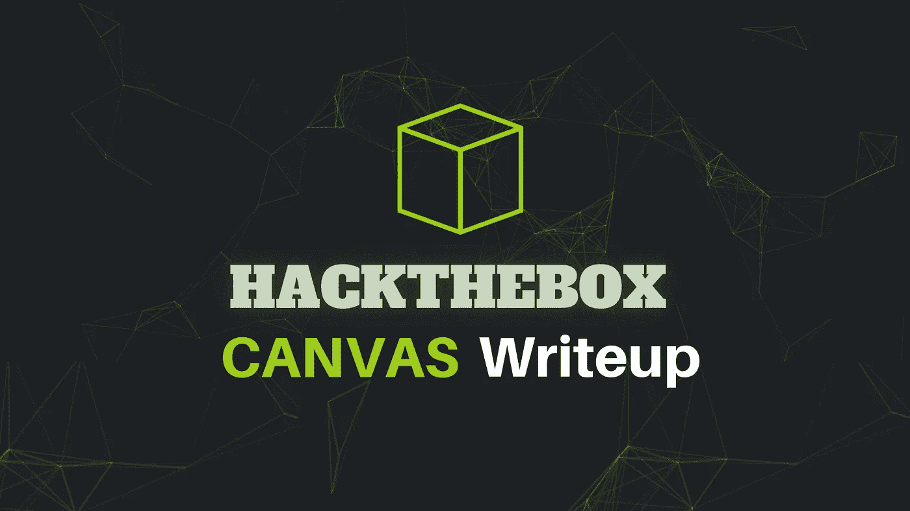
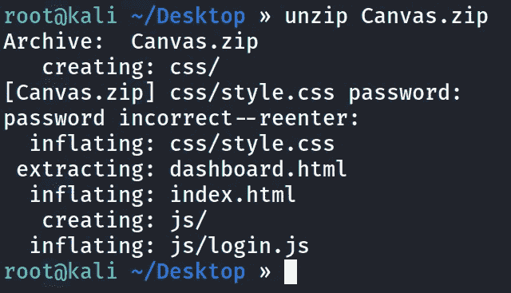
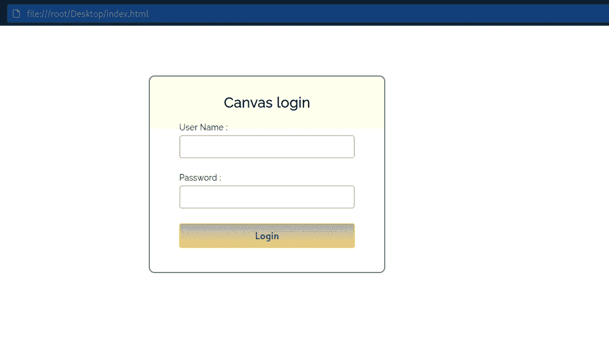
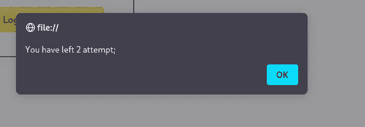
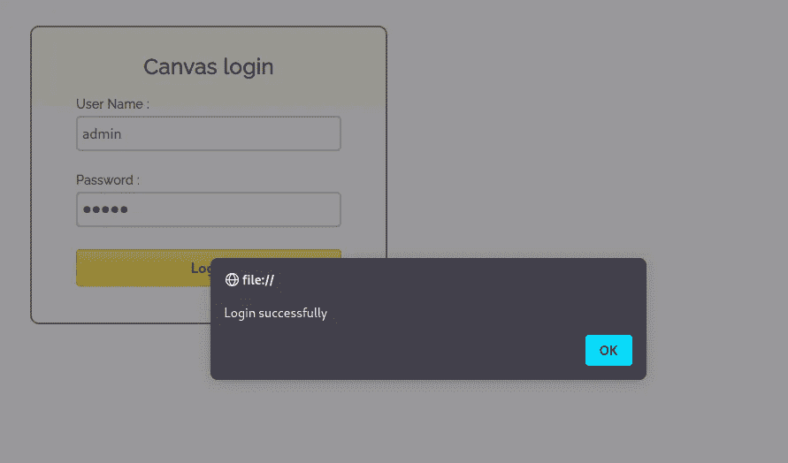
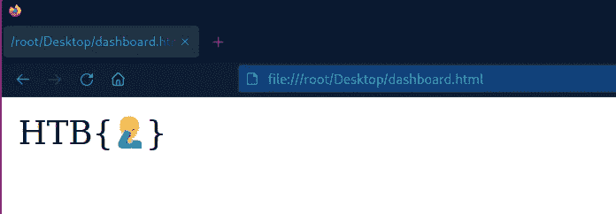
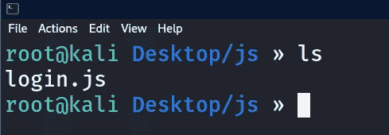
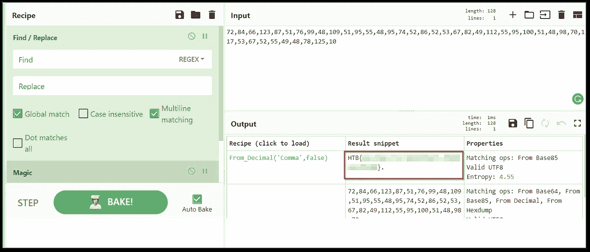

# HackTheBox 画布 CTF 特写

> 原文：<https://infosecwriteups.com/hackthebox-canvas-ctf-writeup-75b0f4682ef5?source=collection_archive---------3----------------------->



**描述:**

我们想更新我们的网站，但我们不能，因为开发人员谁编码今天离开了。你能看一下吗？

**解决方案:**

解压后的文件内容，我们从任务中可以看到我们得到了一些文件，这似乎是网站的文件，包括 javascript，CSS 和 dashborad.html，和 index.html。



起初，我想到让我们在浏览器中打开 index.html，看看到底有什么！！



如您所见，我们得到了一些登录页面，因为所有内容都是静态的，这意味着 javascript 代码将被用于身份验证目的，所以出于好奇，我输入了一些随机的凭证，然后得到了这个弹出窗口:



所以，意味着 javascript 代码被用来计算错误的尝试。三次尝试失败后，用户名和密码字段将变得不可点击。(我们可以让它正常；只需刷新页面)

在尝试计算出信用额度后，我随机使用了通用尝试信用额度 **admin: admin** ，我得到了这个弹出窗口！！



我们被重定向到 dahsboard.html，它包含了旗帜模板，而不是真正的旗帜。



我试图查看源代码和其他 cookies，但是没有任何有趣的东西出现。到目前为止，我还没有分析 javascript 文件。所以我们来分析一下。



打开 javascript 文件后，一切都是乱码。javascript 混淆是为了让它更难理解。所以让我们来讨论一下，我将使用一个在线工具:[https://lelinhtinh.github.io/de4js/](https://lelinhtinh.github.io/de4js/)

现在你可以看到去模糊化的 javascript 源代码:

```
'use strict';

var _0x4e0b = ["toString", "username", "console", "getElementById", "log", "bind", "disabled", "apply", "admin", "prototype", '{}.constructor("return this")( )', " attempt;", "value", "constructor", "You have left ", "trace", 'return /" + this + "/', "table", "length", "__proto__", "error", "Login successfully"];
(function (params, content) {

    var fn = function (selected_image) {
        for (; --selected_image;) {
            params["push"](params["shift"]());
        }
    };

    var build = function () {
        var target = {
            "data": {
                "key": "cookie",
                "value": "timeout"
            },
            "setCookie": function (value, name, path, headers) {
                headers = headers || {};

                var cookie = name + "=" + path;

                var _0x3f3096 = 0;

                var url = 0;
                var key = value["length"];
                for (; url < key; url++) {
                    var i = value[url];

                    cookie = cookie + ("; " + i);
                    var char = value[i];
                    value["push"](char);
                    key = value["length"];
                    if (char !== !![]) {

                        cookie = cookie + ("=" + char);
                    }
                }

                headers["cookie"] = cookie;
            },
            "removeCookie": function () {
                return "dev";
            },
            "getCookie": function (match, href) {
                match = match || function (canCreateDiscussions) {
                    return canCreateDiscussions;
                };
                var v = match(new RegExp("(?:^|; )" + href["replace"](/([.$?*|{}()[]\/+^])/g, "$1") + "=([^;]*)"));

                var test = function (callback, i) {
                    callback(++i);
                };
                return test(fn, content), v ? decodeURIComponent(v[1]) : undefined;
            }
        };

        var init = function () {

            var test = new RegExp("\\w+ *\\(\\) *{\\w+ *['|\"].+['|\"];? *}");
            return test["test"](target["removeCookie"]["toString"]());
        };

        target["updateCookie"] = init;

        var array = "";
        var _0x4ac08e = target["updateCookie"]();
        if (!_0x4ac08e) {
            target["setCookie"](["*"], "counter", 1);
        } else {
            if (_0x4ac08e) {
                array = target["getCookie"](null, "counter");
            } else {
                target["removeCookie"]();
            }
        }
    };
    build();
})(_0x4e0b, 386);

var _0x20fe = function (level, ai_test) {

    level = level - 0;
    var rowsOfColumns = _0x4e0b[level];
    return rowsOfColumns;
};
var _0x35c856 = function () {

    var y$$ = !![];
    return function (ch, myPreferences) {

        var voronoi = y$$ ? function () {

            var getPreferenceKey = _0x20fe;
            if (myPreferences) {
                var bytes = myPreferences[getPreferenceKey("0x11")](ch, arguments);
                return myPreferences = null, bytes;
            }
        } : function () {};
        return y$$ = ![], voronoi;
    };
}();
var _0x4ac08e = _0x35c856(this, function () {

    var checkApplyFunction = function () {

        var check = _0x20fe;
        var B713 = checkApplyFunction[check("0x1")](check("0x4"))()[check("0x1")]("^([^ ]+( +[^ ]+)+)+[^ ]}");
        return !B713["test"](_0x4ac08e);
    };
    return checkApplyFunction();
});
_0x4ac08e();
var _0x4c641a = function () {

    var y$$ = !![];
    return function (ch, myPreferences) {

        var voronoi = y$$ ? function () {

            var getPreferenceKey = _0x20fe;
            if (myPreferences) {
                var bytes = myPreferences[getPreferenceKey("0x11")](ch, arguments);
                return myPreferences = null, bytes;
            }
        } : function () {};
        return y$$ = ![], voronoi;
    };
}();
var _0x2548ec = _0x4c641a(this, function () {

    var rel2Mstr = _0x20fe;
    var el;
    try {
        var render = Function("return (function() " + rel2Mstr("0x14") + ");");
        el = render();
    } catch (_0x57823f) {

        el = window;
    }
    var uids = el[rel2Mstr("0xc")] = el[rel2Mstr("0xc")] || {};

    var levels = [rel2Mstr("0xe"), "warn", "info", rel2Mstr("0x8"), "exception", rel2Mstr("0x5"), rel2Mstr("0x3")];

    var j = 0;
    for (; j < levels[rel2Mstr("0x6")]; j++) {
        var intval = _0x4c641a[rel2Mstr("0x1")][rel2Mstr("0x13")]["bind"](_0x4c641a);
        var i = levels[j];
        var same = uids[i] || intval;
        intval[rel2Mstr("0x7")] = _0x4c641a[rel2Mstr("0xf")](_0x4c641a);
        intval["toString"] = same[rel2Mstr("0xa")][rel2Mstr("0xf")](same);
        uids[i] = intval;
    }
});
_0x2548ec();

var attempt = 3;

function validate() {

    var _ = _0x20fe;
    var oldValue = document["getElementById"]("username")["value"];
    var newValue = document[_("0xd")]("password")[_("0x0")];
    if (oldValue == _("0x12") && newValue == _("0x12")) {
        return alert(_("0x9")), window["location"] = "dashboard.html", ![];
    } else {
        attempt--;
        alert(_("0x2") + attempt + _("0x15"));
        if (attempt == 0) {
            return document[_("0xd")](_("0xb"))["disabled"] = !![], document[_("0xd")]("password")[_("0x10")] = !![], document[_("0xd")]("submit")[_("0x10")] = !![], ![];
        }
    }
}
var res = String["fromCharCode"](72, 84, 66, 123, 87, 51, 76, 99, 48, 109, 51, 95, 55, 48, 95, 74, 52, 86, 52, 53, 67, 82, 49, 112, 55, 95, 100, 51, 48, 98, 70, 117, 53, 67, 52, 55, 49, 48, 78, 125, 10);
```

我试图理解代码，但并没有完全理解

但是最后一个变量`res`并没有在任何地方使用，而且似乎很有趣。其中使用了代码`String.fromCharCode`。我们只需解码它，就能理解那个变量的值是什么

```
72, 84, 66, 123, 87, 51, 76, 99, 48, 109, 51, 95, 55, 48, 95, 74, 52, 86, 52, 53, 67, 82, 49, 112, 55, 95, 100, 51, 48, 98, 70, 117, 53, 67, 52, 55, 49, 48, 78, 125, 10
```

为此，我将使用 **cyberchef** ，首先，让我们替换中间的空格，然后我们可以使用 **magic** 或十进制中的**作为配方**



如你所见，我们得到了我们的旗帜！！！！


谢谢你看我的文章！！👊👊

请在媒体和其他社交平台上关注我，支持我:

[https://surya-dev.medium.com/](https://surya-dev.medium.com/)

[https://twitter.com/kryolite_secure](https://twitter.com/kryolite_secure)/

https://[www.instagram.com/kryolite_security/](http://www.instagram.com/kryolite_security/)

[https://github.com/surya-dev-singh/](https://github.com/surya-dev-singh/)

你们可以订阅我🙌在 YouTube 上:**我在那里发布演练和其他道德黑客相关的视频。**

[](https://www.youtube.com/channel/UCNKXlqfPevPg2Cv1R5YZ6Jw) [## Kryolite 安全公司

### 你好世界！在 Kryolite Security 上，你可以找到关于道德黑客、网络安全、渗透测试、CTFs 的视频…

www.youtube.com](https://www.youtube.com/channel/UCNKXlqfPevPg2Cv1R5YZ6Jw) [](/bitb-browser-in-the-browser-attack-e2008c405701) [## BITB(浏览器中的浏览器)攻击

### 使用 BITB 攻击使网络钓鱼几乎不可检测！！

infosecwriteups.com](/bitb-browser-in-the-browser-attack-e2008c405701) [](https://systemweakness.com/attacktive-directory-tryhackme-90465c2d48ea) [## 攻击目录—利用易受攻击的域控制器[TryHackMe]

### 99%的企业网络使用 AD。但是您能利用易受攻击的域控制器吗？

systemweakness.com](https://systemweakness.com/attacktive-directory-tryhackme-90465c2d48ea) [](/baron-samedit-cve-2021-3156-tryhackme-76d7dedc3cff) [## 巴隆·萨姆迪特·CVE

### 在 Unix Sudo 程序中探索 CVE-2021–3156 的教程演练。

infosecwriteups.com](/baron-samedit-cve-2021-3156-tryhackme-76d7dedc3cff) [](https://systemweakness.com/dirty-pipe-cve-2022-0847-tryhackme-7a652910596b) [## 脏管道:CVE-2022–0847

### 利用 Linux 内核中的脏管道(CVE-2022–0847)的交互式实验室的 tryhackme 演练

systemweakness.com](https://systemweakness.com/dirty-pipe-cve-2022-0847-tryhackme-7a652910596b) [](https://systemweakness.com/nmap-the-complete-guide-part-1-4f6464c94edd) [## Nmap —完整指南[第 1 部分]

### Nmap 侦察—完整指南

systemweakness.com](https://systemweakness.com/nmap-the-complete-guide-part-1-4f6464c94edd) 

## 来自 Infosec 的报道:Infosec 每天都有很多内容，很难跟上。[加入我们的每周简讯](https://weekly.infosecwriteups.com/)以 5 篇文章、4 个线程、3 个视频、2 个 GitHub Repos 和工具以及 1 个工作提醒的形式免费获取所有最新的 Infosec 趋势！