# HackTheBox — Devzat

> 原文：<https://infosecwriteups.com/hackthebox-devzat-4520e4808286?source=collection_archive---------0----------------------->

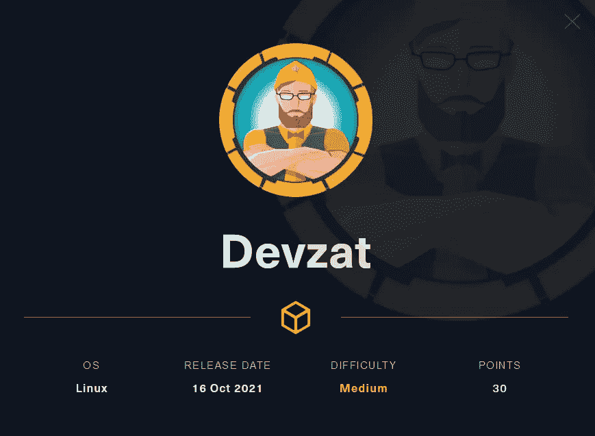

# 列举

## TCP 端口扫描

## Web 服务器枚举

从 nmap 输出中，我们可以看到端口 80 被重定向到 [http://devzat.htb](http://devzat.htb) 。我们需要在 hosts 文件中添加主机名`devzat.htb`才能访问该网站。

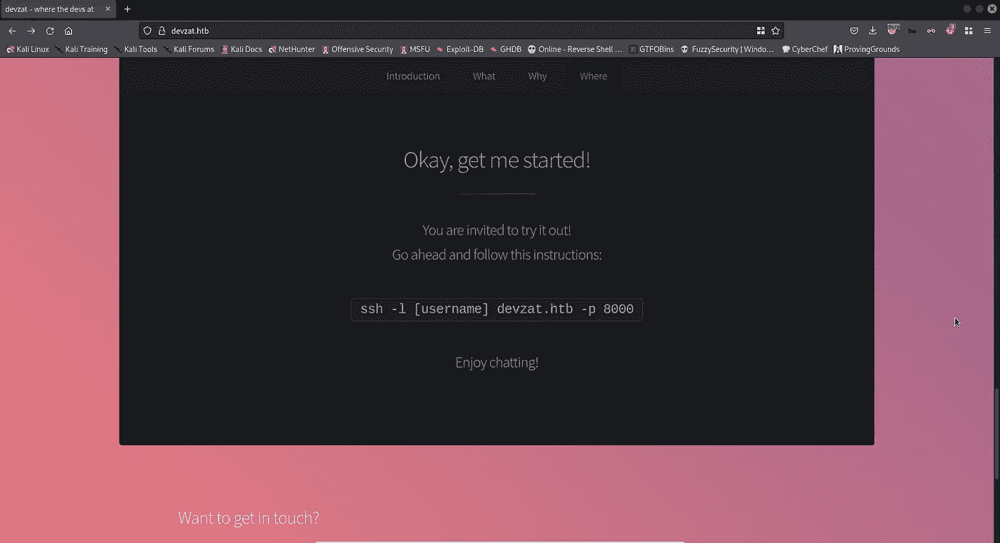

我们还会在网站上收到一封电子邮件:`patrick@devzat.htb`。

## 其他服务枚举

在尝试连接时，我们在端口 8000 有一个 SSH 服务，如果您收到以下错误消息:

```
Unable to negotiate with 10.10.11.118 port 8000: no matching host key type found. Their offer: ssh-rsa
```

将下面一行添加到`/etc/ssh/ssh_config`文件中以解决该问题:

```
HostKeyAlgorithms +ssh-rsa,ssh-dss
```

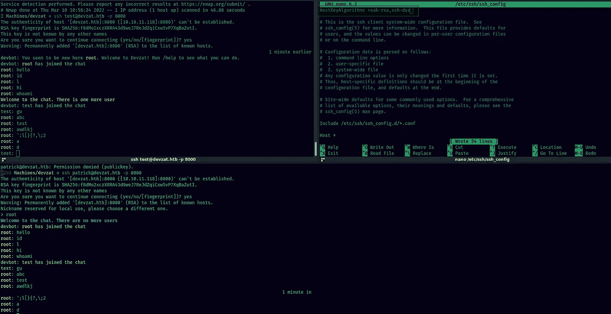

登录后，我们看到这是一个 SSH 聊天室。就是 [devzat](https://github.com/quackduck/devzat) 聊天应用。它接受文本的不同语法选项，例如:

*   `*text*` - >斜体
*   `_text_` - >斜体
*   `**text**` - >加粗
*   `~~text~~` - >删除线
*   `_text_` - >斜体
*   `**text**` - >加粗
*   `~~text~~` - >删除线

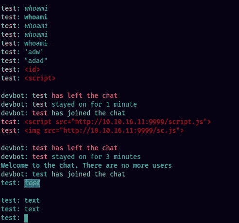

这让我开始寻找其他的方式来处理这些文字。在这个过程中，我发现 URL 是以`[link text](URL of link)`的 markdown 格式显示的，例如:`http://example.com`会变成`[http://example.com](http://example.com)`

在 markdown 中，我们可以用``的语法包含远程图像。我尝试用这种技术获取远程文件，并成功地向我的 python http 服务器发出了服务器端请求。这可能是一个潜在的 SSRF 攻击面。

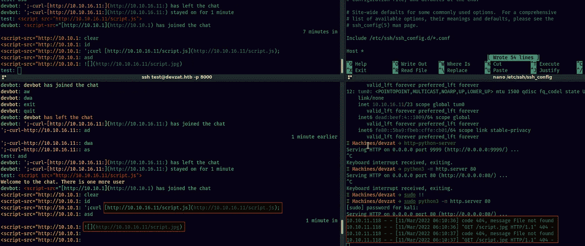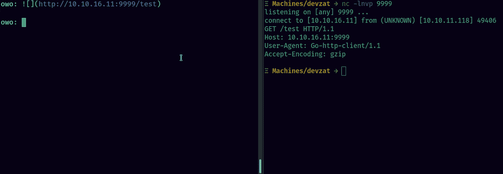

然而，除了发出一个简单的 get 请求，我什么也做不了。所以我将转向子域枚举。

## 子域枚举:

```
ffuf -w /usr/share/seclists/Discovery/DNS/shubs-subdomains.txt -o ffuf-vhosts.out -u [http://devzat.htb](http://devzat.htb) -H -fw 18
```

找到子域:`pets.devzat.htb`

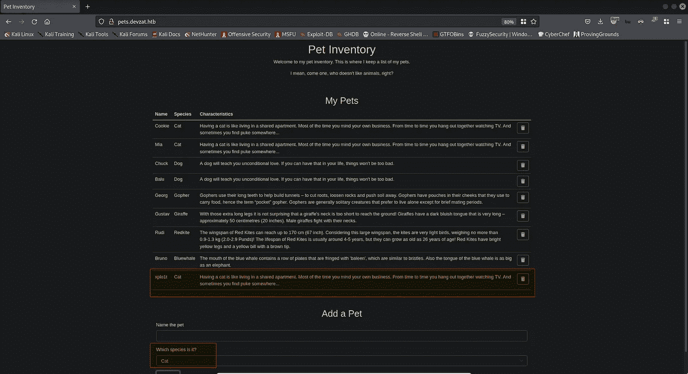

该网站接收宠物名称和宠物种类。宠物种类可以从网站后端包含不同种类的下拉列表中选择。添加宠物后，网站会显示该物种的相关文本。

让我们查看一下 Burpsuite 上的请求:

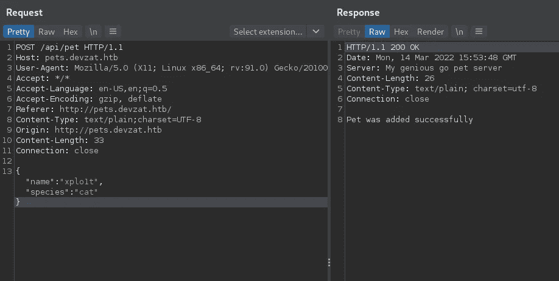

玩转参数后，可以成功获得命令注入。尝试以下有效负载，如下所示的物种参数:

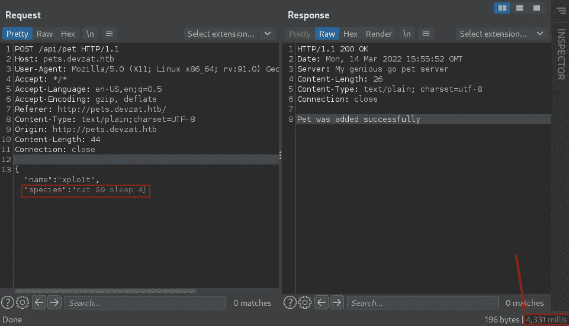

因为我们添加了`sleep 4`命令，所以这个请求需要 4 秒钟。

# 剥削

## 据点

我使用下面的反向 shell 来获得系统上的一个 shell:

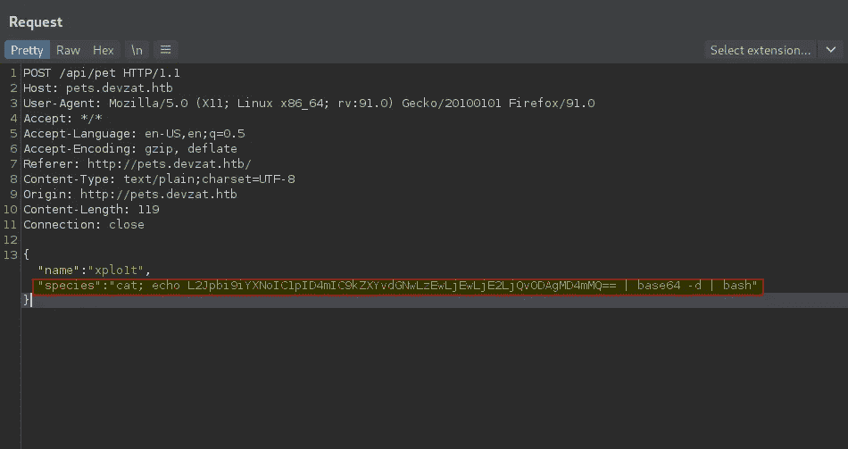

在得到一个简单的 shell 之后，我们可以用在`~/.ssh/id_rsa`找到的 SSH 私有密钥得到一个加密的 SSH shell。

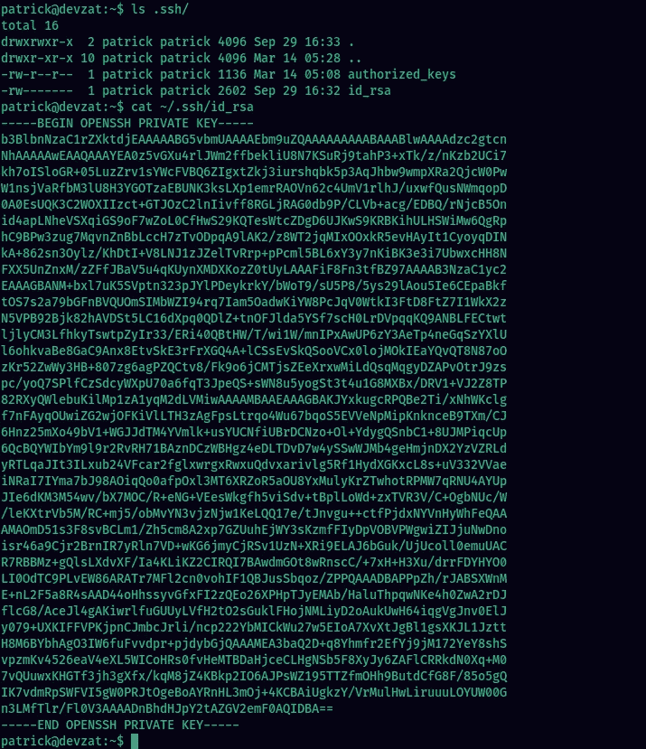

## 横向运动

系统上有两个用户帐户:

*   帕特里克
*   凯瑟琳

以 patrick 和 catherine 的身份登录后，我们在 devzat 聊天室看到了他们的私人聊天记录:

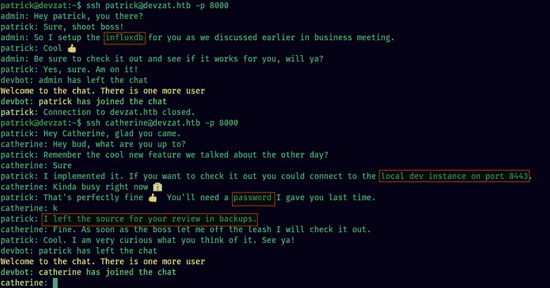

以 patrick 的身份查看 devzat 聊天室的聊天记录，我们可以看到 patrick 和 admin 讨论了 influxdb 实例。

使用`netstat`，我们可以看到 influxdb 端口 8086 是打开的:

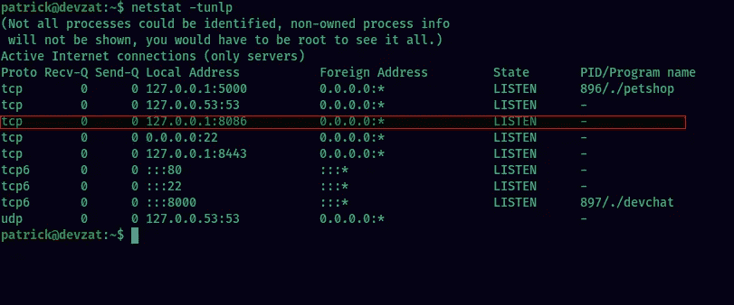

为了识别 InfluxDB 版本，我们使用`curl`并检查`X-Influxdb-Version`头。

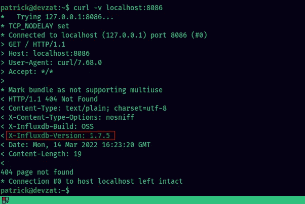

InfluxDB 版本:1.7.5 在谷歌上快速搜索时，我发现该版本因共享机密为空而容易受到 Influxdb 的 authenticate 函数中的身份验证旁路漏洞(CVE-2019–20933)的攻击。

Github[https://Github . com/LorenzoTullini/InfluxDB-Exploit-CVE-2019-20933](https://github.com/LorenzoTullini/InfluxDB-Exploit-CVE-2019-20933)上有一个针对此漏洞的公开攻击

我们将利用这个漏洞。首先，我们需要从端口 8086 到我们的攻击者机器建立一个 SSH 端口。

```
ssh -L 8086:127.0.0.1:8086 patrick@devzat.htb -i patrick-id_rsa -fN
```

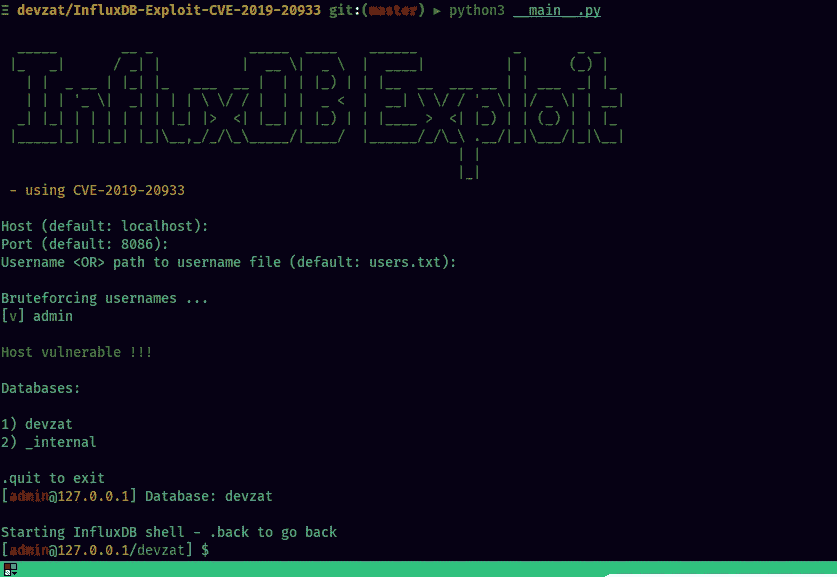

开发 CVE-2019–20933

从数据库中获得了三个用户的密码:

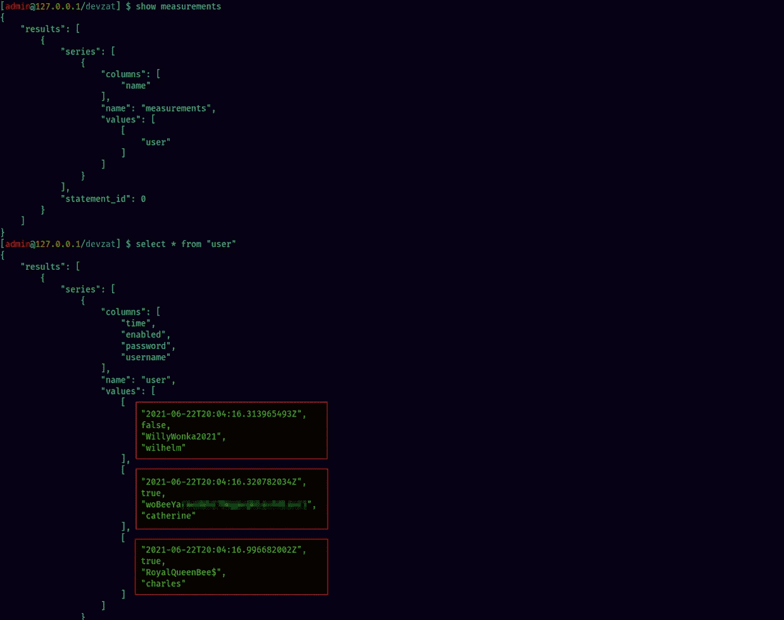

我们可以用用户 catherine 的密码`woBeeYa*************************`切换到她

## 权限提升至 Root 用户

从我们之前找到的聊天记录来看，提到备份中有可用的源代码。

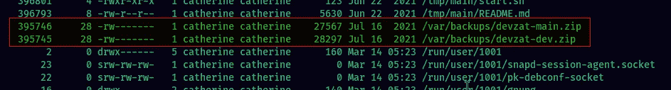

将这些 zip 文件下载到我们的本地机器上，并提取它们。使用`grep`，我们在备份中发现了一个密码`CeilingCat******************`

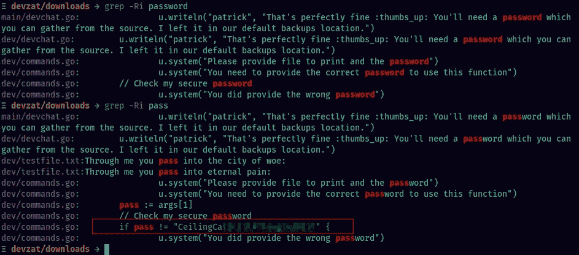

在 devzat 的本地 dev 实例中，我们可以看到一个在端口 8000 上运行的生产环境中不存在的`/file`命令。预览文件需要密码。

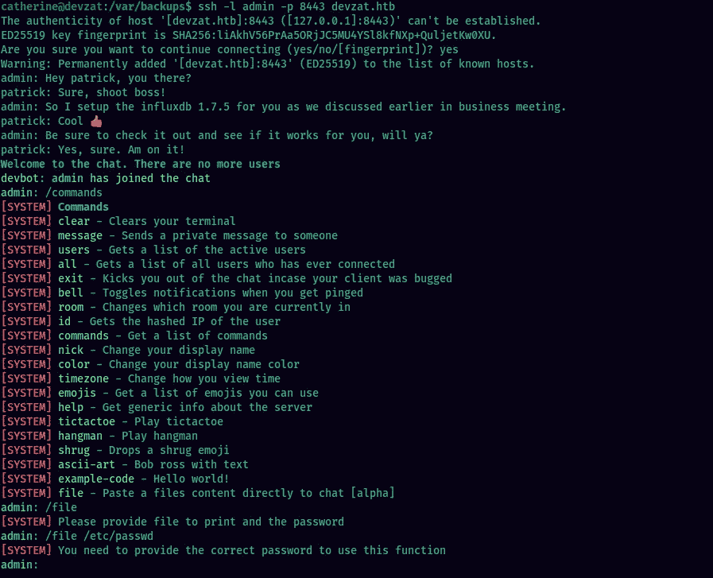

让我们使用在源代码中找到的密码。我们现在有了根用户的私有密钥，可以作为根用户获得一个 shell。

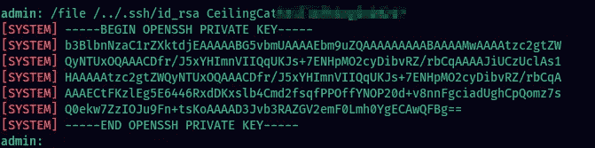

获得一个 shell 作为 root 就像这样简单:

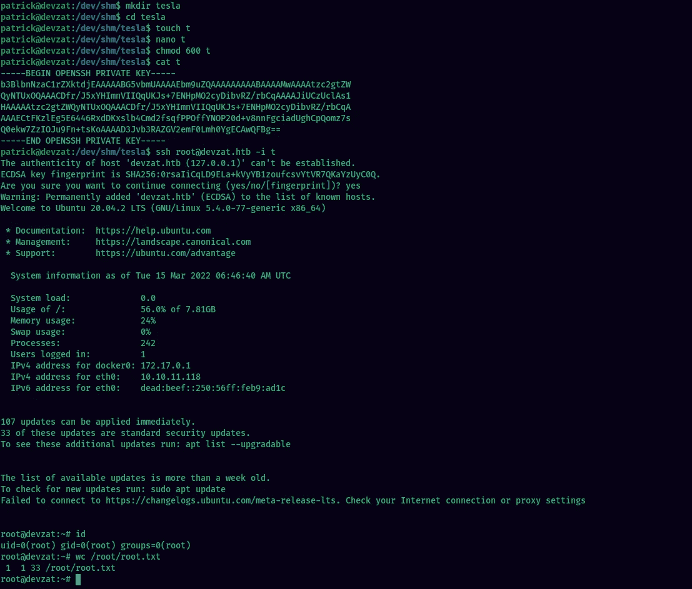

确保最后清理你的文件:)

*最初发表于*[*https://github.com*](https://github.com/xplo1t-sec/CTF/blob/master/HackTheBox/machines/Devzat/README.md)*。*