# HacktheBox 正斜杠向上写

> 原文：<https://infosecwriteups.com/hackthebox-forwardslash-write-up-27b0205db301?source=collection_archive---------0----------------------->

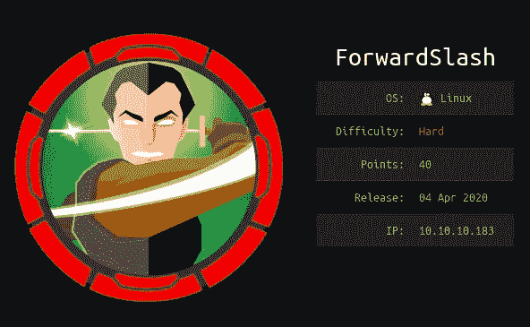

我们将利用 hackthebox 中的正斜杠框。该框包含一些子域枚举，然后我们将通过本地文件包含漏洞来利用它，然后通过获取外壳，我们将进行后期利用来获取根外壳。

# **枚举**

通过使用[nma automator](https://github.com/21y4d/nmapAutomator)进行计数。

cmd = " *。/nampautomator 10 . 10 . 10 . 183 All*

> 10.10.10.183
> 主机的 Nmap 扫描报告已启动(0.25 秒延迟)。
> 
> 端口状态服务版本
> 22/tcp 开放 ssh OpenSSH 7.6p 1 Ubuntu 4 Ubuntu 0.3(Ubuntu Linux；协议 2.0)
> | ssh-hostkey:
> | 2048 3c:3b:EB:54:96:81:1d:da:D7:96:C7:0f:B4:7e:E1:cf(RSA)
> | 256 F6:B3:5f:a2:59:E3:1e:57:35:36:C3:Fe:5e:3d:1f:66(ECD sa)
> | _ 256 1b:deCPE: cpe:/o:linux:linux_kernel
> 
> 已执行服务检测。请向 https://nmap.org/submit/报告任何不正确的结果。
> Nmap 完成:在 13.57 秒内扫描了 1 个 IP 地址(1 台主机启动)

有两个端口打开 22 和 80。在开始开发之前，让我们先了解一下这些端口。22 端口用于 OpenSSH 7.6p 1 版本的 SSH 连接。80 端口非常熟悉，因为它用于托管 web 服务器。

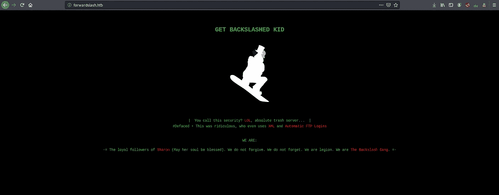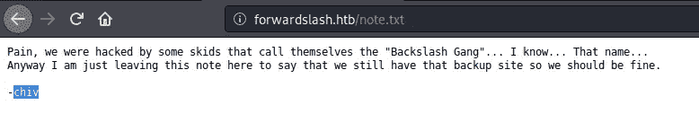

在运行了一些常用的枚举工具如“nikto”、“gobuster”、“dirbuster”之后。但是没有任何线索。因此，我通过运行“wfuzz”来进行子域枚举。

> cmd = " wfuzz—hh 0-H ' Host:fuzz . forward slash . htb '-u http://10 . 10 . 10 . 183/—HC 400-w/usr/share/word-lists/wfuzz/general/common . txt-c "
> 
> –hh =用于隐藏包含以下内容的结果
> 
> –HC =用于隐藏响应为 **400** 的结果
> 
> -c =用于产生结果

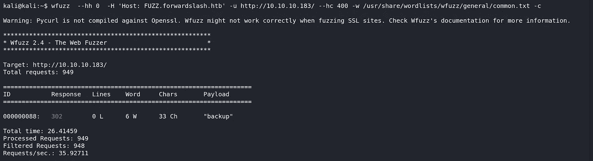

获得新子域名后，将其添加到/etc/hosts 文件"*backup . forward slash . htb*"中。现在枚举新域，我们得到一个登录页面。

通过作为新用户登录，我们可以获得仪表板。观察功能后，我们发现我们可以通过 url 上传图片。它给了我一击 LFI(本地文件包含)漏洞。但是我们需要启用选项卡来将数据输入到 url 文本框中，还需要启用提交按钮。

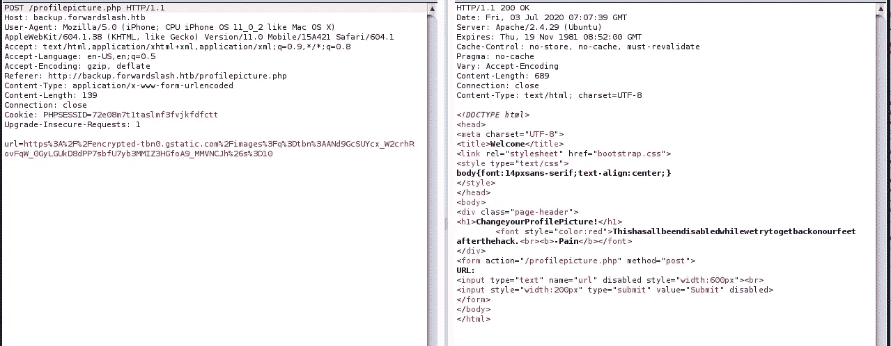

> 尝试用一些常见的有效载荷提取“*文件:///etc/passwd* ”。

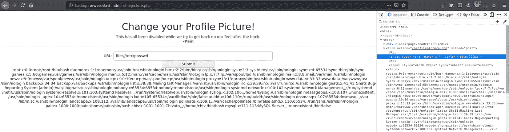

枚举目录时，我们看到了/dev/ directory。但是我们从文件中提取内容时被拒绝了。

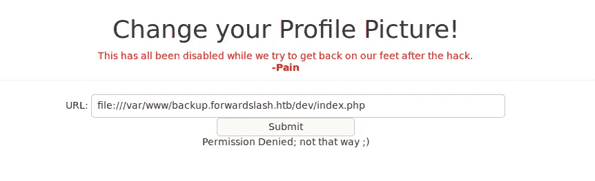

# 剥削

现在，我们可以通过 PHP 包装器包含 PHP 文件来利用该漏洞。你可以从" [PayloadAllThings](https://github.com/swisskyrepo/PayloadsAllTheThings/tree/master/File Inclusion#wrapper-phpfilter) "中了解到。

> payload = "*PHP://filter/convert . base64-encode/resource = file:///var/www/backup . forward slash . htb/dev/index . PHP*"

我们得到了 base64 编码的 index.PHP 文件。解码数据后，我们得到 FTP 登录的凭证。但是因为没有打开 Ftp 端口，所以让我们尝试登录 SSH。

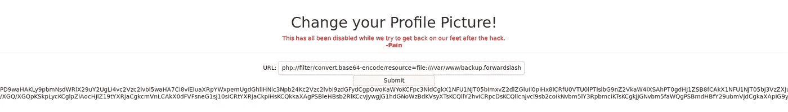

> cmd = ssh chiv@10.10.10.183

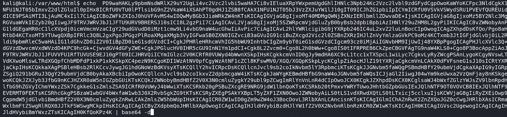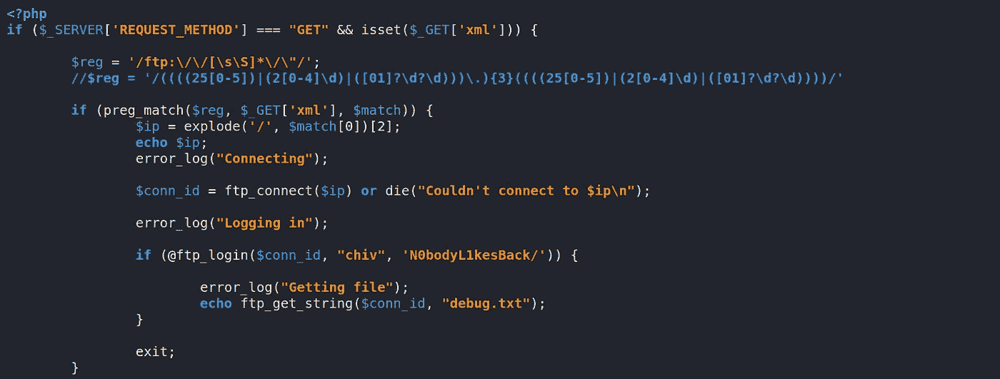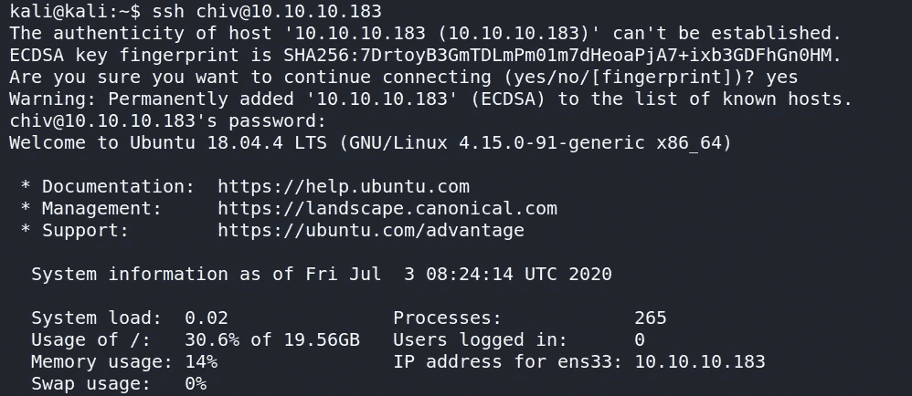

获得外壳后，让我们执行 [LinuxPrivEsc](https://github.com/reider-roque/linpostexp/blob/master/linprivchecker.py) 命令和脚本进行后期开发。运行 [LinEnum](https://github.com/rebootuser/LinEnum) 脚本并查看结果后，发现了一个由 pain 用户拥有的 SUID 二进制文件，还有一个更有趣的东西是一个名为 config 的文件。PHP.bak 也是用户 pain 拥有的。但是没有 r/w/x 的权限。

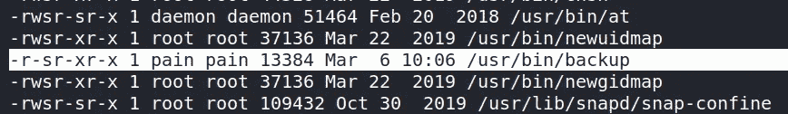

观察备份文件的输出后，我们知道它每次都生成不同的散列。观察输出中的文本，因为它显示“基于时间的备份查看器”，它可能是正在生成的 md5sum，它是当前时间戳，包括秒，这就是为什么它会在您再次运行时发生变化。在这里，我制作了一个 bash 脚本来检查 md5 值是否相同。

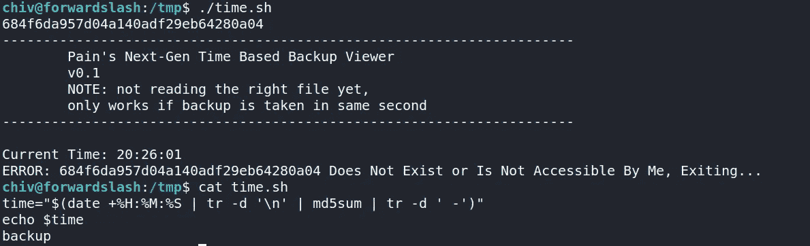

这将创建一个当前时间的时间戳，并将其转换为 md5。然后它将链接配置。PHP.bak 文件，然后运行备份二进制文件。这将向我们显示配置的内容。PHP.bak 文件。

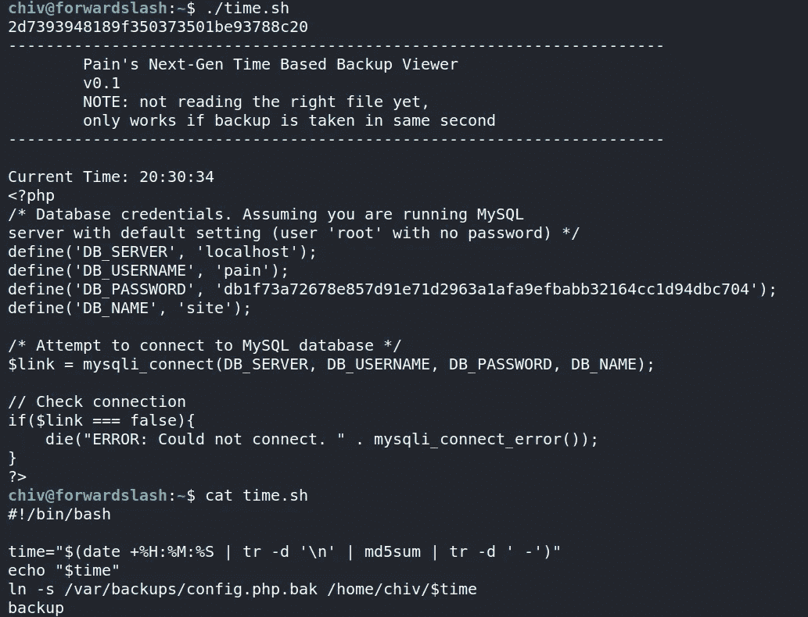

太好了，我们得到了痛苦用户的密码。现在让我们继续后剥削。

# 后期开发

首先，让我们看看什么是我们的权利，可以作为一个根执行。

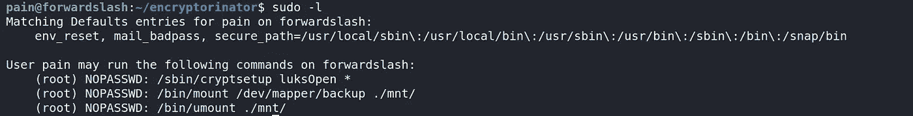

Cryptsetup 通常用于映射备份映像的映像。然后，我们可以将映射的映像挂载到任何目录，并访问其中的文件。

正如我们看到的，有一个 encryptorinator 目录，它对给定的密文进行加密。在分析了代码之后，我对它做了一些修改，在这里。在解密的信息中寻找常用词，如果有，那就是我们获取信息的关键。

运行 decrypt.py 文件后，它给了我密钥和密码。

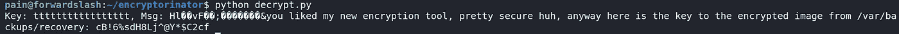

现在，我们可以将映像映射到/var/backups/recovery 中。输入密码" *cB！6%sdH8Lj^@Y*$C2cf*

> cmd = sudo/sbin/cryptsetup luksOpen/var/backups/recovery/encrypted _ backup . img backup

在/dev/mapper 中签入映射的映像后。现在已经创建好了，我们可以将映像挂载到/mnt 目录中。这给了我们根的私钥。

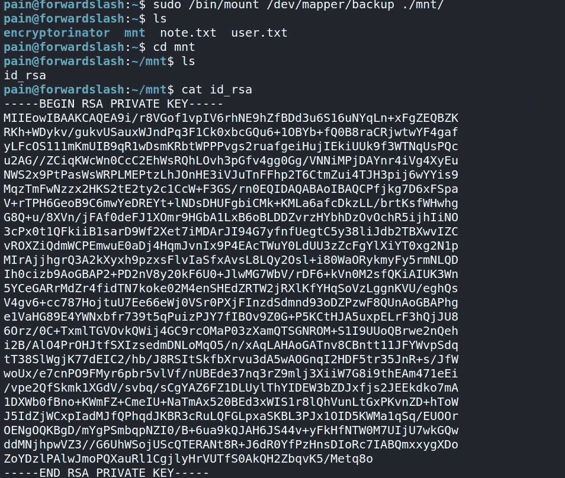

让我们以 root 用户身份登录并获取 root.txt 文件。

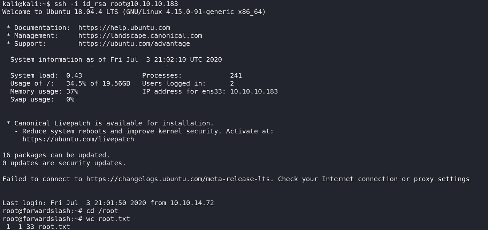

[点击这里](http://buymeacoff.ee/Viston)

[远景](https://www.hackthebox.eu/profile/196419)

# 参考

 [## swisskyrepo/payloads all things

### 文件包含漏洞允许攻击者包含文件，通常利用“动态文件包含”…

github.com](https://github.com/swisskyrepo/PayloadsAllTheThings/tree/master/File%20Inclusion#wrapper-phpfilter)  [## Cryptsetup 漏洞在某些 Linux 系统上授予根外壳访问权限

### 用于在 Linux 发行版上设置加密文件系统的实用程序 cryptsetup 中的漏洞可能允许…

threatpost.com](https://threatpost.com/cryptsetup-vulnerability-grants-root-shell-access-on-some-linux-systems/121963/)  [## 运行迁移导出备份的脚本

### 嗨，我们如何安排每天的迁移导出备份，并将其推送到另一台服务器，备份文件名为…

community.checkpoint.com](https://community.checkpoint.com/t5/General-Management-Topics/Script-to-run-migrate-export-backup/td-p/23512)  [## Python 加密-快速指南

### 密码术是两个用户之间通过编码消息进行通信的艺术。密码学的出现伴随着…

www.tutorialspoint.com](https://www.tutorialspoint.com/cryptography_with_python/cryptography_with_python_quick_guide.htm)