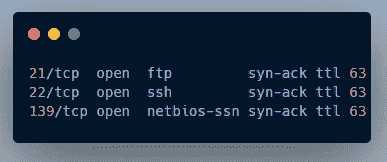
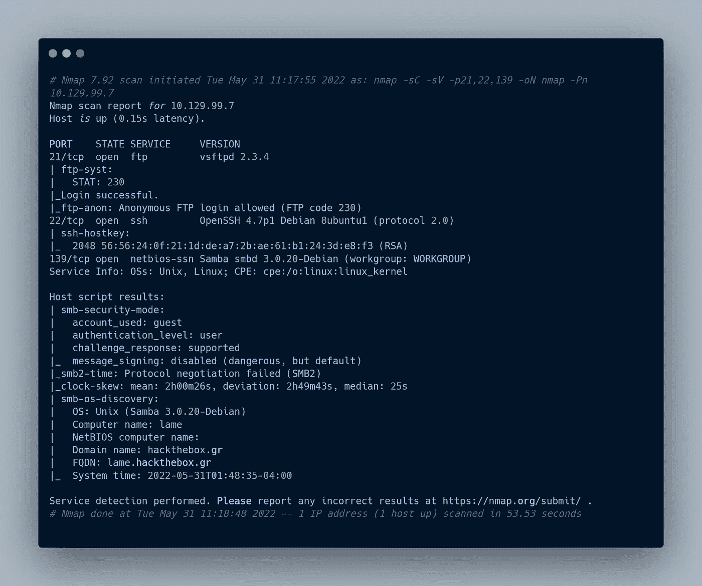
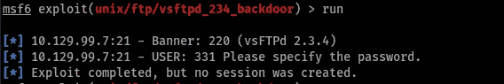
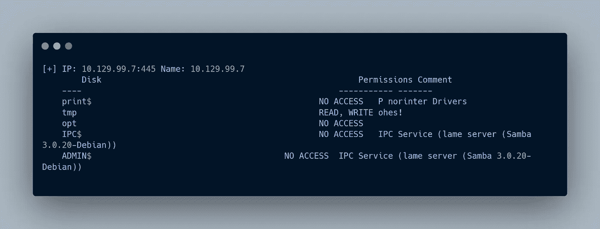
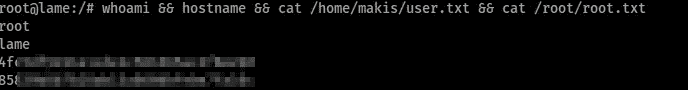

# 黑客盒子:蹩脚

> 原文：<https://infosecwriteups.com/hackthebox-lame-649ae6d39ac6?source=collection_archive---------3----------------------->

## 走查

嘿，伙计们，这一次我将从被认为是简单的 Linux 机器的 [Hackthebox](https://app.hackthebox.com/home) 开始。

事不宜迟，我们来开发一下。


# 首字母:

```
export IP=10.129.99.7
```

## 端口扫描

```
rustscan -a $IP --ulimit 5000 | ports.txt
```

有三个开放的端口，即 21 (ftp)、22 (ssh)、139 (samba)



rustscan 结果

## nmap

```
nmap -sC -sV -p21,22,139 -oN namp $IP -Pn
```



nmap 结果

# 剥削

## 文件传送协议

我发现 ftp 允许匿名登录，所以我登录了 FTP 服务

```
ftp $IP
```

但是没有文件。

后来我检查了 **vsftpd 2.3.4** 漏洞，发现了一个名为“**后门**的漏洞。我使用了 Metasploit 和其他脚本，但未能获得会话/shell。



无法利用 FTP

后来我在模块描述中发现

> 该模块利用了添加到 VSFTPD 下载档案中的恶意后门。根据现有的最新信息，这个后门在 2011 年 6 月 30 日到 2011 年 7 月 1 日之间被引入 vsftpd-2.3.4.tar.gz 档案馆。这个后门在 2011 年 7 月 3 日被移除。

## 桑巴舞

因为 FTP 漏洞没有用，而且我没有 ssh 证书，所以我选择了 samba。有一个可写的共享名 tmp，其某些文件不可访问。



中小企业股份

发现 samba 名为“用户名映射脚本”命令执行的漏洞

我从[**GitHub**](https://github.com/amriunix/CVE-2007-2447) 拿到了漏洞利用脚本并修改了有效载荷(并添加了一些微调 XD)。

脚本的语法是

```
./username.py <rhosts> <rport> <lhost> <lport>
```

→启动监听器

→运行脚本

并以贝壳为根。不需要特权(:

# 证明



用户和 root.txt

# 结尾部分

这就是这部机器的全部内容，我们将在下一篇博客中见面。再见，快乐黑客 o7